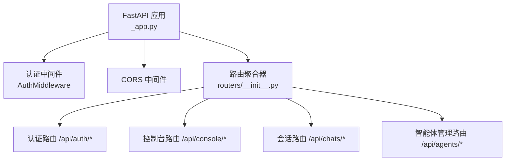
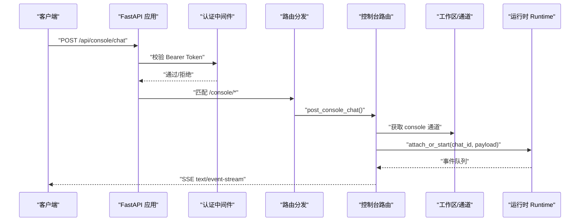
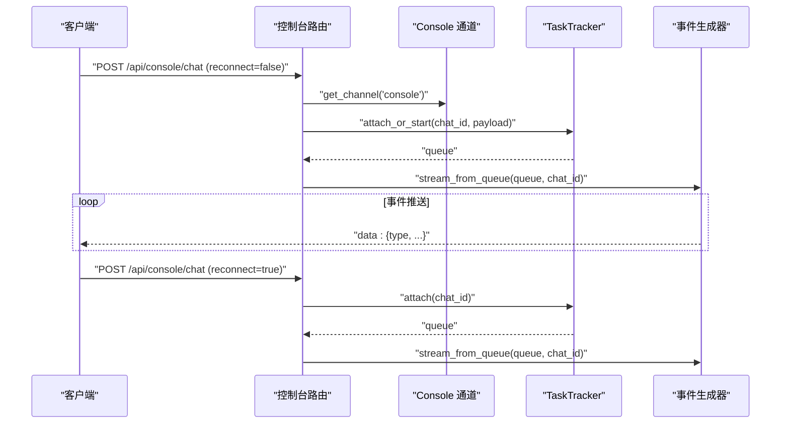
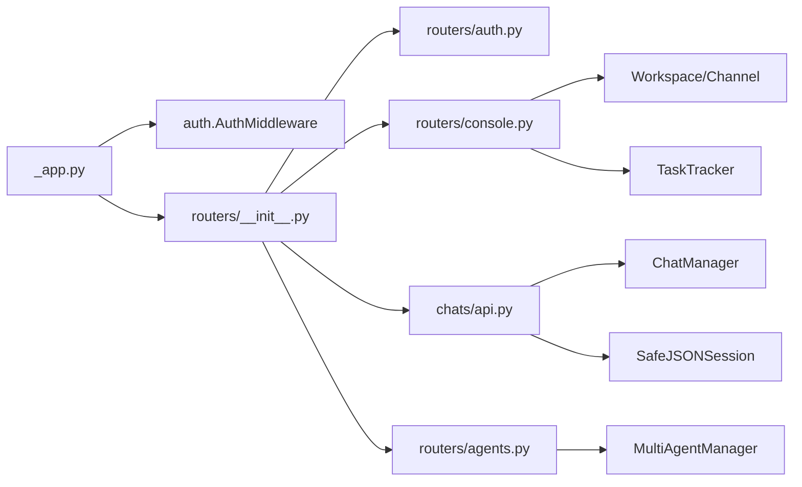

# API 接口文档

<cite>
**本文引用的文件**   
- [src/qwenpaw/app/_app.py](file://src/qwenpaw/app/_app.py)
- [src/qwenpaw/app/auth.py](file://src/qwenpaw/app/auth.py)
- [src/qwenpaw/app/routers/__init__.py](file://src/qwenpaw/app/routers/__init__.py)
- [src/qwenpaw/app/routers/auth.py](file://src/qwenpaw/app/routers/auth.py)
- [src/qwenpaw/app/routers/console.py](file://src/qwenpaw/app/routers/console.py)
- [src/qwenpaw/app/chats/api.py](file://src/qwenpaw/app/chats/api.py)
- [src/qwenpaw/app/routers/agents.py](file://src/qwenpaw/app/routers/agents.py)
</cite>

## 目录
1. [简介](#简介)
2. [项目结构](#项目结构)
3. [核心组件](#核心组件)
4. [架构总览](#架构总览)
5. [详细组件分析](#详细组件分析)
6. [依赖关系分析](#依赖关系分析)
7. [性能考虑](#性能考虑)
8. [故障排查指南](#故障排查指南)
9. [结论](#结论)
10. [附录](#附录)

## 简介
本文件为 QwenPaw 后端对外暴露的 API 接口文档，覆盖以下协议与能力：
- RESTful API：HTTP 方法、URL 模式、请求/响应模型、认证方式、错误码与限流策略。
- SSE（Server-Sent Events）实时流：用于控制台聊天流式输出与重连机制。
- 后台任务：提交异步聊天任务并轮询状态。
- 安全与鉴权：基于 Bearer Token 的无状态鉴权、令牌撤销、白名单与可信代理 IP 解析。
- 版本信息：OpenAPI/Swagger 文档开关与默认路径。

说明：
- 本项目未实现 WebSocket 或 Socket 二进制协议；当前提供的是 HTTP + SSE 的实时交互方案。
- IPC/管道通信不在对外 API 范畴内，本文不展开。

## 项目结构
后端采用 FastAPI 框架，应用入口在 _app.py 中创建 FastAPI 实例并挂载中间件与路由。所有业务路由通过 routers 聚合注册。

图表来源
- [src/qwenpaw/app/_app.py:787-800](file://src/qwenpaw/app/_app.py#L787-L800)
- [src/qwenpaw/app/routers/__init__.py:36-66](file://src/qwenpaw/app/routers/__init__.py#L36-L66)

章节来源
- [src/qwenpaw/app/_app.py:787-800](file://src/qwenpaw/app/_app.py#L787-L800)
- [src/qwenpaw/app/routers/__init__.py:36-66](file://src/qwenpaw/app/routers/__init__.py#L36-L66)

## 核心组件
- 应用生命周期与启动流程：初始化日志、迁移、插件系统、多智能体管理器、TokenUsageManager 等。
- 认证与鉴权：密码哈希、HMAC 签名令牌、黑名单撤销、客户端 IP 解析与可信代理校验。
- 路由聚合：将各功能模块路由统一挂载到 /api 前缀下。
- 控制台与聊天：SSE 流式输出、后台任务、消息推送与收件箱事件。
- 会话管理：按 chat_id 列出、查询、更新、删除会话历史。
- 智能体管理：创建、更新、删除、启用/禁用、排序等。

章节来源
- [src/qwenpaw/app/_app.py:162-487](file://src/qwenpaw/app/_app.py#L162-L487)
- [src/qwenpaw/app/auth.py:1-120](file://src/qwenpaw/app/auth.py#L1-L120)
- [src/qwenpaw/app/routers/__init__.py:36-66](file://src/qwenpaw/app/routers/__init__.py#L36-L66)

## 架构总览
下图展示了从客户端到后端的典型调用链，包括认证、路由分发、工作区与运行时执行、以及 SSE 流式返回。

图表来源
- [src/qwenpaw/app/_app.py:787-800](file://src/qwenpaw/app/_app.py#L787-L800)
- [src/qwenpaw/app/routers/console.py:181-270](file://src/qwenpaw/app/routers/console.py#L181-L270)

## 详细组件分析

### 认证与安全（REST）
- 基础认证
  - 登录 POST /api/auth/login
    - 请求体：username、password、expires_in（可选，正数秒；0/-1 表示永久）
    - 成功：返回 token、username
    - 失败：401 无效凭据；423 账户/IP 被锁定；429 请求过多
  - 注册 POST /api/auth/register
    - 仅允许首次注册；成功后返回 token、username
  - 状态 GET /api/auth/status
    - 返回 enabled、has_users
  - 验证 GET /api/auth/verify
    - 需要 Authorization: Bearer <token>
    - 返回 valid、username
  - 更新资料 POST /api/auth/update-profile
    - 需当前密码；可改用户名/密码；成功后返回新 token
  - 撤销单个令牌 POST /api/auth/revoke-token
    - 支持撤销指定令牌或当前令牌
  - 撤销全部令牌 POST /api/auth/revoke-all-tokens
    - 旋转 JWT 密钥使旧令牌失效

- 鉴权中间件
  - 对 /api/* 路径默认要求 Bearer Token
  - 支持从 Query 参数 token 读取（便于 WebSocket 升级场景）
  - 支持 allow_no_auth_hosts 白名单与 trusted_proxies 可信代理解析
  - 公开路径与静态资源前缀无需鉴权

- 速率限制与账号锁定
  - 登录接口集成 rate_limiter：按 IP 与用户名维度记录失败次数
  - 达到阈值触发 423 临时锁定；超过频率触发 429

- 安全要点
  - 密码使用盐值 SHA-256 存储
  - 令牌 HMAC-SHA256 签名，含 jti 支持单条撤销
  - 敏感字段加密持久化，权限控制 auth.json 文件权限

章节来源
- [src/qwenpaw/app/routers/auth.py:51-104](file://src/qwenpaw/app/routers/auth.py#L51-L104)
- [src/qwenpaw/app/routers/auth.py:106-141](file://src/qwenpaw/app/routers/auth.py#L106-L141)
- [src/qwenpaw/app/routers/auth.py:144-171](file://src/qwenpaw/app/routers/auth.py#L144-L171)
- [src/qwenpaw/app/routers/auth.py:183-235](file://src/qwenpaw/app/routers/auth.py#L183-L235)
- [src/qwenpaw/app/routers/auth.py:244-289](file://src/qwenpaw/app/routers/auth.py#L244-L289)
- [src/qwenpaw/app/routers/auth.py:292-325](file://src/qwenpaw/app/routers/auth.py#L292-L325)
- [src/qwenpaw/app/auth.py:689-762](file://src/qwenpaw/app/auth.py#L689-L762)
- [src/qwenpaw/app/auth.py:569-686](file://src/qwenpaw/app/auth.py#L569-L686)
- [src/qwenpaw/app/auth.py:99-114](file://src/qwenpaw/app/auth.py#L99-L114)
- [src/qwenpaw/app/auth.py:132-169](file://src/qwenpaw/app/auth.py#L132-L169)
- [src/qwenpaw/app/auth.py:212-260](file://src/qwenpaw/app/auth.py#L212-L260)
- [src/qwenpaw/app/auth.py:267-333](file://src/qwenpaw/app/auth.py#L267-L333)

### 控制台与聊天（REST + SSE）
- 流式聊天 POST /api/console/chat
  - 请求体：AgentRequest 或兼容字典（包含 channel、user_id、session_id、input[]、request_context 等）
  - 支持 reconnect=true 以重连已有运行中的流
  - 响应：text/event-stream，逐条 SSE data: JSON
  - 错误：异常时返回 data: {"error": "..."}
- 停止聊天 POST /api/console/chat/stop?chat_id=...
  - 支持传入 chat_id 或 session_id（自动解析）
- 上传文件 POST /api/console/upload
  - multipart/form-data，保存至 console 媒体目录，返回 url、file_name、size
- 调试日志 GET /api/console/debug/backend-logs
  - 返回项目日志尾部内容（受 lines 限制）
- 推送消息与审批 GET /api/console/push-messages
  - 返回最近消息与所有待处理审批（可按 session_id 过滤）
- 收件箱事件 GET /api/console/inbox/events
  - 分页、筛选（source_type、status、agent_id、unread_only）
- 标记已读 POST /api/console/inbox/read
  - all=true 标记全部已读，否则按 event_ids
- 删除事件 DELETE /api/console/inbox/events/{event_id}
- 查看追踪 GET /api/console/inbox/traces/{run_id}

- 后台任务
  - 提交任务 POST /api/console/chat/task
    - 返回 task_id
  - 查询状态 GET /api/console/chat/task/{task_id}
    - 返回 status、started_at、finished_at、result（完成时）

章节来源
- [src/qwenpaw/app/routers/console.py:181-270](file://src/qwenpaw/app/routers/console.py#L181-L270)
- [src/qwenpaw/app/routers/console.py:273-319](file://src/qwenpaw/app/routers/console.py#L273-L319)
- [src/qwenpaw/app/routers/console.py:322-349](file://src/qwenpaw/app/routers/console.py#L322-L349)
- [src/qwenpaw/app/routers/console.py:352-386](file://src/qwenpaw/app/routers/console.py#L352-L386)
- [src/qwenpaw/app/routers/console.py:388-441](file://src/qwenpaw/app/routers/console.py#L388-L441)
- [src/qwenpaw/app/routers/console.py:444-474](file://src/qwenpaw/app/routers/console.py#L444-L474)
- [src/qwenpaw/app/routers/console.py:477-505](file://src/qwenpaw/app/routers/console.py#L477-L505)
- [src/qwenpaw/app/routers/console.py:522-618](file://src/qwenpaw/app/routers/console.py#L522-L618)
- [src/qwenpaw/app/routers/console.py:621-641](file://src/qwenpaw/app/routers/console.py#L621-L641)

#### SSE 流式聊天时序图

图表来源
- [src/qwenpaw/app/routers/console.py:181-270](file://src/qwenpaw/app/routers/console.py#L181-L270)

### 会话管理（REST）
- 列表 GET /api/chats
  - 查询参数：user_id、channel
  - 返回 ChatSpec 列表，附带运行状态
- 新建 POST /api/chats
  - 请求体：ChatSpec（name、session_id、user_id、channel、meta）
  - 服务器自动生成 chat_id
- 批量删除 POST /api/chats/batch-delete
  - 请求体：chat_ids 数组
- 详情 GET /api/chats/{chat_id}
  - 返回 ChatHistory（messages、status）
- 更新 PUT /api/chats/{chat_id}
  - 请求体：ChatUpdate（部分字段）
- 删除 DELETE /api/chats/{chat_id}

章节来源
- [src/qwenpaw/app/chats/api.py:70-90](file://src/qwenpaw/app/chats/api.py#L70-L90)
- [src/qwenpaw/app/chats/api.py:93-118](file://src/qwenpaw/app/chats/api.py#L93-L118)
- [src/qwenpaw/app/chats/api.py:121-136](file://src/qwenpaw/app/chats/api.py#L121-L136)
- [src/qwenpaw/app/chats/api.py:139-197](file://src/qwenpaw/app/chats/api.py#L139-L197)
- [src/qwenpaw/app/chats/api.py:200-225](file://src/qwenpaw/app/chats/api.py#L200-L225)
- [src/qwenpaw/app/chats/api.py:228-254](file://src/qwenpaw/app/chats/api.py#L228-L254)

### 智能体管理（REST）
- 列表 GET /api/agents
  - 返回 AgentSummary 列表（id、name、description、workspace_dir、enabled、active_model）
- 排序 PUT /api/agents/order
  - 请求体：agent_ids 全量有序列表
- 详情 GET /api/agents/{agentId}
- 新建 POST /api/agents
  - 请求体：CreateAgentRequest（id 可选，自动短 UUID）
  - 自动初始化工作区、模板、心跳文件、技能包
- 更新 PUT /api/agents/{agentId}
  - 触发热重载
- 删除 DELETE /api/agents/{agentId}
  - 禁止删除 default
- 切换启用 PATCH /api/agents/{agentId}/toggle
  - 启用时尝试启动智能体

章节来源
- [src/qwenpaw/app/routers/agents.py:157-205](file://src/qwenpaw/app/routers/agents.py#L157-L205)
- [src/qwenpaw/app/routers/agents.py:208-235](file://src/qwenpaw/app/routers/agents.py#L208-L235)
- [src/qwenpaw/app/routers/agents.py:238-252](file://src/qwenpaw/app/routers/agents.py#L238-L252)
- [src/qwenpaw/app/routers/agents.py:272-364](file://src/qwenpaw/app/routers/agents.py#L272-L364)
- [src/qwenpaw/app/routers/agents.py:367-398](file://src/qwenpaw/app/routers/agents.py#L367-L398)
- [src/qwenpaw/app/routers/agents.py:401-432](file://src/qwenpaw/app/routers/agents.py#L401-L432)
- [src/qwenpaw/app/routers/agents.py:435-484](file://src/qwenpaw/app/routers/agents.py#L435-L484)

## 依赖关系分析
- 应用层依赖
  - FastAPI 应用装配中间件与路由
  - 认证中间件依赖配置（trusted_proxies、allow_no_auth_hosts）
  - 控制台路由依赖工作区通道与 TaskTracker
  - 会话路由依赖 ChatManager 与 SafeJSONSession
  - 智能体路由依赖配置加载与 MultiAgentManager

图表来源
- [src/qwenpaw/app/_app.py:787-800](file://src/qwenpaw/app/_app.py#L787-L800)
- [src/qwenpaw/app/routers/__init__.py:36-66](file://src/qwenpaw/app/routers/__init__.py#L36-L66)
- [src/qwenpaw/app/routers/console.py:181-270](file://src/qwenpaw/app/routers/console.py#L181-L270)
- [src/qwenpaw/app/chats/api.py:27-67](file://src/qwenpaw/app/chats/api.py#L27-L67)
- [src/qwenpaw/app/routers/agents.py:103-110](file://src/qwenpaw/app/routers/agents.py#L103-L110)

章节来源
- [src/qwenpaw/app/_app.py:787-800](file://src/qwenpaw/app/_app.py#L787-L800)
- [src/qwenpaw/app/routers/__init__.py:36-66](file://src/qwenpaw/app/routers/__init__.py#L36-L66)

## 性能考虑
- 启动优化：快速同步初始化与后台异步初始化分离，尽快接受请求。
- SSE 流式传输：避免阻塞标题生成等耗时操作，使用独立任务。
- 令牌校验：内存级 HMAC 校验，O(1) 黑名单查找。
- 日志读取：尾部 N 行与最大字节限制，防止大文件导致内存峰值。
- 后台任务：超时保护与取消机制，避免僵尸任务。

[本节为通用指导，不直接分析具体文件]

## 故障排查指南
- 认证问题
  - 检查是否启用认证（环境变量）、用户是否已注册、Bearer Token 是否正确携带。
  - 若出现 423/429，确认 IP 是否被锁定或触发频率限制。
- SSE 连接中断
  - 使用 reconnect=true 重连；确保 chat_id 正确。
  - 关注服务端返回的错误事件 data: {"error": "..."}。
- 后台任务未完成
  - 通过 GET /api/console/chat/task/{task_id} 查询状态与结果。
  - 注意 timeout 设置与任务取消情况。
- 调试日志
  - 使用 GET /api/console/debug/backend-logs 拉取后端日志尾部。

章节来源
- [src/qwenpaw/app/routers/auth.py:51-104](file://src/qwenpaw/app/routers/auth.py#L51-L104)
- [src/qwenpaw/app/routers/console.py:181-270](file://src/qwenpaw/app/routers/console.py#L181-L270)
- [src/qwenpaw/app/routers/console.py:522-618](file://src/qwenpaw/app/routers/console.py#L522-L618)
- [src/qwenpaw/app/routers/console.py:352-386](file://src/qwenpaw/app/routers/console.py#L352-L386)

## 结论
QwenPaw 的对外 API 以 REST 为主，辅以 SSE 实现低延迟的实时交互。认证体系完善，具备令牌撤销、IP 白名单与可信代理解析能力。控制台提供了完整的聊天、文件上传、后台任务与调试工具。会话与智能体管理覆盖了常见运维需求。建议在生产环境开启认证、合理配置可信代理与速率限制，并结合 OpenAPI 文档进行联调与监控。

[本节为总结性内容，不直接分析具体文件]

## 附录

### 版本与文档
- OpenAPI/Swagger 文档
  - 路径：/openapi.json、/docs、/redoc（由 DOCS_ENABLED 控制）
  - 可通过浏览器访问交互式文档页面

章节来源
- [src/qwenpaw/app/_app.py:787-792](file://src/qwenpaw/app/_app.py#L787-L792)

### 常用用例与客户端实现指南
- 登录与鉴权
  - 先调用 /api/auth/login 获取 token，后续请求在 Authorization 头携带 Bearer token。
- 流式聊天
  - 发起 POST /api/console/chat，建立 SSE 连接；如需重连，再次发起并设置 reconnect=true。
  - 使用 /api/console/chat/stop 主动终止运行中的任务。
- 后台任务
  - 提交任务后轮询 /api/console/chat/task/{task_id}，直到 status 为 finished。
- 会话管理
  - 使用 /api/chats 系列接口维护会话元数据与历史。
- 智能体管理
  - 使用 /api/agents 系列接口创建、更新、删除与启停智能体。

[本节为通用指导，不直接分析具体文件]

### 错误处理策略
- 认证相关：401 未认证/无效令牌；403 未启用或未注册；423 锁定；429 限流。
- 资源不存在：404（如 chat、task、inbox event）。
- 服务不可用：503（如 console 通道未就绪）。
- 服务器内部错误：500（如多智能体管理器未初始化）。

章节来源
- [src/qwenpaw/app/routers/auth.py:51-104](file://src/qwenpaw/app/routers/auth.py#L51-L104)
- [src/qwenpaw/app/routers/console.py:181-270](file://src/qwenpaw/app/routers/console.py#L181-L270)
- [src/qwenpaw/app/routers/console.py:522-618](file://src/qwenpaw/app/routers/console.py#L522-L618)
- [src/qwenpaw/app/routers/agents.py:103-110](file://src/qwenpaw/app/routers/agents.py#L103-L110)

### 安全考虑
- 最小权限：仅开放必要的前端静态资源与公开接口。
- 可信代理：严格配置 trusted_proxies，避免伪造 XFF。
- 令牌安全：定期轮换密钥或撤销泄露令牌。
- 文件上传：大小限制与文件名清洗，避免越界写入。

章节来源
- [src/qwenpaw/app/auth.py:569-686](file://src/qwenpaw/app/auth.py#L569-L686)
- [src/qwenpaw/app/routers/console.py:322-349](file://src/qwenpaw/app/routers/console.py#L322-L349)

### 监控与调试
- 后端日志：GET /api/console/debug/backend-logs
- 收件箱事件：GET /api/console/inbox/events
- 追踪详情：GET /api/console/inbox/traces/{run_id}
- 健康检查：/healthz（由 healthz_router 提供）

章节来源
- [src/qwenpaw/app/routers/console.py:352-386](file://src/qwenpaw/app/routers/console.py#L352-L386)
- [src/qwenpaw/app/routers/console.py:444-474](file://src/qwenpaw/app/routers/console.py#L444-L474)
- [src/qwenpaw/app/routers/console.py:495-505](file://src/qwenpaw/app/routers/console.py#L495-L505)