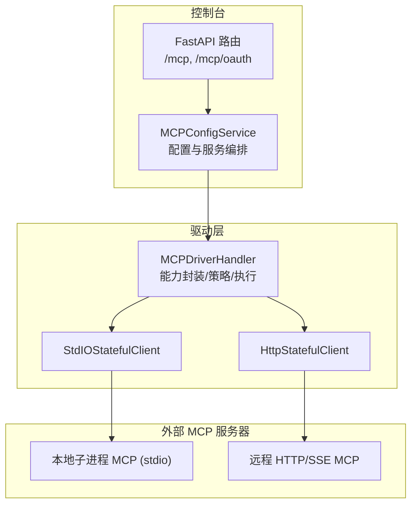
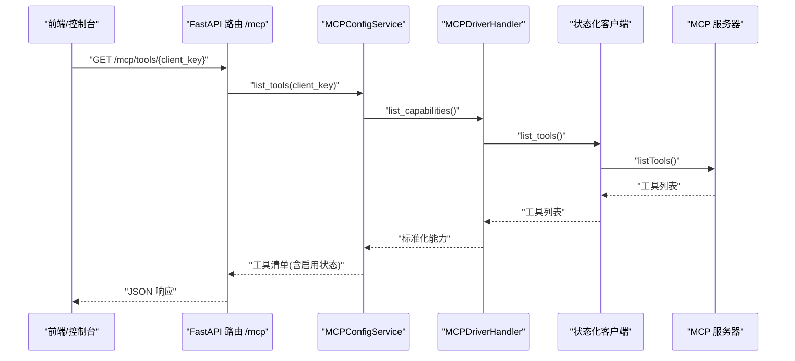
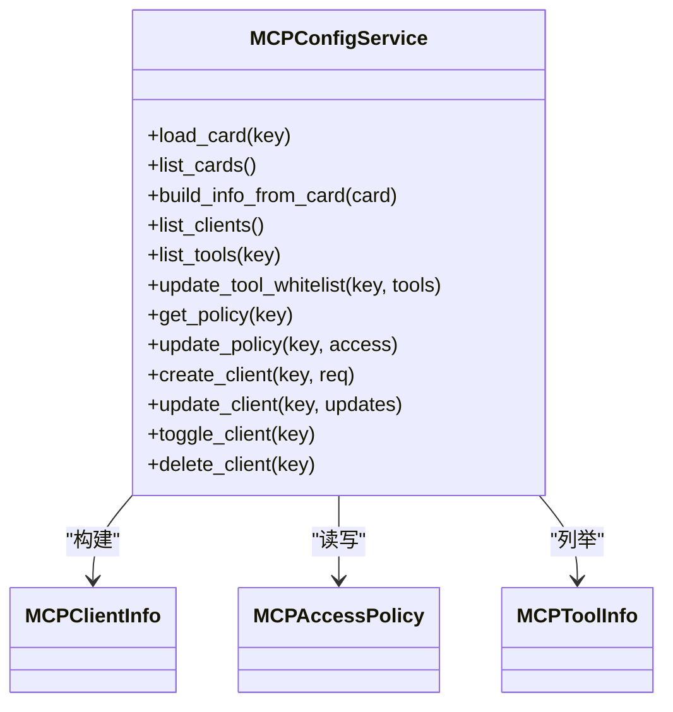
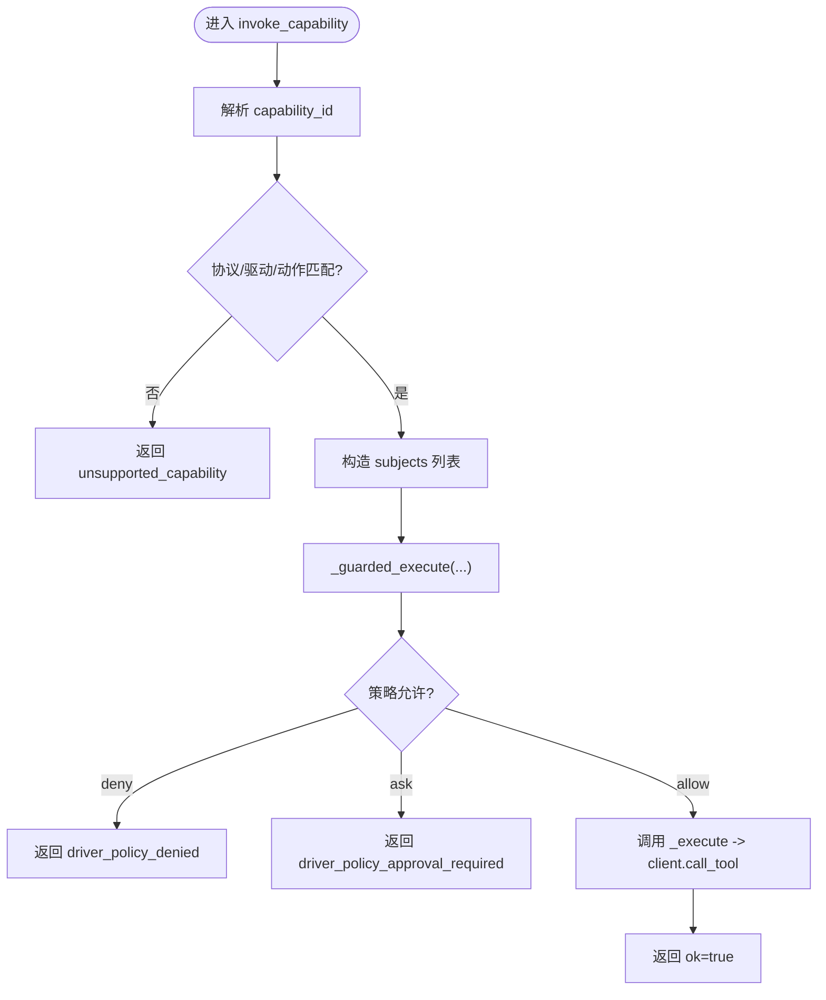
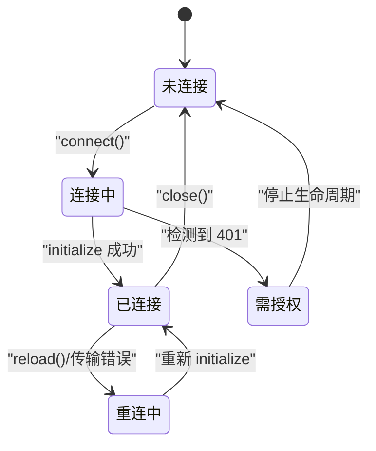
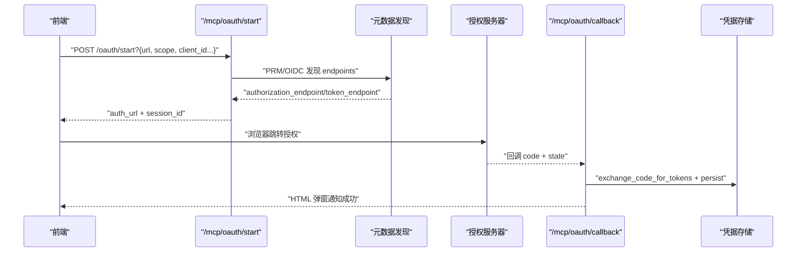
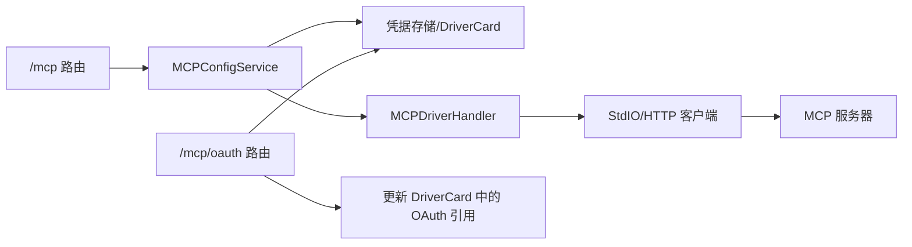

# MCP 协议集成

<cite>
**本文引用的文件**   
- [src/qwenpaw/app/mcp/config_service.py](file://src/qwenpaw/app/mcp/config_service.py)
- [src/qwenpaw/app/mcp/schemas.py](file://src/qwenpaw/app/mcp/schemas.py)
- [src/qwenpaw/app/routers/mcp.py](file://src/qwenpaw/app/routers/mcp.py)
- [src/qwenpaw/app/routers/mcp_oauth.py](file://src/qwenpaw/app/routers/mcp_oauth.py)
- [src/qwenpaw/drivers/handlers/mcp.py](file://src/qwenpaw/drivers/handlers/mcp.py)
- [src/qwenpaw/drivers/handlers/mcp_stateful_client.py](file://src/qwenpaw/drivers/handlers/mcp_stateful_client.py)
- [src/qwenpaw/drivers/adapters/mcp_binding.py](file://src/qwenpaw/drivers/adapters/mcp_binding.py)
- [tests/integration/test_driver_mcp_approval_level_policy.py](file://tests/integration/test_driver_mcp_approval_level_policy.py)
</cite>

## 目录
1. [简介](#简介)
2. [项目结构](#项目结构)
3. [核心组件](#核心组件)
4. [架构总览](#架构总览)
5. [详细组件分析](#详细组件分析)
6. [依赖关系分析](#依赖关系分析)
7. [性能与可靠性](#性能与可靠性)
8. [故障排查指南](#故障排查指南)
9. [结论](#结论)
10. [附录：客户端集成示例与最佳实践](#附录客户端集成示例与最佳实践)

## 简介
本文件面向 QwenPaw 的 MCP（Model Context Protocol）集成，系统化记录以下方面：
- MCP 协议实现细节、消息格式与通信流程
- MCP 服务器配置、客户端连接与会话管理
- OAuth 认证流程、令牌管理与安全策略
- MCP 工具注册、发现与执行机制
- MCP 客户端集成示例与最佳实践
- 错误处理、超时控制与重试策略
- 调试方法与性能监控

## 项目结构
QwenPaw 的 MCP 能力由“控制台 API + 驱动处理器 + 状态化客户端 + OAuth 网关”组成。关键路径如下：
- 控制台 API：/mcp 路由暴露 MCP 客户端 CRUD、工具白名单、访问策略等接口
- 配置服务：MCPConfigService 负责将控制台请求映射到 DriverCard 与策略
- 驱动处理器：MCPDriverHandler 将 MCP 工具暴露为统一的 Driver Capability，并执行授权与调用
- 状态化客户端：StdIOStatefulClient / HttpStatefulClient 提供跨任务安全的生命周期管理
- OAuth 网关：/mcp/oauth/* 提供基于 RFC 9728/8414/PKCE 的交互式授权

图表来源
- [src/qwenpaw/app/routers/mcp.py:1-252](file://src/qwenpaw/app/routers/mcp.py#L1-L252)
- [src/qwenpaw/app/mcp/config_service.py:74-127](file://src/qwenpaw/app/mcp/config_service.py#L74-L127)
- [src/qwenpaw/drivers/handlers/mcp.py:51-153](file://src/qwenpaw/drivers/handlers/mcp.py#L51-L153)
- [src/qwenpaw/drivers/handlers/mcp_stateful_client.py:545-754](file://src/qwenpaw/drivers/handlers/mcp_stateful_client.py#L545-L754)

章节来源
- [src/qwenpaw/app/routers/mcp.py:1-252](file://src/qwenpaw/app/routers/mcp.py#L1-L252)
- [src/qwenpaw/app/mcp/config_service.py:74-127](file://src/qwenpaw/app/mcp/config_service.py#L74-L127)
- [src/qwenpaw/drivers/handlers/mcp.py:51-153](file://src/qwenpaw/drivers/handlers/mcp.py#L51-L153)
- [src/qwenpaw/drivers/handlers/mcp_stateful_client.py:545-754](file://src/qwenpaw/drivers/handlers/mcp_stateful_client.py#L545-L754)

## 核心组件
- MCPConfigService：封装 MCP 客户端卡片（DriverCard）、凭据、策略与工具白名单的读写；提供 list_clients、create/update/toggle/delete、list_tools、get/update policy、access principals 等能力。
- MCPDriverHandler：将 MCP 工具统一包装为 DriverCapability，支持能力缓存、策略校验、授权审批、调用转发。
- StdIOStatefulClient / HttpStatefulClient：在独立后台任务中维护 MCP 会话生命周期，解决跨任务上下文管理器导致的资源泄漏问题；支持自动重连、OAuth 401 快速失败提示。
- mcp_binding：对 env/headers 进行公私分类、掩码展示与绑定还原，保障敏感信息不泄露。
- OAuth 路由：实现 PKCE 流程、动态客户端注册（可选）、PRM/OIDC 元数据发现、令牌持久化与状态查询。

章节来源
- [src/qwenpaw/app/mcp/config_service.py:74-127](file://src/qwenpaw/app/mcp/config_service.py#L74-L127)
- [src/qwenpaw/drivers/handlers/mcp.py:51-153](file://src/qwenpaw/drivers/handlers/mcp.py#L51-L153)
- [src/qwenpaw/drivers/handlers/mcp_stateful_client.py:88-212](file://src/qwenpaw/drivers/handlers/mcp_stateful_client.py#L88-L212)
- [src/qwenpaw/drivers/adapters/mcp_binding.py:44-104](file://src/qwenpaw/drivers/adapters/mcp_binding.py#L44-L104)
- [src/qwenpaw/app/routers/mcp_oauth.py:429-518](file://src/qwenpaw/app/routers/mcp_oauth.py#L429-L518)

## 架构总览
下图展示了从控制台发起一次 MCP 工具调用的端到端流程，包括策略校验、凭据注入、HTTP/stdio 传输与结果返回。

图表来源
- [src/qwenpaw/app/routers/mcp.py:73-84](file://src/qwenpaw/app/routers/mcp.py#L73-L84)
- [src/qwenpaw/app/mcp/config_service.py:128-161](file://src/qwenpaw/app/mcp/config_service.py#L128-L161)
- [src/qwenpaw/drivers/handlers/mcp.py:130-153](file://src/qwenpaw/drivers/handlers/mcp.py#L130-L153)
- [src/qwenpaw/drivers/handlers/mcp_stateful_client.py:302-371](file://src/qwenpaw/drivers/handlers/mcp_stateful_client.py#L302-L371)

## 详细组件分析

### 组件一：MCP 配置与服务编排（MCPConfigService）
职责
- 加载/列举 MCP 客户端卡片（DriverCard）
- 构建对外信息（MCPClientInfo），包含传输类型、URL/命令、环境变量、工具白名单、OAuth 状态摘要
- 工具白名单更新与工具清单获取
- 访问策略读取/更新（默认效果、客户端级覆盖、工具默认效果、工具级覆盖）
- 最近访问主体（principal）枚举，辅助策略编辑

关键要点
- 工具白名单通过 card.config.tools 控制；None 表示全部启用
- 策略持久化为 DriverPolicy，Console 仅管理受控规则，保留未管理规则
- 凭据存储使用 AsyncCredentialStore，静态凭据与 OAuth 凭据分别以不同 ref 管理

图表来源
- [src/qwenpaw/app/mcp/config_service.py:74-127](file://src/qwenpaw/app/mcp/config_service.py#L74-L127)
- [src/qwenpaw/app/mcp/schemas.py:28-76](file://src/qwenpaw/app/mcp/schemas.py#L28-L76)
- [src/qwenpaw/app/mcp/schemas.py:236-259](file://src/qwenpaw/app/mcp/schemas.py#L236-L259)
- [src/qwenpaw/app/mcp/schemas.py:261-274](file://src/qwenpaw/app/mcp/schemas.py#L261-L274)

章节来源
- [src/qwenpaw/app/mcp/config_service.py:74-127](file://src/qwenpaw/app/mcp/config_service.py#L74-L127)
- [src/qwenpaw/app/mcp/config_service.py:128-182](file://src/qwenpaw/app/mcp/config_service.py#L128-L182)
- [src/qwenpaw/app/mcp/config_service.py:245-256](file://src/qwenpaw/app/mcp/config_service.py#L245-L256)
- [src/qwenpaw/app/mcp/config_service.py:258-353](file://src/qwenpaw/app/mcp/config_service.py#L258-L353)
- [src/qwenpaw/app/mcp/schemas.py:28-76](file://src/qwenpaw/app/mcp/schemas.py#L28-L76)
- [src/qwenpaw/app/mcp/schemas.py:236-259](file://src/qwenpaw/app/mcp/schemas.py#L236-L259)
- [src/qwenpaw/app/mcp/schemas.py:261-274](file://src/qwenpaw/app/mcp/schemas.py#L261-L274)

### 组件二：MCP 驱动处理器（MCPDriverHandler）
职责
- 根据 Card.endpoint.transport 选择 StdIO 或 HTTP/SSE 客户端
- 解析凭据绑定并注入隐式鉴权头
- 将 MCP 工具转换为 DriverCapability（含命名空间与工具名规范化）
- 执行策略校验（allow/ask/deny），必要时触发审批流
- 调用底层客户端的 list_tools/call_tool

关键点
- 能力缓存 TTL 降低频繁探测开销
- 工具名按 OpenAI 约束做安全化处理
- 策略上下文从 request_context 提取 subject/user_id/session_id/channel

图表来源
- [src/qwenpaw/drivers/handlers/mcp.py:154-228](file://src/qwenpaw/drivers/handlers/mcp.py#L154-L228)
- [src/qwenpaw/drivers/handlers/mcp.py:230-249](file://src/qwenpaw/drivers/handlers/mcp.py#L230-L249)
- [src/qwenpaw/drivers/handlers/mcp.py:324-388](file://src/qwenpaw/drivers/handlers/mcp.py#L324-L388)

章节来源
- [src/qwenpaw/drivers/handlers/mcp.py:51-153](file://src/qwenpaw/drivers/handlers/mcp.py#L51-L153)
- [src/qwenpaw/drivers/handlers/mcp.py:154-228](file://src/qwenpaw/drivers/handlers/mcp.py#L154-L228)
- [src/qwenpaw/drivers/handlers/mcp.py:230-249](file://src/qwenpaw/drivers/handlers/mcp.py#L230-L249)
- [src/qwenpaw/drivers/handlers/mcp.py:324-388](file://src/qwenpaw/drivers/handlers/mcp.py#L324-L388)

### 组件三：状态化 MCP 客户端（StdIO/HTTP）
职责
- 在单一后台任务中运行完整生命周期（connect/reload/close）
- 检测传输错误并触发重连；保持工具列表缓存避免冷启动抖动
- 对 401 场景快速失败并提示需要 OAuth 授权

关键行为
- connect(timeout)：创建生命周期任务，等待 ready_event
- reload(timeout)：触发重载事件，等待重新就绪
- list_tools：若处于短暂断线窗口，等待重连完成后再拉取；否则回退缓存
- call_tool：严格校验连接状态，异常时标记断开并触发重连

图表来源
- [src/qwenpaw/drivers/handlers/mcp_stateful_client.py:143-212](file://src/qwenpaw/drivers/handlers/mcp_stateful_client.py#L143-L212)
- [src/qwenpaw/drivers/handlers/mcp_stateful_client.py:213-264](file://src/qwenpaw/drivers/handlers/mcp_stateful_client.py#L213-L264)
- [src/qwenpaw/drivers/handlers/mcp_stateful_client.py:265-297](file://src/qwenpaw/drivers/handlers/mcp_stateful_client.py#L265-L297)
- [src/qwenpaw/drivers/handlers/mcp_stateful_client.py:302-371](file://src/qwenpaw/drivers/handlers/mcp_stateful_client.py#L302-L371)
- [src/qwenpaw/drivers/handlers/mcp_stateful_client.py:372-442](file://src/qwenpaw/drivers/handlers/mcp_stateful_client.py#L372-L442)

章节来源
- [src/qwenpaw/drivers/handlers/mcp_stateful_client.py:88-212](file://src/qwenpaw/drivers/handlers/mcp_stateful_client.py#L88-L212)
- [src/qwenpaw/drivers/handlers/mcp_stateful_client.py:213-297](file://src/qwenpaw/drivers/handlers/mcp_stateful_client.py#L213-L297)
- [src/qwenpaw/drivers/handlers/mcp_stateful_client.py:302-442](file://src/qwenpaw/drivers/handlers/mcp_stateful_client.py#L302-L442)

### 组件四：凭据与环境绑定（mcp_binding）
职责
- 对 headers/env 进行分类：公开字段 vs 机密字段
- 生成唯一密钥名、拆分公开/机密映射、构建 source/credential 绑定
- 输出时对机密值进行掩码显示，并提供恢复逻辑

要点
- 常见机密键模式：KEY/TOKEN/SECRET/PASSWORD/CREDENTIAL/AUTH 等
- 公共键集合：accept/content-type/user-agent/x-client-name 等
- 掩码策略：短串全星号，长串保留前后缀中间星号

章节来源
- [src/qwenpaw/drivers/adapters/mcp_binding.py:44-104](file://src/qwenpaw/drivers/adapters/mcp_binding.py#L44-L104)
- [src/qwenpaw/drivers/adapters/mcp_binding.py:124-198](file://src/qwenpaw/drivers/adapters/mcp_binding.py#L124-L198)
- [src/qwenpaw/drivers/adapters/mcp_binding.py:200-215](file://src/qwenpaw/drivers/adapters/mcp_binding.py#L200-L215)

### 组件五：OAuth 认证流程（/mcp/oauth）
职责
- 支持 RFC 9728（受保护资源元数据）+ RFC 8414（授权服务器元数据）/OIDC discovery
- 支持 PKCE（RFC 7636）与可选的动态客户端注册（DCR）
- 服务端维护短期 state 会话，回调后交换令牌并持久化至凭据库
- 提供授权状态查询与撤销接口

交互时序

图表来源
- [src/qwenpaw/app/routers/mcp_oauth.py:429-518](file://src/qwenpaw/app/routers/mcp_oauth.py#L429-L518)
- [src/qwenpaw/app/routers/mcp_oauth.py:531-564](file://src/qwenpaw/app/routers/mcp_oauth.py#L531-L564)
- [src/qwenpaw/app/routers/mcp_oauth.py:567-637](file://src/qwenpaw/app/routers/mcp_oauth.py#L567-L637)
- [src/qwenpaw/app/routers/mcp_oauth.py:690-747](file://src/qwenpaw/app/routers/mcp_oauth.py#L690-L747)

章节来源
- [src/qwenpaw/app/routers/mcp_oauth.py:119-208](file://src/qwenpaw/app/routers/mcp_oauth.py#L119-L208)
- [src/qwenpaw/app/routers/mcp_oauth.py:210-263](file://src/qwenpaw/app/routers/mcp_oauth.py#L210-L263)
- [src/qwenpaw/app/routers/mcp_oauth.py:265-289](file://src/qwenpaw/app/routers/mcp_oauth.py#L265-L289)
- [src/qwenpaw/app/routers/mcp_oauth.py:429-518](file://src/qwenpaw/app/routers/mcp_oauth.py#L429-L518)
- [src/qwenpaw/app/routers/mcp_oauth.py:531-637](file://src/qwenpaw/app/routers/mcp_oauth.py#L531-L637)
- [src/qwenpaw/app/routers/mcp_oauth.py:690-747](file://src/qwenpaw/app/routers/mcp_oauth.py#L690-L747)

## 依赖关系分析
- 路由层依赖配置服务，配置服务依赖驱动配置与凭据存储
- 驱动处理器依赖状态化客户端，客户端依赖 mcp SDK 的 stdio/http/sse 传输
- OAuth 路由依赖 PRM/OIDC 发现与凭据存储，并在成功后更新 DriverCard

图表来源
- [src/qwenpaw/app/routers/mcp.py:1-252](file://src/qwenpaw/app/routers/mcp.py#L1-L252)
- [src/qwenpaw/app/mcp/config_service.py:74-127](file://src/qwenpaw/app/mcp/config_service.py#L74-L127)
- [src/qwenpaw/drivers/handlers/mcp.py:51-153](file://src/qwenpaw/drivers/handlers/mcp.py#L51-L153)
- [src/qwenpaw/drivers/handlers/mcp_stateful_client.py:545-754](file://src/qwenpaw/drivers/handlers/mcp_stateful_client.py#L545-L754)
- [src/qwenpaw/app/routers/mcp_oauth.py:567-637](file://src/qwenpaw/app/routers/mcp_oauth.py#L567-L637)

章节来源
- [src/qwenpaw/app/routers/mcp.py:1-252](file://src/qwenpaw/app/routers/mcp.py#L1-L252)
- [src/qwenpaw/app/mcp/config_service.py:74-127](file://src/qwenpaw/app/mcp/config_service.py#L74-L127)
- [src/qwenpaw/drivers/handlers/mcp.py:51-153](file://src/qwenpaw/drivers/handlers/mcp.py#L51-L153)
- [src/qwenpaw/drivers/handlers/mcp_stateful_client.py:545-754](file://src/qwenpaw/drivers/handlers/mcp_stateful_client.py#L545-L754)
- [src/qwenpaw/app/routers/mcp_oauth.py:567-637](file://src/qwenpaw/app/routers/mcp_oauth.py#L567-L637)

## 性能与可靠性
- 能力缓存：MCPDriverHandler 对工具列表进行短时间缓存，减少重复探测
- 连接稳定性：状态化客户端在传输错误时主动断开并重连；list_tools 在短暂断线期间等待重连或回退缓存，避免单点抖动影响整轮对话
- 超时控制：connect/reload/list_tools 均具备超时保护；HTTP 客户端设置连接/读/写/池超时
- 资源清理：生命周期在单一任务内完成 enter/exit，避免跨任务 CancelScope 错误导致进程/流泄漏

[本节为通用指导，无需源码引用]

## 故障排查指南
常见问题与定位建议
- 连接超时：检查 transport/url/command 配置是否正确；确认网络可达性与防火墙策略
- 401 未授权：HTTP 场景下会快速失败并提示需要 OAuth；请通过 /mcp/oauth 流程完成授权
- 工具不可用：确认工具白名单是否限制；查看策略默认效果与覆盖规则
- 策略拒绝/需审批：检查策略规则与主体上下文；必要时走审批流程
- 进程泄漏：确保 close() 被调用；状态化客户端已在内部保证生命周期正确退出

章节来源
- [src/qwenpaw/drivers/handlers/mcp_stateful_client.py:189-212](file://src/qwenpaw/drivers/handlers/mcp_stateful_client.py#L189-L212)
- [src/qwenpaw/drivers/handlers/mcp_stateful_client.py:372-442](file://src/qwenpaw/drivers/handlers/mcp_stateful_client.py#L372-L442)
- [tests/integration/test_driver_mcp_approval_level_policy.py:76-101](file://tests/integration/test_driver_mcp_approval_level_policy.py#L76-L101)

## 结论
QwenPaw 的 MCP 集成通过“配置服务 + 驱动处理器 + 状态化客户端 + OAuth 网关”的分层设计，实现了多传输方式、可插拔策略与安全的凭据管理。其优势在于：
- 统一的能力抽象与策略框架
- 健壮的连接与重连机制
- 完善的 OAuth 支持与凭据安全
- 面向控制台友好的配置与可视化

[本节为总结性内容，无需源码引用]

## 附录：客户端集成示例与最佳实践

- 列出所有 MCP 客户端
  - 方法：GET /mcp
  - 用途：获取已配置的 MCP 客户端列表及其基本信息（传输类型、URL/命令、工具白名单、OAuth 状态摘要）

- 创建 MCP 客户端
  - 方法：POST /mcp
  - 参数：client_key（嵌入）、MCPClientCreateRequest（name、transport、url/command/args/env/cwd、tools 等）
  - 说明：支持 stdio/streamable_http/sse；tools 为可选白名单

- 更新 MCP 客户端
  - 方法：PUT /mcp/{client_key:path}
  - 参数：MCPClientUpdateRequest（部分字段可选）

- 切换启用状态
  - 方法：PATCH /mcp/toggle/{client_key:path}

- 删除 MCP 客户端
  - 方法：DELETE /mcp/{client_key:path}

- 列举工具与白名单
  - 方法：GET /mcp/tools/{client_key:path}
  - 方法：PUT /mcp/tools/{client_key:path}（body.tools 为 null 表示移除白名单）

- 访问策略
  - 方法：GET /mcp/policy/{client_key:path}
  - 方法：PUT /mcp/policy/{client_key:path}
  - 方法：GET /mcp/access-principals（用于策略编辑的主体下拉）

- OAuth 授权
  - 开始：POST /mcp/oauth/start/{client_key:path}
  - 回调：GET /mcp/oauth/callback?code&state
  - 状态：GET /mcp/oauth/status/{client_key:path}
  - 撤销：DELETE /mcp/oauth/{client_key:path}

最佳实践
- 优先使用 streamable_http 或 SSE 远程 MCP，便于集中管理与证书/代理配置
- 合理设置工具白名单，最小权限原则
- 结合策略默认 deny/ask，按需放行
- 对敏感 env/header 使用凭据存储，避免明文配置
- 关注连接日志与 401 提示，及时完成 OAuth 授权

章节来源
- [src/qwenpaw/app/routers/mcp.py:73-252](file://src/qwenpaw/app/routers/mcp.py#L73-L252)
- [src/qwenpaw/app/routers/mcp_oauth.py:429-747](file://src/qwenpaw/app/routers/mcp_oauth.py#L429-L747)
- [src/qwenpaw/app/mcp/schemas.py:78-164](file://src/qwenpaw/app/mcp/schemas.py#L78-L164)
- [src/qwenpaw/app/mcp/schemas.py:166-259](file://src/qwenpaw/app/mcp/schemas.py#L166-L259)