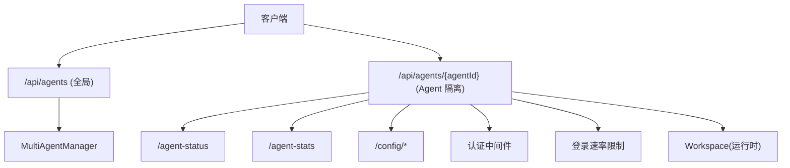
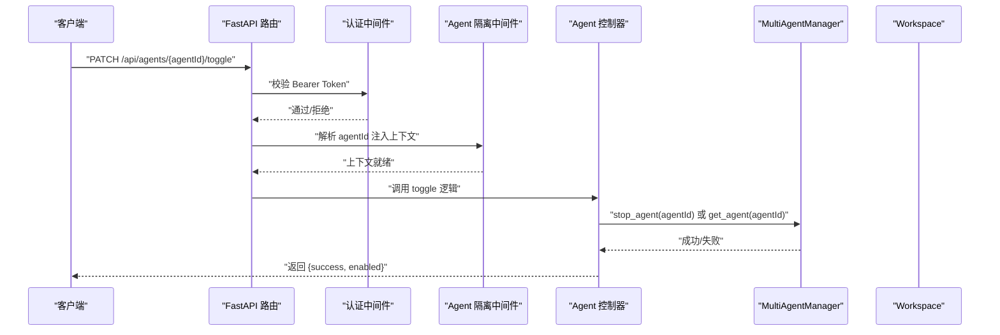
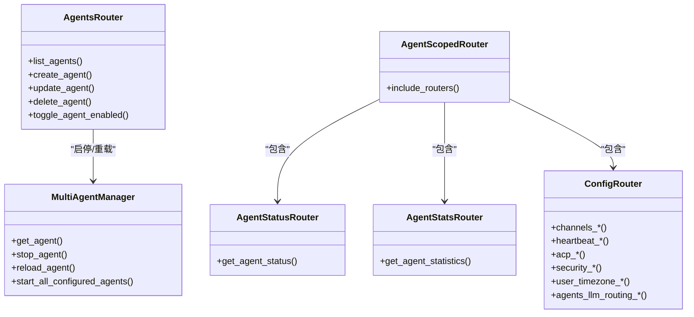

# Agent 管理接口

<cite>
**本文引用的文件**
- [src/qwenpaw/app/routers/agents.py](file://src/qwenpaw/app/routers/agents.py)
- [src/qwenpaw/app/routers/agent_scoped.py](file://src/qwenpaw/app/routers/agent_scoped.py)
- [src/qwenpaw/app/routers/agent_status.py](file://src/qwenpaw/app/routers/agent_status.py)
- [src/qwenpaw/app/routers/agent_stats.py](file://src/qwenpaw/app/routers/agent_stats.py)
- [src/qwenpaw/app/routers/config.py](file://src/qwenpaw/app/routers/config.py)
- [src/qwenpaw/app/auth.py](file://src/qwenpaw/app/auth.py)
- [src/qwenpaw/app/rate_limiter.py](file://src/qwenpaw/app/rate_limiter.py)
- [src/qwenpaw/app/multi_agent_manager.py](file://src/qwenpaw/app/multi_agent_manager.py)
- [src/qwenpaw/config/config.py](file://src/qwenpaw/config/config.py)
- [tests/integration/helpers.py](file://tests/integration/helpers.py)
</cite>

## 目录
1. [简介](#简介)
2. [项目结构](#项目结构)
3. [核心组件](#核心组件)
4. [架构总览](#架构总览)
5. [详细组件分析](#详细组件分析)
6. [依赖关系分析](#依赖关系分析)
7. [性能与限流](#性能与限流)
8. [故障排查指南](#故障排查指南)
9. [结论](#结论)
10. [附录：认证、权限与安全](#附录认证权限与安全)

## 简介
本文件为 QwenPaw 的 Agent 管理 RESTful API 提供完整规范，覆盖以下能力：
- Agent 生命周期管理：创建、更新、删除、启用/禁用（启动/停止）
- Agent 配置管理：通道、心跳、ACP、LLM 路由等
- Agent 状态监控与统计：运行状态、任务计数、时间戳；按日期范围获取统计摘要
- 认证方式、权限控制与速率限制说明
- 常见请求/响应示例与使用场景的代码片段路径

## 项目结构
Agent 管理相关接口主要分布在如下模块：
- 全局 Agent 管理路由：/api/agents/*
- Agent 隔离上下文路由：/api/agents/{agentId}/*
- Agent 状态与统计：/api/agents/{agentId}/agent-status, /api/agents/{agentId}/agent-stats
- Agent 配置管理：/api/agents/{agentId}/config/*
- 认证与鉴权中间件：AuthMiddleware
- 登录速率限制：LoginRateLimiter
- 多 Agent 管理器：MultiAgentManager（负责懒加载、启停、热重载）

图表来源
- [src/qwenpaw/app/routers/agents.py:1-612](file://src/qwenpaw/app/routers/agents.py#L1-L612)
- [src/qwenpaw/app/routers/agent_scoped.py:1-109](file://src/qwenpaw/app/routers/agent_scoped.py#L1-L109)
- [src/qwenpaw/app/routers/agent_status.py:1-94](file://src/qwenpaw/app/routers/agent_status.py#L1-L94)
- [src/qwenpaw/app/routers/agent_stats.py:1-55](file://src/qwenpaw/app/routers/agent_stats.py#L1-L55)
- [src/qwenpaw/app/routers/config.py:1-800](file://src/qwenpaw/app/routers/config.py#L1-L800)
- [src/qwenpaw/app/auth.py:1-780](file://src/qwenpaw/app/auth.py#L1-L780)
- [src/qwenpaw/app/rate_limiter.py:1-155](file://src/qwenpaw/app/rate_limiter.py#L1-L155)
- [src/qwenpaw/app/multi_agent_manager.py:23-606](file://src/qwenpaw/app/multi_agent_manager.py#L23-L606)

章节来源
- [src/qwenpaw/app/routers/agents.py:1-612](file://src/qwenpaw/app/routers/agents.py#L1-L612)
- [src/qwenpaw/app/routers/agent_scoped.py:1-109](file://src/qwenpaw/app/routers/agent_scoped.py#L1-L109)

## 核心组件
- 全局 Agent 管理路由
  - GET /api/agents：列出所有已配置的 Agent
  - PUT /api/agents/order：持久化 Agent 顺序
  - POST /api/agents：创建新 Agent
  - GET /api/agents/{agentId}：获取指定 Agent 配置详情
  - PUT /api/agents/{agentId}：更新 Agent 配置并触发热重载
  - DELETE /api/agents/{agentId}：删除 Agent（不可删除 default）
  - PATCH /api/agents/{agentId}/toggle：启用/禁用 Agent（默认 Agent 不可禁用）
- Agent 隔离上下文路由
  - 通过中间件将 agentId 注入 request.state，下游子路由共享该上下文
- Agent 状态与统计
  - GET /api/agents/{agentId}/agent-status：返回当前运行状态、任务数、最近运行/完成时间
  - GET /api/agents/{agentId}/agent-stats：按日期范围返回统计摘要
- Agent 配置管理
  - /api/agents/{agentId}/config/*：通道、心跳、ACP、安全策略、用户时区、LLM 路由等

章节来源
- [src/qwenpaw/app/routers/agents.py:157-484](file://src/qwenpaw/app/routers/agents.py#L157-L484)
- [src/qwenpaw/app/routers/agent_scoped.py:67-109](file://src/qwenpaw/app/routers/agent_scoped.py#L67-L109)
- [src/qwenpaw/app/routers/agent_status.py:43-94](file://src/qwenpaw/app/routers/agent_status.py#L43-L94)
- [src/qwenpaw/app/routers/agent_stats.py:25-55](file://src/qwenpaw/app/routers/agent_stats.py#L25-L55)
- [src/qwenpaw/app/routers/config.py:87-734](file://src/qwenpaw/app/routers/config.py#L87-L734)

## 架构总览
Agent 管理 API 采用 FastAPI 路由分层设计：
- 顶层路由处理全局 Agent 管理
- 通过 AgentContextMiddleware 将 agentId 注入到请求上下文，实现 Agent 隔离
- 子路由在各自上下文中访问 Workspace 和配置服务
- 多 Agent 管理器负责实例的懒加载、启停与零停机热重载

图表来源
- [src/qwenpaw/app/routers/agents.py:435-484](file://src/qwenpaw/app/routers/agents.py#L435-L484)
- [src/qwenpaw/app/routers/agent_scoped.py:16-65](file://src/qwenpaw/app/routers/agent_scoped.py#L16-L65)
- [src/qwenpaw/app/auth.py:689-753](file://src/qwenpaw/app/auth.py#L689-L753)
- [src/qwenpaw/app/multi_agent_manager.py:301-319](file://src/qwenpaw/app/multi_agent_manager.py#L301-L319)

## 详细组件分析

### 全局 Agent 管理接口
- 列表与排序
  - GET /api/agents
    - 响应体包含 agents 数组，每项含 id、name、description、workspace_dir、enabled、active_model
    - 描述信息会尝试从工作区的 PROFILE.md 中抽取“身份”段落作为补充
  - PUT /api/agents/order
    - 请求体 agent_ids 必须与现有 profiles 完全一致且无重复
    - 成功后返回 success 与新的 agent_order
- 创建
  - POST /api/agents
    - 可选 id（自动清理空白字符），若未提供则生成短 UUID
    - 支持 workspace_dir、language、skill_names、active_model
    - 初始化工作区目录、复制模板文件、安装初始技能、创建 jobs.json/chats.json
    - 返回 AgentProfileRef（id、workspace_dir、enabled）
- 查询
  - GET /api/agents/{agentId}
    - 返回 AgentProfileConfig（包含 channels、mcp、heartbeat、running、llm_routing、active_model、language、approval_level 等）
- 更新
  - PUT /api/agents/{agentId}
    - 仅更新非 id 字段，保存后触发异步热重载
- 删除
  - DELETE /api/agents/{agentId}
    - 禁止删除 default；先停止实例，再移除配置并持久化
- 启用/禁用
  - PATCH /api/agents/{agentId}/toggle
    - 禁用时调用 stop_agent；启用时尝试 get_agent 以启动
    - 返回 success、agent_id、enabled

请求/响应要点
- 状态码
  - 201：创建成功
  - 200：查询/更新/启用成功
  - 400：参数校验失败（如 order 不合法、default 操作受限）
  - 404：Agent 不存在
  - 500：内部错误（如唯一 ID 生成失败、启动失败）
- 典型错误
  - “Cannot delete the default agent”
  - “Each configured agent ID must appear exactly once.”
  - “Agent enabled but failed to start”

章节来源
- [src/qwenpaw/app/routers/agents.py:157-206](file://src/qwenpaw/app/routers/agents.py#L157-L206)
- [src/qwenpaw/app/routers/agents.py:208-236](file://src/qwenpaw/app/routers/agents.py#L208-L236)
- [src/qwenpaw/app/routers/agents.py:272-365](file://src/qwenpaw/app/routers/agents.py#L272-L365)
- [src/qwenpaw/app/routers/agents.py:238-253](file://src/qwenpaw/app/routers/agents.py#L238-L253)
- [src/qwenpaw/app/routers/agents.py:367-399](file://src/qwenpaw/app/routers/agents.py#L367-L399)
- [src/qwenpaw/app/routers/agents.py:401-433](file://src/qwenpaw/app/routers/agents.py#L401-L433)
- [src/qwenpaw/app/routers/agents.py:435-484](file://src/qwenpaw/app/routers/agents.py#L435-L484)
- [src/qwenpaw/app/routers/agents.py:568-612](file://src/qwenpaw/app/routers/agents.py#L568-L612)

### Agent 隔离上下文路由
- 作用
  - 从路径 /api/agents/{agentId}/... 提取 agentId，注入 request.state.agent_id
  - 同时支持 X-Agent-Id 头作为备选
  - 注入 root_session_id（X-Root-Session-Id）用于跨会话审批路由
- 挂载的子路由
  - agent-status、chats、config、cron、mcp、skills、tools、workspace、console、plugins

章节来源
- [src/qwenpaw/app/routers/agent_scoped.py:16-65](file://src/qwenpaw/app/routers/agent_scoped.py#L16-L65)
- [src/qwenpaw/app/routers/agent_scoped.py:67-109](file://src/qwenpaw/app/routers/agent_scoped.py#L67-L109)

### Agent 状态与统计
- 状态
  - GET /api/agents/{agentId}/agent-status
    - 返回 status（idle/running/disabled）、running_task_count、last_run_at、last_finish_at
    - disabled 直接返回空时间戳；enabled 时读取 task_tracker 的全局状态
- 统计
  - GET /api/agents/{agentId}/agent-stats
    - 查询参数 start_date、end_date（YYYY-MM-DD），默认 30 天
    - 返回 AgentStatsSummary（由服务层聚合）

章节来源
- [src/qwenpaw/app/routers/agent_status.py:16-94](file://src/qwenpaw/app/routers/agent_status.py#L16-L94)
- [src/qwenpaw/app/routers/agent_stats.py:16-55](file://src/qwenpaw/app/routers/agent_stats.py#L16-L55)

### Agent 配置管理（部分关键端点）
- 通道
  - GET /api/agents/{agentId}/config/channels：列出可用通道及其配置
  - PUT /api/agents/{agentId}/config/channels：批量更新通道配置并热重载
  - GET /api/agents/{agentId}/config/channels/{channel_name}：获取单个通道配置
  - PUT /api/agents/{agentId}/config/channels/{channel_name}：更新单个通道配置并热重载
  - GET /api/agents/{agentId}/config/channels/{channel_name}/health：健康检查
  - POST /api/agents/{agentId}/config/channels/{channel_name}/restart：重启通道
  - GET /api/agents/{agentId}/config/channels/{channel}/qrcode：获取授权二维码
  - GET /api/agents/{agentId}/config/channels/{channel}/qrcode/status：轮询授权状态
- 心跳
  - GET /api/agents/{agentId}/config/heartbeat：获取心跳配置
  - PUT /api/agents/{agentId}/config/heartbeat：更新心跳配置并后台重调度
  - POST /api/agents/{agentId}/config/heartbeat/run：立即执行一次心跳
- ACP
  - GET /api/agents/{agentId}/config/acp：获取 ACP 配置
  - PUT /api/agents/{agentId}/config/acp：更新 ACP 配置并热重载
  - GET /api/agents/{agentId}/config/acp/node-runtime：获取 Node 运行时状态
  - PUT /api/agents/{agentId}/config/acp/node-runtime：更新 Node 路径并验证可用性
  - GET /api/agents/{agentId}/config/acp/{agent_name}：获取特定 ACP agent 配置
  - PUT /api/agents/{agentId}/config/acp/{agent_name}：更新特定 ACP agent 配置并热重载
- LLM 路由
  - GET /api/agents/{agentId}/config/agents/llm-routing：获取 LLM 路由设置
  - PUT /api/agents/{agentId}/config/agents/llm-routing：更新 LLM 路由设置
- 用户时区
  - GET /api/agents/{agentId}/config/user-timezone：获取 IANA 时区
  - PUT /api/agents/{agentId}/config/user-timezone：设置 IANA 时区
- 安全/工具守卫
  - GET /api/agents/{agentId}/config/security/tool-guard：获取工具守卫配置
  - PUT /api/agents/{agentId}/config/security/tool-guard：更新工具守卫配置并热重载引擎规则
  - GET /api/agents/{agentId}/config/security/tool-guard/builtin-rules：列出内置规则

章节来源
- [src/qwenpaw/app/routers/config.py:87-189](file://src/qwenpaw/app/routers/config.py#L87-L189)
- [src/qwenpaw/app/routers/config.py:223-286](file://src/qwenpaw/app/routers/config.py#L223-L286)
- [src/qwenpaw/app/routers/config.py:291-332](file://src/qwenpaw/app/routers/config.py#L291-L332)
- [src/qwenpaw/app/routers/config.py:334-428](file://src/qwenpaw/app/routers/config.py#L334-L428)
- [src/qwenpaw/app/routers/config.py:431-585](file://src/qwenpaw/app/routers/config.py#L431-L585)
- [src/qwenpaw/app/routers/config.py:587-675](file://src/qwenpaw/app/routers/config.py#L587-L675)
- [src/qwenpaw/app/routers/config.py:677-699](file://src/qwenpaw/app/routers/config.py#L677-L699)
- [src/qwenpaw/app/routers/config.py:704-734](file://src/qwenpaw/app/routers/config.py#L704-L734)
- [src/qwenpaw/app/routers/config.py:740-796](file://src/qwenpaw/app/routers/config.py#L740-L796)

### 认证、权限与安全
- 认证方式
  - 基于 Bearer Token 的自定义 HMAC-SHA256 令牌（非 PyJWT）
  - 支持永久令牌（jti 与过期时间）与单令牌撤销
  - 支持通过环境变量自动注册首个管理员账户
- 鉴权中间件
  - 对 /api/* 路径进行鉴权，白名单路径与静态资源前缀可跳过
  - 支持 trusted_proxies 与 allow_no_auth_hosts 的安全策略
- 登录速率限制
  - 针对登录接口的 IP 与用户名维度限制，防止暴力破解
  - 支持账号锁定与 IP 锁定，具备过期清理机制

章节来源
- [src/qwenpaw/app/auth.py:121-205](file://src/qwenpaw/app/auth.py#L121-L205)
- [src/qwenpaw/app/auth.py:335-424](file://src/qwenpaw/app/auth.py#L335-L424)
- [src/qwenpaw/app/auth.py:475-566](file://src/qwenpaw/app/auth.py#L475-L566)
- [src/qwenpaw/app/auth.py:689-753](file://src/qwenpaw/app/auth.py#L689-L753)
- [src/qwenpaw/app/rate_limiter.py:8-155](file://src/qwenpaw/app/rate_limiter.py#L8-L155)

## 依赖关系分析
- 路由层
  - agents.py 依赖 MultiAgentManager 进行实例启停
  - agent_scoped.py 注入 agentId 上下文，供下游子路由使用
  - agent_status.py 与 agent_stats.py 通过 get_agent_for_request 获取 Workspace
  - config.py 读写 Agent 配置并触发 schedule_agent_reload
- 运行时
  - MultiAgentManager 负责懒加载、并发启动、零停机热重载
  - Workspace 暴露 task_tracker 等运行时能力

图表来源
- [src/qwenpaw/app/routers/agents.py:157-484](file://src/qwenpaw/app/routers/agents.py#L157-L484)
- [src/qwenpaw/app/routers/agent_scoped.py:67-109](file://src/qwenpaw/app/routers/agent_scoped.py#L67-L109)
- [src/qwenpaw/app/routers/agent_status.py:43-94](file://src/qwenpaw/app/routers/agent_status.py#L43-L94)
- [src/qwenpaw/app/routers/agent_stats.py:25-55](file://src/qwenpaw/app/routers/agent_stats.py#L25-L55)
- [src/qwenpaw/app/routers/config.py:87-734](file://src/qwenpaw/app/routers/config.py#L87-L734)
- [src/qwenpaw/app/multi_agent_manager.py:23-606](file://src/qwenpaw/app/multi_agent_manager.py#L23-L606)

章节来源
- [src/qwenpaw/app/routers/agents.py:157-484](file://src/qwenpaw/app/routers/agents.py#L157-L484)
- [src/qwenpaw/app/routers/agent_scoped.py:67-109](file://src/qwenpaw/app/routers/agent_scoped.py#L67-L109)
- [src/qwenpaw/app/routers/agent_status.py:43-94](file://src/qwenpaw/app/routers/agent_status.py#L43-L94)
- [src/qwenpaw/app/routers/agent_stats.py:25-55](file://src/qwenpaw/app/routers/agent_stats.py#L25-L55)
- [src/qwenpaw/app/routers/config.py:87-734](file://src/qwenpaw/app/routers/config.py#L87-L734)
- [src/qwenpaw/app/multi_agent_manager.py:23-606](file://src/qwenpaw/app/multi_agent_manager.py#L23-L606)

## 性能与限流
- Agent 启动与热重载
  - MultiAgentManager 采用细粒度锁与并行初始化，避免阻塞其他 Agent
  - 热重载采用“新建-原子替换-优雅停止旧实例”的流程，保障零停机
- LLM 调用限流与重试
  - 通过 RetryConfig 与 RateLimitConfig 控制并发、QPM、退避与抖动
  - 429 等瞬态错误自动重试，支持全局暂停与抖动以避免雪崩
- 登录速率限制
  - 针对登录接口的多维度限制，保护系统免受暴力破解

章节来源
- [src/qwenpaw/app/multi_agent_manager.py:321-448](file://src/qwenpaw/app/multi_agent_manager.py#L321-L448)
- [src/qwenpaw/providers/retry_chat_model.py:70-101](file://src/qwenpaw/providers/retry_chat_model.py#L70-L101)
- [src/qwenpaw/app/rate_limiter.py:8-155](file://src/qwenpaw/app/rate_limiter.py#L8-L155)

## 故障排查指南
- 常见问题定位
  - 404：Agent 不存在或未配置
  - 400：order 不合法、default 操作受限、参数校验失败
  - 500：唯一 ID 生成失败、启动失败、内部异常
- 建议步骤
  - 确认 Agent 是否存在于配置中
  - 查看日志输出（创建/启停/重载过程均有日志）
  - 对于热重载失败，检查新实例启动是否抛出异常
  - 对于通道问题，使用 health 与 restart 端点辅助诊断

章节来源
- [src/qwenpaw/app/routers/agents.py:208-236](file://src/qwenpaw/app/routers/agents.py#L208-L236)
- [src/qwenpaw/app/routers/agents.py:401-433](file://src/qwenpaw/app/routers/agents.py#L401-L433)
- [src/qwenpaw/app/routers/agents.py:435-484](file://src/qwenpaw/app/routers/agents.py#L435-L484)
- [src/qwenpaw/app/routers/config.py:223-286](file://src/qwenpaw/app/routers/config.py#L223-L286)

## 结论
QwenPaw 的 Agent 管理 API 提供了完善的生命周期管理、配置管理与运行观测能力。通过 Agent 隔离上下文与多 Agent 管理器，系统在并发与可靠性方面具备良好的扩展性。结合认证中间件与登录速率限制，整体安全性与稳定性得到保障。

## 附录：认证、权限与安全
- 认证方式
  - 使用 Authorization: Bearer <token> 头
  - 支持永久令牌与单令牌撤销
- 权限控制
  - 默认关闭认证，需设置环境变量开启
  - 支持 trusted_proxies 与 allow_no_auth_hosts 策略
- 速率限制
  - 登录接口具备 IP 与用户名维度的限制与锁定机制

章节来源
- [src/qwenpaw/app/auth.py:689-753](file://src/qwenpaw/app/auth.py#L689-L753)
- [src/qwenpaw/app/rate_limiter.py:8-155](file://src/qwenpaw/app/rate_limiter.py#L8-L155)

## 附录：常用请求/响应示例与代码片段路径
- 创建 Agent
  - 请求：POST /api/agents
  - 响应：201，返回 {id, workspace_dir, enabled}
  - 参考：[src/qwenpaw/app/routers/agents.py:272-365](file://src/qwenpaw/app/routers/agents.py#L272-L365)
- 更新 Agent 配置
  - 请求：PUT /api/agents/{agentId}
  - 响应：200，返回更新后的 AgentProfileConfig
  - 参考：[src/qwenpaw/app/routers/agents.py:367-399](file://src/qwenpaw/app/routers/agents.py#L367-L399)
- 删除 Agent
  - 请求：DELETE /api/agents/{agentId}
  - 响应：200，返回 {success, agent_id}
  - 参考：[src/qwenpaw/app/routers/agents.py:401-433](file://src/qwenpaw/app/routers/agents.py#L401-L433)
- 启用/禁用 Agent
  - 请求：PATCH /api/agents/{agentId}/toggle
  - 响应：200，返回 {success, agent_id, enabled}
  - 参考：[src/qwenpaw/app/routers/agents.py:435-484](file://src/qwenpaw/app/routers/agents.py#L435-L484)
- 获取 Agent 状态
  - 请求：GET /api/agents/{agentId}/agent-status
  - 响应：200，返回 {status, running_task_count, last_run_at, last_finish_at}
  - 参考：[src/qwenpaw/app/routers/agent_status.py:43-94](file://src/qwenpaw/app/routers/agent_status.py#L43-L94)
- 获取 Agent 统计
  - 请求：GET /api/agents/{agentId}/agent-stats?start_date=YYYY-MM-DD&end_date=YYYY-MM-DD
  - 响应：200，返回 AgentStatsSummary
  - 参考：[src/qwenpaw/app/routers/agent_stats.py:25-55](file://src/qwenpaw/app/routers/agent_stats.py#L25-L55)
- 更新通道配置
  - 请求：PUT /api/agents/{agentId}/config/channels
  - 响应：200，返回 ChannelConfig
  - 参考：[src/qwenpaw/app/routers/config.py:165-189](file://src/qwenpaw/app/routers/config.py#L165-L189)
- 获取心跳配置
  - 请求：GET /api/agents/{agentId}/config/heartbeat
  - 响应：200，返回心跳配置对象
  - 参考：[src/qwenpaw/app/routers/config.py:587-603](file://src/qwenpaw/app/routers/config.py#L587-L603)
- 更新 LLM 路由
  - 请求：PUT /api/agents/{agentId}/config/agents/llm-routing
  - 响应：200，返回 AgentsLLMRoutingConfig
  - 参考：[src/qwenpaw/app/routers/config.py:687-699](file://src/qwenpaw/app/routers/config.py#L687-L699)

章节来源
- [src/qwenpaw/app/routers/agents.py:272-484](file://src/qwenpaw/app/routers/agents.py#L272-L484)
- [src/qwenpaw/app/routers/agent_status.py:43-94](file://src/qwenpaw/app/routers/agent_status.py#L43-L94)
- [src/qwenpaw/app/routers/agent_stats.py:25-55](file://src/qwenpaw/app/routers/agent_stats.py#L25-L55)
- [src/qwenpaw/app/routers/config.py:165-189](file://src/qwenpaw/app/routers/config.py#L165-L189)
- [src/qwenpaw/app/routers/config.py:587-603](file://src/qwenpaw/app/routers/config.py#L587-L603)
- [src/qwenpaw/app/routers/config.py:687-699](file://src/qwenpaw/app/routers/config.py#L687-L699)

## 附录：测试与集成参考
- 集成测试中的 Agent 辅助方法
  - create_agent(app_server, agent_id)
  - delete_agent_quietly(app_server, agent_id)
  - toggle_agent(app_server, agent_id, enabled)
- 参考路径
  - [tests/integration/helpers.py:59-88](file://tests/integration/helpers.py#L59-L88)

章节来源
- [tests/integration/helpers.py:59-88](file://tests/integration/helpers.py#L59-L88)