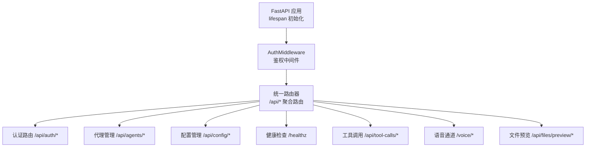
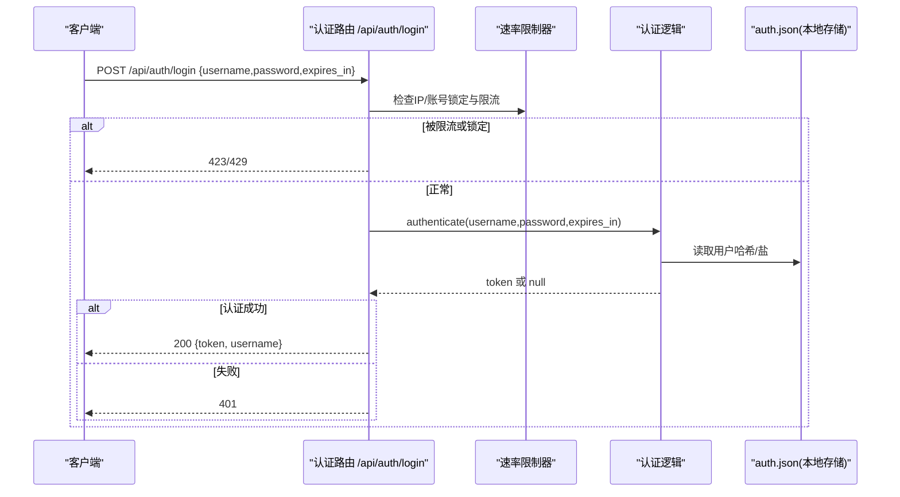
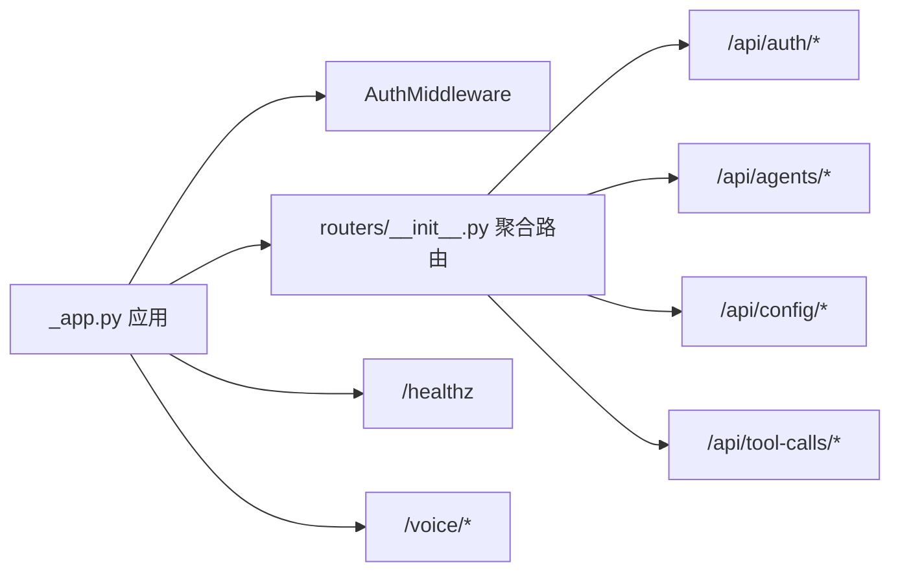

# RESTful API 接口

<cite>
**本文引用的文件**   
- [src/qwenpaw/app/_app.py](file://src/qwenpaw/app/_app.py)
- [src/qwenpaw/app/auth.py](file://src/qwenpaw/app/auth.py)
- [src/qwenpaw/app/routers/__init__.py](file://src/qwenpaw/app/routers/__init__.py)
- [src/qwenpaw/app/routers/auth.py](file://src/qwenpaw/app/routers/auth.py)
- [src/qwenpaw/app/routers/agents.py](file://src/qwenpaw/app/routers/agents.py)
- [src/qwenpaw/app/routers/config.py](file://src/qwenpaw/app/routers/config.py)
- [src/qwenpaw/app/routers/files.py](file://src/qwenpaw/app/routers/files.py)
- [src/qwenpaw/app/routers/healthz.py](file://src/qwenpaw/app/routers/healthz.py)
- [src/qwenpaw/app/routers/loops.py](file://src/qwenpaw/app/routers/loops.py)
- [src/qwenpaw/app/routers/tool_calls.py](file://src/qwenpaw/app/routers/tool_calls.py)
- [src/qwenpaw/app/routers/voice.py](file://src/qwenpaw/app/routers/voice.py)
</cite>

## 目录
1. [简介](#简介)
2. [项目结构](#项目结构)
3. [核心组件](#核心组件)
4. [架构总览](#架构总览)
5. [详细组件分析](#详细组件分析)
6. [依赖关系分析](#依赖关系分析)
7. [性能与速率限制](#性能与速率限制)
8. [故障排查指南](#故障排查指南)
9. [结论](#结论)
10. [附录：认证与安全最佳实践](#附录认证与安全最佳实践)

## 简介
本文件为 QwenPaw 的 RESTful API 接口文档，覆盖以下方面：
- 所有 HTTP 端点的 URL 模式、请求方法、请求参数、请求体格式与响应数据结构
- 认证方式（Bearer Token）、权限控制与白名单策略
- 错误码与状态码说明
- 完整的请求/响应示例（成功与失败）
- 数据验证规则、必填字段与字段类型
- 常用用例的代码示例与最佳实践
- 速率限制、缓存策略与性能优化建议

## 项目结构
后端基于 FastAPI，应用启动时通过 lifespan 初始化服务并挂载各功能路由。认证中间件 AuthMiddleware 对 /api/* 路径进行鉴权，部分路径公开免鉴权。

图表来源
- [src/qwenpaw/app/_app.py:787-800](file://src/qwenpaw/app/_app.py#L787-L800)
- [src/qwenpaw/app/routers/__init__.py:36-66](file://src/qwenpaw/app/routers/__init__.py#L36-L66)

章节来源
- [src/qwenpaw/app/_app.py:787-800](file://src/qwenpaw/app/_app.py#L787-L800)
- [src/qwenpaw/app/routers/__init__.py:36-66](file://src/qwenpaw/app/routers/__init__.py#L36-L66)

## 核心组件
- 认证与鉴权
  - 中间件：AuthMiddleware，支持 Bearer Token 校验、可选查询参数 token、IP 白名单跳过鉴权、受信任代理解析真实客户端 IP
  - 令牌：HMAC-SHA256 自实现，支持过期时间、撤销列表、批量撤销
  - 注册：单用户模型，支持环境变量自动注册
- 路由聚合
  - 统一将各子模块路由挂载到 /api/* 下
- 健康检查
  - /healthz 返回服务就绪状态与已加载代理信息
- 语音通道
  - Twilio 回调与 WebSocket 中继，签名校验与一次性 WS Token

章节来源
- [src/qwenpaw/app/auth.py:689-763](file://src/qwenpaw/app/auth.py#L689-L763)
- [src/qwenpaw/app/routers/__init__.py:36-66](file://src/qwenpaw/app/routers/__init__.py#L36-L66)
- [src/qwenpaw/app/routers/healthz.py:13-34](file://src/qwenpaw/app/routers/healthz.py#L13-L34)
- [src/qwenpaw/app/routers/voice.py:84-184](file://src/qwenpaw/app/routers/voice.py#L84-L184)

## 架构总览
下图展示一次登录流程中关键组件交互：客户端 → 认证路由 → 速率限制器 → 认证逻辑 → 返回令牌。

图表来源
- [src/qwenpaw/app/routers/auth.py:51-103](file://src/qwenpaw/app/routers/auth.py#L51-L103)
- [src/qwenpaw/app/auth.py:475-501](file://src/qwenpaw/app/auth.py#L475-L501)

## 详细组件分析

### 认证与账户管理（/api/auth）
- 认证方式
  - 请求头：Authorization: Bearer <token>
  - 兼容：WebSocket 升级连接可通过 query 参数 token 传递
  - 免鉴权路径：/api/auth/login、/api/auth/status、/api/auth/register、/api/version、/api/settings/language、/api/settings/upload-limit、/api/frontend_plugin、静态资源前缀 /assets/ 等
- 安全特性
  - 支持可信代理 X-Forwarded-For/X-Real-IP 解析真实客户端 IP
  - 支持 allow_no_auth_hosts 白名单（需配合 trusted_proxies 使用）
  - 支持令牌撤销（单个/全部），黑名单持久化

#### 端点清单
- POST /api/auth/login
  - 请求体
    - username: string（必填）
    - password: string（必填）
    - expires_in: integer | null（可选；正数=秒；0/-1=永久；默认=7天）
  - 成功响应 200
    - token: string
    - username: string
  - 失败响应
    - 401 用户名或密码错误
    - 423 账号/IP 被锁定
    - 429 请求过多
- POST /api/auth/register
  - 请求体
    - username: string（必填）
    - password: string（必填）
    - expires_in: integer | null（同上）
  - 成功响应 200
    - token: string
    - username: string
  - 失败响应
    - 400 用户名或密码为空
    - 403 未启用认证或已存在用户
    - 409 注册失败
- GET /api/auth/status
  - 成功响应 200
    - enabled: boolean
    - has_users: boolean
- GET /api/auth/verify
  - 需要 Authorization: Bearer
  - 成功响应 200
    - valid: boolean
    - username: string
  - 失败响应
    - 401 未提供或无效/过期令牌
- POST /api/auth/update-profile
  - 需要 Authorization: Bearer
  - 请求体
    - current_password: string（必填）
    - new_username: string | null（可选）
    - new_password: string | null（可选）
    - expires_in: integer | null（可选）
  - 成功响应 200
    - token: string
    - username: string
  - 失败响应
    - 400 无更新内容/空用户名或密码
    - 401 当前密码错误或未认证
    - 403 未启用或未注册用户
- POST /api/auth/revoke-token
  - 需要 Authorization: Bearer
  - 请求体
    - token: string | null（可选；不传则撤销当前令牌）
  - 成功响应 200
    - message: string
    - revoked: boolean
    - revoked_current_token: boolean
  - 失败响应
    - 401 未认证
    - 403 未启用认证
    - 500 撤销失败
- POST /api/auth/revoke-all-tokens
  - 需要 Authorization: Bearer
  - 成功响应 200
    - message: string
    - revoked: boolean
  - 失败响应
    - 401 未认证
    - 403 未启用认证
    - 500 撤销失败

示例
- 登录成功
  - 请求
    - POST /api/auth/login
    - Body: {"username":"admin","password":"secret","expires_in":null}
  - 响应 200
    - {"token":"...","username":"admin"}
- 登录失败
  - 响应 401
    - {"detail":"Invalid username or password"}
- 令牌验证
  - 请求
    - GET /api/auth/verify
    - Header: Authorization: Bearer <token>
  - 响应 200
    - {"valid":true,"username":"admin"}

章节来源
- [src/qwenpaw/app/routers/auth.py:22-326](file://src/qwenpaw/app/routers/auth.py#L22-L326)
- [src/qwenpaw/app/auth.py:53-74](file://src/qwenpaw/app/auth.py#L53-L74)
- [src/qwenpaw/app/auth.py:689-763](file://src/qwenpaw/app/auth.py#L689-L763)

### 代理管理（/api/agents）
- GET /api/agents
  - 列出所有已配置的代理摘要
  - 响应 200
    - agents: list[AgentSummary]
      - id: string
      - name: string
      - description: string
      - workspace_dir: string
      - enabled: boolean
      - active_model: ModelSlotConfig | null
- PUT /api/agents/order
  - 保存代理顺序
  - 请求体
    - agent_ids: list<string>（必填，必须包含且仅包含现有代理ID）
  - 成功响应 200
    - success: boolean
    - agent_ids: list<string>
  - 失败响应
    - 400 重复或缺失ID
- GET /api/agents/{agentId}
  - 获取指定代理完整配置
  - 成功响应 200
    - AgentProfileConfig
  - 失败响应
    - 404 不存在
    - 500 内部错误
- POST /api/agents
  - 创建新代理
  - 请求体
    - id: string | null（可选，自动清理空格）
    - name: string（必填）
    - description: string（可选）
    - workspace_dir: string | null（可选）
    - language: string | null（可选）
    - skill_names: list<string> | null（可选）
    - active_model: ModelSlotConfig | null（可选）
  - 成功响应 201
    - AgentProfileRef
  - 失败响应
    - 400 ID 校验失败
    - 500 生成唯一ID失败
- PUT /api/agents/{agentId}
  - 更新代理配置并触发热重载
  - 请求体
    - AgentProfileConfig（仅更新非空字段）
  - 成功响应 200
    - AgentProfileConfig
  - 失败响应
    - 404 不存在
    - 500 内部错误
- DELETE /api/agents/{agentId}
  - 删除代理及其工作空间（default 不可删）
  - 成功响应 200
    - success: boolean
    - agent_id: string
  - 失败响应
    - 400 尝试删除 default
    - 404 不存在
    - 500 停止失败
- PATCH /api/agents/{agentId}/toggle
  - 切换代理启用状态（default 不可禁用）
  - 请求体
    - enabled: boolean（必填）
  - 成功响应 200
    - success: boolean
    - agent_id: string
    - enabled: boolean
  - 失败响应
    - 400 尝试禁用 default
    - 404 不存在
    - 500 启动失败

示例
- 创建代理
  - 请求
    - POST /api/agents
    - Body: {"name":"助手A","description":"测试助手","language":"zh"}
  - 响应 201
    - {"id":"xxx","workspace_dir":"/path/to/workspaces/xxx","enabled":true}
- 更新代理
  - 请求
    - PUT /api/agents/{agentId}
    - Body: {"active_model":{"provider_id":"openai","model":"gpt-4o"}}
  - 响应 200
    - AgentProfileConfig

章节来源
- [src/qwenpaw/app/routers/agents.py:38-612](file://src/qwenpaw/app/routers/agents.py#L38-L612)

### 配置管理（/api/config）
- 渠道相关
  - GET /api/config/channels
    - 返回当前代理的所有可用渠道配置（含内置标记）
  - GET /api/config/channels/types
    - 返回可用的渠道类型标识列表
  - GET /api/config/channels/schemas
    - 返回插件渠道的配置字段元数据（用于前端动态表单）
  - PUT /api/config/channels
    - 批量更新渠道配置并热重载
  - GET /api/config/channels/{channel_name}
    - 获取指定渠道配置
  - PUT /api/config/channels/{channel_name}
    - 更新指定渠道配置并热重载
  - GET /api/config/channels/{channel_name}/health
    - 获取渠道运行时健康状态
  - POST /api/config/channels/{channel_name}/restart
    - 重启指定渠道
  - GET /api/config/channels/{channel}/qrcode
    - 获取授权二维码图片（base64 PNG）与轮询令牌
  - GET /api/config/channels/{channel}/qrcode/status?token=...
    - 轮询二维码授权状态与凭据
- ACP 相关
  - GET /api/config/acp
    - 获取当前代理的 ACP 配置
  - PUT /api/config/acp
    - 更新 ACP 配置并热重载
  - GET /api/config/acp/node-runtime
    - 获取 Node 运行时状态
  - PUT /api/config/acp/node-runtime
    - 更新全局 Node 运行时路径
  - GET /api/config/acp/{agent_name}
    - 获取指定 ACP 代理配置
  - PUT /api/config/acp/{agent_name}
    - 更新指定 ACP 代理配置并热重载
- 心跳
  - GET /api/config/heartbeat
    - 获取心跳配置
  - PUT /api/config/heartbeat
    - 更新心跳配置并异步重调度
  - POST /api/config/heartbeat/run
    - 立即执行一次心跳任务（后台）
- LLM 路由
  - GET /api/config/agents/llm-routing
    - 获取代理 LLM 路由设置
  - PUT /api/config/agents/llm-routing
    - 更新代理 LLM 路由设置
- 用户时区
  - GET /api/config/user-timezone
    - 获取用户时区
  - PUT /api/config/user-timezone
    - 设置用户时区（IANA 格式）
- 安全/工具守卫
  - GET /api/config/security/tool-guard
    - 获取工具守卫配置
  - PUT /api/config/security/tool-guard
    - 更新工具守卫配置并热加载规则
  - GET /api/config/security/tool-guard/builtin-rules
    - 列出内置规则

示例
- 获取渠道类型
  - 请求
    - GET /api/config/channels/types
  - 响应 200
    - ["telegram","dingtalk","discord",...]
- 更新心跳
  - 请求
    - PUT /api/config/heartbeat
    - Body: {"enabled":true,"every":3600,"target":"inbox_check"}
  - 响应 200
    - 心跳配置对象

章节来源
- [src/qwenpaw/app/routers/config.py:87-800](file://src/qwenpaw/app/routers/config.py#L87-L800)

### 健康检查（/healthz）
- GET /healthz
  - 服务启动完成前返回 503，完成后返回 200
  - 响应 200
    - status: "ok"
    - agents_loaded: list<string>
    - uptime_seconds: number

示例
- 请求
  - GET /healthz
- 响应 200
  - {"status":"ok","agents_loaded":["default"],"uptime_seconds":12.34}

章节来源
- [src/qwenpaw/app/routers/healthz.py:13-34](file://src/qwenpaw/app/routers/healthz.py#L13-L34)

### 循环（Loop）管理（/api/loops）
- GET /api/loops
  - 列出所有可用循环（内置+插件）
  - 响应 200
    - list[{name, slash_command, description, source}]

示例
- 请求
  - GET /api/loops
- 响应 200
  - [{"name":"goal","slash_command":"goal","description":"Set a goal — agent works until done.","source":"builtin"}]

章节来源
- [src/qwenpaw/app/routers/loops.py:26-41](file://src/qwenpaw/app/routers/loops.py#L26-L41)

### 工具调用生命周期（/api/tool-calls）
- GET /api/tool-calls/{session_id}
  - 列出会话下的工具调用条目
  - 响应 200
    - items: list[ToolCallInfo]
    - total: int
- GET /api/tool-calls/{session_id}/{tool_call_id}
  - 获取单个工具调用详情
  - 响应 200
    - ToolCallInfo
  - 失败响应
    - 404 未找到
- POST /api/tool-calls/{session_id}/{tool_call_id}/offload
  - 申请卸载（迁移至外部执行）
  - 成功响应 202
    - {"status":"accepted","tool_call_id":"..."}
  - 失败响应
    - 409 无法卸载（未运行）
- POST /api/tool-calls/{session_id}/{tool_call_id}/cancel
  - 取消工具调用（可强制）
  - 请求体
    - force: boolean（可选）
  - 成功响应 202
    - {"status":"accepted","tool_call_id":"..."}
  - 失败响应
    - 409 无法取消
- POST /api/tool-calls/{session_id}/{tool_call_id}/extend-deadline
  - 延长截止时间
  - 请求体
    - seconds: float | null（可选，>0）
    - no_deadline: boolean（可选）
  - 成功响应 202
    - {"status":"accepted","tool_call_id":"..."}
  - 失败响应
    - 409 无法延长（已达上限或参数非法）
- GET /api/tool-calls/{session_id}/{tool_call_id}/output
  - 获取最终输出
  - 响应 200
    - tool_call_id: string
    - is_closed: boolean
    - final_state: string | null
    - content: list<object>
- GET /api/tool-calls/{session_id}/{tool_call_id}/stream
  - SSE 流式输出
  - 响应
    - text/event-stream
    - data: {"type":"chunk","data":...}
    - data: {"type":"done"}

示例
- 取消工具调用
  - 请求
    - POST /api/tool-calls/{session_id}/{tool_call_id}/cancel
    - Body: {"force":false}
  - 响应 202
    - {"status":"accepted","tool_call_id":"..."}

章节来源
- [src/qwenpaw/app/routers/tool_calls.py:83-212](file://src/qwenpaw/app/routers/tool_calls.py#L83-L212)

### 语音通道（Twilio 集成，根路径 /voice）
- POST /voice/incoming
  - Twilio 来电回调，返回 TwiML
  - 依赖：X-Twilio-Signature 校验（若配置了 twilio_auth_token）
  - 成功响应 200
    - application/xml（TwiML）
  - 失败响应
    - 403 缺少或无效签名
    - 503 Voice 通道不可用或隧道不可用
- GET /voice/ws
  - ConversationRelay WebSocket，需携带一次性 token 查询参数
  - 成功接受后建立双向音频中继
  - 失败关闭
    - 1008 通道不可用或 token 无效
- POST /voice/status-callback
  - Twilio 通话状态回调
  - 成功响应 204

示例
- 来电回调
  - 请求
    - POST /voice/incoming
    - Headers: X-Twilio-Signature: ...
  - 响应 200
    - TwiML XML

章节来源
- [src/qwenpaw/app/routers/voice.py:84-184](file://src/qwenpaw/app/routers/voice.py#L84-L184)

### 文件预览（/api/files）
- GET|HEAD /api/files/preview/{filepath:path}
  - 预览文件（支持相对路径规范化与敏感路径拦截）
  - 成功响应 200
    - 文件流下载
  - 失败响应
    - 403 敏感文件或超出工作空间（可配置允许）
    - 404 文件不存在
    - 500 权限拒绝

示例
- 请求
  - GET /api/files/preview/C:/Users/demo/output.png
- 响应 200
  - 二进制图像数据

章节来源
- [src/qwenpaw/app/routers/files.py:59-91](file://src/qwenpaw/app/routers/files.py#L59-L91)

## 依赖关系分析
- 路由挂载
  - 主应用通过 routers/__init__.py 聚合多个子路由，统一挂载到 /api/*
- 鉴权中间件
  - 在应用启动时添加，对所有 /api/* 生效（除白名单）
- 健康检查
  - 独立路由，不受 /api/* 前缀约束

图表来源
- [src/qwenpaw/app/_app.py:787-800](file://src/qwenpaw/app/_app.py#L787-L800)
- [src/qwenpaw/app/routers/__init__.py:36-66](file://src/qwenpaw/app/routers/__init__.py#L36-L66)

章节来源
- [src/qwenpaw/app/_app.py:787-800](file://src/qwenpaw/app/_app.py#L787-L800)
- [src/qwenpaw/app/routers/__init__.py:36-66](file://src/qwenpaw/app/routers/__init__.py#L36-L66)

## 性能与速率限制
- 速率限制
  - 登录接口按 IP 与账号维度进行锁定与限流，避免暴力破解与滥用
  - 常见状态码
    - 423 账号/IP 被临时锁定
    - 429 请求过多
- 缓存策略
  - 认证配置缓存：基于配置文件 mtime 的内存缓存，减少每次请求磁盘读取
  - 令牌撤销列表：使用 O(1) 字典查找，定期清理过期项
- 性能优化建议
  - 合理设置令牌有效期，避免频繁刷新
  - 批量操作优先使用批量接口（如渠道配置批量更新）
  - 大文件预览注意网络带宽与并发，必要时使用分片或 CDN
  - 对高频只读接口（如 /api/config/channels/types）可在网关层做短期缓存

章节来源
- [src/qwenpaw/app/routers/auth.py:63-84](file://src/qwenpaw/app/routers/auth.py#L63-L84)
- [src/qwenpaw/app/auth.py:619-638](file://src/qwenpaw/app/auth.py#L619-L638)
- [src/qwenpaw/app/auth.py:267-333](file://src/qwenpaw/app/auth.py#L267-L333)

## 故障排查指南
- 401 未认证或令牌无效
  - 确认 Authorization: Bearer <token> 是否正确
  - 检查是否命中白名单或代理配置导致跳过鉴权异常
- 403 禁止访问
  - 文件预览越权或敏感路径拦截
  - Twilio 签名缺失或无效
- 404 资源不存在
  - 代理/渠道/ACP 代理名称不正确
  - 工具调用 ID 或会话 ID 不匹配
- 409 冲突
  - 工具调用无法取消/卸载/延长（不在运行或已达上限）
- 423/429 限流
  - 降低请求频率或等待锁定解除
- 503 服务未就绪
  - 等待 /healthz 返回 ok

章节来源
- [src/qwenpaw/app/routers/auth.py:51-103](file://src/qwenpaw/app/routers/auth.py#L51-L103)
- [src/qwenpaw/app/routers/files.py:83-91](file://src/qwenpaw/app/routers/files.py#L83-L91)
- [src/qwenpaw/app/routers/voice.py:42-82](file://src/qwenpaw/app/routers/voice.py#L42-L82)
- [src/qwenpaw/app/routers/tool_calls.py:120-162](file://src/qwenpaw/app/routers/tool_calls.py#L120-L162)
- [src/qwenpaw/app/routers/healthz.py:13-34](file://src/qwenpaw/app/routers/healthz.py#L13-L34)

## 结论
QwenPaw 的 REST API 以 FastAPI 为核心，采用统一的鉴权中间件与模块化路由组织，提供代理管理、配置管理、工具调用生命周期、语音通道与健康检查等能力。通过完善的速率限制、令牌撤销与白名单机制，兼顾安全性与可用性。建议在部署时结合反向代理与网关缓存，进一步提升整体性能与稳定性。

## 附录：认证与安全最佳实践
- 生产环境务必启用认证（环境变量开启）并通过 Web 注册首用户
- 谨慎使用 allow_no_auth_hosts，仅在受控内网或本地回环场景使用
- 若位于反向代理之后，正确配置 trusted_proxies，确保真实客户端 IP 解析正确
- 定期轮换 JWT 密钥或使用 revoke-all-tokens 快速失效所有会话
- 对高敏操作（如更新凭证、撤销令牌）增加二次确认与审计日志

章节来源
- [src/qwenpaw/app/auth.py:335-424](file://src/qwenpaw/app/auth.py#L335-L424)
- [src/qwenpaw/app/auth.py:504-566](file://src/qwenpaw/app/auth.py#L504-L566)
- [src/qwenpaw/app/auth.py:765-780](file://src/qwenpaw/app/auth.py#L765-L780)