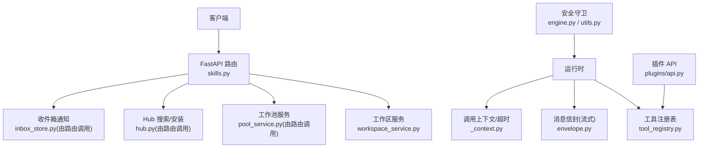
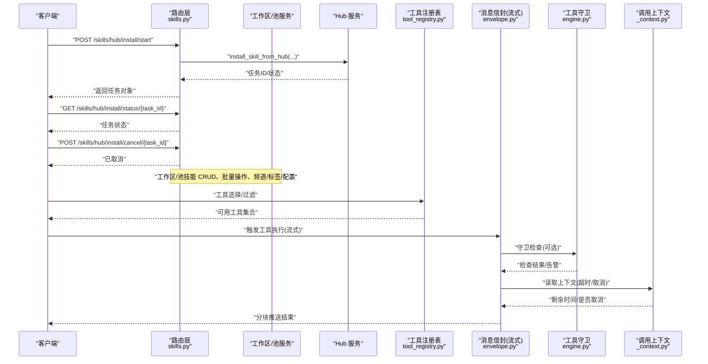
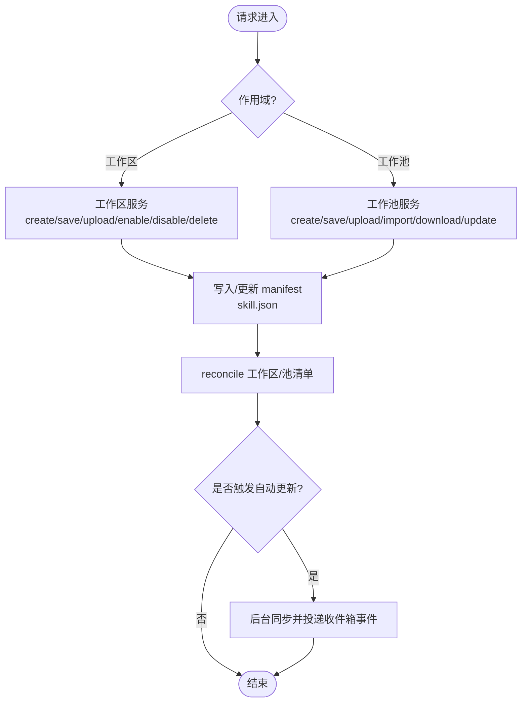
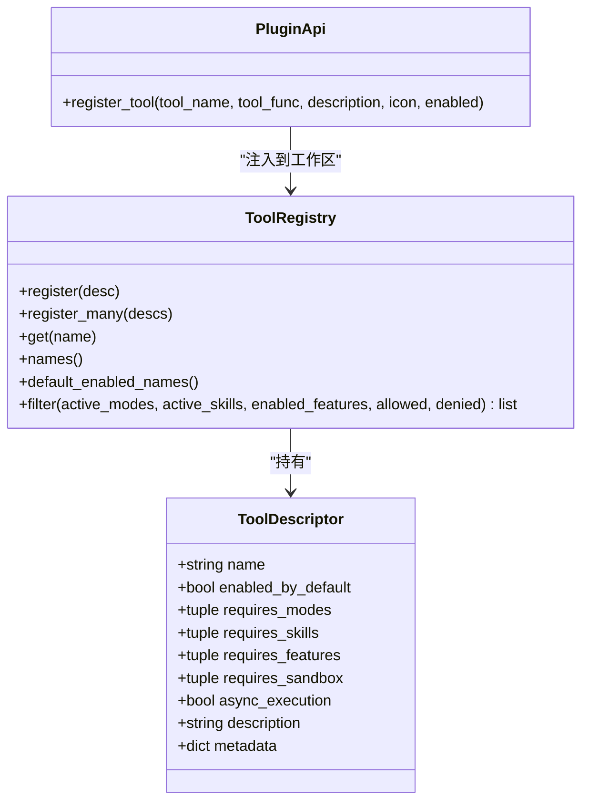
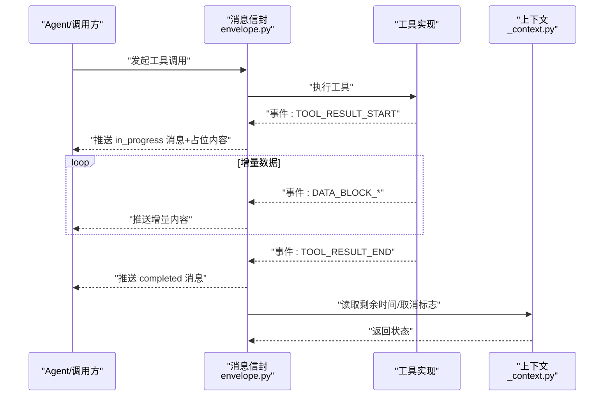
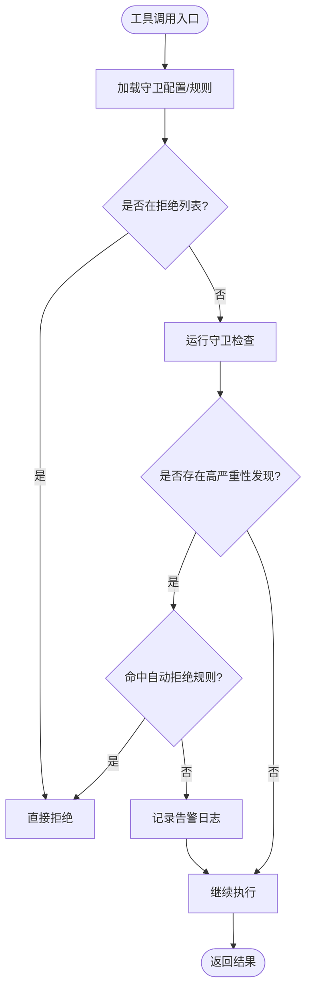
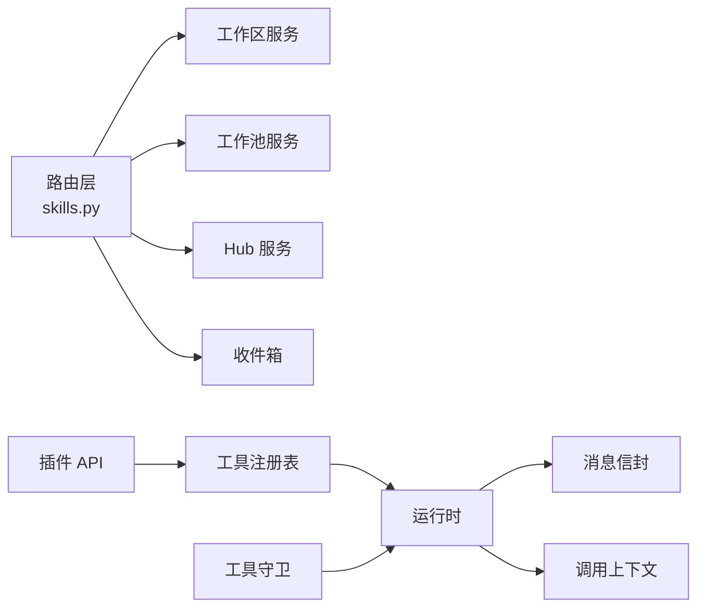

# 技能与工具接口

<cite>
**本文引用的文件**
- [src/qwenpaw/app/routers/skills.py](file://src/qwenpaw/app/routers/skills.py)
- [src/qwenpaw/agents/skill_system/workspace_service.py](file://src/qwenpaw/agents/skill_system/workspace_service.py)
- [src/qwenpaw/runtime/tool_registry.py](file://src/qwenpaw/runtime/tool_registry.py)
- [src/qwenpaw/plugins/api.py](file://src/qwenpaw/plugins/api.py)
- [src/qwenpaw/runtime/envelope.py](file://src/qwenpaw/runtime/envelope.py)
- [src/qwenpaw/security/tool_guard/engine.py](file://src/qwenpaw/security/tool_guard/engine.py)
- [src/qwenpaw/security/tool_guard/utils.py](file://src/qwenpaw/security/tool_guard/utils.py)
- [src/qwenpaw/tool_calls/_context.py](file://src/qwenpaw/tool_calls/_context.py)
- [tests/integration/test_skills_agent_scoped.py](file://tests/integration/test_skills_agent_scoped.py)
- [tests/integration/test_tools.py](file://tests/integration/test_tools.py)
- [tests/integration/test_multi_agent_config_isolation.py](file://tests/integration/test_multi_agent_config_isolation.py)
- [website/public/docs/skills.zh.md](file://website/public/docs/skills.zh.md)
</cite>

## 目录
1. [简介](#简介)
2. [项目结构](#项目结构)
3. [核心组件](#核心组件)
4. [架构总览](#架构总览)
5. [详细组件分析](#详细组件分析)
6. [依赖关系分析](#依赖关系分析)
7. [性能考虑](#性能考虑)
8. [故障排查指南](#故障排查指南)
9. [结论](#结论)
10. [附录：API 规范与示例](#附录api-规范与示例)

## 简介
本文件面向 QwenPaw 的“技能与工具管理”RESTful API，覆盖以下能力：
- 技能的发现、安装、配置、执行（含流式）与版本控制
- 技能清单管理（工作区与工作池）、依赖解析与冲突处理
- 工具的注册、调用、权限控制与执行结果处理
- 流式技能执行接口、工具调用跟踪与性能监控
- 技能市场集成、批量操作与异步执行
- 完整的 API 示例与最佳实践

## 项目结构
围绕技能与工具的核心代码主要分布在如下模块：
- 路由层：FastAPI 路由定义，暴露 REST 接口
- 服务层：工作区与工作池的技能生命周期服务
- 运行时：工具注册表、消息信封（流式输出）、上下文与超时控制
- 安全：工具守卫引擎与规则日志
- 插件：插件 API 用于动态注册工具并桥接到运行时
- 文档与测试：用户文档与端到端用例

图表来源
- [src/qwenpaw/app/routers/skills.py:70-1702](file://src/qwenpaw/app/routers/skills.py#L70-L1702)
- [src/qwenpaw/agents/skill_system/workspace_service.py:88-782](file://src/qwenpaw/agents/skill_system/workspace_service.py#L88-L782)
- [src/qwenpaw/runtime/tool_registry.py:1-234](file://src/qwenpaw/runtime/tool_registry.py#L1-L234)
- [src/qwenpaw/runtime/envelope.py:375-524](file://src/qwenpaw/runtime/envelope.py#L375-L524)
- [src/qwenpaw/security/tool_guard/engine.py:1-198](file://src/qwenpaw/security/tool_guard/engine.py#L1-L198)
- [src/qwenpaw/security/tool_guard/utils.py:148-193](file://src/qwenpaw/security/tool_guard/utils.py#L148-L193)
- [src/qwenpaw/tool_calls/_context.py:1-55](file://src/qwenpaw/tool_calls/_context.py#L1-L55)
- [src/qwenpaw/plugins/api.py:54-112](file://src/qwenpaw/plugins/api.py#L54-L112)

章节来源
- [src/qwenpaw/app/routers/skills.py:70-1702](file://src/qwenpaw/app/routers/skills.py#L70-L1702)
- [src/qwenpaw/agents/skill_system/workspace_service.py:88-782](file://src/qwenpaw/agents/skill_system/workspace_service.py#L88-L782)
- [src/qwenpaw/runtime/tool_registry.py:1-234](file://src/qwenpaw/runtime/tool_registry.py#L1-L234)
- [src/qwenpaw/runtime/envelope.py:375-524](file://src/qwenpaw/runtime/envelope.py#L375-L524)
- [src/qwenpaw/security/tool_guard/engine.py:1-198](file://src/qwenpaw/security/tool_guard/engine.py#L1-L198)
- [src/qwenpaw/security/tool_guard/utils.py:148-193](file://src/qwenpaw/security/tool_guard/utils.py#L148-L193)
- [src/qwenpaw/tool_calls/_context.py:1-55](file://src/qwenpaw/tool_calls/_context.py#L1-L55)
- [src/qwenpaw/plugins/api.py:54-112](file://src/qwenpaw/plugins/api.py#L54-L112)

## 核心组件
- 技能路由与服务
  - 工作区技能：创建、保存、上传 ZIP、启用/禁用、批量操作、频道路由、标签、配置、删除、刷新、列表
  - 工作池技能：创建、保存、上传 ZIP、导入、下载至多工作区、内置源导入/更新、自动更新开关、批量删除、列表
  - Hub 搜索与安装：支持任务化安装、状态查询、取消；扫描失败返回结构化错误
- 工具注册与过滤
  - 通过装饰器声明工具描述符，按模式/技能/特性/沙箱需求过滤
  - 插件可通过 PluginApi.register_tool 将函数注入到各工作区的 ToolRegistry
- 流式执行与结果封装
  - 工具结果以事件驱动方式分块推送，包含开始、增量数据、完成等阶段
- 安全守卫
  - 工具守卫引擎对参数进行规则检查，支持自动拒绝规则与告警日志
- 调用上下文
  - 提供每调用上下文（ID、会话、截止时间、取消事件等），支撑超时与取消

章节来源
- [src/qwenpaw/app/routers/skills.py:70-1702](file://src/qwenpaw/app/routers/skills.py#L70-L1702)
- [src/qwenpaw/agents/skill_system/workspace_service.py:88-782](file://src/qwenpaw/agents/skill_system/workspace_service.py#L88-L782)
- [src/qwenpaw/runtime/tool_registry.py:1-234](file://src/qwenpaw/runtime/tool_registry.py#L1-L234)
- [src/qwenpaw/plugins/api.py:54-112](file://src/qwenpaw/plugins/api.py#L54-L112)
- [src/qwenpaw/runtime/envelope.py:375-524](file://src/qwenpaw/runtime/envelope.py#L375-L524)
- [src/qwenpaw/security/tool_guard/engine.py:1-198](file://src/qwenpaw/security/tool_guard/engine.py#L1-L198)
- [src/qwenpaw/security/tool_guard/utils.py:148-193](file://src/qwenpaw/security/tool_guard/utils.py#L148-L193)
- [src/qwenpaw/tool_calls/_context.py:1-55](file://src/qwenpaw/tool_calls/_context.py#L1-L55)

## 架构总览
下图展示了从 HTTP 请求到技能/工具执行的端到端流程，包括安装任务、安全校验、流式输出与上下文控制。

图表来源
- [src/qwenpaw/app/routers/skills.py:757-814](file://src/qwenpaw/app/routers/skills.py#L757-L814)
- [src/qwenpaw/runtime/tool_registry.py:90-134](file://src/qwenpaw/runtime/tool_registry.py#L90-L134)
- [src/qwenpaw/runtime/envelope.py:375-524](file://src/qwenpaw/runtime/envelope.py#L375-L524)
- [src/qwenpaw/security/tool_guard/engine.py:162-198](file://src/qwenpaw/security/tool_guard/engine.py#L162-L198)
- [src/qwenpaw/tool_calls/_context.py:23-55](file://src/qwenpaw/tool_calls/_context.py#L23-L55)

## 详细组件分析

### 技能管理 API（工作区与工作池）
- 工作区技能
  - 列表/刷新：GET /skills, POST /skills/refresh
  - 创建/保存/上传 ZIP：POST /skills, PUT /skills/save, POST /skills/upload
  - 启用/禁用/批量：POST /skills/{name}/enable|disable, POST /skills/batch-enable|disable|delete
  - 频道/标签/配置：PUT /skills/{name}/channels|tags, GET/PUT/DELETE /skills/{name}/config
  - 删除：DELETE /skills/{name}
  - 文件读取：GET /skills/{name}/files/{path}
- 工作池技能
  - 列表/刷新：GET /skills/pool, POST /skills/pool/refresh
  - 创建/保存/上传 ZIP：POST /skills/pool/create, PUT /skills/pool/save, POST /skills/pool/upload-zip
  - 导入/下载：POST /skills/pool/import, POST /skills/pool/download
  - 内置源：GET /skills/pool/builtin-sources, GET /skills/pool/builtin-notice, POST /skills/pool/import-builtin, POST /skills/pool/{name}/update-builtin
  - 自动更新：PUT /skills/pool/{name}/auto-update
  - 批量删除：POST /skills/pool/batch-delete
  - 配置：GET/PUT/DELETE /skills/pool/{name}/config
- Hub 安装（异步任务）
  - 启动：POST /skills/hub/install/start
  - 状态：GET /skills/hub/install/status/{task_id}
  - 取消：POST /skills/hub/install/cancel/{task_id}

图表来源
- [src/qwenpaw/app/routers/skills.py:862-941](file://src/qwenpaw/app/routers/skills.py#L862-L941)
- [src/qwenpaw/app/routers/skills.py:943-1031](file://src/qwenpaw/app/routers/skills.py#L943-L1031)
- [src/qwenpaw/app/routers/skills.py:1203-1245](file://src/qwenpaw/app/routers/skills.py#L1203-L1245)
- [src/qwenpaw/app/routers/skills.py:1248-1284](file://src/qwenpaw/app/routers/skills.py#L1248-L1284)
- [src/qwenpaw/app/routers/skills.py:1373-1397](file://src/qwenpaw/app/routers/skills.py#L1373-L1397)
- [src/qwenpaw/agents/skill_system/workspace_service.py:145-227](file://src/qwenpaw/agents/skill_system/workspace_service.py#L145-L227)
- [src/qwenpaw/agents/skill_system/workspace_service.py:229-442](file://src/qwenpaw/agents/skill_system/workspace_service.py#L229-L442)
- [src/qwenpaw/agents/skill_system/workspace_service.py:444-553](file://src/qwenpaw/agents/skill_system/workspace_service.py#L444-L553)
- [src/qwenpaw/agents/skill_system/workspace_service.py:554-750](file://src/qwenpaw/agents/skill_system/workspace_service.py#L554-L750)

章节来源
- [src/qwenpaw/app/routers/skills.py:70-1702](file://src/qwenpaw/app/routers/skills.py#L70-L1702)
- [src/qwenpaw/agents/skill_system/workspace_service.py:88-782](file://src/qwenpaw/agents/skill_system/workspace_service.py#L88-L782)
- [tests/integration/test_skills_agent_scoped.py:26-81](file://tests/integration/test_skills_agent_scoped.py#L26-L81)
- [tests/integration/test_skills_agent_scoped.py:429-467](file://tests/integration/test_skills_agent_scoped.py#L429-L467)

### 工具注册与过滤
- 工具描述符与注册表
  - 使用装饰器声明工具元信息（名称、默认启用、所需模式/技能/特性/沙箱、异步执行、描述等）
  - 注册表根据当前 Agent 的模式、生效技能、特性开关与白/黑名单过滤出可用工具
- 插件注册工具
  - 插件通过 PluginApi.register_tool 将函数注入到 tools 模块与每个工作区的 ToolRegistry
  - 同时为当前 Agent 写入 BuiltinToolConfig，便于 UI 展示与后续切换

图表来源
- [src/qwenpaw/runtime/tool_registry.py:16-134](file://src/qwenpaw/runtime/tool_registry.py#L16-L134)
- [src/qwenpaw/plugins/api.py:54-112](file://src/qwenpaw/plugins/api.py#L54-L112)

章节来源
- [src/qwenpaw/runtime/tool_registry.py:1-234](file://src/qwenpaw/runtime/tool_registry.py#L1-L234)
- [src/qwenpaw/plugins/api.py:54-112](file://src/qwenpaw/plugins/api.py#L54-L112)
- [tests/integration/test_tools.py:44-74](file://tests/integration/test_tools.py#L44-L74)
- [tests/integration/test_multi_agent_config_isolation.py:287-331](file://tests/integration/test_multi_agent_config_isolation.py#L287-L331)

### 流式技能执行与工具结果
- 流式输出
  - 工具结果以事件驱动方式分块推送，包含开始、增量数据、完成等阶段
  - 消息信封负责组装 FunctionCallOutput 与 DataContent，并维护输出消息状态
- 外部代理流式动作
  - 针对外部代理的 action 支持即时动作与流式推进，统一返回 ToolChunk 序列

图表来源
- [src/qwenpaw/runtime/envelope.py:375-524](file://src/qwenpaw/runtime/envelope.py#L375-L524)
- [src/qwenpaw/tool_calls/_context.py:23-55](file://src/qwenpaw/tool_calls/_context.py#L23-L55)

章节来源
- [src/qwenpaw/runtime/envelope.py:375-524](file://src/qwenpaw/runtime/envelope.py#L375-L524)
- [src/qwenpaw/tool_calls/_context.py:1-55](file://src/qwenpaw/tool_calls/_context.py#L1-L55)

### 安全守卫与权限控制
- 工具守卫引擎
  - 加载守护规则、受控工具集、拒绝工具集与自动拒绝规则
  - 支持重载规则、判断是否应自动拒绝、是否处于守卫范围
- 日志与告警
  - 对高严重性发现记录警告日志，汇总最大严重性与耗时

图表来源
- [src/qwenpaw/security/tool_guard/engine.py:162-198](file://src/qwenpaw/security/tool_guard/engine.py#L162-L198)
- [src/qwenpaw/security/tool_guard/utils.py:148-193](file://src/qwenpaw/security/tool_guard/utils.py#L148-L193)

章节来源
- [src/qwenpaw/security/tool_guard/engine.py:1-198](file://src/qwenpaw/security/tool_guard/engine.py#L1-L198)
- [src/qwenpaw/security/tool_guard/utils.py:148-193](file://src/qwenpaw/security/tool_guard/utils.py#L148-L193)

### 技能市场集成与批量/异步
- 市场搜索与安装
  - 并行搜索多个数据源，串行安装队列，支持重试与取消
  - 安装完成后记录 installed_from 字段，便于前端展示来源
- 批量操作
  - 工作区与工作池均支持批量启用/禁用/删除，返回逐条结果
- 异步安装任务
  - 启动/状态/取消三件套，内部使用线程事件与 asyncio.Task 协作

章节来源
- [website/public/docs/skills.zh.md:339-365](file://website/public/docs/skills.zh.md#L339-L365)
- [src/qwenpaw/app/routers/skills.py:757-814](file://src/qwenpaw/app/routers/skills.py#L757-L814)
- [src/qwenpaw/app/routers/skills.py:1400-1444](file://src/qwenpaw/app/routers/skills.py#L1400-L1444)
- [src/qwenpaw/app/routers/skills.py:1447-1495](file://src/qwenpaw/app/routers/skills.py#L1447-L1495)

## 依赖关系分析
- 路由层依赖服务层（工作区/池）与 Hub 服务，服务层依赖存储与清单 reconcile
- 运行时工具注册表被插件注入，并在 Agent 构建时按条件过滤
- 流式输出由消息信封统一封装，结合上下文控制超时与取消
- 安全守卫在工具执行路径中可插拔，影响是否放行或告警

图表来源
- [src/qwenpaw/app/routers/skills.py:70-1702](file://src/qwenpaw/app/routers/skills.py#L70-L1702)
- [src/qwenpaw/plugins/api.py:54-112](file://src/qwenpaw/plugins/api.py#L54-L112)
- [src/qwenpaw/runtime/tool_registry.py:1-234](file://src/qwenpaw/runtime/tool_registry.py#L1-L234)
- [src/qwenpaw/runtime/envelope.py:375-524](file://src/qwenpaw/runtime/envelope.py#L375-L524)
- [src/qwenpaw/security/tool_guard/engine.py:1-198](file://src/qwenpaw/security/tool_guard/engine.py#L1-L198)

## 性能考虑
- 批量操作与并发
  - 批量启用/禁用/删除采用逐条处理，避免长事务阻塞
  - Hub 安装走串行队列，防止资源竞争与重复安装
- 流式输出
  - 增量推送减少首字节延迟，适合大结果或长时间运行的工具
- 缓存与重算
  - 刷新接口强制 reconcile，按需使用以避免频繁全量重建
- 安全守卫开销
  - 守卫检查可按需开启，高严重性告警仅记录，不阻断正常流程（除非命中自动拒绝）

[本节为通用指导，无需源码引用]

## 故障排查指南
- 常见错误码
  - 400：参数错误或非法语言/重命名映射
  - 404：技能/配置不存在
  - 409：冲突（同名、覆盖未允许、仅能删除已禁用技能）
  - 422：安全扫描失败（结构化 findings）
- 定位要点
  - 查看安装任务状态与错误详情
  - 关注安全守卫日志中的最高严重性与匹配规则
  - 确认工作区/池清单 reconcile 后状态一致
  - 检查频道路由与标签是否导致技能不可见

章节来源
- [src/qwenpaw/app/routers/skills.py:150-190](file://src/qwenpaw/app/routers/skills.py#L150-L190)
- [src/qwenpaw/security/tool_guard/utils.py:148-193](file://src/qwenpaw/security/tool_guard/utils.py#L148-L193)
- [tests/integration/test_skills_agent_scoped.py:26-81](file://tests/integration/test_skills_agent_scoped.py#L26-L81)

## 结论
QwenPaw 的技能与工具管理 API 提供了完善的工作区与工作池管理能力，支持 Hub 市场集成、批量与异步操作、流式执行与安全守卫。通过清晰的职责分层与可扩展的插件机制，系统既能满足日常运维与开发需求，也能支撑复杂场景下的稳定与可控。

[本节为总结，无需源码引用]

## 附录：API 规范与示例

### 工作区技能（/api/agents/{agentId}/skills）
- 列表
  - GET /api/agents/{agentId}/skills
  - 响应：技能数组（包含 enabled、channels、tags、config、installed_from 等）
- 刷新
  - POST /api/agents/{agentId}/skills/refresh
- 创建
  - POST /api/agents/{agentId}/skills
  - 请求体：{ name, content, references?, scripts?, config?, enable? }
  - 成功：{ created: true, name }
  - 冲突：409 { reason: "conflict", suggested_name }
- 保存
  - PUT /api/agents/{agentId}/skills/save
  - 请求体：{ name, content, source_name?, config?, overwrite? }
  - 成功：{ success, mode, name }
- 上传 ZIP
  - POST /api/agents/{agentId}/skills/upload
  - 表单：file, enable?, target_name?, rename_map?(JSON 字符串)
  - 冲突：409 { conflicts }
- 启用/禁用
  - POST /api/agents/{agentId}/skills/{name}/enable
  - POST /api/agents/{agentId}/skills/{name}/disable
- 批量
  - POST /api/agents/{agentId}/skills/batch-enable
  - POST /api/agents/{agentId}/skills/batch-disable
  - POST /api/agents/{agentId}/skills/batch-delete
- 频道/标签/配置
  - PUT /api/agents/{agentId}/skills/{name}/channels
  - PUT /api/agents/{agentId}/skills/{name}/tags
  - GET /api/agents/{agentId}/skills/{name}/config
  - PUT /api/agents/{agentId}/skills/{name}/config
  - DELETE /api/agents/{agentId}/skills/{name}/config
- 删除
  - DELETE /api/agents/{agentId}/skills/{name}
- 读取文件
  - GET /api/agents/{agentId}/skills/{name}/files/{path}

章节来源
- [tests/integration/test_skills_agent_scoped.py:26-81](file://tests/integration/test_skills_agent_scoped.py#L26-L81)
- [tests/integration/test_skills_agent_scoped.py:429-467](file://tests/integration/test_skills_agent_scoped.py#L429-L467)
- [src/qwenpaw/app/routers/skills.py:706-718](file://src/qwenpaw/app/routers/skills.py#L706-L718)
- [src/qwenpaw/app/routers/skills.py:862-941](file://src/qwenpaw/app/routers/skills.py#L862-L941)
- [src/qwenpaw/app/routers/skills.py:1498-1552](file://src/qwenpaw/app/routers/skills.py#L1498-L1552)
- [src/qwenpaw/app/routers/skills.py:1554-1568](file://src/qwenpaw/app/routers/skills.py#L1554-L1568)
- [src/qwenpaw/app/routers/skills.py:1570-1597](file://src/qwenpaw/app/routers/skills.py#L1570-L1597)
- [src/qwenpaw/app/routers/skills.py:1600-1650](file://src/qwenpaw/app/routers/skills.py#L1600-L1650)
- [src/qwenpaw/app/routers/skills.py:1653-1702](file://src/qwenpaw/app/routers/skills.py#L1653-L1702)

### 工作池技能（/api/skills/pool）
- 列表/刷新
  - GET /api/skills/pool
  - POST /api/skills/pool/refresh
- 创建/保存/上传 ZIP
  - POST /api/skills/pool/create
  - PUT /api/skills/pool/save
  - POST /api/skills/pool/upload-zip
- 导入/下载
  - POST /api/skills/pool/import
  - POST /api/skills/pool/download
- 内置源
  - GET /api/skills/pool/builtin-sources
  - GET /api/skills/pool/builtin-notice
  - POST /api/skills/pool/import-builtin
  - POST /api/skills/pool/{name}/update-builtin
- 自动更新
  - PUT /api/skills/pool/{name}/auto-update
- 批量删除
  - POST /api/skills/pool/batch-delete
- 配置
  - GET/PUT/DELETE /api/skills/pool/{name}/config

章节来源
- [src/qwenpaw/app/routers/skills.py:817-860](file://src/qwenpaw/app/routers/skills.py#L817-L860)
- [src/qwenpaw/app/routers/skills.py:943-1031](file://src/qwenpaw/app/routers/skills.py#L943-L1031)
- [src/qwenpaw/app/routers/skills.py:1034-1084](file://src/qwenpaw/app/routers/skills.py#L1034-L1084)
- [src/qwenpaw/app/routers/skills.py:1203-1245](file://src/qwenpaw/app/routers/skills.py#L1203-L1245)
- [src/qwenpaw/app/routers/skills.py:1248-1284](file://src/qwenpaw/app/routers/skills.py#L1248-L1284)
- [src/qwenpaw/app/routers/skills.py:1287-1341](file://src/qwenpaw/app/routers/skills.py#L1287-L1341)
- [src/qwenpaw/app/routers/skills.py:1358-1397](file://src/qwenpaw/app/routers/skills.py#L1358-L1397)
- [src/qwenpaw/app/routers/skills.py:1425-1444](file://src/qwenpaw/app/routers/skills.py#L1425-L1444)

### Hub 安装（异步任务）
- 启动安装
  - POST /api/skills/hub/install/start
  - 请求体：{ bundle_url, version?, enable?, target_name? }
  - 响应：任务对象（task_id, status, ...）
- 查询状态
  - GET /api/skills/hub/install/status/{task_id}
- 取消安装
  - POST /api/skills/hub/install/cancel/{task_id}

章节来源
- [src/qwenpaw/app/routers/skills.py:757-814](file://src/qwenpaw/app/routers/skills.py#L757-L814)

### 工具管理（/api/agents/{agentId}/tools）
- 列出工具
  - GET /api/agents/{agentId}/tools
- 切换启用状态
  - PATCH /api/agents/{agentId}/tools/{name}/toggle
- 设置异步执行
  - PATCH /api/agents/{agentId}/tools/{name}/async-execution
  - 请求体：{ async_execution: bool }

章节来源
- [tests/integration/test_tools.py:44-74](file://tests/integration/test_tools.py#L44-L74)
- [tests/integration/test_multi_agent_config_isolation.py:287-331](file://tests/integration/test_multi_agent_config_isolation.py#L287-L331)

### 最佳实践
- 安装前预览
  - 使用 preview_only 参数预检冲突，再决定是否实际写入
- 批量操作的幂等性
  - 批量启用/禁用/删除返回逐条结果，建议客户端基于结果重试失败项
- 安全策略
  - 合理配置 guarded_tools/denied_tools/auto_denied_rules，避免误放行高风险工具
- 流式消费
  - 客户端应按事件顺序消费，处理 in_progress 与 completed 标记，注意超时与取消
- 频道路由与标签
  - 通过 channels 限制技能可见范围，配合 tags 提升检索效率

[本节为通用指导，无需源码引用]