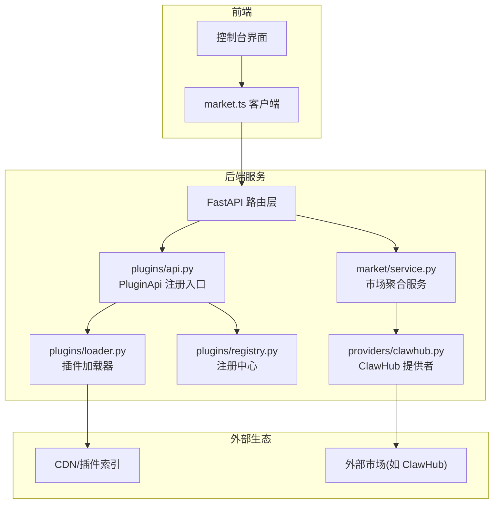
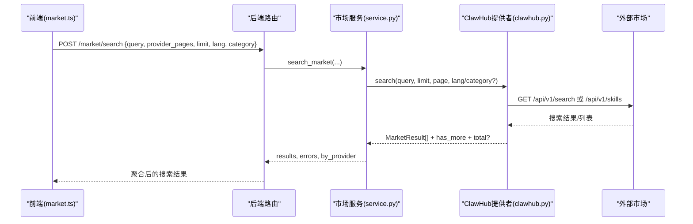
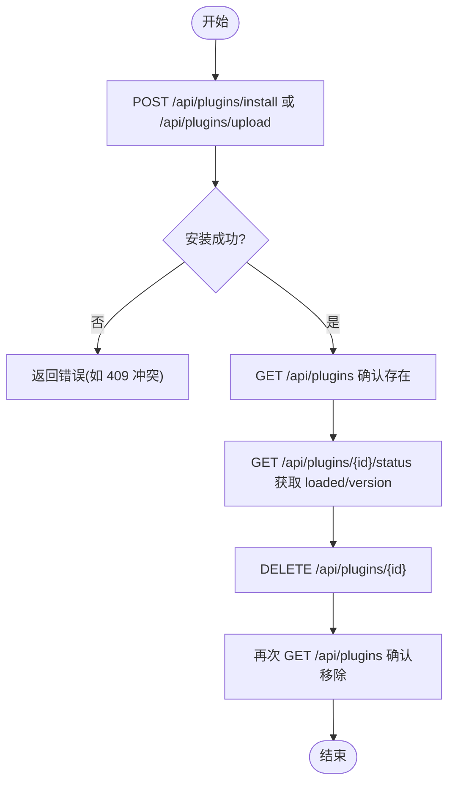
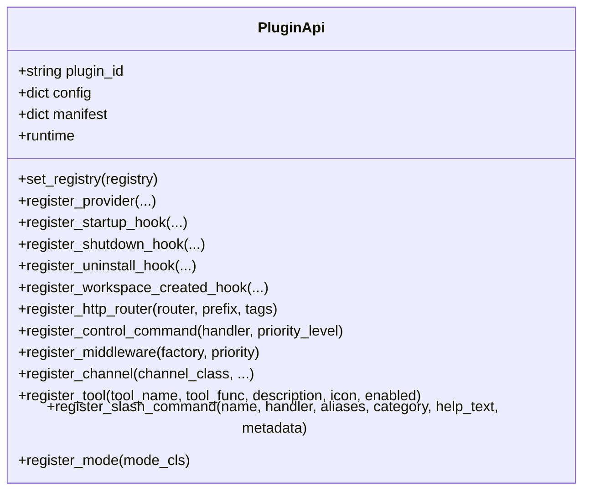
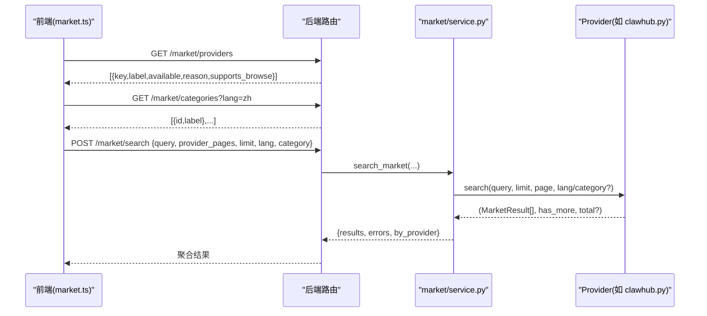
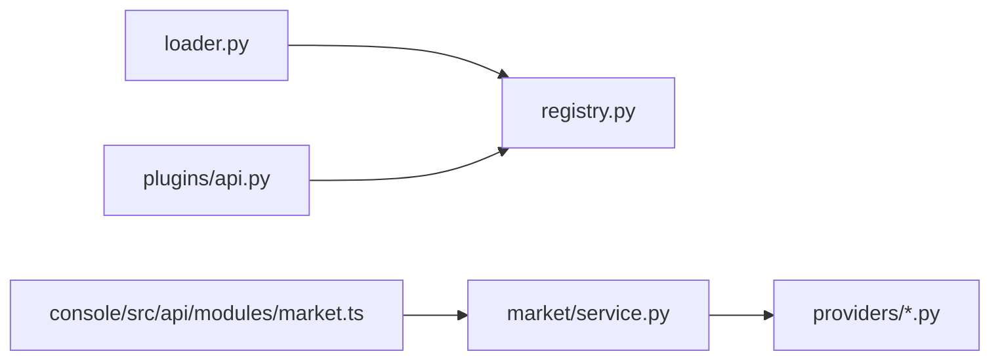

# 插件与市场接口

<cite>
**本文引用的文件**
- [src/qwenpaw/plugins/api.py](file://src/qwenpaw/plugins/api.py)
- [src/qwenpaw/plugins/loader.py](file://src/qwenpaw/plugins/loader.py)
- [src/qwenpaw/plugins/registry.py](file://src/qwenpaw/plugins/registry.py)
- [src/qwenpaw/market/service.py](file://src/qwenpaw/market/service.py)
- [src/qwenpaw/market/providers/clawhub.py](file://src/qwenpaw/market/providers/clawhub.py)
- [console/src/api/modules/market.ts](file://console/src/api/modules/market.ts)
- [tests/integration/test_plugins.py](file://tests/integration/test_plugins.py)
- [tests/integration/test_plugin_types.py](file://tests/integration/test_plugin_types.py)
- [src/qwenpaw/sandbox/__init__.py](file://src/qwenpaw/sandbox/__init__.py)
- [src/qwenpaw/security/__init__.py](file://src/qwenpaw/security/__init__.py)
- [website/public/docs/plugins-migration.zh.md](file://website/public/docs/plugins-migration.zh.md)
</cite>

## 目录
1. [简介](#简介)
2. [项目结构](#项目结构)
3. [核心组件](#核心组件)
4. [架构总览](#架构总览)
5. [详细组件分析](#详细组件分析)
6. [依赖关系分析](#依赖关系分析)
7. [性能考量](#性能考量)
8. [故障排查指南](#故障排查指南)
9. [结论](#结论)
10. [附录](#附录)

## 简介
本文件面向 QwenPaw 的“插件系统”与“插件市场管理”RESTful API，覆盖以下能力：
- 插件的发现、安装、卸载与版本管理（含冲突解决与强制替换）
- 插件市场的浏览、搜索、分页与错误聚合
- 前端插件的动态加载、静态资源服务与安全隔离
- 插件依赖管理与兼容性校验
- 插件开发、发布与审核流程相关的 API 说明

文档同时给出端到端调用序列图、类关系图与流程图，帮助读者快速理解从前端到后端、再到外部市场提供者的完整链路。

## 项目结构
围绕插件与市场的关键代码分布如下：
- 插件运行时与注册中心：plugins/api.py、plugins/loader.py、plugins/registry.py
- 市场服务与提供者：market/service.py、market/providers/clawhub.py
- 前端市场客户端：console/src/api/modules/market.ts
- 集成测试用例（验证 REST 行为）：tests/integration/test_plugins.py、tests/integration/test_plugin_types.py
- 沙箱与安全框架：sandbox/__init__.py、security/__init__.py
- 迁移与发布指引：website/public/docs/plugins-migration.zh.md

图表来源
- [src/qwenpaw/plugins/api.py:172-800](file://src/qwenpaw/plugins/api.py#L172-L800)
- [src/qwenpaw/plugins/loader.py:419-458](file://src/qwenpaw/plugins/loader.py#L419-L458)
- [src/qwenpaw/plugins/registry.py:29-83](file://src/qwenpaw/plugins/registry.py#L29-L83)
- [src/qwenpaw/market/service.py:38-76](file://src/qwenpaw/market/service.py#L38-L76)
- [src/qwenpaw/market/providers/clawhub.py:28-167](file://src/qwenpaw/market/providers/clawhub.py#L28-L167)
- [console/src/api/modules/market.ts:53-66](file://console/src/api/modules/market.ts#L53-L66)

章节来源
- [src/qwenpaw/plugins/api.py:172-800](file://src/qwenpaw/plugins/api.py#L172-L800)
- [src/qwenpaw/plugins/loader.py:419-458](file://src/qwenpaw/plugins/loader.py#L419-L458)
- [src/qwenpaw/plugins/registry.py:29-83](file://src/qwenpaw/plugins/registry.py#L29-L83)
- [src/qwenpaw/market/service.py:38-76](file://src/qwenpaw/market/service.py#L38-L76)
- [src/qwenpaw/market/providers/clawhub.py:28-167](file://src/qwenpaw/market/providers/clawhub.py#L28-L167)
- [console/src/api/modules/market.ts:53-66](file://console/src/api/modules/market.ts#L53-L66)

## 核心组件
- 插件 API（PluginApi）
  - 提供 register_provider/register_tool/register_http_router/register_channel 等扩展点，供插件在启动时注册能力。
  - 工具注册会延迟到启动钩子中完成，确保运行时上下文就绪。
- 插件加载器（Loader）
  - 解析 manifest（包含 qwenpaw_version 兼容区间），构造 PluginApi 并调用 plugin.register(api)。
  - 失败路径执行清理并抛出异常，保证热插拔稳定性。
- 注册中心（Registry）
  - 维护 Provider/Hook/HTTP Router/Channel 等注册表，支持将插件路由挂载到主应用前，避免被 SPA 通配路由拦截。
- 市场服务（Market Service）
  - 聚合多个市场提供者，按页并行检索，合并结果与错误，返回 by_provider 分页信息。
- 市场提供者（以 ClawHub 为例）
  - 实现 search/browse 逻辑，适配统一 MarketResult 模型，处理 has_more/total 语义差异。
- 前端市场客户端（market.ts）
  - 封装 listMarketProviders/listMarketCategories/searchMarket 三个方法，定义请求/响应类型。

章节来源
- [src/qwenpaw/plugins/api.py:172-800](file://src/qwenpaw/plugins/api.py#L172-L800)
- [src/qwenpaw/plugins/loader.py:419-458](file://src/qwenpaw/plugins/loader.py#L419-L458)
- [src/qwenpaw/plugins/registry.py:29-83](file://src/qwenpaw/plugins/registry.py#L29-L83)
- [src/qwenpaw/market/service.py:38-76](file://src/qwenpaw/market/service.py#L38-L76)
- [src/qwenpaw/market/providers/clawhub.py:28-167](file://src/qwenpaw/market/providers/clawhub.py#L28-L167)
- [console/src/api/modules/market.ts:53-66](file://console/src/api/modules/market.ts#L53-L66)

## 架构总览
下图展示插件生命周期与市场搜索的整体交互：

图表来源
- [src/qwenpaw/market/service.py:38-76](file://src/qwenpaw/market/service.py#L38-L76)
- [src/qwenpaw/market/providers/clawhub.py:28-167](file://src/qwenpaw/market/providers/clawhub.py#L28-L167)
- [console/src/api/modules/market.ts:53-66](file://console/src/api/modules/market.ts#L53-L66)

## 详细组件分析

### 插件发现与清单
- 清单字段与兼容性
  - 推荐使用 qwenpaw_version{min,max} 声明兼容区间；旧版 min_version/max_version 仍受支持但优先级较低。
  - 加载器会在导入前检查兼容性，不兼容则记录为不可用且不执行 register()。
- 清单元数据透传
  - 加载器将 manifest 转换为字典并通过 PluginApi 注入，provider 注册时可合并 meta。

章节来源
- [website/public/docs/plugins-migration.zh.md:330-343](file://website/public/docs/plugins-migration.zh.md#L330-L343)
- [src/qwenpaw/plugins/loader.py:419-458](file://src/qwenpaw/plugins/loader.py#L419-L458)
- [src/qwenpaw/plugins/api.py:205-249](file://src/qwenpaw/plugins/api.py#L205-L249)

### 插件安装/卸载/状态/目录
- 安装
  - 本地源安装：POST /api/plugins/install（使用本地目录作为源）
  - 上传安装：POST /api/plugins/upload（上传 zip，支持 force=true 强制替换）
- 列出已加载插件：GET /api/plugins
- 查询状态：GET /api/plugins/{plugin_id}/status
- 卸载：DELETE /api/plugins/{plugin_id}
- 目录：GET /api/plugins/catalog（若外部 CDN 不可达，服务端应回退到内置目录）

图表来源
- [tests/integration/test_plugins.py:392-416](file://tests/integration/test_plugins.py#L392-L416)
- [tests/integration/test_plugins.py:466-497](file://tests/integration/test_plugins.py#L466-L497)
- [tests/integration/test_plugins.py:578-611](file://tests/integration/test_plugins.py#L578-L611)

章节来源
- [tests/integration/test_plugins.py:262-277](file://tests/integration/test_plugins.py#L262-L277)
- [tests/integration/test_plugins.py:279-298](file://tests/integration/test_plugins.py#L279-L298)
- [tests/integration/test_plugins.py:301-311](file://tests/integration/test_plugins.py#L301-L311)
- [tests/integration/test_plugins.py:392-416](file://tests/integration/test_plugins.py#L392-L416)
- [tests/integration/test_plugins.py:466-497](file://tests/integration/test_plugins.py#L466-L497)
- [tests/integration/test_plugins.py:578-611](file://tests/integration/test_plugins.py#L578-L611)

### 冲突解决与强制替换
- 重复安装同一 id 的插件包会返回 409 冲突。
- 通过 ?force=true 可强制替换为新版本，随后状态接口反映新版本号。

章节来源
- [tests/integration/test_plugins.py:578-611](file://tests/integration/test_plugins.py#L578-L611)

### 前端插件动态加载与静态资源服务
- 公共列表：GET /api/frontend_plugin（未认证也可访问，用于登录页等前置场景）
- 静态资源：GET /api/frontend_plugin/{pid}/files/dist/index.js（直接返回打包产物）
- 安装后需在前端列表中可见，且静态资源可被正确分发。

章节来源
- [tests/integration/test_plugin_types.py:862-892](file://tests/integration/test_plugin_types.py#L862-L892)
- [tests/integration/test_plugin_types.py:895-933](file://tests/integration/test_plugin_types.py#L895-L933)
- [tests/integration/test_plugin_types.py:1014-1034](file://tests/integration/test_plugin_types.py#L1014-L1034)

### 插件 HTTP 路由挂载与 OpenAPI 刷新
- 插件可通过 register_http_router 暴露 /api 下的自定义路由。
- 注册中心会将新增路由插入到 SPA 通配路由之前，并清空 FastAPI openapi_schema 缓存，使 /openapi.json 即时生效。

章节来源
- [src/qwenpaw/plugins/registry.py:29-52](file://src/qwenpaw/plugins/registry.py#L29-L52)

### 插件卸载对全局影响
- 卸载 Provider 插件后，/api/models 不再显示其 provider。
- 卸载后原插件注册的 /api/{pid}/... 路由应返回 404。

章节来源
- [tests/integration/test_plugin_types.py:390-412](file://tests/integration/test_plugin_types.py#L390-L412)
- [tests/integration/test_plugin_types.py:843-854](file://tests/integration/test_plugin_types.py#L843-L854)

### 插件开发 API（PluginApi）
- 注册 LLM Provider：register_provider(provider_id, provider_class, label, base_url, **metadata)
- 注册 Hook：register_startup_hook / register_shutdown_hook / register_uninstall_hook / register_workspace_created_hook
- 注册 HTTP 路由：register_http_router(router, prefix, tags)
- 注册控制命令：register_control_command(handler, priority_level)
- 注册中间件：register_middleware(factory, priority)
- 注册渠道：register_channel(channel_class, label, description, config_fields, icon, doc_url)
- 注册工具：register_tool(tool_name, tool_func, description, icon, enabled)
- 斜杠命令：register_slash_command(name, handler, aliases, category, help_text, metadata)
- 模式：register_mode(mode_cls)
- 运行时辅助：runtime 属性

图表来源
- [src/qwenpaw/plugins/api.py:172-800](file://src/qwenpaw/plugins/api.py#L172-L800)

章节来源
- [src/qwenpaw/plugins/api.py:172-800](file://src/qwenpaw/plugins/api.py#L172-L800)

### 市场浏览/搜索/分页
- 列出市场提供者：GET /market/providers
- 列出分类：GET /market/categories?lang=...
- 搜索：POST /market/search {query, provider_pages, limit?, lang?, category?}
  - 返回 {results, errors, by_provider}，by_provider 每个提供者携带 has_more 与 total。
- 提供者示例（ClawHub）
  - 支持 browse 与 search 两种路径；browse 无 total，has_more 基于 cursor。

图表来源
- [console/src/api/modules/market.ts:53-66](file://console/src/api/modules/market.ts#L53-L66)
- [src/qwenpaw/market/service.py:38-76](file://src/qwenpaw/market/service.py#L38-L76)
- [src/qwenpaw/market/providers/clawhub.py:28-167](file://src/qwenpaw/market/providers/clawhub.py#L28-L167)

章节来源
- [console/src/api/modules/market.ts:53-66](file://console/src/api/modules/market.ts#L53-L66)
- [src/qwenpaw/market/service.py:38-76](file://src/qwenpaw/market/service.py#L38-L76)
- [src/qwenpaw/market/providers/clawhub.py:28-167](file://src/qwenpaw/market/providers/clawhub.py#L28-L167)

### 安全与沙箱
- 安全框架
  - Tool Guard：执行前参数扫描，检测危险模式
  - Skill Scanner：安装/激活前静态扫描
  - Secret Store：敏感字段加密存储
- 沙箱
  - 多平台后端（Seatbelt/Bubblewrap/Landlock/AppContainer/None）
  - 生命周期：每次工具调用创建与销毁
  - 配置项包括 mode/workspace_dir/mounts/deny_paths/network_allow/timeout_seconds/env_vars 等

章节来源
- [src/qwenpaw/security/__init__.py:1-21](file://src/qwenpaw/security/__init__.py#L1-L21)
- [src/qwenpaw/sandbox/__init__.py:1-63](file://src/qwenpaw/sandbox/__init__.py#L1-L63)

## 依赖关系分析
- 插件 API 依赖注册中心进行能力注册与路由挂载。
- 加载器负责解析清单、构建 PluginApi 并触发注册。
- 市场服务依赖各 Provider 抽象，统一聚合结果。
- 前端 market.ts 仅依赖后端 /market/* 与 /api/plugins/* 契约。

图表来源
- [src/qwenpaw/plugins/loader.py:419-458](file://src/qwenpaw/plugins/loader.py#L419-L458)
- [src/qwenpaw/plugins/registry.py:29-83](file://src/qwenpaw/plugins/registry.py#L29-L83)
- [src/qwenpaw/plugins/api.py:172-800](file://src/qwenpaw/plugins/api.py#L172-L800)
- [src/qwenpaw/market/service.py:38-76](file://src/qwenpaw/market/service.py#L38-L76)
- [console/src/api/modules/market.ts:53-66](file://console/src/api/modules/market.ts#L53-L66)

章节来源
- [src/qwenpaw/plugins/loader.py:419-458](file://src/qwenpaw/plugins/loader.py#L419-L458)
- [src/qwenpaw/plugins/registry.py:29-83](file://src/qwenpaw/plugins/registry.py#L29-L83)
- [src/qwenpaw/plugins/api.py:172-800](file://src/qwenpaw/plugins/api.py#L172-L800)
- [src/qwenpaw/market/service.py:38-76](file://src/qwenpaw/market/service.py#L38-L76)
- [console/src/api/modules/market.ts:53-66](file://console/src/api/modules/market.ts#L53-L66)

## 性能考量
- 市场搜索并发：服务层对每个选定的 provider 并行发起搜索，减少整体延迟。
- 分页限制：服务端对 limit 做上限保护，防止过大请求导致下游压力。
- 路由挂载开销：仅在插件安装/卸载时更新路由与 OpenAPI 缓存，避免频繁重建。

[本节为通用指导，无需源码引用]

## 故障排查指南
- 插件未找到
  - GET /api/plugins/{id}/status 返回 404：表示既未加载也未存在于磁盘。
- 删除不存在插件
  - DELETE /api/plugins/{id} 返回 404：可用于区分“已卸载”和“服务器错误”。
- 清单缺少入口点
  - 上传的插件 manifest 未声明 entry.backend/entry.frontend，将返回 400 并提示 entry points 相关错误。
- 冲突与强制替换
  - 重复安装同 id 返回 409；使用 ?force=true 可覆盖并升级至新版本。
- Provider 卸载后模型列表
  - 卸载后 /api/models 不应再出现该 provider。
- 前端插件静态资源
  - 安装后可通过 /api/frontend_plugin/{pid}/files/dist/index.js 获取对应 JS。

章节来源
- [tests/integration/test_plugins.py:279-298](file://tests/integration/test_plugins.py#L279-L298)
- [tests/integration/test_plugins.py:301-311](file://tests/integration/test_plugins.py#L301-L311)
- [tests/integration/test_plugin_types.py:1037-1062](file://tests/integration/test_plugin_types.py#L1037-L1062)
- [tests/integration/test_plugins.py:578-611](file://tests/integration/test_plugins.py#L578-L611)
- [tests/integration/test_plugin_types.py:390-412](file://tests/integration/test_plugin_types.py#L390-L412)
- [tests/integration/test_plugin_types.py:895-933](file://tests/integration/test_plugin_types.py#L895-L933)

## 结论
QwenPaw 的插件系统提供了完善的发现、安装、卸载、版本管理与路由挂载机制；市场服务通过多提供者聚合与分页，满足浏览与搜索需求；前端插件具备公开列表与静态资源服务能力；安全与沙箱体系为工具执行提供内核级隔离保障。结合迁移与发布指南，开发者可高效完成插件开发与上架。

[本节为总结性内容，无需源码引用]

## 附录

### REST API 参考（插件）
- 目录与状态
  - GET /api/plugins/catalog
  - GET /api/plugins
  - GET /api/plugins/{plugin_id}/status
- 安装与卸载
  - POST /api/plugins/install
  - POST /api/plugins/upload?force=true
  - DELETE /api/plugins/{plugin_id}
- 前端插件
  - GET /api/frontend_plugin
  - GET /api/frontend_plugin/{pid}/files/dist/index.js

章节来源
- [tests/integration/test_plugins.py:262-277](file://tests/integration/test_plugins.py#L262-L277)
- [tests/integration/test_plugins.py:392-416](file://tests/integration/test_plugins.py#L392-L416)
- [tests/integration/test_plugins.py:466-497](file://tests/integration/test_plugins.py#L466-L497)
- [tests/integration/test_plugins.py:578-611](file://tests/integration/test_plugins.py#L578-L611)
- [tests/integration/test_plugin_types.py:862-892](file://tests/integration/test_plugin_types.py#L862-L892)
- [tests/integration/test_plugin_types.py:895-933](file://tests/integration/test_plugin_types.py#L895-L933)

### REST API 参考（市场）
- 提供者与分类
  - GET /market/providers
  - GET /market/categories?lang=...
- 搜索
  - POST /market/search
    - 请求体：{ query, provider_pages, limit?, lang?, category? }
    - 响应体：{ results, errors, by_provider }

章节来源
- [console/src/api/modules/market.ts:53-66](file://console/src/api/modules/market.ts#L53-L66)
- [src/qwenpaw/market/service.py:38-76](file://src/qwenpaw/market/service.py#L38-L76)

### 插件清单与兼容性
- 推荐字段：qwenpaw_version{min,max}
- 兼容区间语义：>= min, < max；省略 max 时推导到下一个 minor
- 加载器在导入前检查兼容性，不兼容则标记为不可用

章节来源
- [website/public/docs/plugins-migration.zh.md:330-343](file://website/public/docs/plugins-migration.zh.md#L330-L343)
- [src/qwenpaw/plugins/loader.py:419-458](file://src/qwenpaw/plugins/loader.py#L419-L458)