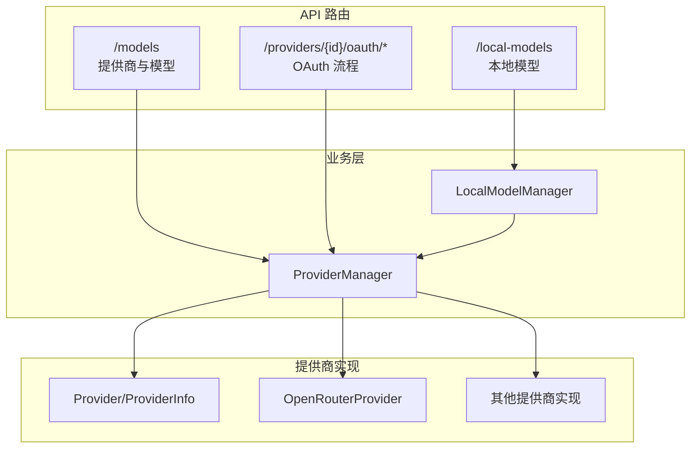
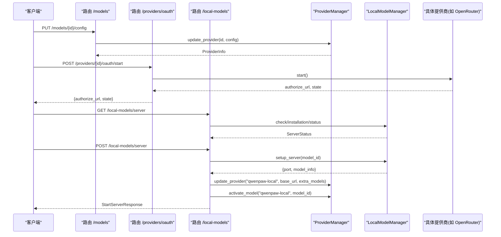
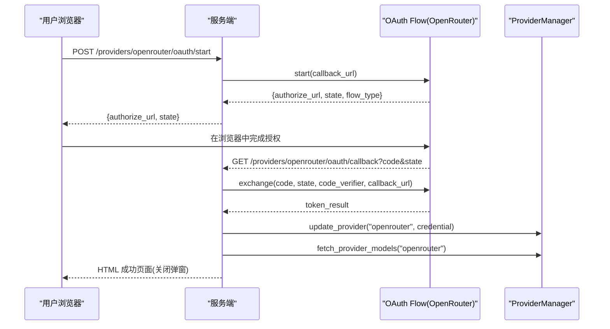
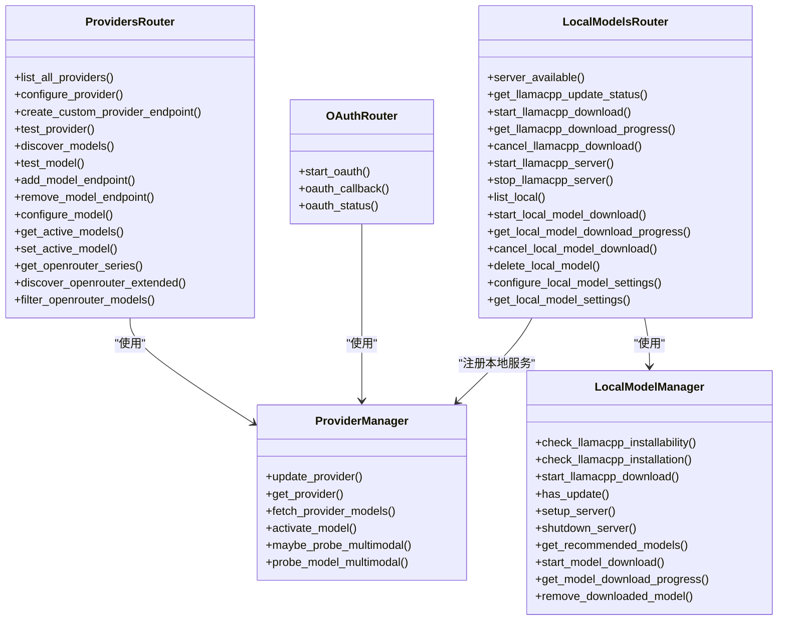

# 模型提供商接口

<cite>
**本文引用的文件**
- [src/qwenpaw/app/routers/providers.py](file://src/qwenpaw/app/routers/providers.py)
- [src/qwenpaw/app/routers/provider_oauth.py](file://src/qwenpaw/app/routers/provider_oauth.py)
- [src/qwenpaw/app/routers/local_models.py](file://src/qwenpaw/app/routers/local_models.py)
- [src/qwenpaw/providers/provider_manager.py](file://src/qwenpaw/providers/provider_manager.py)
- [src/qwenpaw/providers/provider.py](file://src/qwenpaw/providers/provider.py)
- [src/qwenpaw/providers/openrouter_provider.py](file://src/qwenpaw/providers/openrouter_provider.py)
- [src/qwenpaw/local_models/manager.py](file://src/qwenpaw/local_models/manager.py)
</cite>

## 目录
1. [简介](#简介)
2. [项目结构](#项目结构)
3. [核心组件](#核心组件)
4. [架构总览](#架构总览)
5. [详细组件分析](#详细组件分析)
6. [依赖关系分析](#依赖关系分析)
7. [性能与可用性考虑](#性能与可用性考虑)
8. [故障排除指南](#故障排除指南)
9. [结论](#结论)
10. [附录：配置示例与最佳实践](#附录配置示例与最佳实践)

## 简介
本文件为 QwenPaw 的“模型提供商管理”RESTful API 提供完整文档，覆盖以下能力：
- 提供商配置、认证与管理（支持 OpenAI、Anthropic、Google Gemini、OpenRouter、DashScope、Ollama、LMStudio 等）
- OAuth 一键认证流程（当前实现包含 OpenRouter）
- API 密钥管理与连接测试
- 模型发现与能力探测（含多模态图像/视频探测）
- 价格筛选与扩展元数据（OpenRouter）
- 本地模型下载、部署与管理（基于 llama.cpp）
- 激活模型范围控制（全局/按 Agent）

## 项目结构
与模型提供商相关的后端路由与核心逻辑主要位于以下模块：
- 路由层
  - /models：提供商与模型管理、激活模型、OpenRouter 扩展发现与过滤
  - /providers/{provider_id}/oauth/*：OAuth 认证流程
  - /local-models：本地模型下载、服务启停与配置
- 提供者管理层
  - ProviderManager：统一封装内置/自定义提供商、模型发现、激活模型、能力探测等
  - ProviderInfo/ModelInfo：提供商与模型的描述结构
- 本地模型管理
  - LocalModelManager：封装 llama.cpp 安装/更新、模型下载、服务启动与配置持久化

图表来源
- [src/qwenpaw/app/routers/providers.py:1-120](file://src/qwenpaw/app/routers/providers.py#L1-L120)
- [src/qwenpaw/app/routers/provider_oauth.py:1-60](file://src/qwenpaw/app/routers/provider_oauth.py#L1-L60)
- [src/qwenpaw/app/routers/local_models.py:1-60](file://src/qwenpaw/app/routers/local_models.py#L1-L60)
- [src/qwenpaw/providers/provider_manager.py:1-60](file://src/qwenpaw/providers/provider_manager.py#L1-L60)
- [src/qwenpaw/providers/provider.py:200-242](file://src/qwenpaw/providers/provider.py#L200-L242)
- [src/qwenpaw/providers/openrouter_provider.py:1-60](file://src/qwenpaw/providers/openrouter_provider.py#L1-L60)

章节来源
- [src/qwenpaw/app/routers/providers.py:1-120](file://src/qwenpaw/app/routers/providers.py#L1-L120)
- [src/qwenpaw/app/routers/provider_oauth.py:1-60](file://src/qwenpaw/app/routers/provider_oauth.py#L1-L60)
- [src/qwenpaw/app/routers/local_models.py:1-60](file://src/qwenpaw/app/routers/local_models.py#L1-L60)
- [src/qwenpaw/providers/provider_manager.py:1-60](file://src/qwenpaw/providers/provider_manager.py#L1-L60)
- [src/qwenpaw/providers/provider.py:200-242](file://src/qwenpaw/providers/provider.py#L200-L242)
- [src/qwenpaw/providers/openrouter_provider.py:1-60](file://src/qwenpaw/providers/openrouter_provider.py#L1-L60)

## 核心组件
- ProviderManager
  - 负责列出/添加/删除自定义提供商、更新提供商配置、获取提供商信息、拉取模型列表、激活模型、能力探测等。
- ProviderInfo/ModelInfo
  - 描述提供商与模型的结构，包括基础 URL、API Key、是否免费、是否支持多模态、思考参数等。
- LocalModelManager
  - 封装 llama.cpp 的安装/更新、模型下载、服务启停、端口与上下文长度配置持久化。
- OpenRouterProvider
  - 提供扩展模型发现、系列列表、按条件过滤（输入/输出模态、价格、是否免费）等能力。

章节来源
- [src/qwenpaw/providers/provider_manager.py:1-120](file://src/qwenpaw/providers/provider_manager.py#L1-L120)
- [src/qwenpaw/providers/provider.py:200-242](file://src/qwenpaw/providers/provider.py#L200-L242)
- [src/qwenpaw/local_models/manager.py:1-120](file://src/qwenpaw/local_models/manager.py#L1-L120)
- [src/qwenpaw/providers/openrouter_provider.py:1-60](file://src/qwenpaw/providers/openrouter_provider.py#L1-L60)

## 架构总览
下图展示了请求从路由到业务层的调用路径，以及关键的数据流转。

图表来源
- [src/qwenpaw/app/routers/providers.py:210-245](file://src/qwenpaw/app/routers/providers.py#L210-L245)
- [src/qwenpaw/app/routers/provider_oauth.py:99-124](file://src/qwenpaw/app/routers/provider_oauth.py#L99-L124)
- [src/qwenpaw/app/routers/local_models.py:290-325](file://src/qwenpaw/app/routers/local_models.py#L290-L325)
- [src/qwenpaw/providers/provider_manager.py:1500-1533](file://src/qwenpaw/providers/provider_manager.py#L1500-L1533)

## 详细组件分析

### 提供商与模型管理 API（/models）
- 列出所有提供商
  - GET /models
  - 返回 ProviderInfo 列表
- 配置提供商
  - PUT /models/{provider_id}/config
  - 支持字段：api_key、base_url、chat_model、generate_kwargs、custom_headers、auth_mode
- 创建自定义提供商
  - POST /models/custom-providers
  - 支持字段：id、name、default_base_url、api_key_prefix、chat_model、models
- 删除自定义提供商
  - DELETE /models/custom-providers/{provider_id}
- 测试提供商连接
  - POST /models/{provider_id}/test
  - 可选覆盖：api_key、base_url、chat_model、custom_headers、auth_mode
- 发现提供商可用模型
  - POST /models/{provider_id}/discover?save=true|false
  - 可选覆盖：api_key、base_url、chat_model
- 测试指定模型
  - POST /models/{provider_id}/models/test
  - 请求体：model_id
- 添加/删除模型
  - POST /models/{provider_id}/models
  - DELETE /models/{provider_id}/models/{model_id:path}
- 模型级配置
  - PUT /models/{provider_id}/models/{model_id:path}/config
  - 支持字段：max_tokens、max_input_length、generate_kwargs、relay_reasoning、thinking_enabled、thinking_budget、reasoning_effort
- 能力探测（多模态）
  - POST /models/{provider_id}/models/{model_id:path}/probe-multimodal
- 激活模型（全局或按 Agent）
  - GET /models/active?scope=effective|global|agent&agent_id=...
  - PUT /models/active
  - 请求体：provider_id、model、scope、agent_id

OpenRouter 扩展能力
- 获取提供商系列
  - GET /models/openrouter/series
- 扩展发现（含定价、模态等）
  - POST /models/openrouter/discover-extended
- 按条件过滤
  - POST /models/openrouter/models/filter
  - 支持 providers、input_modalities、output_modalities、max_prompt_price、is_free

错误处理要点
- 未找到提供商：404
- 参数校验失败：400
- 内部异常：500

章节来源
- [src/qwenpaw/app/routers/providers.py:200-245](file://src/qwenpaw/app/routers/providers.py#L200-L245)
- [src/qwenpaw/app/routers/providers.py:247-272](file://src/qwenpaw/app/routers/providers.py#L247-L272)
- [src/qwenpaw/app/routers/providers.py:337-373](file://src/qwenpaw/app/routers/providers.py#L337-L373)
- [src/qwenpaw/app/routers/providers.py:375-436](file://src/qwenpaw/app/routers/providers.py#L375-L436)
- [src/qwenpaw/app/routers/providers.py:438-464](file://src/qwenpaw/app/routers/providers.py#L438-L464)
- [src/qwenpaw/app/routers/providers.py:484-511](file://src/qwenpaw/app/routers/providers.py#L484-L511)
- [src/qwenpaw/app/routers/providers.py:553-571](file://src/qwenpaw/app/routers/providers.py#L553-L571)
- [src/qwenpaw/app/routers/providers.py:573-603](file://src/qwenpaw/app/routers/providers.py#L573-L603)
- [src/qwenpaw/app/routers/providers.py:605-665](file://src/qwenpaw/app/routers/providers.py#L605-L665)
- [src/qwenpaw/app/routers/providers.py:667-759](file://src/qwenpaw/app/routers/providers.py#L667-L759)
- [src/qwenpaw/app/routers/providers.py:832-992](file://src/qwenpaw/app/routers/providers.py#L832-L992)

### OAuth 认证流程（/providers/{provider_id}/oauth）
当前支持的提供商：openrouter

- 开始认证
  - POST /providers/{provider_id}/oauth/start
  - 返回 authorize_url、state、flow_type
- 回调处理
  - GET /providers/{provider_id}/oauth/callback?code=...&state=...
  - 交换授权码并保存凭证；成功后自动尝试拉取模型列表
- 状态轮询
  - GET /providers/{provider_id}/oauth/status?state=...
  - 返回 pending/completed/failed 及错误信息

流程图

图表来源
- [src/qwenpaw/app/routers/provider_oauth.py:99-124](file://src/qwenpaw/app/routers/provider_oauth.py#L99-L124)
- [src/qwenpaw/app/routers/provider_oauth.py:127-200](file://src/qwenpaw/app/routers/provider_oauth.py#L127-L200)
- [src/qwenpaw/providers/provider_manager.py:1523-1533](file://src/qwenpaw/providers/provider_manager.py#L1523-L1533)

章节来源
- [src/qwenpaw/app/routers/provider_oauth.py:1-60](file://src/qwenpaw/app/routers/provider_oauth.py#L1-L60)
- [src/qwenpaw/app/routers/provider_oauth.py:99-124](file://src/qwenpaw/app/routers/provider_oauth.py#L99-L124)
- [src/qwenpaw/app/routers/provider_oauth.py:127-200](file://src/qwenpaw/app/routers/provider_oauth.py#L127-L200)
- [src/qwenpaw/app/routers/provider_oauth.py:203-228](file://src/qwenpaw/app/routers/provider_oauth.py#L203-L228)

### 本地模型管理 API（/local-models）
- 服务器状态检查
  - GET /local-models/server
  - 返回 installable、installed、available、port、model_name、message
- 更新检查
  - GET /local-models/server/update
  - 返回 has_update
- 下载 llama.cpp 二进制
  - POST /local-models/server/download
  - GET /local-models/server/download
  - DELETE /local-models/server/download
- 启动/停止本地推理服务
  - POST /local-models/server
  - DELETE /local-models/server
- 模型列表与下载
  - GET /local-models/models
  - POST /local-models/models/download
  - GET /local-models/models/download
  - DELETE /local-models/models/download
  - DELETE /local-models/models/{model_id:path}
- 本地模型配置
  - PUT /local-models/config
  - GET /local-models/config

注意
- 启动服务后会自动将本地服务注册为提供商 qwenpaw-local，并设置 base_url 与 extra_models，同时激活该模型。
- 删除正在运行的模型会拒绝操作并返回冲突错误。

章节来源
- [src/qwenpaw/app/routers/local_models.py:152-218](file://src/qwenpaw/app/routers/local_models.py#L152-L218)
- [src/qwenpaw/app/routers/local_models.py:220-238](file://src/qwenpaw/app/routers/local_models.py#L220-L238)
- [src/qwenpaw/app/routers/local_models.py:240-288](file://src/qwenpaw/app/routers/local_models.py#L240-L288)
- [src/qwenpaw/app/routers/local_models.py:290-345](file://src/qwenpaw/app/routers/local_models.py#L290-L345)
- [src/qwenpaw/app/routers/local_models.py:352-454](file://src/qwenpaw/app/routers/local_models.py#L352-L454)
- [src/qwenpaw/app/routers/local_models.py:456-497](file://src/qwenpaw/app/routers/local_models.py#L456-L497)

### 提供商与模型数据结构
- ProviderInfo
  - 包含 id、name、base_url、api_key_prefix、chat_model、extra_models、supports_oauth、oauth_connected、is_free_tier、provider_group、provider_variant 等字段
- ModelInfo
  - 包含 id、name、supports_multimodal、supports_image、supports_video、probe_source、is_free、thinking_enabled、thinking_budget、reasoning_effort 等字段

章节来源
- [src/qwenpaw/providers/provider.py:202-242](file://src/qwenpaw/providers/provider.py#L202-L242)

## 依赖关系分析
- 路由层依赖 ProviderManager 和 LocalModelManager 进行业务编排
- ProviderManager 聚合多个提供商实现（OpenAI、Anthropic、Gemini、DashScope、OpenRouter、Ollama、LMStudio 等）
- LocalModelManager 通过 LlamaCppBackend 管理本地推理服务生命周期，并在启动后将本地服务注册为 qwenpaw-local 提供商

图表来源
- [src/qwenpaw/app/routers/providers.py:1-120](file://src/qwenpaw/app/routers/providers.py#L1-L120)
- [src/qwenpaw/app/routers/provider_oauth.py:1-60](file://src/qwenpaw/app/routers/provider_oauth.py#L1-L60)
- [src/qwenpaw/app/routers/local_models.py:1-60](file://src/qwenpaw/app/routers/local_models.py#L1-L60)
- [src/qwenpaw/providers/provider_manager.py:1-120](file://src/qwenpaw/providers/provider_manager.py#L1-L120)
- [src/qwenpaw/local_models/manager.py:1-120](file://src/qwenpaw/local_models/manager.py#L1-L120)

章节来源
- [src/qwenpaw/app/routers/providers.py:1-120](file://src/qwenpaw/app/routers/providers.py#L1-L120)
- [src/qwenpaw/app/routers/provider_oauth.py:1-60](file://src/qwenpaw/app/routers/provider_oauth.py#L1-L60)
- [src/qwenpaw/app/routers/local_models.py:1-60](file://src/qwenpaw/app/routers/local_models.py#L1-L60)
- [src/qwenpaw/providers/provider_manager.py:1-120](file://src/qwenpaw/providers/provider_manager.py#L1-L120)
- [src/qwenpaw/local_models/manager.py:1-120](file://src/qwenpaw/local_models/manager.py#L1-L120)

## 性能与可用性考虑
- 模型发现与过滤
  - OpenRouter 扩展发现与过滤涉及远程网络请求，建议在前端做缓存与分页展示，避免频繁全量刷新。
- 连接测试与能力探测
  - 连接测试与多模态探测会发起轻量请求，建议在 UI 上显示进度与超时提示，并提供重试机制。
- 本地模型下载与服务启动
  - 大文件下载耗时较长，需支持断点续传与取消；服务启动需要等待就绪，应提供健康检查与回退策略。
- 并发与锁
  - LocalModelManager 对下载和服务生命周期使用异步锁，避免并发冲突；上层应避免重复触发相同任务。

[本节为通用指导，不直接分析具体文件]

## 故障排除指南
常见问题与定位方法：
- 提供商未找到
  - 现象：404 错误，detail 包含 provider not found
  - 排查：确认 provider_id 是否存在，或通过 GET /models 查看已注册提供商
- 模型不存在
  - 现象：400 错误，detail 包含 model not found in provider
  - 排查：先执行 discover 或手动添加模型，再设置激活
- OAuth 回调失败
  - 现象：HTML 错误页或 status=failed
  - 排查：检查 state 是否过期、callback_url 是否正确、网络可达性
- 本地模型服务不可用
  - 现象：GET /local-models/server 返回 available=false
  - 排查：检查 installable/installed 状态，必要时执行下载与启动
- 删除正在运行的本地模型
  - 现象：409 冲突
  - 排查：先停止服务再删除模型

章节来源
- [src/qwenpaw/app/routers/providers.py:337-373](file://src/qwenpaw/app/routers/providers.py#L337-L373)
- [src/qwenpaw/app/routers/providers.py:438-464](file://src/qwenpaw/app/routers/providers.py#L438-L464)
- [src/qwenpaw/app/routers/provider_oauth.py:127-200](file://src/qwenpaw/app/routers/provider_oauth.py#L127-L200)
- [src/qwenpaw/app/routers/local_models.py:152-218](file://src/qwenpaw/app/routers/local_models.py#L152-L218)
- [src/qwenpaw/app/routers/local_models.py:423-454](file://src/qwenpaw/app/routers/local_models.py#L423-L454)

## 结论
QwenPaw 的模型提供商管理 API 提供了统一的入口来配置、认证、测试和管理多种外部与本地模型服务。通过 ProviderManager 与 LocalModelManager 的协作，系统实现了跨提供商的统一体验，并通过 OpenRouter 扩展能力增强了模型选择与成本控制的灵活性。结合 OAuth 与连接测试，用户可以快速完成提供商接入与验证。

[本节为总结，不直接分析具体文件]

## 附录：配置示例与最佳实践
- 配置 OpenAI 兼容提供商
  - 使用 PUT /models/{provider_id}/config 设置 api_key、base_url、chat_model 等
- 启用 OpenRouter 并一键登录
  - 调用 POST /providers/openrouter/oauth/start 打开授权窗口
  - 回调完成后自动拉取模型列表
- 本地模型工作流
  - 检查环境：GET /local-models/server
  - 下载二进制：POST /local-models/server/download
  - 下载模型：POST /local-models/models/download
  - 启动服务：POST /local-models/server
  - 查询状态：GET /local-models/server
- 模型能力与价格筛选
  - 使用 POST /models/openrouter/models/filter 按模态与价格筛选
- 激活模型范围
  - 全局激活：PUT /models/active，scope=global
  - 按 Agent 激活：PUT /models/active，scope=agent，agent_id=...

章节来源
- [src/qwenpaw/app/routers/providers.py:210-245](file://src/qwenpaw/app/routers/providers.py#L210-L245)
- [src/qwenpaw/app/routers/provider_oauth.py:99-124](file://src/qwenpaw/app/routers/provider_oauth.py#L99-L124)
- [src/qwenpaw/app/routers/local_models.py:240-345](file://src/qwenpaw/app/routers/local_models.py#L240-L345)
- [src/qwenpaw/app/routers/providers.py:926-992](file://src/qwenpaw/app/routers/providers.py#L926-L992)
- [src/qwenpaw/app/routers/providers.py:667-759](file://src/qwenpaw/app/routers/providers.py#L667-L759)