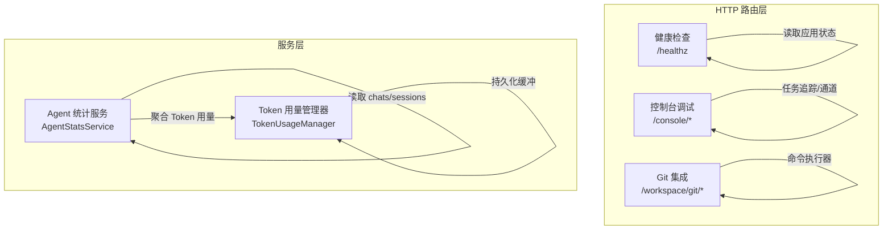
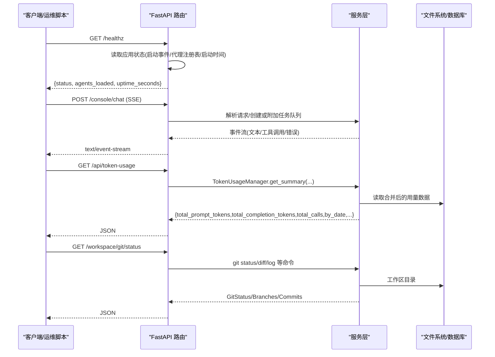
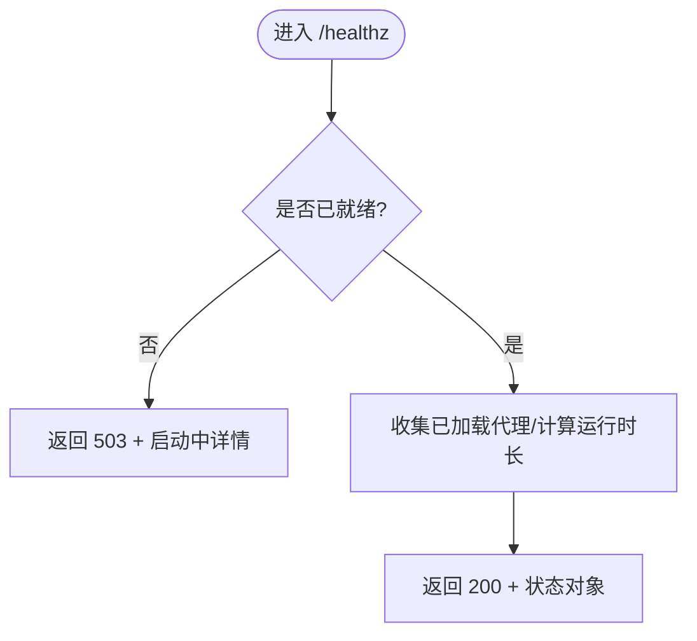
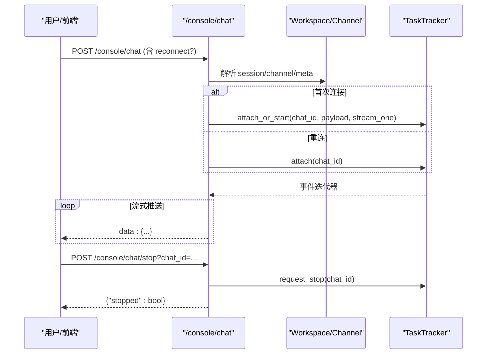
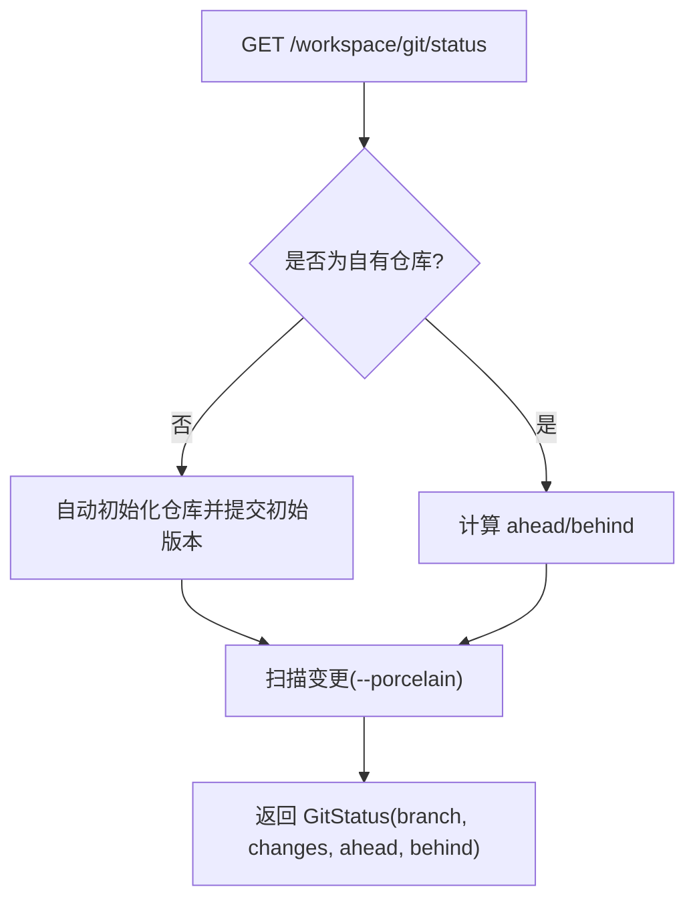
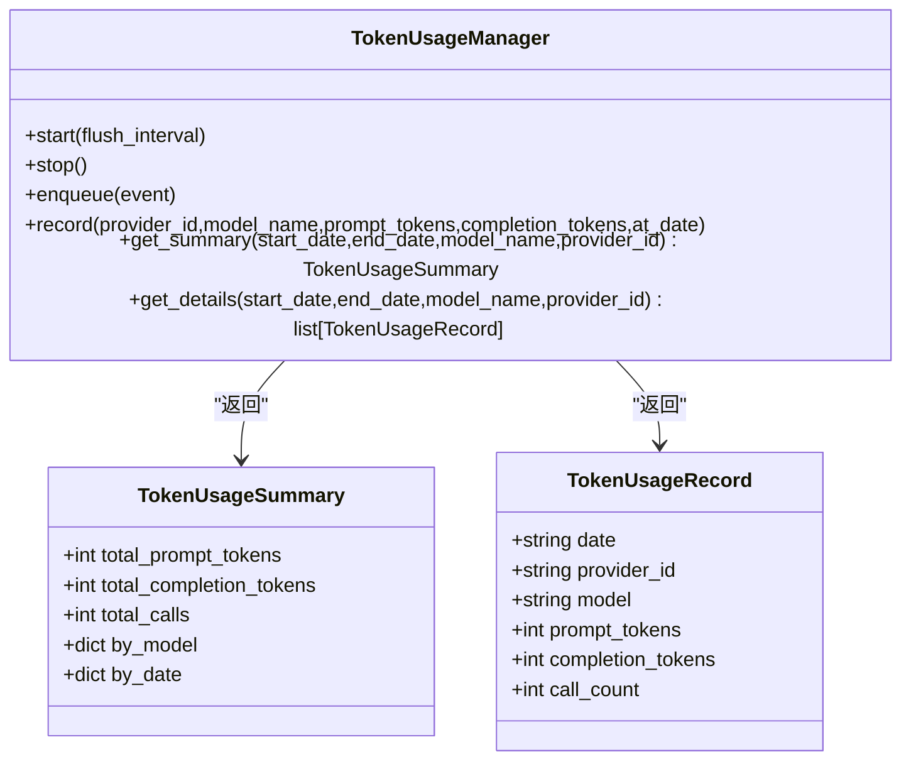
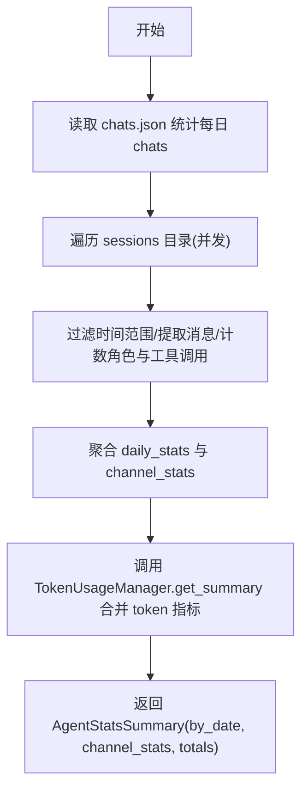
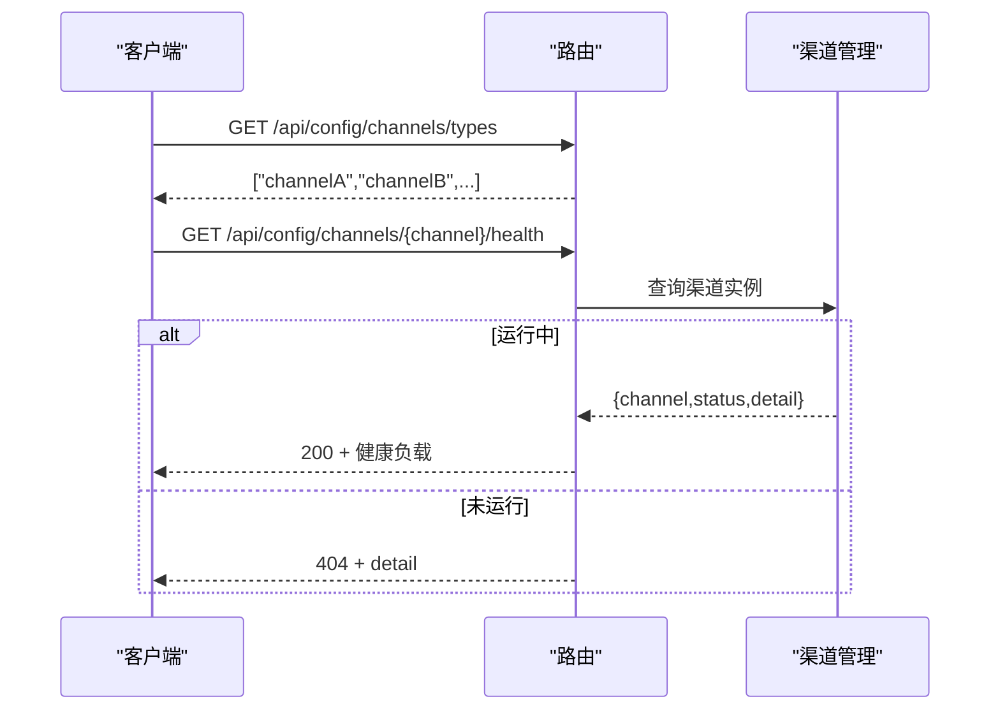
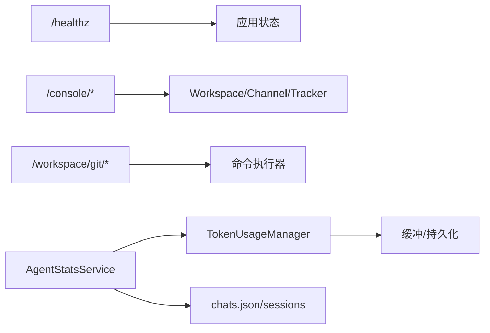

# 监控与工具接口

<cite>
**本文引用的文件**   
- [healthz.py](file://src/qwenpaw/app/routers/healthz.py)
- [console.py](file://src/qwenpaw/app/routers/console.py)
- [git.py](file://src/qwenpaw/app/routers/git.py)
- [manager.py](file://src/qwenpaw/token_usage/manager.py)
- [service.py](file://src/qwenpaw/agent_stats/service.py)
- [test_console_metadata.py](file://tests/integration/test_console_metadata.py)
- [test_channels_config.py](file://tests/integration/test_channels_config.py)
</cite>

## 目录
1. [简介](#简介)
2. [项目结构](#项目结构)
3. [核心组件](#核心组件)
4. [架构总览](#架构总览)
5. [详细组件分析](#详细组件分析)
6. [依赖关系分析](#依赖关系分析)
7. [性能考量](#性能考量)
8. [故障排查指南](#故障排查指南)
9. [结论](#结论)
10. [附录](#附录)

## 简介
本文件面向 QwenPaw 的运维与监控场景，系统化梳理并文档化以下能力：
- Token 使用统计、性能指标收集与资源监控相关接口
- 控制台调试、日志查询与系统诊断功能接口
- Git 仓库集成、代码同步与版本管理接口规范
- 健康检查、服务状态监控与告警通知接口说明
- 运维工具、批量操作与自动化脚本支持接口

上述能力主要基于后端 FastAPI 路由与服务层实现，并通过前端 API 模块聚合暴露。

## 项目结构
与“监控与工具”相关的后端路由与服务位于如下位置：
- 健康检查与健康探针：src/qwenpaw/app/routers/healthz.py
- 控制台调试与聊天流式接口：src/qwenpaw/app/routers/console.py
- Git 集成（工作区）：src/qwenpaw/app/routers/git.py
- Token 用量统计服务：src/qwenpaw/token_usage/manager.py
- Agent 统计服务（会话/消息/工具调用等）：src/qwenpaw/agent_stats/service.py

图表来源
- [healthz.py:1-35](file://src/qwenpaw/app/routers/healthz.py#L1-L35)
- [console.py:1-641](file://src/qwenpaw/app/routers/console.py#L1-L641)
- [git.py:1-569](file://src/qwenpaw/app/routers/git.py#L1-L569)
- [manager.py:1-313](file://src/qwenpaw/token_usage/manager.py#L1-L313)
- [service.py:1-389](file://src/qwenpaw/agent_stats/service.py#L1-L389)

章节来源
- [healthz.py:1-35](file://src/qwenpaw/app/routers/healthz.py#L1-L35)
- [console.py:1-641](file://src/qwenpaw/app/routers/console.py#L1-L641)
- [git.py:1-569](file://src/qwenpaw/app/routers/git.py#L1-L569)
- [manager.py:1-313](file://src/qwenpaw/token_usage/manager.py#L1-L313)
- [service.py:1-389](file://src/qwenpaw/agent_stats/service.py#L1-L389)

## 核心组件
- 健康检查与健康探针
  - 提供 /healthz 端点，返回服务启动就绪状态、已加载代理列表与运行时长。
- 控制台调试与聊天流式接口
  - 提供 /console/chat（SSE 流式）、/console/chat/stop、/console/upload、/console/debug/backend-logs、/console/push-messages、/console/inbox/* 等调试与运维接口。
- Git 集成（工作区）
  - 提供 /workspace/git/status、branches、checkout、diff、stage、unstage、commit、discard、revert、log 等接口，用于工作区代码同步与版本管理。
- Token 用量统计
  - 通过 TokenUsageManager 提供 get_summary/get_details 聚合与明细查询，供前端展示与报表生成。
- Agent 统计服务
  - 扫描 chats.json 与 sessions 目录，结合 Token 用量，输出按日统计、渠道统计与总量汇总。

章节来源
- [healthz.py:1-35](file://src/qwenpaw/app/routers/healthz.py#L1-L35)
- [console.py:1-641](file://src/qwenpaw/app/routers/console.py#L1-L641)
- [git.py:1-569](file://src/qwenpaw/app/routers/git.py#L1-L569)
- [manager.py:1-313](file://src/qwenpaw/token_usage/manager.py#L1-L313)
- [service.py:1-389](file://src/qwenpaw/agent_stats/service.py#L1-L389)

## 架构总览
下图展示了监控与工具接口的关键交互路径：客户端通过 HTTP 访问路由层，路由层调用服务层进行数据聚合或系统操作；Token 用量由后台缓冲异步落盘，Agent 统计服务在需要时读取 chats/sessions 并与 Token 用量合并输出。

图表来源
- [healthz.py:1-35](file://src/qwenpaw/app/routers/healthz.py#L1-L35)
- [console.py:1-641](file://src/qwenpaw/app/routers/console.py#L1-L641)
- [manager.py:1-313](file://src/qwenpaw/token_usage/manager.py#L1-L313)
- [git.py:1-569](file://src/qwenpaw/app/routers/git.py#L1-L569)

## 详细组件分析

### 健康检查与健康探针
- 端点
  - GET /healthz
- 行为
  - 若应用尚未完成启动流程，返回 503 并附带“启动中”信息；否则返回 200，包含已加载代理列表与运行时长。
- 适用场景
  - 容器编排探针、负载均衡健康检查、告警平台心跳校验。

图表来源
- [healthz.py:1-35](file://src/qwenpaw/app/routers/healthz.py#L1-L35)

章节来源
- [healthz.py:1-35](file://src/qwenpaw/app/routers/healthz.py#L1-L35)

### 控制台调试与聊天流式接口
- 端点概览
  - POST /console/chat：SSE 流式对话，支持重连与后台继续执行
  - POST /console/chat/stop：停止指定 chat_id 的运行
  - POST /console/upload：上传附件到控制台媒体目录
  - GET /console/debug/backend-logs：拉取后端调试日志尾部
  - GET /console/push-messages：获取推送消息与待审批项
  - GET /console/inbox/events：分页查询收件箱事件
  - POST /console/inbox/read：标记已读
  - DELETE /console/inbox/events/{event_id}：删除事件及关联轨迹
  - GET /console/inbox/traces/{run_id}：获取执行轨迹
  - POST /console/chat/task：提交后台任务并轮询状态
  - GET /console/chat/task/{task_id}：查询后台任务状态
- 关键特性
  - SSE 流式响应，断线可重连
  - 后台任务超时保护与取消
  - 调试日志安全裁剪（行数/大小限制）
  - 统一的消息与审批展示模型

图表来源
- [console.py:1-641](file://src/qwenpaw/app/routers/console.py#L1-L641)

章节来源
- [console.py:1-641](file://src/qwenpaw/app/routers/console.py#L1-L641)

### Git 集成（工作区）
- 端点概览
  - GET /workspace/git/status：分支、变更、ahead/behind
  - GET /workspace/git/branches：列出本地/远程分支
  - POST /workspace/git/checkout：切换或创建分支
  - GET /workspace/git/diff：查看差异（支持 staged/untracked）
  - POST /workspace/git/stage：暂存文件
  - POST /workspace/git/unstage：取消暂存
  - POST /workspace/git/commit：提交暂存变更
  - POST /workspace/git/discard：丢弃工作区变更
  - GET /workspace/git/commit-diff：查看某次提交的 diff
  - POST /workspace/git/revert：回滚某次提交
  - GET /workspace/git/log：最近提交记录
- 关键特性
  - 自动初始化仓库（首次打开工作区），写入默认 .gitignore 并排除嵌套仓库
  - 对非 Git 仓库返回明确错误码
  - 所有命令通过异步命令执行器运行，避免阻塞事件循环

图表来源
- [git.py:1-569](file://src/qwenpaw/app/routers/git.py#L1-L569)

章节来源
- [git.py:1-569](file://src/qwenpaw/app/routers/git.py#L1-L569)

### Token 使用统计
- 端点
  - GET /api/token-usage：返回聚合摘要（总量、按模型、按日期）
  - GET /api/token-usage/details：返回明细列表（按日期+模型）
- 数据结构要点
  - 摘要包含 total_prompt_tokens、total_completion_tokens、total_calls、by_model、by_date
  - 明细为数组，每项包含 date、provider_id、model、prompt_tokens、completion_tokens、call_count
- 行为约定
  - 无数据时仍返回稳定形状（字段存在且类型正确）

图表来源
- [manager.py:1-313](file://src/qwenpaw/token_usage/manager.py#L1-L313)

章节来源
- [manager.py:1-313](file://src/qwenpaw/token_usage/manager.py#L1-L313)
- [test_console_metadata.py:58-80](file://tests/integration/test_console_metadata.py#L58-L80)

### Agent 统计服务
- 能力
  - 扫描 chats.json 与 sessions 目录，统计每日会话数、活跃会话数、用户/助手消息数、工具调用次数
  - 与 Token 用量服务合并，得到 prompt/completion tokens 与 LLM 调用次数
- 输出
  - 按日统计 with channel_stats 与总量汇总

图表来源
- [service.py:1-389](file://src/qwenpaw/agent_stats/service.py#L1-L389)
- [manager.py:1-313](file://src/qwenpaw/token_usage/manager.py#L1-L313)

章节来源
- [service.py:1-389](file://src/qwenpaw/agent_stats/service.py#L1-L389)

### 健康检查与渠道健康
- 健康检查
  - GET /healthz：见“健康检查与健康探针”
- 渠道健康
  - GET /api/config/channels/types：返回可用渠道类型列表
  - GET /api/config/channels/{channel}/health：返回渠道健康状态（healthy/unhealthy/disabled）或 404（未运行）

图表来源
- [test_channels_config.py:244-275](file://tests/integration/test_channels_config.py#L244-L275)

章节来源
- [test_channels_config.py:244-275](file://tests/integration/test_channels_config.py#L244-L275)

## 依赖关系分析
- 路由层与服务层解耦
  - healthz 直接读取应用状态，不依赖外部服务
  - console 依赖 Workspace/Channel/TaskTracker 等运行时组件
  - git 依赖命令执行器与工作区目录
  - token_usage 与 agent_stats 通过单例/服务类协作
- 外部依赖
  - Git 命令、文件系统、JSON/异步 IO、orjson 等

图表来源
- [healthz.py:1-35](file://src/qwenpaw/app/routers/healthz.py#L1-L35)
- [console.py:1-641](file://src/qwenpaw/app/routers/console.py#L1-L641)
- [git.py:1-569](file://src/qwenpaw/app/routers/git.py#L1-L569)
- [manager.py:1-313](file://src/qwenpaw/token_usage/manager.py#L1-L313)
- [service.py:1-389](file://src/qwenpaw/agent_stats/service.py#L1-L389)

章节来源
- [healthz.py:1-35](file://src/qwenpaw/app/routers/healthz.py#L1-L35)
- [console.py:1-641](file://src/qwenpaw/app/routers/console.py#L1-L641)
- [git.py:1-569](file://src/qwenpaw/app/routers/git.py#L1-L569)
- [manager.py:1-313](file://src/qwenpaw/token_usage/manager.py#L1-L313)
- [service.py:1-389](file://src/qwenpaw/agent_stats/service.py#L1-L389)

## 性能考量
- Token 用量
  - 后台缓冲异步落盘，减少热路径开销；可按需调整 flush 间隔
- Agent 统计
  - 并发读取 sessions 目录，按 mtime 与内容时间范围快速跳过无关文件，降低 I/O 压力
- 控制台调试
  - 日志读取采用尾部截取与大小上限，避免大文件导致内存峰值
- Git 集成
  - 使用异步命令执行器，避免阻塞事件循环；变更列表以 porcelain 模式输出，便于高效解析

## 故障排查指南
- /healthz 返回 503
  - 表示服务仍在启动，等待启动事件完成后再探测
- /console/chat 无法连接或中断
  - 确认 chat_id 有效；必要时使用 reconnect=true 重连；可通过 /console/chat/stop 清理残留任务
- /console/debug/backend-logs 为空
  - 检查日志文件是否存在与权限；关注返回的 exists/size/updated_at 字段
- /workspace/git/* 报错
  - 确认工作区是否为 Git 仓库；若非仓库，将自动初始化；如失败，检查 git 命令与环境变量
- /api/token-usage 与 /api/token-usage/details 结构异常
  - 参考集成测试契约，确保返回字段与类型符合预期

章节来源
- [healthz.py:1-35](file://src/qwenpaw/app/routers/healthz.py#L1-L35)
- [console.py:1-641](file://src/qwenpaw/app/routers/console.py#L1-L641)
- [git.py:1-569](file://src/qwenpaw/app/routers/git.py#L1-L569)
- [test_console_metadata.py:58-80](file://tests/integration/test_console_metadata.py#L58-L80)

## 结论
QwenPaw 的监控与工具接口围绕“健康检查—调试—统计—版本管理”的主线构建，既满足日常运维与排障需求，也为自动化与批量化提供了稳定的 RESTful 契约。Token 用量与 Agent 统计在服务层实现了高效聚合，Git 集成则覆盖了工作区常用的版本控制操作。建议在生产环境结合健康探针与定时采集脚本，形成完整的可观测性与自动化闭环。

## 附录
- 常用接口速查
  - 健康检查：GET /healthz
  - 控制台调试：POST /console/chat、POST /console/chat/stop、GET /console/debug/backend-logs、GET /console/push-messages、/console/inbox/*、/console/chat/task*
  - 渠道健康：GET /api/config/channels/types、GET /api/config/channels/{channel}/health
  - Token 用量：GET /api/token-usage、GET /api/token-usage/details
  - Git 集成：/workspace/git/status、branches、checkout、diff、stage、unstage、commit、discard、revert、log