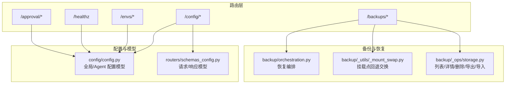
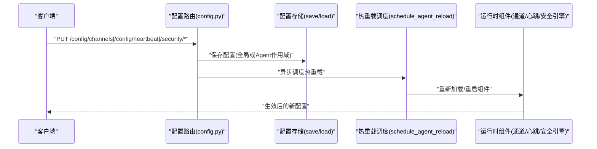
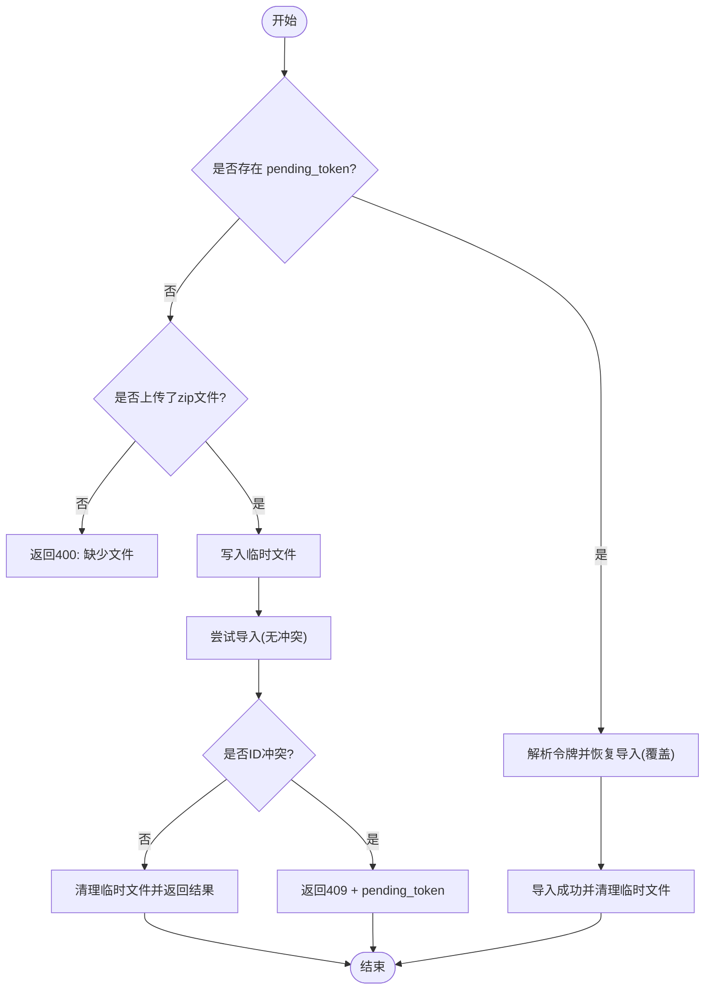
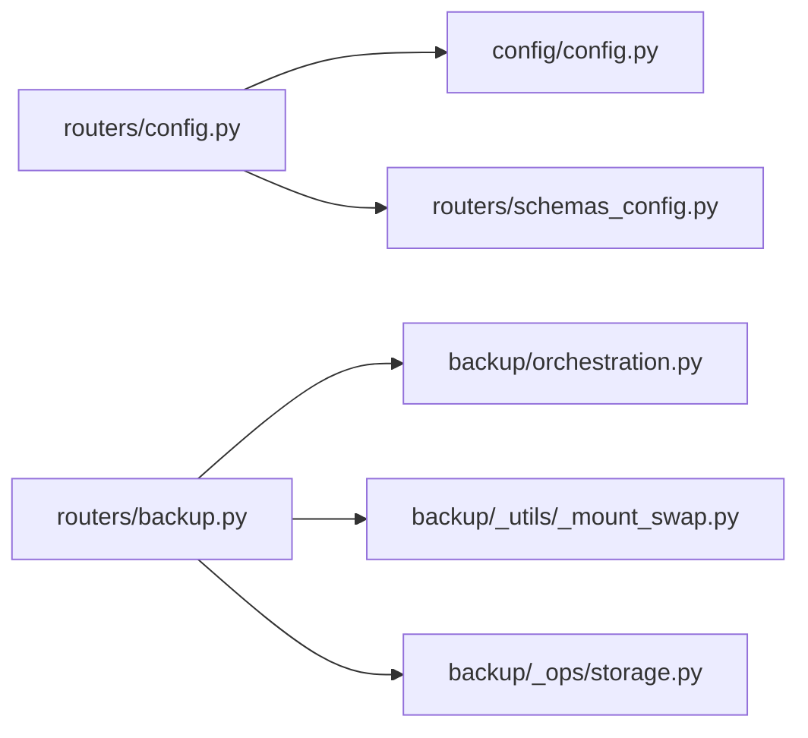

# 系统与配置接口

<cite>
**本文引用的文件**   
- [config.py](file://src/qwenpaw/app/routers/config.py)
- [schemas_config.py](file://src/qwenpaw/app/routers/schemas_config.py)
- [envs.py](file://src/qwenpaw/app/routers/envs.py)
- [backup.py](file://src/qwenpaw/app/routers/backup.py)
- [healthz.py](file://src/qwenpaw/app/routers/healthz.py)
- [approval.py](file://src/qwenpaw/app/routers/approval.py)
- [config.py](file://src/qwenpaw/config/config.py)
- [orchestration.py](file://src/qwenpaw/backup/orchestration.py)
- [_mount_swap.py](file://src/qwenpaw/backup/_utils/_mount_swap.py)
- [storage.py](file://src/qwenpaw/backup/_ops/storage.py)
</cite>

## 目录
1. [简介](#简介)
2. [项目结构](#项目结构)
3. [核心组件](#核心组件)
4. [架构总览](#架构总览)
5. [详细组件分析](#详细组件分析)
6. [依赖关系分析](#依赖关系分析)
7. [性能与并发特性](#性能与并发特性)
8. [故障排查指南](#故障排查指南)
9. [结论](#结论)
10. [附录：API 清单](#附录api-清单)

## 简介
本文件面向 QwenPaw 的“系统配置与环境管理”RESTful API，覆盖应用配置、环境变量、工作空间设置、安全策略、备份恢复、数据迁移与健康检查等能力。文档重点说明以下方面：
- 配置热重载机制（通道、心跳、ACP、安全策略等）
- 环境隔离与多租户支持（按 Agent 作用域的配置隔离）
- 备份与恢复、导入导出、冲突处理与信任模式
- 配置校验、默认值管理与模板化能力
- 安全配置、权限控制与审计日志相关接口

## 项目结构
与系统和配置相关的后端路由集中在 app/routers 下，配合 config 模型定义与 backup 编排实现完整能力。

图示来源
- [config.py:1-1130](file://src/qwenpaw/app/routers/config.py#L1-L1130)
- [schemas_config.py:1-49](file://src/qwenpaw/app/routers/schemas_config.py#L1-L49)
- [backup.py:1-323](file://src/qwenpaw/app/routers/backup.py#L1-L323)
- [orchestration.py:82-106](file://src/qwenpaw/backup/orchestration.py#L82-L106)
- [_mount_swap.py:1-169](file://src/qwenpaw/backup/_utils/_mount_swap.py#L1-L169)
- [storage.py:1-40](file://src/qwenpaw/backup/_ops/storage.py#L1-L40)

章节来源
- [config.py:1-1130](file://src/qwenpaw/app/routers/config.py#L1-L1130)
- [schemas_config.py:1-49](file://src/qwenpaw/app/routers/schemas_config.py#L1-L49)
- [backup.py:1-323](file://src/qwenpaw/app/routers/backup.py#L1-L323)
- [healthz.py:1-35](file://src/qwenpaw/app/routers/healthz.py#L1-L35)
- [approval.py:1-50](file://src/qwenpaw/app/routers/approval.py#L1-L50)
- [config.py:2073-2106](file://src/qwenpaw/config/config.py#L2073-L2106)

## 核心组件
- 配置路由 /config/*：提供通道、心跳、ACP、LLM 路由、时区、安全策略（工具守卫、沙箱、文件守卫、技能扫描器、免认证主机白名单）等配置的读取与更新；多数写操作触发异步热重载。
- 环境变量路由 /envs/*：提供环境变量的列出、批量替换、单条删除。
- 备份路由 /backups/*：提供流式创建、列表、详情、导入、恢复、导出、删除等能力，并内置冲突处理与信任模式。
- 健康检查 /healthz：返回服务就绪状态、已加载 Agent 列表与运行时长。
- 审批路由 /approval/*：用于工具守卫审批决策（批准/拒绝）。

章节来源
- [config.py:1-1130](file://src/qwenpaw/app/routers/config.py#L1-L1130)
- [envs.py:1-81](file://src/qwenpaw/app/routers/envs.py#L1-L81)
- [backup.py:1-323](file://src/qwenpaw/app/routers/backup.py#L1-L323)
- [healthz.py:1-35](file://src/qwenpaw/app/routers/healthz.py#L1-L35)
- [approval.py:1-50](file://src/qwenpaw/app/routers/approval.py#L1-L50)

## 架构总览
下图展示典型“更新配置并热重载”的调用链：客户端发起 PUT 请求，路由层持久化到 Agent 或全局配置，随后调度后台任务完成热重载（如通道管理器、心跳调度器、安全引擎规则重加载等）。

图示来源
- [config.py:165-189](file://src/qwenpaw/app/routers/config.py#L165-L189)
- [config.py:605-643](file://src/qwenpaw/app/routers/config.py#L605-L643)
- [config.py:750-768](file://src/qwenpaw/app/routers/config.py#L750-L768)

## 详细组件分析

### 应用配置（/config/*）
- 通道配置
  - GET /config/channels：列出所有可用通道及其配置（未保存则返回空默认）。
  - PUT /config/channels：一次性更新全部通道配置，并触发热重载。
  - GET /config/channels/{name}：获取指定通道配置。
  - PUT /config/channels/{name}：更新单个通道配置，并触发热重载。
  - GET /config/channels/{name}/health：查询通道健康状态。
  - POST /config/channels/{name}/restart：重启指定通道。
  - GET /config/channels/types：列出可用的通道类型标识。
  - GET /config/channels/schemas：返回插件注册通道的表单字段元数据。
  - 二维码授权：GET /config/channels/{channel}/qrcode 与 GET /config/channels/{channel}/qrcode/status。
- 心跳配置
  - GET /config/heartbeat：获取当前心跳配置（若未配置则返回默认）。
  - PUT /config/heartbeat：更新心跳配置并后台重调度。
  - POST /config/heartbeat/run：立即触发一次心跳执行。
- ACP 配置
  - GET /config/acp：获取当前 Agent 的 ACP 配置。
  - PUT /config/acp：更新 ACP 配置并热重载。
  - GET /config/acp/node-runtime：查询 Node 运行时状态。
  - PUT /config/acp/node-runtime：更新 Node 路径并校验可用性。
  - GET /config/acp/{agent_name}：获取某个 ACP Agent 配置。
  - PUT /config/acp/{agent_name}：更新某个 ACP Agent 配置。
- LLM 路由与时区
  - GET/PUT /config/agents/llm-routing：获取/更新 Agent LLM 路由设置。
  - GET/PUT /config/user-timezone：获取/更新用户时区（IANA 格式，带校验）。
- 安全配置
  - 工具守卫：GET/PUT /config/security/tool-guard，内置规则列表 GET /config/security/tool-guard/builtin-rules。
  - 沙箱开关：GET/PUT /config/security/sandbox。
  - 文件守卫：GET/PUT /config/security/file-guard。
  - 技能扫描器：GET/PUT /config/security/skill-scanner，历史拦截记录增删与清空。
  - 免认证主机白名单：GET/PUT /config/security/allow-no-auth-hosts（IP 校验与去重）。

章节来源
- [config.py:87-127](file://src/qwenpaw/app/routers/config.py#L87-L127)
- [config.py:165-189](file://src/qwenpaw/app/routers/config.py#L165-L189)
- [config.py:223-286](file://src/qwenpaw/app/routers/config.py#L223-L286)
- [config.py:291-332](file://src/qwenpaw/app/routers/config.py#L291-L332)
- [config.py:334-427](file://src/qwenpaw/app/routers/config.py#L334-L427)
- [config.py:430-585](file://src/qwenpaw/app/routers/config.py#L430-L585)
- [config.py:587-675](file://src/qwenpaw/app/routers/config.py#L587-L675)
- [config.py:677-699](file://src/qwenpaw/app/routers/config.py#L677-L699)
- [config.py:704-735](file://src/qwenpaw/app/routers/config.py#L704-L735)
- [config.py:740-796](file://src/qwenpaw/app/routers/config.py#L740-L796)
- [config.py:814-839](file://src/qwenpaw/app/routers/config.py#L814-L839)
- [config.py:856-912](file://src/qwenpaw/app/routers/config.py#L856-L912)
- [config.py:917-976](file://src/qwenpaw/app/routers/config.py#L917-L976)
- [config.py:983-1036](file://src/qwenpaw/app/routers/config.py#L983-L1036)
- [config.py:1057-1130](file://src/qwenpaw/app/routers/config.py#L1057-L1130)
- [schemas_config.py:15-49](file://src/qwenpaw/app/routers/schemas_config.py#L15-L49)
- [config.py:2073-2106](file://src/qwenpaw/config/config.py#L2073-L2106)

### 环境变量管理（/envs/*）
- GET /envs：列出所有环境变量（键值对）。
- PUT /envs：批量替换所有环境变量（缺失键将被移除），并对键进行非空校验。
- DELETE /envs/{key}：删除单个环境变量。

章节来源
- [envs.py:1-81](file://src/qwenpaw/app/routers/envs.py#L1-L81)

### 备份与恢复（/backups/*）
- 流式创建：POST /backups/stream（SSE 事件推送进度）。
- 列表：GET /backups。
- 详情：GET /backups/{backup_id}。
- 删除：POST /backups/delete（批量删除）。
- 导入：POST /backups/import（支持首次上传与冲突后重试流程，含信任模式）。
- 恢复：POST /backups/{backup_id}/restore（可选择是否包含 Agent、预加载等）。
- 导出：GET /backups/{backup_id}/export（下载 zip）。

关键行为
- 冲突处理：导入遇到 ID 冲突返回 409，附带 pending_token；客户端使用同一 token 再次调用以确认覆盖。
- 临时文件清理：定期清理过期上传临时文件。
- 恢复编排：在恢复前进行信任/签名校验，必要时停止工作区进程，再执行内容交换与 Agent 预加载。
- 挂载点回退：当目标为 Docker 卷挂载点时，采用“子项交换”策略避免 OS 不允许重命名挂载目录的限制。

图示来源
- [backup.py:124-219](file://src/qwenpaw/app/routers/backup.py#L124-L219)
- [backup.py:221-245](file://src/qwenpaw/app/routers/backup.py#L221-L245)
- [orchestration.py:82-106](file://src/qwenpaw/backup/orchestration.py#L82-L106)
- [_mount_swap.py:133-169](file://src/qwenpaw/backup/_utils/_mount_swap.py#L133-L169)
- [storage.py:39-40](file://src/qwenpaw/backup/_ops/storage.py#L39-L40)

章节来源
- [backup.py:1-323](file://src/qwenpaw/app/routers/backup.py#L1-L323)
- [orchestration.py:82-106](file://src/qwenpaw/backup/orchestration.py#L82-L106)
- [_mount_swap.py:1-169](file://src/qwenpaw/backup/_utils/_mount_swap.py#L1-L169)
- [storage.py:1-40](file://src/qwenpaw/backup/_ops/storage.py#L1-L40)

### 健康检查（/healthz）
- GET /healthz：服务启动完成后返回 200，包含已加载 Agent 列表与运行时长；否则返回 503。

章节来源
- [healthz.py:1-35](file://src/qwenpaw/app/routers/healthz.py#L1-L35)

### 审批（/approval/*）
- 提交审批动作（批准/拒绝）：用于工具守卫触发的审批流程，支持作用域选择（精确/相似）。

章节来源
- [approval.py:1-50](file://src/qwenpaw/app/routers/approval.py#L1-L50)

## 依赖关系分析
- 路由层依赖配置模型与业务服务：
  - /config/* 依赖 config/config.py 中的全局与 Agent 配置模型，以及各子系统（通道、心跳、ACP、安全引擎）的运行时接口。
  - /backups/* 依赖 backup 模块的编排、存储与文件系统回退逻辑。
- 热重载链路：
  - 通道/ACP/心跳等写操作通过 schedule_agent_reload 触发异步重载，确保配置变更即时生效且不影响请求处理。

图示来源
- [config.py:1-1130](file://src/qwenpaw/app/routers/config.py#L1-L1130)
- [schemas_config.py:1-49](file://src/qwenpaw/app/routers/schemas_config.py#L1-L49)
- [backup.py:1-323](file://src/qwenpaw/app/routers/backup.py#L1-L323)
- [orchestration.py:82-106](file://src/qwenpaw/backup/orchestration.py#L82-L106)
- [_mount_swap.py:1-169](file://src/qwenpaw/backup/_utils/_mount_swap.py#L1-L169)
- [storage.py:1-40](file://src/qwenpaw/backup/_ops/storage.py#L1-L40)

章节来源
- [config.py:1-1130](file://src/qwenpaw/app/routers/config.py#L1-L1130)
- [backup.py:1-323](file://src/qwenpaw/app/routers/backup.py#L1-L323)

## 性能与并发特性
- 配置热重载采用异步调度，避免阻塞请求线程。
- 心跳更新会后台重调度，失败仅记录警告，不中断主流程。
- 备份导入/恢复涉及大文件与文件系统操作，采用流式与分块写入，并在必要时进行挂载点内容交换以避免重命名限制。
- 集成测试覆盖了并发读写场景下的稳定性（无 5xx、最终一致性）。

章节来源
- [config.py:605-643](file://src/qwenpaw/app/routers/config.py#L605-L643)
- [backup.py:81-103](file://src/qwenpaw/app/routers/backup.py#L81-L103)
- [_mount_swap.py:133-169](file://src/qwenpaw/backup/_utils/_mount_swap.py#L133-L169)

## 故障排查指南
- 配置损坏恢复：当配置文件损坏时，系统可自动回退到默认配置并保持基本接口可用（例如版本接口）。
- 通道不可用：查询健康或重启通道时，若通道未启用或未配置，将返回 404。
- 备份冲突：导入时若存在相同 ID，返回 409 并提供 pending_token，需二次调用确认覆盖。
- 恢复异常：恢复前会进行信任/签名校验，失败将返回具体错误信息；若目标为挂载点，系统将采用子项交换策略。

章节来源
- [config.py:223-286](file://src/qwenpaw/app/routers/config.py#L223-L286)
- [backup.py:196-219](file://src/qwenpaw/app/routers/backup.py#L196-L219)
- [orchestration.py:82-106](file://src/qwenpaw/backup/orchestration.py#L82-L106)

## 结论
QwenPaw 的系统配置与环境管理 API 提供了完善的配置热重载、环境隔离与多租户支持、安全策略管理、备份恢复与健康检查能力。通过清晰的接口契约与健壮的错误处理，既满足运维自动化需求，也便于前端动态渲染与用户自助管理。

## 附录：API 清单
- 应用配置
  - GET /config/channels
  - PUT /config/channels
  - GET /config/channels/{name}
  - PUT /config/channels/{name}
  - GET /config/channels/{name}/health
  - POST /config/channels/{name}/restart
  - GET /config/channels/types
  - GET /config/channels/schemas
  - GET /config/channels/{channel}/qrcode
  - GET /config/channels/{channel}/qrcode/status
  - GET /config/heartbeat
  - PUT /config/heartbeat
  - POST /config/heartbeat/run
  - GET /config/acp
  - PUT /config/acp
  - GET /config/acp/node-runtime
  - PUT /config/acp/node-runtime
  - GET /config/acp/{agent_name}
  - PUT /config/acp/{agent_name}
  - GET /config/agents/llm-routing
  - PUT /config/agents/llm-routing
  - GET /config/user-timezone
  - PUT /config/user-timezone
  - GET /config/security/tool-guard
  - PUT /config/security/tool-guard
  - GET /config/security/tool-guard/builtin-rules
  - GET /config/security/sandbox
  - PUT /config/security/sandbox
  - GET /config/security/file-guard
  - PUT /config/security/file-guard
  - GET /config/security/skill-scanner
  - PUT /config/security/skill-scanner
  - GET /config/security/skill-scanner/blocked-history
  - DELETE /config/security/skill-scanner/blocked-history
  - DELETE /config/security/skill-scanner/blocked-history/{index}
  - POST /config/security/skill-scanner/whitelist
  - DELETE /config/security/skill-scanner/whitelist/{skill_name}
  - GET /config/security/allow-no-auth-hosts
  - PUT /config/security/allow-no-auth-hosts
- 环境变量
  - GET /envs
  - PUT /envs
  - DELETE /envs/{key}
- 备份与恢复
  - POST /backups/stream
  - GET /backups
  - GET /backups/{backup_id}
  - POST /backups/delete
  - POST /backups/import
  - POST /backups/{backup_id}/restore
  - GET /backups/{backup_id}/export
- 健康检查
  - GET /healthz
- 审批
  - 见 /approval/* 路由

章节来源
- [config.py:1-1130](file://src/qwenpaw/app/routers/config.py#L1-L1130)
- [envs.py:1-81](file://src/qwenpaw/app/routers/envs.py#L1-L81)
- [backup.py:1-323](file://src/qwenpaw/app/routers/backup.py#L1-L323)
- [healthz.py:1-35](file://src/qwenpaw/app/routers/healthz.py#L1-L35)
- [approval.py:1-50](file://src/qwenpaw/app/routers/approval.py#L1-L50)