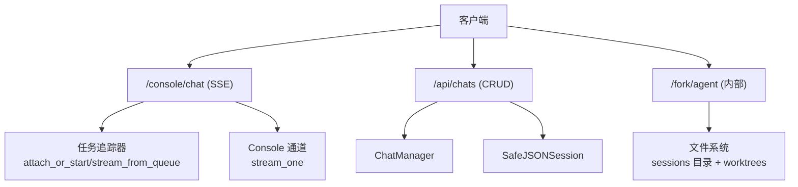
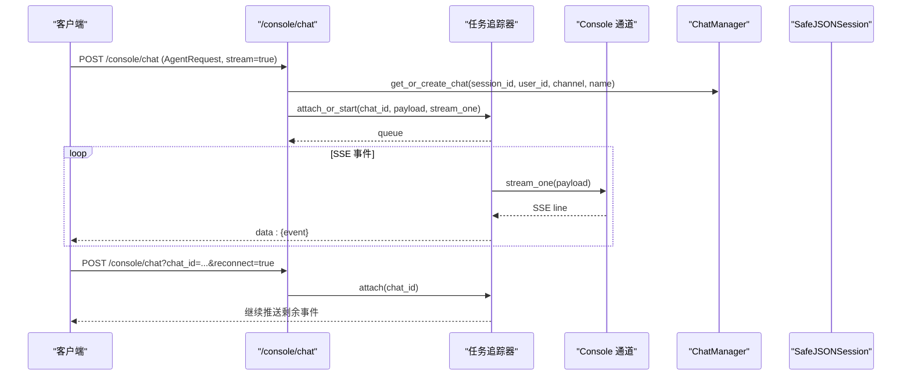
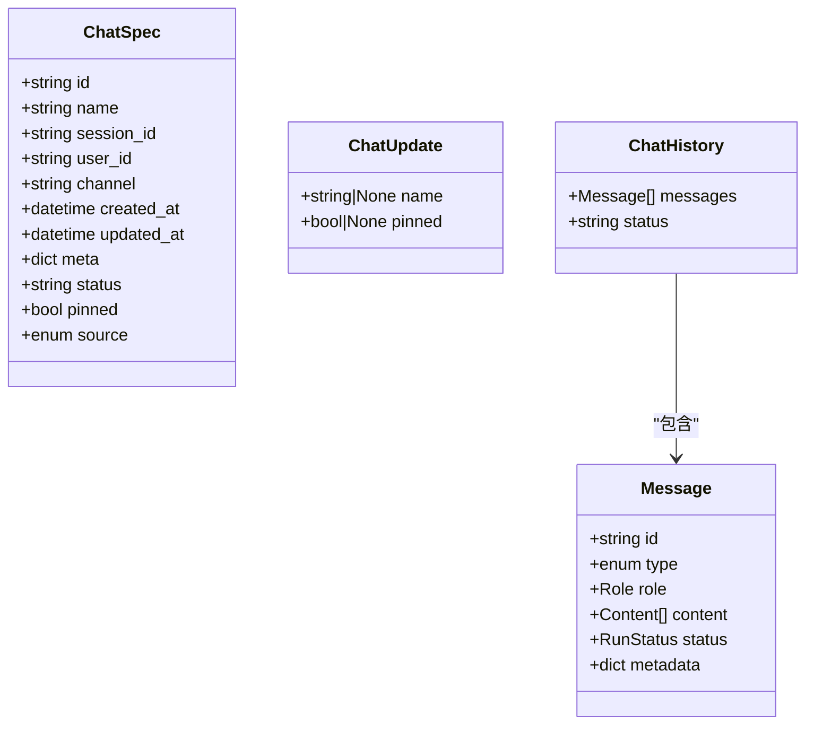
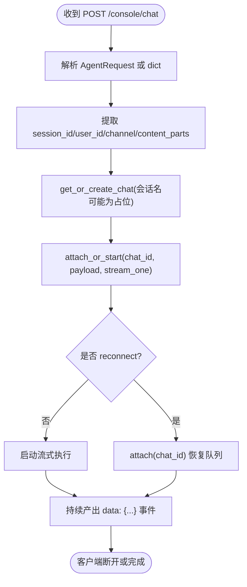
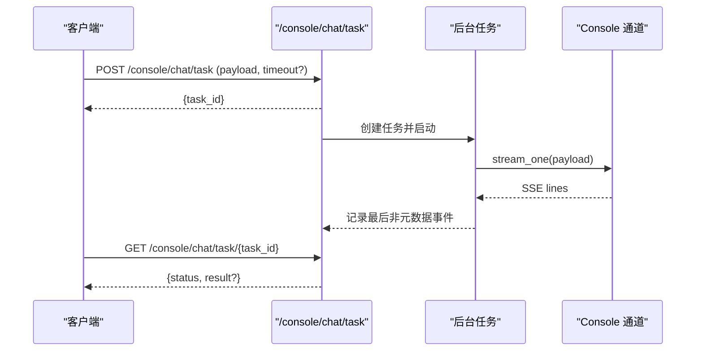
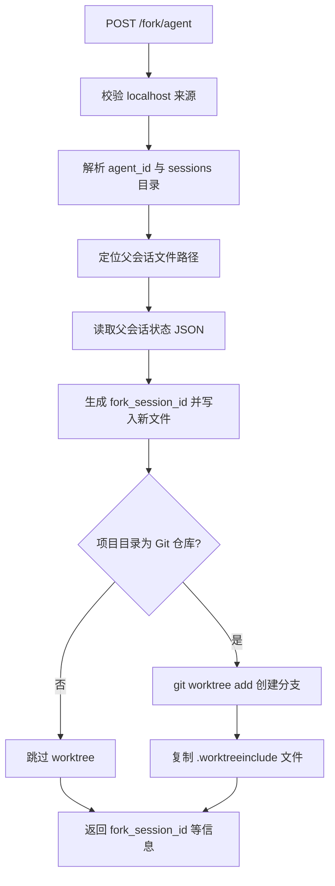
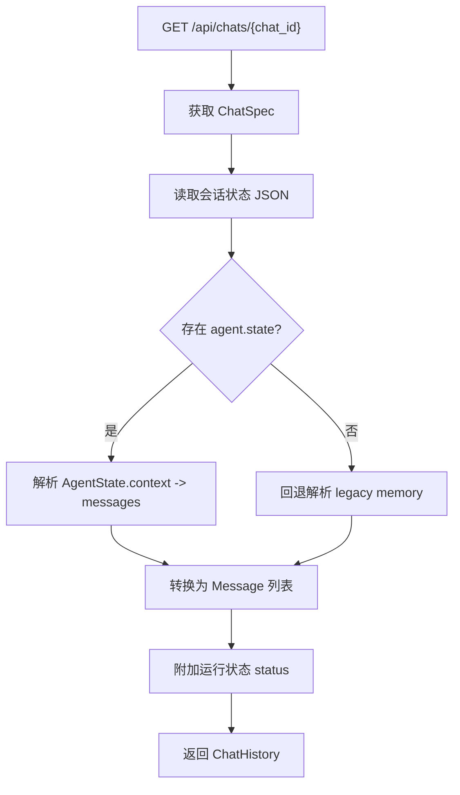
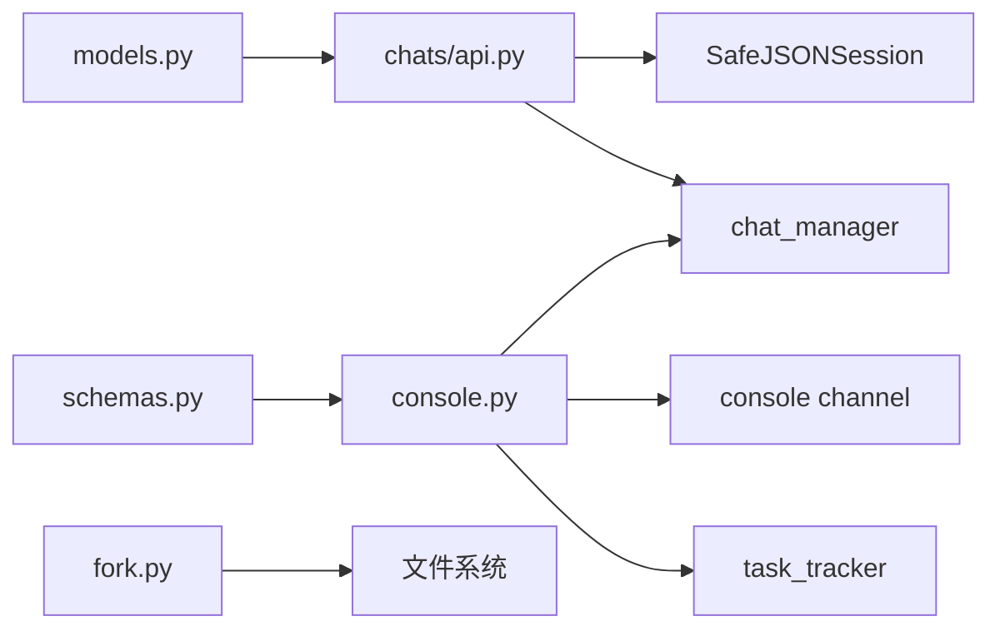

# 聊天会话接口

<cite>
**本文引用的文件**   
- [src/qwenpaw/app/chats/api.py](file://src/qwenpaw/app/chats/api.py)
- [src/qwenpaw/app/routers/console.py](file://src/qwenpaw/app/routers/console.py)
- [src/qwenpaw/app/routers/fork.py](file://src/qwenpaw/app/routers/fork.py)
- [src/qwenpaw/app/chats/models.py](file://src/qwenpaw/app/chats/models.py)
- [src/qwenpaw/schemas.py](file://src/qwenpaw/schemas.py)
- [src/qwenpaw/app/chats/session.py](file://src/qwenpaw/app/chats/session.py)
</cite>

## 目录
1. [简介](#简介)
2. [项目结构](#项目结构)
3. [核心组件](#核心组件)
4. [架构总览](#架构总览)
5. [详细组件分析](#详细组件分析)
6. [依赖分析](#依赖分析)
7. [性能考虑](#性能考虑)
8. [故障排查指南](#故障排查指南)
9. [结论](#结论)
10. [附录](#附录)

## 简介
本文件为 QwenPaw 的“聊天会话”RESTful API 与流式通信规范文档，覆盖以下能力：
- 会话创建、查询、更新、删除与批量删除
- 消息发送与接收（SSE 流式响应）
- 会话状态管理（idle/running）
- 会话分支（fork）功能
- 历史消息查询与持久化机制
- 错误处理与常见异常码
- 请求/响应数据模型与字段说明

注意：当前仓库未提供 WebSocket 实时通信端点；控制台聊天采用 SSE（Server-Sent Events）实现流式推送。

## 项目结构
与聊天会话相关的后端代码主要分布在以下模块：
- 会话管理 API：/api/chats
- 控制台聊天与流式响应：/console/chat
- 后台任务模式：/console/chat/task
- 会话分支（fork）：/fork/agent
- 会话持久化存储：SafeJSONSession
- 统一消息/事件数据模型：schemas.Message / schemas.AgentRequest

图表来源
- [src/qwenpaw/app/routers/console.py:181-270](file://src/qwenpaw/app/routers/console.py#L181-L270)
- [src/qwenpaw/app/chats/api.py:70-255](file://src/qwenpaw/app/chats/api.py#L70-L255)
- [src/qwenpaw/app/routers/fork.py:276-333](file://src/qwenpaw/app/routers/fork.py#L276-L333)
- [src/qwenpaw/app/chats/session.py:189-484](file://src/qwenpaw/app/chats/session.py#L189-L484)

章节来源
- [src/qwenpaw/app/chats/api.py:1-255](file://src/qwenpaw/app/chats/api.py#L1-L255)
- [src/qwenpaw/app/routers/console.py:1-641](file://src/qwenpaw/app/routers/console.py#L1-L641)
- [src/qwenpaw/app/routers/fork.py:1-333](file://src/qwenpaw/app/routers/fork.py#L1-L333)
- [src/qwenpaw/app/chats/models.py:1-104](file://src/qwenpaw/app/chats/models.py#L1-L104)
- [src/qwenpaw/schemas.py:1-296](file://src/qwenpaw/schemas.py#L1-L296)
- [src/qwenpaw/app/chats/session.py:1-484](file://src/qwenpaw/app/chats/session.py#L1-L484)

## 核心组件
- 会话管理 API（/api/chats）
  - 列出会话、创建会话、获取详情、更新会话、删除会话、批量删除
  - 返回 ChatSpec/ChatHistory，包含 messages 列表与 status（idle/running）
- 控制台聊天（/console/chat）
  - 支持 AgentRequest 输入，返回 SSE 流式事件
  - 支持 reconnect=true 重连已运行的流
  - 自动根据首条文本生成占位标题，并异步生成真实标题
- 后台任务（/console/chat/task）
  - 提交后台任务，轮询任务状态与结果
- 会话分支（/fork/agent）
  - 复制父会话状态到新子会话，可选创建 git worktree
- 会话持久化（SafeJSONSession）
  - 基于 JSON 文件的原子写入、按 channel/user_id/session_id 组织路径
  - 支持读取、更新、迁移兼容旧格式

章节来源
- [src/qwenpaw/app/chats/api.py:70-255](file://src/qwenpaw/app/chats/api.py#L70-L255)
- [src/qwenpaw/app/routers/console.py:181-270](file://src/qwenpaw/app/routers/console.py#L181-L270)
- [src/qwenpaw/app/routers/console.py:522-641](file://src/qwenpaw/app/routers/console.py#L522-L641)
- [src/qwenpaw/app/routers/fork.py:276-333](file://src/qwenpaw/app/routers/fork.py#L276-L333)
- [src/qwenpaw/app/chats/session.py:189-484](file://src/qwenpaw/app/chats/session.py#L189-L484)

## 架构总览
下图展示了从客户端到后端的核心交互流程，包括会话 CRUD、SSE 流式聊天、后台任务与 fork 分支。

图表来源
- [src/qwenpaw/app/routers/console.py:181-270](file://src/qwenpaw/app/routers/console.py#L181-L270)
- [src/qwenpaw/app/chats/api.py:139-197](file://src/qwenpaw/app/chats/api.py#L139-L197)
- [src/qwenpaw/app/chats/session.py:423-484](file://src/qwenpaw/app/chats/session.py#L423-L484)

## 详细组件分析

### 会话管理 REST API（/api/chats）
- GET /api/chats
  - 作用：列出当前工作区下的所有会话，可按 user_id、channel 过滤
  - 响应：ChatSpec 列表，包含 id、name、session_id、user_id、channel、status 等
- POST /api/chats
  - 作用：创建新会话，服务端自动生成 UUID
  - 请求体：ChatSpec（id 可省略，服务端生成）
  - 响应：ChatSpec
- GET /api/chats/{chat_id}
  - 作用：获取指定会话详情（含历史消息与状态）
  - 响应：ChatHistory（messages 列表、status）
- PUT /api/chats/{chat_id}
  - 作用：更新会话（如改名、置顶）
  - 请求体：ChatUpdate（仅允许 name、pinned）
  - 响应：ChatSpec
- DELETE /api/chats/{chat_id}
  - 作用：删除会话（仅删除 ChatSpec 映射，不删除 JSONSession 状态）
  - 响应：{deleted: true/false}
- POST /api/chats/batch-delete
  - 作用：批量删除会话
  - 请求体：[chat_id, ...]
  - 响应：{deleted: true/false}

数据模型
- ChatSpec：会话规格（id、name、session_id、user_id、channel、created_at、updated_at、meta、status、pinned、source）
- ChatUpdate：可更新字段（name、pinned）
- ChatHistory：消息集合与运行状态

章节来源
- [src/qwenpaw/app/chats/api.py:70-255](file://src/qwenpaw/app/chats/api.py#L70-L255)
- [src/qwenpaw/app/chats/models.py:26-94](file://src/qwenpaw/app/chats/models.py#L26-L94)

#### 类图（会话相关模型）

图表来源
- [src/qwenpaw/app/chats/models.py:26-94](file://src/qwenpaw/app/chats/models.py#L26-L94)
- [src/qwenpaw/schemas.py:199-229](file://src/qwenpaw/schemas.py#L199-L229)

### 控制台聊天与流式响应（/console/chat）
- POST /console/chat
  - 作用：发起一次聊天，返回 SSE 流式事件
  - 请求体：AgentRequest（input、session_id、user_id、stream、metadata），或兼容 dict
  - 特性：
    - 首次对话时根据首条文本生成占位标题，并在后台异步生成真实标题
    - 支持 reconnect=true 重连正在运行的流
    - 返回 text/event-stream，携带 data: {...} 事件行
- POST /console/chat/stop
  - 作用：停止正在运行的聊天（支持传入 chat_id 或 session_id）
  - 响应：{stopped: true/false}

SSE 事件与消息格式
- 事件行以 data: 前缀，内容为 JSON
- 消息类型与内容块定义见 schemas.Message、schemas.Content*、schemas.MessageType、schemas.ContentType
- 典型事件包含：消息增量、工具调用、进度、完成等

图表来源
- [src/qwenpaw/app/routers/console.py:181-270](file://src/qwenpaw/app/routers/console.py#L181-L270)
- [src/qwenpaw/schemas.py:247-274](file://src/qwenpaw/schemas.py#L247-L274)

章节来源
- [src/qwenpaw/app/routers/console.py:181-270](file://src/qwenpaw/app/routers/console.py#L181-L270)
- [src/qwenpaw/app/routers/console.py:273-319](file://src/qwenpaw/app/routers/console.py#L273-L319)
- [src/qwenpaw/schemas.py:199-274](file://src/qwenpaw/schemas.py#L199-L274)

### 后台任务模式（/console/chat/task）
- POST /console/chat/task
  - 作用：提交一个后台聊天任务，立即返回 task_id
  - 请求体：同 /console/chat（支持 timeout 控制任务超时）
  - 响应：{task_id: "..."}
- GET /console/chat/task/{task_id}
  - 作用：轮询任务状态与最终结果
  - 状态流转：submitted → running → finished（completed/failed）
  - 响应：{status, started_at?, result?}

图表来源
- [src/qwenpaw/app/routers/console.py:522-641](file://src/qwenpaw/app/routers/console.py#L522-L641)

章节来源
- [src/qwenpaw/app/routers/console.py:522-641](file://src/qwenpaw/app/routers/console.py#L522-L641)

### 会话分支（Fork）接口（/fork/agent）
- POST /fork/agent
  - 作用：准备一个分离子会话，复制父会话状态，可选创建 git worktree
  - 限制：仅本地回环地址（localhost）可访问
  - 请求体：ForkAgentRequest（agent_id、parent_session_id、user_id、channel）
  - 响应：ForkAgentResponse（fork_session_id、worktree_path、worktree_branch）
  - 行为：
    - 读取父会话 JSON 状态文件
    - 写入新的子会话文件（遵循 SafeJSONSession 命名规则）
    - 若项目目录为 Git 仓库，则创建 worktree 并复制 .worktreeinclude 中的文件

图表来源
- [src/qwenpaw/app/routers/fork.py:276-333](file://src/qwenpaw/app/routers/fork.py#L276-L333)
- [src/qwenpaw/app/routers/fork.py:178-227](file://src/qwenpaw/app/routers/fork.py#L178-L227)
- [src/qwenpaw/app/chats/session.py:213-279](file://src/qwenpaw/app/chats/session.py#L213-L279)

章节来源
- [src/qwenpaw/app/routers/fork.py:1-333](file://src/qwenpaw/app/routers/fork.py#L1-L333)

### 会话持久化与历史消息
- 持久化存储
  - SafeJSONSession 使用 JSON 文件保存会话状态，路径由 session_id、user_id、channel 组合生成，并对文件名进行安全化处理
  - 写入采用临时文件+原子替换，避免崩溃导致损坏
  - 支持按 key 路径更新部分状态
- 历史消息查询
  - GET /api/chats/{chat_id} 返回 ChatHistory，其中 messages 来自会话状态中的 agent.context（优先 2.0 格式），否则回退到 1.x legacy memory 格式
  - 状态字段 status 来自任务追踪器（idle/running）

图表来源
- [src/qwenpaw/app/chats/api.py:139-197](file://src/qwenpaw/app/chats/api.py#L139-L197)
- [src/qwenpaw/app/chats/session.py:423-484](file://src/qwenpaw/app/chats/session.py#L423-L484)

章节来源
- [src/qwenpaw/app/chats/api.py:139-197](file://src/qwenpaw/app/chats/api.py#L139-L197)
- [src/qwenpaw/app/chats/session.py:189-484](file://src/qwenpaw/app/chats/session.py#L189-L484)

### 数据模型与消息格式
- 顶层请求/响应
  - AgentRequest：input（Message[]）、session_id、user_id、stream、metadata
  - AgentResponse：output（Message[]）、status、时间戳、metadata
- 消息与内容块
  - Message：id、type、role、content（Content[]）、status、metadata
  - Content 变体：TextContent、ImageContent、AudioContent、VideoContent、FileContent、DataContent、RefusalContent
  - 枚举：MessageType、ContentType、RunStatus、Role
- 事件封装
  - Event：object、status、data（用于通用事件包装）

章节来源
- [src/qwenpaw/schemas.py:199-296](file://src/qwenpaw/schemas.py#L199-L296)

## 依赖分析
- 路由层
  - console.py 负责控制台聊天、上传、后台任务、调试日志、收件箱等
  - chats/api.py 负责会话 CRUD
  - fork.py 负责子会话分支准备
- 数据层
  - models.py 定义 ChatSpec/ChatUpdate/ChatHistory
  - session.py 提供 SafeJSONSession 持久化
  - schemas.py 定义统一的 Message/Content/Event 协议
- 运行时集成
  - 通过 workspace.chat_manager、workspace.session、workspace.task_tracker 协作

图表来源
- [src/qwenpaw/app/routers/console.py:181-270](file://src/qwenpaw/app/routers/console.py#L181-L270)
- [src/qwenpaw/app/chats/api.py:70-255](file://src/qwenpaw/app/chats/api.py#L70-L255)
- [src/qwenpaw/app/routers/fork.py:276-333](file://src/qwenpaw/app/routers/fork.py#L276-L333)
- [src/qwenpaw/app/chats/models.py:26-94](file://src/qwenpaw/app/chats/models.py#L26-L94)
- [src/qwenpaw/schemas.py:199-296](file://src/qwenpaw/schemas.py#L199-L296)

章节来源
- [src/qwenpaw/app/routers/console.py:1-641](file://src/qwenpaw/app/routers/console.py#L1-L641)
- [src/qwenpaw/app/chats/api.py:1-255](file://src/qwenpaw/app/chats/api.py#L1-L255)
- [src/qwenpaw/app/routers/fork.py:1-333](file://src/qwenpaw/app/routers/fork.py#L1-L333)
- [src/qwenpaw/app/chats/models.py:1-104](file://src/qwenpaw/app/chats/models.py#L1-L104)
- [src/qwenpaw/schemas.py:1-296](file://src/qwenpaw/schemas.py#L1-L296)

## 性能考虑
- SSE 流式传输
  - 使用 StreamingResponse 与 keep-alive 头，减少连接开销
  - 建议客户端合理设置超时与重试策略
- 后台任务
  - 支持任务级超时，避免长时间占用资源
- 会话持久化
  - 原子写入与 per-path 锁，降低并发写冲突风险
  - 大文件场景下注意磁盘空间与 IO 延迟

## 故障排查指南
- 常见 HTTP 状态码
  - 200：成功
  - 400：请求参数错误（例如解析失败）
  - 404：会话/任务不存在
  - 403：fork 接口仅限 localhost
  - 500：服务器内部错误（如 git worktree 操作失败）
  - 503：Console 通道不可用
- 调试建议
  - 使用 /console/debug/backend-logs 查看后端日志尾部
  - 使用 /console/push-messages 拉取待处理消息与审批请求
  - 使用 /console/inbox/events 与 /console/inbox/read 管理收件箱事件

章节来源
- [src/qwenpaw/app/routers/console.py:322-386](file://src/qwenpaw/app/routers/console.py#L322-L386)
- [src/qwenpaw/app/routers/console.py:388-506](file://src/qwenpaw/app/routers/console.py#L388-L506)
- [src/qwenpaw/app/routers/fork.py:44-52](file://src/qwenpaw/app/routers/fork.py#L44-L52)

## 结论
QwenPaw 的聊天会话 API 提供了完整的会话生命周期管理与流式通信能力。通过 /api/chats 进行会话管理，/console/chat 提供低延迟的 SSE 流式响应，/console/chat/task 支持后台任务模式，/fork/agent 支持会话分支与工作树隔离。配合 SafeJSONSession 的持久化机制，可实现跨进程/重启的会话恢复。建议在客户端侧做好断线重连、分页加载与错误重试策略，以获得更稳定的体验。

## 附录

### 接口清单与示例（摘要）
- 会话管理
  - GET /api/chats
  - POST /api/chats
  - GET /api/chats/{chat_id}
  - PUT /api/chats/{chat_id}
  - DELETE /api/chats/{chat_id}
  - POST /api/chats/batch-delete
- 控制台聊天
  - POST /console/chat（SSE）
  - POST /console/chat/stop
  - POST /console/chat/task
  - GET /console/chat/task/{task_id}
- 会话分支
  - POST /fork/agent（仅 localhost）

请求/响应示例（文字描述）
- 创建会话
  - 请求：POST /api/chats，body 包含 name、session_id、user_id、channel、meta
  - 响应：ChatSpec（含生成的 id、status=idle）
- 获取会话详情
  - 请求：GET /api/chats/{chat_id}
  - 响应：ChatHistory（messages 列表、status）
- 发起聊天（SSE）
  - 请求：POST /console/chat，body 为 AgentRequest（input 包含至少一条 Message）
  - 响应：text/event-stream，逐行 data: {...}
- 后台任务
  - 请求：POST /console/chat/task，body 同聊天请求，可带 timeout
  - 响应：{task_id}
  - 轮询：GET /console/chat/task/{task_id}，返回 {status, result?}
- 会话分支
  - 请求：POST /fork/agent，body 包含 agent_id、parent_session_id、user_id、channel
  - 响应：{fork_session_id, worktree_path, worktree_branch}

WebSocket 说明
- 当前仓库未提供 WebSocket 实时通信端点；如需实时双向通信，建议使用 SSE 或自行扩展。