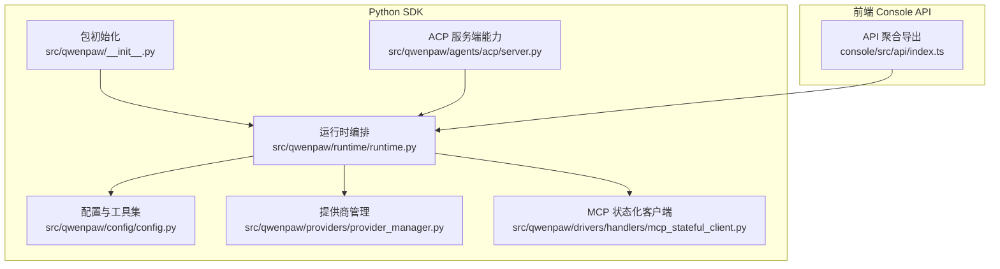
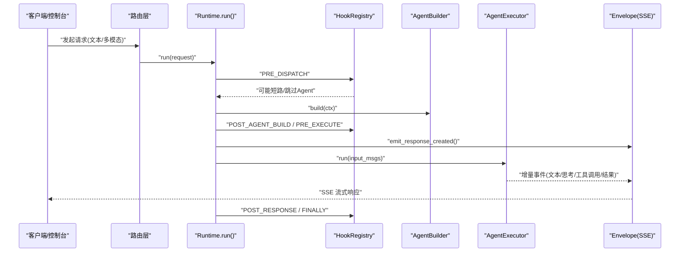
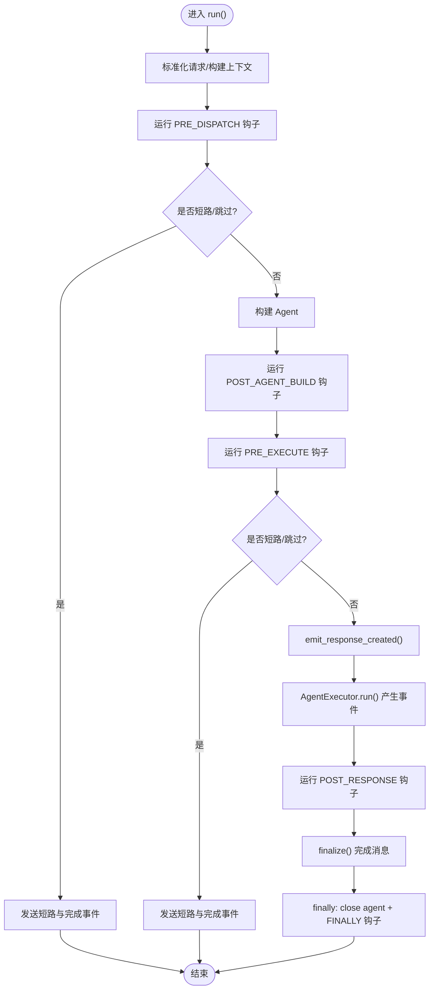
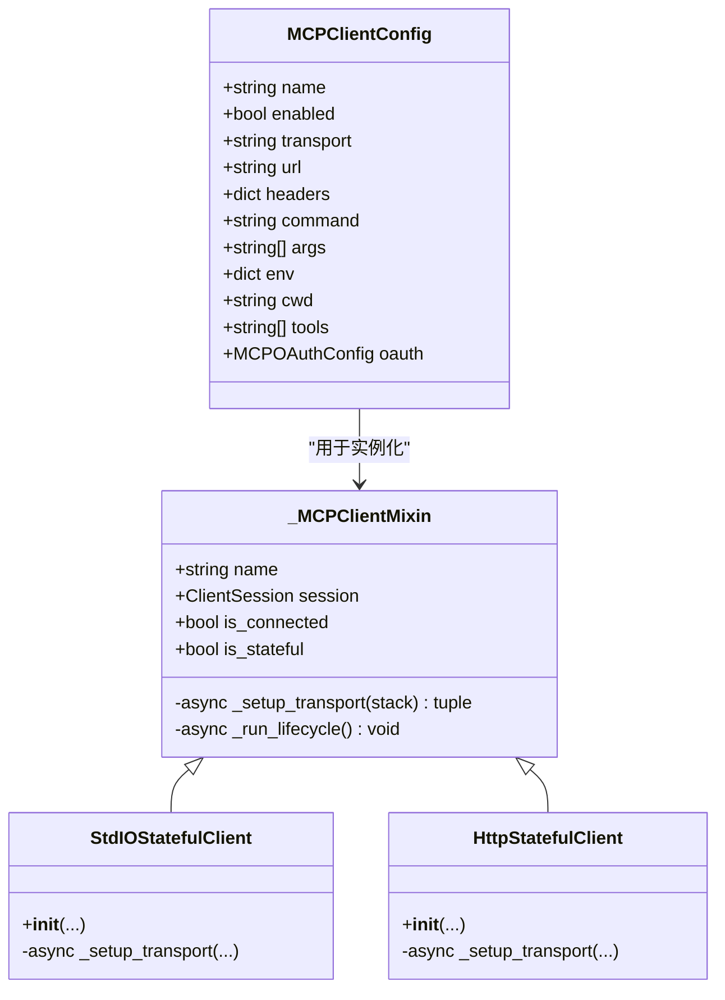
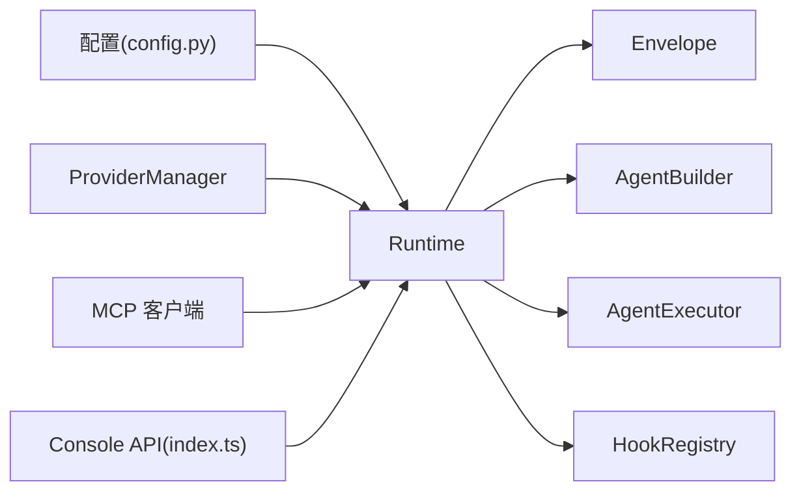

# SDK 集成指南

<cite>
**本文引用的文件**
- [README.md](file://README.md)
- [src/qwenpaw/__init__.py](file://src/qwenpaw/__init__.py)
- [src/qwenpaw/runtime/__init__.py](file://src/qwenpaw/runtime/__init__.py)
- [src/qwenpaw/runtime/runtime.py](file://src/qwenpaw/runtime/runtime.py)
- [src/qwenpaw/config/config.py](file://src/qwenpaw/config/config.py)
- [src/qwenpaw/providers/provider_manager.py](file://src/qwenpaw/providers/provider_manager.py)
- [src/qwenpaw/drivers/handlers/mcp_stateful_client.py](file://src/qwenpaw/drivers/handlers/mcp_stateful_client.py)
- [src/qwenpaw/agents/acp/server.py](file://src/qwenpaw/agents/acp/server.py)
- [console/src/api/index.ts](file://console/src/api/index.ts)
</cite>

## 目录
1. [简介](#简介)
2. [项目结构](#项目结构)
3. [核心组件](#核心组件)
4. [架构总览](#架构总览)
5. [详细组件分析](#详细组件分析)
6. [依赖关系分析](#依赖关系分析)
7. [性能与并发优化](#性能与并发优化)
8. [错误处理与日志配置](#错误处理与日志配置)
9. [批量操作与最佳实践](#批量操作与最佳实践)
10. [版本兼容性与升级迁移](#版本兼容性与升级迁移)
11. [常见问题与故障排除](#常见问题与故障排除)
12. [结论](#结论)

## 简介
本指南面向希望将 QwenPaw 官方 SDK 集成到自有应用的开发者，覆盖安装、配置、基础用法、核心类与方法、异步与回调、错误处理、日志配置、批量与并发、性能优化、完整集成示例与最佳实践、版本兼容与升级迁移、以及常见问题排查。QwenPaw 提供 Python 后端能力与前端 Console API（TypeScript），并支持多种模型提供商、MCP 客户端、ACP 协议等扩展点。

## 项目结构
从 SDK 视角，关键入口与模块如下：
- Python SDK 包初始化与日志启动
- 运行时编排（请求生命周期、SSE 事件流）
- 配置与模型提供商管理
- MCP 客户端（stdio/http/sse）
- ACP 服务端能力声明
- 前端 Console API 聚合导出

图表来源
- [src/qwenpaw/__init__.py:1-34](file://src/qwenpaw/__init__.py#L1-L34)
- [src/qwenpaw/runtime/runtime.py:1-518](file://src/qwenpaw/runtime/runtime.py#L1-L518)
- [src/qwenpaw/config/config.py:1516-1606](file://src/qwenpaw/config/config.py#L1516-L1606)
- [src/qwenpaw/providers/provider_manager.py:1-2415](file://src/qwenpaw/providers/provider_manager.py#L1-L2415)
- [src/qwenpaw/drivers/handlers/mcp_stateful_client.py:107-753](file://src/qwenpaw/drivers/handlers/mcp_stateful_client.py#L107-L753)
- [src/qwenpaw/agents/acp/server.py:502-533](file://src/qwenpaw/agents/acp/server.py#L502-L533)
- [console/src/api/index.ts:1-108](file://console/src/api/index.ts#L1-L108)

章节来源
- [README.md:104-174](file://README.md#L104-L174)
- [src/qwenpaw/__init__.py:1-34](file://src/qwenpaw/__init__.py#L1-L34)
- [src/qwenpaw/runtime/__init__.py:1-11](file://src/qwenpaw/runtime/__init__.py#L1-L11)
- [src/qwenpaw/runtime/runtime.py:1-518](file://src/qwenpaw/runtime/runtime.py#L1-L518)
- [src/qwenpaw/config/config.py:1516-1606](file://src/qwenpaw/config/config.py#L1516-L1606)
- [src/qwenpaw/providers/provider_manager.py:1-2415](file://src/qwenpaw/providers/provider_manager.py#L1-L2415)
- [src/qwenpaw/drivers/handlers/mcp_stateful_client.py:107-753](file://src/qwenpaw/drivers/handlers/mcp_stateful_client.py#L107-L753)
- [src/qwenpaw/agents/acp/server.py:502-533](file://src/qwenpaw/agents/acp/server.py#L502-L533)
- [console/src/api/index.ts:1-108](file://console/src/api/index.ts#L1-L108)

## 核心组件
- 包初始化与日志
  - 在包导入时加载持久化环境变量、设置日志级别，便于早期调试。
- 运行时 Runtime
  - 统一编排 8 阶段生命周期，负责构建 Agent、执行、SSE 事件封装、取消与错误路径的兜底保存与收尾。
- 配置与工具集
  - 定义内置工具、通道配置、MCP 客户端配置、OAuth 配置等。
- 提供商管理 ProviderManager
  - 统一管理内置与自定义模型提供商，提供注册、发现、默认模型、加密存储等能力。
- MCP 状态化客户端
  - 提供 stdio、streamable_http、sse 三种传输的生命周期管理与连接复用，解决跨任务资源泄漏问题。
- ACP 服务端
  - 暴露 initialize 等协议方法，声明 Agent 能力与实现信息。
- 前端 Console API
  - 聚合导出所有业务域 API（聊天、会话、工作区、MCP、Token 用量、安全、备份等）。

章节来源
- [src/qwenpaw/__init__.py:1-34](file://src/qwenpaw/__init__.py#L1-L34)
- [src/qwenpaw/runtime/runtime.py:1-518](file://src/qwenpaw/runtime/runtime.py#L1-L518)
- [src/qwenpaw/config/config.py:1516-1606](file://src/qwenpaw/config/config.py#L1516-L1606)
- [src/qwenpaw/providers/provider_manager.py:1-2415](file://src/qwenpaw/providers/provider_manager.py#L1-L2415)
- [src/qwenpaw/drivers/handlers/mcp_stateful_client.py:107-753](file://src/qwenpaw/drivers/handlers/mcp_stateful_client.py#L107-L753)
- [src/qwenpaw/agents/acp/server.py:502-533](file://src/qwenpaw/agents/acp/server.py#L502-L533)
- [console/src/api/index.ts:1-108](file://console/src/api/index.ts#L1-L108)

## 架构总览
下图展示一次典型请求从控制台或外部调用进入，经运行时编排、Agent 执行、SSE 事件返回的端到端流程。

图表来源
- [src/qwenpaw/runtime/runtime.py:49-206](file://src/qwenpaw/runtime/runtime.py#L49-L206)

## 详细组件分析

### 运行时 Runtime（Python）
- 职责
  - 标准化请求上下文、分阶段钩子调度、构建与执行 Agent、SSE 事件封装、取消与异常路径的健壮性保障。
- 关键方法
  - run(request): 主循环，按阶段驱动；yield Envelope 事件供前端消费。
  - _try_save_on_cancel(ctx): 取消时尽力保存中断轮次状态，注入部分响应与关闭悬空工具调用。
  - _inject_partial_response(agent, envelope): 将累积的部分文本/思考块注入上下文，避免丢失。
  - _close_dangling_tool_calls(agent, envelope): 为未完成的 ToolCallBlock 补齐 ToolResultBlock。
- 设计要点
  - 使用 asyncio.shield 保护保存逻辑，确保即使外层任务被重新取消也能完成 I/O。
  - 通过 HookContext 和 HookAction 控制是否短路或跳过 Agent。
  - finally 中先 close agent，再运行 FINALLY 钩子，保证审计与策略落盘。

图表来源
- [src/qwenpaw/runtime/runtime.py:49-206](file://src/qwenpaw/runtime/runtime.py#L49-L206)

章节来源
- [src/qwenpaw/runtime/runtime.py:1-518](file://src/qwenpaw/runtime/runtime.py#L1-L518)

### 配置与 MCP 客户端（Python）
- 配置项
  - MCPClientConfig：name、transport(stdio/streamable_http/sse)、url/command/env/cwd、tools 白名单、oauth。
  - MCPOAuthConfig：client_id/scope/tokens/endpoints。
- MCP 客户端
  - StdIOStatefulClient：基于 stdio 的子进程通信，生命周期在独立后台任务内管理，避免 CPU 泄漏与僵尸进程。
  - HttpStatefulClient：支持 streamable_http 与 sse 两种传输，统一超时与连接池配置。
  - 共同特性：_setup_transport 抽象、_run_lifecycle 生命周期、事件信号控制重载/停止/就绪。

图表来源
- [src/qwenpaw/config/config.py:1571-1606](file://src/qwenpaw/config/config.py#L1571-L1606)
- [src/qwenpaw/drivers/handlers/mcp_stateful_client.py:107-753](file://src/qwenpaw/drivers/handlers/mcp_stateful_client.py#L107-L753)

章节来源
- [src/qwenpaw/config/config.py:1516-1606](file://src/qwenpaw/config/config.py#L1516-L1606)
- [src/qwenpaw/drivers/handlers/mcp_stateful_client.py:107-753](file://src/qwenpaw/drivers/handlers/mcp_stateful_client.py#L107-L753)

### 提供商管理（Python）
- 功能
  - 注册/发现内置与自定义提供商，提供默认模型列表、元数据、加密存储敏感字段。
  - 支持 OpenAI 兼容、DashScope、Gemini、Anthropic、Ollama、LM Studio、OpenRouter 等。
- 关键点
  - 插件化注册：ProviderManager.register_provider(...) 可动态添加。
  - 敏感字段加密：PROVIDER_SECRET_FIELDS 指定需加密的字段名集合。

章节来源
- [src/qwenpaw/providers/provider_manager.py:1-2415](file://src/qwenpaw/providers/provider_manager.py#L1-L2415)

### ACP 服务端（Python）
- 能力
  - initialize(protocol_version, client_capabilities, client_info) 返回 AgentCapabilities 与 Implementation 信息。
- 用途
  - 作为 ACP 协议的服务器端，对外暴露会话管理、能力协商等接口。

章节来源
- [src/qwenpaw/agents/acp/server.py:502-533](file://src/qwenpaw/agents/acp/server.py#L502-L533)

### 前端 Console API（TypeScript）
- 聚合导出
  - 统一导出 chat、session、workspace、mcp、tokenUsage、security、backup、console、accessControl 等模块。
- 使用建议
  - 通过 api.chat.* 与 api.session.* 进行对话与会话管理；通过 api.mcp.* 管理 MCP 客户端；通过 api.workspace.* 管理工作区。

章节来源
- [console/src/api/index.ts:1-108](file://console/src/api/index.ts#L1-L108)

## 依赖关系分析
- 运行时依赖
  - Runtime 依赖 Envelope、AgentBuilder、AgentExecutor、HookRegistry。
  - 通过 Hook 机制解耦扩展点（如记忆恢复、审计、限流等）。
- 配置依赖
  - 配置集中管理，MCP 客户端与工具集均受配置驱动。
- 提供商依赖
  - ProviderManager 聚合多个 Provider 实现，屏蔽底层差异。
- 前端依赖
  - console/src/api/index.ts 聚合各模块，降低上层耦合。

图表来源
- [src/qwenpaw/runtime/runtime.py:1-518](file://src/qwenpaw/runtime/runtime.py#L1-L518)
- [src/qwenpaw/config/config.py:1516-1606](file://src/qwenpaw/config/config.py#L1516-L1606)
- [src/qwenpaw/providers/provider_manager.py:1-2415](file://src/qwenpaw/providers/provider_manager.py#L1-L2415)
- [console/src/api/index.ts:1-108](file://console/src/api/index.ts#L1-L108)

章节来源
- [src/qwenpaw/runtime/runtime.py:1-518](file://src/qwenpaw/runtime/runtime.py#L1-L518)
- [src/qwenpaw/config/config.py:1516-1606](file://src/qwenpaw/config/config.py#L1516-L1606)
- [src/qwenpaw/providers/provider_manager.py:1-2415](file://src/qwenpaw/providers/provider_manager.py#L1-L2415)
- [console/src/api/index.ts:1-108](file://console/src/api/index.ts#L1-L108)

## 性能与并发优化
- 事件流与背压
  - 使用 SSE 事件流逐步推送，避免一次性大对象阻塞；前端按需渲染。
- 取消与保存
  - 利用 asyncio.shield 保护保存逻辑，确保中断场景下不丢状态。
- MCP 客户端
  - 在独立后台任务中管理生命周期，避免跨任务资源泄漏；合理设置超时与连接池参数。
- 提供商重试
  - 对常见网络与限流异常进行重试包装，提升稳定性。

[本节为通用指导，无需源码引用]

## 错误处理与日志配置
- 日志
  - 包初始化时根据环境变量设置日志级别，便于定位问题。
- 错误路径
  - Runtime 捕获 CancelledError 与 BaseException，触发 ON_ERROR 钩子，生成 error_envelope 事件并记录堆栈。
  - 取消路径会尽力保存中断轮次，防止上下文丢失。
- 建议
  - 在应用侧监听 error_envelope 事件，统一上报与提示用户。

章节来源
- [src/qwenpaw/__init__.py:1-34](file://src/qwenpaw/__init__.py#L1-L34)
- [src/qwenpaw/runtime/runtime.py:142-190](file://src/qwenpaw/runtime/runtime.py#L142-L190)

## 批量操作与最佳实践
- 批量调用
  - 通过并行发起多个请求（注意速率限制与令牌配额），结合 SSE 事件流分别处理每个会话。
- 并发控制
  - 使用线程/协程池限制并发度，避免下游服务过载。
- 幂等与去重
  - 为每次请求分配唯一 session_id，必要时在应用层做幂等键。
- 工具与技能
  - 通过 MCP 工具白名单限制可用工具范围，减少攻击面与无效调用。
- 安全与沙箱
  - 遵循默认沙箱与工具守卫策略，避免危险命令执行。

[本节为通用指导，无需源码引用]

## 版本兼容性与升级迁移
- Python 版本
  - 要求 Python >= 3.11 且 < 3.14。
- 安装方式
  - pip 安装、脚本一键安装、Docker、桌面应用等多种方式。
- 升级步骤
  - 更新后重建前端、重装包、重启服务、清理浏览器缓存。
- 兼容性
  - 保留向后兼容导入（如 GuardedFunctionTool 标记为弃用，建议使用治理层的 PolicyGuardedTool）。

章节来源
- [README.md:104-174](file://README.md#L104-L174)
- [README.md:469-491](file://README.md#L469-L491)
- [src/qwenpaw/runtime/__init__.py:1-11](file://src/qwenpaw/runtime/__init__.py#L1-L11)

## 常见问题与故障排除
- 无法连接本地模型服务（Docker 环境）
  - 容器内 localhost 指向自身，需使用 host.docker.internal 或 host 网络模式访问宿主机服务。
- Windows LTSC 受限语言模式导致安装失败
  - 手动安装 uv 与环境变量配置，然后重新运行安装脚本。
- 首次启动缓慢
  - 桌面应用首次启动需要初始化 Python 环境与依赖，等待窗口自动打开。
- 权限与安全拦截
  - macOS 首次运行需“右键→打开”或在系统设置中允许未知开发者应用。

章节来源
- [README.md:235-259](file://README.md#L235-L259)
- [README.md:146-168](file://README.md#L146-L168)
- [README.md:305-324](file://README.md#L305-L324)

## 结论
QwenPaw SDK 以运行时为核心，围绕配置、提供商、MCP 客户端与 ACP 协议形成可扩展的 Agent OS 架构。通过 SSE 事件流、完善的错误与取消路径、以及丰富的前端 API，开发者可以高效集成并构建稳定的 AI 助手应用。建议在生产环境中关注并发控制、速率限制、安全策略与可观测性，以获得更优的性能与可靠性。