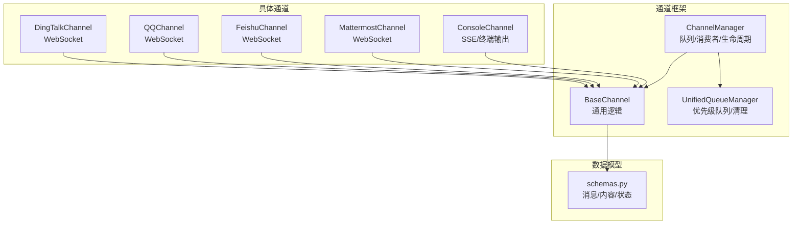
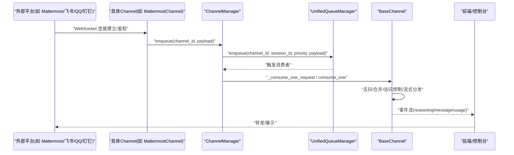
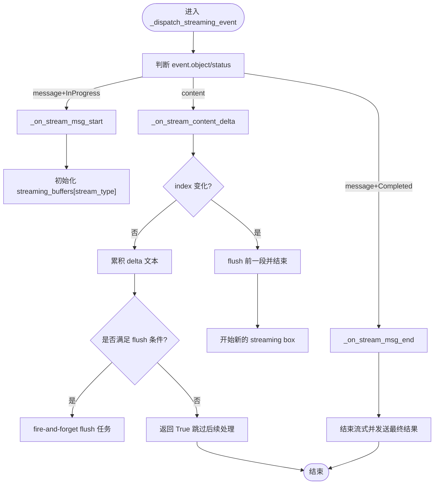
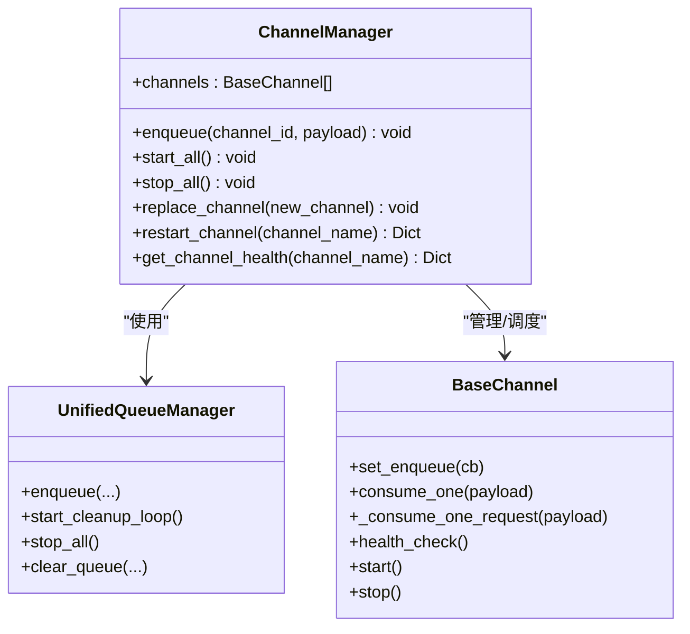
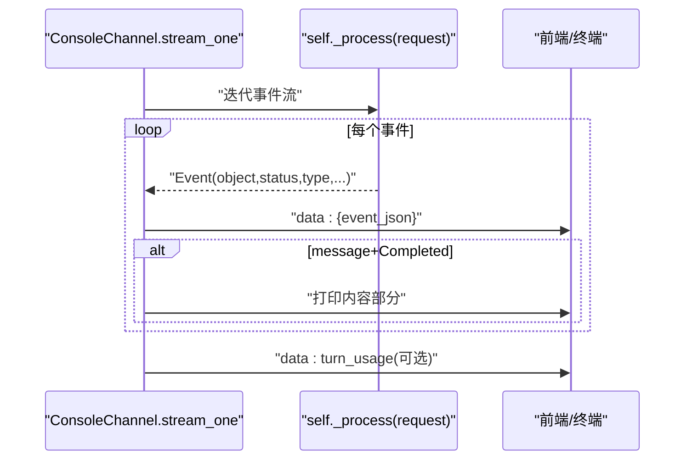
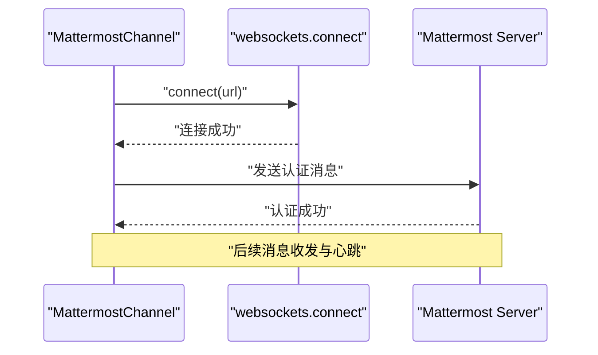
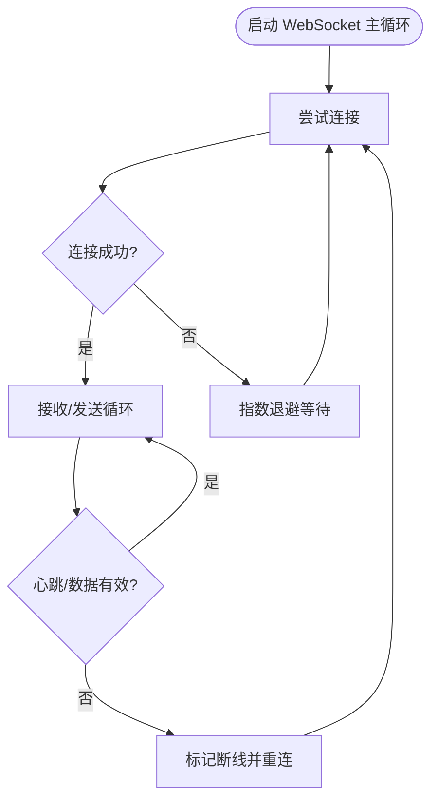
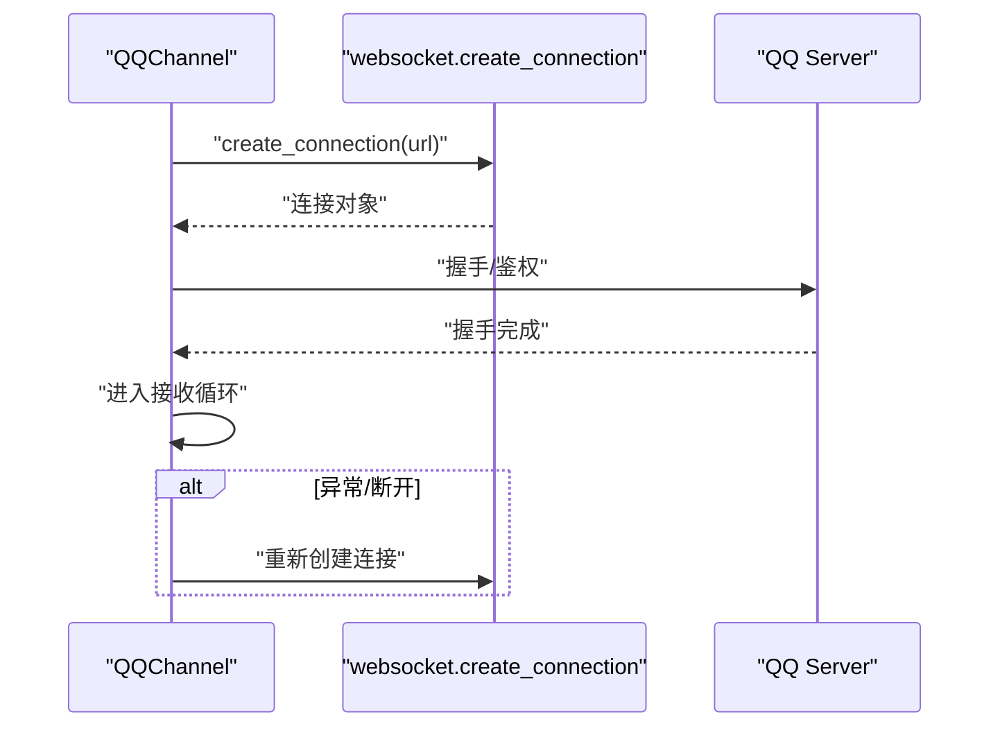
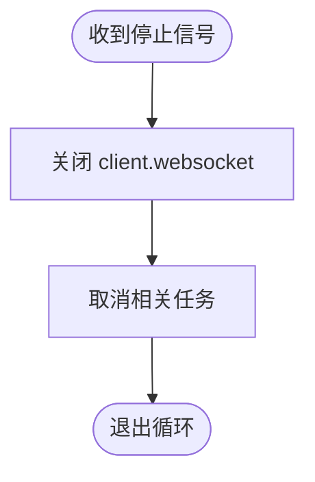
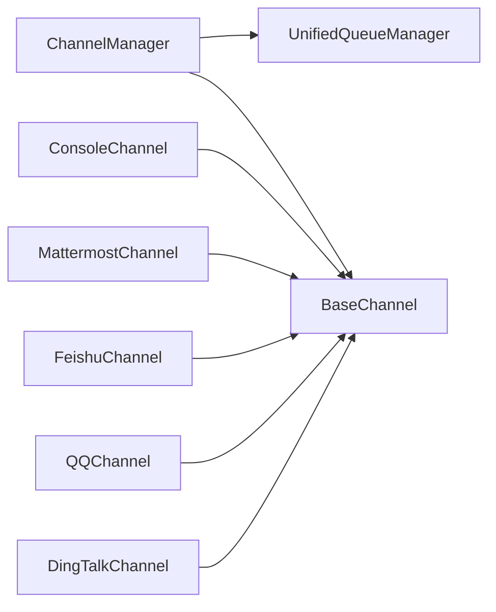

# WebSocket 实时接口

<cite>
**本文引用的文件**   
- [src/qwenpaw/app/channels/base.py](file://src/qwenpaw/app/channels/base.py)
- [src/qwenpaw/app/channels/manager.py](file://src/qwenpaw/app/channels/manager.py)
- [src/qwenpaw/app/channels/console/channel.py](file://src/qwenpaw/app/channels/console/channel.py)
- [src/qwenpaw/app/channels/mattermost/channel.py](file://src/qwenpaw/app/channels/mattermost/channel.py)
- [src/qwenpaw/app/channels/feishu/channel.py](file://src/qwenpaw/app/channels/feishu/channel.py)
- [src/qwenpaw/app/channels/qq/channel.py](file://src/qwenpaw/app/channels/qq/channel.py)
- [src/qwenpaw/app/channels/dingtalk/channel.py](file://src/qwenpaw/app/channels/dingtalk/channel.py)
- [src/qwenpaw/app/channels/unified_queue_manager.py](file://src/qwenpaw/app/channels/unified_queue_manager.py)
- [src/qwenpaw/schemas.py](file://src/qwenpaw/schemas.py)
</cite>

## 目录
1. [简介](#简介)
2. [项目结构](#项目结构)
3. [核心组件](#核心组件)
4. [架构总览](#架构总览)
5. [详细组件分析](#详细组件分析)
6. [依赖关系分析](#依赖关系分析)
7. [性能与资源优化](#性能与资源优化)
8. [故障排查指南](#故障排查指南)
9. [结论](#结论)
10. [附录：客户端接入示例与最佳实践](#附录客户端接入示例与最佳实践)

## 简介
本文件面向 QwenPaw 的“WebSocket 实时通信接口”，聚焦于后端通道（Channel）层对长连接、消息流式推送、事件订阅/发布、连接状态管理、重连机制与错误处理策略的系统性说明。QwenPaw 通过统一的 ChannelManager 与各具体 Channel 实现，将不同平台（如 Mattermost、飞书、QQ、钉钉等）的 WebSocket 或类 WebSocket 能力抽象为一致的请求/响应与事件模型，并基于 BaseChannel 提供通用的去抖、合并、流式分发与访问控制等能力。

## 项目结构
- 通道框架
  - BaseChannel：定义通用生命周期、事件流式分发、内容去抖与合并、访问控制钩子等。
  - ChannelManager：统一队列与消费者调度、批量合并、任务追踪、健康检查与重启。
  - UnifiedQueueManager：按（channel_id, session_id, priority_level）维度进行优先级队列管理与清理。
- 具体通道
  - ConsoleChannel：控制台输出通道，演示 SSE 风格的事件序列化与终端打印。
  - Mattermost、Feishu、QQ、DingTalk 等：各自实现 WebSocket 连接、鉴权、心跳、断线重连与消息收发。
- 数据模型
  - schemas.py：定义消息类型、内容块类型、运行状态等核心数据结构。

图表来源
- [src/qwenpaw/app/channels/base.py:1-200](file://src/qwenpaw/app/channels/base.py#L1-L200)
- [src/qwenpaw/app/channels/manager.py:1-120](file://src/qwenpaw/app/channels/manager.py#L1-L120)
- [src/qwenpaw/app/channels/unified_queue_manager.py](file://src/qwenpaw/app/channels/unified_queue_manager.py)
- [src/qwenpaw/app/channels/console/channel.py:1-120](file://src/qwenpaw/app/channels/console/channel.py#L1-L120)
- [src/qwenpaw/app/channels/mattermost/channel.py:370-400](file://src/qwenpaw/app/channels/mattermost/channel.py#L370-L400)
- [src/qwenpaw/app/channels/feishu/channel.py:2500-2650](file://src/qwenpaw/app/channels/feishu/channel.py#L2500-L2650)
- [src/qwenpaw/app/channels/qq/channel.py:1760-1840](file://src/qwenpaw/app/channels/qq/channel.py#L1760-L1840)
- [src/qwenpaw/app/channels/dingtalk/channel.py:2530-2610](file://src/qwenpaw/app/channels/dingtalk/channel.py#L2530-L2610)
- [src/qwenpaw/schemas.py](file://src/qwenpaw/schemas.py)

章节来源
- [src/qwenpaw/app/channels/base.py:1-200](file://src/qwenpaw/app/channels/base.py#L1-L200)
- [src/qwenpaw/app/channels/manager.py:1-120](file://src/qwenpaw/app/channels/manager.py#L1-L120)
- [src/qwenpaw/app/channels/console/channel.py:1-120](file://src/qwenpaw/app/channels/console/channel.py#L1-L120)
- [src/qwenpaw/app/channels/mattermost/channel.py:370-400](file://src/qwenpaw/app/channels/mattermost/channel.py#L370-L400)
- [src/qwenpaw/app/channels/feishu/channel.py:2500-2650](file://src/qwenpaw/app/channels/feishu/channel.py#L2500-L2650)
- [src/qwenpaw/app/channels/qq/channel.py:1760-1840](file://src/qwenpaw/app/channels/qq/channel.py#L1760-L1840)
- [src/qwenpaw/app/channels/dingtalk/channel.py:2530-2610](file://src/qwenpaw/app/channels/dingtalk/channel.py#L2530-L2610)
- [src/qwenpaw/schemas.py](file://src/qwenpaw/schemas.py)

## 核心组件
- BaseChannel
  - 负责：事件流式分发（reasoning/message）、内容去抖与合并、无文本内容缓冲、音频优先处理、访问控制门控、发送回调、渲染样式等。
  - 关键能力：
    - 流式分发：_dispatch_streaming_event、_on_stream_msg_start/_delta/_end
    - 去抖与合并：_apply_no_text_debounce、merge_native_items、merge_requests
    - 访问控制：_access_control_gate、_check_group_mention
    - 会话键解析：get_debounce_key、resolve_session_id（子类可覆盖）
- ChannelManager
  - 负责：从配置/环境创建通道、统一入队、消费者循环、批量合并、任务追踪、健康检查、动态替换与重启。
  - 关键能力：
    - enqueue：线程安全入队，调用 _enqueue_one -> _enqueue_with_timeout
    - _consume_queue：消费队列，批量合并后交由 channel._consume_one_request 或 consume_one
    - replace_channel/restart_channel：热插拔与重启
- UnifiedQueueManager
  - 负责：按（channel_id, session_id, priority_level）维度维护队列，支持清理与统计。
- ConsoleChannel
  - 负责：控制台输出与 SSE 风格事件序列化；演示了 stream_one 的完整流程。
- 各平台通道
  - Mattermost：使用 websockets.connect 建立连接并进行认证。
  - Feishu：实现指数退避重连、心跳检测、断开恢复。
  - QQ：封装 create_connection 的连接与重连逻辑。
  - DingTalk：在停止时关闭 websocket 并取消任务，避免资源泄漏。

章节来源
- [src/qwenpaw/app/channels/base.py:120-800](file://src/qwenpaw/app/channels/base.py#L120-L800)
- [src/qwenpaw/app/channels/manager.py:68-230](file://src/qwenpaw/app/channels/manager.py#L68-L230)
- [src/qwenpaw/app/channels/manager.py:364-473](file://src/qwenpaw/app/channels/manager.py#L364-L473)
- [src/qwenpaw/app/channels/manager.py:734-792](file://src/qwenpaw/app/channels/manager.py#L734-L792)
- [src/qwenpaw/app/channels/console/channel.py:371-513](file://src/qwenpaw/app/channels/console/channel.py#L371-L513)
- [src/qwenpaw/app/channels/mattermost/channel.py:379-392](file://src/qwenpaw/app/channels/mattermost/channel.py#L379-L392)
- [src/qwenpaw/app/channels/feishu/channel.py:2506-2642](file://src/qwenpaw/app/channels/feishu/channel.py#L2506-L2642)
- [src/qwenpaw/app/channels/qq/channel.py:1764-1832](file://src/qwenpaw/app/channels/qq/channel.py#L1764-L1832)
- [src/qwenpaw/app/channels/dingtalk/channel.py:2531-2608](file://src/qwenpaw/app/channels/dingtalk/channel.py#L2531-L2608)

## 架构总览
下图展示了从外部平台到 QwenPaw 内部通道的整体数据流与控制流。外部平台通过各自的 WebSocket 连接进入对应 Channel，Channel 将原生消息转换为统一格式，经 ChannelManager 的队列与消费者处理后，由 BaseChannel 进行流式分发与渲染，最终回写到前端或目标平台。

图表来源
- [src/qwenpaw/app/channels/manager.py:364-473](file://src/qwenpaw/app/channels/manager.py#L364-L473)
- [src/qwenpaw/app/channels/base.py:590-794](file://src/qwenpaw/app/channels/base.py#L590-L794)
- [src/qwenpaw/app/channels/console/channel.py:371-513](file://src/qwenpaw/app/channels/console/channel.py#L371-L513)
- [src/qwenpaw/app/channels/mattermost/channel.py:379-392](file://src/qwenpaw/app/channels/mattermost/channel.py#L379-L392)
- [src/qwenpaw/app/channels/feishu/channel.py:2506-2642](file://src/qwenpaw/app/channels/feishu/channel.py#L2506-L2642)
- [src/qwenpaw/app/channels/qq/channel.py:1764-1832](file://src/qwenpaw/app/channels/qq/channel.py#L1764-L1832)
- [src/qwenpaw/app/channels/dingtalk/channel.py:2531-2608](file://src/qwenpaw/app/channels/dingtalk/channel.py#L2531-L2608)

## 详细组件分析

### BaseChannel 分析与设计
- 流式分发
  - 识别 object/status/type，区分 reasoning/message/content delta，维护 msg_id 到 stream_type 映射与累积缓冲区。
  - 非阻塞 flush：通过异步任务与超时保护，避免高频 delta 导致阻塞。
- 去抖与合并
  - 无文本内容缓冲：当 content_parts 不含 TEXT/REFUSAL 时，先缓存，直到出现文本或音频再合并。
  - 时间去抖：同一会话键内短时间内的多个 native payload 可合并。
- 访问控制
  - 白名单/黑名单/待审批，支持 DM/群组差异化策略，失败时通过 send_content_parts 返回提示。
- 会话键解析
  - get_debounce_key 委托 resolve_session_id，确保每个通道可按自身规则归一化会话键。

图表来源
- [src/qwenpaw/app/channels/base.py:604-794](file://src/qwenpaw/app/channels/base.py#L604-L794)

章节来源
- [src/qwenpaw/app/channels/base.py:120-800](file://src/qwenpaw/app/channels/base.py#L120-L800)

### ChannelManager 与队列系统
- 入队路径
  - enqueue：线程安全地将 payload 投递到事件循环，执行 _enqueue_one。
  - _enqueue_one：提取查询文本用于优先级分类，解析 session_id，调用 _enqueue_with_timeout。
  - _enqueue_with_timeout：带超时保护的入队，防止阻塞。
- 消费路径
  - _consume_queue：拉取首个元素，随后 drain 同键元素形成 batch，交由 _process_batch 合并与处理。
  - _process_batch：根据是否为 native payload 决定 merge_native_items 或 merge_requests，再调用 _consume_one_request 或 consume_one。
- 生命周期
  - start_all：初始化 UnifiedQueueManager，设置 enqueue 回调，后台启动各通道。
  - stop_all：取消任务、停止队列管理器、逐个停止通道。
  - replace_channel/restart_channel：热插拔与重启，保证新实例先启动再替换旧实例。

图表来源
- [src/qwenpaw/app/channels/manager.py:68-230](file://src/qwenpaw/app/channels/manager.py#L68-L230)
- [src/qwenpaw/app/channels/manager.py:364-473](file://src/qwenpaw/app/channels/manager.py#L364-L473)
- [src/qwenpaw/app/channels/manager.py:734-792](file://src/qwenpaw/app/channels/manager.py#L734-L792)
- [src/qwenpaw/app/channels/base.py:120-200](file://src/qwenpaw/app/channels/base.py#L120-L200)

章节来源
- [src/qwenpaw/app/channels/manager.py:68-230](file://src/qwenpaw/app/channels/manager.py#L68-L230)
- [src/qwenpaw/app/channels/manager.py:364-473](file://src/qwenpaw/app/channels/manager.py#L364-L473)
- [src/qwenpaw/app/channels/manager.py:734-792](file://src/qwenpaw/app/channels/manager.py#L734-L792)

### ConsoleChannel 事件流与 SSE 风格输出
- stream_one：将 payload 转为 AgentRequest，遍历事件流，序列化为 data: ... 行，并在 message completed 时打印内容。
- 尾部 usage：在流结束后追加 turn_usage 事件，便于前端统计。
- 错误与限流：捕获 ModelQuotaExceededException，返回 rate_limited 事件并建议替代模型。

图表来源
- [src/qwenpaw/app/channels/console/channel.py:371-513](file://src/qwenpaw/app/channels/console/channel.py#L371-L513)

章节来源
- [src/qwenpaw/app/channels/console/channel.py:371-513](file://src/qwenpaw/app/channels/console/channel.py#L371-L513)

### Mattermost 通道：WebSocket 连接与认证
- 连接建立：使用 websockets.connect 建立连接。
- 认证：连接成功后进行认证流程，记录已认证状态。
- 错误处理：异常日志记录与恢复策略（具体实现见文件）。

图表来源
- [src/qwenpaw/app/channels/mattermost/channel.py:379-392](file://src/qwenpaw/app/channels/mattermost/channel.py#L379-L392)

章节来源
- [src/qwenpaw/app/channels/mattermost/channel.py:379-392](file://src/qwenpaw/app/channels/mattermost/channel.py#L379-L392)

### 飞书通道：指数退避重连与心跳
- 重连策略：指数退避，记录断线原因与重试间隔。
- 心跳检测：长时间无数据视为异常，触发重连。
- 优雅关闭：正常停止与异常退出均能释放资源。

图表来源
- [src/qwenpaw/app/channels/feishu/channel.py:2506-2642](file://src/qwenpaw/app/channels/feishu/channel.py#L2506-L2642)

章节来源
- [src/qwenpaw/app/channels/feishu/channel.py:2506-2642](file://src/qwenpaw/app/channels/feishu/channel.py#L2506-L2642)

### QQ 通道：连接与重连封装
- 连接方法：封装 create_connection，处理连接参数与状态。
- 重连逻辑：在连接失败或异常时自动重连，保持会话连续性。

图表来源
- [src/qwenpaw/app/channels/qq/channel.py:1764-1832](file://src/qwenpaw/app/channels/qq/channel.py#L1764-L1832)

章节来源
- [src/qwenpaw/app/channels/qq/channel.py:1764-1832](file://src/qwenpaw/app/channels/qq/channel.py#L1764-L1832)

### 钉钉通道：停止时的资源清理
- 停止流程：关闭 client.websocket，取消相关任务，避免 Task was destroyed 警告。
- 健壮性：即使进程休眠唤醒也能强制关闭连接。

图表来源
- [src/qwenpaw/app/channels/dingtalk/channel.py:2531-2608](file://src/qwenpaw/app/channels/dingtalk/channel.py#L2531-L2608)

章节来源
- [src/qwenpaw/app/channels/dingtalk/channel.py:2531-2608](file://src/qwenpaw/app/channels/dingtalk/channel.py#L2531-L2608)

## 依赖关系分析
- 模块耦合
  - ChannelManager 强依赖 BaseChannel 与 UnifiedQueueManager，负责编排与调度。
  - 具体 Channel 继承 BaseChannel，复用通用逻辑，仅实现平台特定的连接与消息转换。
- 外部依赖
  - Mattermost 使用 websockets 库。
  - 飞书/QQ/钉钉等平台 SDK 或第三方库。
- 潜在循环依赖
  - 当前结构以 manager/base 为核心，具体通道单向依赖 base，未见循环导入。

图表来源
- [src/qwenpaw/app/channels/manager.py:68-120](file://src/qwenpaw/app/channels/manager.py#L68-L120)
- [src/qwenpaw/app/channels/base.py:120-200](file://src/qwenpaw/app/channels/base.py#L120-L200)
- [src/qwenpaw/app/channels/console/channel.py:1-120](file://src/qwenpaw/app/channels/console/channel.py#L1-L120)
- [src/qwenpaw/app/channels/mattermost/channel.py:370-400](file://src/qwenpaw/app/channels/mattermost/channel.py#L370-L400)
- [src/qwenpaw/app/channels/feishu/channel.py:2500-2650](file://src/qwenpaw/app/channels/feishu/channel.py#L2500-L2650)
- [src/qwenpaw/app/channels/qq/channel.py:1760-1840](file://src/qwenpaw/app/channels/qq/channel.py#L1760-L1840)
- [src/qwenpaw/app/channels/dingtalk/channel.py:2530-2610](file://src/qwenpaw/app/channels/dingtalk/channel.py#L2530-L2610)

章节来源
- [src/qwenpaw/app/channels/manager.py:68-120](file://src/qwenpaw/app/channels/manager.py#L68-L120)
- [src/qwenpaw/app/channels/base.py:120-200](file://src/qwenpaw/app/channels/base.py#L120-L200)

## 性能与资源优化
- 批量合并与去抖
  - 同会话键的消息在消费者端批量合并，减少重复处理与渲染开销。
  - 无文本内容缓冲避免频繁无效输出，音频优先立即处理提升语音体验。
- 非阻塞 flush
  - 流式 delta 采用 fire-and-forget 任务与超时保护，避免高频推送阻塞事件循环。
- 队列容量与清理
  - 每通道队列最大容量限制，配合清理循环防止内存增长。
- 连接池与资源回收
  - 各通道在停止时显式关闭连接与取消任务，避免资源泄漏。
- 优先级路由
  - 基于查询文本的命令优先级，将高优消息快速处理，降低延迟。

章节来源
- [src/qwenpaw/app/channels/base.py:263-337](file://src/qwenpaw/app/channels/base.py#L263-L337)
- [src/qwenpaw/app/channels/base.py:760-794](file://src/qwenpaw/app/channels/base.py#L760-L794)
- [src/qwenpaw/app/channels/manager.py:364-473](file://src/qwenpaw/app/channels/manager.py#L364-L473)
- [src/qwenpaw/app/channels/dingtalk/channel.py:2531-2608](file://src/qwenpaw/app/channels/dingtalk/channel.py#L2531-L2608)

## 故障排查指南
- 常见问题定位
  - 连接失败：检查具体通道连接与认证逻辑（如 Mattermost/websockets.connect）。
  - 断线重连：查看飞书通道的指数退避与心跳检测日志。
  - 任务未释放：确认钉钉通道是否在停止时关闭 websocket 并取消任务。
  - 消息堆积：观察 ChannelManager 的队列容量与清理情况，必要时调整 maxsize。
- 诊断工具
  - health_check：获取通道健康状态。
  - restart_channel：热重启通道实例，验证配置变更生效。
  - clear_queue：清空指定队列，缓解积压。
- 日志关键字
  - “consumer started/failed”、“enqueue failed”、“reconnecting in”、“stopped normally”。

章节来源
- [src/qwenpaw/app/channels/manager.py:579-608](file://src/qwenpaw/app/channels/manager.py#L579-L608)
- [src/qwenpaw/app/channels/manager.py:610-695](file://src/qwenpaw/app/channels/manager.py#L610-L695)
- [src/qwenpaw/app/channels/manager.py:710-733](file://src/qwenpaw/app/channels/manager.py#L710-L733)
- [src/qwenpaw/app/channels/feishu/channel.py:2506-2642](file://src/qwenpaw/app/channels/feishu/channel.py#L2506-L2642)
- [src/qwenpaw/app/channels/dingtalk/channel.py:2531-2608](file://src/qwenpaw/app/channels/dingtalk/channel.py#L2531-L2608)

## 结论
QwenPaw 的 WebSocket 实时通信通过 BaseChannel 与 ChannelManager 的统一抽象，实现了跨平台的长连接、流式事件分发与资源管理。各具体通道在连接建立、鉴权、心跳与重连方面具备完善的实现，结合去抖、合并与优先级队列，保障了高吞吐与低延迟。生产部署中应关注队列容量、清理策略与连接资源回收，并通过 health_check 与重启机制保障稳定性。

## 附录：客户端接入示例与最佳实践
- 连接建立与鉴权
  - Mattermost：使用 websockets.connect 建立连接后进行认证。
  - 飞书/QQ/钉钉：遵循各自 SDK 的连接与鉴权流程，注意指数退避与心跳。
- 消息格式与事件类型
  - 参考 BaseChannel 的流式分发逻辑，事件包含 object/status/type 字段，content delta 携带 index/text 等。
  - 参考 ConsoleChannel 的 SSE 风格输出，事件以 data: ... 行形式推送。
- 客户端处理建议
  - 按 session_id 聚合消息，处理 reasoning/message 两类流。
  - 处理 content delta 的 index 变化，分段渲染。
  - 监听 rate_limited 事件，切换备用模型或降级策略。
- 调试与监控
  - 启用健康检查与重启接口，定期巡检通道状态。
  - 采集队列长度、处理耗时、重连次数等指标。

章节来源
- [src/qwenpaw/app/channels/mattermost/channel.py:379-392](file://src/qwenpaw/app/channels/mattermost/channel.py#L379-L392)
- [src/qwenpaw/app/channels/feishu/channel.py:2506-2642](file://src/qwenpaw/app/channels/feishu/channel.py#L2506-L2642)
- [src/qwenpaw/app/channels/qq/channel.py:1764-1832](file://src/qwenpaw/app/channels/qq/channel.py#L1764-L1832)
- [src/qwenpaw/app/channels/console/channel.py:371-513](file://src/qwenpaw/app/channels/console/channel.py#L371-L513)
- [src/qwenpaw/app/channels/base.py:604-794](file://src/qwenpaw/app/channels/base.py#L604-L794)