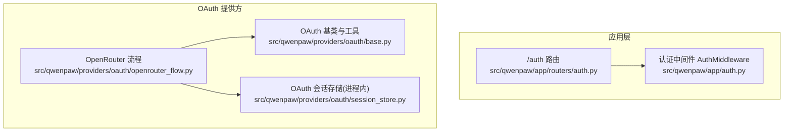
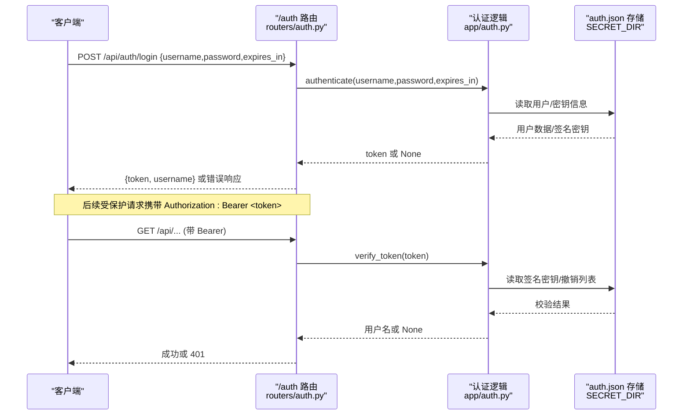
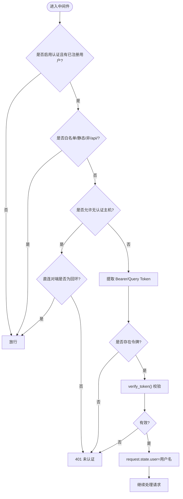
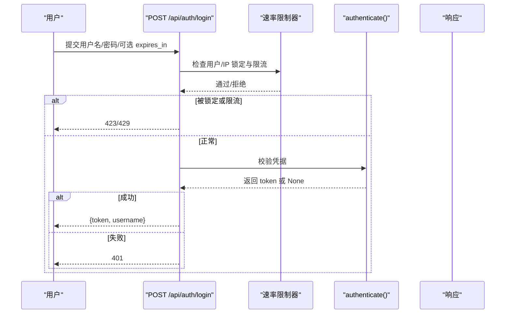
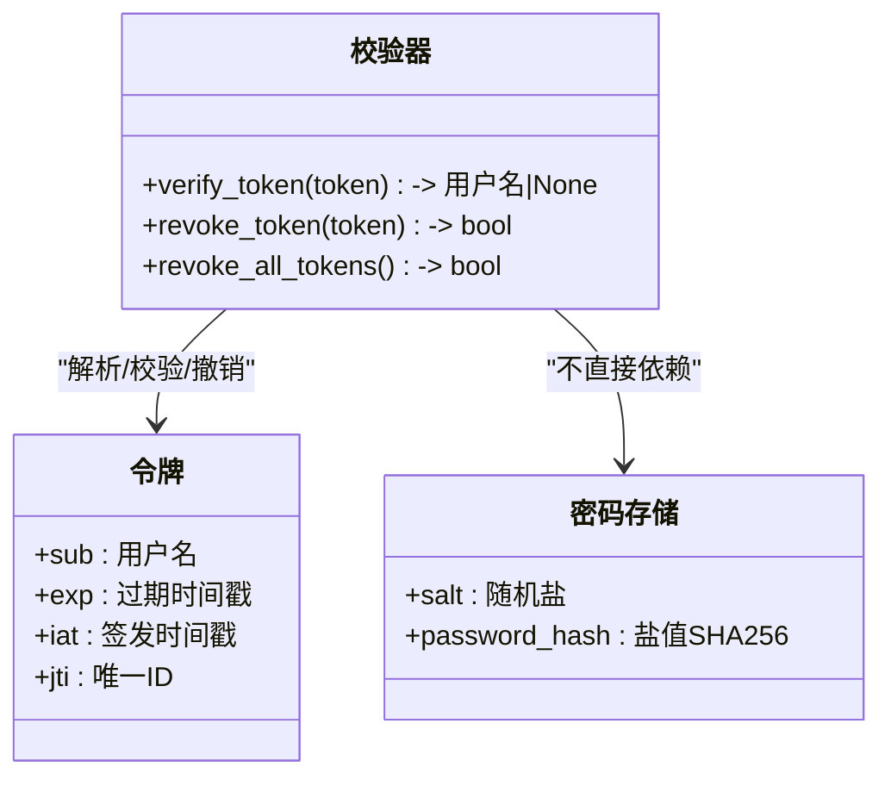
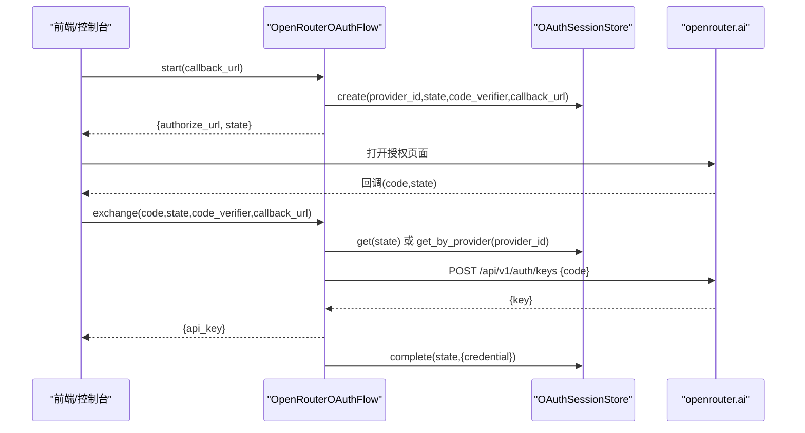
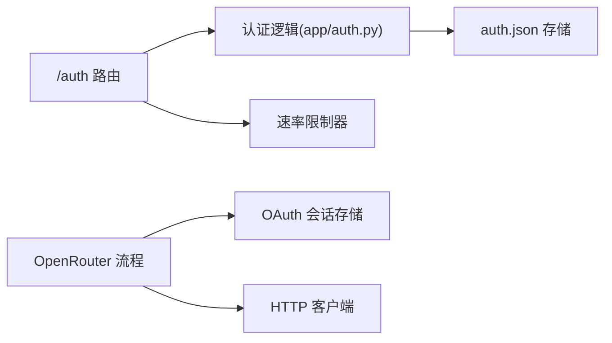

# 认证与授权接口

<cite>
**本文引用的文件**
- [src/qwenpaw/app/auth.py](file://src/qwenpaw/app/auth.py)
- [src/qwenpaw/app/routers/auth.py](file://src/qwenpaw/app/routers/auth.py)
- [src/qwenpaw/providers/oauth/base.py](file://src/qwenpaw/providers/oauth/base.py)
- [src/qwenpaw/providers/oauth/openrouter_flow.py](file://src/qwenpaw/providers/oauth/openrouter_flow.py)
- [src/qwenpaw/providers/oauth/session_store.py](file://src/qwenpaw/providers/oauth/session_store.py)
- [tests/unit/app/auth/test_client_ip.py](file://tests/unit/app/auth/test_client_ip.py)
</cite>

## 目录
1. [简介](#简介)
2. [项目结构](#项目结构)
3. [核心组件](#核心组件)
4. [架构总览](#架构总览)
5. [详细组件分析](#详细组件分析)
6. [依赖关系分析](#依赖关系分析)
7. [性能考虑](#性能考虑)
8. [故障排查指南](#故障排查指南)
9. [结论](#结论)
10. [附录](#附录)

## 简介
本文件面向 QwenPaw 的认证与授权能力，覆盖以下主题：
- 用户认证流程、登录接口与令牌管理（含令牌撤销）
- JWT 令牌格式与校验机制
- OAuth 2.0 集成（OpenRouter）与第三方认证提供商配置
- 访问控制列表、权限模型与角色管理现状说明
- 多租户与工作空间隔离、用户权限继承现状说明
- 认证流程图与安全最佳实践
- 常见安全问题防护与漏洞修复方案

## 项目结构
认证与授权相关代码主要分布在应用层路由与认证中间件，以及提供者侧的 OAuth 基础实现与 OpenRouter 流程。

**图表来源**
- [src/qwenpaw/app/routers/auth.py:1-326](file://src/qwenpaw/app/routers/auth.py#L1-L326)
- [src/qwenpaw/app/auth.py:689-763](file://src/qwenpaw/app/auth.py#L689-L763)
- [src/qwenpaw/providers/oauth/base.py:1-113](file://src/qwenpaw/providers/oauth/base.py#L1-L113)
- [src/qwenpaw/providers/oauth/openrouter_flow.py:1-52](file://src/qwenpaw/providers/oauth/openrouter_flow.py#L1-L52)
- [src/qwenpaw/providers/oauth/session_store.py:1-115](file://src/qwenpaw/providers/oauth/session_store.py#L1-L115)

**章节来源**
- [src/qwenpaw/app/routers/auth.py:1-326](file://src/qwenpaw/app/routers/auth.py#L1-L326)
- [src/qwenpaw/app/auth.py:1-780](file://src/qwenpaw/app/auth.py#L1-L780)
- [src/qwenpaw/providers/oauth/base.py:1-113](file://src/qwenpaw/providers/oauth/base.py#L1-L113)
- [src/qwenpaw/providers/oauth/openrouter_flow.py:1-52](file://src/qwenpaw/providers/oauth/openrouter_flow.py#L1-L52)
- [src/qwenpaw/providers/oauth/session_store.py:1-115](file://src/qwenpaw/providers/oauth/session_store.py#L1-L115)

## 核心组件
- 认证中间件 AuthMiddleware：对 /api/* 请求进行鉴权，支持白名单路径、静态资源前缀、可信代理 IP 解析与本地回环免鉴权策略。
- 认证 API 路由：提供注册、登录、状态查询、令牌验证、更新凭据、单令牌撤销、全部令牌撤销等接口。
- 令牌与密码：基于 HMAC-SHA256 的自实现令牌；密码使用盐值 SHA-256 哈希存储；支持令牌撤销与批量失效。
- OAuth 2.0 基础与 OpenRouter 流程：提供 PKCE 工具、state 生成、OpenRouter 浏览器重定向获取永久 API Key 的流程。
- OAuth 会话存储：进程内 TTL 过期清理的临时会话存储。

**章节来源**
- [src/qwenpaw/app/auth.py:689-763](file://src/qwenpaw/app/auth.py#L689-L763)
- [src/qwenpaw/app/routers/auth.py:1-326](file://src/qwenpaw/app/routers/auth.py#L1-L326)
- [src/qwenpaw/providers/oauth/base.py:1-113](file://src/qwenpaw/providers/oauth/base.py#L1-L113)
- [src/qwenpaw/providers/oauth/openrouter_flow.py:1-52](file://src/qwenpaw/providers/oauth/openrouter_flow.py#L1-L52)
- [src/qwenpaw/providers/oauth/session_store.py:1-115](file://src/qwenpaw/providers/oauth/session_store.py#L1-L115)

## 架构总览
下图展示了从客户端到后端的路由、中间件、令牌校验与持久化存储的整体交互。

**图表来源**
- [src/qwenpaw/app/routers/auth.py:51-103](file://src/qwenpaw/app/routers/auth.py#L51-L103)
- [src/qwenpaw/app/auth.py:132-204](file://src/qwenpaw/app/auth.py#L132-L204)
- [src/qwenpaw/app/auth.py:212-260](file://src/qwenpaw/app/auth.py#L212-L260)

## 详细组件分析

### 认证中间件 AuthMiddleware
- 跳过鉴权条件：
  - 未启用认证或未注册用户
  - OPTIONS 预检请求
  - 白名单路径与静态资源前缀
  - 非 /api/ 前缀的请求
  - 来自 allow_no_auth_hosts 的客户端 IP（需满足直连对端为回环地址的安全约束）
- 令牌提取：优先 Authorization: Bearer，其次 WebSocket upgrade 场景 query token，最后普通 query token。
- 失败处理：返回 401 JSON 响应。

**图表来源**
- [src/qwenpaw/app/auth.py:689-763](file://src/qwenpaw/app/auth.py#L689-L763)

**章节来源**
- [src/qwenpaw/app/auth.py:53-74](file://src/qwenpaw/app/auth.py#L53-L74)
- [src/qwenpaw/app/auth.py:689-763](file://src/qwenpaw/app/auth.py#L689-L763)

### 认证 API 路由
- 登录 /api/auth/login
  - 支持 expires_in 指定令牌有效期（正数秒、0/-1 表示长期）。
  - 结合速率限制器对用户/IP 进行锁定与限流。
  - 成功后返回 token 与 username。
- 注册 /api/auth/register
  - 仅在认证启用且尚未注册用户时允许。
  - 创建首个用户并返回初始 token。
- 状态 /api/auth/status
  - 返回认证是否启用与是否存在用户。
- 验证 /api/auth/verify
  - 校验当前 Bearer 令牌有效性并返回用户名。
- 更新凭据 /api/auth/update-profile
  - 需要当前密码验证，可更新用户名和/或密码。
  - 修改密码会旋转签名密钥以强制所有旧令牌失效。
- 撤销令牌
  - 单个撤销 /api/auth/revoke-token：将 jti 加入黑名单。
  - 全部撤销 /api/auth/revoke-all-tokens：旋转签名密钥使所有历史令牌失效。

**图表来源**
- [src/qwenpaw/app/routers/auth.py:51-103](file://src/qwenpaw/app/routers/auth.py#L51-L103)

**章节来源**
- [src/qwenpaw/app/routers/auth.py:25-103](file://src/qwenpaw/app/routers/auth.py#L25-L103)
- [src/qwenpaw/app/routers/auth.py:106-141](file://src/qwenpaw/app/routers/auth.py#L106-L141)
- [src/qwenpaw/app/routers/auth.py:144-171](file://src/qwenpaw/app/routers/auth.py#L144-L171)
- [src/qwenpaw/app/routers/auth.py:183-235](file://src/qwenpaw/app/routers/auth.py#L183-L235)
- [src/qwenpaw/app/routers/auth.py:244-325](file://src/qwenpaw/app/routers/auth.py#L244-L325)

### 令牌与密码机制
- 令牌格式
  - 结构：base64url(payload).HMAC-SHA256(signature)
  - payload 包含 sub（用户名）、exp（过期时间）、iat（签发时间）、jti（唯一令牌 ID，用于撤销）
  - 默认有效期 7 天；支持长期令牌（100 年上限）
- 令牌校验
  - 校验签名、过期时间、是否在撤销列表中
- 令牌撤销
  - 单个撤销：按 jti 加入黑名单
  - 全部撤销：旋转签名密钥，使所有历史令牌无效
- 密码存储
  - 盐值 + SHA-256 哈希，安全比较函数防时序攻击
  - 敏感字段在 auth.json 中加密存储

**图表来源**
- [src/qwenpaw/app/auth.py:132-204](file://src/qwenpaw/app/auth.py#L132-L204)
- [src/qwenpaw/app/auth.py:504-566](file://src/qwenpaw/app/auth.py#L504-L566)
- [src/qwenpaw/app/auth.py:99-114](file://src/qwenpaw/app/auth.py#L99-L114)

**章节来源**
- [src/qwenpaw/app/auth.py:132-204](file://src/qwenpaw/app/auth.py#L132-L204)
- [src/qwenpaw/app/auth.py:504-566](file://src/qwenpaw/app/auth.py#L504-L566)
- [src/qwenpaw/app/auth.py:99-114](file://src/qwenpaw/app/auth.py#L99-L114)

### OAuth 2.0 集成（OpenRouter）
- 基础能力
  - PKCE code_verifier/code_challenge 生成
  - state 生成用于 CSRF 防护
  - 抽象 OAuthFlow 接口：start/exchange/refresh
- OpenRouter 流程
  - start：生成 authorize_url 与 state
  - exchange：回调后换取永久 API Key
- 会话存储
  - 进程内内存存储，TTL 10 分钟自动清理
  - 支持按 provider_id 回退查找最近 pending 会话

**图表来源**
- [src/qwenpaw/providers/oauth/base.py:1-113](file://src/qwenpaw/providers/oauth/base.py#L1-L113)
- [src/qwenpaw/providers/oauth/openrouter_flow.py:1-52](file://src/qwenpaw/providers/oauth/openrouter_flow.py#L1-L52)
- [src/qwenpaw/providers/oauth/session_store.py:1-115](file://src/qwenpaw/providers/oauth/session_store.py#L1-L115)

**章节来源**
- [src/qwenpaw/providers/oauth/base.py:1-113](file://src/qwenpaw/providers/oauth/base.py#L1-L113)
- [src/qwenpaw/providers/oauth/openrouter_flow.py:1-52](file://src/qwenpaw/providers/oauth/openrouter_flow.py#L1-L52)
- [src/qwenpaw/providers/oauth/session_store.py:1-115](file://src/qwenpaw/providers/oauth/session_store.py#L1-L115)

### 访问控制列表、权限模型与角色管理
- 当前实现聚焦于“是否认证”的网关级鉴权，未内置细粒度 ACL、RBAC 或角色体系。
- 如需扩展，可在中间件之后引入基于路径/资源的权限检查层，并结合工作区上下文进行决策。

[本节为概念性说明，不涉及具体文件分析]

### 多租户、工作空间隔离与权限继承
- 当前认证模块未实现多租户与跨租户隔离；令牌仅承载用户名与有效期。
- 工作区隔离在其他模块体现（如工作区路径、媒体目录等），但不在认证层做强制隔离。
- 权限继承未在认证层定义，建议在工作区/资源层建模。

[本节为概念性说明，不涉及具体文件分析]

## 依赖关系分析
- 路由层依赖认证逻辑与速率限制器
- 认证中间件依赖配置加载（trusted_proxies、allow_no_auth_hosts）与文件系统（auth.json）
- OAuth 流程依赖 HTTP 客户端与进程内会话存储

**图表来源**
- [src/qwenpaw/app/routers/auth.py:1-326](file://src/qwenpaw/app/routers/auth.py#L1-L326)
- [src/qwenpaw/app/auth.py:619-686](file://src/qwenpaw/app/auth.py#L619-L686)
- [src/qwenpaw/providers/oauth/openrouter_flow.py:1-52](file://src/qwenpaw/providers/oauth/openrouter_flow.py#L1-L52)
- [src/qwenpaw/providers/oauth/session_store.py:1-115](file://src/qwenpaw/providers/oauth/session_store.py#L1-L115)

**章节来源**
- [src/qwenpaw/app/routers/auth.py:1-326](file://src/qwenpaw/app/routers/auth.py#L1-L326)
- [src/qwenpaw/app/auth.py:619-686](file://src/qwenpaw/app/auth.py#L619-L686)
- [src/qwenpaw/providers/oauth/openrouter_flow.py:1-52](file://src/qwenpaw/providers/oauth/openrouter_flow.py#L1-L52)
- [src/qwenpaw/providers/oauth/session_store.py:1-115](file://src/qwenpaw/providers/oauth/session_store.py#L1-L115)

## 性能考虑
- 令牌校验为轻量计算（HMAC 与 JSON 解码），开销低。
- 撤销列表采用 dict 索引，O(1) 查找；定期清理过期条目避免无限增长。
- 配置缓存：认证中间件对 trusted_proxies 与 allow_no_auth_hosts 使用 mtime 缓存，减少频繁磁盘读取。
- OAuth 会话存储为进程内内存结构，TTL 清理保证内存占用可控。

**章节来源**
- [src/qwenpaw/app/auth.py:303-333](file://src/qwenpaw/app/auth.py#L303-L333)
- [src/qwenpaw/app/auth.py:619-638](file://src/qwenpaw/app/auth.py#L619-L638)
- [src/qwenpaw/providers/oauth/session_store.py:40-45](file://src/qwenpaw/providers/oauth/session_store.py#L40-L45)

## 故障排查指南
- 登录失败
  - 检查认证是否启用与是否已有用户
  - 查看速率限制器是否锁定用户或 IP
  - 确认用户名/密码正确
- 令牌无效或过期
  - 检查 Authorization 头是否正确携带 Bearer
  - 确认令牌未被撤销或过期
  - 必要时调用 revoke-all-tokens 并重新登录
- 代理与 IP 问题
  - 若使用反向代理，确保将直连对端加入 trusted_proxies
  - 注意 X-Forwarded-For/X-Real-IP 的解析顺序与安全性
  - 回环免认证策略要求直连对端也为回环地址

**章节来源**
- [src/qwenpaw/app/routers/auth.py:51-103](file://src/qwenpaw/app/routers/auth.py#L51-L103)
- [src/qwenpaw/app/auth.py:641-686](file://src/qwenpaw/app/auth.py#L641-L686)
- [tests/unit/app/auth/test_client_ip.py:138-192](file://tests/unit/app/auth/test_client_ip.py#L138-L192)

## 结论
QwenPaw 的认证与授权实现了最小可用集：基于 HMAC 的自实现令牌、单用户注册与登录、令牌撤销与批量失效、可信代理 IP 解析与回环免认证策略。OAuth 2.0 提供了 OpenRouter 的浏览器重定向流程与进程内会话管理。当前未内置 RBAC/ACL 与多租户隔离，建议在业务层按需扩展。

[本节为总结性内容，不涉及具体文件分析]

## 附录

### 安全最佳实践
- 始终启用认证并在生产环境设置强密码
- 合理配置 trusted_proxies，避免伪造真实客户端 IP
- 谨慎使用 allow_no_auth_hosts，并确保直连对端为回环地址
- 定期轮换签名密钥以强制刷新所有会话
- 对登录接口启用速率限制与账户锁定策略

[本节为通用指导，不涉及具体文件分析]

### 常见问题与修复
- 无法解析真实客户端 IP
  - 检查 trusted_proxies 配置与代理链
  - 参考单元测试用例验证行为
- 令牌被意外撤销
  - 检查 revoke-token/revoke-all-tokens 调用来源
  - 审查审计日志与操作记录

**章节来源**
- [tests/unit/app/auth/test_client_ip.py:138-192](file://tests/unit/app/auth/test_client_ip.py#L138-L192)
- [src/qwenpaw/app/routers/auth.py:244-325](file://src/qwenpaw/app/routers/auth.py#L244-L325)