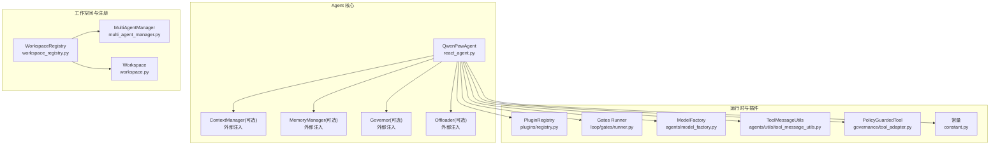
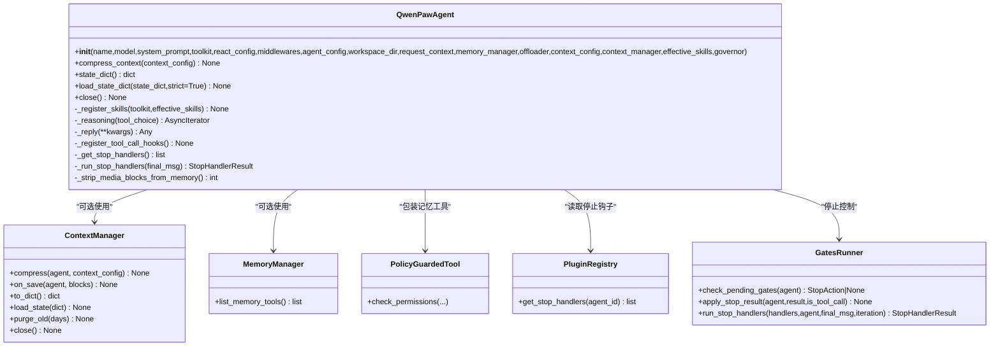
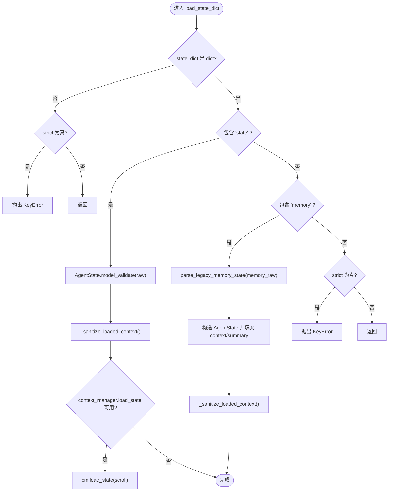
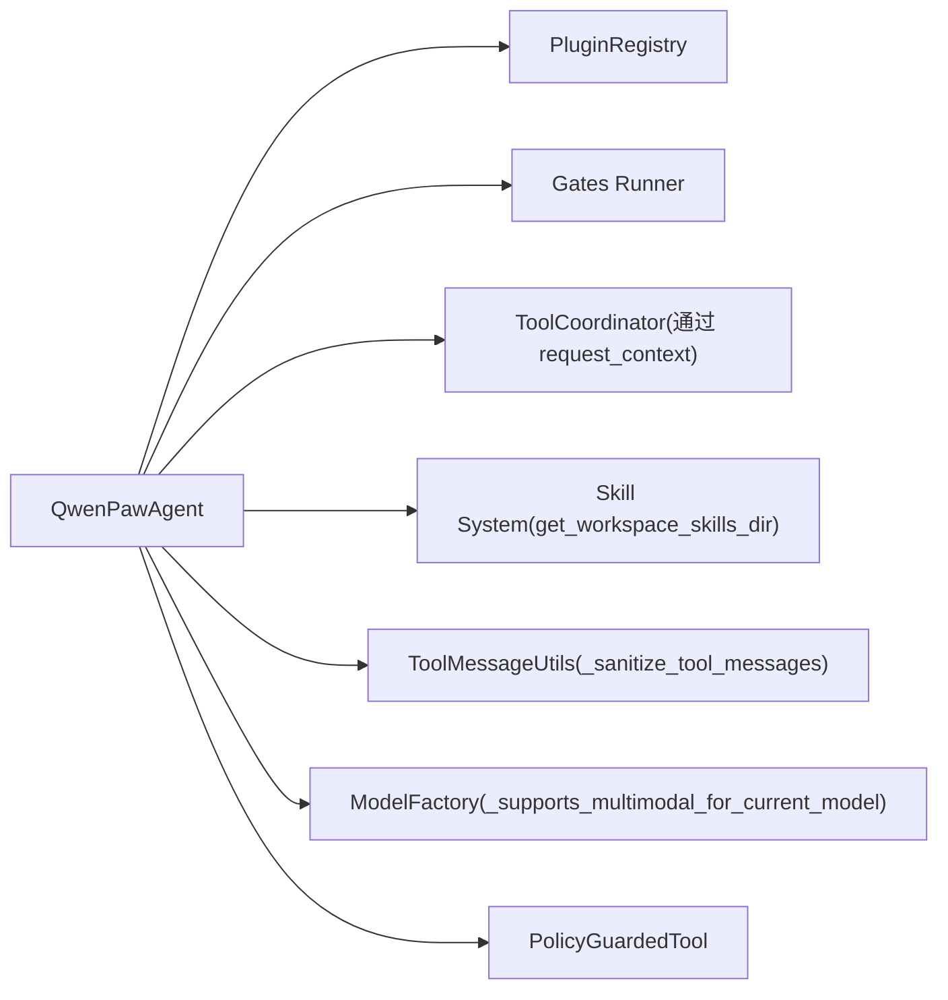

# Agent 生命周期管理

<cite>
**本文引用的文件**   
- [react_agent.py](file://src/qwenpaw/agents/react_agent.py)
- [workspace_registry.py](file://src/qwenpaw/app/workspace_registry.py)
- [multi_agent_manager.py](file://src/qwenpaw/app/multi_agent_manager.py)
- [workspace.py](file://src/qwenpaw/app/workspace.py)
- [skill_system/__init__.py](file://src/qwenpaw/agents/skill_system/__init__.py)
- [tool_message_utils.py](file://src/qwenpaw/agents/utils/tool_message_utils.py)
- [model_factory.py](file://src/qwenpaw/agents/model_factory.py)
- [governance/tool_adapter.py](file://src/qwenpaw/governance/tool_adapter.py)
- [loop/gates/runner.py](file://src/qwenpaw/loop/gates/runner.py)
- [plugins/registry.py](file://src/qwenpaw/plugins/registry.py)
- [constant.py](file://src/qwenpaw/constant.py)
</cite>

## 目录
1. [简介](#简介)
2. [项目结构](#项目结构)
3. [核心组件](#核心组件)
4. [架构总览](#架构总览)
5. [详细组件分析](#详细组件分析)
6. [依赖关系分析](#依赖关系分析)
7. [性能与资源特性](#性能与资源特性)
8. [故障排查指南](#故障排查指南)
9. [结论](#结论)
10. [附录](#附录)

## 简介
本文件聚焦 QwenPaw 中 Agent 的完整生命周期：创建、初始化、运行与销毁。重点覆盖以下实现细节：
- 状态序列化与恢复：state_dict 与 load_state_dict 的双格式兼容（2.0 与 1.x 遗留）
- 上下文管理器集成：滚动策略压缩、历史保留清理、关闭释放
- 记忆工具注册：基于 memory_manager 的动态工具注入与权限守卫
- 工作空间注册表中的 Agent 管理：WorkspaceRegistry 对 Workspace 的引导式创建
- 与其他组件的关系：工作空间管理、插件系统、运行时环境、工具协调器与停止钩子

## 项目结构
围绕 Agent 生命周期的关键代码分布在 agents、app、loop、plugins 等模块中。下图给出与生命周期相关的高层结构映射。



图表来源
- [react_agent.py:47-143](file://src/qwenpaw/agents/react_agent.py#L47-L143)
- [workspace_registry.py:24-46](file://src/qwenpaw/app/workspace_registry.py#L24-L46)
- [multi_agent_manager.py](file://src/qwenpaw/app/multi_agent_manager.py)
- [workspace.py](file://src/qwenpaw/app/workspace.py)
- [plugins/registry.py](file://src/qwenpaw/plugins/registry.py)
- [loop/gates/runner.py](file://src/qwenpaw/loop/gates/runner.py)
- [model_factory.py](file://src/qwenpaw/agents/model_factory.py)
- [tool_message_utils.py](file://src/qwenpaw/agents/utils/tool_message_utils.py)
- [governance/tool_adapter.py](file://src/qwenpaw/governance/tool_adapter.py)
- [constant.py](file://src/qwenpaw/constant.py)

章节来源
- [react_agent.py:47-143](file://src/qwenpaw/agents/react_agent.py#L47-L143)
- [workspace_registry.py:24-46](file://src/qwenpaw/app/workspace_registry.py#L24-L46)

## 核心组件
- QwenPawAgent：扩展自 Agent，负责工具、技能、记忆、上下文压缩、媒体块处理、停止钩子、工具超时等。
- ContextManager（可选）：接管上下文压缩与持久化，支持 to_dict/load_state/purge_old/close。
- MemoryManager（可选）：提供记忆工具列表并动态注册到 Toolkit。
- Governor（可选）：可被 close 时 stop。
- Offloader（可选）：在 close 时清理过期 tool-result 文件。
- WorkspaceRegistry：继承 MultiAgentManager，重写 _create_workspace，为每个 Workspace 执行 bootstrap_plugins 和 set_app_services。

章节来源
- [react_agent.py:47-143](file://src/qwenpaw/agents/react_agent.py#L47-L143)
- [workspace_registry.py:24-46](file://src/qwenpaw/app/workspace_registry.py#L24-L46)

## 架构总览
下图展示 Agent 从创建到销毁的关键流程，以及各组件交互。

```mermaid
sequenceDiagram
participant Client as "调用方"
participant Registry as "WorkspaceRegistry"
participant Manager as "MultiAgentManager"
participant WS as "Workspace"
participant Agent as "QwenPawAgent"
participant CM as "ContextManager(可选)"
participant MM as "MemoryManager(可选)"
participant Gov as "Governor(可选)"
participant Off as "Offloader(可选)"
participant Plugin as "PluginRegistry"
participant Gates as "Gates Runner"
Client->>Registry : 创建/获取工作区
Registry->>Manager : 委托创建 Workspace
Manager-->>WS : 实例化 Workspace
Registry->>WS : bootstrap_plugins(...)
Registry->>WS : set_app_services(...)
WS->>Agent : 构造 QwenPawAgent(...)
Agent->>MM : list_memory_tools() 并注册
Agent->>CM : 若存在则设置上下文策略
Agent->>Plugin : 注册停止钩子(通过 registry)
Note over Agent,Plugin : 每次推理前检查 pending gates
Client->>Agent : state_dict()
Agent-->>Client : {"state" : ..., "scroll" : ...}
Client->>Agent : load_state_dict(state_dict)
Agent->>Agent : 解析 2.0 或迁移 1.x
Agent->>CM : load_state(scroll) 若存在
loop 运行循环
Client->>Agent : reply()/reasoning()
Agent->>Gates : check_pending_gates()
alt 需要继续
Agent->>Agent : 追加 continuation 消息
else 正常结束
Agent-->>Client : 最终消息
end
end
Client->>Agent : close()
Agent->>Gov : stop()
Agent->>CM : purge_old(history_retention_days)
Agent->>CM : close()
Agent->>Off : cleanup_expired(offload_retention_days)
```

图表来源
- [workspace_registry.py:37-46](file://src/qwenpaw/app/workspace_registry.py#L37-L46)
- [react_agent.py:59-143](file://src/qwenpaw/agents/react_agent.py#L59-L143)
- [react_agent.py:193-266](file://src/qwenpaw/agents/react_agent.py#L193-L266)
- [react_agent.py:288-333](file://src/qwenpaw/agents/react_agent.py#L288-L333)
- [react_agent.py:411-551](file://src/qwenpaw/agents/react_agent.py#L411-L551)
- [plugins/registry.py](file://src/qwenpaw/plugins/registry.py)
- [loop/gates/runner.py](file://src/qwenpaw/loop/gates/runner.py)

## 详细组件分析

### QwenPawAgent 类图


图表来源
- [react_agent.py:47-143](file://src/qwenpaw/agents/react_agent.py#L47-L143)
- [react_agent.py:145-189](file://src/qwenpaw/agents/react_agent.py#L145-L189)
- [react_agent.py:193-266](file://src/qwenpaw/agents/react_agent.py#L193-L266)
- [react_agent.py:288-333](file://src/qwenpaw/agents/react_agent.py#L288-L333)
- [react_agent.py:335-364](file://src/qwenpaw/agents/react_agent.py#L335-L364)
- [react_agent.py:411-551](file://src/qwenpaw/agents/react_agent.py#L411-L551)
- [react_agent.py:653-705](file://src/qwenpaw/agents/react_agent.py#L653-L705)
- [react_agent.py:711-742](file://src/qwenpaw/agents/react_agent.py#L711-L742)
- [governance/tool_adapter.py](file://src/qwenpaw/governance/tool_adapter.py)
- [plugins/registry.py](file://src/qwenpaw/plugins/registry.py)
- [loop/gates/runner.py](file://src/qwenpaw/loop/gates/runner.py)

#### 创建与初始化
- 构造函数接收 model、toolkit、middlewares、agent_config、memory_manager、offloader、context_manager、effective_skills、governor 等依赖，不内部构建这些对象，遵循“依赖注入”原则。
- 将 memory_manager.list_memory_tools() 返回的工具以 PolicyGuardedTool 形式注册到 toolkit 的基本组，便于统一权限治理。
- 若传入 context_manager，则后续 compress_context/_save_to_context 会委派给该管理器；否则回退到 AgentScope 原生压缩路径。
- 通过 _register_skills 将 effective_skills 对应的目录信息登记到 toolkit._qp_skills，供下游斜杠命令消费。
- 通过 _register_tool_call_hooks 向 ToolCoordinator 注册默认超时配置，并从 agent_config.tools.builtin_tools 读取 per-tool 超时覆盖。

章节来源
- [react_agent.py:59-143](file://src/qwenpaw/agents/react_agent.py#L59-L143)
- [react_agent.py:335-364](file://src/qwenpaw/agents/react_agent.py#L335-L364)
- [react_agent.py:653-705](file://src/qwenpaw/agents/react_agent.py#L653-L705)

#### 运行与推理
- _reasoning 在每个迭代中：
  - 先检查 pending gates，若有停止动作则直接输出提示并返回。
  - 根据模型能力缓存与多模态支持情况，决定是否主动剥离媒体块或启用请求时格式化剥离。
  - 捕获异常，若判定为媒体相关错误，则学习“拒绝媒体”的能力标志，剥离后重试一次。
  - 每次迭代末尾运行停止钩子，若结果为“中断并继续”，则在上下文中追加 continuation 消息，外层循环继续。
- _reply 在回复前注入后台工具提示（pending hints），保证上下文一致性。

章节来源
- [react_agent.py:411-551](file://src/qwenpaw/agents/react_agent.py#L411-L551)
- [react_agent.py:647-651](file://src/qwenpaw/agents/react_agent.py#L647-L651)
- [model_factory.py](file://src/qwenpaw/agents/model_factory.py)
- [loop/gates/runner.py](file://src/qwenpaw/loop/gates/runner.py)

#### 状态持久化与恢复
- state_dict：
  - 优先序列化 self.state（AgentState）为 JSON-safe 字典。
  - 若存在 context_manager 且支持 to_dict，则额外保存 scroll 元数据，用于恢复去重与驱逐索引，避免重复写入 history.db。
- load_state_dict：
  - 支持 2.0 格式：{"state": ...}，校验并赋值 self.state，随后进行加载后上下文清洗（去除孤儿 tool_result）。
  - 兼容 1.x 遗留格式：{"memory": {...}}，通过 parse_legacy_memory_state 转换为 messages 与 summary，再填充至 AgentState。
  - 若存在 context_manager 且提供了 load_state，则恢复 scroll 状态。



图表来源
- [react_agent.py:193-266](file://src/qwenpaw/agents/react_agent.py#L193-L266)
- [tool_message_utils.py](file://src/qwenpaw/agents/utils/tool_message_utils.py)

章节来源
- [react_agent.py:193-266](file://src/qwenpaw/agents/react_agent.py#L193-L266)
- [react_agent.py:268-286](file://src/qwenpaw/agents/react_agent.py#L268-L286)

#### 资源清理与销毁
- close 方法按顺序：
  - 停止 governor（若存在）。
  - 若 context_manager 存在：
    - 应用历史保留窗口（purge_old），依据 light_context_config.scroll_config.history_retention_days。
    - 关闭上下文管理器（close），释放数据库连接及 WAL/SHM 文件句柄。
  - 若 offloader 存在：
    - 清理过期 tool-result 文件，依据 light_context_config.tool_result_pruning_config.offload_retention_days。

章节来源
- [react_agent.py:288-333](file://src/qwenpaw/agents/react_agent.py#L288-L333)

#### 工作空间注册表中的 Agent 管理
- WorkspaceRegistry 继承 MultiAgentManager，重写 _create_workspace：
  - 创建 Workspace 实例。
  - 若提供 bootstrap_plugins_kwargs，则调用 workspace.bootstrap_plugins(...)。
  - 若提供 app_services，则调用 workspace.set_app_services(...)。
- 其他行为（懒加载、热重载、并行启动）由父类 MultiAgentManager 提供。

章节来源
- [workspace_registry.py:24-46](file://src/qwenpaw/app/workspace_registry.py#L24-L46)
- [multi_agent_manager.py](file://src/qwenpaw/app/multi_agent_manager.py)

#### 技能系统与工具注册
- _register_skills：
  - 使用 get_workspace_skills_dir 定位工作区 skills 目录。
  - 遍历 effective_skills，若对应目录存在，则将目录路径登记到 toolkit._qp_skills。
- 记忆工具注册：
  - 若 memory_manager 非空，调用 list_memory_tools()，并以 PolicyGuardedTool 包装后加入 toolkit 基本组。

章节来源
- [react_agent.py:335-364](file://src/qwenpaw/agents/react_agent.py#L335-L364)
- [skill_system/__init__.py](file://src/qwenpaw/agents/skill_system/__init__.py)
- [governance/tool_adapter.py](file://src/qwenpaw/governance/tool_adapter.py)

#### 停止钩子与插件系统
- _get_stop_handlers：
  - 通过 PluginRegistry.get_stop_handlers(agent_id=...) 获取当前 Agent 的停止钩子。
- _run_stop_handlers：
  - 调用 run_stop_handlers 执行所有钩子，返回 StopHandlerResult。
  - 若 action 为“中断并继续”，则在上下文中追加 continuation 消息（带 LOOP_CONTINUATION_MESSAGE_TAG），外层循环继续。

章节来源
- [react_agent.py:711-742](file://src/qwenpaw/agents/react_agent.py#L711-L742)
- [plugins/registry.py](file://src/qwenpaw/plugins/registry.py)
- [loop/gates/runner.py](file://src/qwenpaw/loop/gates/runner.py)
- [constant.py](file://src/qwenpaw/constant.py)

## 依赖关系分析
- QwenPawAgent 对外部依赖高度解耦：model、toolkit、middlewares、memory_manager、offloader、context_manager、governor 均由上层注入。
- 与插件系统的耦合点在于停止钩子的发现与执行。
- 与运行时环境的耦合点在于 ToolCoordinator 的超时配置与背景提示注入。
- 与工作空间的耦合点在于技能目录的定位与注册。



图表来源
- [react_agent.py:411-551](file://src/qwenpaw/agents/react_agent.py#L411-L551)
- [react_agent.py:631-646](file://src/qwenpaw/agents/react_agent.py#L631-L646)
- [react_agent.py:335-364](file://src/qwenpaw/agents/react_agent.py#L335-L364)
- [tool_message_utils.py](file://src/qwenpaw/agents/utils/tool_message_utils.py)
- [model_factory.py](file://src/qwenpaw/agents/model_factory.py)
- [governance/tool_adapter.py](file://src/qwenpaw/governance/tool_adapter.py)

章节来源
- [react_agent.py:411-551](file://src/qwenpaw/agents/react_agent.py#L411-L551)
- [react_agent.py:631-646](file://src/qwenpaw/agents/react_agent.py#L631-L646)
- [react_agent.py:335-364](file://src/qwenpaw/agents/react_agent.py#L335-L364)

## 性能与资源特性
- 上下文压缩：
  - 若注入 context_manager，则由该管理器承担压缩与持久化职责，避免频繁 I/O。
  - 未注入时，仅在 enabled 时走 AgentScope 原生压缩路径。
- 媒体块处理：
  - 主动剥离或请求时格式化剥离，减少不必要的网络传输与模型拒答重试成本。
- 资源释放：
  - close 阶段集中清理历史保留、关闭上下文管理器、清理过期 tool-result，防止长驻进程的文件描述符泄漏。

[本节为通用指导，无需具体文件引用]

## 故障排查指南
- 状态迁移失败
  - 现象：load_state_dict 抛出 KeyError。
  - 排查：确认 state_dict 是否包含 "state" 或 "memory" 键；检查 AgentState 校验异常详情。
  - 参考：[react_agent.py:193-266](file://src/qwenpaw/agents/react_agent.py#L193-L266)
- 上下文损坏导致 400 错误
  - 现象：模型报 “tool 角色必须响应前面的 tool_calls”。
  - 原因：孤儿 tool_result 未被清理。
  - 解决：确保 compress_context 与 _sanitize_loaded_context 均被调用；必要时手动触发压缩。
  - 参考：[react_agent.py:145-183](file://src/qwenpaw/agents/react_agent.py#L145-L183)、[react_agent.py:268-286](file://src/qwenpaw/agents/react_agent.py#L268-L286)
- 资源泄漏（文件描述符累积）
  - 现象：长时间运行的服务出现 FD 增长。
  - 原因：未调用 close 或未正确关闭 context_manager/offloader。
  - 解决：确保在会话结束后调用 agent.close()。
  - 参考：[react_agent.py:288-333](file://src/qwenpaw/agents/react_agent.py#L288-L333)
- 并发访问问题
  - 现象：多线程/协程下状态不一致。
  - 建议：避免跨任务共享同一 Agent 实例；使用独立的 request_context/session_id 隔离。
  - 参考：[react_agent.py:631-646](file://src/qwenpaw/agents/react_agent.py#L631-L646)

章节来源
- [react_agent.py:193-266](file://src/qwenpaw/agents/react_agent.py#L193-L266)
- [react_agent.py:145-183](file://src/qwenpaw/agents/react_agent.py#L145-L183)
- [react_agent.py:268-286](file://src/qwenpaw/agents/react_agent.py#L268-L286)
- [react_agent.py:288-333](file://src/qwenpaw/agents/react_agent.py#L288-L333)
- [react_agent.py:631-646](file://src/qwenpaw/agents/react_agent.py#L631-L646)

## 结论
QwenPaw 的 Agent 生命周期设计强调依赖注入、可扩展的上下文管理与健壮的状态迁移机制。通过 context_manager、memory_manager、governor、offloader 等可选组件的组合，Agent 能在不同场景下灵活伸缩。配合 WorkspaceRegistry 的工作空间引导式创建、插件系统的停止钩子与 Gates Runner 的控制流，整体实现了高内聚、低耦合的生命周期管理。

[本节为总结性内容，无需具体文件引用]

## 附录
- 配置选项与参数要点
  - 构造函数参数：name、model、system_prompt、toolkit、react_config、middlewares、agent_config、workspace_dir、request_context、memory_manager、offloader、context_config、context_manager、effective_skills、governor。
  - 上下文压缩开关：light_context_config.context_compact_config.enabled。
  - 历史保留天数：light_context_config.scroll_config.history_retention_days。
  - 工具结果保留天数：light_context_config.tool_result_pruning_config.offload_retention_days。
  - 工具超时：agent_config.tools.builtin_tools 中 per-tool timeout_seconds。
- 返回值说明
  - state_dict：JSON-safe 字典，包含 "state" 与可选 "scroll"。
  - load_state_dict：无返回值，但可能抛出 KeyError。
  - close：无返回值。
  - _reasoning：异步事件流，最终产出 Msg 或受停止钩子影响。

章节来源
- [react_agent.py:59-143](file://src/qwenpaw/agents/react_agent.py#L59-L143)
- [react_agent.py:145-183](file://src/qwenpaw/agents/react_agent.py#L145-L183)
- [react_agent.py:193-266](file://src/qwenpaw/agents/react_agent.py#L193-L266)
- [react_agent.py:288-333](file://src/qwenpaw/agents/react_agent.py#L288-L333)
- [react_agent.py:411-551](file://src/qwenpaw/agents/react_agent.py#L411-L551)