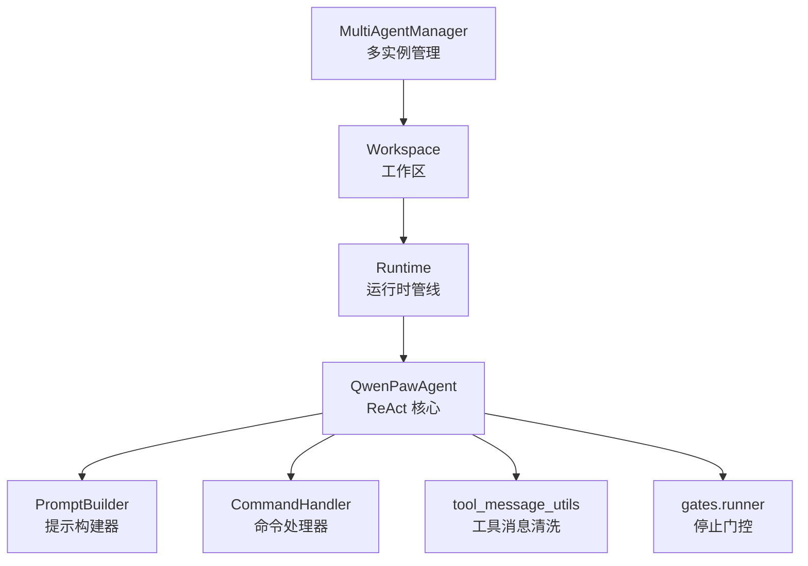
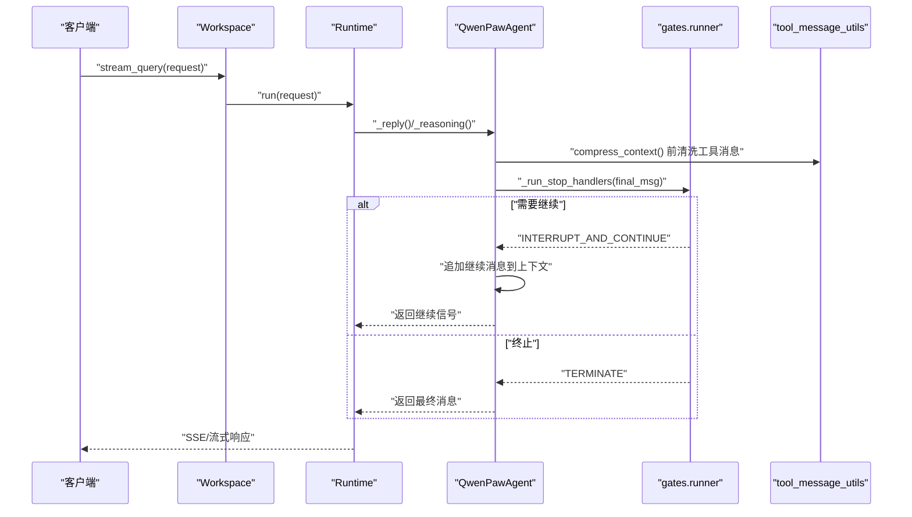
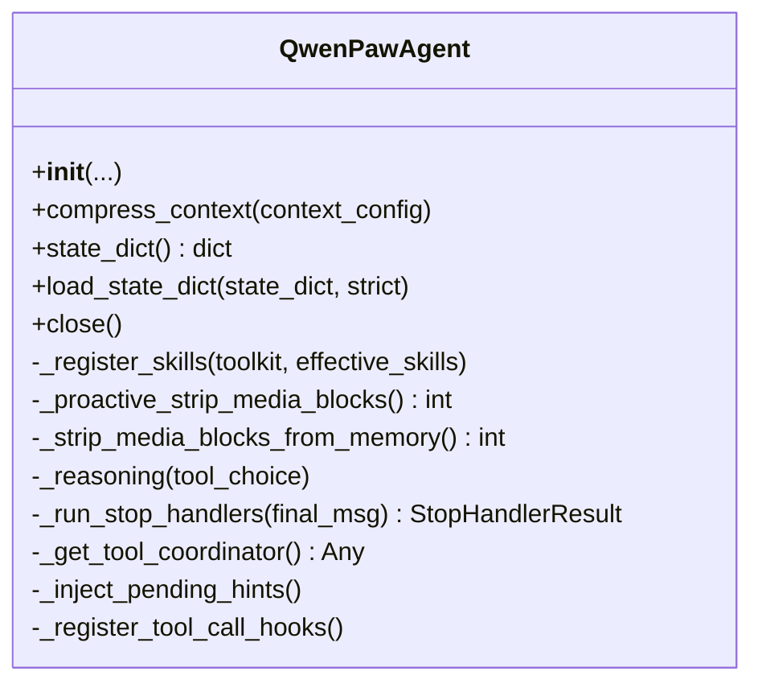
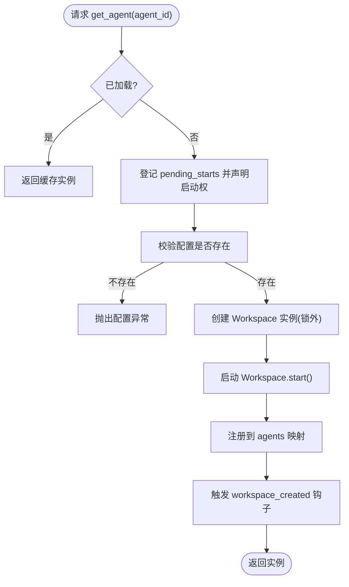
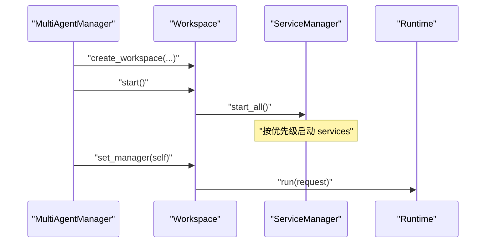
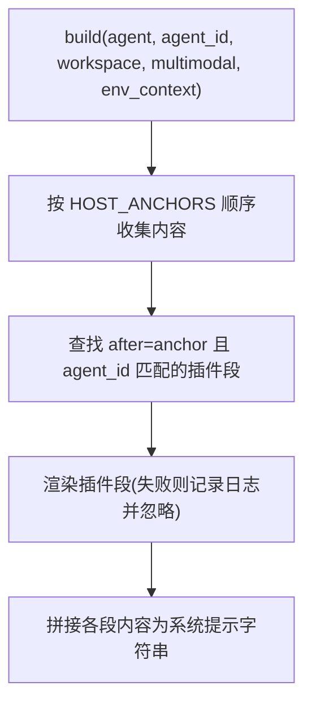
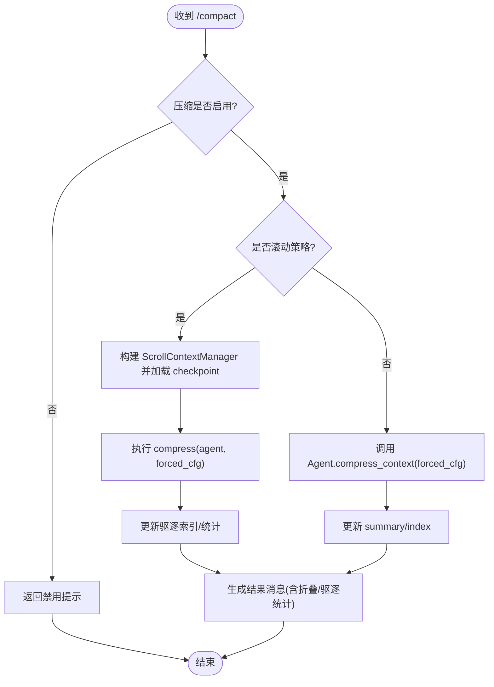
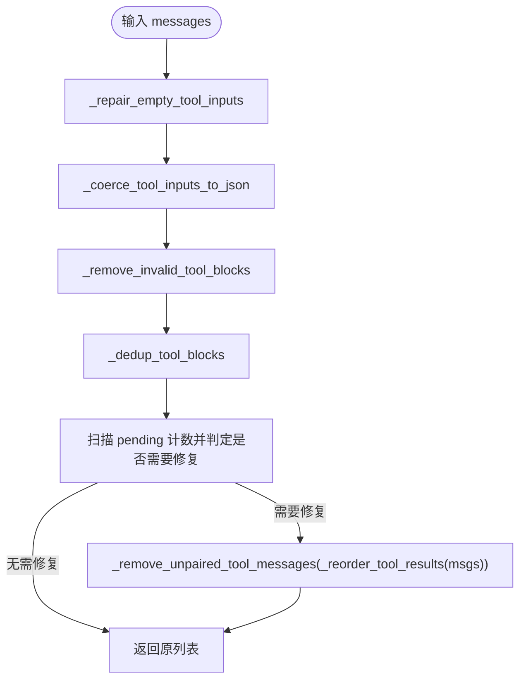
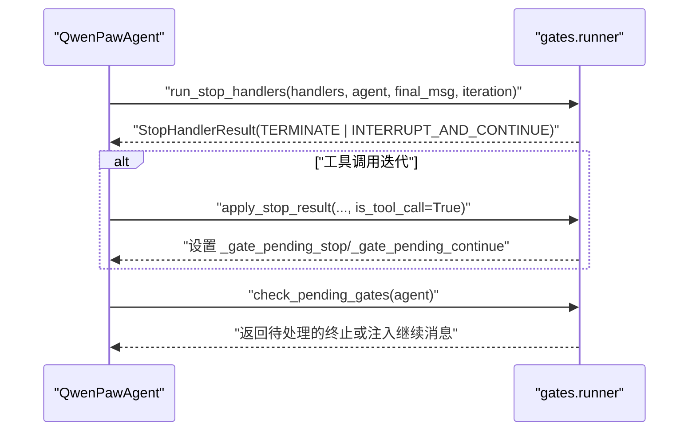
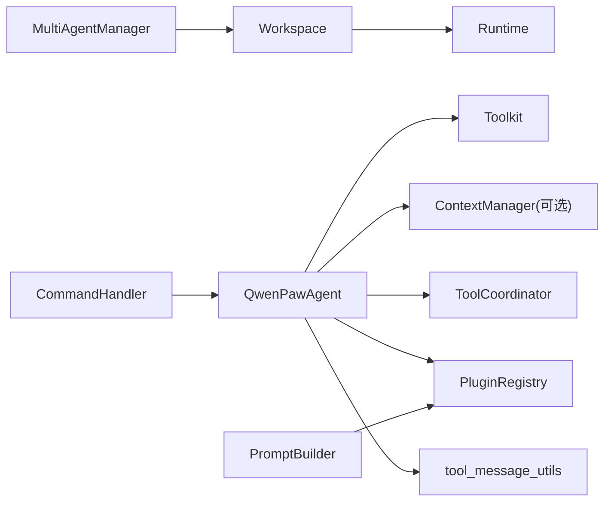

# Agent 系统

<cite>
**本文引用的文件**   
- [react_agent.py](file://src/qwenpaw/agents/react_agent.py)
- [multi_agent_manager.py](file://src/qwenpaw/app/multi_agent_manager.py)
- [workspace.py](file://src/qwenpaw/app/workspace/workspace.py)
- [prompt_builder.py](file://src/qwenpaw/agents/prompt_builder.py)
- [command_handler.py](file://src/qwenpaw/agents/command_handler.py)
- [tool_message_utils.py](file://src/qwenpaw/agents/utils/tool_message_utils.py)
- [runner.py](file://src/qwenpaw/loop/gates/runner.py)
</cite>

## 目录
1. [简介](#简介)
2. [项目结构](#项目结构)
3. [核心组件](#核心组件)
4. [架构总览](#架构总览)
5. [详细组件分析](#详细组件分析)
6. [依赖关系分析](#依赖关系分析)
7. [性能与可扩展性](#性能与可扩展性)
8. [故障排查指南](#故障排查指南)
9. [结论](#结论)
10. [附录：配置与接口速查](#附录配置与接口速查)

## 简介
本文件面向 QwenPaw 的 Agent 系统，聚焦以下目标：
- ReAct 模式的实现细节、调用链路与事件流
- Agent 生命周期管理（创建、启动、热重载、停止）
- 多 Agent 并行执行与隔离
- Agent 间通信机制（工具协调器、后台提示注入、会话级消息）
- 配置定制、提示构建器与命令处理器
- 常见问题定位与解决方案

文档以源码为依据，提供可追溯的“章节来源”和“图示来源”，并辅以可视化图表帮助理解。

## 项目结构
Agent 系统由多个层次组成：
- 工作区与工作空间：Workspace 封装独立运行环境与服务
- 多实例管理器：MultiAgentManager 负责懒加载、并发启动与热重载
- Agent 核心：QwenPawAgent 基于 ReAct 循环，集成工具、技能、记忆与上下文压缩
- 运行时管线：通过 Runtime 驱动请求处理
- 提示构建器：PromptBuilder 组装系统提示
- 命令处理器：CommandHandler 支持 /compact、/clear、/new 等对话命令
- 工具消息清洗：tool_message_utils 确保 tool_call/tool_result 配对与顺序正确
- 停止门控：gates.runner 统一执行 stop handlers 并控制继续/终止

**图示来源** 
- [multi_agent_manager.py:23-158](file://src/qwenpaw/app/multi_agent_manager.py#L23-L158)
- [workspace.py:39-138](file://src/qwenpaw/app/workspace/workspace.py#L39-L138)
- [react_agent.py:47-143](file://src/qwenpaw/agents/react_agent.py#L47-L143)
- [prompt_builder.py:23-61](file://src/qwenpaw/agents/prompt_builder.py#L23-L61)
- [command_handler.py:108-170](file://src/qwenpaw/agents/command_handler.py#L108-L170)
- [tool_message_utils.py:503-543](file://src/qwenpaw/agents/utils/tool_message_utils.py#L503-L543)
- [runner.py:62-132](file://src/qwenpaw/loop/gates/runner.py#L62-L132)

**章节来源**
- [multi_agent_manager.py:23-158](file://src/qwenpaw/app/multi_agent_manager.py#L23-L158)
- [workspace.py:39-138](file://src/qwenpaw/app/workspace/workspace.py#L39-L138)

## 核心组件
- QwenPawAgent：扩展 AgentScope 的 Agent，内置工具注册、技能发现、记忆工具注入、上下文压缩策略路由、媒体块主动剥离与被动重试、停止钩子与继续逻辑。
- MultiAgentManager：多工作区懒加载、并发启动、零停机热重载、清理任务跟踪。
- Workspace：单 Agent 工作区，聚合服务（内存、驱动、聊天、频道、定时任务），并通过 Runtime 处理请求。
- PromptBuilder：按锚点顺序拼装系统提示，支持插件贡献片段。
- CommandHandler：对话命令解析与执行（/compact、/clear、/new 等）。
- tool_message_utils：工具消息校验、重排、去重、输入修复与 JSON 强制转换。
- gates.runner：停止处理器调度、作用域过滤、延迟应用与继续注入。

**章节来源**
- [react_agent.py:47-143](file://src/qwenpaw/agents/react_agent.py#L47-L143)
- [multi_agent_manager.py:23-158](file://src/qwenpaw/app/multi_agent_manager.py#L23-L158)
- [workspace.py:39-138](file://src/qwenpaw/app/workspace/workspace.py#L39-L138)
- [prompt_builder.py:23-61](file://src/qwenpaw/agents/prompt_builder.py#L23-L61)
- [command_handler.py:108-170](file://src/qwenpaw/agents/command_handler.py#L108-L170)
- [tool_message_utils.py:503-543](file://src/qwenpaw/agents/utils/tool_message_utils.py#L503-L543)
- [runner.py:62-132](file://src/qwenpaw/loop/gates/runner.py#L62-L132)

## 架构总览
下图展示从请求进入工作区到 Agent 推理、工具调用、停止门控与继续的全链路。

**图示来源**
- [workspace.py:255-267](file://src/qwenpaw/app/workspace/workspace.py#L255-L267)
- [react_agent.py:411-551](file://src/qwenpaw/agents/react_agent.py#L411-L551)
- [runner.py:62-132](file://src/qwenpaw/loop/gates/runner.py#L62-L132)
- [tool_message_utils.py:503-543](file://src/qwenpaw/agents/utils/tool_message_utils.py#L503-L543)

## 详细组件分析

### QwenPawAgent（ReAct 核心）
职责与特性：
- 构造期：接收 model、system_prompt、toolkit、middlewares、memory_manager 等外部依赖；注册技能元数据；将 memory tools 包装为受策略守卫的工具；绕过 AgentScope 权限引擎，使用自身 PolicyGuardedTool。
- 上下文压缩：优先走 context_manager（如 scroll 策略），否则回退到 AgentScope 原生压缩；每次压缩前对工具消息进行清洗，避免孤立 tool_result 导致 API 报错。
- 媒体块处理：根据模型能力缓存与错误信息判断是否拒绝多媒体；在 _reasoning 前后主动剥离或启用格式化器的媒体剥离开关；失败时被动重试。
- 停止门控：每轮推理后执行 stop handlers；若结果为“中断并继续”，则向上下文追加带标记的继续消息，外层循环继续；若为终止，则返回最终消息。
- 工具协调器：注册默认超时、读取 agent 级别工具超时配置、注入后台工具提示。

关键方法路径参考：
- 初始化与依赖注入：[react_agent.py:59-143](file://src/qwenpaw/agents/react_agent.py#L59-L143)
- 上下文压缩与保存：[react_agent.py:145-190](file://src/qwenpaw/agents/react_agent.py#L145-L190)
- 状态持久化与迁移：[react_agent.py:193-267](file://src/qwenpaw/agents/react_agent.py#L193-L267)
- 关闭与资源回收：[react_agent.py:288-334](file://src/qwenpaw/agents/react_agent.py#L288-L334)
- 技能注册：[react_agent.py:335-365](file://src/qwenpaw/agents/react_agent.py#L335-L365)
- 媒体块检测与剥离：[react_agent.py:376-409](file://src/qwenpaw/agents/react_agent.py#L376-L409), [react_agent.py:745-809](file://src/qwenpaw/agents/react_agent.py#L745-L809)
- ReAct 推理主流程与继续/终止：[react_agent.py:411-551](file://src/qwenpaw/agents/react_agent.py#L411-L551)
- 工具协调器与超时：[react_agent.py:631-706](file://src/qwenpaw/agents/react_agent.py#L631-L706)
- 停止钩子获取与执行：[react_agent.py:711-743](file://src/qwenpaw/agents/react_agent.py#L711-L743)

**图示来源**
- [react_agent.py:47-143](file://src/qwenpaw/agents/react_agent.py#L47-L143)
- [react_agent.py:145-190](file://src/qwenpaw/agents/react_agent.py#L145-L190)
- [react_agent.py:193-267](file://src/qwenpaw/agents/react_agent.py#L193-L267)
- [react_agent.py:288-334](file://src/qwenpaw/agents/react_agent.py#L288-L334)
- [react_agent.py:335-365](file://src/qwenpaw/agents/react_agent.py#L335-L365)
- [react_agent.py:411-551](file://src/qwenpaw/agents/react_agent.py#L411-L551)
- [react_agent.py:631-706](file://src/qwenpaw/agents/react_agent.py#L631-L706)
- [react_agent.py:711-743](file://src/qwenpaw/agents/react_agent.py#L711-L743)

**章节来源**
- [react_agent.py:47-143](file://src/qwenpaw/agents/react_agent.py#L47-L143)
- [react_agent.py:145-190](file://src/qwenpaw/agents/react_agent.py#L145-L190)
- [react_agent.py:193-267](file://src/qwenpaw/agents/react_agent.py#L193-L267)
- [react_agent.py:288-334](file://src/qwenpaw/agents/react_agent.py#L288-L334)
- [react_agent.py:335-365](file://src/qwenpaw/agents/react_agent.py#L335-L365)
- [react_agent.py:411-551](file://src/qwenpaw/agents/react_agent.py#L411-L551)
- [react_agent.py:631-706](file://src/qwenpaw/agents/react_agent.py#L631-L706)
- [react_agent.py:711-743](file://src/qwenpaw/agents/react_agent.py#L711-L743)

### 多 Agent 并行执行与管理
- 懒加载与去重：首次 get_agent 时检查配置并创建 Workspace，其他并发调用者等待同一 Event。
- 并发启动：锁仅用于字典操作，慢初始化在锁外执行，允许多个 Agent 并行启动。
- 零停机热重载：先创建并启动新实例，原子替换旧实例，再异步优雅停止旧实例（有活跃任务则延时清理）。
- 批量启动：start_all_configured_agents 并发启动所有 enabled 的 Agent。

**图示来源**
- [multi_agent_manager.py:54-158](file://src/qwenpaw/app/multi_agent_manager.py#L54-L158)
- [multi_agent_manager.py:321-448](file://src/qwenpaw/app/multi_agent_manager.py#L321-L448)
- [multi_agent_manager.py:540-601](file://src/qwenpaw/app/multi_agent_manager.py#L540-L601)

**章节来源**
- [multi_agent_manager.py:54-158](file://src/qwenpaw/app/multi_agent_manager.py#L54-L158)
- [multi_agent_manager.py:321-448](file://src/qwenpaw/app/multi_agent_manager.py#L321-L448)
- [multi_agent_manager.py:540-601](file://src/qwenpaw/app/multi_agent_manager.py#L540-L601)

### 工作区与运行时管线
- Workspace 聚合服务：内存、驱动、聊天、频道、定时任务、本地工作区、会话等，通过 ServiceManager 声明式注册与启动。
- 请求处理：stream_query 委托给 Runtime.run，完成模式选择、提示构建、工具调用、记忆归档等。
- 热重载复用：set_reusable_components 允许在新实例中复用旧实例的可重用服务（如 memory_manager、chat_manager）。

**图示来源**
- [workspace.py:39-138](file://src/qwenpaw/app/workspace/workspace.py#L39-L138)
- [workspace.py:255-267](file://src/qwenpaw/app/workspace/workspace.py#L255-L267)
- [workspace.py:459-500](file://src/qwenpaw/app/workspace/workspace.py#L459-L500)
- [workspace.py:427-458](file://src/qwenpaw/app/workspace/workspace.py#L427-L458)

**章节来源**
- [workspace.py:39-138](file://src/qwenpaw/app/workspace/workspace.py#L39-L138)
- [workspace.py:255-267](file://src/qwenpaw/app/workspace/workspace.py#L255-L267)
- [workspace.py:459-500](file://src/qwenpaw/app/workspace/workspace.py#L459-L500)
- [workspace.py:427-458](file://src/qwenpaw/app/workspace/workspace.py#L427-L458)

### 提示构建器（PromptBuilder）
- 主机锚点顺序：workspace、multimodal、env_context。
- 插件贡献：在指定锚点后插入插件提供的文本段。
- 安全：插件文本直接拼接，仅限可信插件。

**图示来源**
- [prompt_builder.py:23-61](file://src/qwenpaw/agents/prompt_builder.py#L23-L61)
- [prompt_builder.py:63-85](file://src/qwenpaw/agents/prompt_builder.py#L63-L85)

**章节来源**
- [prompt_builder.py:23-61](file://src/qwenpaw/agents/prompt_builder.py#L23-L61)
- [prompt_builder.py:63-85](file://src/qwenpaw/agents/prompt_builder.py#L63-L85)

### 命令处理器（CommandHandler）
- 支持的对话命令：/compact、/clear、/new、/history、/compact_str、/summarize_status、/message、/dump_history、/load_history、/proactive、/plan、/system_prompt、/dream、/memorize。
- /compact：支持滚动策略与原生策略；手动触发跳过自动阈值；可输出压缩摘要或驱逐索引；必要时触发 ReMe 总结任务。
- /new：清空当前上下文并启动后台总结任务。
- /clear：立即清空上下文并可持久化历史。
- 独立模式：可在无 Agent 实例下通过临时 Agent 或 ScrollContextManager 执行压缩。

**图示来源**
- [command_handler.py:281-398](file://src/qwenpaw/agents/command_handler.py#L281-L398)
- [command_handler.py:419-450](file://src/qwenpaw/agents/command_handler.py#L419-L450)
- [command_handler.py:451-502](file://src/qwenpaw/agents/command_handler.py#L451-L502)

**章节来源**
- [command_handler.py:108-170](file://src/qwenpaw/agents/command_handler.py#L108-L170)
- [command_handler.py:281-398](file://src/qwenpaw/agents/command_handler.py#L281-L398)
- [command_handler.py:419-450](file://src/qwenpaw/agents/command_handler.py#L419-L450)
- [command_handler.py:451-502](file://src/qwenpaw/agents/command_handler.py#L451-L502)

### 工具消息清洗（tool_message_utils）
- 目标：保证 tool_call/tool_result 配对与顺序正确，修复空 input 但存在 raw_input 的情况，强制 input 为合法 JSON 字符串，移除无效/重复块。
- 流程：修复 → 强制 JSON → 移除无效 → 去重 → 配对/顺序修复。

**图示来源**
- [tool_message_utils.py:503-543](file://src/qwenpaw/agents/utils/tool_message_utils.py#L503-L543)
- [tool_message_utils.py:303-389](file://src/qwenpaw/agents/utils/tool_message_utils.py#L303-L389)
- [tool_message_utils.py:393-500](file://src/qwenpaw/agents/utils/tool_message_utils.py#L393-L500)
- [tool_message_utils.py:238-301](file://src/qwenpaw/agents/utils/tool_message_utils.py#L238-L301)
- [tool_message_utils.py:191-236](file://src/qwenpaw/agents/utils/tool_message_utils.py#L191-L236)
- [tool_message_utils.py:81-133](file://src/qwenpaw/agents/utils/tool_message_utils.py#L81-L133)
- [tool_message_utils.py:135-188](file://src/qwenpaw/agents/utils/tool_message_utils.py#L135-L188)

**章节来源**
- [tool_message_utils.py:503-543](file://src/qwenpaw/agents/utils/tool_message_utils.py#L503-L543)
- [tool_message_utils.py:303-389](file://src/qwenpaw/agents/utils/tool_message_utils.py#L303-L389)
- [tool_message_utils.py:393-500](file://src/qwenpaw/agents/utils/tool_message_utils.py#L393-L500)
- [tool_message_utils.py:238-301](file://src/qwenpaw/agents/utils/tool_message_utils.py#L238-L301)
- [tool_message_utils.py:191-236](file://src/qwenpaw/agents/utils/tool_message_utils.py#L191-L236)
- [tool_message_utils.py:81-133](file://src/qwenpaw/agents/utils/tool_message_utils.py#L81-L133)
- [tool_message_utils.py:135-188](file://src/qwenpaw/agents/utils/tool_message_utils.py#L135-L188)

### 停止门控与继续机制（gates.runner）
- 作用域过滤：仅执行当前活跃作用域的处理器，“default”作用域在无活跃作用域时生效。
- 执行顺序：按优先级排序，首个返回明确动作的处理器决定行为。
- 延迟应用：在工具调用迭代中将终止/继续动作挂起，下一轮推理开始时消费并注入继续消息。

**图示来源**
- [runner.py:62-132](file://src/qwenpaw/loop/gates/runner.py#L62-L132)
- [runner.py:135-210](file://src/qwenpaw/loop/gates/runner.py#L135-L210)

**章节来源**
- [runner.py:62-132](file://src/qwenpaw/loop/gates/runner.py#L62-L132)
- [runner.py:135-210](file://src/qwenpaw/loop/gates/runner.py#L135-L210)

## 依赖关系分析
- QwenPawAgent 依赖：
  - 模型与格式化器：通过外部注入，具备媒体块处理能力
  - Toolkit：动态注册技能与记忆工具
  - Context Manager：可选的滚动策略管理器
  - ToolCoordinator：工具超时与后台提示注入
  - PluginRegistry：停止钩子注册
- MultiAgentManager 依赖：
  - Workspace：懒加载与生命周期管理
  - PluginRegistry：workspace_created 钩子
- Workspace 依赖：
  - ServiceManager：声明式服务注册与启动
  - Runtime：请求处理管线
- PromptBuilder 依赖：
  - PluginRegistry：提示片段贡献
- CommandHandler 依赖：
  - AgentScope Agent（临时）、ScrollContextManager（滚动策略）、Offloader（持久化）
- tool_message_utils 被 QwenPawAgent 在压缩与加载阶段调用，保障消息合法性

**图示来源**
- [react_agent.py:47-143](file://src/qwenpaw/agents/react_agent.py#L47-L143)
- [multi_agent_manager.py:23-158](file://src/qwenpaw/app/multi_agent_manager.py#L23-L158)
- [workspace.py:39-138](file://src/qwenpaw/app/workspace/workspace.py#L39-L138)
- [prompt_builder.py:23-61](file://src/qwenpaw/agents/prompt_builder.py#L23-L61)
- [command_handler.py:108-170](file://src/qwenpaw/agents/command_handler.py#L108-L170)
- [tool_message_utils.py:503-543](file://src/qwenpaw/agents/utils/tool_message_utils.py#L503-L543)

**章节来源**
- [react_agent.py:47-143](file://src/qwenpaw/agents/react_agent.py#L47-L143)
- [multi_agent_manager.py:23-158](file://src/qwenpaw/app/multi_agent_manager.py#L23-L158)
- [workspace.py:39-138](file://src/qwenpaw/app/workspace/workspace.py#L39-L138)
- [prompt_builder.py:23-61](file://src/qwenpaw/agents/prompt_builder.py#L23-L61)
- [command_handler.py:108-170](file://src/qwenpaw/agents/command_handler.py#L108-L170)
- [tool_message_utils.py:503-543](file://src/qwenpaw/agents/utils/tool_message_utils.py#L503-L543)

## 性能与可扩展性
- 并发启动：MultiAgentManager 在锁外执行慢初始化，提升多 Agent 启动吞吐。
- 零停机热重载：原子替换实例，旧实例后台优雅停止，降低服务抖动。
- 上下文压缩：滚动策略与原生策略并存，按需压缩，减少长对话开销。
- 工具消息清洗：前置清洗避免 API 错误导致的重试与浪费。
- 媒体块处理：主动剥离与被动重试结合，提高成功率并避免误判。

[本节为通用指导，不直接分析具体文件]

## 故障排查指南
- 工具消息 400 错误（缺少 tool_call 或顺序不对）：
  - 现象：API 报 “Messages with role 'tool' must be a response to a preceding message with 'tool_calls'”
  - 原因：孤立 tool_result 或 tool_call 未配对
  - 解决：确认 compress_context 与 load_state_dict 均调用了工具消息清洗；必要时手动触发 /compact
  - 参考：[react_agent.py:145-190](file://src/qwenpaw/agents/react_agent.py#L145-L190), [react_agent.py:193-267](file://src/qwenpaw/agents/react_agent.py#L193-L267), [tool_message_utils.py:503-543](file://src/qwenpaw/agents/utils/tool_message_utils.py#L503-L543)
- 媒体块被拒绝：
  - 现象：包含 image/audio/video/file 的请求失败
  - 原因：模型不支持或多模态被拒
  - 解决：启用媒体块剥离或格式化器开关；观察能力缓存 learn("rejects_media", True)
  - 参考：[react_agent.py:376-409](file://src/qwenpaw/agents/react_agent.py#L376-L409), [react_agent.py:411-551](file://src/qwenpaw/agents/react_agent.py#L411-L551)
- 停止门控导致无法退出：
  - 现象：Agent 一直继续工作
  - 原因：stop handler 返回 INTERRUPT_AND_CONTINUE
  - 解决：检查自定义 stop handler 逻辑与作用域配置
  - 参考：[runner.py:62-132](file://src/qwenpaw/loop/gates/runner.py#L62-L132), [runner.py:135-210](file://src/qwenpaw/loop/gates/runner.py#L135-L210)
- 热重载后旧实例未释放：
  - 现象：进程占用资源未释放
  - 原因：旧实例仍有活跃任务
  - 解决：等待后台清理任务完成或强制停止；关注 delayed cleanup 日志
  - 参考：[multi_agent_manager.py:204-300](file://src/qwenpaw/app/multi_agent_manager.py#L204-L300)

**章节来源**
- [react_agent.py:145-190](file://src/qwenpaw/agents/react_agent.py#L145-L190)
- [react_agent.py:193-267](file://src/qwenpaw/agents/react_agent.py#L193-L267)
- [react_agent.py:376-409](file://src/qwenpaw/agents/react_agent.py#L376-L409)
- [react_agent.py:411-551](file://src/qwenpaw/agents/react_agent.py#L411-L551)
- [tool_message_utils.py:503-543](file://src/qwenpaw/agents/utils/tool_message_utils.py#L503-L543)
- [runner.py:62-132](file://src/qwenpaw/loop/gates/runner.py#L62-L132)
- [runner.py:135-210](file://src/qwenpaw/loop/gates/runner.py#L135-L210)
- [multi_agent_manager.py:204-300](file://src/qwenpaw/app/multi_agent_manager.py#L204-L300)

## 结论
QwenPaw 的 Agent 系统围绕 ReAct 循环构建了高内聚、低耦合的组件体系：
- QwenPawAgent 作为推理核心，整合工具、技能、记忆与上下文策略，具备健壮的错误恢复与继续机制
- MultiAgentManager 提供高效的多实例管理与零停机热重载
- Workspace 与 Runtime 形成清晰的请求处理管线
- PromptBuilder 与 CommandHandler 增强可配置性与可观测性
- tool_message_utils 与 gates.runner 保障消息合法性与流程可控

该设计既便于初学者上手，也为高级用户提供充分的定制点与扩展面。

[本节为总结，不直接分析具体文件]

## 附录：配置与接口速查
- QwenPawAgent 构造参数（节选）
  - name: str
  - model: Any
  - system_prompt: str
  - toolkit: Toolkit
  - react_config: ReActConfig
  - middlewares: list
  - agent_config: AgentProfileConfig
  - workspace_dir: Path | None
  - request_context: Optional[dict[str, str]]
  - memory_manager: BaseMemoryManager | None
  - offloader: Any
  - context_config: Any
  - context_manager: Any
  - effective_skills: Optional[list[str]]
  - governor: Any
  - 参考：[react_agent.py:59-143](file://src/qwenpaw/agents/react_agent.py#L59-L143)

- 主要方法与返回值（节选）
  - compress_context(context_config=None) -> None
  - state_dict() -> dict
  - load_state_dict(state_dict: dict, strict: bool = True) -> None
  - close() -> None
  - _reasoning(tool_choice=None) -> AsyncIterator[Event|Msg]
  - _run_stop_handlers(final_msg) -> StopHandlerResult
  - 参考：[react_agent.py:145-190](file://src/qwenpaw/agents/react_agent.py#L145-L190), [react_agent.py:193-267](file://src/qwenpaw/agents/react_agent.py#L193-L267), [react_agent.py:288-334](file://src/qwenpaw/agents/react_agent.py#L288-L334), [react_agent.py:411-551](file://src/qwenpaw/agents/react_agent.py#L411-L551), [react_agent.py:711-743](file://src/qwenpaw/agents/react_agent.py#L711-L743)

- MultiAgentManager 关键接口
  - get_agent(agent_id) -> Workspace
  - reload_agent(agent_id) -> bool
  - stop_agent(agent_id) -> bool
  - start_all_configured_agents() -> dict[str, bool]
  - 参考：[multi_agent_manager.py:54-158](file://src/qwenpaw/app/multi_agent_manager.py#L54-L158), [multi_agent_manager.py:321-448](file://src/qwenpaw/app/multi_agent_manager.py#L321-L448), [multi_agent_manager.py:540-601](file://src/qwenpaw/app/multi_agent_manager.py#L540-L601)

- Workspace 关键接口
  - stream_query(request) -> AsyncGenerator
  - set_reusable_components(components: dict) -> None
  - start() -> None
  - stop(final: bool = True) -> None
  - 参考：[workspace.py:255-267](file://src/qwenpaw/app/workspace/workspace.py#L255-L267), [workspace.py:427-458](file://src/qwenpaw/app/workspace/workspace.py#L427-L458), [workspace.py:459-500](file://src/qwenpaw/app/workspace/workspace.py#L459-L500)

- PromptBuilder 接口
  - build(agent=None, agent_id=None, workspace="", multimodal="", env_context="") -> str
  - 参考：[prompt_builder.py:35-61](file://src/qwenpaw/agents/prompt_builder.py#L35-L61)

- CommandHandler 命令集合（节选）
  - compact、clear、new、history、compact_str、summarize_status、message、dump_history、load_history、proactive、plan、system_prompt、dream、memorize
  - 参考：[command_handler.py:66-83](file://src/qwenpaw/agents/command_handler.py#L66-L83)