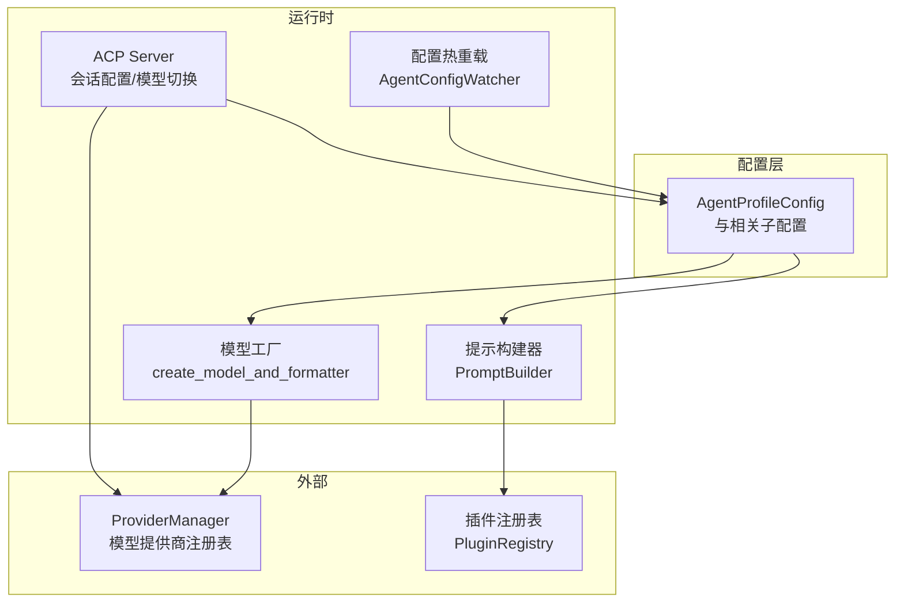
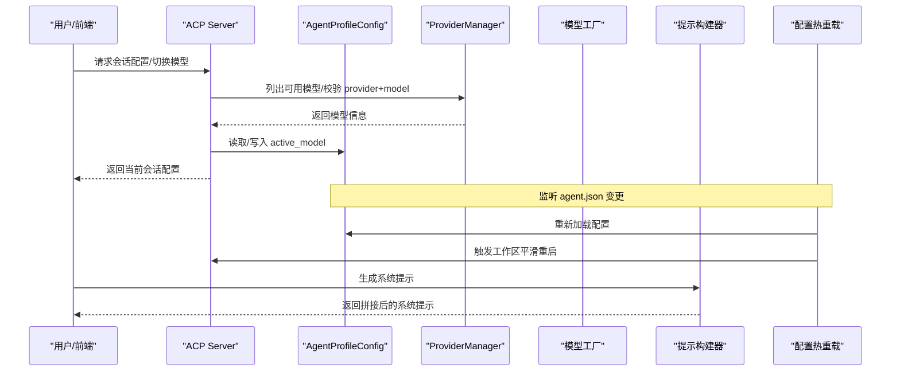
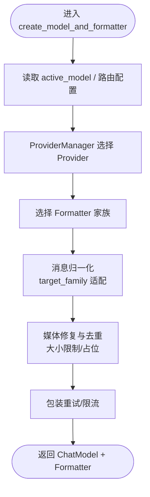
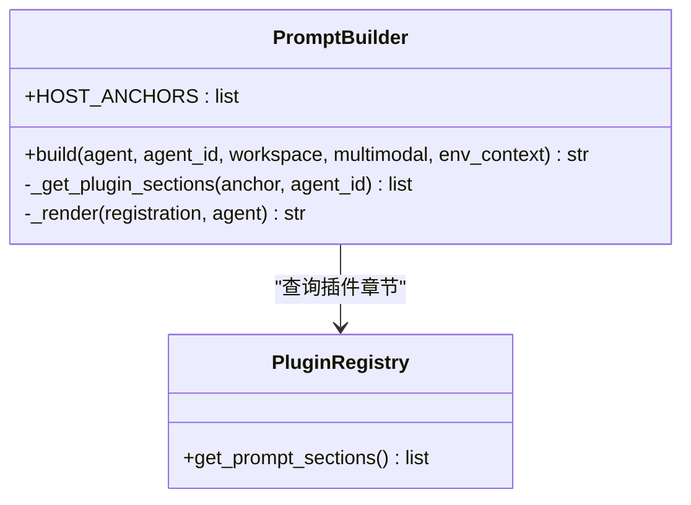
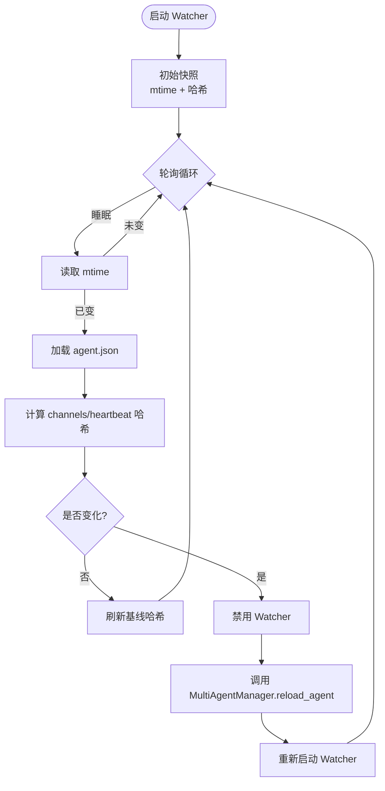
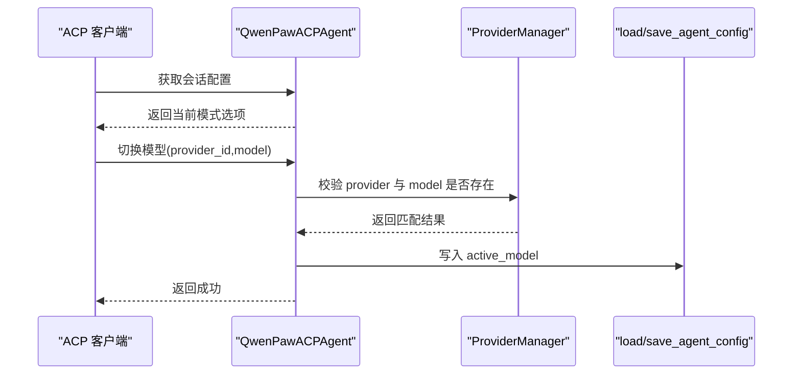
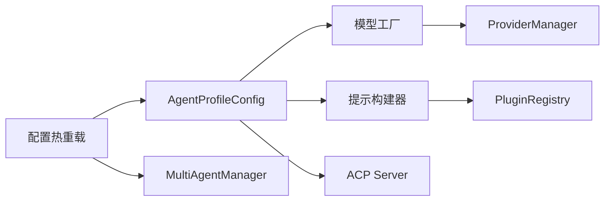

# Agent 配置和定制

<cite>
**本文引用的文件**   
- [config.py](file://src/qwenpaw/config/config.py)
- [model_factory.py](file://src/qwenpaw/agents/model_factory.py)
- [prompt_builder.py](file://src/qwenpaw/agents/prompt_builder.py)
- [agent_config_watcher.py](file://src/qwenpaw/app/agent_config_watcher.py)
- [server.py](file://src/qwenpaw/agents/acp/server.py)
- [test_runtime_config.py](file://e2e/tests/test_runtime_config.py)
- [memory_page.py](file://e2e/pages/memory_page.py)
</cite>

## 目录
1. [简介](#简介)
2. [项目结构](#项目结构)
3. [核心组件](#核心组件)
4. [架构总览](#架构总览)
5. [详细组件分析](#详细组件分析)
6. [依赖关系分析](#依赖关系分析)
7. [性能考量](#性能考量)
8. [故障排查指南](#故障排查指南)
9. [结论](#结论)
10. [附录](#附录)

## 简介
本文件面向 QwenPaw 的 Agent 配置与定制系统，聚焦以下目标：
- 深入解释 AgentProfileConfig 的配置结构与字段含义
- 说明模型工厂的构建流程、消息格式化与多媒体处理要点
- 解析提示构建器的模板系统与插件章节注入机制
- 记录语言设置、工具配置、内存管理、上下文压缩与安全策略等关键选项
- 提供自定义提示模板创建方法与动态配置热重载机制说明
- 给出来自代码库的实际示例路径，展示如何创建自定义 Agent 配置、集成第三方模型提供商、定制系统提示词和优化性能参数
- 总结配置验证规则、默认值与最佳实践，并解释与插件系统、技能系统和安全策略的集成关系
- 覆盖常见问题（配置冲突、环境变量优先级、配置迁移）及解决方案

## 项目结构
围绕 Agent 配置与定制的关键模块分布如下：
- 配置定义与加载：位于配置层，包含 AgentProfileConfig 及其子配置项
- 运行时装配：模型工厂负责按配置创建 ChatModel 与 Formatter；提示构建器组装系统提示
- 动态热重载：监听 agent.json 变化并触发工作区平滑重启
- ACP 集成：ACP Server 暴露会话级配置选项与模型切换能力
- E2E 测试：覆盖运行时配置页面交互与记忆摘要配置

图表来源
- [config.py:1383-1467](file://src/qwenpaw/config/config.py#L1383-L1467)
- [model_factory.py:1-120](file://src/qwenpaw/agents/model_factory.py#L1-L120)
- [prompt_builder.py:1-85](file://src/qwenpaw/agents/prompt_builder.py#L1-L85)
- [agent_config_watcher.py:1-219](file://src/qwenpaw/app/agent_config_watcher.py#L1-L219)
- [server.py:1270-1306](file://src/qwenpaw/agents/acp/server.py#L1270-L1306)

章节来源
- [config.py:1383-1467](file://src/qwenpaw/config/config.py#L1383-L1467)
- [model_factory.py:1-120](file://src/qwenpaw/agents/model_factory.py#L1-L120)
- [prompt_builder.py:1-85](file://src/qwenpaw/agents/prompt_builder.py#L1-L85)
- [agent_config_watcher.py:1-219](file://src/qwenpaw/app/agent_config_watcher.py#L1-L219)
- [server.py:1270-1306](file://src/qwenpaw/agents/acp/server.py#L1270-L1306)

## 核心组件
- AgentProfileConfig：Agent 的完整配置文件模型，包含运行态、LLM 路由、活跃模型、语言、审批级别、系统提示文件、工具、安全、ACP、计划模式、编码模式等。
- 模型工厂：根据配置选择 Provider 与 Model，构造 ChatModel 与 Formatter，并对消息进行归一化、媒体去重与大小限制、视频/图片适配等。
- 提示构建器：基于宿主锚点（workspace、multimodal、env_context）与插件注册的 PromptSection 拼装系统提示。
- 配置热重载：轮询 agent.json，对 channels 与 heartbeat 变更触发平滑重启。
- ACP Server：暴露会话级配置选项（如“绕过权限”），并提供模型切换接口以更新 active_model。

章节来源
- [config.py:1383-1467](file://src/qwenpaw/config/config.py#L1383-L1467)
- [model_factory.py:1-120](file://src/qwenpaw/agents/model_factory.py#L1-L120)
- [prompt_builder.py:1-85](file://src/qwenpaw/agents/prompt_builder.py#L1-L85)
- [agent_config_watcher.py:1-219](file://src/qwenpaw/app/agent_config_watcher.py#L1-L219)
- [server.py:1270-1306](file://src/qwenpaw/agents/acp/server.py#L1270-L1306)

## 架构总览
下图展示了从配置到运行时装配的关键链路：配置驱动模型工厂与提示构建器，ACP 通过 ProviderManager 发现模型，配置热重载在磁盘变更时触发工作区重建。

图表来源
- [server.py:1270-1306](file://src/qwenpaw/agents/acp/server.py#L1270-L1306)
- [agent_config_watcher.py:1-219](file://src/qwenpaw/app/agent_config_watcher.py#L1-L219)
- [prompt_builder.py:1-85](file://src/qwenpaw/agents/prompt_builder.py#L1-L85)

## 详细组件分析

### AgentProfileConfig 配置结构
AgentProfileConfig 是存储在 workspace/agent.json 中的完整 Agent 配置模型，关键字段包括：
- 标识与元数据：id、name、description、workspace_dir、template_id
- 通道与心跳：channels、heartbeat
- MCP：mcp
- 运行态与 LLM 路由：running、llm_routing
- 活跃模型：active_model（provider_id + model）
- 语言与审批：language、approval_level
- 系统提示文件：system_prompt_files
- 工具与安全：tools、security
- ACP：acp
- 计划与编码模式：plan、coding_mode

此外，配置层还定义了丰富的子配置项，例如：
- HeartbeatConfig：定时任务执行间隔、目标、超时、活跃时段
- ReMeLightMemoryConfig：长期记忆目录、自动记忆周期、梦境优化 Cron、嵌入模型配置等
- ContextCompactConfig：上下文压缩阈值与保留比例
- ToolResultPruningConfig：工具结果裁剪策略与缓存目录
- EmbeddingModelConfig：向量后端、API Key、维度、缓存等

这些子配置共同构成 Agent 的运行行为与资源控制策略。

章节来源
- [config.py:1383-1467](file://src/qwenpaw/config/config.py#L1383-L1467)
- [config.py:549-568](file://src/qwenpaw/config/config.py#L549-L568)
- [config.py:654-727](file://src/qwenpaw/config/config.py#L654-L727)
- [config.py:729-758](file://src/qwenpaw/config/config.py#L729-L758)
- [config.py:760-800](file://src/qwenpaw/config/config.py#L760-L800)
- [config.py:594-630](file://src/qwenpaw/config/config.py#L594-L630)

### 模型工厂构建过程
模型工厂负责：
- 依据 active_model 或路由配置选择 Provider 与 Model
- 构造 ChatModel 与对应 Formatter（OpenAI/Anthropic/Gemini/Response 等）
- 对消息进行归一化，适配不同家庭（openai/anthropic/gemini）
- 处理多媒体内容：
  - 视频/图片大小上限与占位替换
  - 本地文件 URL 规范化与存在性检查
  - 工具结果中视频块提升为独立 user 消息
  - MIME 类型修正（如 image/jpg -> image/jpeg）
- 重试与限流包装：RetryChatModel、RateLimitConfig

图表来源
- [model_factory.py:1-120](file://src/qwenpaw/agents/model_factory.py#L1-L120)
- [model_factory.py:96-141](file://src/qwenpaw/agents/model_factory.py#L96-L141)
- [model_factory.py:447-541](file://src/qwenpaw/agents/model_factory.py#L447-L541)
- [model_factory.py:588-623](file://src/qwenpaw/agents/model_factory.py#L588-L623)

章节来源
- [model_factory.py:1-120](file://src/qwenpaw/agents/model_factory.py#L1-L120)
- [model_factory.py:96-141](file://src/qwenpaw/agents/model_factory.py#L96-L141)
- [model_factory.py:447-541](file://src/qwenpaw/agents/model_factory.py#L447-L541)
- [model_factory.py:588-623](file://src/qwenpaw/agents/model_factory.py#L588-L623)

### 提示构建器模板系统
提示构建器以宿主锚点顺序输出系统提示片段，并在每个锚点后插入插件注册的 PromptSection。支持按 agent_id 过滤，确保多 Agent 场景下的隔离。

图表来源
- [prompt_builder.py:1-85](file://src/qwenpaw/agents/prompt_builder.py#L1-L85)

章节来源
- [prompt_builder.py:1-85](file://src/qwenpaw/agents/prompt_builder.py#L1-L85)

### 动态配置热重载机制
AgentConfigWatcher 定期轮询 agent.json，仅当 channels 或 heartbeat 哈希发生变化时才触发工作区平滑重启，避免无关重写导致频繁重启。

图表来源
- [agent_config_watcher.py:1-219](file://src/qwenpaw/app/agent_config_watcher.py#L1-L219)

章节来源
- [agent_config_watcher.py:1-219](file://src/qwenpaw/app/agent_config_watcher.py#L1-L219)

### ACP 会话配置与模型切换
ACP Server 暴露会话级配置选项（如“默认/绕过权限”），并提供模型切换接口，将 active_model 持久化到 agent.json。

图表来源
- [server.py:1270-1306](file://src/qwenpaw/agents/acp/server.py#L1270-L1306)
- [server.py:1323-1363](file://src/qwenpaw/agents/acp/server.py#L1323-L1363)

章节来源
- [server.py:1270-1306](file://src/qwenpaw/agents/acp/server.py#L1270-L1306)
- [server.py:1323-1363](file://src/qwenpaw/agents/acp/server.py#L1323-L1363)

### 配置验证规则、默认值与最佳实践
- Agent ID 验证：长度、字符集、保留字与唯一性校验
- 通道配置：各通道特有必填字段（如 XiaoYi 的 ak/sk/agent_id）
- 审批级别：STRICT/SMART/AUTO/OFF 语义明确
- 系统提示文件：默认 ["AGENTS.md", "SOUL.md", "PROFILE.md"]
- 建议：
  - 使用 active_model 精确指定 provider_id 与 model，避免歧义
  - 合理设置 context compaction 阈值与保留比例，平衡上下文质量与成本
  - 启用 tool result pruning 控制历史体积
  - 谨慎开启“绕过权限”，仅在受控调试环境使用

章节来源
- [config.py:156-195](file://src/qwenpaw/config/config.py#L156-L195)
- [config.py:1434-1443](file://src/qwenpaw/config/config.py#L1434-L1443)
- [config.py:1444-1447](file://src/qwenpaw/config/config.py#L1444-L1447)
- [config.py:729-758](file://src/qwenpaw/config/config.py#L729-L758)
- [config.py:760-800](file://src/qwenpaw/config/config.py#L760-L800)

### 与插件系统、技能系统与安全策略的集成
- 插件系统：PromptBuilder 通过 PluginRegistry 注入系统提示章节，支持按 agent_id 过滤
- 技能系统：AgentProfileConfig 包含 tools 与 skills 相关配置入口，结合 skill pool 与服务实现
- 安全策略：approval_level 控制工具执行审批强度；ACP 会话模式可临时绕过权限（仅限调试）

章节来源
- [prompt_builder.py:1-85](file://src/qwenpaw/agents/prompt_builder.py#L1-L85)
- [config.py:1448-1455](file://src/qwenpaw/config/config.py#L1448-L1455)
- [server.py:1270-1306](file://src/qwenpaw/agents/acp/server.py#L1270-L1306)

### 实际示例与用法路径
- 创建自定义 Agent 配置：参考 AgentProfileConfig 字段与子配置项定义
  - 示例路径：[config.py:1383-1467](file://src/qwenpaw/config/config.py#L1383-L1467)
- 集成第三方模型提供商：通过 ProviderManager 注册后，在 active_model 指定 provider_id 与 model
  - 示例路径：[server.py:1323-1363](file://src/qwenpaw/agents/acp/server.py#L1323-L1363)
- 定制系统提示词：在插件中注册 PromptSection，并按 anchor 插入
  - 示例路径：[prompt_builder.py:1-85](file://src/qwenpaw/agents/prompt_builder.py#L1-L85)
- 优化性能参数：调整 context compaction、tool result pruning、embedding 缓存等
  - 示例路径：[config.py:729-758](file://src/qwenpaw/config/config.py#L729-L758), [config.py:760-800](file://src/qwenpaw/config/config.py#L760-L800), [config.py:594-630](file://src/qwenpaw/config/config.py#L594-L630)
- 动态配置热重载：编辑 agent.json 后等待 Watcher 触发 reload
  - 示例路径：[agent_config_watcher.py:1-219](file://src/qwenpaw/app/agent_config_watcher.py#L1-L219)
- E2E 验证：运行时配置页签、记忆摘要配置等
  - 示例路径：[test_runtime_config.py:1-73](file://e2e/tests/test_runtime_config.py#L1-L73), [test_runtime_config.py:791-819](file://e2e/tests/test_runtime_config.py#L791-L819), [memory_page.py:34-126](file://e2e/pages/memory_page.py#L34-L126)

## 依赖关系分析
- 配置层到运行时：AgentProfileConfig 被模型工厂与提示构建器消费；ACP 通过 ProviderManager 解析 active_model
- 热重载与工作区：AgentConfigWatcher 依赖 load_agent_config 与 MultiAgentManager.reload_agent
- 插件与提示：PromptBuilder 依赖 PluginRegistry 提供的 prompt sections

图表来源
- [config.py:1383-1467](file://src/qwenpaw/config/config.py#L1383-L1467)
- [model_factory.py:1-120](file://src/qwenpaw/agents/model_factory.py#L1-L120)
- [prompt_builder.py:1-85](file://src/qwenpaw/agents/prompt_builder.py#L1-L85)
- [agent_config_watcher.py:1-219](file://src/qwenpaw/app/agent_config_watcher.py#L1-L219)
- [server.py:1270-1306](file://src/qwenpaw/agents/acp/server.py#L1270-L1306)

章节来源
- [config.py:1383-1467](file://src/qwenpaw/config/config.py#L1383-L1467)
- [model_factory.py:1-120](file://src/qwenpaw/agents/model_factory.py#L1-L120)
- [prompt_builder.py:1-85](file://src/qwenpaw/agents/prompt_builder.py#L1-L85)
- [agent_config_watcher.py:1-219](file://src/qwenpaw/app/agent_config_watcher.py#L1-L219)
- [server.py:1270-1306](file://src/qwenpaw/agents/acp/server.py#L1270-L1306)

## 性能考量
- 上下文压缩：合理设置 compact_threshold_ratio 与 reserve_threshold_ratio，避免过早压缩影响连贯性
- 工具结果裁剪：启用 pruning 并控制 recent_n 与字节阈值，减少历史膨胀
- 媒体处理：视频/图片大小限制与占位替换可降低请求体体积，避免网关限制
- 重试与限流：通过 RetryChatModel 与 RateLimitConfig 保护上游服务稳定性
- 嵌入缓存：开启 embedding cache 并调优 max_cache_size 与 batch size

章节来源
- [config.py:729-758](file://src/qwenpaw/config/config.py#L729-L758)
- [config.py:760-800](file://src/qwenpaw/config/config.py#L760-L800)
- [model_factory.py:447-541](file://src/qwenpaw/agents/model_factory.py#L447-L541)
- [model_factory.py:588-623](file://src/qwenpaw/agents/model_factory.py#L588-L623)

## 故障排查指南
- 配置冲突
  - 现象：active_model 指向不存在的 provider 或 model
  - 排查：使用 ACP 模型切换流程校验 provider+model 是否存在
  - 参考路径：[server.py:1323-1363](file://src/qwenpaw/agents/acp/server.py#L1323-L1363)
- 环境变量优先级
  - 现象：某些通道配置依赖环境变量但未生效
  - 排查：确认通道配置加载顺序与环境变量注入位置
  - 参考路径：[config.py:519-534](file://src/qwenpaw/config/config.py#L519-L534)
- 配置迁移
  - 现象：旧配置键名不再兼容
  - 排查：利用内置迁移逻辑（如 weixin -> wechat）
  - 参考路径：[config.py:519-534](file://src/qwenpaw/config/config.py#L519-L534)
- 热重载无效
  - 现象：修改 agent.json 后未触发重启
  - 排查：确认 channels 或 heartbeat 是否真正变化（哈希对比）
  - 参考路径：[agent_config_watcher.py:156-219](file://src/qwenpaw/app/agent_config_watcher.py#L156-L219)
- 系统提示缺失
  - 现象：插件章节未注入
  - 排查：检查插件注册与 agent_id 过滤条件
  - 参考路径：[prompt_builder.py:63-85](file://src/qwenpaw/agents/prompt_builder.py#L63-L85)

章节来源
- [server.py:1323-1363](file://src/qwenpaw/agents/acp/server.py#L1323-L1363)
- [config.py:519-534](file://src/qwenpaw/config/config.py#L519-L534)
- [agent_config_watcher.py:156-219](file://src/qwenpaw/app/agent_config_watcher.py#L156-L219)
- [prompt_builder.py:63-85](file://src/qwenpaw/agents/prompt_builder.py#L63-L85)

## 结论
QwenPaw 的 Agent 配置与定制体系以 AgentProfileConfig 为核心，贯穿模型工厂、提示构建器、ACP 会话管理与配置热重载。通过严格的配置验证、灵活的插件扩展与完善的运行时装配，既满足初学者快速上手，也为高级用户提供深度定制能力。建议在生产环境中审慎配置安全策略与性能参数，并结合 E2E 用例持续验证配置变更效果。

## 附录
- 术语
  - Provider：模型提供商抽象，统一接入多家 LLM 服务
  - Formatter：消息格式适配器，将内部消息转换为特定 API 所需格式
  - ACP：Agent Communication Protocol，用于跨进程/跨语言的 Agent 通信
- 参考路径汇总
  - AgentProfileConfig 定义：[config.py:1383-1467](file://src/qwenpaw/config/config.py#L1383-L1467)
  - 模型工厂主流程：[model_factory.py:1-120](file://src/qwenpaw/agents/model_factory.py#L1-L120)
  - 提示构建器：[prompt_builder.py:1-85](file://src/qwenpaw/agents/prompt_builder.py#L1-L85)
  - 配置热重载：[agent_config_watcher.py:1-219](file://src/qwenpaw/app/agent_config_watcher.py#L1-L219)
  - ACP 会话配置与模型切换：[server.py:1270-1306](file://src/qwenpaw/agents/acp/server.py#L1270-L1306), [server.py:1323-1363](file://src/qwenpaw/agents/acp/server.py#L1323-L1363)
  - E2E 运行时配置与记忆摘要：[test_runtime_config.py:1-73](file://e2e/tests/test_runtime_config.py#L1-L73), [test_runtime_config.py:791-819](file://e2e/tests/test_runtime_config.py#L791-L819), [memory_page.py:34-126](file://e2e/pages/memory_page.py#L34-L126)