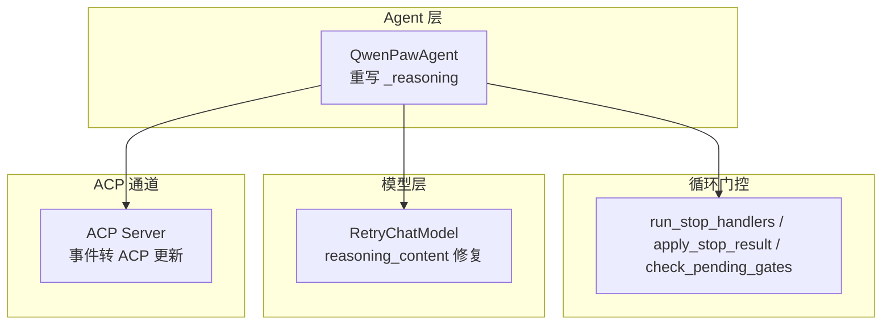
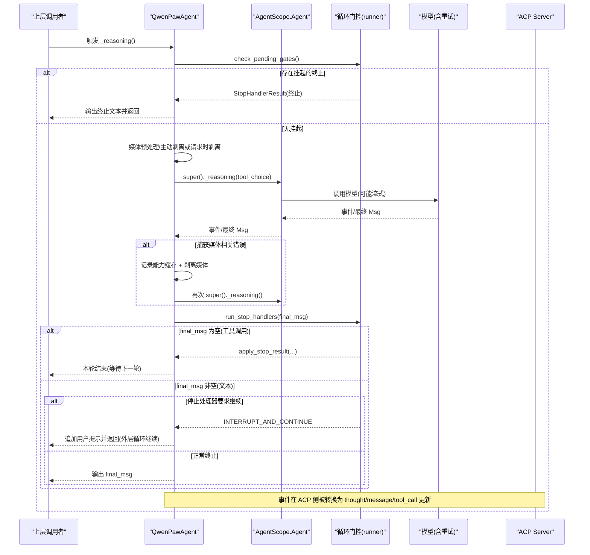
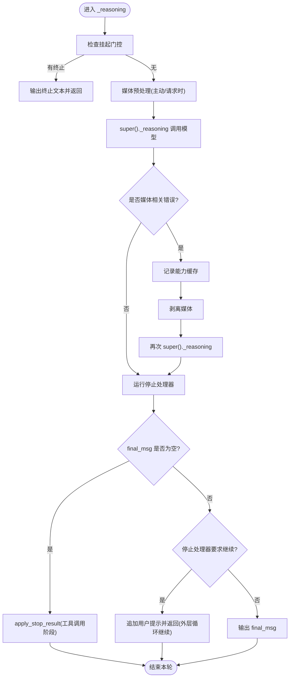
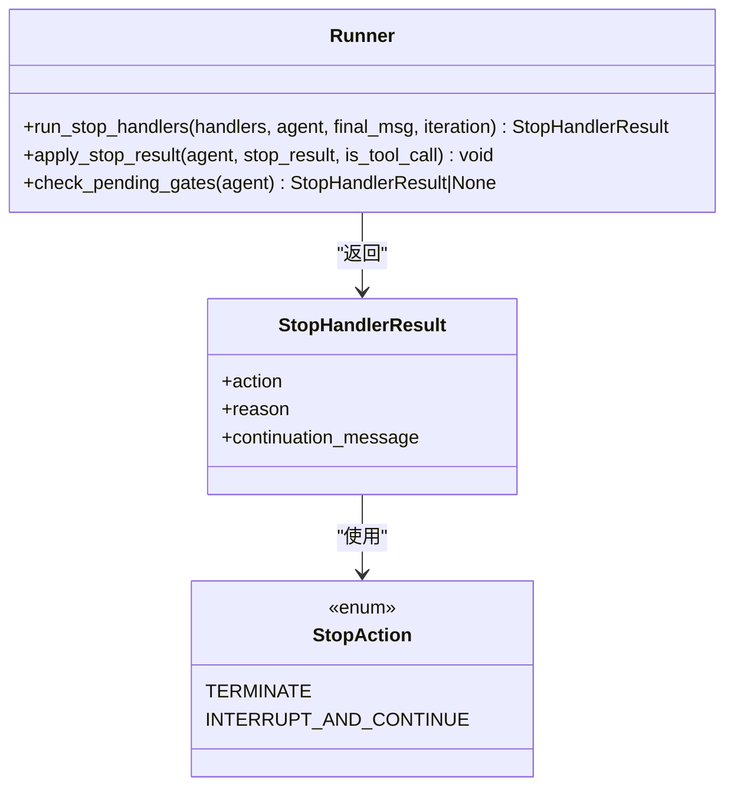
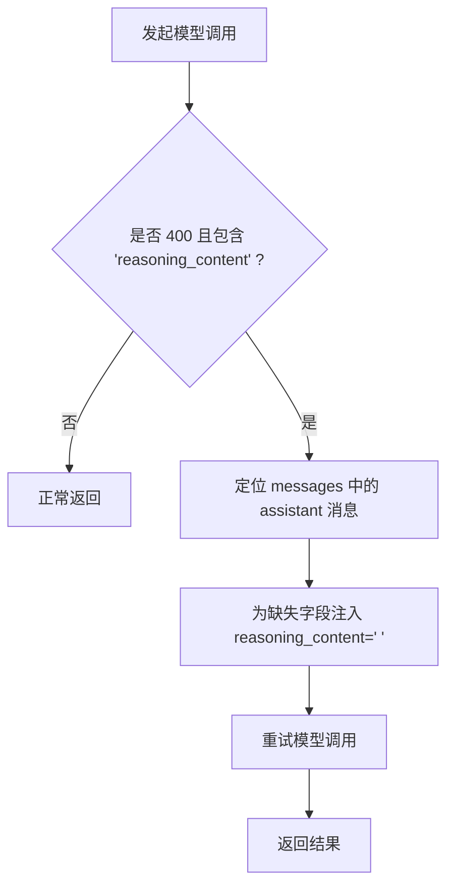
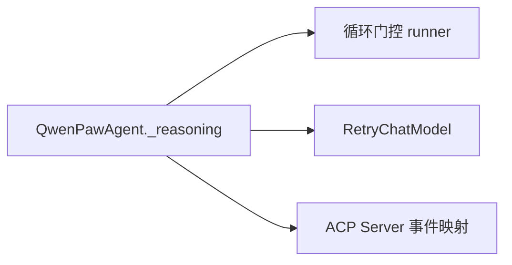

# ReAct 模式实现

<cite>
**本文引用的文件**   
- [react_agent.py](file://src/qwenpaw/agents/react_agent.py)
- [runner.py](file://src/qwenpaw/loop/gates/runner.py)
- [retry_chat_model.py](file://src/qwenpaw/providers/retry_chat_model.py)
- [server.py](file://src/qwenpaw/agents/acp/server.py)
</cite>

## 目录
1. [简介](#简介)
2. [项目结构](#项目结构)
3. [核心组件](#核心组件)
4. [架构总览](#架构总览)
5. [详细组件分析](#详细组件分析)
6. [依赖关系分析](#依赖关系分析)
7. [性能考量](#性能考量)
8. [故障排查指南](#故障排查指南)
9. [结论](#结论)
10. [附录](#附录)

## 简介
本文件聚焦 QwenPaw 的 ReAct（Reasoning and Acting）模式实现，系统性解析 _reasoning 方法的完整执行流程、中间件与事件流处理、错误恢复策略、工具协调器集成、媒体块处理、自动重试机制以及与循环门控系统的协作。文档同时给出面向初学者的渐进式说明与面向资深开发者的技术细节，并附带可追溯的代码片段路径与可视化图示。

## 项目结构
围绕 ReAct 的核心代码主要分布在以下模块：
- Agent 层：QwenPawAgent 继承自 AgentScope 的 Agent，重写 _reasoning 以注入 QwenPaw 特有的能力（媒体处理、停止处理器、上下文清理等）。
- 循环门控：stop handlers 的执行、结果应用与挂起状态消费，解耦于 Agent 类。
- 模型重试：针对特定 provider 的 reasoning_content 缺失错误的检测与修复。
- ACP 通道：将内部事件转换为外部协议更新，包含推理文本与工具调用的映射。

图表来源
- [react_agent.py:411-551](file://src/qwenpaw/agents/react_agent.py#L411-L551)
- [runner.py:62-132](file://src/qwenpaw/loop/gates/runner.py#L62-L132)
- [retry_chat_model.py:211-253](file://src/qwenpaw/providers/retry_chat_model.py#L211-L253)
- [server.py:170-244](file://src/qwenpaw/agents/acp/server.py#L170-L244)

章节来源
- [react_agent.py:411-551](file://src/qwenpaw/agents/react_agent.py#L411-L551)
- [runner.py:62-132](file://src/qwenpaw/loop/gates/runner.py#L62-L132)
- [retry_chat_model.py:211-253](file://src/qwenpaw/providers/retry_chat_model.py#L211-L253)
- [server.py:170-244](file://src/qwenpaw/agents/acp/server.py#L170-L244)

## 核心组件
- QwenPawAgent._reasoning：ReAct 单轮推理主流程，负责前置检查、媒体预处理、调用父类推理、被动重试、停止处理器与继续控制。
- 循环门控 runner：stop handlers 的筛选、执行、结果应用与挂起状态消费。
- RetryChatModel：对“thinking mode 下缺少 reasoning_content”的错误进行识别与修复，避免 400 失败。
- ACP Server：将内部消息类型与增量内容映射为 ACP 的 agent_thought、agent_message、tool_call 更新。

章节来源
- [react_agent.py:411-551](file://src/qwenpaw/agents/react_agent.py#L411-L551)
- [runner.py:62-132](file://src/qwenpaw/loop/gates/runner.py#L62-L132)
- [retry_chat_model.py:211-253](file://src/qwenpaw/providers/retry_chat_model.py#L211-L253)
- [server.py:170-244](file://src/qwenpaw/agents/acp/server.py#L170-L244)

## 架构总览
下图展示了 ReAct 单轮推理的关键交互：从入口到模型调用、错误恢复、停止处理器、以及对外事件转换。

图表来源
- [react_agent.py:411-551](file://src/qwenpaw/agents/react_agent.py#L411-L551)
- [runner.py:62-132](file://src/qwenpaw/loop/gates/runner.py#L62-L132)
- [server.py:170-244](file://src/qwenpaw/agents/acp/server.py#L170-L244)

## 详细组件分析

### QwenPawAgent._reasoning 执行流程
- 前置检查：读取上一轮遗留的门控动作，若存在终止则直接输出终止文本并返回。
- 媒体预处理：根据当前模型是否支持多模态或已学习“拒绝媒体”，选择请求时剥离或内存中主动剥离。
- 模型调用与被动重试：遍历父类 _reasoning 事件；若抛出媒体相关错误，则记录能力缓存并剥离媒体后重试一次。
- 停止处理器：每轮迭代运行 stop handlers；当 final_msg 为空（工具调用阶段），通过 apply_stop_result 设置下一轮挂起状态；当 final_msg 非空且停止处理器要求继续，则在上下文中追加用户提示并返回，由外层循环继续。
- 返回值：若无 final_msg 则不输出；否则输出 final_msg。

图表来源
- [react_agent.py:411-551](file://src/qwenpaw/agents/react_agent.py#L411-L551)
- [runner.py:135-163](file://src/qwenpaw/loop/gates/runner.py#L135-L163)

章节来源
- [react_agent.py:411-551](file://src/qwenpaw/agents/react_agent.py#L411-L551)
- [runner.py:135-163](file://src/qwenpaw/loop/gates/runner.py#L135-L163)

### 循环门控系统（Stop Handlers）
- 作用域过滤：按 scope 过滤 handler，优先运行活跃作用域的处理器。
- 执行顺序：按优先级排序依次执行，遇到明确结果即返回。
- 结果应用：在工具调用阶段，将终止或继续指令延迟到下一轮生效；在文本阶段，立即影响输出或追加提示。
- 挂起消费：下一轮开始时消费挂起状态，必要时向上下文追加用户提示。

图表来源
- [runner.py:62-132](file://src/qwenpaw/loop/gates/runner.py#L62-L132)
- [runner.py:135-217](file://src/qwenpaw/loop/gates/runner.py#L135-L217)

章节来源
- [runner.py:62-132](file://src/qwenpaw/loop/gates/runner.py#L62-L132)
- [runner.py:135-217](file://src/qwenpaw/loop/gates/runner.py#L135-L217)

### 自动重试机制（reasoning_content 缺失）
- 错误识别：当 provider 在 thinking mode 下要求 assistant 消息携带 reasoning_content，但历史消息缺失该字段时，会返回 400。
- 修复策略：扫描 messages，为缺失 reasoning_content 的 assistant 消息注入占位值，随后重试。
- 适用场景：DeepSeek 及兼容 provider 的 thinking mode 行为。

图表来源
- [retry_chat_model.py:211-253](file://src/qwenpaw/providers/retry_chat_model.py#L211-L253)

章节来源
- [retry_chat_model.py:211-253](file://src/qwenpaw/providers/retry_chat_model.py#L211-L253)

### 工具协调器集成与超时配置
- 工具协调器：从 request_context 获取 ToolCoordinator，注册默认超时与最大内部超时。
- 覆盖范围：shell、浏览器、LSP、桌面截图、子代理通信等常用工具。
- 动态覆盖：根据 agent 配置中的 builtin_tools.timeout_seconds 覆盖默认超时。

章节来源
- [react_agent.py:653-706](file://src/qwenpaw/agents/react_agent.py#L653-L706)

### 媒体块处理与自动重试
- 主动剥离：当当前模型不支持多模态或已学习“拒绝媒体”，在调用前主动从内存中移除媒体块。
- 请求时剥离：通过 formatter 开关在请求时剥离媒体，避免污染用户可见的历史消息。
- 被动重试：若模型返回媒体相关错误，记录能力缓存并剥离媒体后重试一次。
- 嵌套处理：ToolResultBlock 的输出也进行媒体块过滤，并在结果为空时插入占位文本。

章节来源
- [react_agent.py:376-410](file://src/qwenpaw/agents/react_agent.py#L376-L410)
- [react_agent.py:448-510](file://src/qwenpaw/agents/react_agent.py#L448-L510)
- [react_agent.py:745-809](file://src/qwenpaw/agents/react_agent.py#L745-L809)

### 事件流与 ACP 映射
- 推理文本：REASONING 类型的消息会被标记，后续对应 msg_id 的增量内容映射为 agent_thought。
- 普通文本：非推理的增量内容映射为 agent_message。
- 工具调用：PLUGIN_CALL 完成时生成 start_tool_call；PLUGIN_CALL_OUTPUT 完成时生成 update_tool_call。

章节来源
- [server.py:170-244](file://src/qwenpaw/agents/acp/server.py#L170-L244)

## 依赖关系分析
- QwenPawAgent 依赖：
  - 循环门控 runner：用于停止处理器执行与挂起状态管理。
  - 模型重试逻辑：用于 reasoning_content 缺失错误的修复。
  - ACP Server：用于将内部事件转换为外部协议更新。
- 耦合与内聚：
  - _reasoning 将媒体处理、错误恢复、停止处理器整合在同一流程，提升内聚性。
  - 循环门控逻辑独立于 Agent，便于扩展与测试。
  - ACP 映射仅关注事件到协议的转换，职责清晰。

图表来源
- [react_agent.py:411-551](file://src/qwenpaw/agents/react_agent.py#L411-L551)
- [runner.py:62-132](file://src/qwenpaw/loop/gates/runner.py#L62-L132)
- [retry_chat_model.py:211-253](file://src/qwenpaw/providers/retry_chat_model.py#L211-L253)
- [server.py:170-244](file://src/qwenpaw/agents/acp/server.py#L170-L244)

章节来源
- [react_agent.py:411-551](file://src/qwenpaw/agents/react_agent.py#L411-L551)
- [runner.py:62-132](file://src/qwenpaw/loop/gates/runner.py#L62-L132)
- [retry_chat_model.py:211-253](file://src/qwenpaw/providers/retry_chat_model.py#L211-L253)
- [server.py:170-244](file://src/qwenpaw/agents/acp/server.py#L170-L244)

## 性能考量
- 媒体剥离时机：优先使用请求时剥离以减少内存拷贝；仅在需要时才主动剥离。
- 重试次数：媒体相关错误仅重试一次，避免无限重试带来的开销。
- 停止处理器：按优先级执行，尽早返回以避免不必要的后续处理。
- 工具超时：为不同工具设置合理默认超时，防止长时间阻塞。

[本节为通用指导，无需具体文件引用]

## 故障排查指南
- 无限循环检测：
  - 现象：_reasoning 持续产出文本或工具调用，未终止。
  - 排查：检查停止处理器是否返回 TERMINATE；确认是否有挂起 continue 导致外层循环不断追加提示。
  - 参考路径：[runner.py:62-132](file://src/qwenpaw/loop/gates/runner.py#L62-L132)、[react_agent.py:511-551](file://src/qwenpaw/agents/react_agent.py#L511-L551)
- 超时处理：
  - 现象：工具调用长时间无响应。
  - 排查：确认工具协调器的默认超时与 agent 配置覆盖是否正确；查看日志中的超时信息。
  - 参考路径：[react_agent.py:653-706](file://src/qwenpaw/agents/react_agent.py#L653-L706)
- 异常恢复：
  - 现象：模型返回 400 或媒体相关错误。
  - 排查：确认是否命中媒体错误判定；检查能力缓存是否记录 rejects_media；验证重试后是否成功。
  - 参考路径：[react_agent.py:570-613](file://src/qwenpaw/agents/react_agent.py#L570-L613)、[retry_chat_model.py:211-253](file://src/qwenpaw/providers/retry_chat_model.py#L211-L253)

章节来源
- [runner.py:62-132](file://src/qwenpaw/loop/gates/runner.py#L62-L132)
- [react_agent.py:511-551](file://src/qwenpaw/agents/react_agent.py#L511-L551)
- [react_agent.py:653-706](file://src/qwenpaw/agents/react_agent.py#L653-L706)
- [react_agent.py:570-613](file://src/qwenpaw/agents/react_agent.py#L570-L613)
- [retry_chat_model.py:211-253](file://src/qwenpaw/providers/retry_chat_model.py#L211-L253)

## 结论
QwenPaw 的 ReAct 模式在 _reasoning 中实现了稳健的单轮推理流程：通过前置门控检查、灵活的媒体处理、被动重试与停止处理器，确保在复杂环境下仍能稳定推进任务。循环门控与工具协调器的解耦设计提升了可扩展性与可维护性，而 ACP 的事件映射使得外部客户端能够直观地观察推理过程与工具调用。

[本节为总结，无需具体文件引用]

## 附录
- 关键方法路径：
  - _reasoning：[react_agent.py:411-551](file://src/qwenpaw/agents/react_agent.py#L411-L551)
  - run_stop_handlers：[runner.py:62-132](file://src/qwenpaw/loop/gates/runner.py#L62-L132)
  - apply_stop_result：[runner.py:135-163](file://src/qwenpaw/loop/gates/runner.py#L135-L163)
  - check_pending_gates：[runner.py:165-217](file://src/qwenpaw/loop/gates/runner.py#L165-L217)
  - _is_missing_reasoning_content_error/_inject_reasoning_content：[retry_chat_model.py:211-253](file://src/qwenpaw/providers/retry_chat_model.py#L211-L253)
  - ACP 事件映射 process：[server.py:170-244](file://src/qwenpaw/agents/acp/server.py#L170-L244)

[本节为索引，无需具体文件引用]