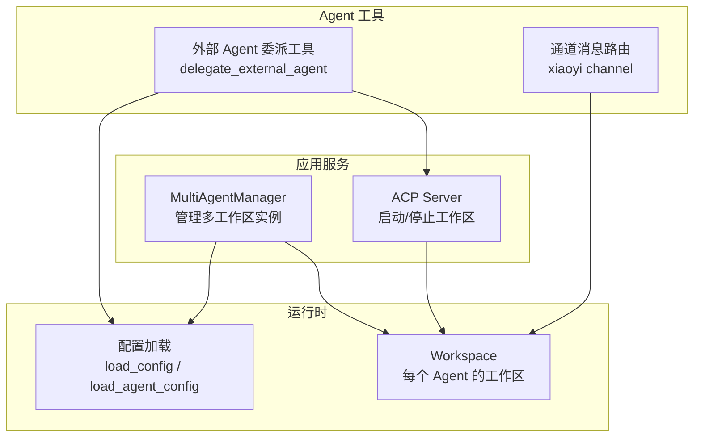
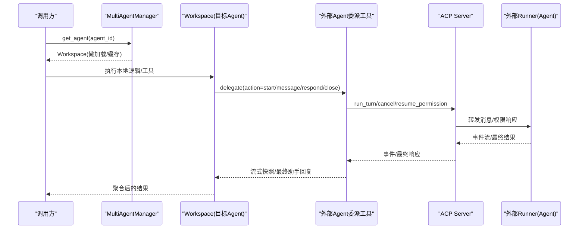
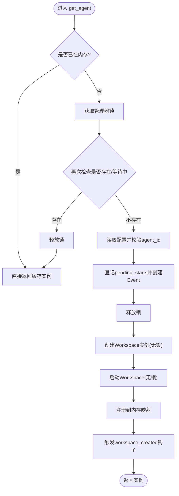
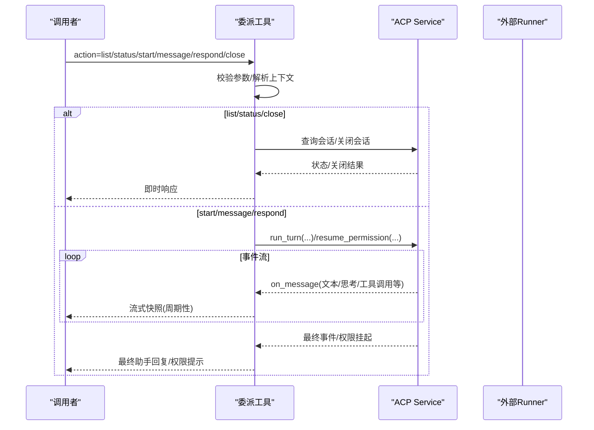
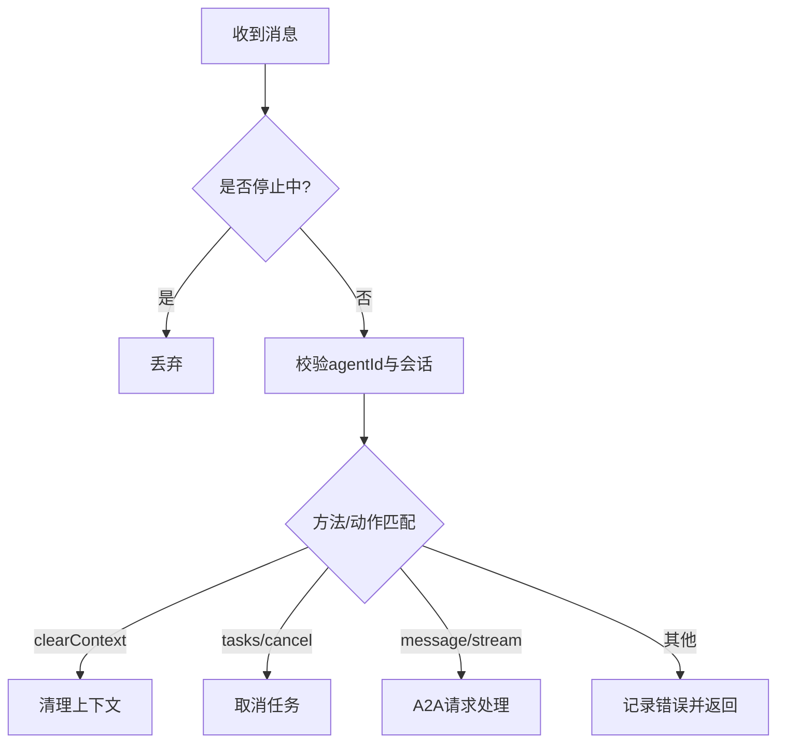
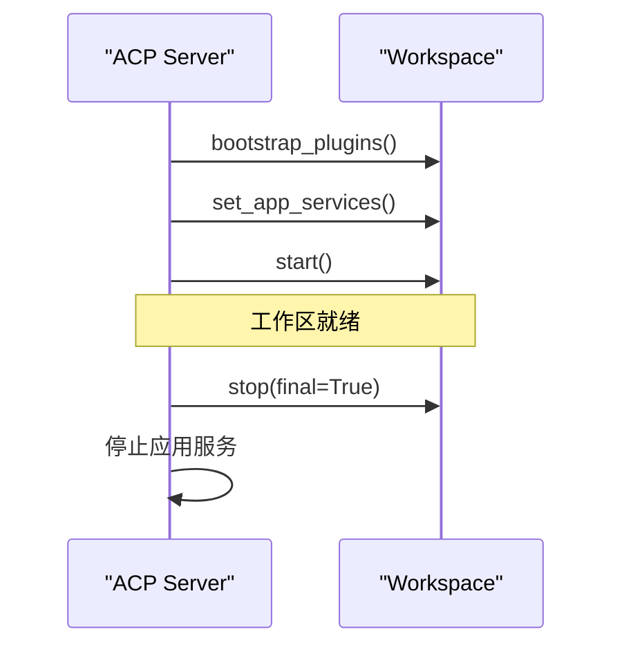
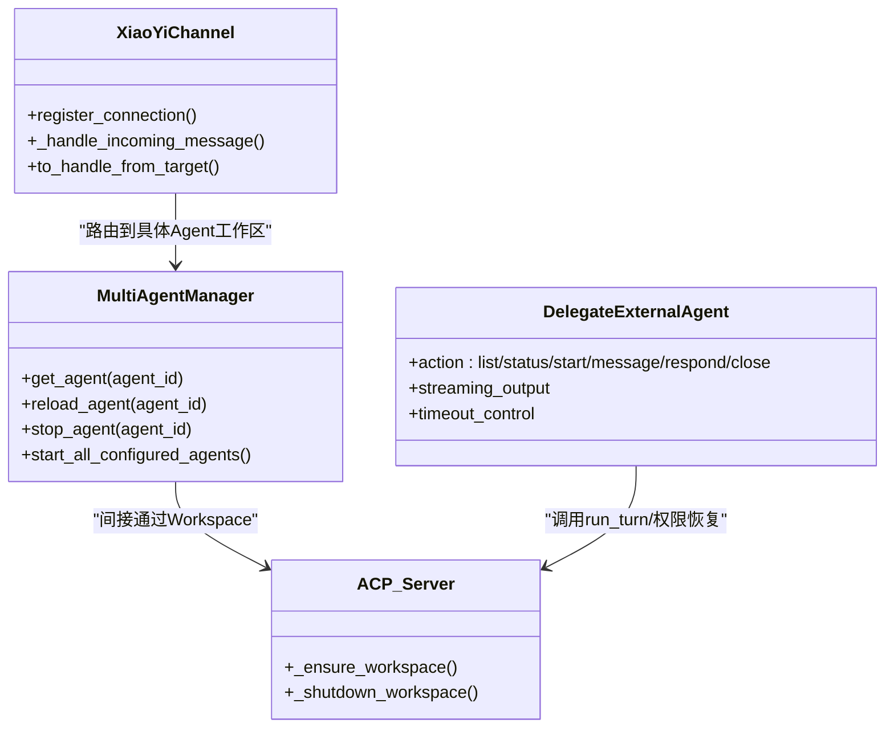

# 多 Agent 协作

<cite>
**本文引用的文件**   
- [multi_agent_manager.py](file://src/qwenpaw/app/multi_agent_manager.py)
- [delegate_external_agent.py](file://src/qwenpaw/agents/tools/delegate_external_agent.py)
- [channel.py](file://src/qwenpaw/app/channels/xiaoyi/channel.py)
- [server.py](file://src/qwenpaw/agents/acp/server.py)
- [skills.zh.md](file://website/public/docs/skills.zh.md)
</cite>

## 目录
1. [简介](#简介)
2. [项目结构](#项目结构)
3. [核心组件](#核心组件)
4. [架构总览](#架构总览)
5. [详细组件分析](#详细组件分析)
6. [依赖关系分析](#依赖关系分析)
7. [性能与并发特性](#性能与并发特性)
8. [故障排查指南](#故障排查指南)
9. [结论](#结论)
10. [附录：配置与用法要点](#附录配置与用法要点)

## 简介
本文件面向 QwenPaw 的多 Agent 协作系统，聚焦以下目标：
- 解释多个 Agent 之间的通信机制、任务委派与结果聚合
- 深入说明 MultiAgentManager 的实现原理（发现、生命周期、热重载、并行启动）
- 记录外部 Agent 委派工具与 Agent 间聊天工具的用法与行为
- 结合仓库中的实际代码路径，给出可落地的配置、参数与返回约定
- 讨论与工作空间隔离、安全策略和资源管理的集成点
- 提供常见问题与解决方案，兼顾初学者与资深开发者

## 项目结构
围绕多 Agent 协作的关键位置如下：
- 多实例管理与工作区生命周期：app/multi_agent_manager.py
- 外部 Agent 委派工具（基于 ACP 协议）：agents/tools/delegate_external_agent.py
- 通道层消息路由示例（跨会话/跨 Agent 的转发与过滤）：app/channels/xiaoyi/channel.py
- ACP 服务端侧工作区启动与停止：agents/acp/server.py
- 技能体系与“多 Agent 协作”相关技能的文档入口：website/public/docs/skills.zh.md

图示来源
- [multi_agent_manager.py:23-158](file://src/qwenpaw/app/multi_agent_manager.py#L23-L158)
- [server.py:461-500](file://src/qwenpaw/agents/acp/server.py#L461-L500)
- [delegate_external_agent.py:70-108](file://src/qwenpaw/agents/tools/delegate_external_agent.py#L70-L108)
- [channel.py:543-572](file://src/qwenpaw/app/channels/xiaoyi/channel.py#L543-L572)

章节来源
- [multi_agent_manager.py:23-158](file://src/qwenpaw/app/multi_agent_manager.py#L23-L158)
- [server.py:461-500](file://src/qwenpaw/agents/acp/server.py#L461-L500)
- [delegate_external_agent.py:70-108](file://src/qwenpaw/agents/tools/delegate_external_agent.py#L70-L108)
- [channel.py:543-572](file://src/qwenpaw/app/channels/xiaoyi/channel.py#L543-L572)

## 核心组件
- MultiAgentManager：负责多工作区的懒加载、生命周期管理、零停机热重载与并发启动。对外暴露 get_agent、reload_agent、stop_agent、start_all_configured_agents 等接口。
- 外部 Agent 委派工具（delegate_external_agent）：通过 ACP 协议将当前 Agent 的任务委派给已配置的远程/外部 Runner，支持 start/message/respond/close/status/list 等操作，并具备流式输出、权限挂起与超时控制。
- 通道消息路由（xiaoyi channel）：演示了跨连接的消息分发、会话绑定与 agentId 校验，可作为 Agent 间消息路由参考。
- ACP 服务端（agents/acp/server.py）：在 ACP 场景下创建并启动 Workspace，完成插件引导与应用服务注入。

章节来源
- [multi_agent_manager.py:23-158](file://src/qwenpaw/app/multi_agent_manager.py#L23-L158)
- [delegate_external_agent.py:70-108](file://src/qwenpaw/agents/tools/delegate_external_agent.py#L70-L108)
- [channel.py:543-572](file://src/qwenpaw/app/channels/xiaoyi/channel.py#L543-L572)
- [server.py:461-500](file://src/qwenpaw/agents/acp/server.py#L461-L500)

## 架构总览
下图展示了从用户请求到多 Agent 协作的端到端流程：
- 上层调用通过 MultiAgentManager 获取或创建对应 Agent 的 Workspace
- 若需要跨 Agent 协作，可通过外部 Agent 委派工具发起 ACP 对话
- 通道层可将消息路由到不同 Agent 或会话，并进行必要的过滤与转发

图示来源
- [multi_agent_manager.py:54-158](file://src/qwenpaw/app/multi_agent_manager.py#L54-L158)
- [delegate_external_agent.py:432-489](file://src/qwenpaw/agents/tools/delegate_external_agent.py#L432-L489)
- [server.py:461-500](file://src/qwenpaw/agents/acp/server.py#L461-L500)

## 详细组件分析

### MultiAgentManager 实现原理
- 懒加载与去重：get_agent 先快速命中内存缓存；未命中时加锁检查配置并登记“待启动”事件，避免重复创建。
- 并行启动：仅在字典操作阶段持有锁，创建工作区与启动过程在锁外进行，允许多个 Agent 并行初始化。
- 热重载（零停机）：reload_agent 会先创建并启动新实例，再原子替换旧实例，随后异步优雅关闭旧实例（有活跃任务则延迟清理）。
- 批量启动：start_all_configured_agents 仅启动 enabled=True 的 Agent，且真正并行。
- 钩子扩展：workspace_created 钩子允许插件为新工作区预置资源（如技能、配置）。

图示来源
- [multi_agent_manager.py:54-158](file://src/qwenpaw/app/multi_agent_manager.py#L54-L158)
- [multi_agent_manager.py:160-203](file://src/qwenpaw/app/multi_agent_manager.py#L160-L203)

章节来源
- [multi_agent_manager.py:54-158](file://src/qwenpaw/app/multi_agent_manager.py#L54-L158)
- [multi_agent_manager.py:160-203](file://src/qwenpaw/app/multi_agent_manager.py#L160-L203)
- [multi_agent_manager.py:321-448](file://src/qwenpaw/app/multi_agent_manager.py#L321-L448)
- [multi_agent_manager.py:540-601](file://src/qwenpaw/app/multi_agent_manager.py#L540-L601)

### 外部 Agent 委派工具（delegate_external_agent）
- 能力概览
  - 动作：list、status、start、message、respond、close
  - 状态：open/exited/waiting_for_permission/running/completed/failed/permission_required
  - 流式输出：按时间窗口聚合文本块，生成快照；结束时输出最终助手回复
  - 权限挂起：当外部 Agent 需要人工确认时，返回挂起信息，后续通过 respond 传入选项继续
  - 超时控制：支持 max_runtime，到达时限后取消远端 turn 并返回提示
- 关键流程
  - 解析当前工作区与 Agent 上下文
  - 根据配置选择可用 runner（enabled=true）
  - 校验 action 与参数，必要时拒绝
  - 建立/复用 ACP 会话，运行 turn 并收集 on_message 事件
  - 处理最终事件或错误，格式化响应

图示来源
- [delegate_external_agent.py:122-154](file://src/qwenpaw/agents/tools/delegate_external_agent.py#L122-L154)
- [delegate_external_agent.py:432-489](file://src/qwenpaw/agents/tools/delegate_external_agent.py#L432-L489)
- [delegate_external_agent.py:491-692](file://src/qwenpaw/agents/tools/delegate_external_agent.py#L491-L692)

章节来源
- [delegate_external_agent.py:70-108](file://src/qwenpaw/agents/tools/delegate_external_agent.py#L70-L108)
- [delegate_external_agent.py:122-154](file://src/qwenpaw/agents/tools/delegate_external_agent.py#L122-L154)
- [delegate_external_agent.py:432-489](file://src/qwenpaw/agents/tools/delegate_external_agent.py#L432-L489)
- [delegate_external_agent.py:491-692](file://src/qwenpaw/agents/tools/delegate_external_agent.py#L491-L692)

### 通道消息路由（以 xiaoyi 为例）
- 连接复用与设置更新：同一 agent_id 的连接可被复用，仅更新渲染样式等差异项
- 消息分发：根据 method/action 分流至 clearContext/tasks/cancel/A2A 处理
- 安全校验：校验 agentId 与 session 归属，防止越权
- 目标定位：根据 meta/session_id/user_id 确定发送目标

图示来源
- [channel.py:543-572](file://src/qwenpaw/app/channels/xiaoyi/channel.py#L543-L572)
- [channel.py:719-775](file://src/qwenpaw/app/channels/xiaoyi/channel.py#L719-L775)
- [channel.py:1646-1682](file://src/qwenpaw/app/channels/xiaoyi/channel.py#L1646-L1682)

章节来源
- [channel.py:543-572](file://src/qwenpaw/app/channels/xiaoyi/channel.py#L543-L572)
- [channel.py:719-775](file://src/qwenpaw/app/channels/xiaoyi/channel.py#L719-L775)
- [channel.py:1646-1682](file://src/qwenpaw/app/channels/xiaoyi/channel.py#L1646-L1682)

### ACP 服务端工作区生命周期
- 启动：创建 Workspace，引导插件，注入应用服务，启动工作区
- 停止：优雅关闭工作区与应用服务，确保资源回收

图示来源
- [server.py:461-500](file://src/qwenpaw/agents/acp/server.py#L461-L500)

章节来源
- [server.py:461-500](file://src/qwenpaw/agents/acp/server.py#L461-L500)

## 依赖关系分析
- MultiAgentManager 依赖配置加载器与 Workspace 工厂，内部使用 asyncio.Lock 与 Event 协调并发
- 外部 Agent 委派工具依赖 ACP 服务与当前 Agent/Session 上下文，并通过工具注册表暴露为工具
- 通道层依赖全局连接池与会话映射，用于消息路由与过滤
- ACP 服务端依赖 Workspace 生命周期管理

图示来源
- [multi_agent_manager.py:23-158](file://src/qwenpaw/app/multi_agent_manager.py#L23-L158)
- [delegate_external_agent.py:432-489](file://src/qwenpaw/agents/tools/delegate_external_agent.py#L432-L489)
- [channel.py:719-775](file://src/qwenpaw/app/channels/xiaoyi/channel.py#L719-L775)
- [server.py:461-500](file://src/qwenpaw/agents/acp/server.py#L461-L500)

章节来源
- [multi_agent_manager.py:23-158](file://src/qwenpaw/app/multi_agent_manager.py#L23-L158)
- [delegate_external_agent.py:432-489](file://src/qwenpaw/agents/tools/delegate_external_agent.py#L432-L489)
- [channel.py:719-775](file://src/qwenpaw/app/channels/xiaoyi/channel.py#L719-L775)
- [server.py:461-500](file://src/qwenpaw/agents/acp/server.py#L461-L500)

## 性能与并发特性
- 懒加载与去重：首次访问才创建，后续命中内存缓存，减少开销
- 细粒度锁：仅在字典读写阶段持锁，启动过程在锁外，提升并行度
- 零停机热重载：新旧实例原子替换，旧实例后台优雅退出，不中断正在进行的 SSE/流式任务
- 批量并行启动：所有 enabled 的 Agent 并行启动，缩短冷启动时间
- 流式输出节流：外部 Agent 委派工具按固定间隔聚合文本快照，降低前端渲染压力

章节来源
- [multi_agent_manager.py:54-158](file://src/qwenpaw/app/multi_agent_manager.py#L54-L158)
- [multi_agent_manager.py:321-448](file://src/qwenpaw/app/multi_agent_manager.py#L321-L448)
- [multi_agent_manager.py:540-601](file://src/qwenpaw/app/multi_agent_manager.py#L540-L601)
- [delegate_external_agent.py:491-692](file://src/qwenpaw/agents/tools/delegate_external_agent.py#L491-L692)

## 故障排查指南
- Agent 未找到或配置缺失
  - 现象：get_agent 抛出配置异常
  - 排查：确认配置文件中的 agents.profiles 包含该 agent_id，且 workspace_dir 有效
  - 参考路径：[multi_agent_manager.py:93-102](file://src/qwenpaw/app/multi_agent_manager.py#L93-L102)
- 热重载失败
  - 现象：reload_agent 返回 False，旧实例仍在服务
  - 排查：查看新实例启动日志，确认插件引导与服务注入成功；必要时回滚配置
  - 参考路径：[multi_agent_manager.py:411-426](file://src/qwenpaw/app/multi_agent_manager.py#L411-L426)
- 外部 Agent 委派超时
  - 现象：达到 max_runtime 后返回中断提示
  - 排查：适当增大 max_runtime；检查远端 Runner 是否阻塞；关注 cancel 是否生效
  - 参考路径：[delegate_external_agent.py:607-642](file://src/qwenpaw/agents/tools/delegate_external_agent.py#L607-L642)
- 权限挂起未恢复
  - 现象：状态显示 permission_required，后续 respond 报错
  - 排查：确认当前会话存在绑定 ACP 会话；传入的 option_id 必须与挂起提示一致
  - 参考路径：[delegate_external_agent.py:462-487](file://src/qwenpaw/agents/tools/delegate_external_agent.py#L462-L487)
- 通道消息路由异常
  - 现象：agentId 不匹配或会话丢失
  - 排查：检查消息体中的 agentId 与期望值；确认 session_id 映射正确
  - 参考路径：[channel.py:735-748](file://src/qwenpaw/app/channels/xiaoyi/channel.py#L735-L748)

章节来源
- [multi_agent_manager.py:93-102](file://src/qwenpaw/app/multi_agent_manager.py#L93-L102)
- [multi_agent_manager.py:411-426](file://src/qwenpaw/app/multi_agent_manager.py#L411-L426)
- [delegate_external_agent.py:607-642](file://src/qwenpaw/agents/tools/delegate_external_agent.py#L607-L642)
- [delegate_external_agent.py:462-487](file://src/qwenpaw/agents/tools/delegate_external_agent.py#L462-L487)
- [channel.py:735-748](file://src/qwenpaw/app/channels/xiaoyi/channel.py#L735-L748)

## 结论
QwenPaw 的多 Agent 协作体系以 MultiAgentManager 为核心，结合 ACP 协议与外部 Agent 委派工具，实现了高内聚、低耦合的跨 Agent 通信与任务委派。其懒加载、并行启动与零停机热重载设计，保障了系统的可扩展性与稳定性。通道层提供了灵活的消息路由与过滤能力，便于在不同渠道与 Agent 之间进行编排。通过合理的配置与安全策略，可在复杂环境中实现可靠的多 Agent 协作。

## 附录：配置与用法要点
- 启用与发现
  - 外部 Runner 需在 ACP 配置中声明并启用（enabled=true），委派工具会自动列出可用 runner
  - 参考路径：[delegate_external_agent.py:89-108](file://src/qwenpaw/agents/tools/delegate_external_agent.py#L89-L108)
- 常用动作与参数
  - list：列出可用 runner 及其状态
  - status：查看指定 runner 的状态与最近响应摘要
  - start：开启新会话并发送初始消息
  - message：向已有会话追加消息
  - respond：对权限挂起的会话提交选项继续
  - close：关闭指定 runner 的会话
  - 参考路径：[delegate_external_agent.py:122-154](file://src/qwenpaw/agents/tools/delegate_external_agent.py#L122-L154)
- 超时与流式输出
  - max_runtime：限制单次对话的最大运行时长（秒）
  - 流式快照：按固定间隔聚合文本块，减少频繁刷新
  - 参考路径：[delegate_external_agent.py:491-692](file://src/qwenpaw/agents/tools/delegate_external_agent.py#L491-L692)
- 工作区与技能
  - 每个工作区拥有独立的 skills/ 副本，Agent 实际加载的是工作区内副本
  - 内置“multi_agent_collaboration”技能可用于多 Agent 协作场景
  - 参考路径：[skills.zh.md:155-158](file://website/public/docs/skills.zh.md#L155-L158)、[skills.zh.md:87](file://website/public/docs/skills.zh.md#L87)

章节来源
- [delegate_external_agent.py:89-108](file://src/qwenpaw/agents/tools/delegate_external_agent.py#L89-L108)
- [delegate_external_agent.py:122-154](file://src/qwenpaw/agents/tools/delegate_external_agent.py#L122-L154)
- [delegate_external_agent.py:491-692](file://src/qwenpaw/agents/tools/delegate_external_agent.py#L491-L692)
- [skills.zh.md:87](file://website/public/docs/skills.zh.md#L87)
- [skills.zh.md:155-158](file://website/public/docs/skills.zh.md#L155-L158)