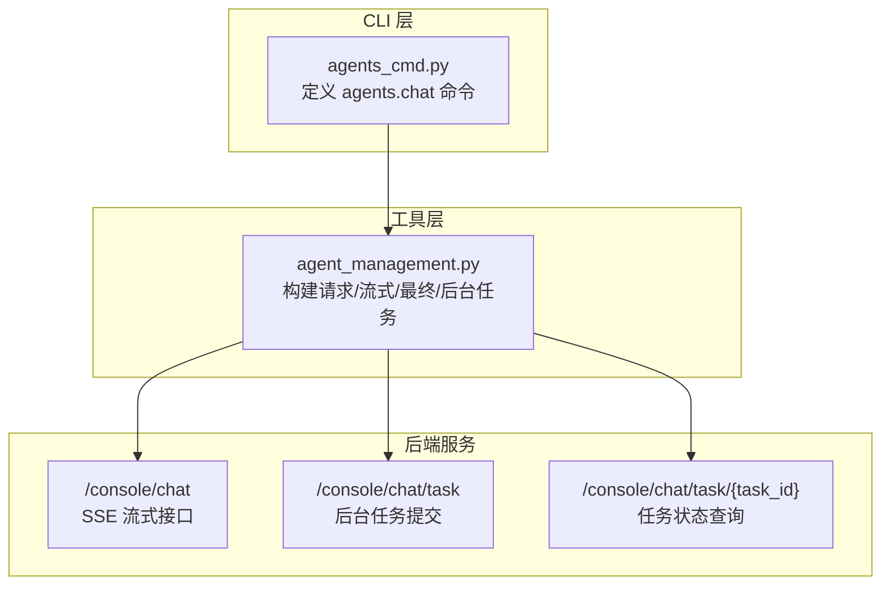
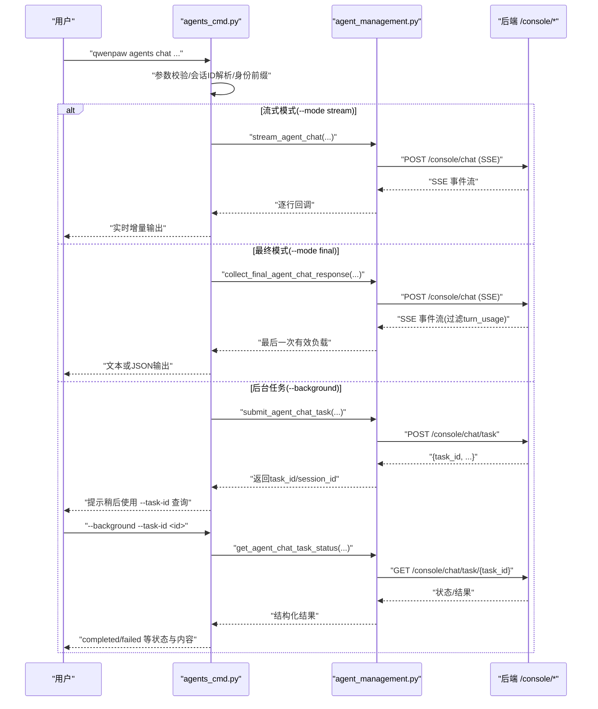
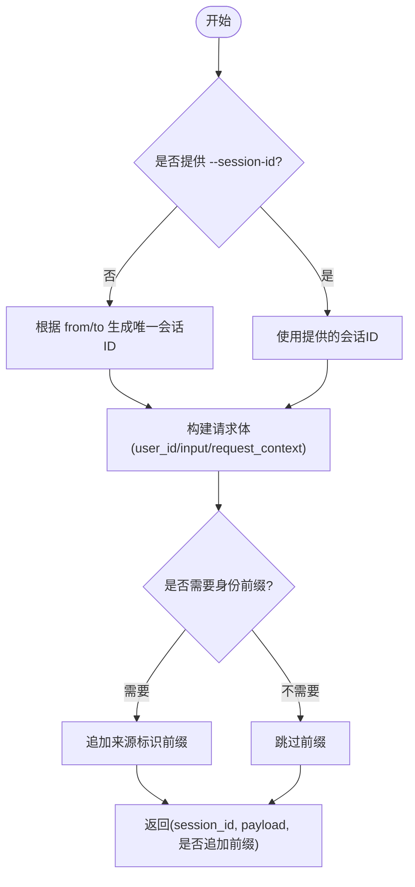
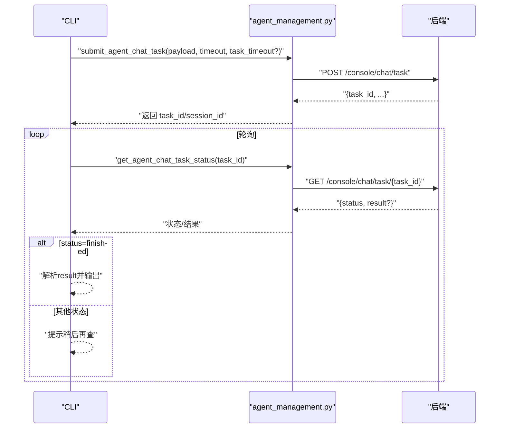
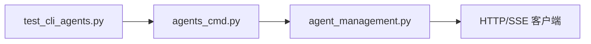

# Agent 对话与通信命令

<cite>
**本文引用的文件**
- [agents_cmd.py](file://src/qwenpaw/cli/agents_cmd.py)
- [agent_management.py](file://src/qwenpaw/agents/tools/agent_management.py)
- [test_cli_agents.py](file://tests/unit/cli/test_cli_agents.py)
</cite>

## 目录
1. [简介](#简介)
2. [项目结构](#项目结构)
3. [核心组件](#核心组件)
4. [架构总览](#架构总览)
5. [详细组件分析](#详细组件分析)
6. [依赖关系分析](#依赖关系分析)
7. [性能考虑](#性能考虑)
8. [故障排查指南](#故障排查指南)
9. [结论](#结论)
10. [附录](#附录)

## 简介
本文件面向使用 CLI 进行“Agent 间对话与通信”的用户与开发者，聚焦于命令 qwenpaw agents chat 的完整能力说明。内容覆盖：
- 实时流式响应（stream）
- 最终模式响应（final）
- 后台任务提交、状态检查与结果获取
- 多 Agent 协作场景下的消息传递机制（源 Agent 与目标 Agent 配置）
- 会话管理（会话 ID 复用与上下文保持）
- 不同响应模式的对比分析与性能优化建议

## 项目结构
与 qwenpaw agents chat 直接相关的代码主要位于 CLI 层与工具层：
- CLI 命令入口与参数解析：src/qwenpaw/cli/agents_cmd.py
- 请求构建、SSE 流处理、后台任务提交与状态查询：src/qwenpaw/agents/tools/agent_management.py
- 单元测试验证行为与输出格式：tests/unit/cli/test_cli_agents.py

图表来源
- [agents_cmd.py:726-970](file://src/qwenpaw/cli/agents_cmd.py#L726-L970)
- [agent_management.py:198-353](file://src/qwenpaw/agents/tools/agent_management.py#L198-L353)

章节来源
- [agents_cmd.py:726-970](file://src/qwenpaw/cli/agents_cmd.py#L726-L970)
- [agent_management.py:198-353](file://src/qwenpaw/agents/tools/agent_management.py#L198-L353)

## 核心组件
- 命令入口与参数校验
  - 负责解析 --from-agent/--to-agent/--text/--session-id/--mode/--background/--task-id/--timeout/--task-timeout/--json-output/--base-url 等参数，并执行参数合法性校验。
- 请求构建与会话管理
  - 自动为消息添加来源标识前缀；根据 from_agent 与 to_agent 生成或复用 session_id；将 root_session_id 透传用于跨会话审批路由。
- 三种响应模式
  - stream：逐行打印 SSE 事件
  - final：收集最后一个非元数据 SSE 负载作为最终响应
  - background：提交后台任务，返回 task_id 与 session_id，后续通过 --task-id 查询状态与结果
- 后台任务工作流
  - 提交任务 -> 轮询状态 -> 完成时展示成功或失败信息

章节来源
- [agents_cmd.py:142-292](file://src/qwenpaw/cli/agents_cmd.py#L142-L292)
- [agents_cmd.py:726-970](file://src/qwenpaw/cli/agents_cmd.py#L726-L970)
- [agent_management.py:198-353](file://src/qwenpaw/agents/tools/agent_management.py#L198-L353)

## 架构总览
下图展示了从 CLI 到后端服务的端到端调用路径，包括流式与后台任务两种典型流程。

图表来源
- [agents_cmd.py:726-970](file://src/qwenpaw/cli/agents_cmd.py#L726-L970)
- [agent_management.py:262-353](file://src/qwenpaw/agents/tools/agent_management.py#L262-L353)

## 详细组件分析

### 命令参数与行为
- 必填项与互斥性
  - 非查询任务状态时，--from-agent、--to-agent、--text 必须提供
  - --task-id 必须与 --background 同时使用
  - --background 与 --mode stream 互斥
- 会话管理
  - 未指定 --session-id 时自动生成唯一会话 ID
  - 指定 --session-id 可复用上下文，实现连续对话
- 身份前缀
  - 系统自动在消息前追加来源标识，避免目标 Agent 混淆消息来源
- 输出模式
  - 默认文本模式：首行显示 [SESSION: xxx]，随后是正文
  - --json-output：输出包含元数据的完整 JSON
  - --mode stream：逐行输出 SSE 事件
  - --background：立即返回 task_id 与 session_id，后续用 --task-id 查询

章节来源
- [agents_cmd.py:142-292](file://src/qwenpaw/cli/agents_cmd.py#L142-L292)
- [agents_cmd.py:726-970](file://src/qwenpaw/cli/agents_cmd.py#L726-L970)

### 请求构建与会话 ID 解析
- 会话 ID 策略
  - 若显式传入 --session-id，则复用该会话 ID
  - 否则基于 from_agent 与 to_agent 生成唯一会话 ID，确保并发安全
- 消息体构造
  - 设置 user_id 为调用方 Agent ID
  - input 中携带 role=user 的消息块
  - request_context.root_agent_id 记录根调用者
  - 可选 root_session_id 透传以支持跨会话审批路由
- 身份前缀
  - 当未显式包含来源标识时，自动在文本前追加来源标记

图表来源
- [agent_management.py:198-242](file://src/qwenpaw/agents/tools/agent_management.py#L198-L242)

章节来源
- [agent_management.py:198-242](file://src/qwenpaw/agents/tools/agent_management.py#L198-L242)

### 流式响应模式（stream）
- 行为
  - 建立 POST /console/chat 的 SSE 连接
  - 逐行读取事件并通过回调输出
- 适用场景
  - 需要即时反馈、长耗时推理或工具调用的交互
- 注意事项
  - 长时间运行需合理设置 --timeout
  - 终端渲染可能受事件频率影响

章节来源
- [agents_cmd.py:59-73](file://src/qwenpaw/cli/agents_cmd.py#L59-L73)
- [agent_management.py:262-285](file://src/qwenpaw/agents/tools/agent_management.py#L262-L285)

### 最终模式响应（final）
- 行为
  - 同样基于 SSE，但会过滤掉 turn_usage 等元数据事件
  - 仅保留最后一个非元数据负载作为最终响应
- 适用场景
  - 仅需最终结果，无需中间过程
- 输出
  - 文本模式：[SESSION: xxx] + 正文
  - JSON 模式：完整响应对象

章节来源
- [agents_cmd.py:75-103](file://src/qwenpaw/cli/agents_cmd.py#L75-L103)
- [agent_management.py:288-314](file://src/qwenpaw/agents/tools/agent_management.py#L288-L314)

### 后台任务模式（background）
- 提交任务
  - 调用 POST /console/chat/task，返回 task_id 与 session_id
  - 自动关闭 headless tool guard，避免阻塞等待审批
- 查询状态
  - 使用 GET /console/chat/task/{task_id} 轮询
  - 状态流转：submitted → pending → running → finished
  - finished 下 result.status 为 completed 或 failed
- 结果展示
  - 完成：输出 [SESSION: xxx] 与正文
  - 失败：输出错误信息

图表来源
- [agent_management.py:317-353](file://src/qwenpaw/agents/tools/agent_management.py#L317-L353)
- [agents_cmd.py:105-140](file://src/qwenpaw/cli/agents_cmd.py#L105-L140)
- [agents_cmd.py:192-292](file://src/qwenpaw/cli/agents_cmd.py#L192-L292)

章节来源
- [agents_cmd.py:105-140](file://src/qwenpaw/cli/agents_cmd.py#L105-L140)
- [agents_cmd.py:192-292](file://src/qwenpaw/cli/agents_cmd.py#L192-L292)
- [agent_management.py:317-353](file://src/qwenpaw/agents/tools/agent_management.py#L317-L353)

### 多 Agent 协作的消息传递机制
- 源 Agent 与目标 Agent
  - --from-agent 指定消息来源（可为空，由运行时推断）
  - --to-agent 指定目标 Agent（通过 X-Agent-Id 头路由）
- 身份前缀与溯源
  - 自动为消息追加来源标识，便于下游 Agent 识别调用方
  - request_context.root_agent_id 记录根调用者，便于审计与追踪
- 会话隔离与复用
  - 会话 ID 按 from/to 组合生成，避免并发冲突
  - 可通过 --session-id 复用上下文，实现连续对话

章节来源
- [agent_management.py:198-242](file://src/qwenpaw/agents/tools/agent_management.py#L198-L242)
- [agent_management.py:245-259](file://src/qwenpaw/agents/tools/agent_management.py#L245-L259)
- [agents_cmd.py:822-855](file://src/qwenpaw/cli/agents_cmd.py#L822-L855)

### 会话管理：会话 ID 复用与上下文保持
- 默认行为
  - 不传 --session-id：每次新建会话，保证并发安全
- 复用上下文
  - 首次调用输出首行 [SESSION: xxx]，下次传入相同 --session-id 即可延续上下文
- 并发注意
  - 同一会话并发请求可能导致失败，应避免并行写入同一会话

章节来源
- [agents_cmd.py:744-752](file://src/qwenpaw/cli/agents_cmd.py#L744-L752)
- [agents_cmd.py:846-850](file://src/qwenpaw/cli/agents_cmd.py#L846-L850)

### 响应模式对比与选择建议
- stream
  - 优点：低延迟感知、适合长任务可视化
  - 缺点：终端渲染开销、不适合批量处理
- final
  - 优点：简洁、易解析、适合脚本化
  - 缺点：无中间反馈
- background
  - 优点：不阻塞主流程、适合复杂任务
  - 缺点：需轮询状态、网络往返较多

章节来源
- [agents_cmd.py:754-761](file://src/qwenpaw/cli/agents_cmd.py#L754-L761)
- [agents_cmd.py:762-778](file://src/qwenpaw/cli/agents_cmd.py#L762-L778)

## 依赖关系分析
- CLI 层依赖工具层
  - agents_cmd.py 通过 agent_tools 模块调用请求构建、流式与后台任务相关函数
- 工具层依赖 HTTP 客户端与 SSE 解析
  - agent_management.py 封装了 create_agent_api_client、parse_agent_sse_line 等
- 测试用例验证关键行为
  - 确认共享请求构建器被使用、输出包含 SESSION 与正文、帮助信息不再暴露旧标志

图表来源
- [agents_cmd.py:726-970](file://src/qwenpaw/cli/agents_cmd.py#L726-L970)
- [agent_management.py:198-353](file://src/qwenpaw/agents/tools/agent_management.py#L198-L353)
- [test_cli_agents.py:39-85](file://tests/unit/cli/test_cli_agents.py#L39-L85)

章节来源
- [agents_cmd.py:726-970](file://src/qwenpaw/cli/agents_cmd.py#L726-L970)
- [agent_management.py:198-353](file://src/qwenpaw/agents/tools/agent_management.py#L198-L353)
- [test_cli_agents.py:39-85](file://tests/unit/cli/test_cli_agents.py#L39-L85)

## 性能考虑
- 超时控制
  - 合理设置 --timeout 与 --task-timeout，避免长时间阻塞
- 流式 vs 最终
  - 流式模式在网络与终端渲染上开销更大，适合交互式；最终模式更适合批处理
- 会话并发
  - 避免对同一 --session-id 并发写入，必要时为每个并发请求分配独立会话
- 后台任务
  - 轮询间隔建议随任务复杂度调整，避免频繁请求造成服务端压力

[本节为通用指导，不直接分析具体文件]

## 故障排查指南
- 常见错误
  - 缺少必要参数：--from-agent/--to-agent/--text 在非任务查询模式下必须提供
  - 参数互斥：--background 与 --mode stream 不可同时使用；--task-id 必须配合 --background
  - 任务不存在：查询任务状态时出现 404，表示任务已过期或从未存在
- 诊断步骤
  - 使用 --json-output 查看完整响应，定位字段缺失或异常
  - 降低并发、更换会话 ID 排查会话冲突
  - 适当增大 --timeout 或 --task-timeout 应对慢任务

章节来源
- [agents_cmd.py:142-190](file://src/qwenpaw/cli/agents_cmd.py#L142-L190)
- [agents_cmd.py:278-292](file://src/qwenpaw/cli/agents_cmd.py#L278-L292)

## 结论
qwenpaw agents chat 提供了完整的 Agent 间对话与通信能力，涵盖流式、最终与后台任务三种模式，并通过会话 ID 管理与身份前缀机制保障多 Agent 协作的正确性与可追溯性。结合合理的超时与并发策略，可在不同场景下取得良好的用户体验与系统性能。

[本节为总结性内容，不直接分析具体文件]

## 附录
- 示例用法
  - 简单对话：新会话，自动输出 [SESSION: xxx]
  - 继续对话：复用上一轮的 session_id
  - 后台任务：提交后立即返回 task_id，稍后用 --task-id 查询
- 前置条件
  - 使用 agents list 发现可用 Agent
  - 确保目标 Agent 已配置且运行
  - 可选：使用 chats list 查找已有会话

章节来源
- [agents_cmd.py:857-890](file://src/qwenpaw/cli/agents_cmd.py#L857-L890)