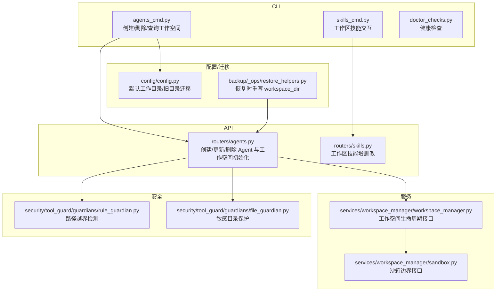
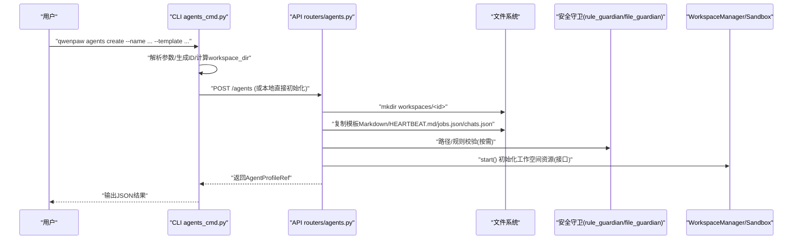
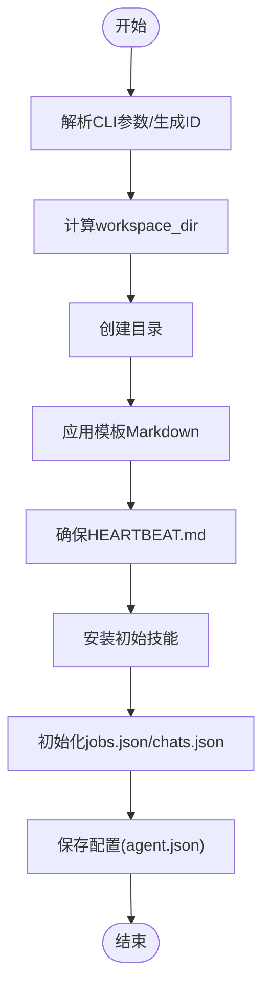
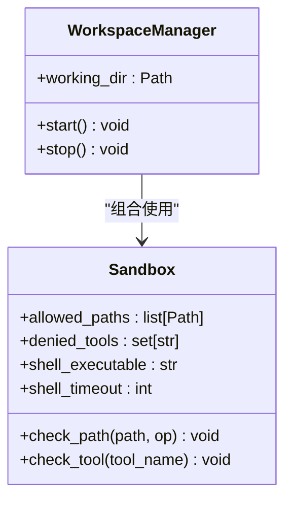
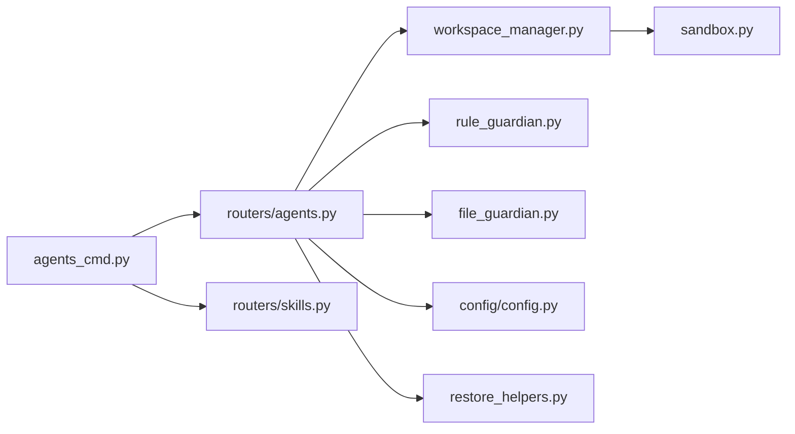

# Agent 工作空间管理

<cite>
**本文引用的文件列表**
- [agents_cmd.py](file://src/qwenpaw/cli/agents_cmd.py)
- [agents.py](file://src/qwenpaw/app/routers/agents.py)
- [workspace_manager.py](file://src/qwenpaw/services/workspace_manager/workspace_manager.py)
- [sandbox.py](file://src/qwenpaw/services/workspace_manager/sandbox.py)
- [config.py](file://src/qwenpaw/config/config.py)
- [skills_cmd.py](file://src/qwenpaw/cli/skills_cmd.py)
- [skills.py](file://src/qwenpaw/app/routers/skills.py)
- [pool_service.py](file://src/qwenpaw/agents/skill_system/pool_service.py)
- [rule_guardian.py](file://src/qwenpaw/security/tool_guard/guardians/rule_guardian.py)
- [file_guardian.py](file://src/qwenpaw/security/tool_guard/guardians/file_guardian.py)
- [doctor_checks.py](file://src/qwenpaw/cli/doctor_checks.py)
- [restore_helpers.py](file://src/qwenpaw/backup/_ops/restore_helpers.py)
</cite>

## 目录
1. [简介](#简介)
2. [项目结构](#项目结构)
3. [核心组件](#核心组件)
4. [架构总览](#架构总览)
5. [详细组件分析](#详细组件分析)
6. [依赖关系分析](#依赖关系分析)
7. [性能与容量建议](#性能与容量建议)
8. [故障排查指南](#故障排查指南)
9. [结论](#结论)
10. [附录：常用命令速查](#附录常用命令速查)

## 简介
本文件面向使用 CLI 进行 Agent 工作空间管理的用户与运维人员，系统性说明工作空间的目录结构与文件组织、创建流程（模板应用、初始文件生成、技能环境配置）、备份恢复与迁移方法、安全策略（路径验证与访问控制），以及监控与维护工具的使用与常见问题排查。文档以源码为依据，提供可追溯的章节来源与图示。

## 项目结构
围绕“工作空间”的关键代码分布在以下模块：
- CLI 层：负责解析参数、调用后端 API、本地路径校验与删除等
- API 层：负责创建工作空间、写入默认文件、安装初始技能
- 服务层：定义工作空间资源管理与沙箱边界接口
- 安全层：实现路径白名单/黑名单、规则守卫、敏感目录保护
- 配置与迁移：工作区默认位置、历史数据迁移
- 诊断与修复：健康检查、磁盘与锁文件扫描、cron 任务文件校验

图表来源
- [agents_cmd.py:505-633](file://src/qwenpaw/cli/agents_cmd.py#L505-L633)
- [agents.py:272-364](file://src/qwenpaw/app/routers/agents.py#L272-L364)
- [workspace_manager.py:24-56](file://src/qwenpaw/services/workspace_manager/workspace_manager.py#L24-L56)
- [sandbox.py:24-81](file://src/qwenpaw/services/workspace_manager/sandbox.py#L24-L81)
- [rule_guardian.py:142-173](file://src/qwenpaw/security/tool_guard/guardians/rule_guardian.py#L142-L173)
- [file_guardian.py:45-78](file://src/qwenpaw/security/tool_guard/guardians/file_guardian.py#L45-L78)
- [config.py:2577-2605](file://src/qwenpaw/config/config.py#L2577-L2605)
- [restore_helpers.py:112-116](file://src/qwenpaw/backup/_ops/restore_helpers.py#L112-L116)

章节来源
- [agents_cmd.py:505-633](file://src/qwenpaw/cli/agents_cmd.py#L505-L633)
- [agents.py:272-364](file://src/qwenpaw/app/routers/agents.py#L272-L364)
- [workspace_manager.py:24-56](file://src/qwenpaw/services/workspace_manager/workspace_manager.py#L24-L56)
- [sandbox.py:24-81](file://src/qwenpaw/services/workspace_manager/sandbox.py#L24-L81)
- [rule_guardian.py:142-173](file://src/qwenpaw/security/tool_guard/guardians/rule_guardian.py#L142-L173)
- [file_guardian.py:45-78](file://src/qwenpaw/security/tool_guard/guardians/file_guardian.py#L45-L78)
- [config.py:2577-2605](file://src/qwenpaw/config/config.py#L2577-L2605)
- [restore_helpers.py:112-116](file://src/qwenpaw/backup/_ops/restore_helpers.py#L112-L116)

## 核心组件
- CLI agents 子命令：创建、删除、列出 Agent，并在工作空间层面执行路径校验与清理
- API 工作空间初始化：复制模板 Markdown、创建 HEARTBEAT.md、初始化 jobs.json/chats.json、安装初始技能
- 工作空间管理器与沙箱：定义工作空间资源生命周期与资源边界检查契约
- 安全守卫：路径越界检测、敏感目录保护、Shell 重定向与危险操作识别
- 配置与迁移：默认工作目录、旧目录数据迁移
- 诊断与健康检查：工作区完整性、jobs.json 校验、大目录提示

章节来源
- [agents_cmd.py:330-444](file://src/qwenpaw/cli/agents_cmd.py#L330-L444)
- [agents.py:487-612](file://src/qwenpaw/app/routers/agents.py#L487-L612)
- [workspace_manager.py:24-56](file://src/qwenpaw/services/workspace_manager/workspace_manager.py#L24-L56)
- [sandbox.py:24-81](file://src/qwenpaw/services/workspace_manager/sandbox.py#L24-L81)
- [rule_guardian.py:142-173](file://src/qwenpaw/security/tool_guard/guardians/rule_guardian.py#L142-L173)
- [file_guardian.py:45-78](file://src/qwenpaw/security/tool_guard/guardians/file_guardian.py#L45-L78)
- [config.py:2577-2605](file://src/qwenpaw/config/config.py#L2577-L2605)
- [doctor_checks.py:431-450](file://src/qwenpaw/cli/doctor_checks.py#L431-L450)

## 架构总览
下图展示了从 CLI 到 API 再到工作空间初始化与安全控制的端到端流程。

图表来源
- [agents_cmd.py:505-633](file://src/qwenpaw/cli/agents_cmd.py#L505-L633)
- [agents.py:272-364](file://src/qwenpaw/app/routers/agents.py#L272-L364)
- [agents.py:487-612](file://src/qwenpaw/app/routers/agents.py#L487-L612)
- [workspace_manager.py:44-56](file://src/qwenpaw/services/workspace_manager/workspace_manager.py#L44-L56)
- [sandbox.py:58-81](file://src/qwenpaw/services/workspace_manager/sandbox.py#L58-L81)
- [rule_guardian.py:142-173](file://src/qwenpaw/security/tool_guard/guardians/rule_guardian.py#L142-L173)
- [file_guardian.py:45-78](file://src/qwenpaw/security/tool_guard/guardians/file_guardian.py#L45-L78)

## 详细组件分析

### 工作空间目录结构与文件组织
- 根目录：由配置决定，默认位于 WORKING_DIR/workspaces/<agent_id>
- 必要目录与文件：
  - sessions/：会话存储
  - memory/：记忆存储
  - skills/：工作区技能目录
  - AGENTS.md / SOUL.md / PROFILE.md：模板生成的角色与行为描述
  - HEARTBEAT.md：心跳清单（按语言生成）
  - jobs.json：定时任务清单
  - chats.json：聊天记录清单
  - agent.json：Agent 配置文件（由保存逻辑写入）
- 旧版兼容：首次启动会将 ~/.copaw 下的 sessions、memory、jobs.json 及若干 MD 文件迁移至新默认工作区

章节来源
- [agents.py:568-612](file://src/qwenpaw/app/routers/agents.py#L568-L612)
- [config.py:2577-2605](file://src/qwenpaw/config/config.py#L2577-L2605)

### 工作空间创建流程（CLI + API）
- CLI 侧：
  - 解析 name、agent-id、workspace-dir、template、skill、provider-id/model-id 等参数
  - 生成唯一 ID，计算 workspace_dir（若未指定则使用 WORKING_DIR/workspaces/<id>）
  - 调用共享初始化逻辑完成工作空间准备
  - 将 AgentProfileRef 持久化到全局配置，并保存 agent.json
- API 侧：
  - 校验 id 合法性，生成或复用自定义 id
  - 创建目录，根据语言复制模板 Markdown，确保 HEARTBEAT.md 存在
  - 安装初始技能（从技能池下载）
  - 初始化 jobs.json 与 chats.json
  - 保存配置并返回引用

图表来源
- [agents_cmd.py:505-633](file://src/qwenpaw/cli/agents_cmd.py#L505-L633)
- [agents.py:272-364](file://src/qwenpaw/app/routers/agents.py#L272-L364)
- [agents.py:487-612](file://src/qwenpaw/app/routers/agents.py#L487-L612)

章节来源
- [agents_cmd.py:330-444](file://src/qwenpaw/cli/agents_cmd.py#L330-L444)
- [agents.py:272-364](file://src/qwenpaw/app/routers/agents.py#L272-L364)
- [agents.py:487-612](file://src/qwenpaw/app/routers/agents.py#L487-L612)

### 模板应用与初始文件生成
- 模板 Markdown：根据语言与模板 ID 复制通用与模板特定文件
- HEARTBEAT.md：若不存在则按语言写入默认清单
- jobs.json/chats.json：若不存在则写入空结构版本
- 初始技能：通过 SkillPoolService 下载并安装到工作区 skills/

章节来源
- [agents.py:487-612](file://src/qwenpaw/app/routers/agents.py#L487-L612)
- [pool_service.py:728-745](file://src/qwenpaw/agents/skill_system/pool_service.py#L728-L745)

### 技能环境配置（工作区技能）
- 工作区技能目录：get_workspace_skills_dir(workspace_dir)/<skill_name>
- 启用/禁用：通过工作区 manifest 修改 entry.enabled
- 同步到技能池：支持将工作区技能发布到池，供其他工作区复用
- 重命名/迁移：在迁移过程中对同名不同内容技能添加后缀区分

章节来源
- [skills_cmd.py:129-160](file://src/qwenpaw/cli/skills_cmd.py#L129-L160)
- [skills.py:414-434](file://src/qwenpaw/app/routers/skills.py#L414-L434)
- [pool_service.py:728-745](file://src/qwenpaw/agents/skill_system/pool_service.py#L728-L745)

### 备份、恢复与迁移
- 备份：可通过控制台或脚本对工作区打包；注意包含 agent.json、sessions、memory、jobs.json、chats.json、skills/ 等关键目录
- 恢复：
  - restore_helpers 会重写目标工作区的 agent.json 中的 workspace_dir，修正跨设备/用户名差异导致的路径漂移
  - 技能恢复：从备份目录还原 skill 目录并更新工作区 manifest
- 迁移：
  - 首次启动自动将旧目录 ~/.copaw 下的关键文件复制到新默认工作区
  - 技能目录迁移：active_skills/customized_skills 迁移到工作区 skills/，保留旧目录直至确认无误后手动清理

章节来源
- [restore_helpers.py:112-116](file://src/qwenpaw/backup/_ops/restore_helpers.py#L112-L116)
- [skills.py:414-434](file://src/qwenpaw/app/routers/skills.py#L414-L434)
- [config.py:2577-2605](file://src/qwenpaw/config/config.py#L2577-L2605)

### 安全策略：路径验证与访问控制
- 路径越界检测：
  - rule_guardian 将相对路径基于当前工作区解析为绝对路径，并判断是否超出工作区范围
  - Windows 下不同盘符视为越界
- 敏感目录保护：
  - file_guardian 内置兼容的敏感目录集合，支持绝对/相对/家目录路径，并以目录结尾表示递归保护
- 沙箱边界：
  - Sandbox.check_path/check_tool 用于在执行前校验路径与工具名，违反则抛出异常
- 工作区删除限制：
  - CLI 删除工作区前强制校验其必须位于 WORKING_DIR 之下，防止误删外部目录

图表来源
- [workspace_manager.py:24-56](file://src/qwenpaw/services/workspace_manager/workspace_manager.py#L24-L56)
- [sandbox.py:24-81](file://src/qwenpaw/services/workspace_manager/sandbox.py#L24-L81)

章节来源
- [rule_guardian.py:142-173](file://src/qwenpaw/security/tool_guard/guardians/rule_guardian.py#L142-L173)
- [file_guardian.py:45-78](file://src/qwenpaw/security/tool_guard/guardians/file_guardian.py#L45-L78)
- [agents_cmd.py:412-444](file://src/qwenpaw/cli/agents_cmd.py#L412-L444)

### 工作空间监控与维护工具
- 健康检查：
  - 检查每个 Agent 的工作区是否存在且包含 agent.json
  - 校验 jobs.json 结构，统计大目录条目数并给出清理建议
  - 扫描多卷挂载与剩余空间，避免写入失败
- 日志与决策：
  - 可在治理日志中查看 sandbox 实际使用的后端与决策结果

章节来源
- [doctor_checks.py:431-450](file://src/qwenpaw/cli/doctor_checks.py#L431-L450)
- [doctor_checks.py:716-738](file://src/qwenpaw/cli/doctor_checks.py#L716-L738)

## 依赖关系分析
- CLI 与 API 解耦：CLI 通过 HTTP 调用 API 或直接复用初始化逻辑，降低重复实现
- 安全与执行分离：Tool Guard 与 Sandbox 分别负责内容安全与资源边界，互不耦合
- 配置与迁移：config 层提供默认工作目录与旧目录迁移，保证平滑升级
- 技能系统：SkillPoolService 与 WorkSpace Service 协作，实现下载、安装、启用、重命名与迁移

图表来源
- [agents_cmd.py:505-633](file://src/qwenpaw/cli/agents_cmd.py#L505-L633)
- [agents.py:272-364](file://src/qwenpaw/app/routers/agents.py#L272-L364)
- [workspace_manager.py:24-56](file://src/qwenpaw/services/workspace_manager/workspace_manager.py#L24-L56)
- [sandbox.py:24-81](file://src/qwenpaw/services/workspace_manager/sandbox.py#L24-L81)
- [rule_guardian.py:142-173](file://src/qwenpaw/security/tool_guard/guardians/rule_guardian.py#L142-L173)
- [file_guardian.py:45-78](file://src/qwenpaw/security/tool_guard/guardians/file_guardian.py#L45-L78)
- [config.py:2577-2605](file://src/qwenpaw/config/config.py#L2577-L2605)
- [restore_helpers.py:112-116](file://src/qwenpaw/backup/_ops/restore_helpers.py#L112-L116)

## 性能与容量建议
- 定期归档或清理 large sessions/memory 目录，避免影响读取性能
- 关注 jobs.json 与 chats.json 规模，必要时拆分或归档
- 在多卷环境下，确保工作区所在卷有足够可用空间，避免写入失败

章节来源
- [doctor_checks.py:716-738](file://src/qwenpaw/cli/doctor_checks.py#L716-L738)

## 故障排查指南
- 无法删除工作区：
  - 现象：报错提示工作区不在 WORKING_DIR 下
  - 处理：将工作区移动到允许目录下，或使用 --remove-workspace 配合确认
- 工作区缺失 agent.json：
  - 现象：健康检查报告缺失
  - 处理：重新创建或从备份恢复
- 技能安装失败：
  - 现象：初始技能安装警告
  - 处理：检查网络与技能池可用性，重试或手动安装
- 路径越界被拒绝：
  - 现象：访问工作区外路径被阻断
  - 处理：调整路径至工作区内，或通过策略配置允许的根路径

章节来源
- [agents_cmd.py:412-444](file://src/qwenpaw/cli/agents_cmd.py#L412-L444)
- [agents.py:487-612](file://src/qwenpaw/app/routers/agents.py#L487-L612)
- [rule_guardian.py:142-173](file://src/qwenpaw/security/tool_guard/guardians/rule_guardian.py#L142-L173)

## 结论
本方案通过 CLI 与 API 协同，实现了标准化的工作空间创建、模板应用、初始文件生成与技能环境配置；结合路径验证、敏感目录保护与沙箱边界，构建了完善的安全策略；同时提供健康检查与迁移能力，保障长期稳定运行。

## 附录：常用命令速查
- 创建 Agent 与工作空间：
  - qwenpaw agents create --name "名称" [--agent-id <id>] [--workspace-dir <路径>] [--template <模板>] [--skill <技能>] [--provider-id <提供者>] [--model-id <模型>]
- 删除 Agent 与工作空间：
  - qwenpaw agents delete <agent_id> [--remove-workspace] [--yes]
- 列出 Agent：
  - qwenpaw agents list
- 工作区技能相关：
  - qwenpaw skills inspect/test/list（参考 skills_cmd.py 提供的交互能力）

章节来源
- [agents_cmd.py:505-633](file://src/qwenpaw/cli/agents_cmd.py#L505-L633)
- [agents_cmd.py:636-724](file://src/qwenpaw/cli/agents_cmd.py#L636-L724)
- [agents_cmd.py:467-503](file://src/qwenpaw/cli/agents_cmd.py#L467-L503)
- [skills_cmd.py:129-160](file://src/qwenpaw/cli/skills_cmd.py#L129-L160)