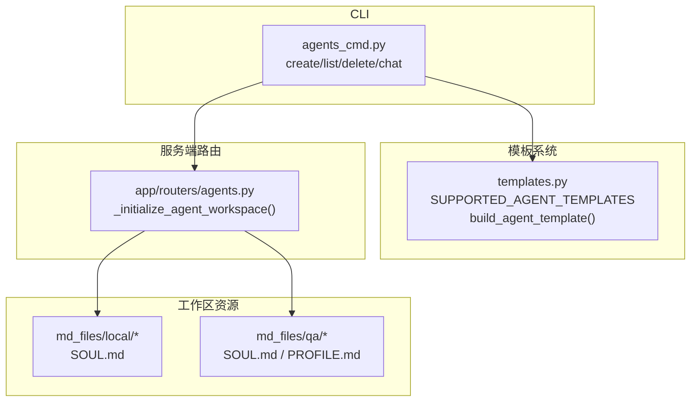
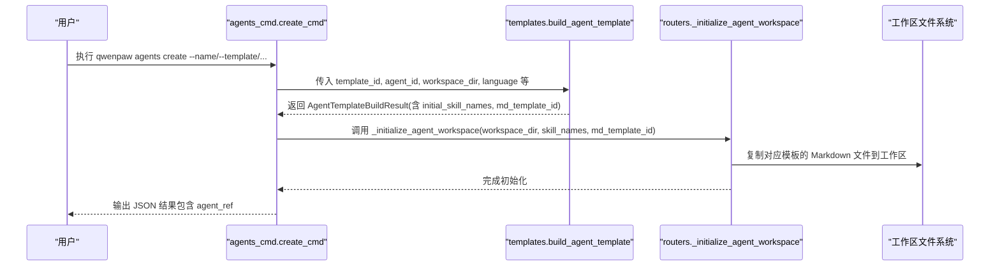
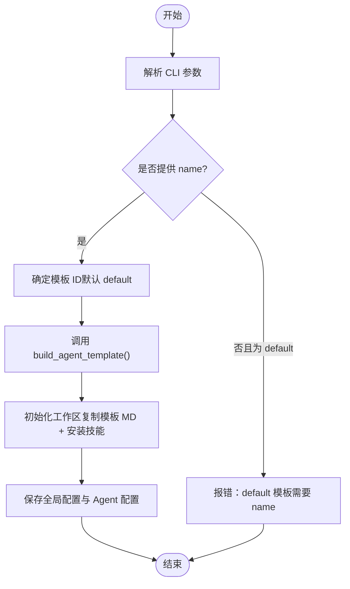
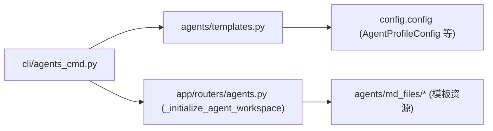

# Agent 模板系统

<cite>
**本文引用的文件**
- [src/qwenpaw/agents/templates.py](file://src/qwenpaw/agents/templates.py)
- [src/qwenpaw/cli/agents_cmd.py](file://src/qwenpaw/cli/agents_cmd.py)
- [src/qwenpaw/app/routers/agents.py](file://src/qwenpaw/app/routers/agents.py)
- [src/qwenpaw/agents/md_files/local/zh/SOUL.md](file://src/qwenpaw/agents/md_files/local/zh/SOUL.md)
- [src/qwenpaw/agents/md_files/qa/zh/SOUL.md](file://src/qwenpaw/agents/md_files/qa/zh/SOUL.md)
- [src/qwenpaw/agents/md_files/qa/zh/PROFILE.md](file://src/qwenpaw/agents/md_files/qa/zh/PROFILE.md)
</cite>

## 目录
1. [简介](#简介)
2. [项目结构](#项目结构)
3. [核心组件](#核心组件)
4. [架构总览](#架构总览)
5. [详细组件分析](#详细组件分析)
6. [依赖关系分析](#依赖关系分析)
7. [性能与扩展性考虑](#性能与扩展性考虑)
8. [故障排查指南](#故障排查指南)
9. [结论](#结论)
10. [附录：模板开发规范与最佳实践](#附录模板开发规范与最佳实践)

## 简介
本文件面向使用 CLI 创建与管理 Agent 的用户与开发者，系统化说明内置 Agent 模板的类型、用途、参数自定义方法、模板文件结构与变量替换机制，并提供自定义模板的开发指南与版本兼容性建议。内容覆盖默认助手、本地运行助手、QA 问答助手等角色模板，以及通过 CLI 和 API 的创建工作流。

## 项目结构
围绕“Agent 模板系统”的关键代码与资源分布如下：
- 模板定义与构建逻辑：位于 agents 模块的模板文件
- CLI 入口与命令实现：位于 cli 子模块
- 工作区 Markdown 模板资源：位于 agents/md_files 下的多语言模板文件
- 服务端路由与工作区初始化：位于 app/routers 下

图表来源
- [src/qwenpaw/cli/agents_cmd.py:505-633](file://src/qwenpaw/cli/agents_cmd.py#L505-L633)
- [src/qwenpaw/agents/templates.py:20-136](file://src/qwenpaw/agents/templates.py#L20-L136)
- [src/qwenpaw/app/routers/agents.py:129-200](file://src/qwenpaw/app/routers/agents.py#L129-L200)

章节来源
- [src/qwenpaw/agents/templates.py:20-136](file://src/qwenpaw/agents/templates.py#L20-L136)
- [src/qwenpaw/cli/agents_cmd.py:505-633](file://src/qwenpaw/cli/agents_cmd.py#L505-L633)
- [src/qwenpaw/app/routers/agents.py:129-200](file://src/qwenpaw/app/routers/agents.py#L129-L200)

## 核心组件
- 模板清单与构建器
  - 支持模板集合：default、local、qa
  - 构建函数：根据模板 ID 生成 AgentProfileConfig、初始技能列表、工作区 Markdown 模板 ID
- CLI 命令 create
  - 接收名称、描述、语言、模板、初始技能、活跃模型等参数
  - 调用模板构建器并初始化工作区，保存配置
- 工作区 Markdown 模板
  - local 模板提供 SOUL.md（行为准则）
  - qa 模板提供 SOUL.md 与 PROFILE.md（身份与用户资料）

章节来源
- [src/qwenpaw/agents/templates.py:20-136](file://src/qwenpaw/agents/templates.py#L20-L136)
- [src/qwenpaw/cli/agents_cmd.py:505-633](file://src/qwenpaw/cli/agents_cmd.py#L505-L633)
- [src/qwenpaw/agents/md_files/local/zh/SOUL.md:1-102](file://src/qwenpaw/agents/md_files/local/zh/SOUL.md#L1-L102)
- [src/qwenpaw/agents/md_files/qa/zh/SOUL.md:1-24](file://src/qwenpaw/agents/md_files/qa/zh/SOUL.md#L1-L24)
- [src/qwenpaw/agents/md_files/qa/zh/PROFILE.md:1-26](file://src/qwenpaw/agents/md_files/qa/zh/PROFILE.md#L1-L26)

## 架构总览
下图展示从 CLI 到模板构建再到工作区初始化的完整流程。

图表来源
- [src/qwenpaw/cli/agents_cmd.py:505-633](file://src/qwenpaw/cli/agents_cmd.py#L505-L633)
- [src/qwenpaw/agents/templates.py:59-136](file://src/qwenpaw/agents/templates.py#L59-L136)
- [src/qwenpaw/app/routers/agents.py:351-363](file://src/qwenpaw/app/routers/agents.py#L351-L363)

## 详细组件分析

### 内置模板类型与用途
- default（默认助手）
  - 用途：通用助手，不预设额外工具或技能，适合快速创建基础 Agent
  - 要求：必须提供 name
  - 初始技能：无
  - 工作区模板：无（不映射特定 md 模板）
- local（本地助手）
  - 用途：面向本地部署模型的助手，预置本地相关工具集
  - 初始技能：make_plan
  - 工作区模板：local（SOUL.md）
- qa（问答助手）
  - 用途：QwenPaw 安装、配置、文档相关的问答助手
  - 初始技能：内置 QA 技能集合
  - 工作区模板：qa（SOUL.md、PROFILE.md）

章节来源
- [src/qwenpaw/agents/templates.py:20-136](file://src/qwenpaw/agents/templates.py#L20-L136)
- [src/qwenpaw/agents/md_files/local/zh/SOUL.md:1-102](file://src/qwenpaw/agents/md_files/local/zh/SOUL.md#L1-L102)
- [src/qwenpaw/agents/md_files/qa/zh/SOUL.md:1-24](file://src/qwenpaw/agents/md_files/qa/zh/SOUL.md#L1-L24)
- [src/qwenpaw/agents/md_files/qa/zh/PROFILE.md:1-26](file://src/qwenpaw/agents/md_files/qa/zh/PROFILE.md#L1-L26)

### CLI 参数与模板自定义
- 关键参数
  - --name：必填，用于 default 模板；其他模板可覆盖默认名
  - --agent-id：可选，未提供则自动生成唯一 ID
  - --description：可选，Agent 描述
  - --workspace-dir：可选，未提供则默认 WORKING_DIR/workspaces/<id>
  - --language：可选，写入 profile 的语言设置
  - --template：选择内置模板（default/local/qa），不传则默认 default
  - --skill：可多次指定，追加初始技能（与模板自带技能合并去重）
  - --provider-id 与 --model-id：成对出现，设置该 Agent 的默认活跃模型
- 参数校验与错误提示
  - default 模板缺少 name 会报错
  - provider-id 与 model-id 必须同时提供
  - 不支持的模板 ID 会抛出异常

图表来源
- [src/qwenpaw/cli/agents_cmd.py:505-633](file://src/qwenpaw/cli/agents_cmd.py#L505-L633)
- [src/qwenpaw/agents/templates.py:59-136](file://src/qwenpaw/agents/templates.py#L59-L136)

章节来源
- [src/qwenpaw/cli/agents_cmd.py:505-633](file://src/qwenpaw/cli/agents_cmd.py#L505-L633)
- [src/qwenpaw/agents/templates.py:59-136](file://src/qwenpaw/agents/templates.py#L59-L136)

### 模板文件结构与变量替换机制
- 文件组织
  - local 模板：提供 SOUL.md（行为准则）
  - qa 模板：提供 SOUL.md（气质与原则）、PROFILE.md（身份与用户资料）
- 元数据头
  - 各 Markdown 文件顶部包含 YAML front matter，如 summary、read_when 等字段，用于运行时读取与展示
- 变量替换
  - 当前仓库中未发现针对这些 Markdown 文件的模板变量替换实现；它们作为静态资源被复制到工作区
  - 如需动态填充，可在后续引入模板引擎并在初始化阶段进行渲染

章节来源
- [src/qwenpaw/agents/md_files/local/zh/SOUL.md:1-102](file://src/qwenpaw/agents/md_files/local/zh/SOUL.md#L1-L102)
- [src/qwenpaw/agents/md_files/qa/zh/SOUL.md:1-24](file://src/qwenpaw/agents/md_files/qa/zh/SOUL.md#L1-L24)
- [src/qwenpaw/agents/md_files/qa/zh/PROFILE.md:1-26](file://src/qwenpaw/agents/md_files/qa/zh/PROFILE.md#L1-L26)

### 自定义模板开发指南
- 新增模板步骤
  1. 在 templates.py 中注册新模板 ID，并实现 build_agent_template 分支逻辑
     - 设定默认 name/description/language
     - 配置 tools（可使用现有构建函数或自定义）
     - 指定 initial_skill_names
     - 若需工作区模板，返回对应的 md_template_id
  2. 在工作区资源目录添加模板文件
     - 在 agents/md_files 下新建模板目录（例如 mytpl），按语言放置 SOUL.md、PROFILE.md 等
  3. 更新 get_workspace_md_template_id 以映射新模板 ID
  4. 在 CLI 层无需改动，因 SUPPORTED_AGENT_TEMPLATES 由模板模块导出
- 命名与约定
  - 模板 ID 使用小写英文字母与数字
  - 工作区模板目录名与模板 ID 保持一致，便于映射
- 最佳实践
  - 保持 SOUL.md 简洁明确，聚焦行为边界与安全策略
  - PROFILE.md 仅包含必要身份与偏好信息，避免泄露敏感信息
  - 初始技能尽量幂等，避免重复安装

章节来源
- [src/qwenpaw/agents/templates.py:20-136](file://src/qwenpaw/agents/templates.py#L20-L136)
- [src/qwenpaw/app/routers/agents.py:351-363](file://src/qwenpaw/app/routers/agents.py#L351-L363)

### 模板版本管理与兼容性处理
- 现状
  - 当前仓库未发现显式的模板版本字段或兼容检查逻辑
- 建议方案
  - 在模板元数据中增加 version 字段（例如 YAML front matter 中的 meta 段）
  - 在 build_agent_template 或初始化阶段读取并校验版本范围
  - 对破坏性变更采用向后兼容策略：保留旧字段、提供迁移脚本或降级路径
  - 在 CLI 输出中显示模板版本，便于审计与排障

[本节为概念性建议，不涉及具体源码]

## 依赖关系分析
- CLI 依赖模板模块提供的模板清单与构建函数
- 模板构建函数依赖配置模型与工具集构建函数
- 工作区初始化依赖路由层的统一初始化逻辑，负责复制模板文件与安装技能

图表来源
- [src/qwenpaw/cli/agents_cmd.py:505-633](file://src/qwenpaw/cli/agents_cmd.py#L505-L633)
- [src/qwenpaw/agents/templates.py:20-136](file://src/qwenpaw/agents/templates.py#L20-L136)
- [src/qwenpaw/app/routers/agents.py:351-363](file://src/qwenpaw/app/routers/agents.py#L351-L363)

章节来源
- [src/qwenpaw/cli/agents_cmd.py:505-633](file://src/qwenpaw/cli/agents_cmd.py#L505-L633)
- [src/qwenpaw/agents/templates.py:20-136](file://src/qwenpaw/agents/templates.py#L20-L136)
- [src/qwenpaw/app/routers/agents.py:351-363](file://src/qwenpaw/app/routers/agents.py#L351-L363)

## 性能与扩展性考虑
- 模板构建为轻量操作，主要开销在于工作区文件复制与技能安装
- 建议在批量创建 Agent 时复用 ProviderManager 实例，减少重复初始化
- 对于大型工作区模板，可采用增量复制与缓存策略

[本节为通用指导，不涉及具体源码]

## 故障排查指南
- 常见错误
  - default 模板未提供 name：检查 --name 参数
  - provider-id 与 model-id 未成对：确保两者同时提供
  - 不支持的模板 ID：确认 --template 值在 SUPPORTED_AGENT_TEMPLATES 中
- 定位方法
  - 查看 CLI 输出与错误消息
  - 检查工作区目录是否存在并包含预期模板文件
  - 核对配置文件中的 active_model 与 provider/model 匹配情况

章节来源
- [src/qwenpaw/cli/agents_cmd.py:505-633](file://src/qwenpaw/cli/agents_cmd.py#L505-L633)
- [src/qwenpaw/agents/templates.py:59-136](file://src/qwenpaw/agents/templates.py#L59-L136)

## 结论
本系统通过集中式模板定义与 CLI 集成，提供了开箱即用的 Agent 模板能力。用户可通过命令行快速创建不同角色的 Agent，并根据需求扩展新的模板。未来可在模板元数据与版本管理上进一步增强，以提升可维护性与兼容性。

[本节为总结，不涉及具体源码]

## 附录：模板开发规范与最佳实践
- 模板文件规范
  - 使用 YAML front matter 标注摘要与阅读时机
  - 将行为准则（SOUL.md）与身份资料（PROFILE.md）分离，便于维护
- 安全与边界
  - 避免在模板中硬编码密钥或敏感路径
  - 明确禁止行为与高风险场景的处理策略
- 可观测性与调试
  - 在模板中给出清晰的自检步骤与常见问题定位指引
- 测试与验证
  - 为新模板编写最小化用例，验证工作区初始化与技能安装流程

[本节为通用指导，不涉及具体源码]