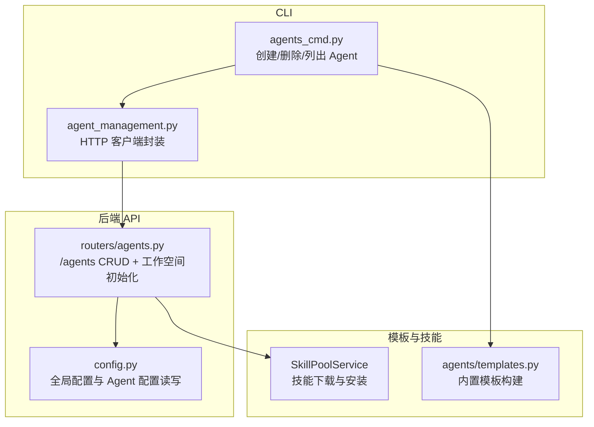
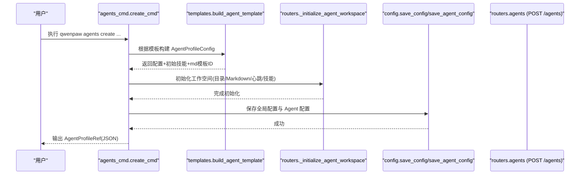
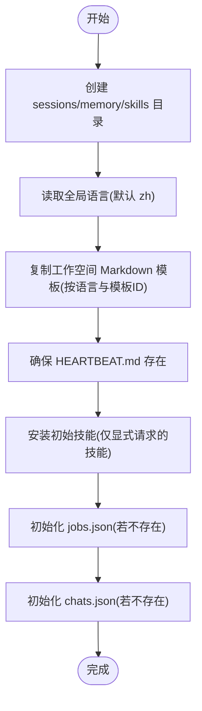
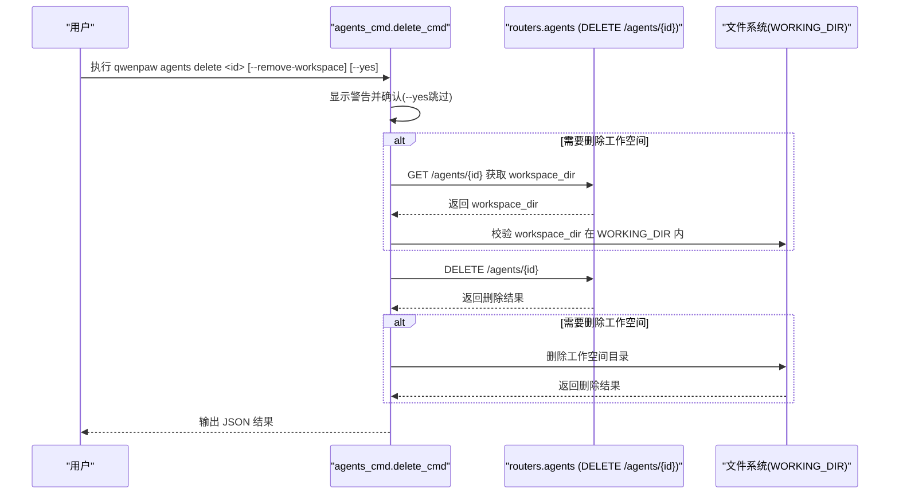
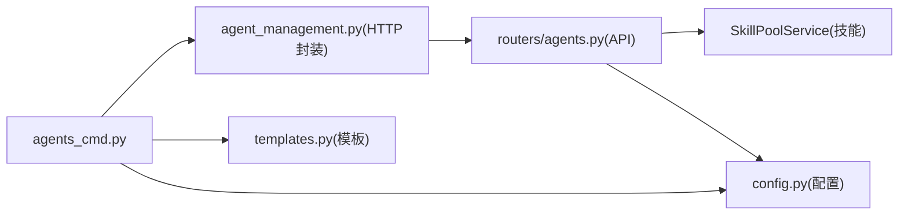

# Agent 生命周期管理命令

<cite>
**本文引用的文件**   
- [agents_cmd.py](file://src/qwenpaw/cli/agents_cmd.py)
- [agents.py](file://src/qwenpaw/app/routers/agents.py)
- [templates.py](file://src/qwenpaw/agents/templates.py)
- [agent_management.py](file://src/qwenpaw/agents/tools/agent_management.py)
- [config.py](file://src/qwenpaw/config/config.py)
</cite>

## 目录
1. [简介](#简介)
2. [项目结构](#项目结构)
3. [核心组件](#核心组件)
4. [架构总览](#架构总览)
5. [详细组件分析](#详细组件分析)
6. [依赖关系分析](#依赖关系分析)
7. [性能与行为特性](#性能与行为特性)
8. [故障排查指南](#故障排查指南)
9. [结论](#结论)

## 简介
本文件面向使用 qwenpaw CLI 的用户，系统化说明 Agent 生命周期管理的核心命令：create、delete、list。内容覆盖：
- create：模板选择、工作空间初始化、技能安装、配置生成与持久化
- delete：安全机制（默认 Agent 保护、删除确认、工作空间清理边界）
- list：查询已配置 Agent 列表及基本信息
- 参数说明、使用示例与错误处理建议

## 项目结构
Agent 生命周期相关能力由 CLI 层与后端 API 层共同实现：
- CLI 层：定义 agents 子命令组，解析参数、调用工具函数或 HTTP 接口
- 后端 API 层：提供 /api/agents 的增删改查与工作空间初始化逻辑
- 模板系统：提供内置 Agent 模板，用于快速生成 Agent 配置与工作空间 Markdown 模板
- 配置系统：维护全局配置中的 Agent 清单、顺序以及每个 Agent 的详细配置

图表来源
- [agents_cmd.py:447-502](file://src/qwenpaw/cli/agents_cmd.py#L447-L502)
- [agents.py:157-205](file://src/qwenpaw/app/routers/agents.py#L157-L205)
- [templates.py:59-136](file://src/qwenpaw/agents/templates.py#L59-L136)
- [agent_management.py:164-171](file://src/qwenpaw/agents/tools/agent_management.py#L164-L171)

章节来源
- [agents_cmd.py:447-502](file://src/qwenpaw/cli/agents_cmd.py#L447-L502)
- [agents.py:157-205](file://src/qwenpaw/app/routers/agents.py#L157-L205)
- [templates.py:59-136](file://src/qwenpaw/agents/templates.py#L59-L136)
- [agent_management.py:164-171](file://src/qwenpaw/agents/tools/agent_management.py#L164-L171)
- [config.py:1470-1489](file://src/qwenpaw/config/config.py#L1470-L1489)

## 核心组件
- CLI 命令组 agents
  - list：通过本地 API 获取所有已配置的 Agent 摘要信息
  - create：基于模板生成 Agent 配置，创建工作空间并安装初始技能，写入全局配置与 Agent 配置
  - delete：通过本地 API 停止并移除 Agent；可选删除工作空间目录（受 WORKING_DIR 限制）
- 后端路由 /agents
  - GET /agents：返回按顺序排列的 Agent 列表（含名称、描述、工作空间路径、启用状态、活跃模型）
  - POST /agents：创建新 Agent（支持自定义 ID、语言、工作空间路径、初始技能、活跃模型）
  - DELETE /agents/{agentId}：删除指定 Agent（禁止删除 default），停止运行实例并从配置中移除
- 模板系统
  - 支持 default、local、qa 三种内置模板，分别对应不同的工具集与初始技能
- 配置系统
  - 根配置维护 profiles 与 agent_order；每个 Agent 的完整配置保存在其工作空间下的 agent.json

章节来源
- [agents_cmd.py:467-502](file://src/qwenpaw/cli/agents_cmd.py#L467-L502)
- [agents_cmd.py:505-633](file://src/qwenpaw/cli/agents_cmd.py#L505-L633)
- [agents_cmd.py:636-723](file://src/qwenpaw/cli/agents_cmd.py#L636-L723)
- [agents.py:157-205](file://src/qwenpaw/app/routers/agents.py#L157-L205)
- [agents.py:272-364](file://src/qwenpaw/app/routers/agents.py#L272-L364)
- [agents.py:401-432](file://src/qwenpaw/app/routers/agents.py#L401-L432)
- [templates.py:20-27](file://src/qwenpaw/agents/templates.py#L20-L27)
- [templates.py:59-136](file://src/qwenpaw/agents/templates.py#L59-L136)
- [config.py:1470-1489](file://src/qwenpaw/config/config.py#L1470-L1489)

## 架构总览
以下序列图展示 create 命令从 CLI 到后端的完整流程，包括模板构建、工作空间初始化、技能安装与配置持久化。

图表来源
- [agents_cmd.py:505-633](file://src/qwenpaw/cli/agents_cmd.py#L505-L633)
- [templates.py:59-136](file://src/qwenpaw/agents/templates.py#L59-L136)
- [agents.py:568-611](file://src/qwenpaw/app/routers/agents.py#L568-L611)
- [config.py:1470-1489](file://src/qwenpaw/config/config.py#L1470-L1489)

## 详细组件分析

### 命令：qwenpaw agents list
- 功能
  - 通过本地 API 获取所有已配置 Agent 的摘要信息，包含 id、name、description、workspace_dir、enabled、active_model
- 关键参数
  - --base-url：覆盖默认 API 地址（如 http://127.0.0.1:8088）
- 输出格式
  - JSON 对象，字段 agents 为数组，每项为 AgentSummary
- 典型用法
  - 列出本机所有 Agent
  - 指定 base-url 访问远程服务
- 错误处理
  - 网络异常或 API 不可达时，底层会抛出异常并由 CLI 打印错误

章节来源
- [agents_cmd.py:467-502](file://src/qwenpaw/cli/agents_cmd.py#L467-L502)
- [agents.py:157-205](file://src/qwenpaw/app/routers/agents.py#L157-L205)
- [agent_management.py:164-171](file://src/qwenpaw/agents/tools/agent_management.py#L164-L171)

### 命令：qwenpaw agents create
- 功能
  - 基于内置模板创建新 Agent，初始化工作空间，安装初始技能，生成并保存配置
- 关键参数
  - --name：必填，人类可读的名称
  - --agent-id：可选，显式指定 ID；未提供则自动生成唯一短 ID
  - --description：可选，描述
  - --workspace-dir：可选，工作空间路径；默认在 WORKING_DIR/workspaces/<id>
  - --language：可选，Agent 语言（影响 Markdown 模板）
  - --template：可选，内置模板选择（default/local/qa）
  - --skill：可重复，初始安装的技能名（与模板自带技能合并去重）
  - --provider-id/--model-id：可选，设置该 Agent 的默认活跃模型（需成对出现且存在）
- 创建流程要点
  - 模板构建：根据模板生成 AgentProfileConfig，并返回初始技能集合与 md 模板 ID
  - 工作空间初始化：创建必要目录（sessions/memory/skills）、复制 Markdown 模板、确保 HEARTBEAT.md、安装初始技能、初始化 jobs.json/chats.json
  - 配置持久化：更新全局配置 profiles 与 agent_order，保存 Agent 配置到工作空间
- 典型用法
  - 使用默认模板创建
  - 使用 qa 模板并安装额外技能
  - 指定 provider/model 作为默认活跃模型
- 错误处理
  - 模板不支持：抛出 Click 异常
  - 缺少必填 name：抛出 Click 异常
  - provider/model 不匹配或未找到：抛出 Click 异常
  - 工作空间路径不在 WORKING_DIR 下：创建阶段不受此限制，但删除阶段会校验

章节来源
- [agents_cmd.py:505-633](file://src/qwenpaw/cli/agents_cmd.py#L505-L633)
- [templates.py:59-136](file://src/qwenpaw/agents/templates.py#L59-L136)
- [agents.py:568-611](file://src/qwenpaw/app/routers/agents.py#L568-L611)
- [config.py:1470-1489](file://src/qwenpaw/config/config.py#L1470-L1489)

#### 工作空间初始化流程图

图表来源
- [agents.py:568-611](file://src/qwenpaw/app/routers/agents.py#L568-L611)

### 命令：qwenpaw agents delete
- 功能
  - 通过本地 API 删除指定 Agent，停止运行实例并从配置中移除；可选择同时删除本地工作空间目录
- 关键参数
  - agent_id：目标 Agent 标识
  - --remove-workspace：是否删除本地工作空间目录
  - --yes：跳过确认提示
  - --base-url：覆盖默认 API 地址
- 安全机制
  - 默认 Agent 保护：服务端拒绝删除 default，返回 400
  - 删除前确认：CLI 默认弹出确认提示（可用 --yes 跳过）
  - 工作空间清理边界：当 --remove-workspace 时，先通过 API 获取 workspace_dir，再校验其位于 WORKING_DIR 之下，然后才执行删除
- 典型用法
  - 仅删除配置（保留工作空间）
  - 删除配置并清理工作空间
  - 静默模式（--yes）
- 错误处理
  - 找不到 Agent：返回 404，CLI 抛出 Click 异常
  - 删除 default：返回 400，CLI 抛出 Click 异常
  - 工作空间不在 WORKING_DIR：抛出 Click 异常，阻止删除
  - 删除失败：根据响应 detail 输出错误

章节来源
- [agents_cmd.py:636-723](file://src/qwenpaw/cli/agents_cmd.py#L636-L723)
- [agents.py:401-432](file://src/qwenpaw/app/routers/agents.py#L401-L432)

#### 删除流程时序图

图表来源
- [agents_cmd.py:636-723](file://src/qwenpaw/cli/agents_cmd.py#L636-L723)
- [agents.py:401-432](file://src/qwenpaw/app/routers/agents.py#L401-L432)

## 依赖关系分析
- CLI 与后端 API
  - list/create/delete 均通过 HTTP 与后端交互；list 直接调用工具函数封装的 HTTP 客户端
- 模板与配置
  - create 依赖模板系统生成 AgentProfileConfig，并通过配置模块持久化
- 工作空间与技能
  - 工作空间初始化由后端统一实现，确保目录结构与基础文件一致；技能安装通过 SkillPoolService 完成

图表来源
- [agents_cmd.py:467-502](file://src/qwenpaw/cli/agents_cmd.py#L467-L502)
- [agent_management.py:164-171](file://src/qwenpaw/agents/tools/agent_management.py#L164-L171)
- [agents.py:568-611](file://src/qwenpaw/app/routers/agents.py#L568-L611)
- [templates.py:59-136](file://src/qwenpaw/agents/templates.py#L59-L136)
- [config.py:1470-1489](file://src/qwenpaw/config/config.py#L1470-L1489)

## 性能与行为特性
- 列表查询
  - 按 agent_order 排序返回，缺失项自动补齐，保证 UI 一致性
- 创建过程
  - 模板构建与配置写入为轻量操作；工作空间初始化涉及磁盘 I/O 与可能的技能下载，耗时取决于技能数量与网络状况
- 删除过程
  - 服务端会停止目标 Agent 实例后再从配置中移除；工作空间删除仅在显式开启时进行，避免误删数据

[本节为通用指导，无需具体文件引用]

## 故障排查指南
- 无法连接 API
  - 检查 --base-url 是否正确，确认后端服务已启动并可访问
- 删除 default 被拒绝
  - 这是预期行为，default 受保护不可删除
- 删除时报“工作空间不在 WORKING_DIR”
  - 请确保工作空间路径位于 WORKING_DIR 之下，或使用默认路径
- 创建时报“模板不支持”
  - 检查 --template 值是否为支持的内置模板之一
- 创建时报“Provider/Model 不存在”
  - 确认 --provider-id 与 --model-id 成对出现且有效
- 列表为空
  - 确认已有 Agent 配置，或先执行 create 创建

章节来源
- [agents_cmd.py:636-723](file://src/qwenpaw/cli/agents_cmd.py#L636-L723)
- [agents.py:401-432](file://src/qwenpaw/app/routers/agents.py#L401-L432)
- [templates.py:59-136](file://src/qwenpaw/agents/templates.py#L59-L136)

## 结论
qwenpaw agents 命令提供了完整的 Agent 生命周期管理能力：
- create 支持模板化快速创建、工作空间初始化与技能安装，便于标准化部署
- delete 具备完善的安全机制，防止误删默认 Agent，并提供可控的工作空间清理
- list 提供稳定的 Agent 发现与信息展示，配合后台 API 保障一致性与可用性

[本节为总结性内容，无需具体文件引用]