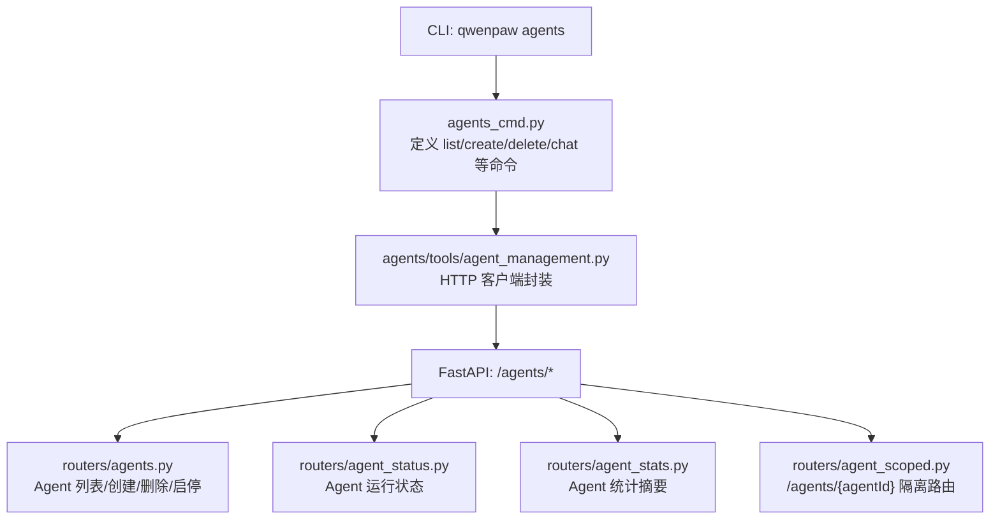
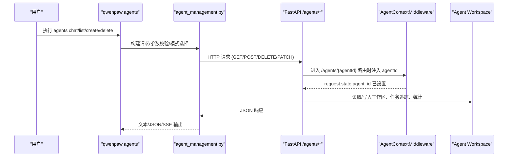
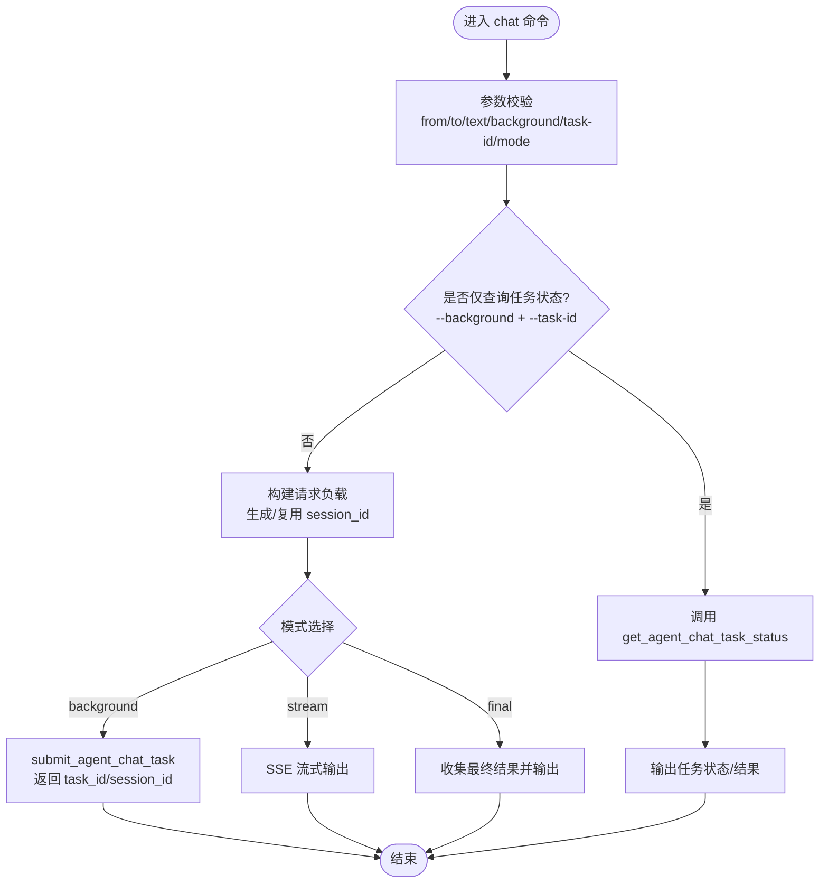
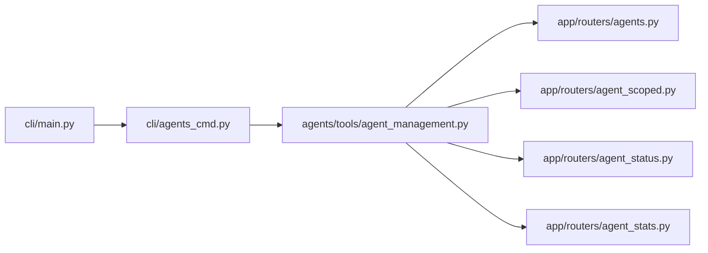

# Agent 管理命令

<cite>
**本文引用的文件**   
- [src/qwenpaw/cli/main.py](file://src/qwenpaw/cli/main.py)
- [src/qwenpaw/cli/agents_cmd.py](file://src/qwenpaw/cli/agents_cmd.py)
- [src/qwenpaw/app/routers/agents.py](file://src/qwenpaw/app/routers/agents.py)
- [src/qwenpaw/app/routers/agent_scoped.py](file://src/qwenpaw/app/routers/agent_scoped.py)
- [src/qwenpaw/app/routers/agent_status.py](file://src/qwenpaw/app/routers/agent_status.py)
- [src/qwenpaw/app/routers/agent_stats.py](file://src/qwenpaw/app/routers/agent_stats.py)
- [src/qwenpaw/agents/tools/agent_management.py](file://src/qwenpaw/agents/tools/agent_management.py)
</cite>

## 目录
1. [简介](#简介)
2. [项目结构](#项目结构)
3. [核心组件](#核心组件)
4. [架构总览](#架构总览)
5. [详细组件分析](#详细组件分析)
6. [依赖关系分析](#依赖关系分析)
7. [性能与资源考量](#性能与资源考量)
8. [故障排查指南](#故障排查指南)
9. [结论](#结论)
10. [附录](#附录)

## 简介
本文件面向使用 QwenPaw CLI 的运维与开发者，系统化记录 qwenpaw agents 子命令的功能与用法，覆盖 Agent 的创建、配置、启动、停止与管理操作；说明多 Agent 协作、任务分配与工作流编排方式；提供状态监控、性能分析与调试方法；并给出生命周期管理、资源分配与负载均衡的配置要点及批量自动化示例。

## 项目结构
qwenpaw CLI 通过懒加载机制注册 subcommand，其中 agents 子命令由独立的模块实现，并通过 HTTP 客户端调用后端 REST API 完成实际工作。后端以 FastAPI 路由暴露 /agents 系列接口，并提供按 Agent 隔离的路由前缀 /agents/{agentId}。

图表来源
- [src/qwenpaw/cli/main.py:119-174](file://src/qwenpaw/cli/main.py#L119-L174)
- [src/qwenpaw/cli/agents_cmd.py:447-464](file://src/qwenpaw/cli/agents_cmd.py#L447-L464)
- [src/qwenpaw/agents/tools/agent_management.py:316-360](file://src/qwenpaw/agents/tools/agent_management.py#L316-L360)
- [src/qwenpaw/app/routers/agents.py:157-206](file://src/qwenpaw/app/routers/agents.py#L157-L206)
- [src/qwenpaw/app/routers/agent_status.py:43-94](file://src/qwenpaw/app/routers/agent_status.py#L43-L94)
- [src/qwenpaw/app/routers/agent_stats.py:25-55](file://src/qwenpaw/app/routers/agent_stats.py#L25-L55)
- [src/qwenpaw/app/routers/agent_scoped.py:67-109](file://src/qwenpaw/app/routers/agent_scoped.py#L67-L109)

章节来源
- [src/qwenpaw/cli/main.py:119-174](file://src/qwenpaw/cli/main.py#L119-L174)

## 核心组件
- CLI 入口与懒加载：主 CLI 使用 LazyGroup 按需导入 agents 子命令组，避免冷启动开销。
- agents 子命令组：提供 list、create、delete、chat 四个命令，分别用于列举、创建、删除 Agent，以及跨 Agent 对话与后台任务提交/查询。
- Agent 工具库：封装 HTTP 客户端能力（如提交后台任务、查询任务状态、SSE 流式响应收集等），供 CLI 复用。
- 后端路由：
  - /agents：全局 Agent 管理（列表、创建、更新、删除、启停）。
  - /agents/{agentId}：按 Agent 隔离的运行时接口（聊天、配置、技能、工具、MCP、工作区、控制台等）。
  - /agents/{agentId}/agent-status：Agent 运行状态。
  - /agents/{agentId}/agent-stats：Agent 统计摘要。

章节来源
- [src/qwenpaw/cli/agents_cmd.py:447-464](file://src/qwenpaw/cli/agents_cmd.py#L447-L464)
- [src/qwenpaw/app/routers/agents.py:157-206](file://src/qwenpaw/app/routers/agents.py#L157-L206)
- [src/qwenpaw/app/routers/agent_scoped.py:67-109](file://src/qwenpaw/app/routers/agent_scoped.py#L67-L109)
- [src/qwenpaw/app/routers/agent_status.py:43-94](file://src/qwenpaw/app/routers/agent_status.py#L43-L94)
- [src/qwenpaw/app/routers/agent_stats.py:25-55](file://src/qwenpaw/app/routers/agent_stats.py#L25-L55)

## 架构总览
下图展示从 CLI 到后端的完整交互路径，包括会话上下文注入与 Agent 隔离。

图表来源
- [src/qwenpaw/cli/agents_cmd.py:806-970](file://src/qwenpaw/cli/agents_cmd.py#L806-L970)
- [src/qwenpaw/agents/tools/agent_management.py:316-360](file://src/qwenpaw/agents/tools/agent_management.py#L316-L360)
- [src/qwenpaw/app/routers/agent_scoped.py:16-65](file://src/qwenpaw/app/routers/agent_scoped.py#L16-L65)
- [src/qwenpaw/app/routers/agents.py:272-365](file://src/qwenpaw/app/routers/agents.py#L272-L365)

## 详细组件分析

### CLI 命令：agents 子命令组
- 功能概览
  - list：列出所有已配置的 Agent（ID、名称、描述、工作区路径等）。
  - create：基于模板创建新 Agent，支持指定语言、初始技能、默认模型槽位等。
  - delete：删除指定 Agent（默认 Agent 不可删），可选同时删除本地工作区。
  - chat：跨 Agent 对话，支持实时流式、最终结果聚合、后台任务提交与状态查询。
- 关键选项与行为
  - --base-url：覆盖全局 host/port，直接指向目标服务器。
  - chat 模式：
    - --mode stream/final：增量 SSE 或一次性返回完整结果。
    - --background/--task-id：后台任务提交与状态查询。
    - --session-id：复用会话上下文（注意并发冲突风险）。
    - --json-output：输出完整 JSON（含元数据）。
    - --timeout/--task-timeout：请求超时与任务执行超时控制。
- 参数校验与错误提示
  - 非后台模式必须提供 from_agent、to_agent、text。
  - --task-id 必须配合 --background。
  - --background 与 --mode stream 互斥。

章节来源
- [src/qwenpaw/cli/agents_cmd.py:447-464](file://src/qwenpaw/cli/agents_cmd.py#L447-L464)
- [src/qwenpaw/cli/agents_cmd.py:467-503](file://src/qwenpaw/cli/agents_cmd.py#L467-L503)
- [src/qwenpaw/cli/agents_cmd.py:505-634](file://src/qwenpaw/cli/agents_cmd.py#L505-L634)
- [src/qwenpaw/cli/agents_cmd.py:636-724](file://src/qwenpaw/cli/agents_cmd.py#L636-L724)
- [src/qwenpaw/cli/agents_cmd.py:726-970](file://src/qwenpaw/cli/agents_cmd.py#L726-L970)

#### 命令流程图：agents chat

图表来源
- [src/qwenpaw/cli/agents_cmd.py:806-970](file://src/qwenpaw/cli/agents_cmd.py#L806-L970)
- [src/qwenpaw/agents/tools/agent_management.py:316-360](file://src/qwenpaw/agents/tools/agent_management.py#L316-L360)

### 后端路由：/agents 与 /agents/{agentId}
- /agents
  - GET /agents：列出所有 Agent（包含排序、描述合并、active_model 信息）。
  - PUT /agents/order：持久化 Agent 顺序。
  - GET /agents/{agentId}：获取某 Agent 完整配置。
  - POST /agents：创建新 Agent（可自定义 ID、语言、初始技能、active_model）。
  - PUT /agents/{agentId}：更新 Agent 配置并触发重载。
  - DELETE /agents/{agentId}：删除 Agent（禁止删除 default）。
  - PATCH /agents/{agentId}/toggle：启用/禁用 Agent（禁用 default 被拒绝）。
- /agents/{agentId} 隔离路由
  - 通过中间件将 agentId 注入 request.state，下游路由据此访问对应工作区与上下文。
  - 挂载子路由：agent-status、chats、config、cron、mcp、skills、tools、workspace、console、plugins 等。
- /agents/{agentId}/agent-status
  - 返回当前运行状态（idle/running/disabled）、运行中任务数、最近开始/结束时间。
- /agents/{agentId}/agent-stats
  - 返回日期范围内的统计摘要（默认近 30 天）。

章节来源
- [src/qwenpaw/app/routers/agents.py:157-206](file://src/qwenpaw/app/routers/agents.py#L157-L206)
- [src/qwenpaw/app/routers/agents.py:208-236](file://src/qwenpaw/app/routers/agents.py#L208-L236)
- [src/qwenpaw/app/routers/agents.py:238-253](file://src/qwenpaw/app/routers/agents.py#L238-L253)
- [src/qwenpaw/app/routers/agents.py:272-365](file://src/qwenpaw/app/routers/agents.py#L272-L365)
- [src/qwenpaw/app/routers/agents.py:367-399](file://src/qwenpaw/app/routers/agents.py#L367-L399)
- [src/qwenpaw/app/routers/agents.py:401-433](file://src/qwenpaw/app/routers/agents.py#L401-L433)
- [src/qwenpaw/app/routers/agents.py:435-485](file://src/qwenpaw/app/routers/agents.py#L435-L485)
- [src/qwenpaw/app/routers/agent_scoped.py:67-109](file://src/qwenpaw/app/routers/agent_scoped.py#L67-L109)
- [src/qwenpaw/app/routers/agent_status.py:43-94](file://src/qwenpaw/app/routers/agent_status.py#L43-L94)
- [src/qwenpaw/app/routers/agent_stats.py:25-55](file://src/qwenpaw/app/routers/agent_stats.py#L25-L55)

### 多 Agent 协作与任务编排
- 协作方式
  - 通过 agents chat 向目标 Agent 发送消息，支持会话复用与身份前缀自动添加，避免来源混淆。
  - 复杂任务建议采用后台模式：提交后立即获得 task_id，后续轮询状态直至 finished。
- 任务状态流转
  - submitted → pending → running → finished（completed 或 failed）
- 会话管理
  - 未指定 session_id 则自动生成唯一会话；重复使用同一 session_id 需避免并发请求。
- 工作流编排建议
  - 上游 Agent 作为编排者，拆分任务并分发给多个下游 Agent；通过后台任务与状态轮询实现异步编排。
  - 结合 cron 与 workspace 中的 jobs.json/chats.json 进行持久化与回放。

章节来源
- [src/qwenpaw/cli/agents_cmd.py:806-970](file://src/qwenpaw/cli/agents_cmd.py#L806-L970)
- [src/qwenpaw/agents/tools/agent_management.py:316-360](file://src/qwenpaw/agents/tools/agent_management.py#L316-L360)

### 状态监控与性能分析
- 运行状态
  - 使用 /agents/{agentId}/agent-status 获取 idle/running/disabled、任务计数与时间戳。
- 统计摘要
  - 使用 /agents/{agentId}/agent-stats 获取一段时间内的综合统计（默认 30 天）。
- 调试技巧
  - CLI 端开启 --json-output 查看完整响应结构。
  - 使用 --timeout 与 --task-timeout 控制长耗时任务的等待上限。
  - 在后台模式下，先提交再轮询，避免阻塞。

章节来源
- [src/qwenpaw/app/routers/agent_status.py:43-94](file://src/qwenpaw/app/routers/agent_status.py#L43-L94)
- [src/qwenpaw/app/routers/agent_stats.py:25-55](file://src/qwenpaw/app/routers/agent_stats.py#L25-L55)
- [src/qwenpaw/cli/agents_cmd.py:806-970](file://src/qwenpaw/cli/agents_cmd.py#L806-L970)

### 生命周期管理与资源分配
- 生命周期
  - 创建：POST /agents 或 CLI agents create，初始化工作区、复制模板、安装初始技能。
  - 更新：PUT /agents/{agentId} 修改配置并触发热重载。
  - 启停：PATCH /agents/{agentId}/toggle 动态启用/禁用；禁用会停止运行实例。
  - 删除：DELETE /agents/{agentId} 移除配置与运行实例（default 受保护）。
- 资源与隔离
  - 每个 Agent 拥有独立工作区（workspaces/<id>），包含 sessions、memory、skills 等目录。
  - 通过 /agents/{agentId} 前缀实现请求级隔离，确保上下文与文件访问边界清晰。
- 负载均衡与调度
  - 通过多 Agent 并行处理不同领域任务，结合后台任务与状态轮询提升吞吐。
  - 可在上层编排器中根据 Agent 状态（agent-status）进行动态路由与退避重试。

章节来源
- [src/qwenpaw/app/routers/agents.py:272-365](file://src/qwenpaw/app/routers/agents.py#L272-L365)
- [src/qwenpaw/app/routers/agents.py:435-485](file://src/qwenpaw/app/routers/agents.py#L435-L485)
- [src/qwenpaw/app/routers/agents.py:401-433](file://src/qwenpaw/app/routers/agents.py#L401-L433)
- [src/qwenpaw/app/routers/agent_scoped.py:67-109](file://src/qwenpaw/app/routers/agent_scoped.py#L67-L109)

## 依赖关系分析
- CLI 层
  - main.py 通过 LazyGroup 懒加载 agents 子命令组，减少启动成本。
  - agents_cmd.py 负责参数解析、流程控制与输出格式化。
- 工具层
  - agent_management.py 封装 HTTP 客户端，提供 submit/get-task、SSE 流式处理、最终结果收集等能力。
- 服务端层
  - routers/agents.py 提供全局 Agent 管理接口。
  - routers/agent_scoped.py 提供按 Agent 隔离的子路由集合。
  - routers/agent_status.py 与 routers/agent_stats.py 提供运行态与统计信息。

图表来源
- [src/qwenpaw/cli/main.py:119-174](file://src/qwenpaw/cli/main.py#L119-L174)
- [src/qwenpaw/cli/agents_cmd.py:447-464](file://src/qwenpaw/cli/agents_cmd.py#L447-L464)
- [src/qwenpaw/agents/tools/agent_management.py:316-360](file://src/qwenpaw/agents/tools/agent_management.py#L316-L360)
- [src/qwenpaw/app/routers/agents.py:157-206](file://src/qwenpaw/app/routers/agents.py#L157-L206)
- [src/qwenpaw/app/routers/agent_scoped.py:67-109](file://src/qwenpaw/app/routers/agent_scoped.py#L67-L109)
- [src/qwenpaw/app/routers/agent_status.py:43-94](file://src/qwenpaw/app/routers/agent_status.py#L43-L94)
- [src/qwenpaw/app/routers/agent_stats.py:25-55](file://src/qwenpaw/app/routers/agent_stats.py#L25-L55)

章节来源
- [src/qwenpaw/cli/main.py:119-174](file://src/qwenpaw/cli/main.py#L119-L174)

## 性能与资源考量
- 启动优化：LazyGroup 延迟加载子命令，降低 CLI 冷启动时间。
- 网络与超时：合理设置 --timeout 与 --task-timeout，避免长时间阻塞。
- 并发与会话：避免对同一 session_id 并发请求；必要时为每次请求生成唯一会话。
- 后台任务：复杂任务优先使用后台模式，提高整体吞吐与用户体验。
- 资源隔离：利用 /agents/{agentId} 前缀与独立工作区，防止资源争用。

[本节为通用指导，不直接分析具体文件]

## 故障排查指南
- 常见错误
  - 参数缺失：非后台模式缺少 from/to/text 将报错退出。
  - 参数冲突：--task-id 未配合 --background，或 --background 与 --mode stream 同时出现。
  - 任务不存在：查询任务状态返回 404，可能已过期或未创建。
  - 默认 Agent 保护：删除或禁用 default 将被拒绝。
- 定位步骤
  - 使用 --json-output 查看完整响应结构，确认字段与状态码。
  - 检查 --base-url 是否正确指向目标服务。
  - 通过 /agents/{agentId}/agent-status 确认目标 Agent 是否处于 disabled 或无任务。
  - 后台任务失败时，查看任务结果中的 error 字段定位原因。

章节来源
- [src/qwenpaw/cli/agents_cmd.py:142-191](file://src/qwenpaw/cli/agents_cmd.py#L142-L191)
- [src/qwenpaw/cli/agents_cmd.py:192-292](file://src/qwenpaw/cli/agents_cmd.py#L192-L292)
- [src/qwenpaw/app/routers/agents.py:401-433](file://src/qwenpaw/app/routers/agents.py#L401-L433)
- [src/qwenpaw/app/routers/agents.py:435-485](file://src/qwenpaw/app/routers/agents.py#L435-L485)

## 结论
qwenpaw agents 子命令提供了完整的 Agent 管理能力与跨 Agent 协作机制。通过 CLI 与后端 REST API 的协同，可实现从创建、配置、启停到监控、统计的全生命周期管理。推荐在生产环境中广泛采用后台任务与状态轮询，结合 Agent 隔离与独立工作区，构建高可用、可扩展的多 Agent 协作系统。

[本节为总结性内容，不直接分析具体文件]

## 附录

### 常用命令速查
- 列出 Agent：qwenpaw agents list [--base-url URL]
- 创建 Agent：qwenpaw agents create --name NAME [--agent-id ID] [--template TPL] [--skill SKILL...] [--provider-id P] [--model-id M]
- 删除 Agent：qwenpaw agents delete AGENT_ID [--remove-workspace] [--yes]
- 对话（前台）：qwenpaw agents chat --from-agent A --to-agent B --text MSG [--session-id SID] [--mode stream|final] [--json-output]
- 对话（后台）：qwenpaw agents chat --background --from-agent A --to-agent B --text MSG
- 查询任务：qwenpaw agents chat --background --task-id TASK_ID

[本节为概念性汇总，不直接分析具体文件]