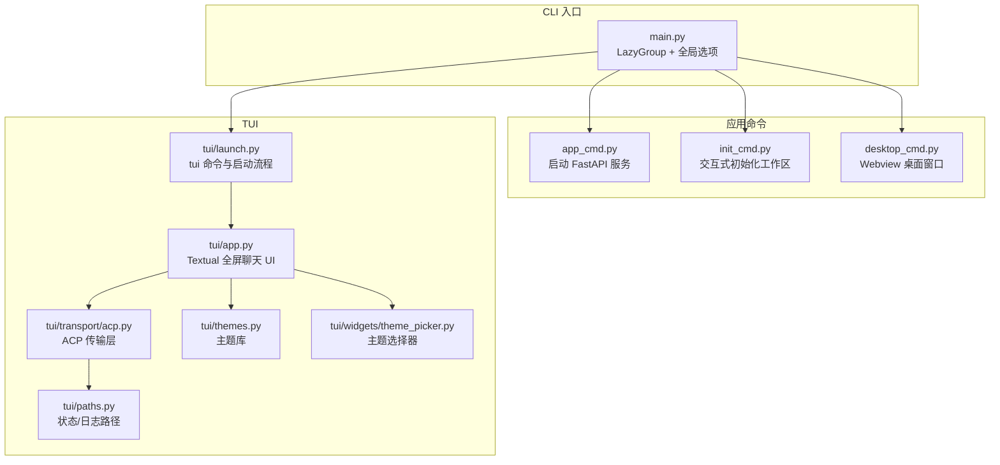
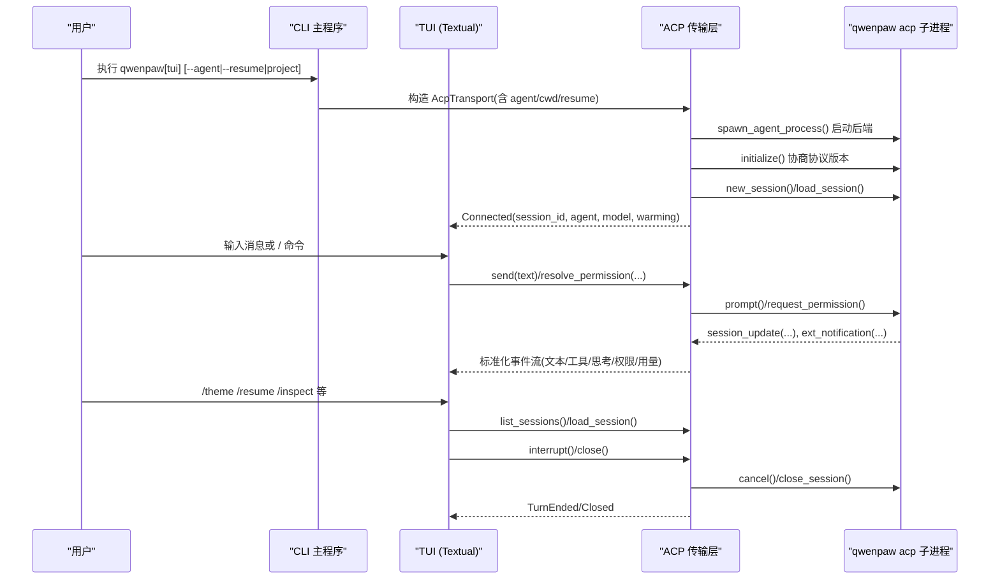
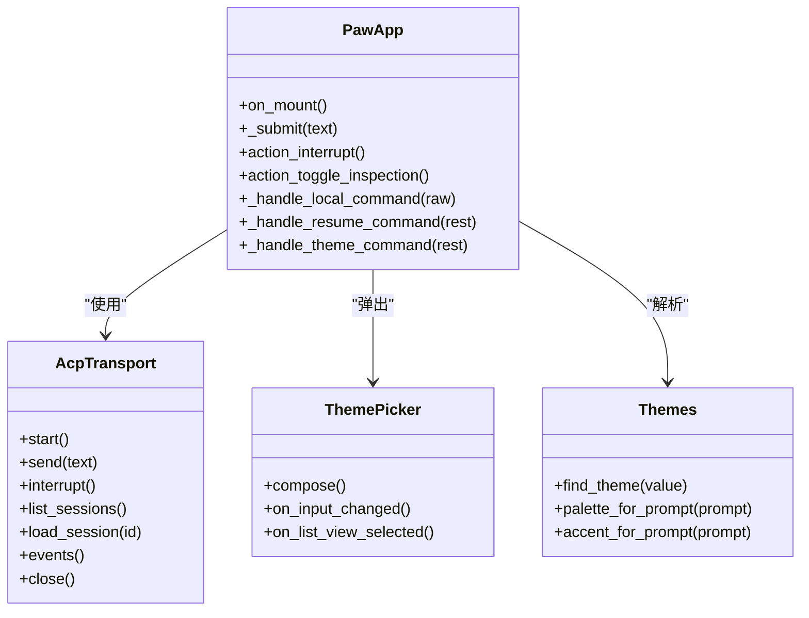

# CLI 工具

<cite>
**本文引用的文件**   
- [src/qwenpaw/cli/main.py](file://src/qwenpaw/cli/main.py)
- [src/qwenpaw/cli/app_cmd.py](file://src/qwenpaw/cli/app_cmd.py)
- [src/qwenpaw/cli/init_cmd.py](file://src/qwenpaw/cli/init_cmd.py)
- [src/qwenpaw/cli/desktop_cmd.py](file://src/qwenpaw/cli/desktop_cmd.py)
- [src/qwenpaw/cli/tui/launch.py](file://src/qwenpaw/cli/tui/launch.py)
- [src/qwenpaw/cli/tui/app.py](file://src/qwenpaw/cli/tui/app.py)
- [src/qwenpaw/cli/tui/transport/acp.py](file://src/qwenpaw/cli/tui/transport/acp.py)
- [src/qwenpaw/cli/tui/themes.py](file://src/qwenpaw/cli/tui/themes.py)
- [src/qwenpaw/cli/tui/widgets/theme_picker.py](file://src/qwenpaw/cli/tui/widgets/theme_picker.py)
- [src/qwenpaw/cli/tui/paths.py](file://src/qwenpaw/cli/tui/paths.py)
</cite>

## 目录
1. [简介](#简介)
2. [项目结构](#项目结构)
3. [核心组件](#核心组件)
4. [架构总览](#架构总览)
5. [详细组件分析](#详细组件分析)
6. [依赖关系分析](#依赖关系分析)
7. [性能与优化](#性能与优化)
8. [故障排查指南](#故障排查指南)
9. [结论](#结论)
10. [附录：常用用例与迁移说明](#附录：常用用例与迁移说明)

## 简介
本文件为 QwenPaw 的命令行接口（CLI）文档，覆盖以下能力：
- 顶层命令与子命令使用方法、参数选项与返回行为
- 终端界面（TUI）的全屏聊天、斜杠命令、主题切换与会话管理
- 应用程序命令（启动、停止、初始化等）
- 协议相关示例（ACP）、错误处理策略、性能优化技巧与调试方法
- 常用用例、客户端实现指南与监控建议
- 已弃用功能的迁移指南与向后兼容性说明

## 项目结构
QwenPaw CLI 基于 Click 构建，采用“懒加载”分组组织子命令，减少冷启动开销。TUI 通过 ACP 协议驱动后端 Agent 进程，提供交互式全屏聊天体验；桌面模式则以内嵌 Webview 运行同一后端服务。

**图示来源** 
- [src/qwenpaw/cli/main.py:119-174](file://src/qwenpaw/cli/main.py#L119-L174)
- [src/qwenpaw/cli/app_cmd.py:52-99](file://src/qwenpaw/cli/app_cmd.py#L52-L99)
- [src/qwenpaw/cli/init_cmd.py:152-176](file://src/qwenpaw/cli/init_cmd.py#L152-L176)
- [src/qwenpaw/cli/desktop_cmd.py:141-161](file://src/qwenpaw/cli/desktop_cmd.py#L141-L161)
- [src/qwenpaw/cli/tui/launch.py:199-232](file://src/qwenpaw/cli/tui/launch.py#L199-L232)
- [src/qwenpaw/cli/tui/app.py:138-214](file://src/qwenpaw/cli/tui/app.py#L138-L214)
- [src/qwenpaw/cli/tui/transport/acp.py:352-466](file://src/qwenpaw/cli/tui/transport/acp.py#L352-L466)
- [src/qwenpaw/cli/tui/themes.py:9-25](file://src/qwenpaw/cli/tui/themes.py#L9-L25)
- [src/qwenpaw/cli/tui/widgets/theme_picker.py:17-50](file://src/qwenpaw/cli/tui/widgets/theme_picker.py#L17-L50)
- [src/qwenpaw/cli/tui/paths.py:15-34](file://src/qwenpaw/cli/tui/paths.py#L15-L34)

**章节来源**
- [src/qwenpaw/cli/main.py:119-174](file://src/qwenpaw/cli/main.py#L119-L174)

## 核心组件
- 顶层 CLI 与全局选项
  - 支持 --host/--port 作为默认后端地址，未显式指定时回退到上次使用或默认值
  - 无子命令直接调用时进入 TUI；首个参数若像项目路径则自动传入 TUI
- 应用命令
  - app：启动 FastAPI 服务，支持端口绑定、热重载、日志级别、访问日志过滤、弃用参数兼容
  - init：交互式创建配置与工作区，引导 LLM 提供商、技能、环境变量、心跳任务等
  - desktop：在独立 Webview 窗口中运行后端服务，自动选择空闲端口并持久化浏览器数据
- TUI 子系统
  - tui：启动全屏聊天，支持 --agent、--resume、project 目录绑定
  - 传输层：通过 ACP 协议驱动 qwenpaw acp 子进程，封装会话、权限、推送消息、事件流
  - 主题系统：内置主题画廊与动态提示词生成配色，支持 /theme 与弹窗选择器
  - 路径与日志：跨平台状态目录与日志路径解析

**章节来源**
- [src/qwenpaw/cli/main.py:184-209](file://src/qwenpaw/cli/main.py#L184-L209)
- [src/qwenpaw/cli/app_cmd.py:52-99](file://src/qwenpaw/cli/app_cmd.py#L52-L99)
- [src/qwenpaw/cli/init_cmd.py:152-176](file://src/qwenpaw/cli/init_cmd.py#L152-L176)
- [src/qwenpaw/cli/desktop_cmd.py:141-161](file://src/qwenpaw/cli/desktop_cmd.py#L141-L161)
- [src/qwenpaw/cli/tui/launch.py:199-232](file://src/qwenpaw/cli/tui/launch.py#L199-L232)
- [src/qwenpaw/cli/tui/transport/acp.py:352-466](file://src/qwenpaw/cli/tui/transport/acp.py#L352-L466)
- [src/qwenpaw/cli/tui/themes.py:9-25](file://src/qwenpaw/cli/tui/themes.py#L9-L25)
- [src/qwenpaw/cli/tui/widgets/theme_picker.py:17-50](file://src/qwenpaw/cli/tui/widgets/theme_picker.py#L17-L50)
- [src/qwenpaw/cli/tui/paths.py:15-34](file://src/qwenpaw/cli/tui/paths.py#L15-L34)

## 架构总览
下图展示从 CLI 到 TUI 再到 ACP 后端的整体交互流程，包括会话建立、权限审批、事件流与关闭清理。

**图示来源** 
- [src/qwenpaw/cli/tui/launch.py:168-196](file://src/qwenpaw/cli/tui/launch.py#L168-L196)
- [src/qwenpaw/cli/tui/transport/acp.py:407-466](file://src/qwenpaw/cli/tui/transport/acp.py#L407-L466)
- [src/qwenpaw/cli/tui/app.py:457-536](file://src/qwenpaw/cli/tui/app.py#L457-L536)
- [src/qwenpaw/cli/tui/app.py:662-756](file://src/qwenpaw/cli/tui/app.py#L662-L756)

## 详细组件分析

### 顶层 CLI 与全局选项
- 命令入口
  - 支持 --host/--port 全局选项，优先读取上次使用的 host/port，最终回退到 127.0.0.1:8088
  - 无子命令时直接进入 TUI；当第一个参数形似项目路径时，自动作为 TUI 的项目目录传入
- 懒加载分组
  - 通过 LazyGroup 按需导入子命令模块，提升 help 与列表响应速度
- 版本信息
  - 提供 --version 输出当前版本

用法要点
- qwenpaw --help：查看帮助
- qwenpaw --host <host> --port <port>：设置默认后端地址
- qwenpaw：直接进入 TUI
- qwenpaw <项目路径>：以该目录为工作空间启动 TUI

**章节来源**
- [src/qwenpaw/cli/main.py:184-209](file://src/qwenpaw/cli/main.py#L184-L209)
- [src/qwenpaw/cli/main.py:59-117](file://src/qwenpaw/cli/main.py#L59-L117)
- [src/qwenpaw/cli/main.py:119-174](file://src/qwenpaw/cli/main.py#L119-L174)

### 应用命令：app
功能
- 启动 FastAPI 应用，监听指定 host:port
- 支持开发热重载、日志级别、隐藏特定访问路径
- 对非回环地址且未启用认证时发出安全警告
- 兼容已弃用的 --workers 参数并给出提示

参数
- --host：绑定主机，默认 127.0.0.1
- --port：绑定端口，默认 8088
- --reload：开启热重载（仅开发）
- --log-level：日志级别（critical/error/warning/info/debug/trace）
- --hide-access-paths：从 uvicorn 访问日志中隐藏的路径片段（可重复）
- --workers：已弃用，将被忽略

返回与行为
- 成功：启动服务并在控制台输出监听地址
- 失败：抛出异常并记录错误日志
- 安全：在非回环地址且未启用认证时打印安全提示

**章节来源**
- [src/qwenpaw/cli/app_cmd.py:52-99](file://src/qwenpaw/cli/app_cmd.py#L52-L99)
- [src/qwenpaw/cli/app_cmd.py:100-151](file://src/qwenpaw/cli/app_cmd.py#L100-L151)

### 应用命令：init
功能
- 交互式创建工作区配置文件与心跳任务清单
- 引导配置 LLM 提供商、技能、环境变量、语言与音频模式
- 同步本地技能池至工作区，按用户选择启用
- 可选匿名遥测上报

参数
- --force：覆盖现有 config.json 与 HEARTBEAT.md
- --defaults：仅使用默认值，不交互（适合脚本/Docker）
- --accept-security：跳过安全确认（需配合 --defaults）

返回与行为
- 成功：写入配置与必要文件，输出完成提示
- 失败：根据交互结果中止或抛出异常

**章节来源**
- [src/qwenpaw/cli/init_cmd.py:152-176](file://src/qwenpaw/cli/init_cmd.py#L152-L176)
- [src/qwenpaw/cli/init_cmd.py:171-531](file://src/qwenpaw/cli/init_cmd.py#L171-L531)

### 应用命令：desktop
功能
- 在独立 Webview 窗口运行 QwenPaw 应用
- 自动选择稳定空闲端口，启动后端子进程，等待 HTTP 就绪后打开窗口
- 暴露 JS API：打开外部链接、原生保存对话框下载文件
- 持久化 webview 存储，使偏好与历史跨重启保留

参数
- --host：后端绑定主机，默认 127.0.0.1
- --log-level：日志级别

返回与行为
- 成功：打开桌面窗口并阻塞直到关闭
- 失败：记录错误并退出，遵循 POSIX 信号退出码约定

**章节来源**
- [src/qwenpaw/cli/desktop_cmd.py:141-161](file://src/qwenpaw/cli/desktop_cmd.py#L141-L161)
- [src/qwenpaw/cli/desktop_cmd.py:158-346](file://src/qwenpaw/cli/desktop_cmd.py#L158-L346)

### TUI：启动与运行
功能
- 支持 qwenpaw 与 qwenpaw tui 两种入口
- 支持 --agent 指定代理、--resume 恢复会话、project 目录绑定
- 自动解析工作区目录，显示欢迎信息与上下文

参数
- --agent：要对话的 Agent ID（默认活动代理）
- --resume：会话 ID，用于恢复并继续历史
- project：项目目录（可选），用于绑定代码上下文

返回与行为
- 成功：进入全屏聊天界面
- 失败：抛出异常并提示原因

**章节来源**
- [src/qwenpaw/cli/tui/launch.py:199-232](file://src/qwenpaw/cli/tui/launch.py#L199-L232)
- [src/qwenpaw/cli/tui/launch.py:168-196](file://src/qwenpaw/cli/tui/launch.py#L168-L196)

### TUI：全屏聊天与交互
功能
- 全屏聊天界面，支持多轮对话、工具调用可视化、思考过程折叠/展开
- 队列机制：忙碌时输入排队，结束后自动发送
- 快捷键：Esc 中断/取消输入、Ctrl+I 切换检查模式、Ctrl+C/Q 退出
- 粘贴增强：自动识别附件与长文本，保存到临时位置并插入引用
- 权限审批：弹出模态框，支持键盘导航与超时处理

关键行为
- 提交消息：清空输入、滚动到底部、发送或入队
- 中断：立即标记状态并尝试取消后端任务
- 检查模式：显示/隐藏工具面板与思考内容，便于调试
- 权限请求：渲染参数、倒计时、拒绝/允许选项

**章节来源**
- [src/qwenpaw/cli/tui/app.py:138-214](file://src/qwenpaw/cli/tui/app.py#L138-L214)
- [src/qwenpaw/cli/tui/app.py:457-536](file://src/qwenpaw/cli/tui/app.py#L457-L536)
- [src/qwenpaw/cli/tui/app.py:547-614](file://src/qwenpaw/cli/tui/app.py#L547-L614)

### TUI：斜杠命令
内置命令
- /help：显示帮助信息
- /resume：列出最近会话或直接恢复指定会话（支持短前缀匹配）
- /theme：打开主题选择器或按名称/ID 切换主题
- /inspect：切换检查模式（显示/隐藏工具与思考）
- 其他以 / 开头的命令将转发给 Agent（如 /model、/clear 等）

会话管理
- /resume list/all/browse：打开完整会话选择器
- /resume <id>：直接恢复会话（支持短 ID 前缀）

**章节来源**
- [src/qwenpaw/cli/tui/app.py:615-635](file://src/qwenpaw/cli/tui/app.py#L615-L635)
- [src/qwenpaw/cli/tui/app.py:662-756](file://src/qwenpaw/cli/tui/app.py#L662-L756)

### TUI：主题系统
功能
- 内置主题画廊，包含多种风格（原始、赛博朋克、海洋、太空等）
- 支持通过 /theme <id> 或 /theme gallery 打开选择器
- 自定义提示词可映射到稳定哈希的主题，确保一致配色

数据结构
- ThemeInfo：主题标识、名称、表情、提示词、屏幕/输入框/边框/强调色等
- find_theme：按 id/name 精确匹配
- palette_for_prompt/accent_for_prompt：根据提示词解析调色板与强调色

**章节来源**
- [src/qwenpaw/cli/tui/themes.py:9-25](file://src/qwenpaw/cli/tui/themes.py#L9-L25)
- [src/qwenpaw/cli/tui/themes.py:131-157](file://src/qwenpaw/cli/tui/themes.py#L131-L157)
- [src/qwenpaw/cli/tui/widgets/theme_picker.py:17-50](file://src/qwenpaw/cli/tui/widgets/theme_picker.py#L17-L50)
- [src/qwenpaw/cli/tui/widgets/theme_picker.py:117-144](file://src/qwenpaw/cli/tui/widgets/theme_picker.py#L117-L144)

### TUI：会话管理
功能
- 连接后异步拉取最近会话列表，供 /resume 自动补全
- 支持直接恢复指定会话，清空当前转录并重放历史
- 恢复后更新状态栏与终端标题，显示会话短 ID

**章节来源**
- [src/qwenpaw/cli/tui/app.py:364-388](file://src/qwenpaw/cli/tui/app.py#L364-L388)
- [src/qwenpaw/cli/tui/app.py:728-756](file://src/qwenpaw/cli/tui/app.py#L728-L756)

### 传输层：ACP 协议
职责
- 启动 qwenpaw acp 子进程，建立 ACP 连接
- 会话生命周期：initialize、new_session/load_session、prompt、cancel、close_session
- 事件流：session_update、ext_notification、request_permission
- 权限审批：渲染参数、倒计时、超时与取消处理
- 预热：后台发起一次“热身”会话以减少首次交互延迟
- 大消息缓冲：提高 stdio 行缓冲上限，避免大工具结果导致连接断开

关键类与方法
- AcpTransport.start：建立连接与初始化会话
- AcpTransport.send/_run_prompt：发送消息并等待事件落盘
- AcpTransport.interrupt：取消当前任务
- AcpTransport.list_sessions/load_session：会话查询与恢复
- _TuiClient.session_update/request_permission/ext_notification：事件分发与回调

**章节来源**
- [src/qwenpaw/cli/tui/transport/acp.py:352-466](file://src/qwenpaw/cli/tui/transport/acp.py#L352-L466)
- [src/qwenpaw/cli/tui/transport/acp.py:518-580](file://src/qwenpaw/cli/tui/transport/acp.py#L518-L580)
- [src/qwenpaw/cli/tui/transport/acp.py:581-626](file://src/qwenpaw/cli/tui/transport/acp.py#L581-L626)
- [src/qwenpaw/cli/tui/transport/acp.py:197-350](file://src/qwenpaw/cli/tui/transport/acp.py#L197-L350)

### 状态与日志路径
- state_dir：跨平台状态目录解析（Windows/macOS/Linux），支持 PAW_STATE_DIR 覆盖
- log_path：在状态目录下生成日志文件（如 acp.log）

**章节来源**
- [src/qwenpaw/cli/tui/paths.py:15-34](file://src/qwenpaw/cli/tui/paths.py#L15-L34)

## 依赖关系分析
- CLI 主程序通过 LazyGroup 按需加载子命令模块，降低启动成本
- TUI 依赖 Textual 构建 UI，并通过 ACP 传输层与后端通信
- 主题系统与选择器解耦，便于扩展新主题
- 桌面模式依赖 pywebview，负责窗口管理与 JS API 暴露

**图示来源** 
- [src/qwenpaw/cli/tui/app.py:138-214](file://src/qwenpaw/cli/tui/app.py#L138-L214)
- [src/qwenpaw/cli/tui/transport/acp.py:352-466](file://src/qwenpaw/cli/tui/transport/acp.py#L352-L466)
- [src/qwenpaw/cli/tui/widgets/theme_picker.py:17-50](file://src/qwenpaw/cli/tui/widgets/theme_picker.py#L17-L50)
- [src/qwenpaw/cli/tui/themes.py:131-157](file://src/qwenpaw/cli/tui/themes.py#L131-L157)

**章节来源**
- [src/qwenpaw/cli/main.py:59-117](file://src/qwenpaw/cli/main.py#L59-L117)
- [src/qwenpaw/cli/tui/app.py:138-214](file://src/qwenpaw/cli/tui/app.py#L138-L214)
- [src/qwenpaw/cli/tui/transport/acp.py:352-466](file://src/qwenpaw/cli/tui/transport/acp.py#L352-L466)
- [src/qwenpaw/cli/tui/themes.py:131-157](file://src/qwenpaw/cli/tui/themes.py#L131-L157)
- [src/qwenpaw/cli/tui/widgets/theme_picker.py:17-50](file://src/qwenpaw/cli/tui/widgets/theme_picker.py#L17-L50)

## 性能与优化
- 懒加载子命令：显著提升 help 与命令列表响应速度
- ACP 预热：后台发起一次“热身”会话，减少首次交互延迟
- 大消息缓冲：提高 stdio 行缓冲上限，避免大工具结果导致连接断开
- 访问日志过滤：隐藏高频内部路径，降低日志噪音
- 桌面模式端口稳定：使用稳定端口分配减少冲突与重试

[本节为通用指导，无需具体文件来源]

## 故障排查指南
常见问题
- 无法连接后端：检查 --host/--port 是否正确，确认服务已启动
- 权限审批超时：确认是否在规定时间内做出选择，注意本地宽限时间
- 大工具结果丢失：检查 ACP 子进程 stderr 日志，确认缓冲区未溢出
- 桌面窗口无法打开：确认 SSL_CERT_FILE 环境变量与证书存在

定位方法
- 查看 TUI 状态栏与错误消息
- 检查状态目录下的 acp.log 日志
- 使用 /inspect 模式查看工具与思考详情
- 在 app 模式下调整 --log-level 为 debug/trace 获取更详细日志

**章节来源**
- [src/qwenpaw/cli/tui/transport/acp.py:82-103](file://src/qwenpaw/cli/tui/transport/acp.py#L82-L103)
- [src/qwenpaw/cli/tui/transport/acp.py:156-176](file://src/qwenpaw/cli/tui/transport/acp.py#L156-L176)
- [src/qwenpaw/cli/app_cmd.py:135-151](file://src/qwenpaw/cli/app_cmd.py#L135-L151)
- [src/qwenpaw/cli/tui/paths.py:15-34](file://src/qwenpaw/cli/tui/paths.py#L15-L34)

## 结论
QwenPaw CLI 提供了完整的命令行与 TUI 能力，涵盖应用启动、初始化、桌面窗口与全屏聊天。通过 ACP 协议与后端高效协作，结合主题系统与会话管理，为用户提供流畅的交互体验。同时，完善的错误处理、日志与性能优化策略保障了稳定性与可维护性。

[本节为总结，无需具体文件来源]

## 附录：常用用例与迁移说明

### 常用用例
- 快速开始
  - qwenpaw：进入 TUI
  - qwenpaw tui --agent <id>：指定 Agent 启动
  - qwenpaw tui --resume <session_id>：恢复会话
  - qwenpaw <项目路径>：以项目目录为上下文启动 TUI
- 启动服务
  - qwenpaw app --host 0.0.0.0 --port 8088 --log-level info
  - qwenpaw app --reload：开发模式热重载
- 桌面模式
  - qwenpaw desktop --host 127.0.0.1 --log-level debug
- 初始化
  - qwenpaw init --defaults --accept-security：静默初始化
  - qwenpaw init：交互式初始化

### 客户端实现指南
- 使用 ACP 传输层
  - 通过 AcpTransport.start 建立连接，处理 Connected 事件
  - 使用 send 发送消息，监听 events 迭代获取 session_update、ext_notification 等
  - 使用 resolve_permission 处理权限审批，注意超时与取消
- 会话管理
  - 使用 list_sessions 获取最近会话，使用 load_session 恢复
- 主题与 UI
  - 使用 themes.find_theme 与 palette_for_prompt 解析主题
  - 使用 ThemePicker 弹出选择器并获取结果

### 性能优化建议
- 启用 ACP 预热（默认开启），必要时可通过环境变量禁用
- 合理设置 --log-level，生产环境使用 info 或 warning
- 隐藏高频访问路径，减少日志 I/O
- 在大模型调用频繁场景下，关注 token 用量与上下文占用

### 已弃用功能与迁移
- --workers 参数（app 命令）：已弃用，始终使用单 worker，继续使用会收到警告
- 迁移建议：移除 --workers 参数，保持单 worker 以获得最佳稳定性

**章节来源**
- [src/qwenpaw/cli/app_cmd.py:84-114](file://src/qwenpaw/cli/app_cmd.py#L84-L114)
- [src/qwenpaw/cli/tui/transport/acp.py:105-111](file://src/qwenpaw/cli/tui/transport/acp.py#L105-L111)