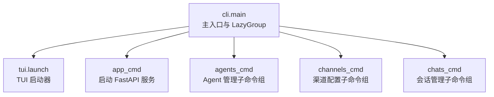
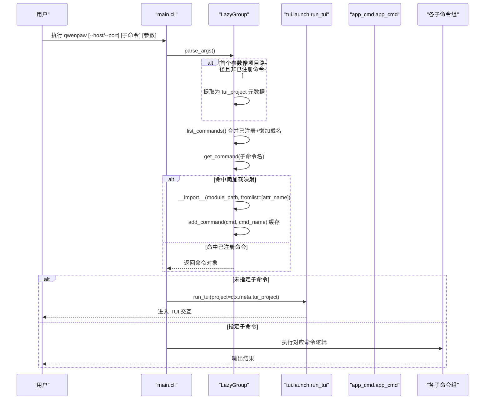
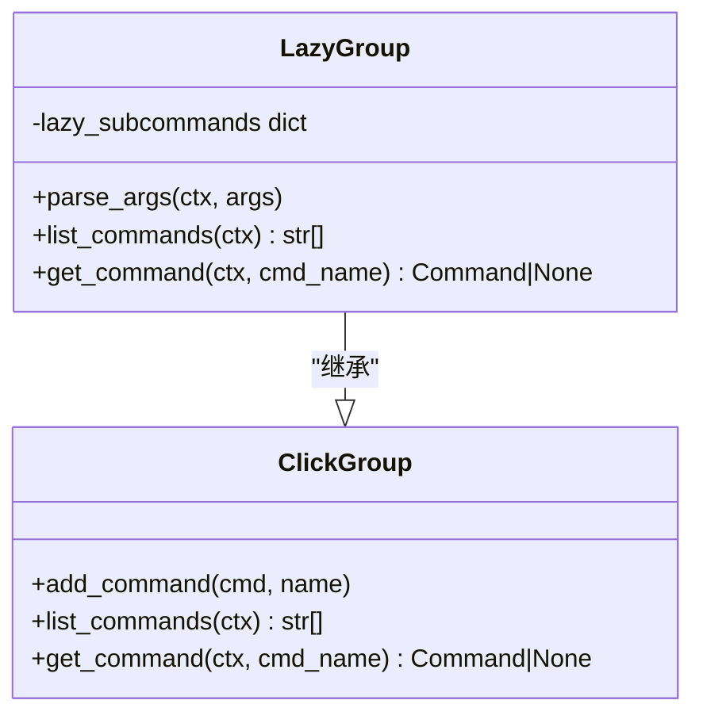
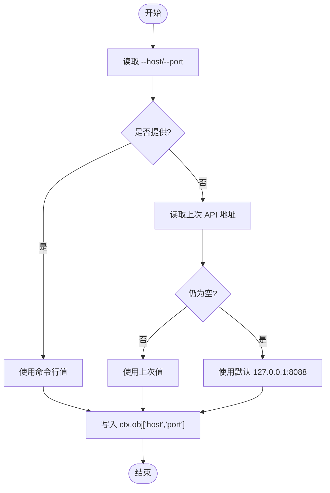
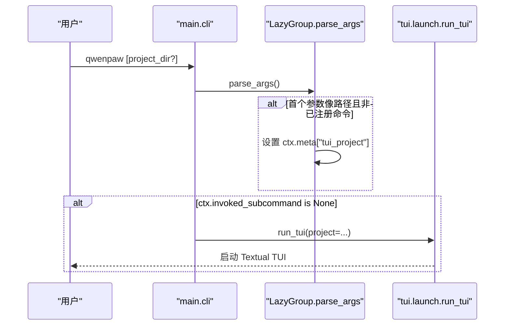
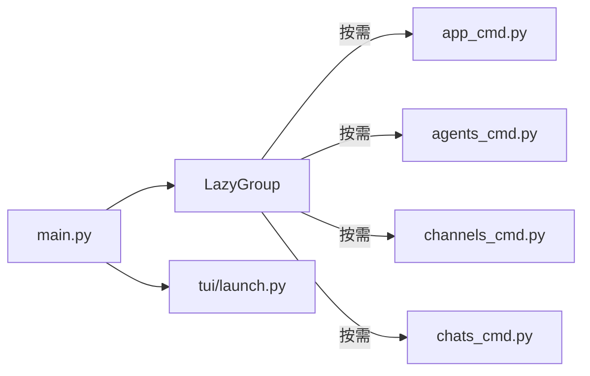

# CLI 概览

<cite>
**本文引用的文件**   
- [src/qwenpaw/cli/main.py](file://src/qwenpaw/cli/main.py)
- [src/qwenpaw/cli/tui/launch.py](file://src/qwenpaw/cli/tui/launch.py)
- [src/qwenpaw/cli/app_cmd.py](file://src/qwenpaw/cli/app_cmd.py)
- [src/qwenpaw/cli/agents_cmd.py](file://src/qwenpaw/cli/agents_cmd.py)
- [src/qwenpaw/cli/channels_cmd.py](file://src/qwenpaw/cli/channels_cmd.py)
- [src/qwenpaw/cli/chats_cmd.py](file://src/qwenpaw/cli/chats_cmd.py)
</cite>

## 目录
1. [简介](#简介)
2. [项目结构](#项目结构)
3. [核心组件](#核心组件)
4. [架构总览](#架构总览)
5. [详细组件分析](#详细组件分析)
6. [依赖关系分析](#依赖关系分析)
7. [性能与懒加载](#性能与懒加载)
8. [常用命令速查](#常用命令速查)
9. [命令行语法规范](#命令行语法规范)
10. [故障排除与调试技巧](#故障排除与调试技巧)
11. [结论](#结论)

## 简介
本概览面向 QwenPaw CLI 的使用者与二次开发者，聚焦以下目标：
- 整体架构设计与命令组织结构
- 懒加载机制（LazyGroup）的工作原理与性能优化策略
- 全局选项 --host 与 --port 的解析与默认行为
- 无参数启动时的 TUI 模式
- 常用命令快速参考与命令行语法规范
- 故障排除指南与调试技巧

## 项目结构
CLI 入口位于 src/qwenpaw/cli/main.py，采用 Click 框架组织命令。通过自定义 LazyGroup 实现子命令的按需加载，避免冷启动时导入大量模块带来的开销。TUI 作为默认交互模式，在 bare 调用或显式 tui 子命令下启动。

图示来源
- [src/qwenpaw/cli/main.py:119-174](file://src/qwenpaw/cli/main.py#L119-L174)
- [src/qwenpaw/cli/tui/launch.py:199-232](file://src/qwenpaw/cli/tui/launch.py#L199-L232)
- [src/qwenpaw/cli/app_cmd.py:52-99](file://src/qwenpaw/cli/app_cmd.py#L52-L99)
- [src/qwenpaw/cli/agents_cmd.py:447-464](file://src/qwenpaw/cli/agents_cmd.py#L447-L464)
- [src/qwenpaw/cli/channels_cmd.py:791-794](file://src/qwenpaw/cli/channels_cmd.py#L791-L794)
- [src/qwenpaw/cli/chats_cmd.py:15-26](file://src/qwenpaw/cli/chats_cmd.py#L15-L26)

章节来源
- [src/qwenpaw/cli/main.py:119-174](file://src/qwenpaw/cli/main.py#L119-L174)

## 核心组件
- LazyGroup：继承自 Click Group，支持“延迟加载”子命令，首次访问时才 import 对应模块并缓存命令对象。
- cli 根命令：定义全局选项 --host、--port，并在未指定子命令时进入 TUI 模式；同时支持将首个路径参数透传给 TUI 作为项目目录。
- TUI 启动器：提供交互式终端聊天界面，内部以当前解释器运行 acp 子进程进行通信。
- app 命令：启动后端 FastAPI 服务，负责监听 host/port，输出安全提示与日志控制。
- agents/channels/chats 等子命令组：按功能域组织，各自提供 list/create/delete/chat 等操作。

章节来源
- [src/qwenpaw/cli/main.py:59-105](file://src/qwenpaw/cli/main.py#L59-L105)
- [src/qwenpaw/cli/main.py:184-209](file://src/qwenpaw/cli/main.py#L184-L209)
- [src/qwenpaw/cli/tui/launch.py:168-196](file://src/qwenpaw/cli/tui/launch.py#L168-L196)
- [src/qwenpaw/cli/app_cmd.py:92-151](file://src/qwenpaw/cli/app_cmd.py#L92-L151)
- [src/qwenpaw/cli/agents_cmd.py:447-464](file://src/qwenpaw/cli/agents_cmd.py#L447-L464)
- [src/qwenpaw/cli/channels_cmd.py:791-794](file://src/qwenpaw/cli/channels_cmd.py#L791-L794)
- [src/qwenpaw/cli/chats_cmd.py:15-26](file://src/qwenpaw/cli/chats_cmd.py#L15-L26)

## 架构总览
下图展示了 CLI 启动到具体子命令执行的典型流程，包括全局选项注入、懒加载命中与 TUI 默认行为。

图示来源
- [src/qwenpaw/cli/main.py:66-105](file://src/qwenpaw/cli/main.py#L66-L105)
- [src/qwenpaw/cli/main.py:184-209](file://src/qwenpaw/cli/main.py#L184-L209)
- [src/qwenpaw/cli/tui/launch.py:168-196](file://src/qwenpaw/cli/tui/launch.py#L168-L196)

## 详细组件分析

### LazyGroup 类图与工作机制
LazyGroup 通过重写 list_commands 与 get_command 实现“先列名、后加载”，并在首次加载后将命令加入自身缓存，后续直接命中。

图示来源
- [src/qwenpaw/cli/main.py:59-105](file://src/qwenpaw/cli/main.py#L59-L105)

章节来源
- [src/qwenpaw/cli/main.py:59-105](file://src/qwenpaw/cli/main.py#L59-L105)

### 全局选项 --host 与 --port
- 解析优先级：命令行 > 上次运行记录 > 硬编码默认值（127.0.0.1:8088）。
- 存储位置：写入 click.Context.obj，供子命令读取。
- 持久化：app 命令会将最后一次使用的 host/port 写回，便于其他终端复用。

图示来源
- [src/qwenpaw/cli/main.py:184-209](file://src/qwenpaw/cli/main.py#L184-L209)
- [src/qwenpaw/cli/app_cmd.py:115-120](file://src/qwenpaw/cli/app_cmd.py#L115-L120)

章节来源
- [src/qwenpaw/cli/main.py:184-209](file://src/qwenpaw/cli/main.py#L184-L209)
- [src/qwenpaw/cli/app_cmd.py:92-151](file://src/qwenpaw/cli/app_cmd.py#L92-L151)

### 默认行为与 TUI 模式
- 无子命令时：自动进入 TUI 交互模式。
- 首个参数为路径风格（如 .、..、含 / 或 \、或存在目录）：视为 TUI 的项目目录，传入 run_tui。
- 显式 tui 子命令：支持 --agent、--resume 以及可选 project 目录参数。

图示来源
- [src/qwenpaw/cli/main.py:66-76](file://src/qwenpaw/cli/main.py#L66-76)
- [src/qwenpaw/cli/main.py:201-209](file://src/qwenpaw/cli/main.py#L201-L209)
- [src/qwenpaw/cli/tui/launch.py:168-196](file://src/qwenpaw/cli/tui/launch.py#L168-L196)

章节来源
- [src/qwenpaw/cli/main.py:66-76](file://src/qwenpaw/cli/main.py#L66-76)
- [src/qwenpaw/cli/main.py:201-209](file://src/qwenpaw/cli/main.py#L201-L209)
- [src/qwenpaw/cli/tui/launch.py:199-232](file://src/qwenpaw/cli/tui/launch.py#L199-L232)

### 子命令组概览
- agents：管理 Agent 列表、创建/删除、跨 Agent 对话（支持流式/最终模式、后台任务等）。
- channels：交互式配置各类渠道（iMessage/Discord/Telegram/DingTalk/Feishu/QQ/Console/Voice 等）。
- chats：通过 HTTP API 管理 Chat 会话（list/get/create/update/delete）。

章节来源
- [src/qwenpaw/cli/agents_cmd.py:447-464](file://src/qwenpaw/cli/agents_cmd.py#L447-L464)
- [src/qwenpaw/cli/channels_cmd.py:791-794](file://src/qwenpaw/cli/channels_cmd.py#L791-L794)
- [src/qwenpaw/cli/chats_cmd.py:15-26](file://src/qwenpaw/cli/chats_cmd.py#L15-L26)

## 依赖关系分析
- main.py 仅在最外层引入必要模块，其余子命令模块通过 LazyGroup 动态导入，降低冷启动时间。
- TUI 启动器在运行时才导入 Textual 与传输层，进一步减少初始开销。
- app_cmd 依赖 uvicorn 启动 FastAPI 应用，并处理日志与安全提示。

图示来源
- [src/qwenpaw/cli/main.py:119-174](file://src/qwenpaw/cli/main.py#L119-L174)
- [src/qwenpaw/cli/tui/launch.py:199-232](file://src/qwenpaw/cli/tui/launch.py#L199-L232)
- [src/qwenpaw/cli/app_cmd.py:52-99](file://src/qwenpaw/cli/app_cmd.py#L52-L99)

章节来源
- [src/qwenpaw/cli/main.py:119-174](file://src/qwenpaw/cli/main.py#L119-L174)

## 性能与懒加载
- 冷启动优化：LazyGroup 仅在需要时 import 子命令模块，并将命令对象缓存至 Group，避免重复导入。
- 初始化计时：main.py 记录关键导入耗时，可在 debug 模式下打印，帮助定位瓶颈。
- TUI 延迟导入：Textual 与传输层在 TUI 启动时才导入，不影响其他子命令的响应速度。

章节来源
- [src/qwenpaw/cli/main.py:59-105](file://src/qwenpaw/cli/main.py#L59-L105)
- [src/qwenpaw/cli/main.py:53-57](file://src/qwenpaw/cli/main.py#L53-L57)
- [src/qwenpaw/cli/tui/launch.py:1-15](file://src/qwenpaw/cli/tui/launch.py#L1-L15)

## 常用命令速查
- 启动后端服务
  - qwenpaw app --host <host> --port <port> [--reload] [--log-level ...]
- 启动 TUI
  - qwenpaw
  - qwenpaw tui [--agent <id>] [--resume <session_id>] [project_dir]
- 管理 Agent
  - qwenpaw agents list [--base-url ...]
  - qwenpaw agents create --name ... [--agent-id ...] [--template ...] [--skill ...]
  - qwenpaw agents delete <agent_id> [--remove-workspace] [--yes]
  - qwenpaw agents chat --from-agent ... --to-agent ... --text ... [--mode stream|final] [--background] [--task-id ...]
- 配置渠道
  - qwenpaw channels (交互式选择与配置)
- 管理会话
  - qwenpaw chats list [--user-id ...] [--channel ...] [--agent-id ...]
  - qwenpaw chats get <chat_id>
  - qwenpaw chats create [-f file.json | --session-id ... --user-id ...]
  - qwenpaw chats update <chat_id> --name ...
  - qwenpaw chats delete <chat_id>

章节来源
- [src/qwenpaw/cli/app_cmd.py:52-99](file://src/qwenpaw/cli/app_cmd.py#L52-L99)
- [src/qwenpaw/cli/tui/launch.py:199-232](file://src/qwenpaw/cli/tui/launch.py#L199-L232)
- [src/qwenpaw/cli/agents_cmd.py:447-464](file://src/qwenpaw/cli/agents_cmd.py#L447-L464)
- [src/qwenpaw/cli/channels_cmd.py:791-794](file://src/qwenpaw/cli/channels_cmd.py#L791-L794)
- [src/qwenpaw/cli/chats_cmd.py:15-26](file://src/qwenpaw/cli/chats_cmd.py#L15-L26)

## 命令行语法规范
- 全局选项
  - --host：API Host，若未提供则从上次运行记录或默认值推导。
  - --port：API Port，类型 int，同上推导。
- 子命令
  - 支持短/长选项，部分命令支持多次出现的选项（如 --hide-access-paths）。
  - 某些命令要求必填参数（如 agents chat 的 --from-agent/--to-agent/--text），否则退出并提示。
- 上下文传递
  - 全局选项会写入 click.Context.obj，子命令可通过 @click.pass_context 获取 base_url。
- 路径参数
  - 当首个参数为路径风格且不是已注册命令时，会被识别为 TUI 的项目目录。

章节来源
- [src/qwenpaw/cli/main.py:176-209](file://src/qwenpaw/cli/main.py#L176-L209)
- [src/qwenpaw/cli/agents_cmd.py:142-190](file://src/qwenpaw/cli/agents_cmd.py#L142-L190)
- [src/qwenpaw/cli/chats_cmd.py:114-177](file://src/qwenpaw/cli/chats_cmd.py#L114-L177)

## 故障排除与调试技巧
- 无法连接后端
  - 确认后端已通过 qwenpaw app 启动，且 --host/--port 与客户端一致。
  - 检查 app 命令的安全警告：在非本地绑定且未启用认证时会给出提示。
- TUI 无法打开项目目录
  - 确保传入的路径存在且为目录；TUI 会在启动前校验。
- 子命令找不到或报错
  - 首次运行可能触发懒加载，若模块缺失会记录错误；请检查相关依赖与安装状态。
- 调试日志
  - 使用 --log-level debug/trace 获取更详细的启动与请求日志。
  - 在 debug 模式下可打印初始化耗时，辅助定位慢启动原因。

章节来源
- [src/qwenpaw/cli/app_cmd.py:28-50](file://src/qwenpaw/cli/app_cmd.py#L28-L50)
- [src/qwenpaw/cli/tui/launch.py:30-37](file://src/qwenpaw/cli/tui/launch.py#L30-L37)
- [src/qwenpaw/cli/main.py:53-57](file://src/qwenpaw/cli/main.py#L53-L57)

## 结论
QwenPaw CLI 通过 LazyGroup 实现了高效的命令懒加载，显著降低了冷启动成本；全局选项 --host/--port 具备智能推导与持久化能力；无参启动直接进入 TUI，并提供项目目录快捷方式。各子命令组职责清晰，配合统一的上下文与 HTTP 客户端，形成稳定易用的命令行体验。