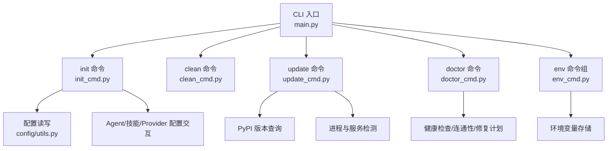
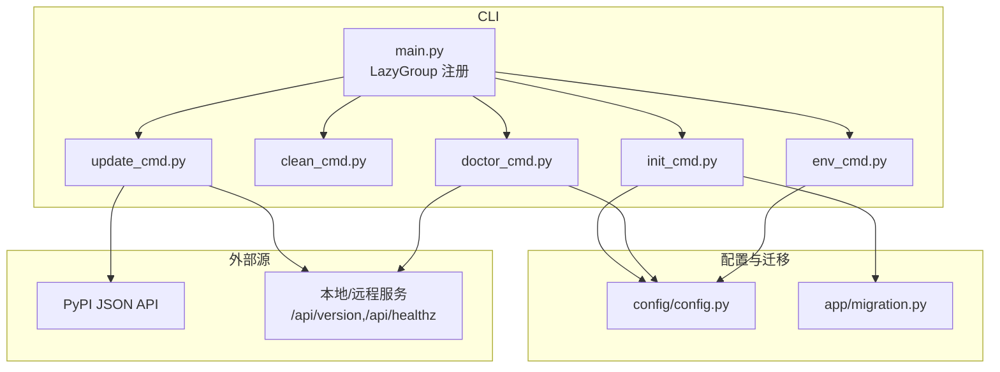
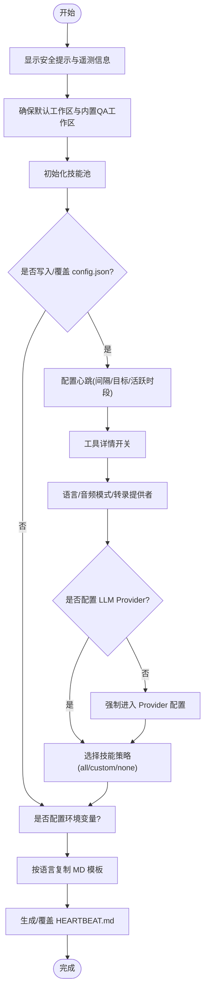
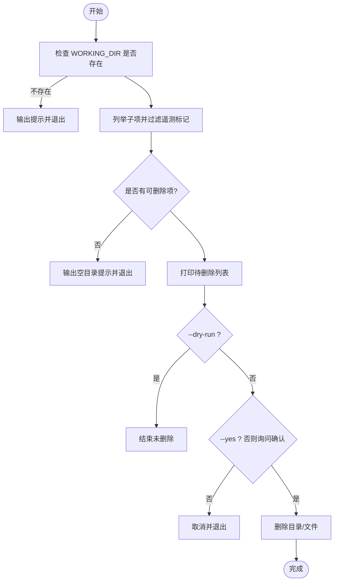
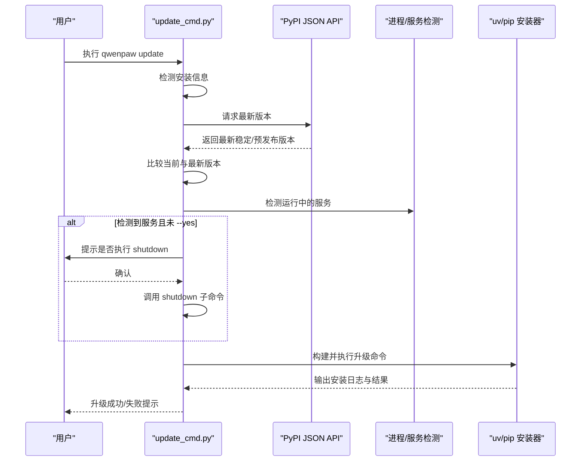
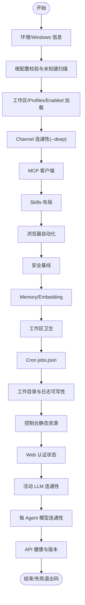
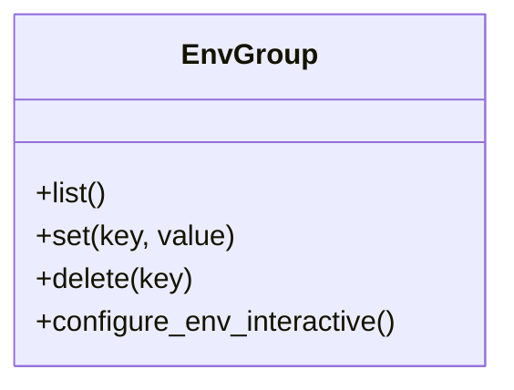
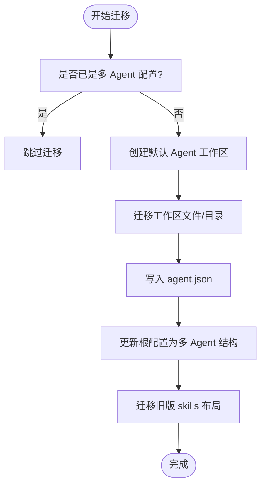
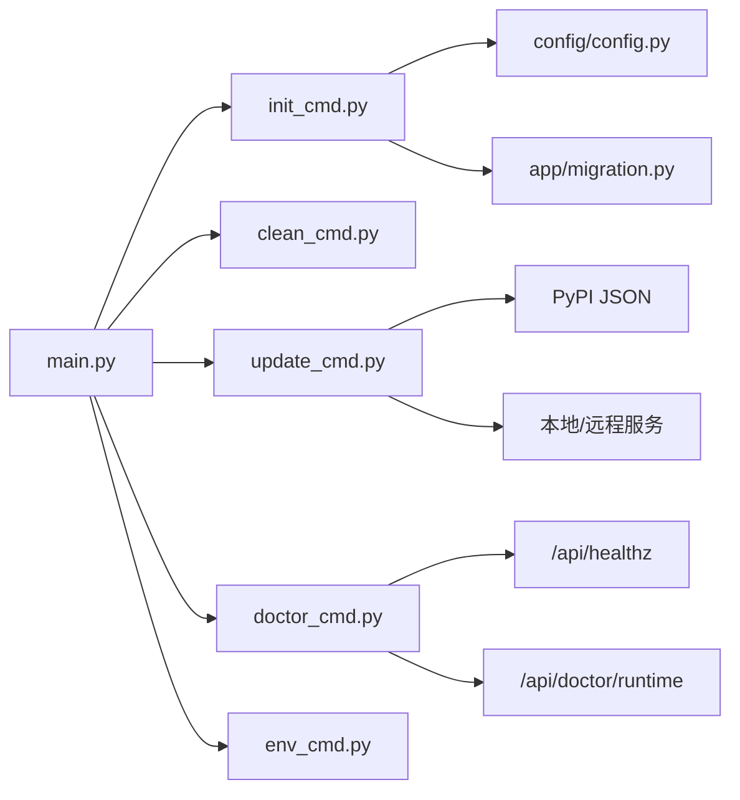

# 实用工具命令

<cite>
**本文引用的文件**   
- [src/qwenpaw/cli/main.py](file://src/qwenpaw/cli/main.py)
- [src/qwenpaw/cli/init_cmd.py](file://src/qwenpaw/cli/init_cmd.py)
- [src/qwenpaw/cli/clean_cmd.py](file://src/qwenpaw/cli/clean_cmd.py)
- [src/qwenpaw/cli/update_cmd.py](file://src/qwenpaw/cli/update_cmd.py)
- [src/qwenpaw/cli/doctor_cmd.py](file://src/qwenpaw/cli/doctor_cmd.py)
- [src/qwenpaw/cli/env_cmd.py](file://src/qwenpaw/cli/env_cmd.py)
- [src/qwenpaw/app/migration.py](file://src/qwenpaw/app/migration.py)
- [src/qwenpaw/config/config.py](file://src/qwenpaw/config/config.py)
- [src/qwenpaw/backup/__init__.py](file://src/qwenpaw/backup/__init__.py)
- [src/qwenpaw/backup/models.py](file://src/qwenpaw/backup/models.py)
</cite>

## 目录
1. [简介](#简介)
2. [项目结构](#项目结构)
3. [核心组件](#核心组件)
4. [架构总览](#架构总览)
5. [详细组件分析](#详细组件分析)
6. [依赖关系分析](#依赖关系分析)
7. [性能与可用性考虑](#性能与可用性考虑)
8. [故障排查指南](#故障排查指南)
9. [结论](#结论)
10. [附录：常用维护脚本与自动化方案](#附录常用维护脚本与自动化方案)

## 简介
本文件面向 QwenPaw 的实用工具 CLI，聚焦以下命令的使用与维护说明：
- 初始化命令 init：交互式创建工作目录、配置文件、心跳任务、技能集与环境变量等。
- 清理命令 clean：安全清理工作目录下的缓存与临时文件，保留必要标记文件。
- 更新命令 update：版本检查、自动升级流程、运行服务检测与回滚建议。
- 医生命令 doctor：系统诊断、健康检查、连通性探测与修复计划（含备份）。
- 环境变量管理 env：增删查环境变量的便捷入口。
- 配置迁移与数据备份恢复：从旧版单 Agent 到多 Agent 结构的迁移、工作区文件迁移、以及备份/导入/导出能力。

## 项目结构
QwenPaw 的 CLI 采用 Click 框架组织，主入口通过“惰性加载”机制按需引入子命令模块，减少启动开销。关键路径如下：
- 根命令与子命令注册：src/qwenpaw/cli/main.py
- 各功能命令实现：src/qwenpaw/cli/*_cmd.py
- 配置与迁移：src/qwenpaw/config/*.py, src/qwenpaw/app/migration.py
- 备份能力：src/qwenpaw/backup/*

图表来源
- [src/qwenpaw/cli/main.py:119-174](file://src/qwenpaw/cli/main.py#L119-L174)
- [src/qwenpaw/cli/init_cmd.py:152-175](file://src/qwenpaw/cli/init_cmd.py#L152-L175)
- [src/qwenpaw/cli/clean_cmd.py:20-27](file://src/qwenpaw/cli/clean_cmd.py#L20-L27)
- [src/qwenpaw/cli/update_cmd.py:675-688](file://src/qwenpaw/cli/update_cmd.py#L675-L688)
- [src/qwenpaw/cli/doctor_cmd.py:987-1030](file://src/qwenpaw/cli/doctor_cmd.py#L987-L1030)
- [src/qwenpaw/cli/env_cmd.py:10-13](file://src/qwenpaw/cli/env_cmd.py#L10-L13)

章节来源
- [src/qwenpaw/cli/main.py:119-174](file://src/qwenpaw/cli/main.py#L119-L174)

## 核心组件
本节概述各命令的职责与关键行为，后续章节将给出更详细的流程图与调用链。

- init：交互式引导创建工作目录、config.json、HEARTBEAT.md；可选同步技能池、配置 Provider、设置语言与音频模式、写入环境变量。
- clean：列出并删除 WORKING_DIR 下可移除内容，保留遥测标记文件；支持 dry-run 与强制确认。
- update：从 PyPI 获取最新版本，比较当前版本；检测运行中的服务并可选择关闭；构建安装命令（uv/pip），以前台或后台方式执行升级。
- doctor：运行只读检查（环境、配置、工作目录、静态资源、认证、LLM 连通性等）；提供 fix 子命令进行保守修复（默认备份）。
- env：list/set/delete 环境变量；init 中可调用交互式配置。

章节来源
- [src/qwenpaw/cli/init_cmd.py:152-175](file://src/qwenpaw/cli/init_cmd.py#L152-L175)
- [src/qwenpaw/cli/clean_cmd.py:20-27](file://src/qwenpaw/cli/clean_cmd.py#L20-L27)
- [src/qwenpaw/cli/update_cmd.py:675-688](file://src/qwenpaw/cli/update_cmd.py#L675-L688)
- [src/qwenpaw/cli/doctor_cmd.py:987-1030](file://src/qwenpaw/cli/doctor_cmd.py#L987-L1030)
- [src/qwenpaw/cli/env_cmd.py:10-13](file://src/qwenpaw/cli/env_cmd.py#L10-L13)

## 架构总览
下图展示 CLI 命令与相关子系统之间的交互关系。

图表来源
- [src/qwenpaw/cli/main.py:119-174](file://src/qwenpaw/cli/main.py#L119-L174)
- [src/qwenpaw/cli/init_cmd.py:152-175](file://src/qwenpaw/cli/init_cmd.py#L152-L175)
- [src/qwenpaw/cli/clean_cmd.py:20-27](file://src/qwenpaw/cli/clean_cmd.py#L20-L27)
- [src/qwenpaw/cli/update_cmd.py:675-688](file://src/qwenpaw/cli/update_cmd.py#L675-L688)
- [src/qwenpaw/cli/doctor_cmd.py:987-1030](file://src/qwenpaw/cli/doctor_cmd.py#L987-L1030)
- [src/qwenpaw/cli/env_cmd.py:10-13](file://src/qwenpaw/cli/env_cmd.py#L10-L13)
- [src/qwenpaw/config/config.py:2577-2605](file://src/qwenpaw/config/config.py#L2577-L2605)
- [src/qwenpaw/app/migration.py:56-80](file://src/qwenpaw/app/migration.py#L56-L80)

## 详细组件分析

### 初始化命令 (init)
- 目标：交互式创建或覆盖工作目录、配置文件、心跳任务、技能集、Provider 与语言/音频模式等。
- 关键流程：
  - 显示安全提示与遥测信息，必要时跳过或确认。
  - 确保默认 Agent 工作区与内置 QA Agent 存在，初始化技能池。
  - 生成/覆盖 config.json（心跳间隔、目标、活跃时段、工具详情开关、语言、音频模式、转录提供者等）。
  - 若未配置 LLM Provider，则强制进入 Provider 配置流程。
  - 根据选项同步技能池至工作区，或进入自定义技能选择。
  - 可选交互式配置环境变量。
  - 按语言复制 MD 模板文件，并生成 HEARTBEAT.md。
- 重要参数：
  - --force：覆盖现有配置文件与心跳文件。
  - --defaults：仅使用默认值，不交互（适合脚本/Docker）。
  - --accept-security：配合 --defaults 跳过安全确认。

图表来源
- [src/qwenpaw/cli/init_cmd.py:152-175](file://src/qwenpaw/cli/init_cmd.py#L152-L175)
- [src/qwenpaw/cli/init_cmd.py:230-246](file://src/qwenpaw/cli/init_cmd.py#L230-L246)
- [src/qwenpaw/cli/init_cmd.py:247-365](file://src/qwenpaw/cli/init_cmd.py#L247-L365)
- [src/qwenpaw/cli/init_cmd.py:367-392](file://src/qwenpaw/cli/init_cmd.py#L367-L392)
- [src/qwenpaw/cli/init_cmd.py:393-431](file://src/qwenpaw/cli/init_cmd.py#L393-L431)
- [src/qwenpaw/cli/init_cmd.py:432-441](file://src/qwenpaw/cli/init_cmd.py#L432-L441)
- [src/qwenpaw/cli/init_cmd.py:442-490](file://src/qwenpaw/cli/init_cmd.py#L442-L490)
- [src/qwenpaw/cli/init_cmd.py:491-531](file://src/qwenpaw/cli/init_cmd.py#L491-L531)

章节来源
- [src/qwenpaw/cli/init_cmd.py:152-175](file://src/qwenpaw/cli/init_cmd.py#L152-L175)
- [src/qwenpaw/cli/init_cmd.py:230-246](file://src/qwenpaw/cli/init_cmd.py#L230-L246)
- [src/qwenpaw/cli/init_cmd.py:247-365](file://src/qwenpaw/cli/init_cmd.py#L247-L365)
- [src/qwenpaw/cli/init_cmd.py:367-392](file://src/qwenpaw/cli/init_cmd.py#L367-L392)
- [src/qwenpaw/cli/init_cmd.py:393-431](file://src/qwenpaw/cli/init_cmd.py#L393-L431)
- [src/qwenpaw/cli/init_cmd.py:432-441](file://src/qwenpaw/cli/init_cmd.py#L432-L441)
- [src/qwenpaw/cli/init_cmd.py:442-490](file://src/qwenpaw/cli/init_cmd.py#L442-L490)
- [src/qwenpaw/cli/init_cmd.py:491-531](file://src/qwenpaw/cli/init_cmd.py#L491-L531)

### 清理命令 (clean)
- 目标：清理 WORKING_DIR 下的缓存与临时文件，释放存储空间。
- 行为要点：
  - 列出待删除项，保留遥测标记文件。
  - 支持 --dry-run 预览不删除；--yes 跳过确认。
  - 递归删除目录（非软链接）与文件，忽略已不存在项。
- 适用场景：磁盘空间不足、清理历史会话/缓存后重新扫描。

图表来源
- [src/qwenpaw/cli/clean_cmd.py:20-27](file://src/qwenpaw/cli/clean_cmd.py#L20-L27)
- [src/qwenpaw/cli/clean_cmd.py:28-77](file://src/qwenpaw/cli/clean_cmd.py#L28-L77)

章节来源
- [src/qwenpaw/cli/clean_cmd.py:20-27](file://src/qwenpaw/cli/clean_cmd.py#L20-L27)
- [src/qwenpaw/cli/clean_cmd.py:28-77](file://src/qwenpaw/cli/clean_cmd.py#L28-L77)

### 更新命令 (update)
- 目标：在当前 Python 环境中升级到最新版本，包含版本检查、运行服务检测、自动关闭服务、安装器选择与执行。
- 关键流程：
  - 检测当前安装信息（包路径、Python 解释器、环境类型、安装器 uv/pip）。
  - 从 PyPI 获取最新版本，比较当前版本。
  - 检测运行中的 QwenPaw 服务（HTTP /api/version 或进程推断），必要时提示并执行 shutdown。
  - 构建升级命令（优先 uv pip，否则 pip），以前台或后台方式执行。
  - 在 Windows 上为避免锁定可执行文件，会以后台方式继续安装。
- 回滚建议：
  - 升级失败时，命令行会提示修复错误并重试。
  - 如需回滚，可使用指定旧版本号再次执行升级（例如 qwenpaw==x.y.z）。

图表来源
- [src/qwenpaw/cli/update_cmd.py:675-688](file://src/qwenpaw/cli/update_cmd.py#L675-L688)
- [src/qwenpaw/cli/update_cmd.py:181-211](file://src/qwenpaw/cli/update_cmd.py#L181-L211)
- [src/qwenpaw/cli/update_cmd.py:93-117](file://src/qwenpaw/cli/update_cmd.py#L93-L117)
- [src/qwenpaw/cli/update_cmd.py:214-233](file://src/qwenpaw/cli/update_cmd.py#L214-L233)
- [src/qwenpaw/cli/update_cmd.py:391-424](file://src/qwenpaw/cli/update_cmd.py#L391-L424)
- [src/qwenpaw/cli/update_cmd.py:547-577](file://src/qwenpaw/cli/update_cmd.py#L547-L577)

章节来源
- [src/qwenpaw/cli/update_cmd.py:675-688](file://src/qwenpaw/cli/update_cmd.py#L675-L688)
- [src/qwenpaw/cli/update_cmd.py:181-211](file://src/qwenpaw/cli/update_cmd.py#L181-L211)
- [src/qwenpaw/cli/update_cmd.py:93-117](file://src/qwenpaw/cli/update_cmd.py#L93-L117)
- [src/qwenpaw/cli/update_cmd.py:214-233](file://src/qwenpaw/cli/update_cmd.py#L214-L233)
- [src/qwenpaw/cli/update_cmd.py:391-424](file://src/qwenpaw/cli/update_cmd.py#L391-L424)
- [src/qwenpaw/cli/update_cmd.py:547-577](file://src/qwenpaw/cli/update_cmd.py#L547-L577)

### 医生命令 (doctor)
- 目标：对系统进行只读健康检查，并提供保守修复计划（带备份）。
- 检查范围：
  - 环境与 Windows 特有项
  - 根配置校验与未知键扫描
  - 多 Agent/工作区、启用 Agent 的 agent.json 与模型连接
  - 启用的 Channel 连通性（--deep）
  - MCP 客户端、Skills 布局、浏览器自动化、安全基线、内存/嵌入、工作区卫生
  - Cron jobs.json 校验与规范化
  - 工作目录与日志可写性、控制台静态资源、Web 认证状态
  - 活动 LLM 连通性与每 Agent 模型连通性
  - API 健康与版本一致性
- 修复子命令 fix：
  - 支持 --dry-run 预览、--only 指定修复 ID、--no-backup/--backup-dir 控制备份、--non-interactive 限制高风险操作。
  - 默认在 working_dir 下创建 doctor-fix-backups/ 备份。

图表来源
- [src/qwenpaw/cli/doctor_cmd.py:434-985](file://src/qwenpaw/cli/doctor_cmd.py#L434-L985)
- [src/qwenpaw/cli/doctor_cmd.py:987-1030](file://src/qwenpaw/cli/doctor_cmd.py#L987-L1030)
- [src/qwenpaw/cli/doctor_cmd.py:1032-1102](file://src/qwenpaw/cli/doctor_cmd.py#L1032-L1102)

章节来源
- [src/qwenpaw/cli/doctor_cmd.py:434-985](file://src/qwenpaw/cli/doctor_cmd.py#L434-L985)
- [src/qwenpaw/cli/doctor_cmd.py:987-1030](file://src/qwenpaw/cli/doctor_cmd.py#L987-L1030)
- [src/qwenpaw/cli/doctor_cmd.py:1032-1102](file://src/qwenpaw/cli/doctor_cmd.py#L1032-L1102)

### 环境变量管理 (env)
- 目标：提供 list/set/delete 子命令，便于集中管理环境变量。
- 交互集成：init 中可调用交互式配置，循环添加/修改变量。

图表来源
- [src/qwenpaw/cli/env_cmd.py:10-13](file://src/qwenpaw/cli/env_cmd.py#L10-L13)
- [src/qwenpaw/cli/env_cmd.py:20-31](file://src/qwenpaw/cli/env_cmd.py#L20-L31)
- [src/qwenpaw/cli/env_cmd.py:39-46](file://src/qwenpaw/cli/env_cmd.py#L39-L46)
- [src/qwenpaw/cli/env_cmd.py:53-68](file://src/qwenpaw/cli/env_cmd.py#L53-L68)
- [src/qwenpaw/cli/env_cmd.py:75-99](file://src/qwenpaw/cli/env_cmd.py#L75-L99)

章节来源
- [src/qwenpaw/cli/env_cmd.py:10-13](file://src/qwenpaw/cli/env_cmd.py#L10-L13)
- [src/qwenpaw/cli/env_cmd.py:20-31](file://src/qwenpaw/cli/env_cmd.py#L20-L31)
- [src/qwenpaw/cli/env_cmd.py:39-46](file://src/qwenpaw/cli/env_cmd.py#L39-L46)
- [src/qwenpaw/cli/env_cmd.py:53-68](file://src/qwenpaw/cli/env_cmd.py#L53-L68)
- [src/qwenpaw/cli/env_cmd.py:75-99](file://src/qwenpaw/cli/env_cmd.py#L75-L99)

### 配置迁移与数据备份恢复
- 配置迁移：
  - 从旧版单 Agent 配置迁移到多 Agent 结构，创建默认 Agent 工作区与 agent.json，迁移工作区文件（sessions、memory、jobs.json、chats.json 等），并保留根配置字段以兼容降级。
  - 旧版 skill 布局迁移：将 active_skills/customized_skills 合并到 workspaces/<id>/skills/，处理同名冲突与启用状态。
  - 旧 provider 名称 copaw-local → qwenpaw-local 的迁移逻辑。
- 数据备份恢复：
  - 提供 create_stream、list_backups、get_backup、delete_backups、export_backup、import_backup、execute_restore 等能力，用于备份/导入/导出与恢复。

图表来源
- [src/qwenpaw/app/migration.py:56-80](file://src/qwenpaw/app/migration.py#L56-L80)
- [src/qwenpaw/app/migration.py:82-229](file://src/qwenpaw/app/migration.py#L82-L229)
- [src/qwenpaw/app/migration.py:297-337](file://src/qwenpaw/app/migration.py#L297-L337)
- [src/qwenpaw/app/migration.py:339-629](file://src/qwenpaw/app/migration.py#L339-L629)
- [src/qwenpaw/config/config.py:2577-2605](file://src/qwenpaw/config/config.py#L2577-L2605)
- [src/qwenpaw/backup/__init__.py:1-22](file://src/qwenpaw/backup/__init__.py#L1-L22)
- [src/qwenpaw/backup/models.py:35-80](file://src/qwenpaw/backup/models.py#L35-L80)

章节来源
- [src/qwenpaw/app/migration.py:56-80](file://src/qwenpaw/app/migration.py#L56-L80)
- [src/qwenpaw/app/migration.py:82-229](file://src/qwenpaw/app/migration.py#L82-L229)
- [src/qwenpaw/app/migration.py:297-337](file://src/qwenpaw/app/migration.py#L297-L337)
- [src/qwenpaw/app/migration.py:339-629](file://src/qwenpaw/app/migration.py#L339-L629)
- [src/qwenpaw/config/config.py:2577-2605](file://src/qwenpaw/config/config.py#L2577-L2605)
- [src/qwenpaw/backup/__init__.py:1-22](file://src/qwenpaw/backup/__init__.py#L1-L22)
- [src/qwenpaw/backup/models.py:35-80](file://src/qwenpaw/backup/models.py#L35-L80)

## 依赖关系分析
- CLI 入口 main.py 通过 LazyGroup 延迟加载子命令模块，避免不必要的 import 开销。
- init_cmd 依赖配置读写、ProviderManager、SkillPoolService、迁移工具等。
- update_cmd 依赖 PyPI JSON API、httpx、subprocess、进程表解析等。
- doctor_cmd 依赖 HTTP 健康端点、运行时诊断接口、配置校验、扩展贡献者注册等。
- env_cmd 依赖环境变量存储模块。

图表来源
- [src/qwenpaw/cli/main.py:119-174](file://src/qwenpaw/cli/main.py#L119-L174)
- [src/qwenpaw/cli/init_cmd.py:152-175](file://src/qwenpaw/cli/init_cmd.py#L152-L175)
- [src/qwenpaw/cli/clean_cmd.py:20-27](file://src/qwenpaw/cli/clean_cmd.py#L20-L27)
- [src/qwenpaw/cli/update_cmd.py:675-688](file://src/qwenpaw/cli/update_cmd.py#L675-L688)
- [src/qwenpaw/cli/doctor_cmd.py:987-1030](file://src/qwenpaw/cli/doctor_cmd.py#L987-L1030)
- [src/qwenpaw/cli/env_cmd.py:10-13](file://src/qwenpaw/cli/env_cmd.py#L10-L13)

章节来源
- [src/qwenpaw/cli/main.py:119-174](file://src/qwenpaw/cli/main.py#L119-L174)

## 性能与可用性考虑
- 启动性能：main.py 记录导入耗时并在需要时重放，有助于定位慢导入。
- 更新流程：
  - 在 Windows 上以后台方式执行以避免锁定可执行文件。
  - 使用 uv pip 优先，提升安装速度。
  - 升级前检测运行服务并尝试优雅关闭，降低文件占用风险。
- 清理与迁移：
  - clean 命令支持 dry-run，避免误删。
  - 迁移过程幂等与非破坏性，避免覆盖已有新布局文件。

[本节为通用指导，无需特定文件引用]

## 故障排查指南
- 无法访问 PyPI 或网络受限：
  - update 命令会抛出异常并提示网络问题，建议使用代理或离线包。
- 运行中的服务阻止更新：
  - update 会检测并提示执行 shutdown；若仍失败，请手动停止服务后再重试。
- 配置校验失败：
  - doctor 会报告根配置校验失败并给出修复建议；先修复根配置再运行其他检查。
- 控制台静态资源缺失：
  - doctor 会提示构建 console/ 或设置静态目录环境变量。
- 工作目录不可写：
  - doctor 会指出不可写路径，需调整权限或设置正确的 QWENPAW_WORKING_DIR。
- 回滚升级：
  - 使用指定旧版本号再次执行 update（如 qwenpaw==x.y.z）进行回滚。

章节来源
- [src/qwenpaw/cli/update_cmd.py:675-688](file://src/qwenpaw/cli/update_cmd.py#L675-L688)
- [src/qwenpaw/cli/doctor_cmd.py:434-985](file://src/qwenpaw/cli/doctor_cmd.py#L434-L985)

## 结论
QwenPaw 的实用工具 CLI 提供了完善的初始化、清理、更新、诊断与环境管理能力，结合配置迁移与备份恢复，能够支撑日常运维与故障处理。建议在自动化流水线中结合 doctor 与 clean 命令进行定期巡检与空间优化，并使用 update 的安全流程保持版本一致。

[本节为总结，无需特定文件引用]

## 附录：常用维护脚本与自动化方案
- 定期巡检：
  - 定时执行 doctor --timeout=5 --llm-timeout=15，收集输出并告警。
  - 结合 doctor fix --dry-run 预览修复计划，人工确认后应用。
- 空间优化：
  - 在低峰期执行 clean --dry-run 预览，随后 clean --yes 执行清理。
- 版本管理：
  - 使用 update --prerelease 在测试环境验证预发布版本，稳定后再在生产环境执行 update。
- 备份与恢复：
  - 在执行重大变更（如迁移、升级）前，使用备份能力导出快照；出现问题时按 restore 流程恢复。

[本节为通用指导，无需特定文件引用]