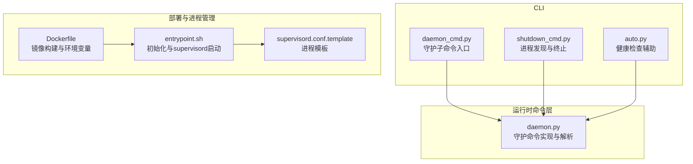
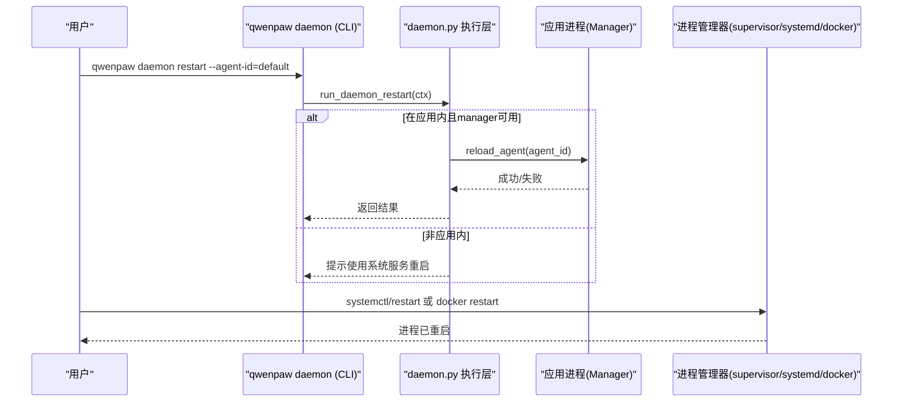
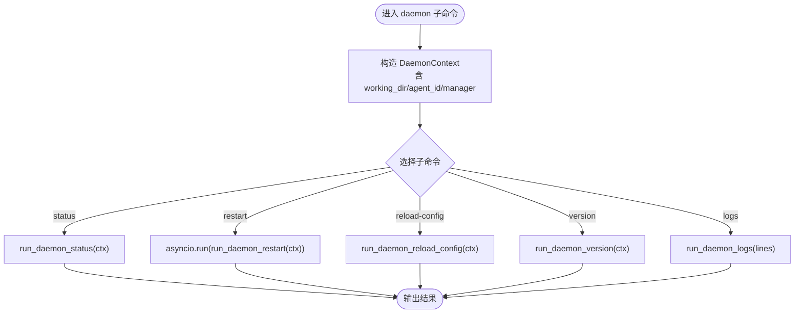
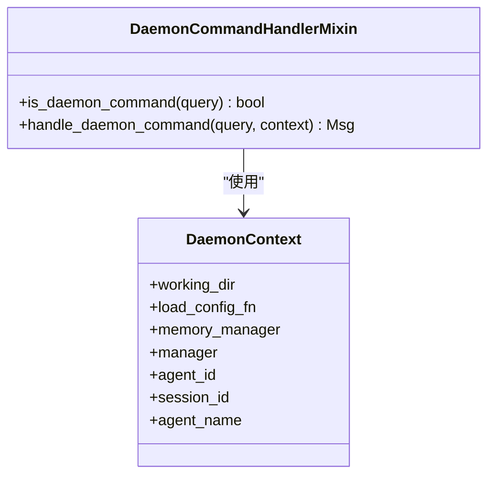
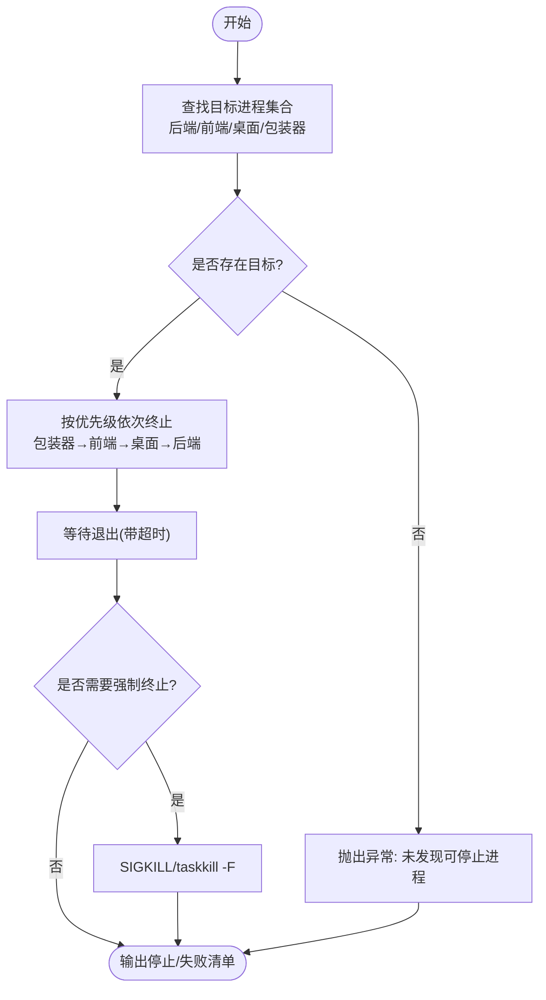
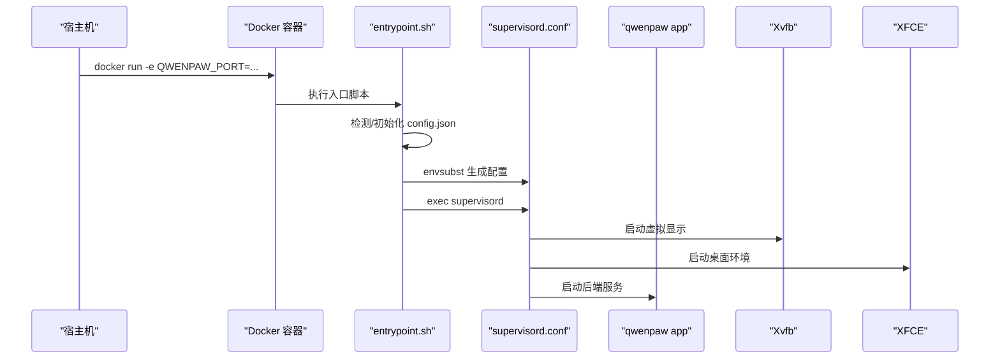
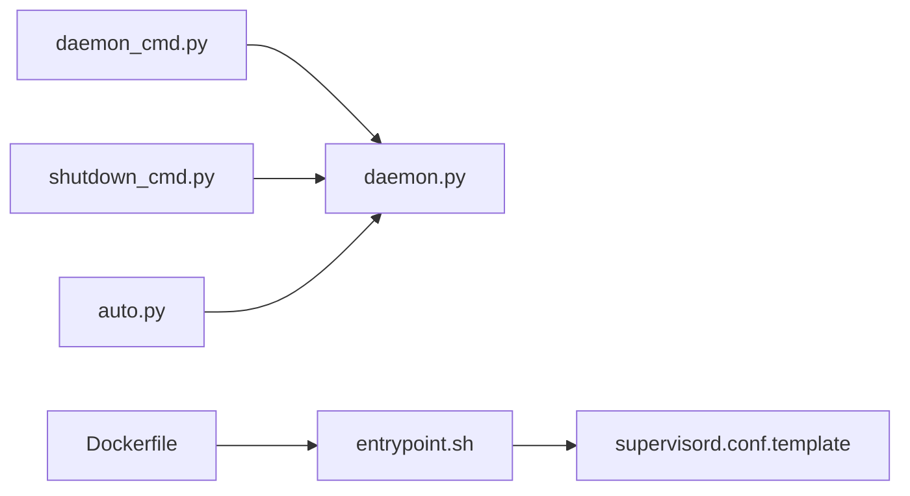

# 守护进程管理

<cite>
**本文引用的文件**   
- [daemon_cmd.py](file://src/qwenpaw/cli/daemon_cmd.py)
- [daemon.py](file://src/qwenpaw/runtime/commands/daemon.py)
- [shutdown_cmd.py](file://src/qwenpaw/cli/shutdown_cmd.py)
- [supervisord.conf.template](file://deploy/config/supervisord.conf.template)
- [Dockerfile](file://deploy/Dockerfile)
- [entrypoint.sh](file://deploy/entrypoint.sh)
- [auto.py](file://src/qwenpaw/cli/auto.py)
</cite>

## 目录
1. [简介](#简介)
2. [项目结构](#项目结构)
3. [核心组件](#核心组件)
4. [架构总览](#架构总览)
5. [详细组件分析](#详细组件分析)
6. [依赖关系分析](#依赖关系分析)
7. [性能与资源考虑](#性能与资源考虑)
8. [故障排除指南](#故障排除指南)
9. [结论](#结论)
10. [附录：生产部署最佳实践](#附录生产部署最佳实践)

## 简介
本文件面向运维与平台工程师，系统化说明 QwenPaw 的“守护进程管理”能力，包括：
- 后台运行模式与配置选项
- 服务生命周期管理（启动、停止、重启）
- 进程状态监控方法
- 系统服务集成（systemd、launchd、supervisor、Docker）
- 日志轮转、资源限制、崩溃恢复等高级配置
- 生产环境部署最佳实践与故障排除

## 项目结构
围绕守护进程管理的核心代码与部署脚本分布如下：
- CLI 守护命令入口：daemon_cmd.py
- 守护命令执行层（共享给聊天内 /daemon 与 CLI）：daemon.py
- 进程发现与优雅关闭：shutdown_cmd.py
- 容器化与进程管理器集成：Dockerfile、entrypoint.sh、supervisord.conf.template
- 健康检查辅助：auto.py

图示来源
- [daemon_cmd.py:1-117](file://src/qwenpaw/cli/daemon_cmd.py#L1-L117)
- [daemon.py:1-278](file://src/qwenpaw/runtime/commands/daemon.py#L1-L278)
- [shutdown_cmd.py:1-386](file://src/qwenpaw/cli/shutdown_cmd.py#L1-L386)
- [Dockerfile:1-112](file://deploy/Dockerfile#L1-L112)
- [entrypoint.sh:1-52](file://deploy/entrypoint.sh#L1-L52)
- [supervisord.conf.template:1-43](file://deploy/config/supervisord.conf.template#L1-L43)

章节来源
- [daemon_cmd.py:1-117](file://src/qwenpaw/cli/daemon_cmd.py#L1-L117)
- [daemon.py:1-278](file://src/qwenpaw/runtime/commands/daemon.py#L1-L278)
- [shutdown_cmd.py:1-386](file://src/qwenpaw/cli/shutdown_cmd.py#L1-L386)
- [Dockerfile:1-112](file://deploy/Dockerfile#L1-L112)
- [entrypoint.sh:1-52](file://deploy/entrypoint.sh#L1-L52)
- [supervisord.conf.template:1-43](file://deploy/config/supervisord.conf.template#L1-L43)

## 核心组件
- 守护命令组与子命令
  - 提供 status、restart、reload-config、version、logs 等子命令，支持 --agent-id 指定工作区。
  - 通过 DaemonContext 注入工作目录、内存管理器、多代理管理器等信息。
- 守护命令执行层
  - 解析 /daemon 或短别名（如 /restart），统一处理并返回结构化文本结果。
  - 支持“零停机重载”：在应用内调用 manager.reload_agent(agent_id)。
- 进程管理与停止
  - 跨平台监听端口查找、进程树终止、Windows 特殊处理、等待退出与强制终止。
- 容器与进程管理器集成
  - Dockerfile 定义环境变量、依赖、端口；entrypoint.sh 完成初始化并生成 supervisord 配置；supervisord.conf.template 定义 app/dbus/xvfb/xfce4 等程序。
- 健康检查
  - auto.py 通过 HEAD /version 探测守护是否可达，用于其他 CLI 前置校验。

章节来源
- [daemon_cmd.py:1-117](file://src/qwenpaw/cli/daemon_cmd.py#L1-L117)
- [daemon.py:1-278](file://src/qwenpaw/runtime/commands/daemon.py#L1-L278)
- [shutdown_cmd.py:1-386](file://src/qwenpaw/cli/shutdown_cmd.py#L1-L386)
- [Dockerfile:1-112](file://deploy/Dockerfile#L1-L112)
- [entrypoint.sh:1-52](file://deploy/entrypoint.sh#L1-L52)
- [supervisord.conf.template:1-43](file://deploy/config/supervisord.conf.template#L1-L43)
- [auto.py:31-68](file://src/qwenpaw/cli/auto.py#L31-L68)

## 架构总览
守护进程管理由“CLI 命令层 + 运行时命令实现 + 进程管理器/容器编排”共同构成。CLI 负责用户交互与参数解析；运行时命令层提供具体逻辑（状态、重启、重载配置、日志查看）；进程管理器（supervisor/systemd/docker）负责进程生命周期与健康恢复。

图示来源
- [daemon_cmd.py:66-76](file://src/qwenpaw/cli/daemon_cmd.py#L66-L76)
- [daemon.py:143-168](file://src/qwenpaw/runtime/commands/daemon.py#L143-L168)

## 详细组件分析

### 守护命令组与上下文（CLI 侧）
- 功能要点
  - 注册 daemon 命令组及子命令：status、restart、reload-config、version、logs。
  - 通过 _context 构造 DaemonContext，包含 working_dir、memory_manager、manager、agent_id 等。
  - logs 子命令支持 -n/--lines 控制输出行数。
- 关键流程
  - 根据 agent_id 解析工作目录；若未找到则回退到默认 WORKING_DIR。
  - 将上下文传递给运行时命令层执行。

图示来源
- [daemon_cmd.py:25-46](file://src/qwenpaw/cli/daemon_cmd.py#L25-L46)
- [daemon_cmd.py:53-117](file://src/qwenpaw/cli/daemon_cmd.py#L53-L117)

章节来源
- [daemon_cmd.py:1-117](file://src/qwenpaw/cli/daemon_cmd.py#L1-L117)

### 守护命令执行层（运行时侧）
- 功能要点
  - 解析 /daemon 或短别名，路由至对应处理函数。
  - status：读取配置、最大输入长度、工作目录、内存管理器状态。
  - restart：若存在 manager 与 agent_id，则调用 manager.reload_agent 实现零停机重载；否则给出外部重启建议。
  - reload-config：重新加载配置对象。
  - version：返回版本与工作目录、日志路径。
  - logs：安全地 tail 项目日志文件（限制读取大小与行数）。
- 数据结构
  - DaemonContext：承载工作目录、配置加载函数、内存管理器、多代理管理器、会话 ID、代理名称等。

图示来源
- [daemon.py:46-59](file://src/qwenpaw/runtime/commands/daemon.py#L46-L59)
- [daemon.py:232-278](file://src/qwenpaw/runtime/commands/daemon.py#L232-L278)

章节来源
- [daemon.py:1-278](file://src/qwenpaw/runtime/commands/daemon.py#L1-L278)

### 进程发现与优雅停止（shutdown）
- 功能要点
  - 跨平台查找监听端口的后端进程、前端开发进程、桌面包装进程及其祖先进程。
  - Unix 下递归收集子进程并发送 SIGTERM/SIGKILL；Windows 下使用 taskkill/Powershell 终止。
  - 等待进程退出，超时后强制终止，汇总停止结果与失败列表。
- 适用场景
  - 本地调试时快速清理残留进程；CI 中确保干净环境。

图示来源
- [shutdown_cmd.py:34-87](file://src/qwenpaw/cli/shutdown_cmd.py#L34-L87)
- [shutdown_cmd.py:155-288](file://src/qwenpaw/cli/shutdown_cmd.py#L155-L288)
- [shutdown_cmd.py:291-386](file://src/qwenpaw/cli/shutdown_cmd.py#L291-L386)

章节来源
- [shutdown_cmd.py:1-386](file://src/qwenpaw/cli/shutdown_cmd.py#L1-L386)

### 容器与进程管理器集成（Docker + Supervisor）
- Dockerfile
  - 设置工作目录、密钥与备份目录环境变量。
  - 安装 Chromium、Xvfb、XFCE、Supervisor 等依赖。
  - 暴露默认端口（QWENPAW_PORT=8088）。
- entrypoint.sh
  - 若缺少 config.json 则自动初始化。
  - 基于环境变量替换 supervisord 模板并启动 supervisor。
  - 当未启用认证且绑定到所有接口时输出安全警告。
- supervisord.conf.template
  - 定义 dbus、app、xvfb、xfce4 四个程序，设置自启、重启策略、优先级与日志路径。
  - 为 app 程序注入 DISPLAY、Chromium 可执行路径、容器标识等环境变量。

图示来源
- [Dockerfile:1-112](file://deploy/Dockerfile#L1-L112)
- [entrypoint.sh:1-52](file://deploy/entrypoint.sh#L1-L52)
- [supervisord.conf.template:1-43](file://deploy/config/supervisord.conf.template#L1-L43)

章节来源
- [Dockerfile:1-112](file://deploy/Dockerfile#L1-L112)
- [entrypoint.sh:1-52](file://deploy/entrypoint.sh#L1-L52)
- [supervisord.conf.template:1-43](file://deploy/config/supervisord.conf.template#L1-L43)

### 健康检查与可用性探测
- auto.py 通过 HEAD /version 探测守护是否可达，不可达时提示先启动守护进程。
- 该机制可用于其他 CLI 子命令的前置校验，避免误操作。

章节来源
- [auto.py:31-68](file://src/qwenpaw/cli/auto.py#L31-L68)

## 依赖关系分析
- CLI 守护命令依赖运行时命令层提供的具体实现。
- 运行时命令层依赖配置加载、日志路径、多代理管理器（可选）。
- 容器与进程管理器依赖环境变量与模板渲染。
- shutdown 模块依赖操作系统工具（lsof/fuser/netstat/pgrep/taskkill 等）。

图示来源
- [daemon_cmd.py:1-117](file://src/qwenpaw/cli/daemon_cmd.py#L1-L117)
- [daemon.py:1-278](file://src/qwenpaw/runtime/commands/daemon.py#L1-L278)
- [shutdown_cmd.py:1-386](file://src/qwenpaw/cli/shutdown_cmd.py#L1-L386)
- [Dockerfile:1-112](file://deploy/Dockerfile#L1-L112)
- [entrypoint.sh:1-52](file://deploy/entrypoint.sh#L1-L52)
- [supervisord.conf.template:1-43](file://deploy/config/supervisord.conf.template#L1-L43)
- [auto.py:31-68](file://src/qwenpaw/cli/auto.py#L31-L68)

## 性能与资源考虑
- 日志读取优化：tail 实现限制最大读取字节数与行数，避免大日志导致高内存与延迟。
- 进程终止策略：优先优雅终止（SIGTERM），再强制终止（SIGKILL），减少数据不一致风险。
- 容器资源：通过进程管理器统一管理多个子系统（dbus、xvfb、xfce4、app），合理设置优先级与重启策略。

[本节为通用指导，不直接分析具体文件]

## 故障排除指南
- 无法停止进程
  - 现象：shutdown 命令报告部分 PID 停止失败。
  - 排查：确认端口占用、权限不足、进程树复杂；必要时手动使用系统工具定位并终止。
- 守护不可达
  - 现象：其他 CLI 提示守护不可达。
  - 排查：检查端口与防火墙；使用 healthz/version 端点验证；确认容器端口映射。
- 容器启动无配置
  - 现象：首次启动自动初始化；后续启动跳过。
  - 排查：确认挂载的工作目录中存在 config.json；检查环境变量是否正确。
- 浏览器/截图相关错误
  - 现象：Chromium 沙箱或显示问题。
  - 排查：确认已安装 Chromium、Xvfb、XFCE；检查 DISPLAY 与 no-sandbox 标志。

章节来源
- [shutdown_cmd.py:291-386](file://src/qwenpaw/cli/shutdown_cmd.py#L291-L386)
- [auto.py:31-68](file://src/qwenpaw/cli/auto.py#L31-L68)
- [entrypoint.sh:1-52](file://deploy/entrypoint.sh#L1-L52)
- [Dockerfile:1-112](file://deploy/Dockerfile#L1-L112)

## 结论
QwenPaw 的守护进程管理以 CLI 命令为核心，结合运行时命令层与进程管理器，提供了完善的启动、停止、重启、重载配置与日志查看能力。在容器环境中，通过 entrypoint 与 supervisord 模板实现了开箱即用的多进程编排与自愈。配合健康检查与优雅终止策略，可满足生产环境的稳定性与可维护性要求。

[本节为总结，不直接分析具体文件]

## 附录：生产部署最佳实践
- 进程管理器
  - 推荐使用 supervisor 或 systemd 管理主进程，配置 autorestart 与 startsecs，保证异常退出后的自动恢复。
- 日志轮转
  - 使用系统级日志轮转（logrotate）或进程管理器的 stdout/stderr 日志分离，定期归档与清理。
- 资源限制
  - 在 systemd 中使用 MemoryLimit/CPUQuota，或在容器中使用 cgroup 限制 CPU/内存，防止资源争用。
- 崩溃恢复
  - 开启进程管理器的自动重启；对关键子系统（如浏览器、显示）设置独立进程与重启策略。
- 安全加固
  - 容器外网暴露时务必启用认证；避免以 root 运行应用进程；最小化端口暴露。
- 监控与告警
  - 暴露健康检查端点；结合 Prometheus/Grafana 或云监控采集指标；对重启次数与错误率设置告警。
- 升级与回滚
  - 采用滚动更新或蓝绿发布；保留上一版本镜像与配置快照；灰度验证后再全量切换。

[本节为通用指导，不直接分析具体文件]