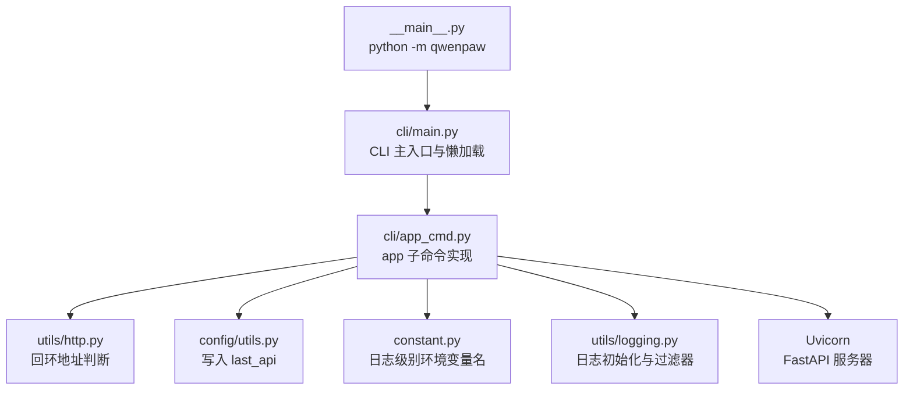
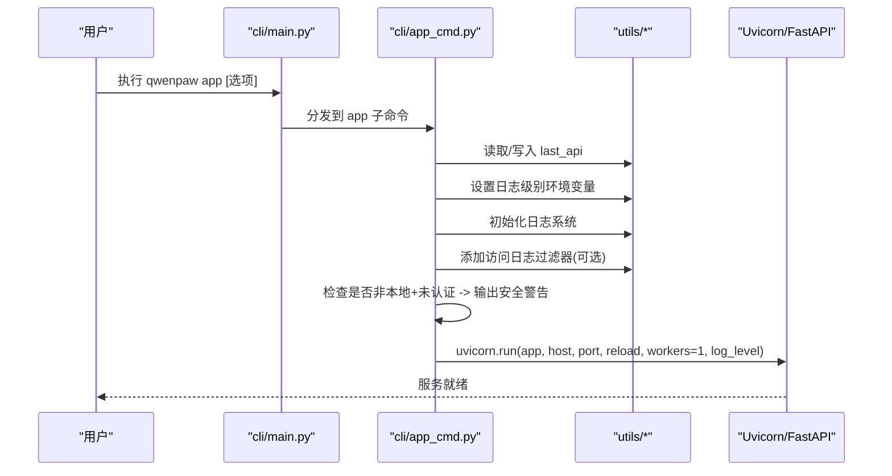
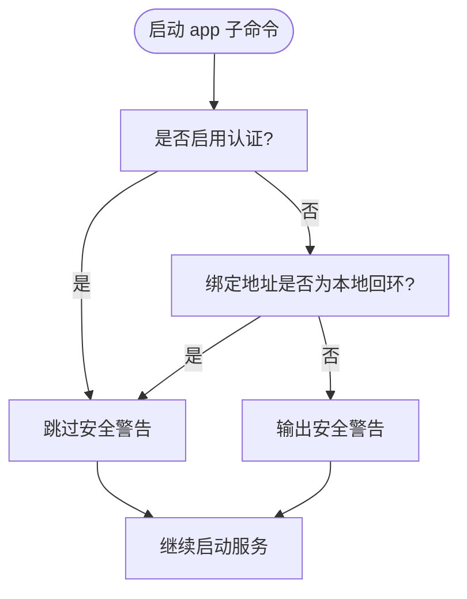
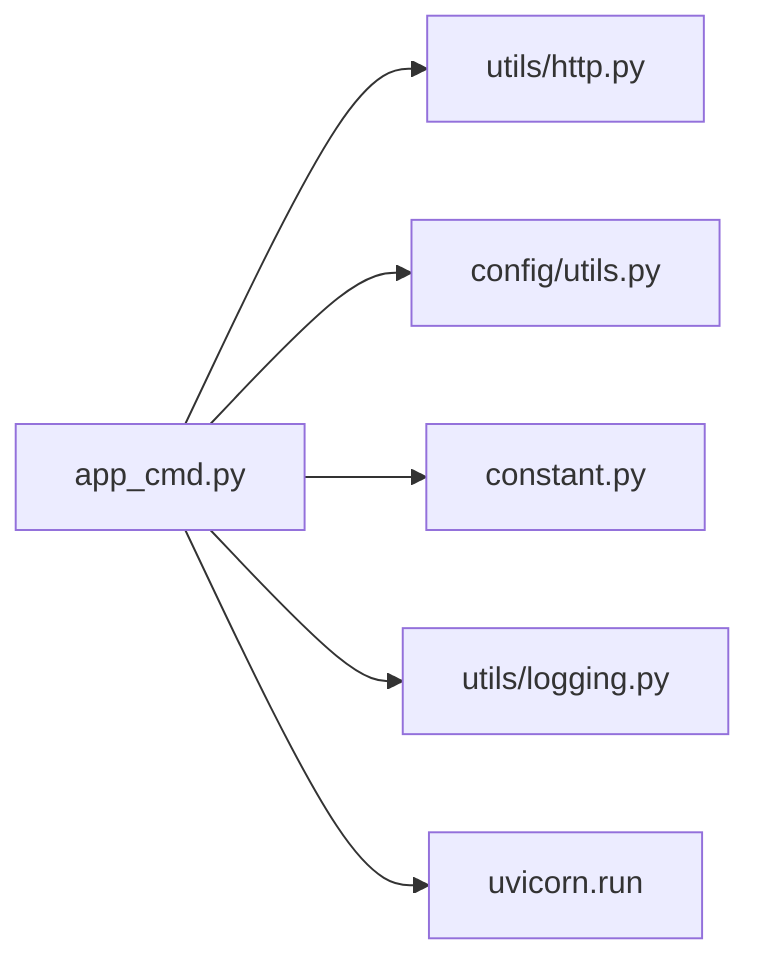

# 应用启动命令

<cite>
**本文引用的文件**   
- [src/qwenpaw/cli/app_cmd.py](file://src/qwenpaw/cli/app_cmd.py)
- [src/qwenpaw/cli/main.py](file://src/qwenpaw/cli/main.py)
- [src/qwenpaw/__main__.py](file://src/qwenpaw/__main__.py)
- [src/qwenpaw/utils/http.py](file://src/qwenpaw/utils/http.py)
- [src/qwenpaw/config/utils.py](file://src/qwenpaw/config/utils.py)
- [src/qwenpaw/constant.py](file://src/qwenpaw/constant.py)
- [src/qwenpaw/utils/logging.py](file://src/qwenpaw/utils/logging.py)
</cite>

## 目录
1. [简介](#简介)
2. [项目结构](#项目结构)
3. [核心组件](#核心组件)
4. [架构总览](#架构总览)
5. [详细组件分析](#详细组件分析)
6. [依赖关系分析](#依赖关系分析)
7. [性能与模式说明](#性能与模式说明)
8. [故障排查指南](#故障排查指南)
9. [结论](#结论)
10. [附录：常用启动示例与最佳实践](#附录常用启动示例与最佳实践)

## 简介
本文件为 QwenPaw 的“应用启动命令”提供权威文档，聚焦于通过命令行启动后端服务的参数、行为与安全提示。内容涵盖：
- 所有启动参数的用法与默认值（如 --host、--port、--reload、--log-level、--hide-access-paths 等）
- 开发模式与生产模式的差异
- 自动重载机制的使用场景与注意事项
- 安全警告机制：当服务绑定到非本地地址且未启用认证时的提示
- 常见启动配置示例与最佳实践建议

## 项目结构
QwenPaw 的 CLI 入口采用 Click 框架组织，主命令组在 main.py 中定义并支持懒加载子命令；应用启动子命令 app 的实现位于 app_cmd.py，负责解析参数、设置日志、过滤访问日志、持久化上次 API 地址、输出安全提示并最终调用 Uvicorn 启动 FastAPI 应用。

图表来源
- [src/qwenpaw/__main__.py:1-7](file://src/qwenpaw/__main__.py#L1-L7)
- [src/qwenpaw/cli/main.py:119-174](file://src/qwenpaw/cli/main.py#L119-L174)
- [src/qwenpaw/cli/app_cmd.py:52-151](file://src/qwenpaw/cli/app_cmd.py#L52-L151)
- [src/qwenpaw/utils/http.py:10-18](file://src/qwenpaw/utils/http.py#L10-L18)
- [src/qwenpaw/config/utils.py](file://src/qwenpaw/config/utils.py)
- [src/qwenpaw/constant.py](file://src/qwenpaw/constant.py)
- [src/qwenpaw/utils/logging.py](file://src/qwenpaw/utils/logging.py)

章节来源
- [src/qwenpaw/__main__.py:1-7](file://src/qwenpaw/__main__.py#L1-L7)
- [src/qwenpaw/cli/main.py:119-174](file://src/qwenpaw/cli/main.py#L119-L174)
- [src/qwenpaw/cli/app_cmd.py:52-151](file://src/qwenpaw/cli/app_cmd.py#L52-L151)

## 核心组件
- CLI 主入口与版本信息：提供全局 --host/--port 上下文，并在无子命令时进入 TUI。
- app 子命令：解析启动参数、设置日志、过滤访问日志、持久化 last_api、输出安全提示、启动 Uvicorn。
- 工具函数：
  - is_loopback_host：判断是否为本地回环地址（localhost 或 127.x.x.x 等）。
  - write_last_api：将最近一次使用的 host/port 持久化，供其他终端复用。
  - setup_logger：根据传入级别初始化日志系统。
  - SuppressPathAccessLogFilter：用于隐藏特定路径前缀的访问日志。

章节来源
- [src/qwenpaw/cli/main.py:175-209](file://src/qwenpaw/cli/main.py#L175-L209)
- [src/qwenpaw/cli/app_cmd.py:20-50](file://src/qwenpaw/cli/app_cmd.py#L20-L50)
- [src/qwenpaw/utils/http.py:10-18](file://src/qwenpaw/utils/http.py#L10-L18)
- [src/qwenpaw/config/utils.py](file://src/qwenpaw/config/utils.py)
- [src/qwenpaw/utils/logging.py](file://src/qwenpaw/utils/logging.py)

## 架构总览
下图展示了从命令行到服务器的关键流程，包括参数解析、环境设置、日志与访问日志过滤、安全提示以及最终的服务启动。

图表来源
- [src/qwenpaw/cli/main.py:119-174](file://src/qwenpaw/cli/main.py#L119-L174)
- [src/qwenpaw/cli/app_cmd.py:92-151](file://src/qwenpaw/cli/app_cmd.py#L92-L151)
- [src/qwenpaw/utils/http.py:10-18](file://src/qwenpaw/utils/http.py#L10-L18)
- [src/qwenpaw/config/utils.py](file://src/qwenpaw/config/utils.py)
- [src/qwenpaw/utils/logging.py](file://src/qwenpaw/utils/logging.py)

## 详细组件分析

### 启动参数详解
以下参数均来源于 app 子命令的定义与处理逻辑。

- --host
  - 类型：字符串
  - 默认值：127.0.0.1
  - 作用：指定服务绑定的主机地址。若设置为 0.0.0.0，则会在持久化 last_api 时替换为 127.0.0.1，避免后续客户端误连。
  - 相关实现位置：[src/qwenpaw/cli/app_cmd.py:53-58](file://src/qwenpaw/cli/app_cmd.py#L53-L58)、[src/qwenpaw/cli/app_cmd.py:116-119](file://src/qwenpaw/cli/app_cmd.py#L116-L119)

- --port
  - 类型：整数
  - 默认值：8088
  - 作用：指定服务绑定的端口号。
  - 相关实现位置：[src/qwenpaw/cli/app_cmd.py:59-65](file://src/qwenpaw/cli/app_cmd.py#L59-L65)

- --reload
  - 类型：布尔开关
  - 默认值：关闭
  - 作用：开启自动重载（仅开发模式使用）。开启后设置环境变量以调整部分模块行为（例如 Windows 下浏览器控制模块使用同步 Playwright + 线程池）。
  - 相关实现位置：[src/qwenpaw/cli/app_cmd.py:66](file://src/qwenpaw/cli/app_cmd.py#L66)、[src/qwenpaw/cli/app_cmd.py:124-127](file://src/qwenpaw/cli/app_cmd.py#L124-L127)

- --log-level
  - 类型：枚举（critical/error/warning/info/debug/trace），不区分大小写
  - 默认值：info
  - 作用：设置日志级别，同时写入环境变量以便其他模块统一读取。
  - 相关实现位置：[src/qwenpaw/cli/app_cmd.py:67-76](file://src/qwenpaw/cli/app_cmd.py#L67-L76)、[src/qwenpaw/cli/app_cmd.py:120](file://src/qwenpaw/cli/app_cmd.py#L120)

- --hide-access-paths
  - 类型：可重复参数（tuple）
  - 默认值：("/console/push-messages", "/console/inbox/events")
  - 作用：匹配这些路径前缀的请求不会出现在 Uvicorn 访问日志中，减少噪声。
  - 相关实现位置：[src/qwenpaw/cli/app_cmd.py:77-83](file://src/qwenpaw/cli/app_cmd.py#L77-L83)、[src/qwenpaw/cli/app_cmd.py:135-139](file://src/qwenpaw/cli/app_cmd.py#L135-L139)

- --workers（已弃用）
  - 类型：整数
  - 默认值：None
  - 作用：该参数已被标记为弃用，实际始终使用 1 个 worker。若传入会输出警告并忽略其值。
  - 相关实现位置：[src/qwenpaw/cli/app_cmd.py:84-91](file://src/qwenpaw/cli/app_cmd.py#L84-L91)、[src/qwenpaw/cli/app_cmd.py:101-114](file://src/qwenpaw/cli/app_cmd.py#L101-L114)

章节来源
- [src/qwenpaw/cli/app_cmd.py:52-151](file://src/qwenpaw/cli/app_cmd.py#L52-L151)

### 安全警告机制
当服务绑定到非本地地址且未启用认证时，启动过程会输出明确的安全警告，提醒任何人可能无需登录即可访问 API。判定逻辑基于：
- 是否启用了认证（is_auth_enabled）
- 绑定地址是否为本地回环（is_loopback_host）

若两者均为否，则输出警告。

图表来源
- [src/qwenpaw/cli/app_cmd.py:28-50](file://src/qwenpaw/cli/app_cmd.py#L28-L50)
- [src/qwenpaw/utils/http.py:10-18](file://src/qwenpaw/utils/http.py#L10-L18)

章节来源
- [src/qwenpaw/cli/app_cmd.py:28-50](file://src/qwenpaw/cli/app_cmd.py#L28-L50)
- [src/qwenpaw/utils/http.py:10-18](file://src/qwenpaw/utils/http.py#L10-L18)

### 自动重载功能与开发/生产模式
- 开发模式
  - 使用 --reload 开启自动重载，便于代码修改后热重启。
  - 开启后会设置环境变量以适配某些模块在重载下的行为（例如 Windows 下浏览器控制模块使用同步方式）。
  - 适合本地开发与调试。
- 生产模式
  - 不建议使用 --reload。
  - 始终使用单 worker（workers=1）以保证稳定性。
  - 可通过反向代理（Nginx/Caddy 等）进行负载均衡与 TLS 终止。

章节来源
- [src/qwenpaw/cli/app_cmd.py:66](file://src/qwenpaw/cli/app_cmd.py#L66)
- [src/qwenpaw/cli/app_cmd.py:124-127](file://src/qwenpaw/cli/app_cmd.py#L124-L127)
- [src/qwenpaw/cli/app_cmd.py:143-150](file://src/qwenpaw/cli/app_cmd.py#L143-L150)

### 访问日志过滤
- 默认隐藏路径：/console/push-messages、/console/inbox/events
- 可通过 --hide-access-paths 追加更多需要隐藏的路径片段
- 通过向 uvicorn.access 日志器添加自定义过滤器实现

章节来源
- [src/qwenpaw/cli/app_cmd.py:77-83](file://src/qwenpaw/cli/app_cmd.py#L77-L83)
- [src/qwenpaw/cli/app_cmd.py:135-139](file://src/qwenpaw/cli/app_cmd.py#L135-L139)

### 最后 API 地址持久化
- 当 --host 为 0.0.0.0 时，持久化的 last_api 会被改写为 127.0.0.1，以避免其他终端连接错误。
- 其他情况直接持久化当前 host/port。
- 其他子命令在未显式指定 host/port 时会尝试读取 last_api 作为默认值。

章节来源
- [src/qwenpaw/cli/app_cmd.py:116-119](file://src/qwenpaw/cli/app_cmd.py#L116-L119)
- [src/qwenpaw/cli/main.py:186-199](file://src/qwenpaw/cli/main.py#L186-L199)

## 依赖关系分析
- app_cmd 依赖：
  - utils/http.is_loopback_host：判断是否为本地回环地址
  - config.utils.write_last_api：持久化 last_api
  - constant.LOG_LEVEL_ENV：日志级别环境变量名
  - utils.logging.setup_logger：初始化日志
  - utils.logging.SuppressPathAccessLogFilter：访问日志过滤
  - uvicorn.run：启动 FastAPI 应用

图表来源
- [src/qwenpaw/cli/app_cmd.py:10-15](file://src/qwenpaw/cli/app_cmd.py#L10-L15)
- [src/qwenpaw/cli/app_cmd.py:143-150](file://src/qwenpaw/cli/app_cmd.py#L143-L150)

章节来源
- [src/qwenpaw/cli/app_cmd.py:10-15](file://src/qwenpaw/cli/app_cmd.py#L10-L15)
- [src/qwenpaw/cli/app_cmd.py:143-150](file://src/qwenpaw/cli/app_cmd.py#L143-L150)

## 性能与模式说明
- 工作进程数：始终为 1，保证状态一致性与稳定性。
- 自动重载：仅在开发时使用，生产环境禁用。
- 日志级别：生产建议使用 info 或 warning；调试阶段可使用 debug/trace，但注意性能开销。
- 访问日志过滤：合理配置 --hide-access-paths 可减少噪音，提升排障效率。

[本节为通用指导，不直接分析具体文件]

## 故障排查指南
- 端口占用
  - 现象：启动时报端口不可用
  - 处理：更换 --port 或停止占用端口的进程
- 无法从外部访问
  - 现象：本机可访问，外部不可达
  - 处理：确认防火墙/安全组策略，必要时使用反向代理并启用认证
- 安全警告
  - 现象：启动时出现安全警告
  - 处理：绑定到本地回环地址或启用认证（参考下文最佳实践）
- 日志过多
  - 现象：控制台日志刷屏
  - 处理：调整 --log-level 或使用 --hide-access-paths 过滤高频路径

章节来源
- [src/qwenpaw/cli/app_cmd.py:28-50](file://src/qwenpaw/cli/app_cmd.py#L28-L50)
- [src/qwenpaw/cli/app_cmd.py:135-139](file://src/qwenpaw/cli/app_cmd.py#L135-L139)

## 结论
QwenPaw 的 app 启动命令提供了清晰的参数集与完善的安全提示。默认情况下服务仅监听本地回环地址，降低安全风险；如需对外暴露，应结合认证与反向代理。开发模式下可使用 --reload 提高迭代效率，生产环境应避免使用并遵循最小权限原则。

[本节为总结性内容，不直接分析具体文件]

## 附录：常用启动示例与最佳实践

- 本地开发（默认）
  - 命令：qwenpaw app
  - 说明：监听 127.0.0.1:8088，关闭自动重载，日志级别 info
  - 适用：本地调试

- 本地开发（开启自动重载）
  - 命令：qwenpaw app --reload
  - 说明：开启热重载，便于快速迭代
  - 适用：本地开发

- 指定端口
  - 命令：qwenpaw app --port 9090
  - 说明：将服务绑定到 127.0.0.1:9090

- 指定主机与端口
  - 命令：qwenpaw app --host 127.0.0.1 --port 8088
  - 说明：显式声明监听地址与端口

- 调整日志级别
  - 命令：qwenpaw app --log-level debug
  - 说明：输出更详细的日志，便于定位问题

- 隐藏访问日志中的敏感路径
  - 命令：qwenpaw app --hide-access-paths /api/internal
  - 说明：追加隐藏路径片段，减少日志噪音

- 生产部署（示例）
  - 步骤：
    - 使用反向代理（Nginx/Caddy）将公网域名映射到 127.0.0.1:8088
    - 启用认证（通过环境变量或配置中心）
    - 使用 --log-level warning 或 info
    - 不要使用 --reload
  - 说明：确保只有受信任网络可达，并通过认证保护 API

- 最佳实践
  - 默认仅监听本地回环地址，避免意外暴露
  - 对外暴露必须启用认证与 HTTPS
  - 使用反向代理管理 TLS、限流与访问控制
  - 合理配置 --hide-access-paths 以减少日志噪音
  - 生产环境固定 --port，避免冲突

[本节为概念性指导，不直接分析具体文件]