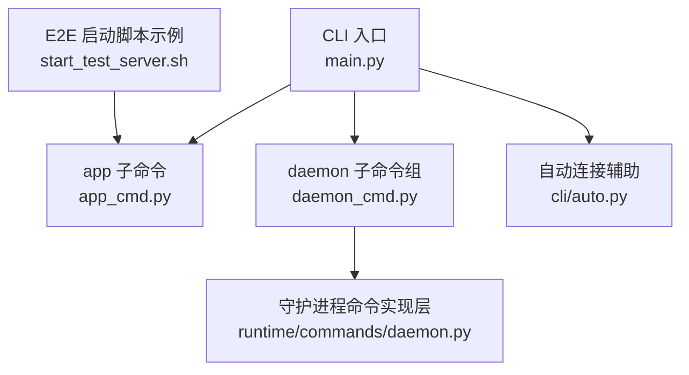
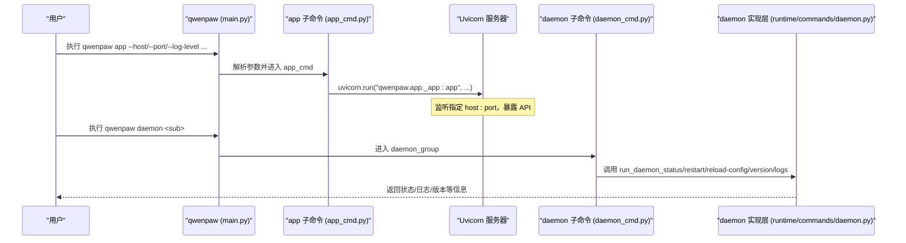
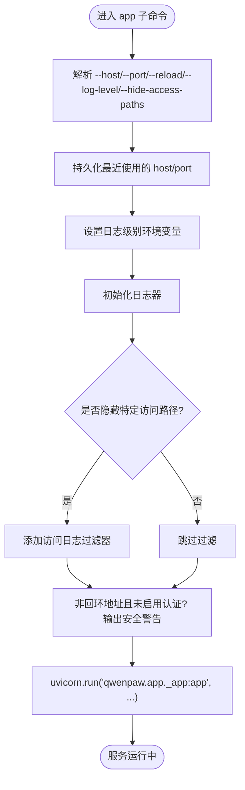
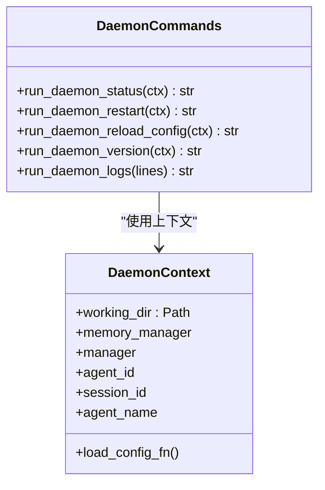
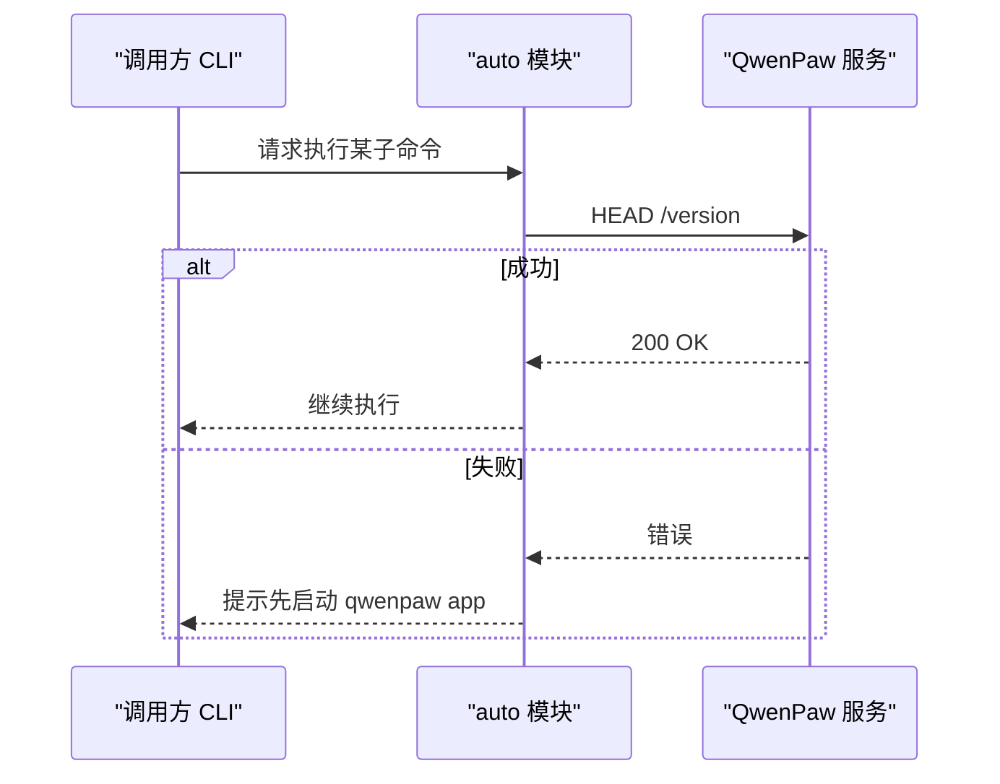
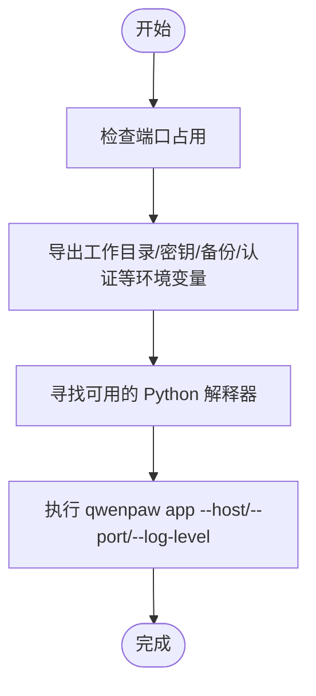
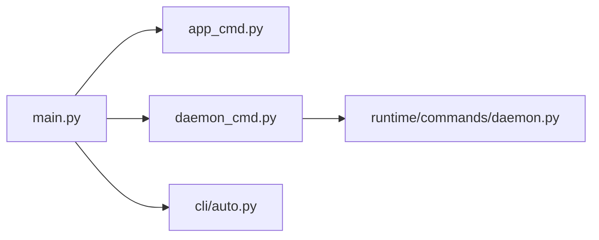

# 应用程序管理命令

<cite>
**本文引用的文件**   
- [src/qwenpaw/cli/main.py](file://src/qwenpaw/cli/main.py)
- [src/qwenpaw/cli/app_cmd.py](file://src/qwenpaw/cli/app_cmd.py)
- [src/qwenpaw/cli/daemon_cmd.py](file://src/qwenpaw/cli/daemon_cmd.py)
- [src/qwenpaw/runtime/commands/daemon.py](file://src/qwenpaw/runtime/commands/daemon.py)
- [src/qwenpaw/cli/auto.py](file://src/qwenpaw/cli/auto.py)
- [e2e/scripts/start_test_server.sh](file://e2e/scripts/start_test_server.sh)
</cite>

## 目录
1. [简介](#简介)
2. [项目结构](#项目结构)
3. [核心组件](#核心组件)
4. [架构总览](#架构总览)
5. [详细组件分析](#详细组件分析)
6. [依赖关系分析](#依赖关系分析)
7. [性能与稳定性考量](#性能与稳定性考量)
8. [故障排查指南](#故障排查指南)
9. [结论](#结论)
10. [附录：常用命令速查](#附录常用命令速查)

## 简介
本文件面向使用 QwenPaw CLI 进行“应用程序管理”的用户，聚焦 qwenpaw app 子命令及其配套的守护进程（daemon）管理能力。内容涵盖：
- 启动、停止、重启服务的操作方式
- 守护进程模式（daemon）的配置选项与后台运行方式
- 服务状态监控、日志查看与错误诊断方法
- 进程管理、端口配置、环境变量设置等高级用法
- 生产环境部署最佳实践与常见问题解决方案

## 项目结构
QwenPaw 的 CLI 入口通过主程序注册各子命令，app 子命令用于启动 FastAPI 应用；daemon 子命令提供状态、重启、重载配置、版本与日志查看能力。auto 模块为其他 CLI 提供对已运行守护进程的便捷访问。

图示来源
- [src/qwenpaw/cli/main.py:119-174](file://src/qwenpaw/cli/main.py#L119-L174)
- [src/qwenpaw/cli/app_cmd.py:52-151](file://src/qwenpaw/cli/app_cmd.py#L52-L151)
- [src/qwenpaw/cli/daemon_cmd.py:48-117](file://src/qwenpaw/cli/daemon_cmd.py#L48-L117)
- [src/qwenpaw/runtime/commands/daemon.py:29-41](file://src/qwenpaw/runtime/commands/daemon.py#L29-L41)
- [src/qwenpaw/cli/auto.py:38-58](file://src/qwenpaw/cli/auto.py#L38-L58)
- [e2e/scripts/start_test_server.sh:105-107](file://e2e/scripts/start_test_server.sh#L105-L107)

章节来源
- [src/qwenpaw/cli/main.py:119-174](file://src/qwenpaw/cli/main.py#L119-L174)
- [src/qwenpaw/cli/app_cmd.py:52-151](file://src/qwenpaw/cli/app_cmd.py#L52-L151)
- [src/qwenpaw/cli/daemon_cmd.py:48-117](file://src/qwenpaw/cli/daemon_cmd.py#L48-L117)
- [src/qwenpaw/runtime/commands/daemon.py:29-41](file://src/qwenpaw/runtime/commands/daemon.py#L29-L41)
- [src/qwenpaw/cli/auto.py:38-58](file://src/qwenpaw/cli/auto.py#L38-L58)
- [e2e/scripts/start_test_server.sh:105-107](file://e2e/scripts/start_test_server.sh#L105-L107)

## 核心组件
- CLI 主入口与懒加载分组：负责注册所有子命令并提供默认 host/port 上下文。
- app 子命令：基于 Uvicorn 启动 FastAPI 应用，支持绑定地址、端口、热重载、日志级别、访问路径过滤等。
- daemon 子命令组：封装 status/restart/reload-config/version/logs 等运维能力，底层由 runtime/commands/daemon.py 实现。
- auto 辅助：在调用其他 CLI 前检查守护进程可达性，并构造 base_url。

章节来源
- [src/qwenpaw/cli/main.py:119-174](file://src/qwenpaw/cli/main.py#L119-L174)
- [src/qwenpaw/cli/app_cmd.py:52-151](file://src/qwenpaw/cli/app_cmd.py#L52-L151)
- [src/qwenpaw/cli/daemon_cmd.py:48-117](file://src/qwenpaw/cli/daemon_cmd.py#L48-L117)
- [src/qwenpaw/runtime/commands/daemon.py:96-201](file://src/qwenpaw/runtime/commands/daemon.py#L96-L201)
- [src/qwenpaw/cli/auto.py:38-58](file://src/qwenpaw/cli/auto.py#L38-L58)

## 架构总览
下图展示了从 CLI 到应用的完整调用链，以及守护进程相关命令的执行路径。

图示来源
- [src/qwenpaw/cli/main.py:119-174](file://src/qwenpaw/cli/main.py#L119-L174)
- [src/qwenpaw/cli/app_cmd.py:143-151](file://src/qwenpaw/cli/app_cmd.py#L143-L151)
- [src/qwenpaw/cli/daemon_cmd.py:53-117](file://src/qwenpaw/cli/daemon_cmd.py#L53-L117)
- [src/qwenpaw/runtime/commands/daemon.py:96-201](file://src/qwenpaw/runtime/commands/daemon.py#L96-L201)

## 详细组件分析

### app 子命令：启动与运行
- 功能要点
  - 绑定主机与端口：默认 127.0.0.1:8088，可通过 --host 与 --port 调整。
  - 开发热重载：--reload 开启后，代码变更自动生效（仅开发建议）。
  - 日志级别：--log-level 支持 critical/error/warning/info/debug/trace。
  - 访问日志过滤：--hide-access-paths 可隐藏敏感路径的访问日志输出。
  - 安全提示：当在非回环地址且未启用认证时，会输出安全警告。
  - 工作进程：--workers 已废弃，内部固定为 1 worker。
  - 持久化最近使用的 host/port，便于后续命令复用。
- 典型用法
  - 本地开发：qwenpaw app --host 127.0.0.1 --port 8088 --reload --log-level debug
  - 生产绑定：qwenpaw app --host 0.0.0.0 --port 8088 --log-level info（需配合反向代理或防火墙）
- 关键流程
  - 参数校验与环境变量注入
  - 初始化日志器与可选的启动耗时统计
  - 添加访问日志过滤器
  - 安全告警判断
  - 启动 Uvicorn 服务

图示来源
- [src/qwenpaw/cli/app_cmd.py:52-151](file://src/qwenpaw/cli/app_cmd.py#L52-L151)

章节来源
- [src/qwenpaw/cli/app_cmd.py:52-151](file://src/qwenpaw/cli/app_cmd.py#L52-L151)

### daemon 子命令组：状态、重启、重载配置、版本、日志
- 功能要点
  - status：显示守护进程状态（配置加载情况、最大输入长度、工作目录、内存管理器状态）。
  - restart：若处于应用内则触发零停机重载（channels/cron/MCP），否则给出外部进程重启建议。
  - reload-config：重新读取配置文件，无需重启进程。
  - version：输出版本号与工作目录、日志文件路径。
  - logs：查看 WORKING_DIR 下日志文件的最后 N 行（默认 100，上限 2000）。
- 适用场景
  - 在线调试：在聊天中使用 /daemon 系列命令快速定位问题。
  - 运维巡检：通过 CLI 获取运行时信息，辅助健康检查。
- 注意
  - CLI 模式下无 MultiAgentManager 实例，restart 将返回指导信息而非直接执行。

图示来源
- [src/qwenpaw/runtime/commands/daemon.py:46-59](file://src/qwenpaw/runtime/commands/daemon.py#L46-L59)
- [src/qwenpaw/runtime/commands/daemon.py:96-201](file://src/qwenpaw/runtime/commands/daemon.py#L96-L201)

章节来源
- [src/qwenpaw/cli/daemon_cmd.py:48-117](file://src/qwenpaw/cli/daemon_cmd.py#L48-L117)
- [src/qwenpaw/runtime/commands/daemon.py:96-201](file://src/qwenpaw/runtime/commands/daemon.py#L96-L201)

### auto 辅助：守护进程可达性检查与 URL 构建
- 功能要点
  - _ensure_daemon_alive：通过 HEAD /version 探测守护进程是否存活，不可达时给出明确提示。
  - _base_url：根据上下文中的 host/port 或显式传入的 base_url 生成基础 URL。
- 使用场景
  - 其他 CLI 子命令在执行前确保后端服务可用，避免静默失败。

图示来源
- [src/qwenpaw/cli/auto.py:38-58](file://src/qwenpaw/cli/auto.py#L38-L58)

章节来源
- [src/qwenpaw/cli/auto.py:38-58](file://src/qwenpaw/cli/auto.py#L38-L58)

### 启动流程参考（E2E 脚本）
- 说明
  - 脚本演示了如何查找 Python 解释器、设置环境变量、检查端口占用并最终启动 qwenpaw app。
  - 可作为生产/测试环境启动脚本的参考模板。

图示来源
- [e2e/scripts/start_test_server.sh:27-107](file://e2e/scripts/start_test_server.sh#L27-L107)

章节来源
- [e2e/scripts/start_test_server.sh:27-107](file://e2e/scripts/start_test_server.sh#L27-L107)

## 依赖关系分析
- main.py 通过 LazyGroup 懒加载各子命令模块，减少冷启动开销。
- app_cmd.py 依赖 uvicorn 启动 FastAPI 应用，并在启动前后进行日志与安全处理。
- daemon_cmd.py 作为 CLI 壳，转发至 runtime/commands/daemon.py 的具体实现。
- auto.py 提供 HTTP 可达性检测与 URL 组装，被其他子命令复用。

图示来源
- [src/qwenpaw/cli/main.py:119-174](file://src/qwenpaw/cli/main.py#L119-L174)
- [src/qwenpaw/cli/app_cmd.py:52-151](file://src/qwenpaw/cli/app_cmd.py#L52-L151)
- [src/qwenpaw/cli/daemon_cmd.py:48-117](file://src/qwenpaw/cli/daemon_cmd.py#L48-L117)
- [src/qwenpaw/runtime/commands/daemon.py:29-41](file://src/qwenpaw/runtime/commands/daemon.py#L29-L41)
- [src/qwenpaw/cli/auto.py:38-58](file://src/qwenpaw/cli/auto.py#L38-L58)

章节来源
- [src/qwenpaw/cli/main.py:119-174](file://src/qwenpaw/cli/main.py#L119-L174)
- [src/qwenpaw/cli/app_cmd.py:52-151](file://src/qwenpaw/cli/app_cmd.py#L52-L151)
- [src/qwenpaw/cli/daemon_cmd.py:48-117](file://src/qwenpaw/cli/daemon_cmd.py#L48-L117)
- [src/qwenpaw/runtime/commands/daemon.py:29-41](file://src/qwenpaw/runtime/commands/daemon.py#L29-L41)
- [src/qwenpaw/cli/auto.py:38-58](file://src/qwenpaw/cli/auto.py#L38-L58)

## 性能与稳定性考量
- 单进程模型：app 子命令固定使用 1 worker，保证稳定性与一致性。
- 日志级别控制：生产建议使用 info 或 warning，仅在排障时临时提升为 debug/trace。
- 访问日志过滤：通过 --hide-access-paths 降低敏感路径的日志噪音。
- 热重载限制：--reload 仅建议在开发环境使用，生产应通过进程管理器平滑重启。
- 端口与网络：默认绑定 127.0.0.1，如需对外暴露请结合反向代理与认证机制。

[本节为通用指导，不直接分析具体文件]

## 故障排查指南
- 服务无法访问
  - 确认端口未被占用，必要时更换端口。
  - 检查是否启用了认证，若非回环地址绑定且未启用认证，会有安全警告。
  - 使用 auto 模块的可达性检查逻辑验证 /version 端点。
- 日志查看
  - 使用 daemon logs 查看最近日志，或通过系统工具 tail 查看 WORKING_DIR 下的日志文件。
- 配置重载
  - 使用 daemon reload-config 在不重启进程的情况下重新加载配置。
- 重启策略
  - 在应用内使用 daemon restart 触发零停机重载；在 CLI 模式下按提示使用 systemd/supervisor/docker 等方式重启进程。

章节来源
- [src/qwenpaw/cli/app_cmd.py:28-50](file://src/qwenpaw/cli/app_cmd.py#L28-L50)
- [src/qwenpaw/cli/auto.py:38-58](file://src/qwenpaw/cli/auto.py#L38-L58)
- [src/qwenpaw/runtime/commands/daemon.py:196-201](file://src/qwenpaw/runtime/commands/daemon.py#L196-L201)
- [src/qwenpaw/runtime/commands/daemon.py:143-168](file://src/qwenpaw/runtime/commands/daemon.py#L143-L168)

## 结论
qwenpaw app 子命令提供了简洁可靠的 Web 服务启动能力，配合 daemon 子命令可实现状态监控、配置重载与日志查看等常见运维需求。在生产环境中，建议结合进程管理器与反向代理，严格管控端口与认证，并通过日志与监控保障稳定性与可观测性。

[本节为总结性内容，不直接分析具体文件]

## 附录：常用命令速查
- 启动服务
  - qwenpaw app --host 127.0.0.1 --port 8088 --log-level info
  - 开发模式：qwenpaw app --reload --log-level debug
- 守护进程管理
  - qwenpaw daemon status
  - qwenpaw daemon restart
  - qwenpaw daemon reload-config
  - qwenpaw daemon version
  - qwenpaw daemon logs -n 200
- 自动可达性检查（供其他子命令使用）
  - 通过 auto 模块在调用前检查 /version 端点可用性

章节来源
- [src/qwenpaw/cli/app_cmd.py:52-151](file://src/qwenpaw/cli/app_cmd.py#L52-L151)
- [src/qwenpaw/cli/daemon_cmd.py:53-117](file://src/qwenpaw/cli/daemon_cmd.py#L53-L117)
- [src/qwenpaw/cli/auto.py:38-58](file://src/qwenpaw/cli/auto.py#L38-L58)