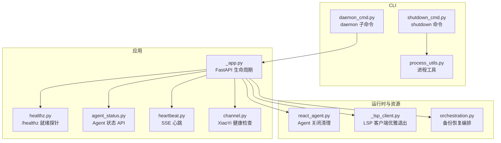
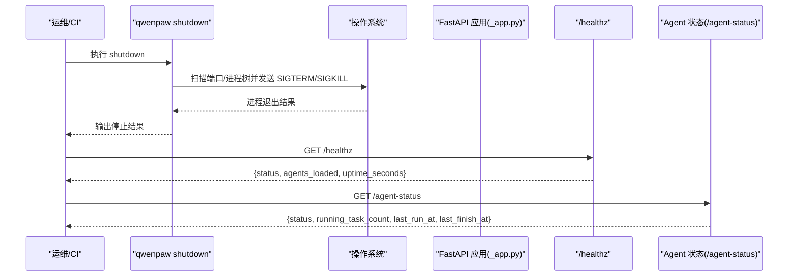
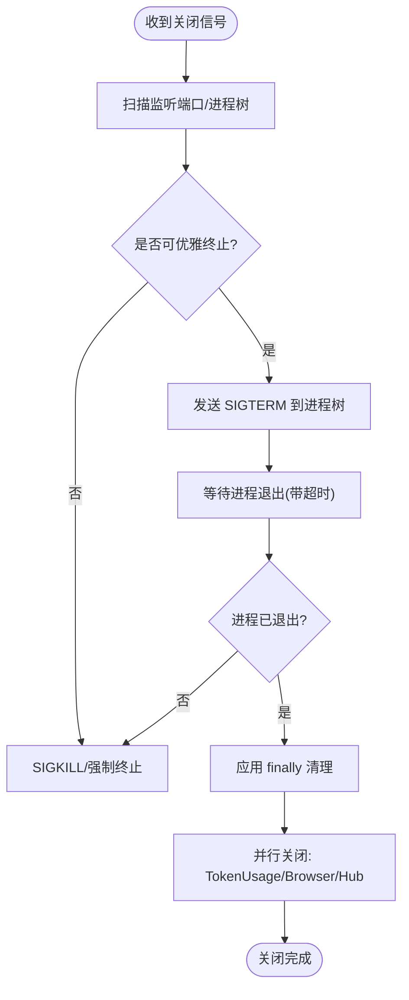
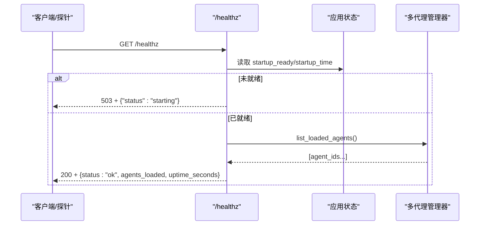
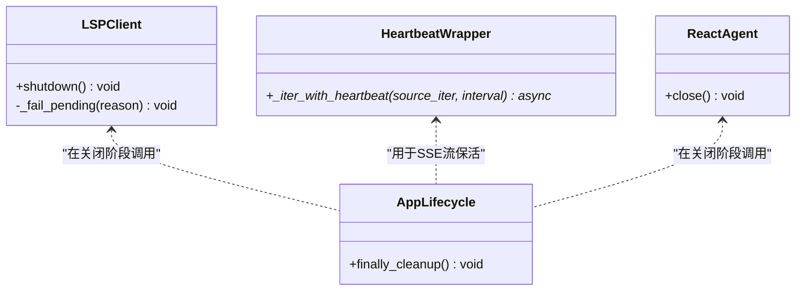
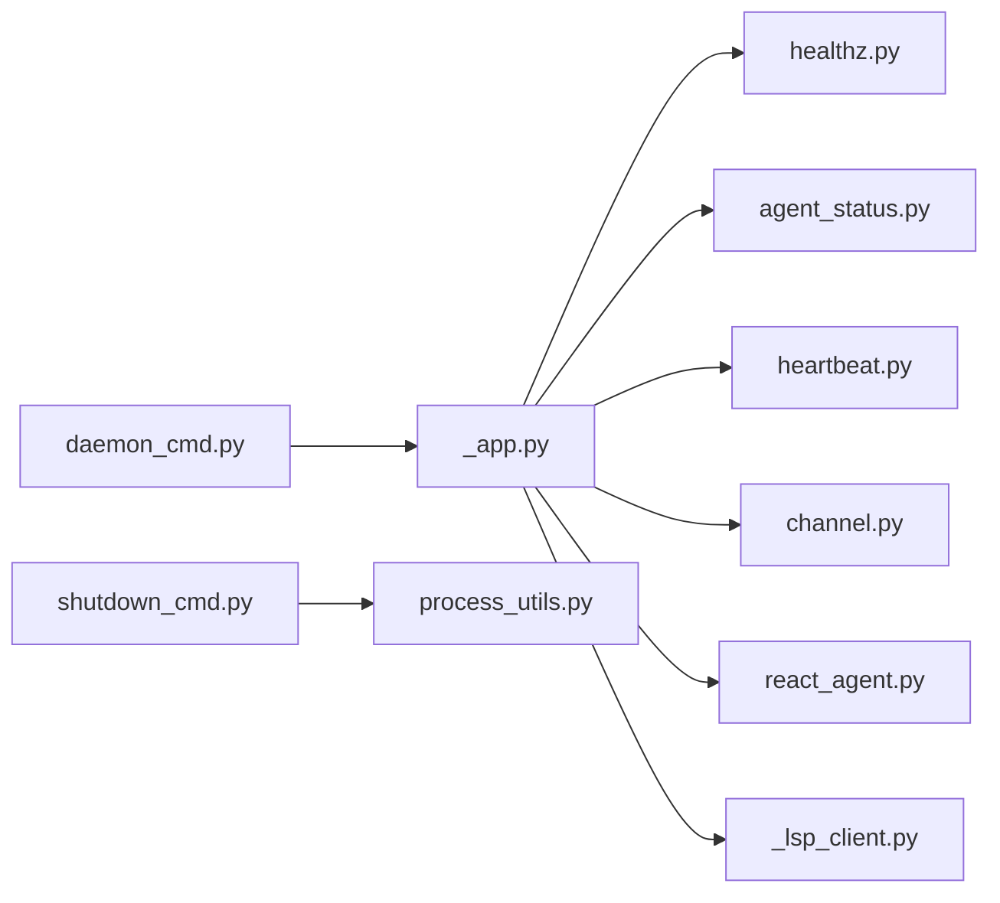

# 服务控制命令

<cite>
**本文引用的文件**   
- [daemon_cmd.py](file://src/qwenpaw/cli/daemon_cmd.py)
- [shutdown_cmd.py](file://src/qwenpaw/cli/shutdown_cmd.py)
- [process_utils.py](file://src/qwenpaw/cli/process_utils.py)
- [healthz.py](file://src/qwenpaw/app/routers/healthz.py)
- [agent_status.py](file://src/qwenpaw/app/routers/agent_status.py)
- [_app.py](file://src/qwenpaw/app/_app.py)
- [heartbeat.py](file://src/qwenpaw/runtime/heartbeat.py)
- [channel.py](file://src/qwenpaw/app/channels/xiaoyi/channel.py)
- [react_agent.py](file://src/qwenpaw/agents/react_agent.py)
- [_lsp_client.py](file://src/qwenpaw/agents/tools/_lsp_client.py)
- [orchestration.py](file://src/qwenpaw/backup/orchestration.py)
</cite>

## 目录
1. [简介](#简介)
2. [项目结构](#项目结构)
3. [核心组件](#核心组件)
4. [架构总览](#架构总览)
5. [详细组件分析](#详细组件分析)
6. [依赖关系分析](#依赖关系分析)
7. [性能与可用性考虑](#性能与可用性考虑)
8. [故障排查指南](#故障排查指南)
9. [结论](#结论)
10. [附录：运维脚本示例](#附录运维脚本示例)

## 简介
本文件聚焦“服务控制相关命令”的机制与实现，覆盖以下主题：
- 优雅关闭服务的机制与信号处理逻辑
- 服务状态检查、健康检查与依赖服务验证
- 进程间通信、资源清理与会话管理
- 服务重启策略、故障转移与负载均衡配置
- 监控集成、告警配置与运维自动化脚本示例

文档以仓库中的实际代码为依据，提供面向运维与开发的实践指导。

## 项目结构
围绕服务控制的关键路径包括：
- CLI 层：daemon 子命令（status/restart/reload-config/version/logs）与 shutdown 命令
- 应用生命周期：FastAPI lifespan 启动/关闭钩子、后台初始化与插件钩子
- 健康与状态：/healthz 就绪探针、Agent 运行状态 API
- 运行时心跳：SSE 心跳封装，保障长连接空闲保活
- 通道健康：特定通道（如 XiaoYi）的健康检查
- 资源清理：React Agent 关闭、LSP 客户端优雅退出、浏览器/Hub 等并行关闭



图表来源
- [daemon_cmd.py:1-117](file://src/qwenpaw/cli/daemon_cmd.py#L1-L117)
- [shutdown_cmd.py:1-386](file://src/qwenpaw/cli/shutdown_cmd.py#L1-L386)
- [process_utils.py:1-237](file://src/qwenpaw/cli/process_utils.py#L1-L237)
- [_app.py:162-784](file://src/qwenpaw/app/_app.py#L162-L784)
- [healthz.py:1-35](file://src/qwenpaw/app/routers/healthz.py#L1-L35)
- [agent_status.py:1-94](file://src/qwenpaw/app/routers/agent_status.py#L1-L94)
- [heartbeat.py:1-41](file://src/qwenpaw/runtime/heartbeat.py#L1-L41)
- [channel.py:506-541](file://src/qwenpaw/app/channels/xiaoyi/channel.py#L506-L541)
- [react_agent.py:288-319](file://src/qwenpaw/agents/react_agent.py#L288-L319)
- [_lsp_client.py:170-211](file://src/qwenpaw/agents/tools/_lsp_client.py#L170-L211)
- [orchestration.py:1-43](file://src/qwenpaw/backup/orchestration.py#L1-L43)

章节来源
- [daemon_cmd.py:1-117](file://src/qwenpaw/cli/daemon_cmd.py#L1-L117)
- [shutdown_cmd.py:1-386](file://src/qwenpaw/cli/shutdown_cmd.py#L1-L386)
- [process_utils.py:1-237](file://src/qwenpaw/cli/process_utils.py#L1-L237)
- [_app.py:162-784](file://src/qwenpaw/app/_app.py#L162-L784)
- [healthz.py:1-35](file://src/qwenpaw/app/routers/healthz.py#L1-L35)
- [agent_status.py:1-94](file://src/qwenpaw/app/routers/agent_status.py#L1-L94)
- [heartbeat.py:1-41](file://src/qwenpaw/runtime/heartbeat.py#L1-L41)
- [channel.py:506-541](file://src/qwenpaw/app/channels/xiaoyi/channel.py#L506-L541)
- [react_agent.py:288-319](file://src/qwenpaw/agents/react_agent.py#L288-L319)
- [_lsp_client.py:170-211](file://src/qwenpaw/agents/tools/_lsp_client.py#L170-L211)
- [orchestration.py:1-43](file://src/qwenpaw/backup/orchestration.py#L1-L43)

## 核心组件
- daemon 子命令：提供 status、restart、reload-config、version、logs 能力，支持在聊天内通过 /daemon 或短别名触发；CLI 侧仅打印指令或在有 manager 时执行零停机重载。
- shutdown 命令：跨平台查找并停止后端监听进程、前端开发进程、桌面包装进程及其 Windows 祖先包装器，优先 SIGTERM，失败则 SIGKILL/强制终止。
- FastAPI 生命周期：后台完成插件加载、Agent 启动、技能池同步、审批服务等；finally 中执行插件关闭钩子、本地模型服务关闭、AppServiceManager 停止、多代理管理器停止，以及浏览器/Hub/TokenUsage 并行关闭。
- 健康与状态：/healthz 返回启动就绪与已加载 Agent 列表；/agent-status 返回当前 Agent 的运行状态、任务计数与时间戳。
- 心跳：SSE 心跳封装，保证空闲时发送心跳，避免连接超时。
- 通道健康：XiaoYi 通道暴露 health_check，返回主备连接状态。
- 资源清理：React Agent close 释放历史上下文与 governor；LSP 客户端优雅发送 shutdown/exit，必要时 kill 并失败挂起请求。

章节来源
- [daemon_cmd.py:1-117](file://src/qwenpaw/cli/daemon_cmd.py#L1-L117)
- [shutdown_cmd.py:1-386](file://src/qwenpaw/cli/shutdown_cmd.py#L1-L386)
- [_app.py:162-784](file://src/qwenpaw/app/_app.py#L162-L784)
- [healthz.py:1-35](file://src/qwenpaw/app/routers/healthz.py#L1-L35)
- [agent_status.py:1-94](file://src/qwenpaw/app/routers/agent_status.py#L1-L94)
- [heartbeat.py:1-41](file://src/qwenpaw/runtime/heartbeat.py#L1-L41)
- [channel.py:506-541](file://src/qwenpaw/app/channels/xiaoyi/channel.py#L506-L541)
- [react_agent.py:288-319](file://src/qwenpaw/agents/react_agent.py#L288-L319)
- [_lsp_client.py:170-211](file://src/qwenpaw/agents/tools/_lsp_client.py#L170-L211)

## 架构总览
下图展示从外部控制到内部生命周期的关键交互：CLI 命令触发进程发现与信号发送；HTTP 健康探针读取应用状态；后台初始化完成后标记就绪；关闭阶段按顺序执行各子系统清理。



图表来源
- [shutdown_cmd.py:1-386](file://src/qwenpaw/cli/shutdown_cmd.py#L1-L386)
- [_app.py:162-784](file://src/qwenpaw/app/_app.py#L162-L784)
- [healthz.py:1-35](file://src/qwenpaw/app/routers/healthz.py#L1-L35)
- [agent_status.py:1-94](file://src/qwenpaw/app/routers/agent_status.py#L1-L94)

## 详细组件分析

### 优雅关闭与信号处理
- 进程发现与终止
  - 基于端口监听 PID 集合、前端 Vite 进程匹配、桌面包装进程匹配、Windows 祖先包装器回溯。
  - 先尝试 SIGTERM，等待退出；若超时，再使用 SIGKILL 或 Windows 强制终止。
  - 递归收集 Unix 子进程树，确保整棵树被终止。
- 应用级关闭流程
  - finally 块中依次执行：插件关闭钩子、本地模型服务关闭、AppServiceManager 停止、MultiAgentManager 停止所有 Agent。
  - 并行关闭 TokenUsageManager、浏览器实例、Skill Hub HTTP 客户端，缩短关闭耗时。
- React Agent 关闭
  - 停止治理器、清理历史滚动保留、关闭上下文管理器，避免文件描述符泄漏。
- LSP 客户端优雅退出
  - 发送 shutdown/exit 消息，等待进程退出；超时则 kill；最后失败挂起待处理请求。



图表来源
- [shutdown_cmd.py:1-386](file://src/qwenpaw/cli/shutdown_cmd.py#L1-L386)
- [_app.py:688-784](file://src/qwenpaw/app/_app.py#L688-L784)
- [react_agent.py:288-319](file://src/qwenpaw/agents/react_agent.py#L288-L319)
- [_lsp_client.py:170-211](file://src/qwenpaw/agents/tools/_lsp_client.py#L170-L211)

章节来源
- [shutdown_cmd.py:1-386](file://src/qwenpaw/cli/shutdown_cmd.py#L1-L386)
- [_app.py:688-784](file://src/qwenpaw/app/_app.py#L688-L784)
- [react_agent.py:288-319](file://src/qwenpaw/agents/react_agent.py#L288-L319)
- [_lsp_client.py:170-211](file://src/qwenpaw/agents/tools/_lsp_client.py#L170-L211)

### 服务状态检查与健康检查
- 就绪探针 /healthz
  - 当后台启动未完成时返回 503；完成后返回 200，包含已加载 Agent 列表与运行时长。
- Agent 运行状态 /agent-status
  - 根据配置判断 disabled/idle/running，返回运行任务数与最近开始/结束时间。
- 通道健康检查
  - XiaoYi 通道 health_check 返回 channel、status（healthy/unhealthy/disabled）与 detail（主备连接情况）。



图表来源
- [healthz.py:1-35](file://src/qwenpaw/app/routers/healthz.py#L1-L35)
- [_app.py:480-487](file://src/qwenpaw/app/_app.py#L480-L487)

章节来源
- [healthz.py:1-35](file://src/qwenpaw/app/routers/healthz.py#L1-L35)
- [agent_status.py:1-94](file://src/qwenpaw/app/routers/agent_status.py#L1-L94)
- [channel.py:506-541](file://src/qwenpaw/app/channels/xiaoyi/channel.py#L506-L541)

### 进程间通信、资源清理与会话管理
- 进程间通信
  - LSP 客户端通过 JSON-RPC 发送 shutdown/exit，并在失败时通知挂起队列。
  - 心跳封装为 SSE 流，周期性发送心跳对象，避免长连接空闲断开。
- 资源清理
  - React Agent close 释放 governor、清理历史滚动、关闭上下文管理器。
  - 应用 finally 并行关闭 TokenUsage、浏览器、Skill Hub 客户端。
- 会话管理
  - 启动期进行旧会话迁移与滚动历史同步；关闭期由上下文管理器负责持久化与释放。



图表来源
- [_lsp_client.py:170-211](file://src/qwenpaw/agents/tools/_lsp_client.py#L170-L211)
- [heartbeat.py:1-41](file://src/qwenpaw/runtime/heartbeat.py#L1-L41)
- [react_agent.py:288-319](file://src/qwenpaw/agents/react_agent.py#L288-L319)
- [_app.py:688-784](file://src/qwenpaw/app/_app.py#L688-L784)

章节来源
- [_lsp_client.py:170-211](file://src/qwenpaw/agents/tools/_lsp_client.py#L170-L211)
- [heartbeat.py:1-41](file://src/qwenpaw/runtime/heartbeat.py#L1-L41)
- [react_agent.py:288-319](file://src/qwenpaw/agents/react_agent.py#L288-L319)
- [_app.py:688-784](file://src/qwenpaw/app/_app.py#L688-L784)

### 服务重启策略、故障转移与负载均衡
- 零停机重启
  - 在应用内通过 /daemon restart 或 CLI 的 daemon restart 触发 MultiAgentManager.reload_agent，实现通道、定时任务、MCP 的无中断重载。
- 故障转移
  - 通道健康检查返回主备连接状态，结合外部负载均衡/网关策略可实现自动切换。
- 负载均衡
  - 通过反向代理对 /healthz 进行存活探测，配合多实例部署实现流量分发与故障节点摘除。

```mermaid
sequenceDiagram
participant Admin as "管理员/自动化"
participant Daemon as "/daemon restart"
participant MAM as "MultiAgentManager"
participant WS as "WebSocket/通道"
participant LB as "负载均衡/网关"
Admin->>Daemon : 触发重启
Daemon->>MAM : reload_agent(agent_id)
MAM-->>WS : 平滑重建通道/MCP/定时任务
LB->>/healthz : 定期探测
/healthz-->>LB : 200 ok (已就绪)
```

图表来源
- [daemon_cmd.py:1-117](file://src/qwenpaw/cli/daemon_cmd.py#L1-L117)
- [healthz.py:1-35](file://src/qwenpaw/app/routers/healthz.py#L1-L35)
- [channel.py:506-541](file://src/qwenpaw/app/channels/xiaoyi/channel.py#L506-L541)

章节来源
- [daemon_cmd.py:1-117](file://src/qwenpaw/cli/daemon_cmd.py#L1-L117)
- [healthz.py:1-35](file://src/qwenpaw/app/routers/healthz.py#L1-L35)
- [channel.py:506-541](file://src/qwenpaw/app/channels/xiaoyi/channel.py#L506-L541)

### 监控集成、告警配置与运维自动化
- 监控指标
  - /healthz 返回 agents_loaded 与 uptime_seconds，可作为存活与就绪指标。
  - /agent-status 返回 running_task_count 与时间戳，可用于负载与活跃度监控。
- 告警建议
  - 当 /healthz 持续返回 503 超过阈值，触发严重告警。
  - 当 /agent-status 长时间处于 running 且任务数不降，触发积压告警。
- 自动化脚本
  - 使用 shutdown 命令批量停止进程；结合 /healthz 轮询确认服务恢复。
  - 参考附录脚本示例。

章节来源
- [healthz.py:1-35](file://src/qwenpaw/app/routers/healthz.py#L1-L35)
- [agent_status.py:1-94](file://src/qwenpaw/app/routers/agent_status.py#L1-L94)

## 依赖关系分析
- CLI 与应用解耦：daemon 子命令仅在具备 manager 时执行重载，否则给出操作指引；shutdown 通过系统命令与进程表定位目标进程。
- 健康与状态路由独立挂载于 FastAPI，读取 app.state 与多代理管理器。
- 资源清理集中在应用 finally 块，确保关闭顺序可控且并行优化。



图表来源
- [daemon_cmd.py:1-117](file://src/qwenpaw/cli/daemon_cmd.py#L1-L117)
- [shutdown_cmd.py:1-386](file://src/qwenpaw/cli/shutdown_cmd.py#L1-L386)
- [process_utils.py:1-237](file://src/qwenpaw/cli/process_utils.py#L1-L237)
- [_app.py:162-784](file://src/qwenpaw/app/_app.py#L162-L784)
- [healthz.py:1-35](file://src/qwenpaw/app/routers/healthz.py#L1-L35)
- [agent_status.py:1-94](file://src/qwenpaw/app/routers/agent_status.py#L1-L94)
- [heartbeat.py:1-41](file://src/qwenpaw/runtime/heartbeat.py#L1-L41)
- [channel.py:506-541](file://src/qwenpaw/app/channels/xiaoyi/channel.py#L506-L541)
- [react_agent.py:288-319](file://src/qwenpaw/agents/react_agent.py#L288-L319)
- [_lsp_client.py:170-211](file://src/qwenpaw/agents/tools/_lsp_client.py#L170-L211)

章节来源
- [daemon_cmd.py:1-117](file://src/qwenpaw/cli/daemon_cmd.py#L1-L117)
- [shutdown_cmd.py:1-386](file://src/qwenpaw/cli/shutdown_cmd.py#L1-L386)
- [process_utils.py:1-237](file://src/qwenpaw/cli/process_utils.py#L1-L237)
- [_app.py:162-784](file://src/qwenpaw/app/_app.py#L162-L784)

## 性能与可用性考虑
- 启动路径分离：快速同步初始化后，后台任务异步完成插件与 Agent 启动，降低首包延迟。
- 关闭并行化：TokenUsage、浏览器、Hub 并行关闭，减少整体停机窗口。
- 心跳保活：SSE 心跳间隔固定，避免空闲连接被中间设备回收。
- 健康探针：/healthz 在后台启动完成前返回 503，防止流量进入未就绪实例。

[本节为通用指导，无需列出具体文件来源]

## 故障排查指南
- 无法停止进程
  - 检查端口监听 PID 是否正确识别；Windows 下确认祖先包装器是否被找到。
  - 查看日志尾部，确认是否有异常导致进程未响应 SIGTERM。
- 健康检查失败
  - 确认后台启动是否完成；观察 /healthz 返回的 agents_loaded 是否为空。
- Agent 任务堆积
  - 通过 /agent-status 检查 running_task_count 与 last_finish_at；必要时触发 /daemon reload-config 或重启。
- 通道不可用
  - 检查 XiaoYi 通道 health_check 的主备连接状态；必要时触发通道重载。

章节来源
- [shutdown_cmd.py:1-386](file://src/qwenpaw/cli/shutdown_cmd.py#L1-L386)
- [healthz.py:1-35](file://src/qwenpaw/app/routers/healthz.py#L1-L35)
- [agent_status.py:1-94](file://src/qwenpaw/app/routers/agent_status.py#L1-L94)
- [channel.py:506-541](file://src/qwenpaw/app/channels/xiaoyi/channel.py#L506-L541)

## 结论
本项目在服务控制方面提供了完善的 CLI 与 HTTP 接口，涵盖优雅关闭、健康检查、状态查询、心跳保活与资源清理。通过 /healthz 与 /agent-status 可构建可靠的监控与告警体系；结合零停机重启与通道健康检查，可在生产环境实现高可用与低影响的运维操作。

[本节为总结性内容，无需列出具体文件来源]

## 附录：运维脚本示例
以下为常见运维场景的脚本思路（可直接落地为 shell/PowerShell）：
- 停止服务并校验健康
  - 执行 qwenpaw shutdown --port <端口>
  - 循环调用 curl http://localhost:<端口>/healthz，直到返回 503 或进程不存在
- 重启服务并等待就绪
  - 启动服务进程
  - 循环调用 /healthz，直到返回 200 且 agents_loaded 非空
- 批量健康巡检
  - 遍历多个实例，采集 /healthz 与 /agent-status，汇总到监控系统

[本节为概念性示例，无需列出具体文件来源]