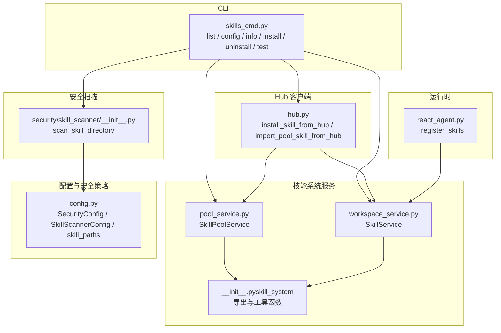
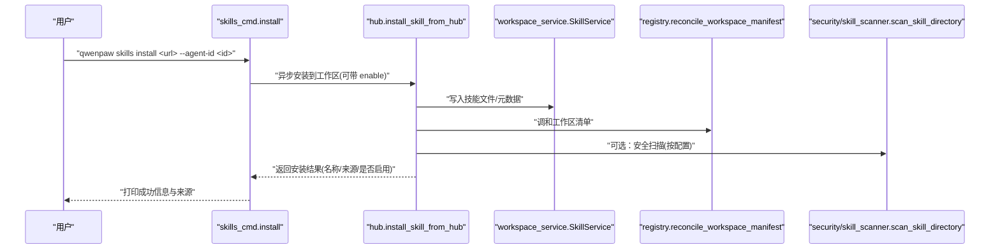
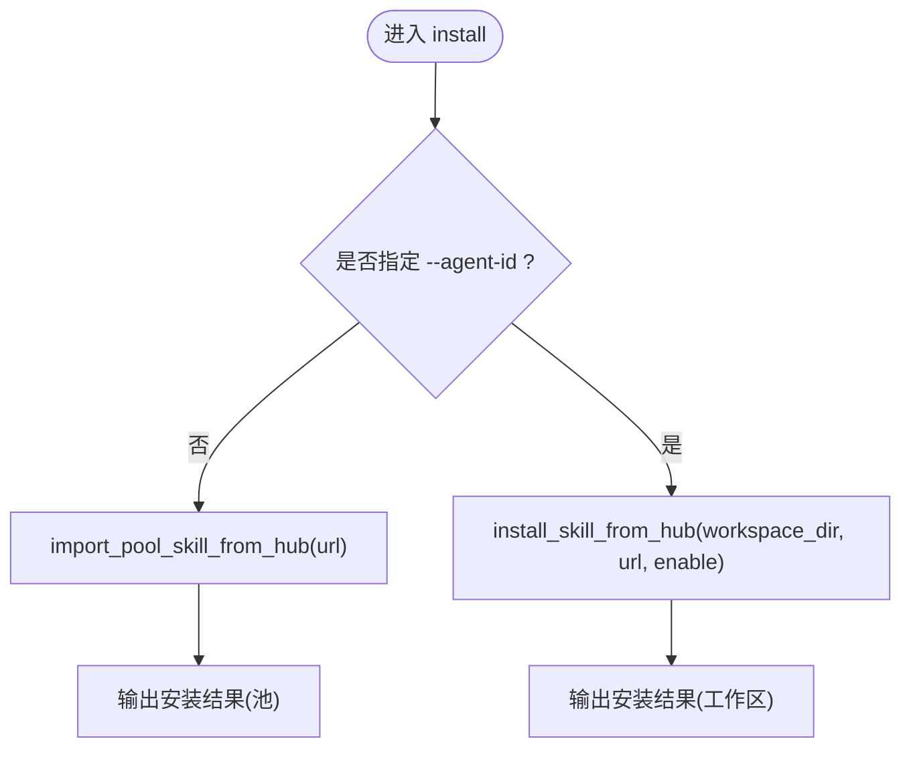
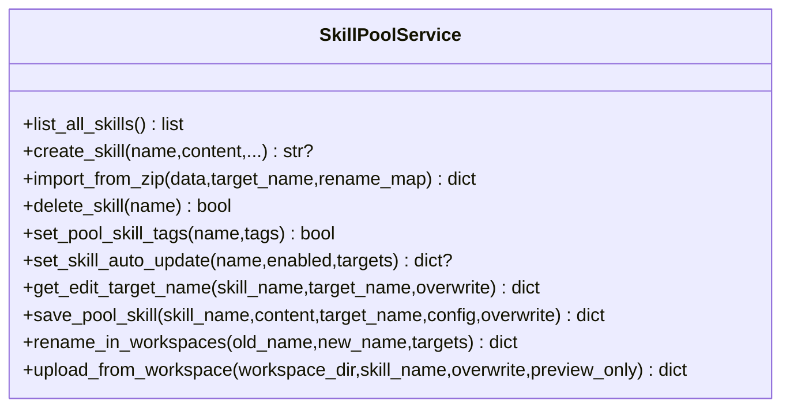
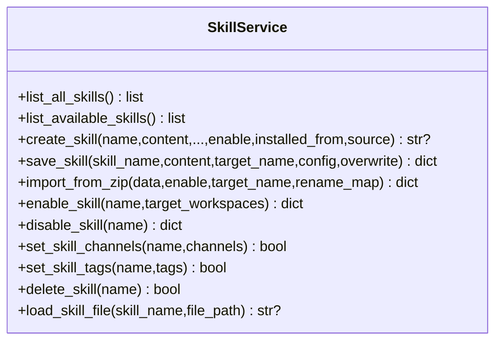
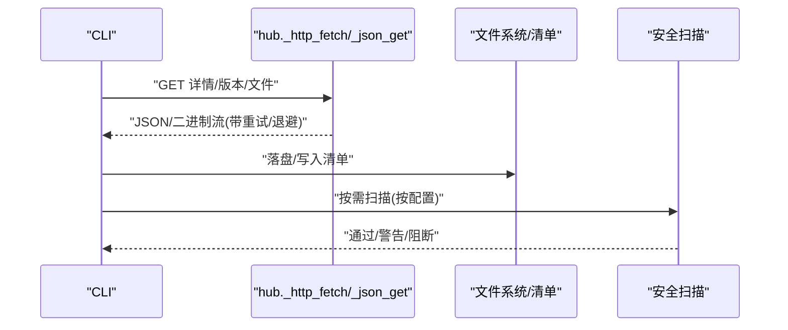
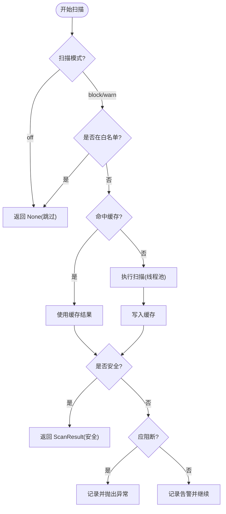
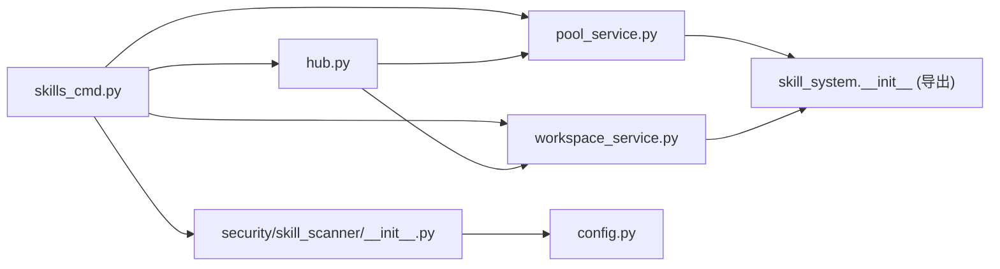

# 技能管理命令

<cite>
**本文引用的文件**   
- [skills_cmd.py](file://src/qwenpaw/cli/skills_cmd.py)
- [__init__.py（skill_system）](file://src/qwenpaw/agents/skill_system/__init__.py)
- [pool_service.py](file://src/qwenpaw/agents/skill_system/pool_service.py)
- [workspace_service.py](file://src/qwenpaw/agents/skill_system/workspace_service.py)
- [hub.py](file://src/qwenpaw/agents/skill_system/hub.py)
- [config.py](file://src/qwenpaw/config/config.py)
- [react_agent.py](file://src/qwenpaw/agents/react_agent.py)
- [__init__.py（skill_scanner）](file://src/qwenpaw/security/skill_scanner/__init__.py)
</cite>

## 目录
1. [简介](#简介)
2. [项目结构](#项目结构)
3. [核心组件](#核心组件)
4. [架构总览](#架构总览)
5. [详细组件分析](#详细组件分析)
6. [依赖关系分析](#依赖关系分析)
7. [性能与可靠性](#性能与可靠性)
8. [故障排查指南](#故障排查指南)
9. [结论](#结论)
10. [附录：最佳实践与自动化](#附录最佳实践与自动化)

## 简介
本文件面向使用 qwenpaw CLI 的“技能管理”场景，系统化记录 skills 子命令的功能与用法，覆盖技能的安装、卸载、更新与版本管理；说明技能仓库配置、搜索与过滤；阐述依赖管理、冲突解决与回滚机制；解释权限控制、安全扫描与验证；并提供批量操作、脚本集成与自动化部署方法，以及开发调试与生产环境管理的最佳实践。

## 项目结构
围绕“技能管理”的核心代码主要分布在以下模块：
- CLI 层：skills 子命令入口与交互流程
- 技能系统服务：工作区与共享技能池的生命周期管理
- Hub 客户端：从市场/URL 拉取并安装技能
- 安全扫描器：安装/启用前的安全检查与白名单
- 运行时注册：工作区技能加载到运行时的路径

图表来源
- [skills_cmd.py:312-572](file://src/qwenpaw/cli/skills_cmd.py#L312-L572)
- [pool_service.py:121-800](file://src/qwenpaw/agents/skill_system/pool_service.py#L121-L800)
- [workspace_service.py:88-782](file://src/qwenpaw/agents/skill_system/workspace_service.py#L88-L782)
- [hub.py:1-800](file://src/qwenpaw/agents/skill_system/hub.py#L1-L800)
- [__init__.py（skill_system）:1-46](file://src/qwenpaw/agents/skill_system/__init__.py#L1-L46)
- [config.py:2030-2156](file://src/qwenpaw/config/config.py#L2030-L2156)
- [react_agent.py:335-377](file://src/qwenpaw/agents/react_agent.py#L335-L377)
- [__init__.py（skill_scanner）:397-487](file://src/qwenpaw/security/skill_scanner/__init__.py#L397-L487)

章节来源
- [skills_cmd.py:312-572](file://src/qwenpaw/cli/skills_cmd.py#L312-L572)
- [pool_service.py:121-800](file://src/qwenpaw/agents/skill_system/pool_service.py#L121-L800)
- [workspace_service.py:88-782](file://src/qwenpaw/agents/skill_system/workspace_service.py#L88-L782)
- [hub.py:1-800](file://src/qwenpaw/agents/skill_system/hub.py#L1-L800)
- [__init__.py（skill_system）:1-46](file://src/qwenpaw/agents/skill_system/__init__.py#L1-L46)
- [config.py:2030-2156](file://src/qwenpaw/config/config.py#L2030-L2156)
- [react_agent.py:335-377](file://src/qwenpaw/agents/react_agent.py#L335-L377)
- [__init__.py（skill_scanner）:397-487](file://src/qwenpaw/security/skill_scanner/__init__.py#L397-L487)

## 核心组件
- CLI 命令组 skills
  - list：列出当前工作区所有技能及其启用状态
  - config：交互式选择要启用的技能（支持从技能池候选中勾选并自动下载）
  - info：查看某个工作区技能的详细信息（启用状态、频道范围、来源、路径等）
  - install：从 URL 安装技能；不指定 --agent-id 时安装到共享技能池；指定 --agent-id 时直接安装到目标工作区并可同时启用
  - uninstall：从共享技能池或指定工作区卸载技能
  - test：对本地技能目录或工作区技能进行校验与安全扫描
- 技能系统服务
  - SkillPoolService：共享技能池的创建、导入、删除、标签、自动同步、重命名与工作区迁移等
  - SkillService：工作区维度的技能生命周期（创建、保存/重命名、导入、启用/禁用、频道范围、删除、读取引用/脚本文件）
- Hub 客户端
  - 提供从受支持的 Hub/URL/GitHub 等来源拉取并安装技能的能力，包含重试、取消、大小限制、缓存等
- 安全扫描器
  - 在 install/test/enable 等关键路径执行安全扫描，支持 block/warn/off 模式、超时、白名单与历史记录
- 配置与安全策略
  - security.skill_scanner 控制扫描行为；skill_paths 扩展只读外部技能池根；运行时通过 _register_skills 将工作区技能注册到 Toolkit

章节来源
- [skills_cmd.py:312-572](file://src/qwenpaw/cli/skills_cmd.py#L312-L572)
- [pool_service.py:121-800](file://src/qwenpaw/agents/skill_system/pool_service.py#L121-L800)
- [workspace_service.py:88-782](file://src/qwenpaw/agents/skill_system/workspace_service.py#L88-L782)
- [hub.py:1-800](file://src/qwenpaw/agents/skill_system/hub.py#L1-L800)
- [__init__.py（skill_scanner）:397-487](file://src/qwenpaw/security/skill_scanner/__init__.py#L397-L487)
- [config.py:2030-2156](file://src/qwenpaw/config/config.py#L2030-L2156)
- [react_agent.py:335-377](file://src/qwenpaw/agents/react_agent.py#L335-L377)

## 架构总览
下图展示一次“从 URL 安装到工作区”的典型调用链：CLI → Hub 客户端 → 工作区服务 → 清单调和 → 安全扫描 → 结果输出。

图表来源
- [skills_cmd.py:417-480](file://src/qwenpaw/cli/skills_cmd.py#L417-L480)
- [hub.py:1-800](file://src/qwenpaw/agents/skill_system/hub.py#L1-L800)
- [workspace_service.py:88-782](file://src/qwenpaw/agents/skill_system/workspace_service.py#L88-L782)
- [__init__.py（skill_system）:1-46](file://src/qwenpaw/agents/skill_system/__init__.py#L1-L46)
- [__init__.py（skill_scanner）:397-487](file://src/qwenpaw/security/skill_scanner/__init__.py#L397-L487)

## 详细组件分析

### CLI 命令：skills
- list
  - 功能：列出当前工作区所有技能及启用状态
  - 关键点：先调和工作区清单，再读取 manifest 与目录信息，统计启用数
- config
  - 功能：交互式选择要启用的技能；若未安装则可从技能池候选下载后启用
  - 关键点：计算 to_install/to_enable/to_disable 集合，预览变更并二次确认，再应用
- info
  - 功能：查看某个工作区技能的详情（启用、频道、来源、路径、描述）
- install
  - 功能：从 URL 安装；无 --agent-id 安装到共享技能池；有 --agent-id 安装到指定工作区并可启用
  - 关键点：异常处理包含冲突错误与安全扫描错误；关闭 Hub 客户端连接
- uninstall
  - 功能：从共享技能池或指定工作区卸载；工作区卸载前会先禁用
- test
  - 功能：校验 SKILL.md frontmatter 并执行安全扫描；支持传入本地目录或工作区技能名

图表来源
- [skills_cmd.py:417-480](file://src/qwenpaw/cli/skills_cmd.py#L417-L480)

章节来源
- [skills_cmd.py:312-572](file://src/qwenpaw/cli/skills_cmd.py#L312-L572)

### 共享技能池服务：SkillPoolService
- 能力概览
  - 列表：遍历 manifest 与目录，构建 SkillInfo
  - 创建：校验内容、安全扫描、原子写入与清单更新
  - ZIP 导入：解压、校验、冲突检测、批量导入与清单更新
  - 删除：删除目录与清单条目
  - 标签/自动同步：设置 tags、开启/关闭 auto_update 并触发即时同步
  - 编辑/重命名：就地编辑或另存为新名，必要时迁移工作区副本
  - 上传：从工作区发布到池，支持覆盖与预览
- 关键特性
  - 冲突提示与建议新名
  - 事务式清单更新与失败回滚
  - 自动同步：基于 SKILL.md 内容哈希变化驱动，支持目标智能体集合

图表来源
- [pool_service.py:121-800](file://src/qwenpaw/agents/skill_system/pool_service.py#L121-L800)

章节来源
- [pool_service.py:121-800](file://src/qwenpaw/agents/skill_system/pool_service.py#L121-L800)

### 工作区技能服务：SkillService
- 能力概览
  - 列表：列出工作区技能与可用技能（考虑有效技能解析）
  - 创建/保存/重命名：校验、安全扫描、原子写入、清单更新
  - ZIP 导入：解压、校验、冲突检测、批量导入、可选启用
  - 启用/禁用：刷新扫描结果后更新 manifest
  - 频道范围/标签：按工作区维度维护 channels/tags
  - 删除：仅允许删除已禁用的技能
  - 读取引用/脚本：受限路径访问 references/ 与 scripts/
- 关键特性
  - 冲突建议新名
  - 事务式清单更新与失败回滚
  - 与共享池联动：从池下载、广播、自动同步

图表来源
- [workspace_service.py:88-782](file://src/qwenpaw/agents/skill_system/workspace_service.py#L88-L782)

章节来源
- [workspace_service.py:88-782](file://src/qwenpaw/agents/skill_system/workspace_service.py#L88-L782)

### Hub 客户端：从市场/URL 安装
- 能力概览
  - 统一 HTTP 客户端：连接/读取/写超时、重试退避、取消钩子、请求追踪
  - GitHub 响应缓存：按 key 加锁避免并发重复请求
  - 包体限制：最大条目数与字节数校验
  - 多来源适配：规范化 bundle 结构、提取版本提示、标准化字段
  - 安装接口：安装到工作区或导入到技能池，返回结构化结果
- 关键特性
  - 可取消的安装任务
  - 友好的错误提示（如 GitHub 限流）
  - 安装来源标记 installed_from

图表来源
- [hub.py:1-800](file://src/qwenpaw/agents/skill_system/hub.py#L1-L800)
- [__init__.py（skill_scanner）:397-487](file://src/qwenpaw/security/skill_scanner/__init__.py#L397-L487)

章节来源
- [hub.py:1-800](file://src/qwenpaw/agents/skill_system/hub.py#L1-L800)

### 安全扫描与白名单
- 扫描模式
  - block：发现高风险则阻断并记录
  - warn：仅记录告警日志
  - off：完全禁用扫描
- 白名单
  - 按 skill_name + content_hash 匹配，空 hash 表示任意内容放行
- 超时与缓存
  - 线程池执行扫描，支持超时；基于目录 mtime 的轻量缓存
- 历史记录
  - 持久化 blocked/warned 记录，支持清理与单条移除

图表来源
- [__init__.py（skill_scanner）:397-487](file://src/qwenpaw/security/skill_scanner/__init__.py#L397-L487)
- [config.py:2030-2156](file://src/qwenpaw/config/config.py#L2030-L2156)

章节来源
- [__init__.py（skill_scanner）:397-487](file://src/qwenpaw/security/skill_scanner/__init__.py#L397-L487)
- [config.py:2030-2156](file://src/qwenpaw/config/config.py#L2030-L2156)

### 运行时注册与生效
- 工作区启动时，根据 effective_skills 将对应目录注册到 Toolkit，供下游斜杠命令消费
- 该过程仅读取工作区 skills 目录，确保隔离性

章节来源
- [react_agent.py:335-377](file://src/qwenpaw/agents/react_agent.py#L335-L377)

## 依赖关系分析
- CLI 依赖
  - 技能系统服务（池/工作区）、Hub 客户端、安全扫描器、配置加载
- 服务间耦合
  - pool_service 与 workspace_service 通过 store/registry 工具函数协作
  - hub 客户端在导入/安装过程中调用上述服务完成落盘与清单更新
- 外部依赖
  - httpx 网络库、frontmatter/yaml 解析、zip 解压、文件系统 IO
- 潜在循环依赖
  - 通过 __init__.py 集中导出，降低直接循环风险

图表来源
- [skills_cmd.py:312-572](file://src/qwenpaw/cli/skills_cmd.py#L312-L572)
- [pool_service.py:121-800](file://src/qwenpaw/agents/skill_system/pool_service.py#L121-L800)
- [workspace_service.py:88-782](file://src/qwenpaw/agents/skill_system/workspace_service.py#L88-L782)
- [hub.py:1-800](file://src/qwenpaw/agents/skill_system/hub.py#L1-L800)
- [__init__.py（skill_system）:1-46](file://src/qwenpaw/agents/skill_system/__init__.py#L1-L46)
- [config.py:2030-2156](file://src/qwenpaw/config/config.py#L2030-L2156)

章节来源
- [skills_cmd.py:312-572](file://src/qwenpaw/cli/skills_cmd.py#L312-L572)
- [pool_service.py:121-800](file://src/qwenpaw/agents/skill_system/pool_service.py#L121-L800)
- [workspace_service.py:88-782](file://src/qwenpaw/agents/skill_system/workspace_service.py#L88-L782)
- [hub.py:1-800](file://src/qwenpaw/agents/skill_system/hub.py#L1-L800)
- [__init__.py（skill_system）:1-46](file://src/qwenpaw/agents/skill_system/__init__.py#L1-L46)
- [config.py:2030-2156](file://src/qwenpaw/config/config.py#L2030-L2156)

## 性能与可靠性
- 网络与重试
  - Hub 客户端具备指数退避重试、连接/读取超时、取消钩子与请求计数，保障稳定性
- 缓存
  - GitHub 响应按 key 加锁缓存，减少并发重复请求
  - 安全扫描基于目录 mtime 的轻量缓存，避免重复扫描
- 资源保护
  - 包体大小限制、条目数量上限，防止过大包导致内存压力
- 事务性与回滚
  - 清单更新采用 mutate_json 原子写入，失败时回滚文件变更，保证一致性

[本节为通用指导，无需特定文件来源]

## 故障排查指南
- 常见错误与定位
  - 冲突错误：同名技能存在，CLI 会给出建议的新名；检查现有清单与磁盘目录
  - 安全扫描阻断：查看 blocked 历史记录与告警日志；调整扫描模式或加入白名单
  - 网络问题：GitHub 限流需设置令牌；检查代理与超时配置
  - 清单不一致：重新调和清单（list/config/info 会触发），或手动修复 skill.json
- 相关实现参考
  - 冲突处理与提示
  - 安全扫描模式与白名单
  - Hub 客户端重试与错误提示

章节来源
- [skills_cmd.py:73-80](file://src/qwenpaw/cli/skills_cmd.py#L73-L80)
- [__init__.py（skill_scanner）:397-487](file://src/qwenpaw/security/skill_scanner/__init__.py#L397-L487)
- [hub.py:1-800](file://src/qwenpaw/agents/skill_system/hub.py#L1-L800)

## 结论
qwenpaw skills 子命令提供了完整的技能管理能力：从共享池与工作区的双层模型出发，结合 Hub 客户端的安全拉取、严格的清单管理与安全扫描，形成稳定可靠的技能生命周期闭环。配合交互式配置与命令行参数，既适合个人开发者快速上手，也便于团队在生产环境中进行批量与自动化管理。

[本节为总结，无需特定文件来源]

## 附录：最佳实践与自动化

- 仓库与路径
  - 使用 skill_paths 配置额外只读技能池根，便于企业内部分发与复用
  - 保持工作区与共享池分离，避免直接修改共享池文件
- 版本与更新
  - 利用自动同步：为共享池技能开启 auto_update，并按需指定目标智能体集合
  - 安装来源 tracked：通过 installed_from 字段追溯来源，便于审计
- 依赖与环境
  - 在 SKILL.md metadata.requires 中声明 bins/env，运行时以环境变量透出
  - 配置优先级：宿主环境变量 > 工作区配置 > 池配置
- 安全与合规
  - 生产环境建议将扫描模式设为 block，并对可信技能加入白名单
  - 定期审查 blocked 历史记录，及时处置风险
- 批量与自动化
  - 使用 install/uninstall 命令在非交互模式下编排批量操作
  - 结合 CI/CD 流水线，在构建阶段执行 test 与 scan，通过后发布到共享池
- 开发与调试
  - 使用 test 命令对本地目录进行前置校验
  - 通过 info/list 核对清单与目录一致性
  - 在控制台界面辅助观察安装来源、频道范围与配置项

章节来源
- [config.py:2030-2156](file://src/qwenpaw/config/config.py#L2030-L2156)
- [pool_service.py:417-459](file://src/qwenpaw/agents/skill_system/pool_service.py#L417-L459)
- [workspace_service.py:145-227](file://src/qwenpaw/agents/skill_system/workspace_service.py#L145-L227)
- [skills_cmd.py:559-572](file://src/qwenpaw/cli/skills_cmd.py#L559-L572)