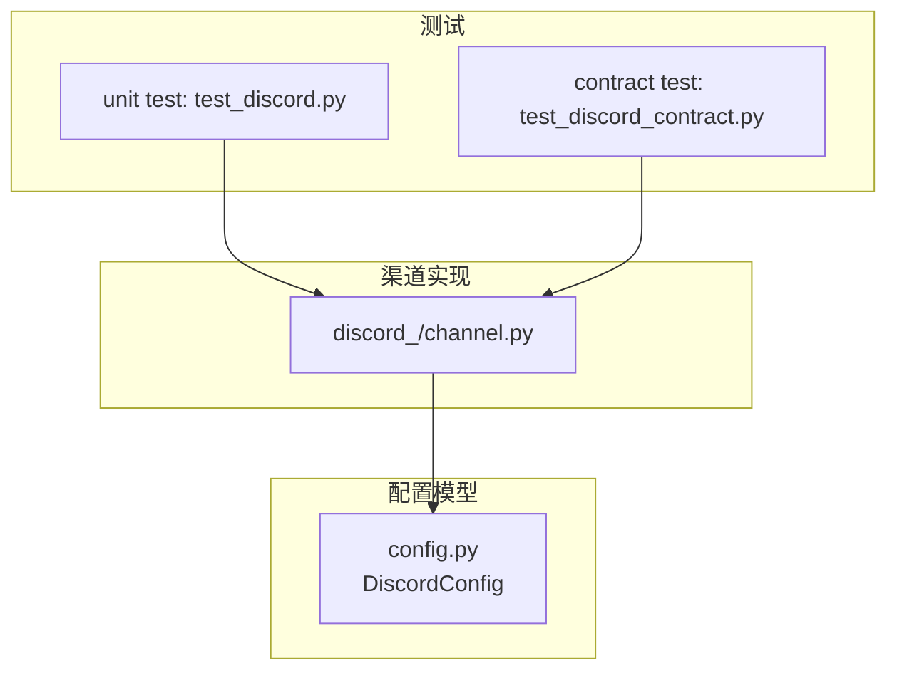
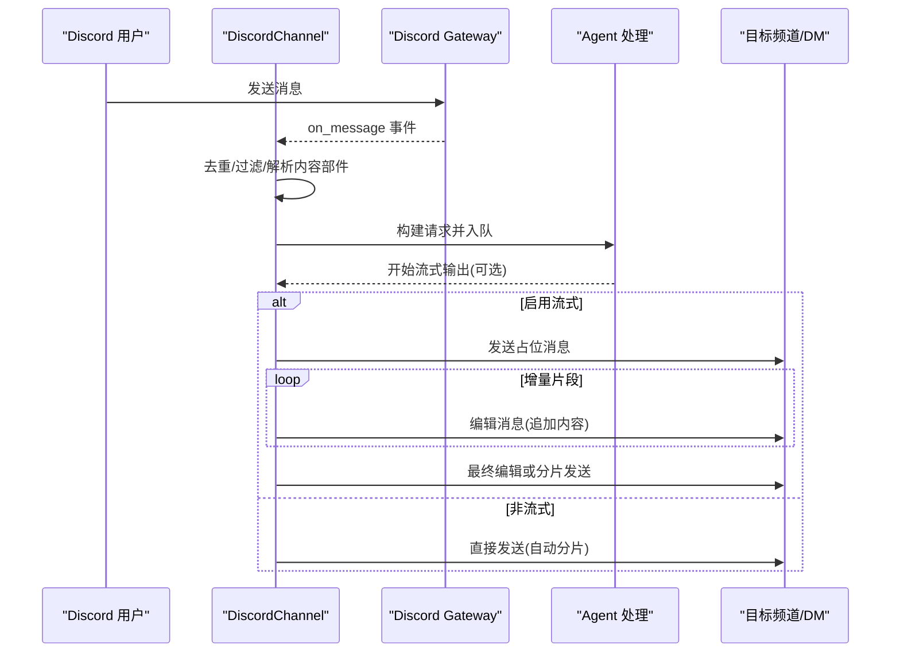
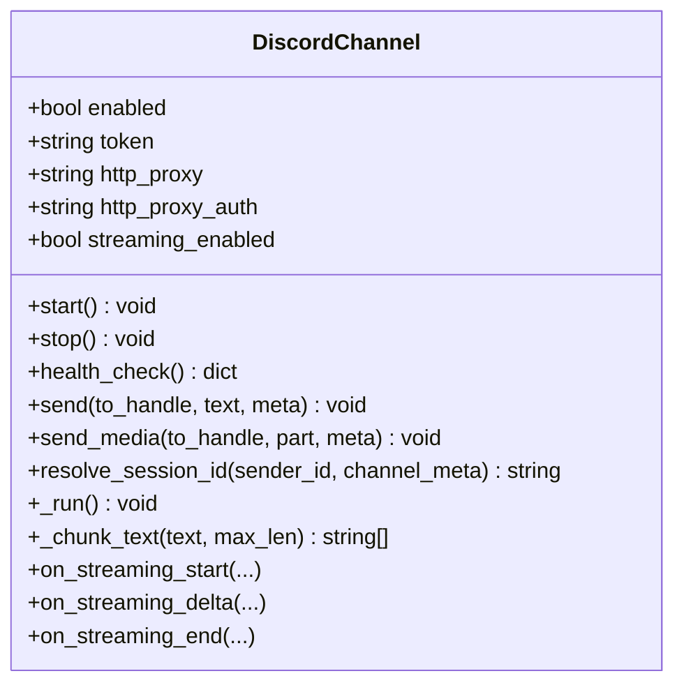
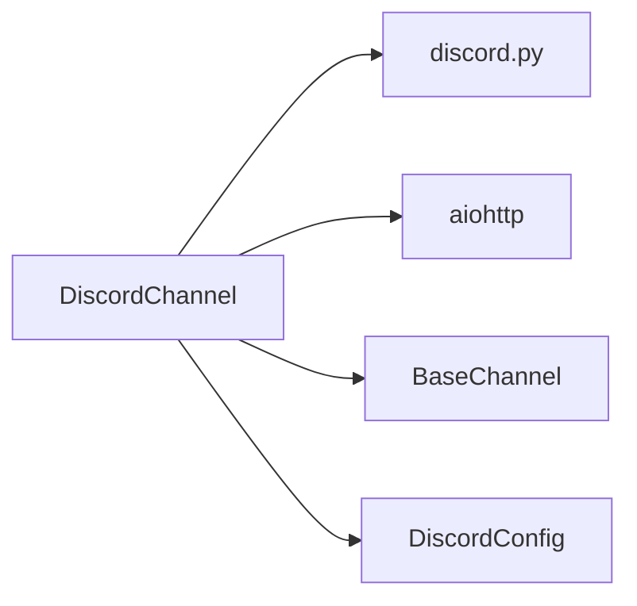

# Discord 渠道配置

<cite>
**本文引用的文件**
- [src/qwenpaw/app/channels/discord_/channel.py](file://src/qwenpaw/app/channels/discord_/channel.py)
- [src/qwenpaw/config/config.py](file://src/qwenpaw/config/config.py)
- [tests/unit/channels/test_discord.py](file://tests/unit/channels/test_discord.py)
- [tests/contract/channels/test_discord_contract.py](file://tests/contract/channels/test_discord_contract.py)
</cite>

## 目录
1. [简介](#简介)
2. [项目结构](#项目结构)
3. [核心组件](#核心组件)
4. [架构总览](#架构总览)
5. [详细组件分析](#详细组件分析)
6. [依赖关系分析](#依赖关系分析)
7. [性能与网络特性](#性能与网络特性)
8. [故障诊断与错误对照](#故障诊断与错误对照)
9. [结论](#结论)
10. [附录：环境变量与配置项速查](#附录环境变量与配置项速查)

## 简介
本文件面向需要在 QwenPaw 中启用并配置 Discord 渠道的运维与开发者，覆盖以下主题：
- Discord Bot 创建流程与权限（Intents）说明
- Bot Token 获取与安全存储建议
- HTTP 代理与认证配置
- 流式响应（编辑消息）功能的启用与行为
- 服务器邀请与权限授予步骤
- 网络环境与防火墙注意事项
- 常见错误代码与排障方法

注意：本文所有实现细节均基于仓库源码，不引入外部未验证信息。

## 项目结构
Discord 渠道的核心实现在 channels 子模块下，配置模型在统一配置文件中定义，单元测试与契约测试位于 tests 目录。

图表来源
- [src/qwenpaw/app/channels/discord_/channel.py:1-120](file://src/qwenpaw/app/channels/discord_/channel.py#L1-L120)
- [src/qwenpaw/config/config.py:228-234](file://src/qwenpaw/config/config.py#L228-L234)
- [tests/unit/channels/test_discord.py:1-120](file://tests/unit/channels/test_discord.py#L1-L120)
- [tests/contract/channels/test_discord_contract.py:1-45](file://tests/contract/channels/test_discord_contract.py#L1-L45)

章节来源
- [src/qwenpaw/app/channels/discord_/channel.py:1-120](file://src/qwenpaw/app/channels/discord_/channel.py#L1-L120)
- [src/qwenpaw/config/config.py:228-234](file://src/qwenpaw/config/config.py#L228-L234)

## 核心组件
- DiscordChannel：Discord 渠道的具体实现，负责连接 Discord Gateway、接收消息、发送文本与媒体、会话路由、打字指示器、流式更新等。
- DiscordConfig：Discord 渠道的配置模型，包含 token、代理、流式开关、媒体目录等字段。

章节来源
- [src/qwenpaw/app/channels/discord_/channel.py:46-120](file://src/qwenpaw/app/channels/discord_/channel.py#L46-L120)
- [src/qwenpaw/config/config.py:228-234](file://src/qwenpaw/config/config.py#L228-L234)

## 架构总览
下图展示了从用户消息到 Agent 处理再到回复的关键路径，以及流式更新的“先发消息再编辑”的流程。

图表来源
- [src/qwenpaw/app/channels/discord_/channel.py:143-314](file://src/qwenpaw/app/channels/discord_/channel.py#L143-L314)
- [src/qwenpaw/app/channels/discord_/channel.py:964-1062](file://src/qwenpaw/app/channels/discord_/channel.py#L964-L1062)
- [src/qwenpaw/app/channels/discord_/channel.py:575-616](file://src/qwenpaw/app/channels/discord_/channel.py#L575-L616)

## 详细组件分析

### 组件 A：DiscordChannel 类
- 职责
  - 初始化与生命周期管理（启动/停止/健康检查）
  - 消息接收与预处理（去重、机器人消息过滤、提及检测、附件下载）
  - 会话路由（DM/频道/线程）
  - 发送能力（文本分片、媒体上传、流式编辑）
  - 打字指示器保持
- 关键实现要点
  - Intents 设置：启用消息内容、DM、消息列表、公会信息
  - 代理支持：通过 discord.Client 的 proxy 与 proxy_auth 参数传入
  - 流式模式：on_streaming_start/delta/end 使用“先发后改”策略
  - 分片策略：超过 2000 字符按行切分，保留代码块围栏

图表来源
- [src/qwenpaw/app/channels/discord_/channel.py:46-120](file://src/qwenpaw/app/channels/discord_/channel.py#L46-L120)
- [src/qwenpaw/app/channels/discord_/channel.py:575-616](file://src/qwenpaw/app/channels/discord_/channel.py#L575-L616)
- [src/qwenpaw/app/channels/discord_/channel.py:964-1062](file://src/qwenpaw/app/channels/discord_/channel.py#L964-L1062)

章节来源
- [src/qwenpaw/app/channels/discord_/channel.py:123-141](file://src/qwenpaw/app/channels/discord_/channel.py#L123-L141)
- [src/qwenpaw/app/channels/discord_/channel.py:575-616](file://src/qwenpaw/app/channels/discord_/channel.py#L575-L616)
- [src/qwenpaw/app/channels/discord_/channel.py:964-1062](file://src/qwenpaw/app/channels/discord_/channel.py#L964-L1062)

### 组件 B：DiscordConfig 配置模型
- 关键字段
  - bot_token：Bot Token
  - http_proxy / http_proxy_auth：HTTP 代理地址与 Basic 认证（user:pass）
  - accept_bot_messages：是否接受其他机器人消息
  - streaming_enabled：是否启用流式编辑
  - media_dir：媒体文件本地目录
- 继承自基础通道配置（如 dm_policy/group_policy/allow_from 等）

章节来源
- [src/qwenpaw/config/config.py:228-234](file://src/qwenpaw/config/config.py#L228-L234)
- [src/qwenpaw/config/config.py:197-216](file://src/qwenpaw/config/config.py#L197-L216)

### 组件 C：工厂方法与配置加载
- from_env：从环境变量读取配置（如 DISCORD_BOT_TOKEN、DISCORD_HTTP_PROXY、DISCORD_STREAMING_ENABLED 等）
- from_config：从 DiscordConfig 对象构造实例

章节来源
- [src/qwenpaw/app/channels/discord_/channel.py:336-422](file://src/qwenpaw/app/channels/discord_/channel.py#L336-L422)

## 依赖关系分析
- 运行时依赖
  - discord.py：用于连接 Discord Gateway、收发消息、编辑消息
  - aiohttp：用于代理认证与媒体下载
- 内部依赖
  - BaseChannel：统一通道接口与通用逻辑
  - 配置模型：DiscordConfig 提供结构化配置

图表来源
- [src/qwenpaw/app/channels/discord_/channel.py:123-141](file://src/qwenpaw/app/channels/discord_/channel.py#L123-L141)
- [src/qwenpaw/app/channels/discord_/channel.py:684-706](file://src/qwenpaw/app/channels/discord_/channel.py#L684-L706)
- [src/qwenpaw/config/config.py:228-234](file://src/qwenpaw/config/config.py#L228-L234)

章节来源
- [src/qwenpaw/app/channels/discord_/channel.py:123-141](file://src/qwenpaw/app/channels/discord_/channel.py#L123-L141)
- [src/qwenpaw/app/channels/discord_/channel.py:684-706](file://src/qwenpaw/app/channels/discord_/channel.py#L684-L706)

## 性能与网络特性
- 消息长度限制与分片
  - Discord 单条消息上限为 2000 字符；超出时按行切分，尽量保持 Markdown 代码块围栏完整
- 流式更新
  - 采用“先发占位消息，再多次 edit 更新”的策略，避免频繁创建消息
  - 当最终文本超长时，会删除占位消息并回退到分片发送
- 打字指示器
  - 在处理期间周期性刷新 typing 状态，提升交互体验
- 代理与认证
  - 通过 discord.Client 的 proxy 与 proxy_auth 传递，底层由 aiohttp 驱动

章节来源
- [src/qwenpaw/app/channels/discord_/channel.py:501-573](file://src/qwenpaw/app/channels/discord_/channel.py#L501-L573)
- [src/qwenpaw/app/channels/discord_/channel.py:964-1062](file://src/qwenpaw/app/channels/discord_/channel.py#L964-L1062)
- [src/qwenpaw/app/channels/discord_/channel.py:827-858](file://src/qwenpaw/app/channels/discord_/channel.py#L827-L858)
- [src/qwenpaw/app/channels/discord_/channel.py:132-141](file://src/qwenpaw/app/channels/discord_/channel.py#L132-L141)

## 故障诊断与错误对照
- 客户端未初始化或未就绪
  - 现象：调用 send 抛出 ChannelError，提示客户端未初始化或未就绪
  - 排查：确认 enabled 为真且已正确启动；检查 health_check 返回状态
- 无法解析目标（to_handle）
  - 现象：缺少有效的 channel_id 或 user_id，导致无法定位目标
  - 排查：确保 to_handle 格式为 discord:ch:<id> 或 discord:dm:<id>
- 流式编辑失败
  - 现象：日志中出现“streaming delta edit failed”或“streaming end edit failed”
  - 排查：检查目标频道是否存在、是否有编辑权限；必要时回退到分片发送
- 代理连接问题
  - 现象：无法连接 Discord Gateway 或下载媒体失败
  - 排查：校验 http_proxy 与 http_proxy_auth 格式；确认代理可达与认证正确

章节来源
- [src/qwenpaw/app/channels/discord_/channel.py:594-614](file://src/qwenpaw/app/channels/discord_/channel.py#L594-L614)
- [src/qwenpaw/app/channels/discord_/channel.py:993-1022](file://src/qwenpaw/app/channels/discord_/channel.py#L993-L1022)
- [src/qwenpaw/app/channels/discord_/channel.py:1024-1062](file://src/qwenpaw/app/channels/discord_/channel.py#L1024-L1062)
- [src/qwenpaw/app/channels/discord_/channel.py:684-706](file://src/qwenpaw/app/channels/discord_/channel.py#L684-L706)

## 结论
- 通过 DiscordConfig 与 from_env/from_config 两种加载方式，可灵活配置 Discord 渠道
- 流式功能以“占位+编辑”的方式实现，兼顾实时性与稳定性
- 代理与认证通过标准参数注入，便于企业网络环境部署
- 建议在安全方面将 Token 存放于受控的环境变量或密钥管理系统中，避免明文硬编码

[本节不直接分析具体文件，无需列出来源]

## 附录：环境变量与配置项速查
- 环境变量（来自 from_env）
  - DISCORD_CHANNEL_ENABLED：是否启用
  - DISCORD_BOT_TOKEN：Bot Token
  - DISCORD_HTTP_PROXY：HTTP 代理地址
  - DISCORD_HTTP_PROXY_AUTH：代理认证 user:pass
  - DISCORD_DM_POLICY / DISCORD_GROUP_POLICY：访问策略
  - DISCORD_ALLOW_FROM：允许列表（逗号分隔）
  - DISCORD_DENY_MESSAGE：拒绝消息文案
  - DISCORD_REQUIRE_MENTION：是否需要 @Bot
  - DISCORD_ACCEPT_BOT_MESSAGES：是否接受其他机器人消息
  - DISCORD_STREAMING_ENABLED：是否启用流式
  - DISCORD_MEDIA_DIR：媒体目录
- 配置文件字段（DiscordConfig）
  - bot_token、http_proxy、http_proxy_auth、accept_bot_messages、streaming_enabled、media_dir
  - 继承自基础配置的 dm_policy、group_policy、allow_from、deny_message、require_mention 等

章节来源
- [src/qwenpaw/app/channels/discord_/channel.py:336-379](file://src/qwenpaw/app/channels/discord_/channel.py#L336-L379)
- [src/qwenpaw/config/config.py:228-234](file://src/qwenpaw/config/config.py#L228-L234)
- [src/qwenpaw/config/config.py:197-216](file://src/qwenpaw/config/config.py#L197-L216)