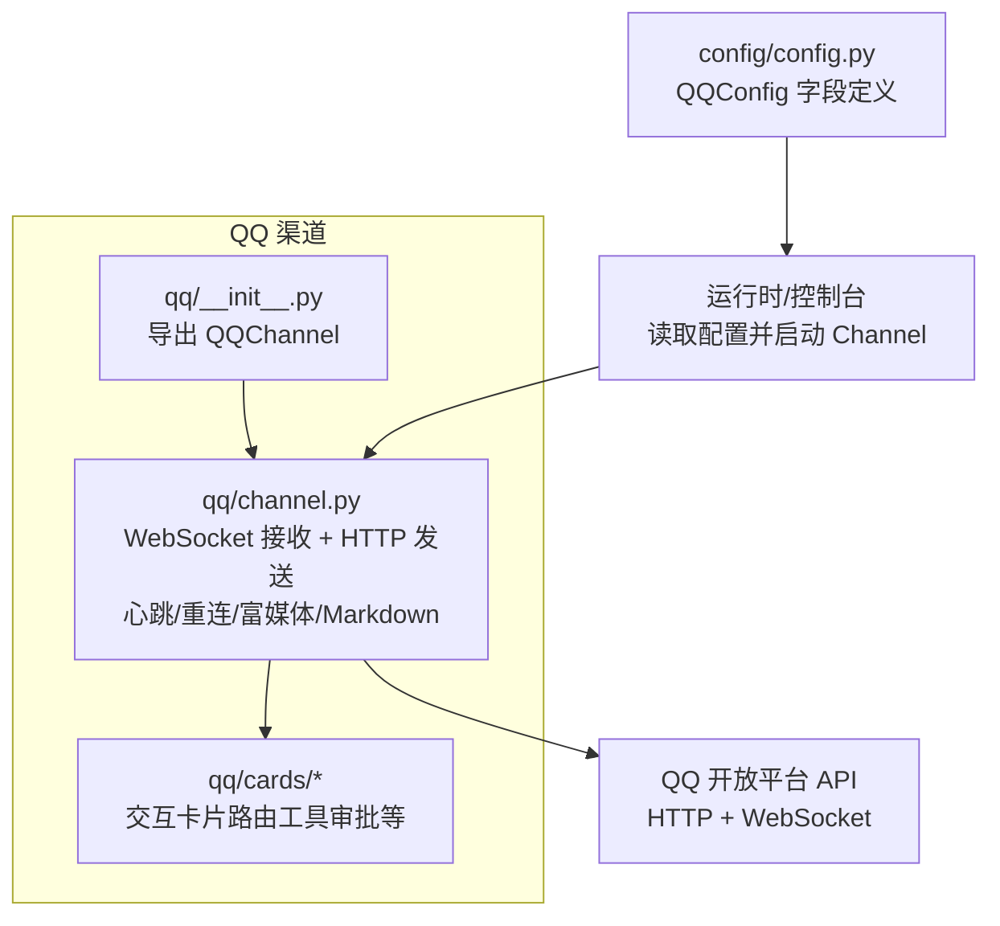
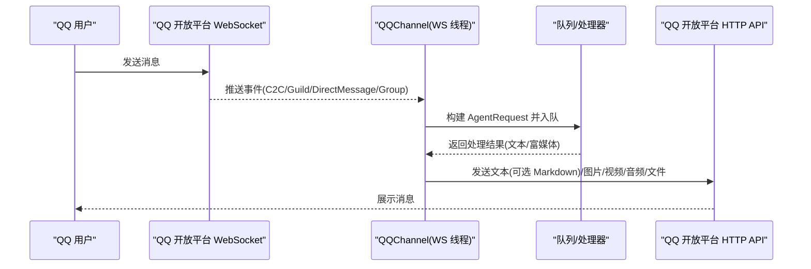
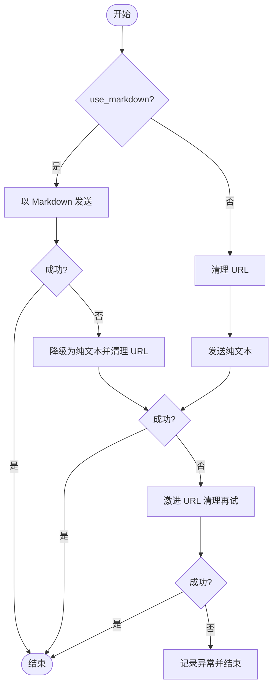
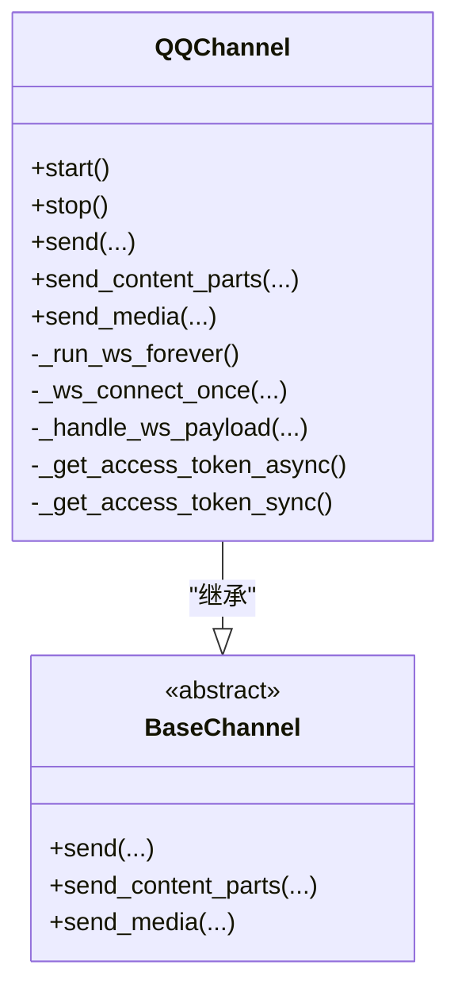

# QQ 渠道配置

<cite>
**本文引用的文件**   
- [channel.py](file://src/qwenpaw/app/channels/qq/channel.py)
- [config.py](file://src/qwenpaw/config/config.py)
- [__init__.py](file://src/qwenpaw/app/channels/qq/__init__.py)
</cite>

## 目录
1. [简介](#简介)
2. [项目结构](#项目结构)
3. [核心组件](#核心组件)
4. [架构总览](#架构总览)
5. [详细组件分析](#详细组件分析)
6. [依赖关系分析](#依赖关系分析)
7. [性能与稳定性](#性能与稳定性)
8. [故障排查指南](#故障排查指南)
9. [结论](#结论)
10. [附录](#附录)

## 简介
本文件面向在 QwenPaw 中启用 QQ 开放平台机器人渠道的运维与开发者，提供从应用创建、凭证配置到消息收发、富文本与媒体支持、权限与邀请、错误处理与连接稳定性的完整说明。文档内容严格基于仓库源码实现进行归纳与可视化，便于快速上手与排障。

## 项目结构
QQ 渠道相关代码位于 channels/qq 包内，包含通道主实现与交互卡片分发器；配置项集中在统一配置模块中。

图表来源
- [__init__.py:1-5](file://src/qwenpaw/app/channels/qq/__init__.py#L1-L5)
- [channel.py:644-713](file://src/qwenpaw/app/channels/qq/channel.py#L644-L713)
- [config.py:272-277](file://src/qwenpaw/config/config.py#L272-L277)

章节来源
- [__init__.py:1-5](file://src/qwenpaw/app/channels/qq/__init__.py#L1-L5)
- [channel.py:644-713](file://src/qwenpaw/app/channels/qq/channel.py#L644-L713)
- [config.py:272-277](file://src/qwenpaw/config/config.py#L272-L277)

## 核心组件
- QQChannel：负责与 QQ 开放平台建立 WebSocket 长连接、处理事件、通过 HTTP API 回复文本与富媒体，内置 Markdown 发送与降级策略、URL 清洗、心跳与指数退避重连、即时 ACK 等能力。
- QQConfig：描述 QQ 渠道的配置项，包括 App ID、Client Secret、Markdown 开关、最大重连次数、ACK 消息等。

章节来源
- [channel.py:644-713](file://src/qwenpaw/app/channels/qq/channel.py#L644-L713)
- [config.py:272-277](file://src/qwenpaw/config/config.py#L272-L277)

## 架构总览
QQ 渠道采用“WebSocket 接收事件 + HTTP 发送回复”的解耦模式。服务端收到用户消息后，构造内部请求入队，由消费端处理后调用 QQChannel.send/send_content_parts 通过 HTTP 接口回复。

图表来源
- [channel.py:1461-1560](file://src/qwenpaw/app/channels/qq/channel.py#L1461-L1560)
- [channel.py:1090-1159](file://src/qwenpaw/app/channels/qq/channel.py#L1090-L1159)
- [channel.py:2007-2087](file://src/qwenpaw/app/channels/qq/channel.py#L2007-L2087)

## 详细组件分析

### 配置项与环境变量
- 配置类字段（节选）
  - app_id: 应用标识
  - client_secret: 应用密钥
  - markdown_enabled: 是否使用 Markdown 发送
  - max_reconnect_attempts: 最大重连次数（-1 表示无限）
  - ack_message: 收到消息后的即时确认文本
- 环境变量覆盖（示例）
  - QQ_CHANNEL_ENABLED: 是否启用
  - QQ_APP_ID / QQ_CLIENT_SECRET: 凭证
  - QQ_BOT_PREFIX: 消息前缀过滤
  - QQ_MARKDOWN_ENABLED: 是否启用 Markdown

章节来源
- [config.py:272-277](file://src/qwenpaw/config/config.py#L272-L277)
- [channel.py:797-850](file://src/qwenpaw/app/channels/qq/channel.py#L797-L850)

### 认证与网关
- Access Token 获取：通过 HTTP 向令牌接口提交 appId 与 clientSecret，返回 access_token 与 expires_in，并在实例级缓存。
- 网关地址获取：携带 Authorization 头访问网关接口，得到 WebSocket URL。
- 鉴权头格式：Authorization: QQBot {access_token}

章节来源
- [channel.py:714-790](file://src/qwenpaw/app/channels/qq/channel.py#L714-L790)
- [channel.py:285-331](file://src/qwenpaw/app/channels/qq/channel.py#L285-L331)
- [channel.py:347-375](file://src/qwenpaw/app/channels/qq/channel.py#L347-L375)

### WebSocket 连接与会话
- 连接流程
  - 首次连接：发送 IDENTIFY，携带 token 与 intents；服务器返回 HELLO 后启动心跳。
  - 会话恢复：若存在 session_id 与 last_seq，优先尝试 RESUME。
  - 心跳：周期性发送 HEARTBEAT，维护 last_seq。
- Intents 控制
  - 默认订阅公共频道消息、成员信息、交互事件；失败计数小于阈值时额外订阅私聊与群/C2C。
- 状态管理
  - _WSState 保存 session_id、last_seq、重连次数、最近连接时间、快速断开计数、token 刷新标记等。

章节来源
- [channel.py:1600-1685](file://src/qwenpaw/app/channels/qq/channel.py#L1600-L1685)
- [channel.py:137-148](file://src/qwenpaw/app/channels/qq/channel.py#L137-L148)
- [channel.py:1629-1645](file://src/qwenpaw/app/channels/qq/channel.py#L1629-L1645)

### 消息事件处理与路由
- 事件类型映射
  - C2C_MESSAGE_CREATE → c2c
  - AT_MESSAGE_CREATE → guild
  - DIRECT_MESSAGE_CREATE → dm
  - GROUP_AT_MESSAGE_CREATE → group
- 路由解析
  - 根据 message_type 与目标标识选择对应 HTTP 路径（如 /v2/users/{openid}/messages、/channels/{id}/messages、/dms/{guild_id}/messages、/v2/groups/{group_openid}/messages）。
- 引用消息与附件
  - 自动提取被引用消息文本与附件，合并为 content_parts 一并进入处理链路。

章节来源
- [channel.py:109-129](file://src/qwenpaw/app/channels/qq/channel.py#L109-L129)
- [channel.py:852-884](file://src/qwenpaw/app/channels/qq/channel.py#L852-L884)
- [channel.py:1461-1560](file://src/qwenpaw/app/channels/qq/channel.py#L1461-L1560)

### 文本发送与 Markdown 支持
- Markdown 发送
  - 当 use_markdown=True 时，以 markdown.content 形式发送，msg_type=2。
  - 若平台拒绝原生 Markdown，将自动降级为纯文本。
- URL 清理与二次降级
  - 普通清理：替换明文链接占位符。
  - 激进清理：对裸域名等更严格匹配，避免平台校验失败。
- 分片发送
  - 长文本按 split_text 切分后逐段发送，降低单次长度限制风险。

图表来源
- [channel.py:377-418](file://src/qwenpaw/app/channels/qq/channel.py#L377-L418)
- [channel.py:917-1047](file://src/qwenpaw/app/channels/qq/channel.py#L917-L1047)
- [channel.py:216-283](file://src/qwenpaw/app/channels/qq/channel.py#L216-L283)

章节来源
- [channel.py:377-418](file://src/qwenpaw/app/channels/qq/channel.py#L377-L418)
- [channel.py:917-1047](file://src/qwenpaw/app/channels/qq/channel.py#L917-L1047)
- [channel.py:216-283](file://src/qwenpaw/app/channels/qq/channel.py#L216-L283)

### 富媒体与附件
- 支持的媒体类型
  - 图片、视频、音频、文件（不同场景支持度不同）
- 发送路径差异
  - c2c/group：通过“上传至富媒体服务器(/files)”+“发送富媒体消息(/messages, msg_type=7)”两步完成；群不支持 file_type=4（文件）。
  - guild/dm：仅支持图片与视频，使用 image 字段（URL）或 file_image（表单上传）。
- 本地与远程资源
  - 支持 http(s) URL 与本地文件路径（含 file://），自动识别并选择合适上传方式。
- 语音消息 ASR
  - 若平台侧已提供 ASR 文本，则直接作为文本内容，跳过下载与转写。

章节来源
- [channel.py:2007-2087](file://src/qwenpaw/app/channels/qq/channel.py#L2007-L2087)
- [channel.py:2088-2320](file://src/qwenpaw/app/channels/qq/channel.py#L2088-L2320)
- [channel.py:1254-1313](file://src/qwenpaw/app/channels/qq/channel.py#L1254-L1313)

### 频道模式与私聊模式
- 频道模式（Guild/Text Channel）
  - 事件类型：AT_MESSAGE_CREATE
  - 路由路径：/channels/{channel_id}/messages
  - 富媒体：仅支持图片与视频（image/file_image）
- 私聊模式（DM）
  - 事件类型：DIRECT_MESSAGE_CREATE
  - 路由路径：/dms/{guild_id}/messages
  - 富媒体：仅支持图片与视频（image/file_image）
- C2C 与群
  - 事件类型：C2C_MESSAGE_CREATE、GROUP_AT_MESSAGE_CREATE
  - 路由路径：/v2/users/{openid}/messages、/v2/groups/{group_openid}/messages
  - 富媒体：支持图片/视频/音频/文件（群不支持文件）

章节来源
- [channel.py:109-129](file://src/qwenpaw/app/channels/qq/channel.py#L109-L129)
- [channel.py:852-884](file://src/qwenpaw/app/channels/qq/channel.py#L852-L884)
- [channel.py:2257-2320](file://src/qwenpaw/app/channels/qq/channel.py#L2257-L2320)

### 机器人邀请与权限设置
- 所需权限（Intents）
  - 公共频道消息、成员信息、交互事件
  - 私聊与群/C2C（在 identify 失败计数较低时启用）
- 建议步骤
  - 在 QQ 开放平台创建机器人应用，开启上述意图与必要权限。
  - 将应用加入目标频道/群组，确保具备发送与接收消息的权限。
  - 在 QwenPaw 中配置 App ID 与 Client Secret 并启用渠道。

章节来源
- [channel.py:1629-1645](file://src/qwenpaw/app/channels/qq/channel.py#L1629-L1645)

### 消息格式转换与富文本
- 文本
  - 支持 Markdown 发送；平台拒绝时自动降级为纯文本并进行 URL 清理。
- 富媒体
  - 图片/视频：URL 直发或本地上传；音频/文件：仅 c2c/group 支持，且群不支持文件。
- 引用消息
  - 自动提取被引用消息的文本与附件，拼接为上下文传入处理链路。

章节来源
- [channel.py:1461-1560](file://src/qwenpaw/app/channels/qq/channel.py#L1461-L1560)
- [channel.py:2007-2087](file://src/qwenpaw/app/channels/qq/channel.py#L2007-L2087)

### 错误处理与连接稳定性
- 连接稳定性
  - 心跳保活、指数退避重连、快速断开保护（短时间内频繁断线触发限流等待）、无效会话清理与 token 刷新。
- 文本发送容错
  - Markdown 失败→纯文本→激进 URL 清理，逐级降级。
- 网络错误分类
  - 可恢复的 OS 层错误（如 Windows 特定错误码）视为连接丢失并重连。
- 健康检查
  - 暴露 WebSocket 线程与 HTTP 会话状态，便于监控。

章节来源
- [channel.py:1691-1817](file://src/qwenpaw/app/channels/qq/channel.py#L1691-L1817)
- [channel.py:200-214](file://src/qwenpaw/app/channels/qq/channel.py#L200-L214)
- [channel.py:1841-1867](file://src/qwenpaw/app/channels/qq/channel.py#L1841-L1867)

## 依赖关系分析
- 外部依赖
  - websocket-client：用于 WebSocket 客户端连接（缺失时会提示安装）。
  - aiohttp：用于 HTTP 请求与富媒体上传。
- 内部依赖
  - BaseChannel：统一通道抽象（send/send_media 等）。
  - 配置模块：QQConfig 提供字段与环境变量映射。

图表来源
- [channel.py:644-713](file://src/qwenpaw/app/channels/qq/channel.py#L644-L713)
- [channel.py:1869-1906](file://src/qwenpaw/app/channels/qq/channel.py#L1869-L1906)

章节来源
- [channel.py:1823-1840](file://src/qwenpaw/app/channels/qq/channel.py#L1823-L1840)
- [channel.py:644-713](file://src/qwenpaw/app/channels/qq/channel.py#L644-L713)

## 性能与稳定性
- 并发与阻塞
  - WebSocket 运行于独立线程，避免阻塞异步事件循环；文件 I/O 与 base64 编码通过线程池执行。
- 重连策略
  - 指数退避 + 快速断开保护 + 会话失效清理，兼顾恢复速度与平台限流。
- 文本分片
  - 长文本按平台限制切分，减少单次请求失败概率。
- 媒体上传
  - 优先使用 URL 直传，必要时本地上传；群场景自动规避不支持的文件类型。

[本节为通用指导，不直接分析具体文件]

## 故障排查指南
- 无法连接 WebSocket
  - 检查 QQ_APP_ID/QQ_CLIENT_SECRET 是否正确；查看健康检查输出是否显示“WebSocket 线程未运行”。
  - 关注日志中的“get token/gateway failed”“ws connect failed”等提示。
- 消息发送失败
  - 若出现“不允许包含 url”或 Markdown 校验错误，系统会自动降级与清理 URL；仍失败请检查文本内容与媒体类型。
  - 群聊发送文件会被跳过（平台不支持），需改用图片/视频/音频。
- 频繁断线
  - 观察“快速断开计数”与“限流等待”日志；适当增大 max_reconnect_attempts 或检查网络质量。
- 权限不足
  - 确认已在 QQ 开放平台开启所需 Intents 并将机器人加入目标频道/群组。

章节来源
- [channel.py:1841-1867](file://src/qwenpaw/app/channels/qq/channel.py#L1841-L1867)
- [channel.py:1691-1817](file://src/qwenpaw/app/channels/qq/channel.py#L1691-L1817)
- [channel.py:216-283](file://src/qwenpaw/app/channels/qq/channel.py#L216-L283)
- [channel.py:2257-2320](file://src/qwenpaw/app/channels/qq/channel.py#L2257-L2320)

## 结论
QQ 渠道在 QwenPaw 中以高可用、强容错的架构实现：WebSocket 接收事件、HTTP 发送回复，结合 Markdown 降级、URL 清理、分片发送与完善的重连策略，能够稳定支撑多场景的消息交互。合理配置 App ID/Client Secret、Intents 与媒体策略，即可在频道与私聊模式下获得一致体验。

[本节为总结性内容，不直接分析具体文件]

## 附录

### 配置清单与环境变量速查
- 必填
  - QQ_APP_ID、QQ_CLIENT_SECRET
- 可选
  - QQ_CHANNEL_ENABLED、QQ_BOT_PREFIX、QQ_MARKDOWN_ENABLED
  - QQ_API_BASE（自定义 API 基础地址）
  - QQ_MAX_RECONNECT_ATTEMPTS（通过配置类传递）
  - QQ_ACK_MESSAGE（即时确认文本）

章节来源
- [channel.py:797-850](file://src/qwenpaw/app/channels/qq/channel.py#L797-L850)
- [config.py:272-277](file://src/qwenpaw/config/config.py#L272-L277)