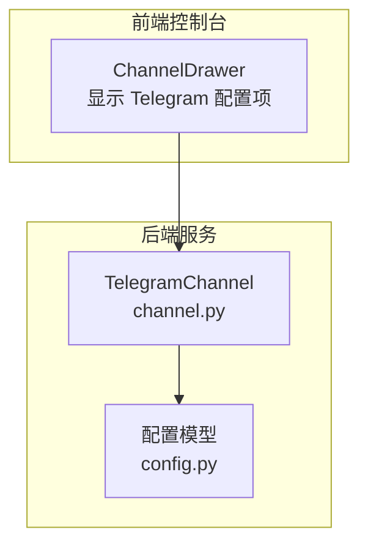
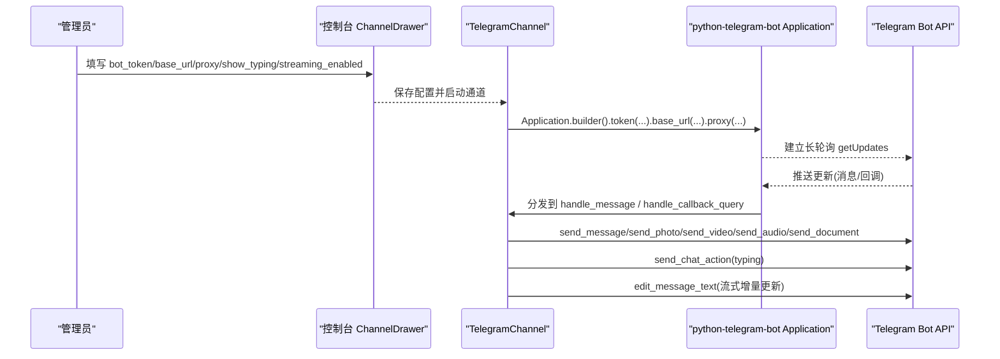
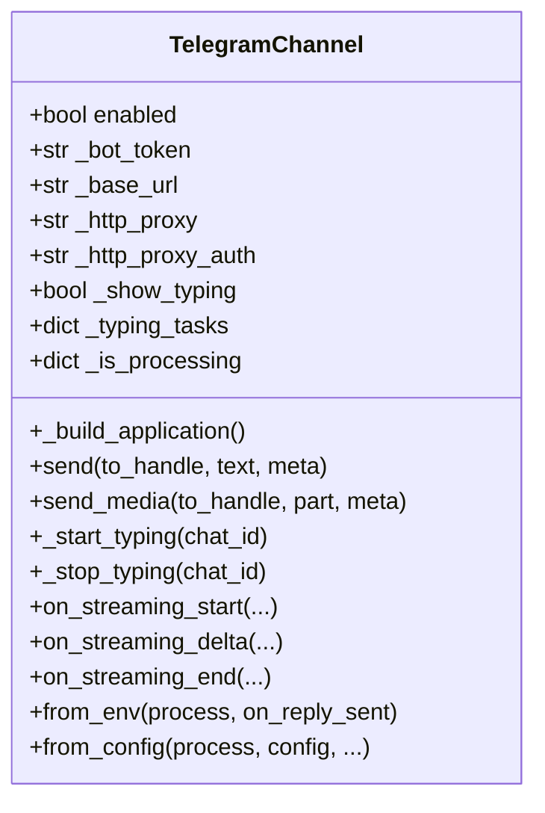
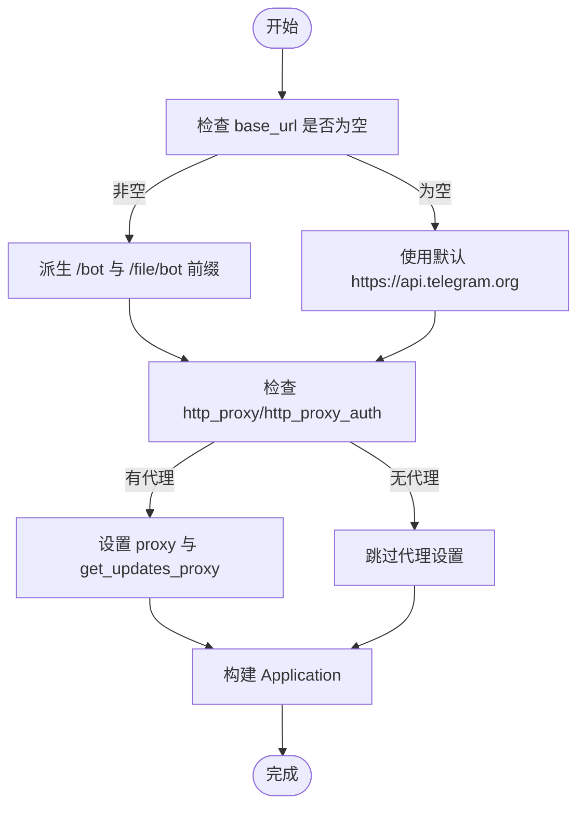
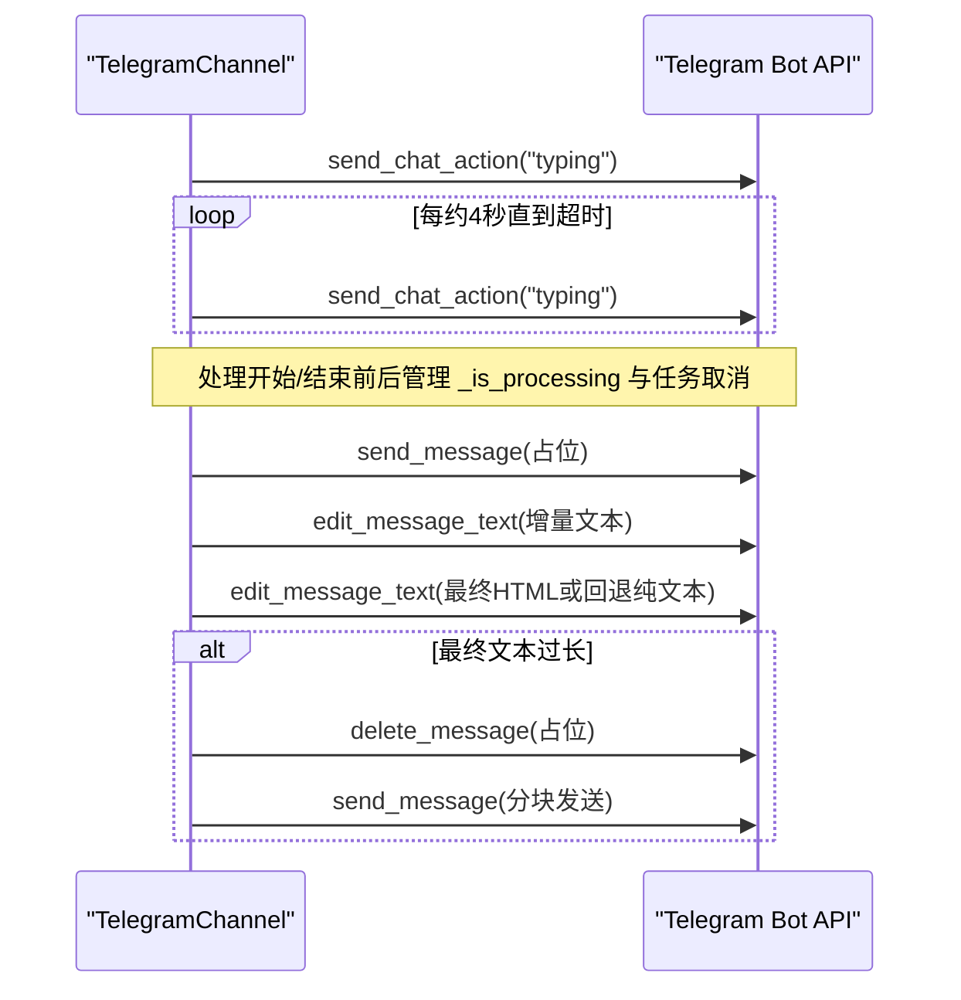
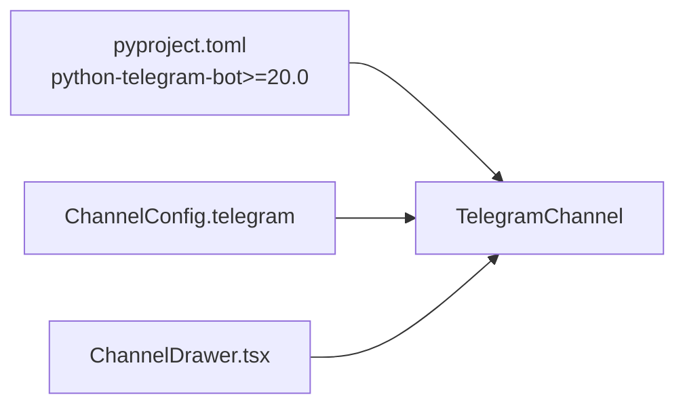

# Telegram 渠道配置

<cite>
**本文引用的文件**   
- [channel.py](file://src/qwenpaw/app/channels/telegram/channel.py)
- [config.py](file://src/qwenpaw/config/config.py)
- [test_telegram.py](file://tests/unit/channels/test_telegram.py)
- [ChannelDrawer.tsx](file://console/src/pages/Control/Channels/components/ChannelDrawer.tsx)
</cite>

## 目录
1. [简介](#简介)
2. [项目结构](#项目结构)
3. [核心组件](#核心组件)
4. [架构总览](#架构总览)
5. [详细组件分析](#详细组件分析)
6. [依赖关系分析](#依赖关系分析)
7. [性能与连接优化](#性能与连接优化)
8. [故障排查指南](#故障排查指南)
9. [结论](#结论)
10. [附录：环境变量与配置项](#附录环境变量与配置项)

## 简介
本文件面向在系统中启用 Telegram 渠道的用户，提供从 BotFather 创建 Bot、配置 Bot Token、自定义 API Base URL、代理服务器、打字指示器与流式响应、群组权限控制、网络与连接优化以及常见错误处理与调试的完整指南。内容基于仓库中 Telegram 渠道实现与前端控制台表单字段进行说明，确保与实际代码行为一致。

## 项目结构
Telegram 渠道的核心实现在后端通道模块中，前端控制台通过 ChannelDrawer 暴露相关配置项（如 bot_token、base_url、http_proxy、http_proxy_auth、show_typing、streaming_enabled）。

图表来源
- [ChannelDrawer.tsx:670-680](file://console/src/pages/Control/Channels/components/ChannelDrawer.tsx#L670-L680)
- [channel.py:300-370](file://src/qwenpaw/app/channels/telegram/channel.py#L300-L370)
- [config.py:495-518](file://src/qwenpaw/config/config.py#L495-L518)

章节来源
- [channel.py:300-370](file://src/qwenpaw/app/channels/telegram/channel.py#L300-L370)
- [config.py:495-518](file://src/qwenpaw/config/config.py#L495-L518)
- [ChannelDrawer.tsx:670-680](file://console/src/pages/Control/Channels/components/ChannelDrawer.tsx#L670-L680)

## 核心组件
- TelegramChannel：负责与 Telegram Bot API 交互，包括消息收发、媒体上传、打字指示器、流式编辑、轮询重连等。
- 配置加载：支持 from_env 与 from_config 两种方式；from_env 读取 TELEGRAM_* 环境变量，from_config 读取结构化配置对象或字典。
- 前端表单：ChannelDrawer 为 Telegram 暴露 bot_token、base_url、http_proxy、http_proxy_auth、show_typing、streaming_enabled 等字段。

章节来源
- [channel.py:583-665](file://src/qwenpaw/app/channels/telegram/channel.py#L583-L665)
- [channel.py:300-370](file://src/qwenpaw/app/channels/telegram/channel.py#L300-L370)
- [ChannelDrawer.tsx:670-680](file://console/src/pages/Control/Channels/components/ChannelDrawer.tsx#L670-L680)

## 架构总览
下图展示 Telegram 渠道的关键流程：初始化构建 Application、注册消息与回调处理器、发送文本与媒体、打字指示器与流式更新。

图表来源
- [channel.py:402-498](file://src/qwenpaw/app/channels/telegram/channel.py#L402-L498)
- [channel.py:738-794](file://src/qwenpaw/app/channels/telegram/channel.py#L738-L794)
- [channel.py:914-1134](file://src/qwenpaw/app/channels/telegram/channel.py#L914-L1134)

## 详细组件分析

### 组件 A：TelegramChannel 类
- 职责
  - 维护 Application 实例与轮询状态
  - 解析消息实体（命令、@提及）、下载媒体、构造统一内容片段
  - 发送文本与媒体，支持分块与 HTML→纯文本回退
  - 打字指示器循环与超时停止
  - 流式占位消息与增量编辑，最终渲染 Markdown→HTML
  - 轮询冲突与网络错误的指数退避重连
- 关键方法
  - _build_application：构建 Application，设置 base_url/base_file_url、代理、超时
  - send/_send_media_value：发送文本与媒体，异常分类与友好提示
  - _start_typing/_typing_loop：周期性发送 typing 动作
  - on_streaming_start/delta/end：占位消息、增量编辑、最终编辑或回退分块发送
  - from_env/from_config：工厂方法加载配置与环境变量

图表来源
- [channel.py:300-370](file://src/qwenpaw/app/channels/telegram/channel.py#L300-L370)
- [channel.py:402-498](file://src/qwenpaw/app/channels/telegram/channel.py#L402-L498)
- [channel.py:738-794](file://src/qwenpaw/app/channels/telegram/channel.py#L738-L794)
- [channel.py:914-1134](file://src/qwenpaw/app/channels/telegram/channel.py#L914-L1134)
- [channel.py:583-665](file://src/qwenpaw/app/channels/telegram/channel.py#L583-L665)

章节来源
- [channel.py:300-370](file://src/qwenpaw/app/channels/telegram/channel.py#L300-L370)
- [channel.py:402-498](file://src/qwenpaw/app/channels/telegram/channel.py#L402-L498)
- [channel.py:738-794](file://src/qwenpaw/app/channels/telegram/channel.py#L738-L794)
- [channel.py:914-1134](file://src/qwenpaw/app/channels/telegram/channel.py#L914-L1134)
- [channel.py:583-665](file://src/qwenpaw/app/channels/telegram/channel.py#L583-L665)

### 组件 B：API Base URL 与代理配置
- API Base URL
  - 通过 base_url 指定自定义根地址，内部派生 /bot 与 /file/bot 前缀
  - 若未设置，使用默认官方地址
- 代理
  - http_proxy 与 http_proxy_auth 组合支持带认证的 HTTP 代理
  - 应用构建时同时设置普通请求与 getUpdates 的代理

图表来源
- [channel.py:104-109](file://src/qwenpaw/app/channels/telegram/channel.py#L104-L109)
- [channel.py:412-431](file://src/qwenpaw/app/channels/telegram/channel.py#L412-L431)
- [channel.py:171-173](file://src/qwenpaw/app/channels/telegram/channel.py#L171-L173)

章节来源
- [channel.py:104-109](file://src/qwenpaw/app/channels/telegram/channel.py#L104-L109)
- [channel.py:412-431](file://src/qwenpaw/app/channels/telegram/channel.py#L412-L431)
- [channel.py:171-173](file://src/qwenpaw/app/channels/telegram/channel.py#L171-L173)

### 组件 C：打字指示器与流式响应
- 打字指示器
  - 当处理进行中时，按固定间隔发送 typing 动作，并在发送完成后停止
- 流式响应
  - 首次发送占位消息，随后以较低频率增量编辑文本
  - 最终阶段尝试 HTML 渲染；若超长则删除占位消息并回退到分块发送

图表来源
- [channel.py:689-737](file://src/qwenpaw/app/channels/telegram/channel.py#L689-L737)
- [channel.py:928-1011](file://src/qwenpaw/app/channels/telegram/channel.py#L928-L1011)
- [channel.py:1029-1134](file://src/qwenpaw/app/channels/telegram/channel.py#L1029-L1134)

章节来源
- [channel.py:689-737](file://src/qwenpaw/app/channels/telegram/channel.py#L689-L737)
- [channel.py:928-1011](file://src/qwenpaw/app/channels/telegram/channel.py#L928-L1011)
- [channel.py:1029-1134](file://src/qwenpaw/app/channels/telegram/channel.py#L1029-L1134)

### 组件 D：群组添加与权限设置
- 群组策略
  - group_policy 可设为 open/restricted 等策略，配合 require_mention 控制是否必须 @Bot
  - allow_from/deny_message 用于白名单与拒绝提示
- 前端开关
  - access_control_group 开启后，可在控制台对群组访问进行细粒度控制
- 建议
  - 在群组中添加 Bot 后，根据业务需要选择“仅被提及才响应”或“开放接收”

章节来源
- [channel.py:300-370](file://src/qwenpaw/app/channels/telegram/channel.py#L300-L370)
- [ChannelDrawer.tsx:670-680](file://console/src/pages/Control/Channels/components/ChannelDrawer.tsx#L670-L680)

### 组件 E：网络代理与连接池优化
- 代理
  - 支持 http_proxy 与 http_proxy_auth，适用于 getUpdates 与普通请求
- 连接与超时
  - get_updates_read_timeout 与 get_updates_connect_timeout 已内置合理默认值
  - 轮询冲突与网络错误采用指数退避与上限保护，避免风暴式重试
- 连接池
  - 底层由 python-telegram-bot 管理 HTTP 会话与连接复用；无需额外显式配置

章节来源
- [channel.py:412-431](file://src/qwenpaw/app/channels/telegram/channel.py#L412-L431)
- [channel.py:500-582](file://src/qwenpaw/app/channels/telegram/channel.py#L500-L582)

## 依赖关系分析
- 外部依赖
  - python-telegram-bot>=20.0（版本约束在项目依赖中声明）
- 内部依赖
  - 配置模型 ChannelConfig 包含 telegram 子配置
  - 前端 ChannelDrawer 暴露 Telegram 配置项

图表来源
- [pyproject.toml:29](file://pyproject.toml#L29)
- [config.py:495-518](file://src/qwenpaw/config/config.py#L495-L518)
- [ChannelDrawer.tsx:670-680](file://console/src/pages/Control/Channels/components/ChannelDrawer.tsx#L670-L680)

章节来源
- [pyproject.toml:29](file://pyproject.toml#L29)
- [config.py:495-518](file://src/qwenpaw/config/config.py#L495-L518)
- [ChannelDrawer.tsx:670-680](file://console/src/pages/Control/Channels/components/ChannelDrawer.tsx#L670-L680)

## 性能与连接优化
- 文本分块
  - 超过限制的消息会被智能切分，优先按换行或空格边界分割
- 流式编辑节流
  - 增量编辑最小间隔受控，避免触发平台限频
- 媒体上传
  - 大小限制与超时、速率限制均有明确错误分支与用户提示
- 轮询重连
  - 冲突与网络错误分别采用不同退避策略，保证稳定性

章节来源
- [channel.py:667-687](file://src/qwenpaw/app/channels/telegram/channel.py#L667-L687)
- [channel.py:800-913](file://src/qwenpaw/app/channels/telegram/channel.py#L800-L913)
- [channel.py:500-582](file://src/qwenpaw/app/channels/telegram/channel.py#L500-L582)

## 故障排查指南
- 常见问题
  - 无效 Token：InvalidToken 异常，需重新获取并正确配置
  - 权限不足：Forbidden 异常，检查群组/频道权限与 Bot 能力
  - 速率限制：RetryAfter 异常，稍后重试
  - 网络错误/超时：NetworkError/TimedOut，检查代理与网络连通性
  - 文件过大：超过 50MB 限制，将收到相应提示
- 诊断步骤
  - 确认环境变量或配置项是否正确（见附录）
  - 查看日志中的错误分类与提示
  - 验证代理地址与认证格式
  - 在控制台打开 show_typing 与 streaming_enabled 辅助观察

章节来源
- [channel.py:800-913](file://src/qwenpaw/app/channels/telegram/channel.py#L800-L913)
- [test_telegram.py:1856-1892](file://tests/unit/channels/test_telegram.py#L1856-L1892)

## 结论
通过合理的 Bot 创建与配置、代理与 Base URL 定制、打字指示器与流式响应的启用，以及完善的权限与错误处理机制，Telegram 渠道能够在复杂网络与高并发场景下稳定运行。建议在生产环境结合代理与监控日志进行持续优化。

## 附录：环境变量与配置项
- 环境变量（来自 from_env）
  - TELEGRAM_CHANNEL_ENABLED：是否启用
  - TELEGRAM_BOT_TOKEN：Bot Token
  - TELEGRAM_BASE_URL：自定义 API Base URL
  - TELEGRAM_HTTP_PROXY：HTTP 代理地址
  - TELEGRAM_HTTP_PROXY_AUTH：代理认证 user:password
  - TELEGRAM_SHOW_TYPING：是否显示打字指示器
  - TELEGRAM_DM_POLICY / TELEGRAM_GROUP_POLICY：私聊/群组策略
  - TELEGRAM_ALLOW_FROM：允许列表（逗号分隔）
  - TELEGRAM_DENY_MESSAGE：拒绝提示
  - TELEGRAM_REQUIRE_MENTION：是否要求 @Bot
- 配置项（来自 from_config）
  - enabled、bot_token、base_url、http_proxy、http_proxy_auth、bot_prefix
  - show_typing、dm_policy、group_policy、allow_from、deny_message、require_mention
  - streaming_enabled、access_control_dm、access_control_group
- 前端控制台字段（ChannelDrawer）
  - bot_token、base_url、http_proxy、http_proxy_auth、show_typing、streaming_enabled

章节来源
- [channel.py:583-665](file://src/qwenpaw/app/channels/telegram/channel.py#L583-L665)
- [test_telegram.py:281-381](file://tests/unit/channels/test_telegram.py#L281-L381)
- [ChannelDrawer.tsx:670-680](file://console/src/pages/Control/Channels/components/ChannelDrawer.tsx#L670-L680)