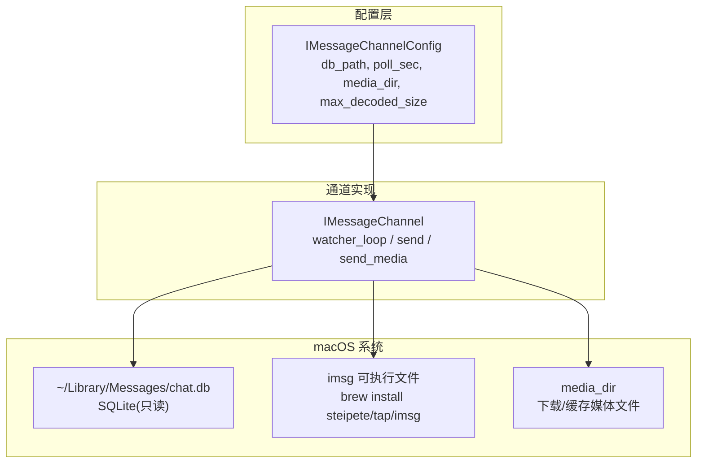
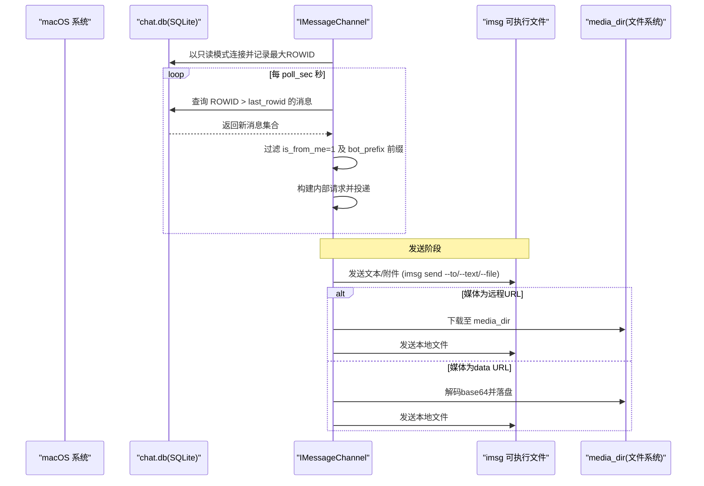
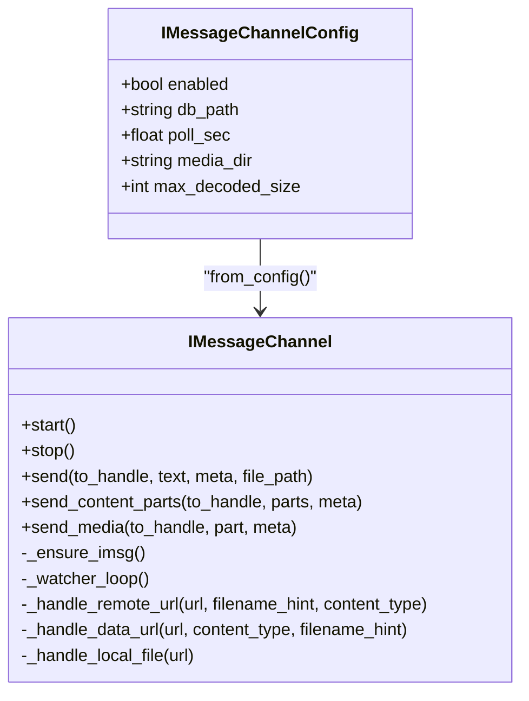

# iMessage 渠道配置

<cite>
**本文引用的文件**
- [config.py](file://src/qwenpaw/config/config.py)
- [channel.py](file://src/qwenpaw/app/channels/imessage/channel.py)
- [test_imessage.py](file://tests/unit/channels/test_imessage.py)
</cite>

## 目录
1. [简介](#简介)
2. [项目结构](#项目结构)
3. [核心组件](#核心组件)
4. [架构总览](#架构总览)
5. [详细组件分析](#详细组件分析)
6. [依赖关系分析](#依赖关系分析)
7. [性能考虑](#性能考虑)
8. [故障排除指南](#故障排除指南)
9. [结论](#结论)
10. [附录：完整配置示例](#附录完整配置示例)

## 简介
本文件面向在 macOS 系统上启用 iMessage 渠道的用户与运维人员，提供从部署前置条件、权限与沙箱注意事项，到数据库路径、轮询间隔、机器人前缀等关键配置的详细说明；同时覆盖消息格式支持与限制、发送流程、错误处理、性能优化建议以及常见问题排查。

## 项目结构
iMessage 渠道由配置模型与通道实现两部分组成：
- 配置模型定义于配置模块中，包含 iMessage 专属字段（如数据库路径、轮询间隔、媒体目录、Base64 解码大小上限等）。
- 通道实现位于 channels/imessage 包内，负责读取本地 SQLite 数据库进行消息轮询、调用外部二进制 imsg 发送消息、处理文本与媒体内容。



图表来源
- [config.py:219-226](file://src/qwenpaw/config/config.py#L219-L226)
- [channel.py:39-106](file://src/qwenpaw/app/channels/imessage/channel.py#L39-L106)
- [channel.py:185-196](file://src/qwenpaw/app/channels/imessage/channel.py#L185-L196)
- [channel.py:236-308](file://src/qwenpaw/app/channels/imessage/channel.py#L236-L308)

章节来源
- [config.py:197-226](file://src/qwenpaw/config/config.py#L197-L226)
- [channel.py:39-106](file://src/qwenpaw/app/channels/imessage/channel.py#L39-L106)

## 核心组件
- IMessageChannelConfig：iMessage 渠道的配置模型，继承通用渠道基类，提供 db_path、poll_sec、media_dir、max_decoded_size 等字段。
- IMessageChannel：iMessage 通道实现，负责：
  - 启动时查找并校验 imsg 可执行文件
  - 以只读方式连接 chat.db，按 ROWID 增量轮询新消息
  - 将用户消息转换为内部请求并投递给处理管线
  - 通过 imsg 发送文本与媒体文件
  - 支持 Base64 data URL、HTTP/HTTPS 远程地址、本地文件路径三种媒体来源，并进行大小限制与文件名安全处理

章节来源
- [config.py:219-226](file://src/qwenpaw/config/config.py#L219-L226)
- [channel.py:39-106](file://src/qwenpaw/app/channels/imessage/channel.py#L39-L106)
- [channel.py:185-196](file://src/qwenpaw/app/channels/imessage/channel.py#L185-L196)
- [channel.py:236-308](file://src/qwenpaw/app/channels/imessage/channel.py#L236-L308)
- [channel.py:382-471](file://src/qwenpaw/app/channels/imessage/channel.py#L382-L471)
- [channel.py:675-725](file://src/qwenpaw/app/channels/imessage/channel.py#L675-L725)

## 架构总览
iMessage 渠道采用“本地数据库轮询 + 外部工具发送”的轻量架构：
- 读取：以只读模式打开 chat.db，查询 message 表的新增行，过滤自身消息与机器人前缀，提取 sender 与文本内容。
- 发送：通过 imsg CLI 工具向目标联系人发送文本或附件。
- 媒体：支持本地文件、HTTP/HTTPS 链接与 base64 data URL，统一下载到 media_dir 后作为附件发送。



图表来源
- [channel.py:236-308](file://src/qwenpaw/app/channels/imessage/channel.py#L236-L308)
- [channel.py:198-229](file://src/qwenpaw/app/channels/imessage/channel.py#L198-L229)
- [channel.py:571-594](file://src/qwenpaw/app/channels/imessage/channel.py#L571-L594)
- [channel.py:596-673](file://src/qwenpaw/app/channels/imessage/channel.py#L596-L673)

## 详细组件分析

### 部署要求与前置条件
- 操作系统：macOS（依赖 macOS 的 iMessage 数据库位置与 imsg 工具）
- 外部依赖：安装 imsg 可执行文件（通过 Homebrew tap），并确保 PATH 可找到该命令
- 数据库访问：以只读方式访问 ~/Library/Messages/chat.db
- 媒体目录：自动创建或指定 media_dir，用于存放下载的媒体文件

章节来源
- [channel.py:185-196](file://src/qwenpaw/app/channels/imessage/channel.py#L185-L196)
- [channel.py:236-244](file://src/qwenpaw/app/channels/imessage/channel.py#L236-L244)
- [channel.py:88-99](file://src/qwenpaw/app/channels/imessage/channel.py#L88-L99)

### 权限要求与沙箱访问
- 数据库权限：需要当前运行用户对 ~/Library/Messages/chat.db 具备只读权限
- 文件系统权限：对 media_dir 具备读写权限（创建目录、写入下载文件）
- 进程权限：需要能执行 imsg 二进制文件（PATH 可达）
- 沙箱注意：若应用受沙箱限制，需确保允许访问上述路径与可执行文件；否则会出现找不到 imsg 或无法读写媒体目录的错误

章节来源
- [channel.py:185-196](file://src/qwenpaw/app/channels/imessage/channel.py#L185-L196)
- [channel.py:236-244](file://src/qwenpaw/app/channels/imessage/channel.py#L236-L244)
- [channel.py:88-99](file://src/qwenpaw/app/channels/imessage/channel.py#L88-L99)

### 配置项详解
- 数据库路径 db_path
  - 默认值指向 macOS 标准 iMessage 数据库路径
  - 支持 ~ 展开为用户主目录
  - 必须存在且可读
- 轮询间隔 poll_sec
  - 控制 watcher 线程每次查询后的休眠时间（秒）
  - 越小响应越快，但会增加数据库 I/O 压力
- 机器人前缀 bot_prefix
  - 用于过滤自身发出的消息，避免回环
  - 匹配消息开头的前缀字符串
- 媒体目录 media_dir
  - 未设置时根据工作空间或默认目录生成
  - 用于保存远程下载与 base64 解码后的媒体文件
- Base64 解码大小上限 max_decoded_size
  - 防止过大数据导致内存占用过高
  - 默认 10MB，可按需调整

章节来源
- [config.py:219-226](file://src/qwenpaw/config/config.py#L219-L226)
- [channel.py:84-102](file://src/qwenpaw/app/channels/imessage/channel.py#L84-L102)
- [channel.py:269-271](file://src/qwenpaw/app/channels/imessage/channel.py#L269-L271)
- [channel.py:615-651](file://src/qwenpaw/app/channels/imessage/channel.py#L615-L651)

### 消息格式支持与限制
- 输入（接收）
  - 仅支持纯文本消息
  - 忽略来自自身的消息（is_from_me=1）
  - 忽略以 bot_prefix 开头的消息
  - 不支持群组聊天（代码注释说明）
- 输出（发送）
  - 文本：直接通过 imsg 发送
  - 媒体：图片、视频、音频、文件均支持，先解析为本地文件再发送
  - 媒体来源：
    - HTTP/HTTPS 远程地址：下载到 media_dir
    - data URL（base64）：解码并落盘，受 max_decoded_size 限制
    - 本地文件路径：直接使用
  - 失败降级：当媒体发送失败时，会尝试发送文本占位提示

章节来源
- [channel.py:267-275](file://src/qwenpaw/app/channels/imessage/channel.py#L267-L275)
- [channel.py:393-471](file://src/qwenpaw/app/channels/imessage/channel.py#L393-L471)
- [channel.py:571-594](file://src/qwenpaw/app/channels/imessage/channel.py#L571-L594)
- [channel.py:596-673](file://src/qwenpaw/app/channels/imessage/channel.py#L596-L673)
- [channel.py:675-725](file://src/qwenpaw/app/channels/imessage/channel.py#L675-L725)

### 健康检查与生命周期
- start：检查 imsg 是否存在，启动 watcher 线程
- stop：停止 watcher 线程
- health_check：返回 channel 状态与健康信息（是否启用、线程是否存活、imsg 路径是否就绪）

章节来源
- [channel.py:362-381](file://src/qwenpaw/app/channels/imessage/channel.py#L362-L381)
- [channel.py:336-360](file://src/qwenpaw/app/channels/imessage/channel.py#L336-L360)

### 流程图：媒体发送逻辑
```mermaid
flowchart TD
Start(["进入 send_media"]) --> Extract["提取 URL/文件名提示/类型"]
Extract --> HasURL{"是否有 URL?"}
HasURL --> |否| WarnNoURL["记录警告并返回"]
HasURL --> |是| TypeCheck{"URL 类型"}
TypeCheck --> |http(s)| Download["下载至 media_dir"]
TypeCheck --> |data| Decode["base64 解码并落盘"]
TypeCheck --> |本地路径| UseLocal["使用本地文件"]
Download --> Exists{"文件存在?"}
Decode --> Exists
UseLocal --> Exists
Exists --> |是| SendFile["通过 imsg 发送文件"]
Exists --> |否| WarnPath["记录警告并返回"]
SendFile --> End(["结束"])
WarnNoURL --> End
WarnPath --> End
```

图表来源
- [channel.py:675-725](file://src/qwenpaw/app/channels/imessage/channel.py#L675-L725)
- [channel.py:571-594](file://src/qwenpaw/app/channels/imessage/channel.py#L571-L594)
- [channel.py:596-673](file://src/qwenpaw/app/channels/imessage/channel.py#L596-L673)

## 依赖关系分析
- 配置到实现的映射
  - IMessageChannelConfig 字段被 IMessageChannel.from_config 读取并构造实例
- 运行时依赖
  - imsg 可执行文件：通过 shutil.which("imsg") 检测
  - SQLite 数据库：以只读 URI 模式连接
  - 文件系统：media_dir 的创建与文件写入
- 测试验证
  - 单元测试覆盖了初始化、工厂方法、生命周期、发送与媒体处理等关键路径



图表来源
- [config.py:219-226](file://src/qwenpaw/config/config.py#L219-L226)
- [channel.py:147-183](file://src/qwenpaw/app/channels/imessage/channel.py#L147-L183)
- [channel.py:362-381](file://src/qwenpaw/app/channels/imessage/channel.py#L362-L381)
- [channel.py:382-471](file://src/qwenpaw/app/channels/imessage/channel.py#L382-L471)
- [channel.py:571-673](file://src/qwenpaw/app/channels/imessage/channel.py#L571-L673)

章节来源
- [test_imessage.py:194-292](file://tests/unit/channels/test_imessage.py#L194-L292)
- [test_imessage.py:467-539](file://tests/unit/channels/test_imessage.py#L467-L539)

## 性能考虑
- 轮询间隔 poll_sec
  - 较小值提升实时性，但增加数据库查询频率与 CPU/IO 开销
  - 建议根据消息量与系统负载调优，典型范围 0.5~5 秒
- 媒体处理
  - 远程下载与 base64 解码会产生磁盘 I/O 与内存占用
  - 合理设置 max_decoded_size，避免大文件导致内存峰值
- 线程与并发
  - watcher 为单线程循环，避免并发写冲突
  - 发送操作通过异步封装调用同步子进程，减少阻塞主循环

章节来源
- [channel.py:236-308](file://src/qwenpaw/app/channels/imessage/channel.py#L236-L308)
- [channel.py:615-651](file://src/qwenpaw/app/channels/imessage/channel.py#L615-L651)

## 故障排除指南
- 找不到 imsg 可执行文件
  - 现象：启动时报错提示无法找到 imsg
  - 解决：安装 imsg 并确保 PATH 包含其路径
- 数据库不可读
  - 现象：watcher 无法连接或查询失败
  - 解决：确认 chat.db 存在且当前用户有只读权限
- 媒体发送失败
  - 现象：日志显示无法解析有效文件或下载失败
  - 解决：检查网络连通性与 URL 有效性；确认 media_dir 可写；对于 data URL，检查 base64 格式与大小限制
- 消息未被处理
  - 现象：收到消息但未触发处理
  - 解决：检查 bot_prefix 是否正确；确认消息非自身发出；确认 sender 不为空

章节来源
- [channel.py:185-196](file://src/qwenpaw/app/channels/imessage/channel.py#L185-L196)
- [channel.py:236-244](file://src/qwenpaw/app/channels/imessage/channel.py#L236-L244)
- [channel.py:571-594](file://src/qwenpaw/app/channels/imessage/channel.py#L571-L594)
- [channel.py:596-673](file://src/qwenpaw/app/channels/imessage/channel.py#L596-L673)
- [channel.py:267-275](file://src/qwenpaw/app/channels/imessage/channel.py#L267-L275)

## 结论
iMessage 渠道在 macOS 环境下通过本地数据库轮询与 imsg 工具实现了简洁可靠的收发能力。合理配置数据库路径、轮询间隔与媒体目录，并结合权限与沙箱策略，可获得稳定高效的体验。针对媒体发送与大数据场景，建议关注大小限制与 I/O 性能，必要时调整 poll_sec 与 max_decoded_size。

## 附录：完整配置示例
以下为 iMessage 渠道的典型配置键名与含义说明（具体数值请结合实际环境调整）：
- enabled: 是否启用渠道
- db_path: iMessage 数据库路径（默认 ~/Library/Messages/chat.db）
- poll_sec: 轮询间隔（秒）
- bot_prefix: 机器人消息前缀（用于过滤自身消息）
- media_dir: 媒体文件存储目录（可选）
- max_decoded_size: Base64 解码大小上限（字节，默认约 10MB）

章节来源
- [config.py:219-226](file://src/qwenpaw/config/config.py#L219-L226)
- [channel.py:84-102](file://src/qwenpaw/app/channels/imessage/channel.py#L84-L102)
- [channel.py:269-271](file://src/qwenpaw/app/channels/imessage/channel.py#L269-L271)
- [channel.py:615-651](file://src/qwenpaw/app/channels/imessage/channel.py#L615-L651)