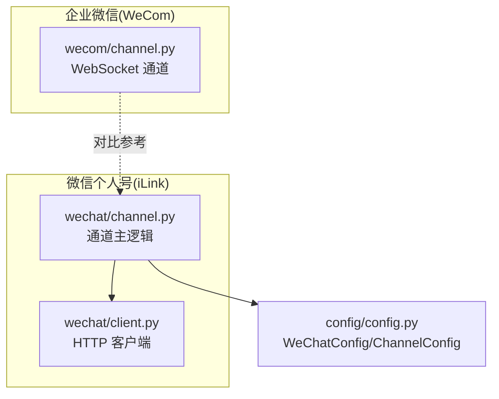
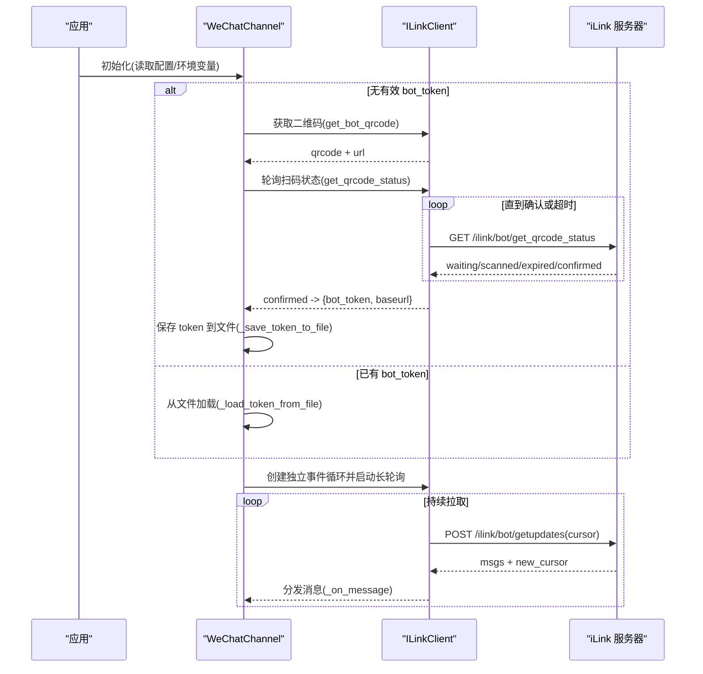
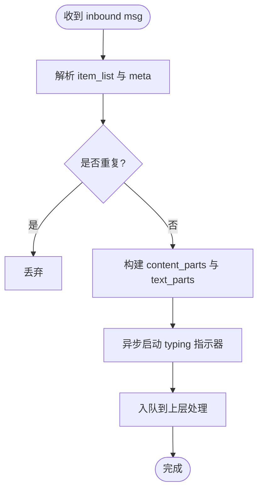
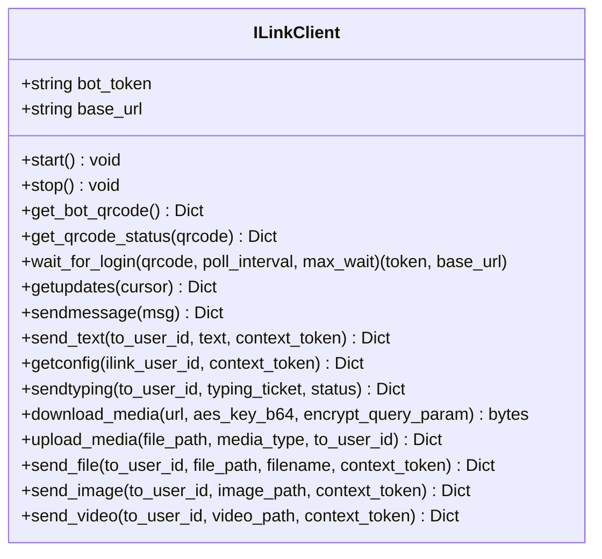
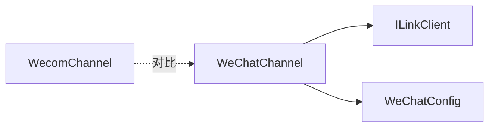

# 微信渠道配置

<cite>
**本文引用的文件**
- [src/qwenpaw/app/channels/wechat/channel.py](file://src/qwenpaw/app/channels/wechat/channel.py)
- [src/qwenpaw/app/channels/wechat/client.py](file://src/qwenpaw/app/channels/wechat/client.py)
- [src/qwenpaw/config/config.py](file://src/qwenpaw/config/config.py)
- [src/qwenpaw/app/channels/wecom/channel.py](file://src/qwenpaw/app/channels/wecom/channel.py)
</cite>

## 目录
1. [简介](#简介)
2. [项目结构](#项目结构)
3. [核心组件](#核心组件)
4. [架构总览](#架构总览)
5. [详细组件分析](#详细组件分析)
6. [依赖关系分析](#依赖关系分析)
7. [性能与稳定性](#性能与稳定性)
8. [故障排查与安全建议](#故障排查与安全建议)
9. [结论](#结论)
10. [附录：配置项与环境变量](#附录配置项与环境变量)

## 简介
本文件面向“微信个人号（iLink Bot）”渠道，提供从原理、部署到配置的完整说明。内容涵盖：
- iLink Bot 工作原理与长轮询收发机制
- bot_token 的生成、持久化与刷新策略
- base_url 自定义与媒体下载目录配置
- 二维码登录流程与异常处理
- 个人号接入要点
- 与企业号（WeCom）的差异对比
- 反封号与频率控制建议
- 常见错误与账号安全保护建议

## 项目结构
微信个人号（iLink Bot）相关代码位于 channels/wechat 子模块，包含通道主逻辑与 HTTP 客户端实现；企业号（WeCom）位于 channels/wecom 子模块，二者在认证方式、消息协议与能力上存在显著差异。

图表来源
- [src/qwenpaw/app/channels/wechat/channel.py:1-120](file://src/qwenpaw/app/channels/wechat/channel.py#L1-L120)
- [src/qwenpaw/app/channels/wechat/client.py:1-60](file://src/qwenpaw/app/channels/wechat/client.py#L1-L60)
- [src/qwenpaw/config/config.py:442-467](file://src/qwenpaw/config/config.py#L442-L467)
- [src/qwenpaw/app/channels/wecom/channel.py:1-130](file://src/qwenpaw/app/channels/wecom/channel.py#L1-L130)

章节来源
- [src/qwenpaw/app/channels/wechat/channel.py:1-120](file://src/qwenpaw/app/channels/wechat/channel.py#L1-L120)
- [src/qwenpaw/app/channels/wechat/client.py:1-60](file://src/qwenpaw/app/channels/wechat/client.py#L1-L60)
- [src/qwenpaw/config/config.py:442-467](file://src/qwenpaw/config/config.py#L442-L467)
- [src/qwenpaw/app/channels/wecom/channel.py:1-130](file://src/qwenpaw/app/channels/wecom/channel.py#L1-L130)

## 核心组件
- WeChatChannel（通道主逻辑）
  - 负责长轮询拉取消息、解析多类型内容（文本/图片/语音/文件/视频）、去重、打字指示器、上下文 token 缓存、消息合并发送等。
- ILinkClient（HTTP 客户端）
  - 封装 iLink Bot API 调用：获取二维码、轮询扫码状态、长轮询 getupdates、发送消息、上传/下载媒体等。
- WeChatConfig（配置模型）
  - 定义 bot_token、bot_token_file、base_url、media_dir、message_merge_enabled/delay_ms 等字段。

章节来源
- [src/qwenpaw/app/channels/wechat/channel.py:64-176](file://src/qwenpaw/app/channels/wechat/channel.py#L64-L176)
- [src/qwenpaw/app/channels/wechat/client.py:46-78](file://src/qwenpaw/app/channels/wechat/client.py#L46-L78)
- [src/qwenpaw/config/config.py:442-467](file://src/qwenpaw/config/config.py#L442-L467)

## 架构总览
微信个人号采用“HTTP + JSON”协议，通过长轮询接收消息，使用 Bearer Token 鉴权。启动时若未检测到本地 token，则触发二维码登录流程，成功后将 token 持久化到文件，后续启动直接加载。

图表来源
- [src/qwenpaw/app/channels/wechat/channel.py:486-526](file://src/qwenpaw/app/channels/wechat/channel.py#L486-L526)
- [src/qwenpaw/app/channels/wechat/client.py:134-200](file://src/qwenpaw/app/channels/wechat/client.py#L134-L200)
- [src/qwenpaw/app/channels/wechat/channel.py:531-624](file://src/qwenpaw/app/channels/wechat/channel.py#L531-L624)

## 详细组件分析

### 组件一：WeChatChannel（通道主逻辑）
职责概览
- 会话标识：私聊 wechat:<from_user_id>，群聊 wechat:group:<group_id>
- 消息去重：基于 context_token/msg_id 与内容哈希短时窗口去重
- 媒体下载：统一入口 _download_media，落盘至 media_dir
- 发送路径：文本分片发送，媒体走 upload_media + sendmessage
- 打字指示器：收到消息即开始，结束回复后停止
- 上下文 token 缓存：按用户持久化，支持主动推送（心跳/定时任务）
- 消息合并：缓解 iLink “10条消息 context_token 限制”，可全量合并或延时合并

关键流程
- 长轮询线程：独立事件循环 + 指数退避重试
- 入站消息处理：解析 item_list，提取文本/图片/语音/文件/视频，处理引用消息
- 出站消息：文本拼接前缀，分片发送；媒体立即发送；支持拒绝消息

图表来源
- [src/qwenpaw/app/channels/wechat/channel.py:629-911](file://src/qwenpaw/app/channels/wechat/channel.py#L629-L911)

章节来源
- [src/qwenpaw/app/channels/wechat/channel.py:64-176](file://src/qwenpaw/app/channels/wechat/channel.py#L64-L176)
- [src/qwenpaw/app/channels/wechat/channel.py:531-624](file://src/qwenpaw/app/channels/wechat/channel.py#L531-L624)
- [src/qwenpaw/app/channels/wechat/channel.py:629-911](file://src/qwenpaw/app/channels/wechat/channel.py#L629-L911)
- [src/qwenpaw/app/channels/wechat/channel.py:1048-1083](file://src/qwenpaw/app/channels/wechat/channel.py#L1048-L1083)
- [src/qwenpaw/app/channels/wechat/channel.py:1235-1354](file://src/qwenpaw/app/channels/wechat/channel.py#L1235-L1354)
- [src/qwenpaw/app/channels/wechat/channel.py:1355-1468](file://src/qwenpaw/app/channels/wechat/channel.py#L1355-L1468)
- [src/qwenpaw/app/channels/wechat/channel.py:1469-1503](file://src/qwenpaw/app/channels/wechat/channel.py#L1469-L1503)
- [src/qwenpaw/app/channels/wechat/channel.py:1504-1536](file://src/qwenpaw/app/channels/wechat/channel.py#L1504-L1536)

### 组件二：ILinkClient（HTTP 客户端）
职责概览
- 认证：Bearer Token 注入请求头
- 二维码登录：get_bot_qrcode + get_qrcode_status + wait_for_login
- 消息收发：getupdates（长轮询）、sendmessage/send_text
- 媒体：download_media（CDN 下载+可选解密）、upload_media（加密上传+返回参数）
- 辅助：getconfig（获取 typing_ticket）、sendtyping（打字指示器）

图表来源
- [src/qwenpaw/app/channels/wechat/client.py:46-78](file://src/qwenpaw/app/channels/wechat/client.py#L46-L78)
- [src/qwenpaw/app/channels/wechat/client.py:134-200](file://src/qwenpaw/app/channels/wechat/client.py#L134-L200)
- [src/qwenpaw/app/channels/wechat/client.py:205-247](file://src/qwenpaw/app/channels/wechat/client.py#L205-L247)
- [src/qwenpaw/app/channels/wechat/client.py:276-334](file://src/qwenpaw/app/channels/wechat/client.py#L276-L334)
- [src/qwenpaw/app/channels/wechat/client.py:339-386](file://src/qwenpaw/app/channels/wechat/client.py#L339-L386)
- [src/qwenpaw/app/channels/wechat/client.py:387-576](file://src/qwenpaw/app/channels/wechat/client.py#L387-L576)
- [src/qwenpaw/app/channels/wechat/client.py:577-725](file://src/qwenpaw/app/channels/wechat/client.py#L577-L725)

章节来源
- [src/qwenpaw/app/channels/wechat/client.py:1-78](file://src/qwenpaw/app/channels/wechat/client.py#L1-L78)
- [src/qwenpaw/app/channels/wechat/client.py:134-200](file://src/qwenpaw/app/channels/wechat/client.py#L134-L200)
- [src/qwenpaw/app/channels/wechat/client.py:205-247](file://src/qwenpaw/app/channels/wechat/client.py#L205-L247)
- [src/qwenpaw/app/channels/wechat/client.py:276-334](file://src/qwenpaw/app/channels/wechat/client.py#L276-L334)
- [src/qwenpaw/app/channels/wechat/client.py:339-386](file://src/qwenpaw/app/channels/wechat/client.py#L339-L386)
- [src/qwenpaw/app/channels/wechat/client.py:387-576](file://src/qwenpaw/app/channels/wechat/client.py#L387-L576)
- [src/qwenpaw/app/channels/wechat/client.py:577-725](file://src/qwenpaw/app/channels/wechat/client.py#L577-L725)

### 组件三：WeChatConfig（配置模型）
关键字段
- bot_token：登录后获得的 Bearer Token
- bot_token_file：Token 持久化路径（默认工作目录下）
- base_url：iLink API 基础地址（留空使用默认）
- media_dir：媒体下载目录（支持 workspace 隔离）
- message_merge_enabled / message_merge_delay_ms：消息合并开关与时延

章节来源
- [src/qwenpaw/config/config.py:442-467](file://src/qwenpaw/config/config.py#L442-L467)

## 依赖关系分析
- WeChatChannel 依赖 ILinkClient 进行网络交互
- WeChatChannel 从配置模型 WeChatConfig 读取参数
- WeComChannel 作为企业号对照实现，用于对比差异

图表来源
- [src/qwenpaw/app/channels/wechat/channel.py:1-120](file://src/qwenpaw/app/channels/wechat/channel.py#L1-L120)
- [src/qwenpaw/app/channels/wechat/client.py:1-60](file://src/qwenpaw/app/channels/wechat/client.py#L1-L60)
- [src/qwenpaw/config/config.py:442-467](file://src/qwenpaw/config/config.py#L442-L467)
- [src/qwenpaw/app/channels/wecom/channel.py:1-130](file://src/qwenpaw/app/channels/wecom/channel.py#L1-L130)

章节来源
- [src/qwenpaw/app/channels/wechat/channel.py:1-120](file://src/qwenpaw/app/channels/wechat/channel.py#L1-L120)
- [src/qwenpaw/app/channels/wechat/client.py:1-60](file://src/qwenpaw/app/channels/wechat/client.py#L1-L60)
- [src/qwenpaw/config/config.py:442-467](file://src/qwenpaw/config/config.py#L442-L467)
- [src/qwenpaw/app/channels/wecom/channel.py:1-130](file://src/qwenpaw/app/channels/wecom/channel.py#L1-L130)

## 性能与稳定性
- 长轮询与退避：连续失败采用指数退避，上限固定，避免雪崩
- 去重策略：基于 context_token/msg_id 与内容哈希短时窗口，降低重复处理
- 打字指示器：收到消息即开始，减少用户等待感知
- 消息合并：缓解 iLink 单会话上下文消息数量限制，可按需开启延时合并
- 媒体处理：统一下载与命名规则，避免文件名冲突

章节来源
- [src/qwenpaw/app/channels/wechat/channel.py:531-624](file://src/qwenpaw/app/channels/wechat/channel.py#L531-L624)
- [src/qwenpaw/app/channels/wechat/channel.py:453-481](file://src/qwenpaw/app/channels/wechat/channel.py#L453-L481)
- [src/qwenpaw/app/channels/wechat/channel.py:1235-1354](file://src/qwenpaw/app/channels/wechat/channel.py#L1235-L1354)

## 故障排查与安全建议

### 常见问题
- 二维码过期：轮询返回 expired，需重新发起登录
- 未扫描超时：超过最大等待时间仍未确认
- 发送被拒：ret/errcode 非零，需检查上下文 token 有效性
- 媒体无法下载：缺少 URL 或加密参数，检查 CDN 链接与 aes_key
- 上下文 token 失效：服务端返回特定错误码，应跳过后续发送并提示

章节来源
- [src/qwenpaw/app/channels/wechat/client.py:157-200](file://src/qwenpaw/app/channels/wechat/client.py#L157-L200)
- [src/qwenpaw/app/channels/wechat/channel.py:1088-1139](file://src/qwenpaw/app/channels/wechat/channel.py#L1088-L1139)
- [src/qwenpaw/app/channels/wechat/channel.py:1140-1226](file://src/qwenpaw/app/channels/wechat/channel.py#L1140-L1226)
- [src/qwenpaw/app/channels/wechat/channel.py:1048-1083](file://src/qwenpaw/app/channels/wechat/channel.py#L1048-L1083)

### 账号安全与反封号建议
- 控制发送频率：合理设置消息合并与延时，避免短时间内大量消息
- 避免敏感操作：不要频繁切换设备或异地登录
- 谨慎使用自动化：结合业务场景设置活跃时段与限流
- 妥善保管 token：仅保存在受控路径，定期轮换
- 监控异常：关注 ret/errcode 与超时日志，及时告警

[本节为通用建议，不直接分析具体文件]

## 结论
微信个人号（iLink Bot）通过 HTTP 长轮询与 Bearer Token 鉴权，具备完善的二维码登录、媒体收发与消息合并能力。配合合理的频率控制与安全防护策略，可在保障稳定性的同时降低风险。与企业号（WeCom）相比，个人号更侧重便捷性与灵活性，而企业号强调组织内可控与合规。

[本节为总结性内容，不直接分析具体文件]

## 附录：配置项与环境变量

### 配置项（WeChatConfig）
- bot_token：登录后获得的 Bearer Token
- bot_token_file：Token 持久化路径（默认工作目录下）
- base_url：iLink API 基础地址（留空使用默认）
- media_dir：媒体下载目录（支持 workspace 隔离）
- message_merge_enabled：是否启用消息合并
- message_merge_delay_ms：合并延时（毫秒），0 表示全量合并

章节来源
- [src/qwenpaw/config/config.py:442-467](file://src/qwenpaw/config/config.py#L442-L467)

### 环境变量（WeChatChannel.from_env）
- WECHAT_CHANNEL_ENABLED：是否启用
- WECHAT_BOT_TOKEN：Bot Token
- WECHAT_BOT_TOKEN_FILE：Token 文件路径
- WECHAT_BASE_URL：API Base URL
- WECHAT_BOT_PREFIX：消息前缀
- WECHAT_MEDIA_DIR：媒体目录
- WECHAT_DM_POLICY / WECHAT_GROUP_POLICY：访问策略
- WECHAT_ALLOW_FROM：允许列表
- WECHAT_DENY_MESSAGE：拒绝提示

章节来源
- [src/qwenpaw/app/channels/wechat/channel.py:222-246](file://src/qwenpaw/app/channels/wechat/channel.py#L222-L246)

### 二维码登录与 token 刷新
- 首次启动若无 token，自动触发二维码登录
- 成功登录后写入 bot_token_file，下次启动直接加载
- 若服务端返回 baseurl，会同步更新当前 base_url

章节来源
- [src/qwenpaw/app/channels/wechat/channel.py:486-526](file://src/qwenpaw/app/channels/wechat/channel.py#L486-L526)
- [src/qwenpaw/app/channels/wechat/client.py:157-200](file://src/qwenpaw/app/channels/wechat/client.py#L157-L200)

### 个人号与企业号差异
- 个人号（iLink）：HTTP/JSON，长轮询，Bearer Token，二维码登录
- 企业号（WeCom）：WebSocket SDK，bot_id + secret，卡片与流式能力更强

章节来源
- [src/qwenpaw/app/channels/wechat/channel.py:1-15](file://src/qwenpaw/app/channels/wechat/channel.py#L1-L15)
- [src/qwenpaw/app/channels/wecom/channel.py:1-15](file://src/qwenpaw/app/channels/wecom/channel.py#L1-L15)