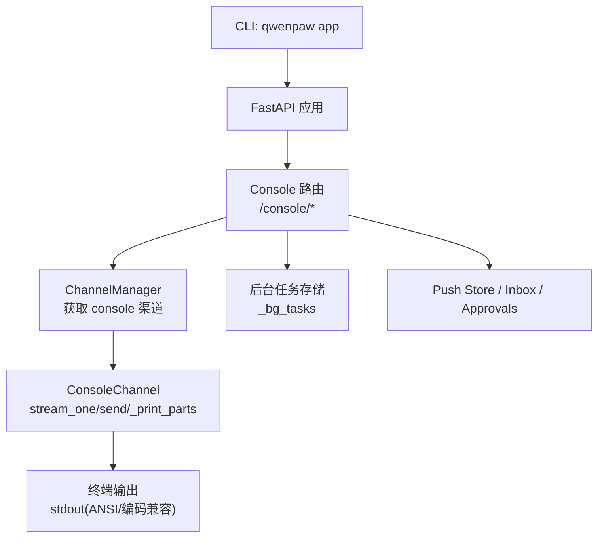
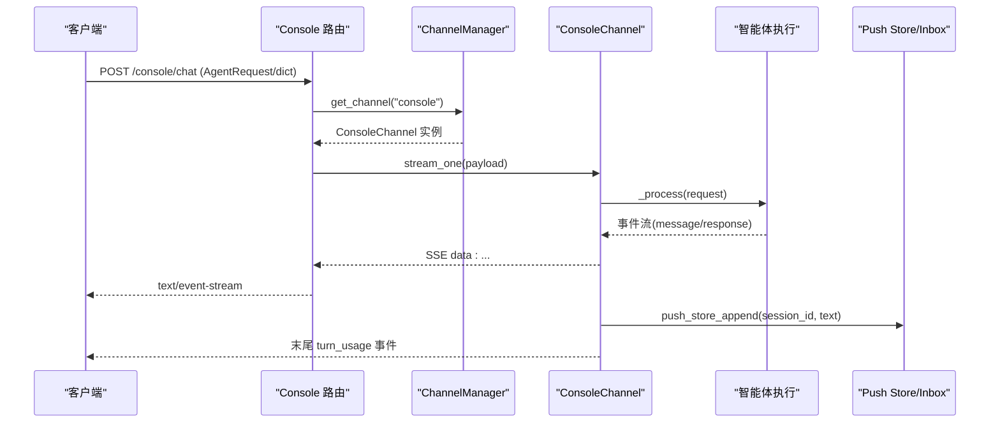
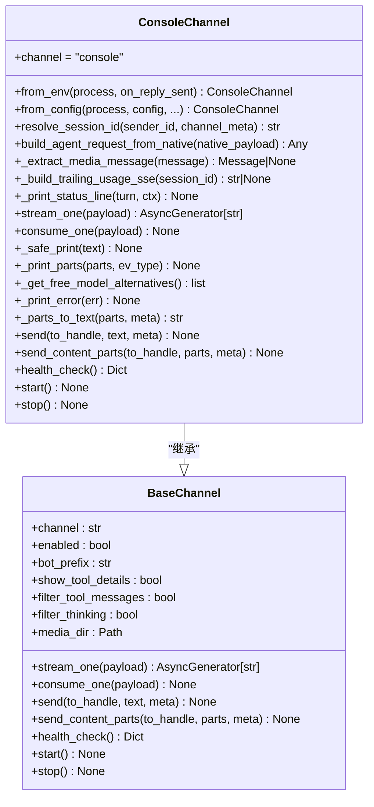
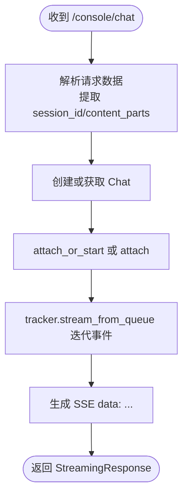
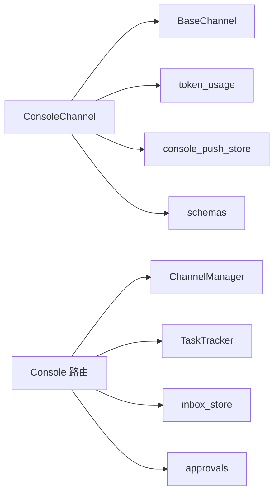

# 控制台渠道配置

<cite>
**本文引用的文件**   
- [src/qwenpaw/app/channels/console/channel.py](file://src/qwenpaw/app/channels/console/channel.py)
- [src/qwenpaw/config/config.py](file://src/qwenpaw/config/config.py)
- [src/qwenpaw/app/routers/console.py](file://src/qwenpaw/app/routers/console.py)
- [src/qwenpaw/cli/app_cmd.py](file://src/qwenpaw/cli/app_cmd.py)
- [tests/unit/channels/test_console.py](file://tests/unit/channels/test_console.py)
- [tests/integration/test_channels_config.py](file://tests/integration/test_channels_config.py)
</cite>

## 目录
1. [简介](#简介)
2. [项目结构](#项目结构)
3. [核心组件](#核心组件)
4. [架构总览](#架构总览)
5. [详细组件分析](#详细组件分析)
6. [依赖关系分析](#依赖关系分析)
7. [性能与资源优化](#性能与资源优化)
8. [故障排查指南](#故障排查指南)
9. [结论](#结论)
10. [附录：命令行交互与参数](#附录命令行交互与参数)

## 简介
控制台渠道（Console Channel）是 QwenPaw 的本地调试与测试工具，负责将智能体响应以结构化、易读的方式输出到终端，并通过 HTTP API 提供聊天、推送消息、后台任务等能力。它专注于“输出侧”的展示与格式化，输入由 /api/console/chat 接口统一接入。

主要特性包括：
- 机器人前缀可定制，便于区分多实例或多会话
- 支持图片/视频/音频/文件等多媒体内容在终端友好显示
- 支持 SSE 流式输出、断线重连与停止运行中的对话
- 支持后台异步任务提交与状态查询
- 提供后端日志尾部读取、待处理审批与收件箱事件查看等调试能力

## 项目结构
控制台渠道涉及的核心代码位于以下位置：
- 渠道实现：src/qwenpaw/app/channels/console/channel.py
- 渠道配置模型：src/qwenpaw/config/config.py
- Console HTTP 路由：src/qwenpaw/app/routers/console.py
- CLI 启动命令（含日志级别控制）：src/qwenpaw/cli/app_cmd.py
- 单元测试与集成测试：tests/unit/channels/test_console.py、tests/integration/test_channels_config.py

图表来源
- [src/qwenpaw/app/routers/console.py:181-270](file://src/qwenpaw/app/routers/console.py#L181-L270)
- [src/qwenpaw/app/channels/console/channel.py:371-512](file://src/qwenpaw/app/channels/console/channel.py#L371-L512)
- [src/qwenpaw/cli/app_cmd.py:52-150](file://src/qwenpaw/cli/app_cmd.py#L52-L150)

章节来源
- [src/qwenpaw/app/channels/console/channel.py:64-110](file://src/qwenpaw/app/channels/console/channel.py#L64-L110)
- [src/qwenpaw/config/config.py:324-329](file://src/qwenpaw/config/config.py#L324-L329)
- [src/qwenpaw/app/routers/console.py:1-60](file://src/qwenpaw/app/routers/console.py#L1-L60)
- [src/qwenpaw/cli/app_cmd.py:52-150](file://src/qwenpaw/cli/app_cmd.py#L52-L150)

## 核心组件
- ConsoleChannel：控制台渠道实现，负责将智能体事件转换为终端可读输出，并维护媒体目录、会话 ID 解析、SSE 事件生成与错误提示。
- ConsoleConfig：控制台渠道的配置模型，包含 enabled、media_dir 等字段。
- Console 路由：提供 /console/chat、/console/chat/stop、/console/upload、/console/debug/backend-logs、/console/push-messages、/console/inbox/* 等接口。
- CLI app 命令：提供 --host、--port、--log-level、--hide-access-paths 等选项，用于启动服务与日志控制。

章节来源
- [src/qwenpaw/app/channels/console/channel.py:64-110](file://src/qwenpaw/app/channels/console/channel.py#L64-L110)
- [src/qwenpaw/config/config.py:324-329](file://src/qwenpaw/config/config.py#L324-L329)
- [src/qwenpaw/app/routers/console.py:181-270](file://src/qwenpaw/app/routers/console.py#L181-L270)
- [src/qwenpaw/cli/app_cmd.py:52-150](file://src/qwenpaw/cli/app_cmd.py#L52-L150)

## 架构总览
控制台渠道作为“输出通道”，通过 FastAPI 路由接收请求，交由 ChannelManager 获取 ConsoleChannel 实例，再由 ConsoleChannel.stream_one 驱动智能体执行并将事件以 SSE 形式返回；同时把最终结果打印到终端，并在需要时写入 Push Store 供前端拉取。

图表来源
- [src/qwenpaw/app/routers/console.py:181-270](file://src/qwenpaw/app/routers/console.py#L181-L270)
- [src/qwenpaw/app/channels/console/channel.py:371-512](file://src/qwenpaw/app/channels/console/channel.py#L371-L512)

## 详细组件分析

### ConsoleChannel 类
职责与关键点：
- 初始化：保存 enabled、bot_prefix、workspace/media 目录，Windows 平台下对 stdout/stderr 进行 UTF-8 重配置以避免管道输出异常。
- 会话解析：resolve_session_id 优先使用 meta.session_id，否则回退为 console:<sender_id>。
- 构建请求：build_agent_request_from_native 将原生 payload 转为 AgentRequest，并注入 channel_meta/request_context。
- 流式处理：stream_one 将事件序列化为 SSE，完成时追加 turn_usage 统计，捕获配额超限异常并给出免费模型替代建议。
- 终端输出：_safe_print/_print_parts/_print_error 提供 ANSI 颜色与跨平台兼容输出。
- 主动发送：send/send_content_parts 支持定时任务或外部调用向控制台推送消息。
- 生命周期：health_check/start/stop 简单健康检查与启停日志。

图表来源
- [src/qwenpaw/app/channels/console/channel.py:64-703](file://src/qwenpaw/app/channels/console/channel.py#L64-L703)

章节来源
- [src/qwenpaw/app/channels/console/channel.py:78-136](file://src/qwenpaw/app/channels/console/channel.py#L78-L136)
- [src/qwenpaw/app/channels/console/channel.py:142-192](file://src/qwenpaw/app/channels/console/channel.py#L142-L192)
- [src/qwenpaw/app/channels/console/channel.py:194-281](file://src/qwenpaw/app/channels/console/channel.py#L194-L281)
- [src/qwenpaw/app/channels/console/channel.py:371-512](file://src/qwenpaw/app/channels/console/channel.py#L371-L512)
- [src/qwenpaw/app/channels/console/channel.py:516-634](file://src/qwenpaw/app/channels/console/channel.py#L516-L634)
- [src/qwenpaw/app/channels/console/channel.py:638-703](file://src/qwenpaw/app/channels/console/channel.py#L638-L703)

### Console 路由（HTTP 接口）
关键接口：
- POST /console/chat：流式聊天，支持 reconnect=true 重连；内部创建或附加任务队列，返回 SSE。
- POST /console/chat/stop：停止正在运行的对话，支持按 chat_id 或 session_id 停止。
- POST /console/upload：上传文件至 console 渠道的 media_dir，返回本地路径 URL。
- GET /console/debug/backend-logs：读取后端日志尾部，便于调试页面展示。
- GET /console/push-messages：拉取待推送消息与所有待审批请求。
- /console/inbox/*：收件箱事件列表、标记已读、删除事件与查看 trace。

图表来源
- [src/qwenpaw/app/routers/console.py:181-270](file://src/qwenpaw/app/routers/console.py#L181-L270)

章节来源
- [src/qwenpaw/app/routers/console.py:181-270](file://src/qwenpaw/app/routers/console.py#L181-L270)
- [src/qwenpaw/app/routers/console.py:273-319](file://src/qwenpaw/app/routers/console.py#L273-L319)
- [src/qwenpaw/app/routers/console.py:322-349](file://src/qwenpaw/app/routers/console.py#L322-L349)
- [src/qwenpaw/app/routers/console.py:352-385](file://src/qwenpaw/app/routers/console.py#L352-L385)
- [src/qwenpaw/app/routers/console.py:388-441](file://src/qwenpaw/app/routers/console.py#L388-L441)
- [src/qwenpaw/app/routers/console.py:444-505](file://src/qwenpaw/app/routers/console.py#L444-L505)
- [src/qwenpaw/app/routers/console.py:522-641](file://src/qwenpaw/app/routers/console.py#L522-L641)

### 配置与环境变量
- 配置模型 ConsoleConfig：
  - enabled：是否启用控制台渠道
  - media_dir：媒体目录路径（未设置时使用默认目录）
- 环境变量（from_env 工厂方法）：
  - CONSOLE_CHANNEL_ENABLED：是否启用（"1" 表示启用）
  - CONSOLE_BOT_PREFIX：机器人消息前缀
  - CONSOLE_MEDIA_DIR：媒体目录路径

注意：
- bot_prefix 也可通过 channel_meta.bot_prefix 覆盖，优先级高于构造时的默认值。
- 其他过滤开关（如 show_tool_details、filter_tool_messages、filter_thinking）由基类与 ChannelManager 从全局配置传入。

章节来源
- [src/qwenpaw/config/config.py:324-329](file://src/qwenpaw/config/config.py#L324-L329)
- [src/qwenpaw/app/channels/console/channel.py:142-192](file://src/qwenpaw/app/channels/console/channel.py#L142-L192)
- [src/qwenpaw/app/channels/console/channel.py:412-414](file://src/qwenpaw/app/channels/console/channel.py#L412-L414)

### 与其他渠道的差异与特殊功能
- 定位差异：Console 渠道专注本地调试与终端输出，不直接监听外部网络协议；输入统一经由 /console/chat 接口。
- 输出格式：内置 ANSI 彩色与图标化输出，自动识别文本、拒绝信息、图片/视频/音频/文件链接，并提供一行上下文用量摘要。
- 错误与限流：当触发模型配额限制时，会返回 rate_limited 事件并列出可用的免费模型替代项。
- 推送与审批：支持将消息推送到前端 store，并聚合所有待审批请求，便于在控制台 UI 中集中处理。

章节来源
- [src/qwenpaw/app/channels/console/channel.py:545-613](file://src/qwenpaw/app/channels/console/channel.py#L545-L613)
- [src/qwenpaw/app/channels/console/channel.py:492-507](file://src/qwenpaw/app/channels/console/channel.py#L492-L507)
- [src/qwenpaw/app/routers/console.py:388-441](file://src/qwenpaw/app/routers/console.py#L388-L441)

## 依赖关系分析
- ConsoleChannel 依赖：
  - BaseChannel：通用渠道行为（事件序列化、过滤、工作区访问等）
  - token_usage：回合用量统计与格式化
  - console_push_store：消息推送
  - schemas：消息类型、运行状态等
- Console 路由依赖：
  - workspace.channel_manager：获取具体渠道实例
  - workspace.task_tracker：管理任务队列与流式传输
  - inbox_store/approvals：收件箱与审批相关

图表来源
- [src/qwenpaw/app/channels/console/channel.py:23-46](file://src/qwenpaw/app/channels/console/channel.py#L23-L46)
- [src/qwenpaw/app/routers/console.py:1-35](file://src/qwenpaw/app/routers/console.py#L1-L35)

章节来源
- [src/qwenpaw/app/channels/console/channel.py:23-46](file://src/qwenpaw/app/channels/console/channel.py#L23-L46)
- [src/qwenpaw/app/routers/console.py:1-35](file://src/qwenpaw/app/routers/console.py#L1-L35)

## 性能与资源优化
- 流式输出：通过 SSE 逐步返回事件，避免一次性加载大响应，降低内存峰值。
- 去抖合并：针对纯文本输入的去抖逻辑可减少重复请求与中间态输出。
- 用量统计：在流结束时汇总并输出一次性的 turn_usage 与上下文用量，减少频繁 IO。
- 安全输出：Windows 平台对 stdout 进行 UTF-8 重配置，避免管道输出失败导致的异常与重试开销。
- 后台任务：长耗时任务可通过 /console/chat/task 提交，避免阻塞主请求链路。

章节来源
- [src/qwenpaw/app/channels/console/channel.py:371-512](file://src/qwenpaw/app/channels/console/channel.py#L371-L512)
- [src/qwenpaw/app/channels/console/channel.py:126-136](file://src/qwenpaw/app/channels/console/channel.py#L126-L136)
- [src/qwenpaw/app/routers/console.py:522-641](file://src/qwenpaw/app/routers/console.py#L522-L641)

## 故障排查指南
常见问题与建议：
- 无法输出中文或乱码：确认 Windows 平台是否成功重配置 stdout/stderr 编码；必要时检查终端编码设置。
- 配额限制导致中断：关注 rate_limited 事件与终端错误提示，参考提供的免费模型替代项切换。
- 媒体文件无法打开：检查 media_dir 是否正确设置且存在，确保上传后返回的本地路径有效。
- 停止对话无效：若 chat_id 不是 UUID，尝试使用 session_id 调用 /console/chat/stop。
- 调试日志不足：使用 /console/debug/backend-logs 拉取后端日志尾部，结合 CLI 的 --log-level debug/trace 提升日志粒度。

章节来源
- [src/qwenpaw/app/channels/console/channel.py:126-136](file://src/qwenpaw/app/channels/console/channel.py#L126-L136)
- [src/qwenpaw/app/channels/console/channel.py:492-507](file://src/qwenpaw/app/channels/console/channel.py#L492-L507)
- [src/qwenpaw/app/routers/console.py:273-319](file://src/qwenpaw/app/routers/console.py#L273-L319)
- [src/qwenpaw/app/routers/console.py:352-385](file://src/qwenpaw/app/routers/console.py#L352-L385)

## 结论
控制台渠道为本地开发与测试提供了轻量、直观的输出能力，配合丰富的 HTTP 接口与调试工具，能够快速验证智能体行为、排查问题并监控资源使用情况。通过合理的配置与环境变量，可在不同环境灵活启用或关闭该渠道，并结合 CLI 日志级别与后台任务机制提升整体效率与稳定性。

## 附录：命令行交互与参数
- 启动命令：qwenpaw app
- 常用参数：
  - --host：绑定主机地址（默认 127.0.0.1）
  - --port：绑定端口（默认 8088）
  - --reload：开发模式自动重载
  - --log-level：日志级别（critical/error/warning/info/debug/trace）
  - --hide-access-paths：隐藏指定路径的访问日志片段（例如 /console/push-messages、/console/inbox/events）
- 环境变量（控制台渠道）：
  - CONSOLE_CHANNEL_ENABLED：是否启用（"1" 启用）
  - CONSOLE_BOT_PREFIX：机器人消息前缀
  - CONSOLE_MEDIA_DIR：媒体目录路径

章节来源
- [src/qwenpaw/cli/app_cmd.py:52-150](file://src/qwenpaw/cli/app_cmd.py#L52-L150)
- [src/qwenpaw/app/channels/console/channel.py:142-154](file://src/qwenpaw/app/channels/console/channel.py#L142-L154)