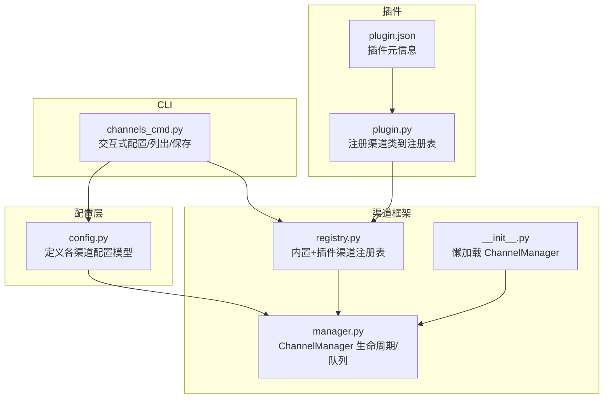
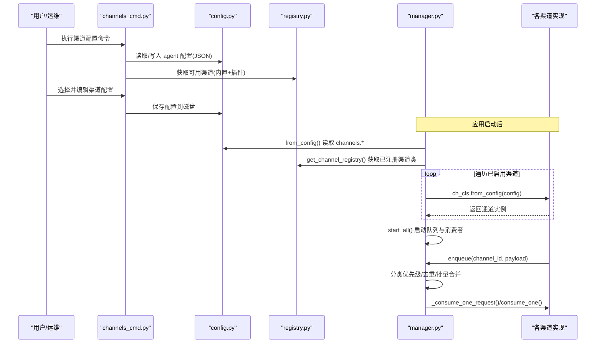
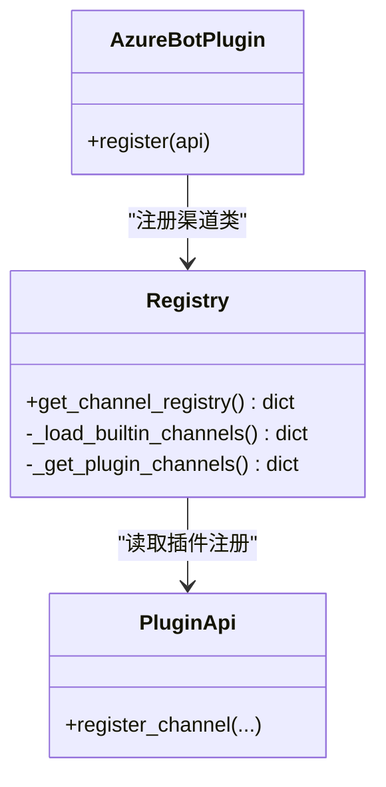
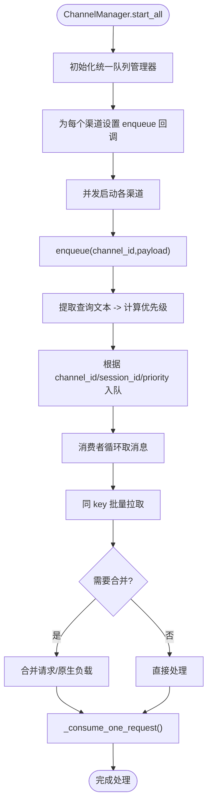
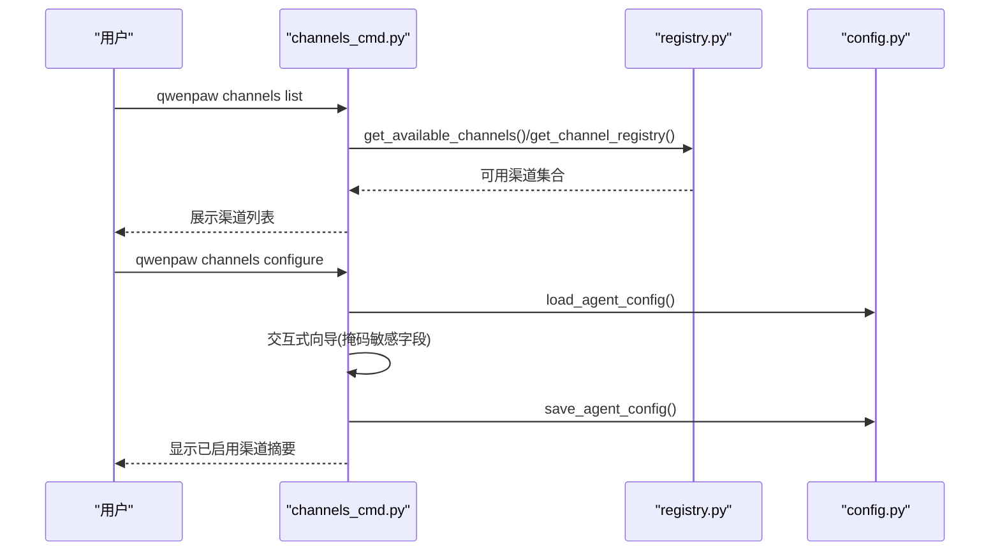
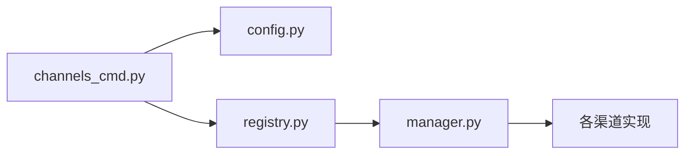

# 渠道概览与基础配置

<cite>
**本文引用的文件列表**
- [src/qwenpaw/app/channels/__init__.py](file://src/qwenpaw/app/channels/__init__.py)
- [src/qwenpaw/app/channels/manager.py](file://src/qwenpaw/app/channels/manager.py)
- [src/qwenpaw/app/channels/registry.py](file://src/qwenpaw/app/channels/registry.py)
- [src/qwenpaw/config/config.py](file://src/qwenpaw/config/config.py)
- [src/qwenpaw/cli/channels_cmd.py](file://src/qwenpaw/cli/channels_cmd.py)
- [plugins/channel/azure_bot/plugin.json](file://plugins/channel/azure_bot/plugin.json)
- [plugins/channel/azure_bot/plugin.py](file://plugins/channel/azure_bot/plugin.py)
</cite>

## 目录
1. [简介](#简介)
2. [项目结构](#项目结构)
3. [核心组件](#核心组件)
4. [架构总览](#架构总览)
5. [详细组件分析](#详细组件分析)
6. [依赖关系分析](#依赖关系分析)
7. [性能考量](#性能考量)
8. [故障排查指南](#故障排查指南)
9. [结论](#结论)
10. [附录](#附录)

## 简介
本文件面向 QwenPaw 的“渠道管理命令”与“渠道基础配置”，系统性介绍：
- 支持的即时通讯渠道（内置渠道与插件渠道）
- 渠道基本配置结构与通用字段
- 启用/禁用机制与动态加载原理
- 渠道配置的保存位置与文件格式
- 渠道注册机制与运行时装配流程
- 最佳实践与安全建议
- 常见配置问题排查方法

## 项目结构
围绕渠道能力，代码主要分布在以下模块：
- 配置模型与持久化：config.py
- 渠道注册与发现：app/channels/registry.py
- 渠道管理器与队列：app/channels/manager.py
- CLI 渠道管理命令：cli/channels_cmd.py
- 插件渠道示例：plugins/channel/azure_bot/*

图表来源
- [src/qwenpaw/config/config.py:197-500](file://src/qwenpaw/config/config.py#L197-L500)
- [src/qwenpaw/app/channels/registry.py:1-135](file://src/qwenpaw/app/channels/registry.py#L1-L135)
- [src/qwenpaw/app/channels/manager.py:1-228](file://src/qwenpaw/app/channels/manager.py#L1-L228)
- [src/qwenpaw/app/channels/__init__.py:1-14](file://src/qwenpaw/app/channels/__init__.py#L1-L14)
- [src/qwenpaw/cli/channels_cmd.py:1-120](file://src/qwenpaw/cli/channels_cmd.py#L1-L120)
- [plugins/channel/azure_bot/plugin.json:1-25](file://plugins/channel/azure_bot/plugin.json#L1-L25)
- [plugins/channel/azure_bot/plugin.py:1-314](file://plugins/channel/azure_bot/plugin.py#L1-L314)

章节来源
- [src/qwenpaw/config/config.py:197-500](file://src/qwenpaw/config/config.py#L197-L500)
- [src/qwenpaw/app/channels/registry.py:1-135](file://src/qwenpaw/app/channels/registry.py#L1-L135)
- [src/qwenpaw/app/channels/manager.py:1-228](file://src/qwenpaw/app/channels/manager.py#L1-L228)
- [src/qwenpaw/app/channels/__init__.py:1-14](file://src/qwenpaw/app/channels/__init__.py#L1-L14)
- [src/qwenpaw/cli/channels_cmd.py:1-120](file://src/qwenpaw/cli/channels_cmd.py#L1-L120)
- [plugins/channel/azure_bot/plugin.json:1-25](file://plugins/channel/azure_bot/plugin.json#L1-L25)
- [plugins/channel/azure_bot/plugin.py:1-314](file://plugins/channel/azure_bot/plugin.py#L1-L314)

## 核心组件
- 配置模型
  - BaseChannelConfig 提供所有渠道共享的通用字段，如 enabled、bot_prefix、访问控制策略等。
  - 各具体渠道（Discord、DingTalk、Feishu、Telegram、Slack、Voice、SIP、XiaoYi、Yuanbao、WeChat 等）在 config.py 中扩展各自专属字段。
- 渠道注册表
  - registry.py 维护内置渠道映射，并合并插件注册的渠道类。
- 渠道管理器
  - manager.py 负责从配置构建渠道实例、统一入队、消费处理、启停与热替换。
- CLI 渠道命令
  - channels_cmd.py 提供交互式配置向导、列出/显示/保存渠道配置的能力。
- 插件渠道
  - 通过 plugin.json 声明元数据，plugin.py 调用 API 将自定义渠道类注册到全局注册表。

章节来源
- [src/qwenpaw/config/config.py:197-500](file://src/qwenpaw/config/config.py#L197-L500)
- [src/qwenpaw/app/channels/registry.py:1-135](file://src/qwenpaw/app/channels/registry.py#L1-L135)
- [src/qwenpaw/app/channels/manager.py:1-228](file://src/qwenpaw/app/channels/manager.py#L1-L228)
- [src/qwenpaw/cli/channels_cmd.py:1-120](file://src/qwenpaw/cli/channels_cmd.py#L1-L120)
- [plugins/channel/azure_bot/plugin.json:1-25](file://plugins/channel/azure_bot/plugin.json#L1-L25)
- [plugins/channel/azure_bot/plugin.py:1-314](file://plugins/channel/azure_bot/plugin.py#L1-L314)

## 架构总览
下图展示了启动时如何从配置加载渠道、注册表发现与动态加载、以及运行期消息入队与消费的链路。

图表来源
- [src/qwenpaw/cli/channels_cmd.py:1-120](file://src/qwenpaw/cli/channels_cmd.py#L1-L120)
- [src/qwenpaw/config/config.py:197-500](file://src/qwenpaw/config/config.py#L197-L500)
- [src/qwenpaw/app/channels/registry.py:1-135](file://src/qwenpaw/app/channels/registry.py#L1-L135)
- [src/qwenpaw/app/channels/manager.py:114-228](file://src/qwenpaw/app/channels/manager.py#L114-L228)

## 详细组件分析

### 配置模型与通用字段
- 通用字段（BaseChannelConfig）
  - enabled：是否启用该渠道
  - bot_prefix：回复前缀
  - filter_tool_messages / filter_thinking：过滤工具输出或思考过程
  - dm_policy / group_policy：私聊/群聊策略（open/allowlist）
  - allow_from：白名单
  - deny_message：拒绝时的提示语
  - require_mention：是否需要 @提及
  - no_text_debounce：是否缓冲纯媒体消息直到出现文本再合并
  - access_control_dm / access_control_group：是否开启访问控制
  - dm_disabled / group_disabled：渠道级静音开关
- 各渠道特有字段
  - Discord/DingTalk/Feishu/Telegram/Slack/Voice/SIP/XiaoYi/Yuanbao/WeChat 等在 config.py 中分别定义。

章节来源
- [src/qwenpaw/config/config.py:197-500](file://src/qwenpaw/config/config.py#L197-L500)

### 渠道注册与动态加载
- 内置渠道
  - registry.py 维护内置渠道键到模块/类的映射，按需 import，失败可降级（除必需渠道）。
- 插件渠道
  - 插件通过 plugin.json 声明类型与入口；plugin.py 调用注册 API 将渠道类加入全局注册表。
- 合并策略
  - 最终注册表 = 内置 + 插件；若键冲突，插件会被跳过并记录警告。

图表来源
- [src/qwenpaw/app/channels/registry.py:1-135](file://src/qwenpaw/app/channels/registry.py#L1-L135)
- [plugins/channel/azure_bot/plugin.py:1-314](file://plugins/channel/azure_bot/plugin.py#L1-L314)

章节来源
- [src/qwenpaw/app/channels/registry.py:1-135](file://src/qwenpaw/app/channels/registry.py#L1-L135)
- [plugins/channel/azure_bot/plugin.json:1-25](file://plugins/channel/azure_bot/plugin.json#L1-L25)
- [plugins/channel/azure_bot/plugin.py:1-314](file://plugins/channel/azure_bot/plugin.py#L1-L314)

### 渠道管理器与消息流
- 初始化
  - ChannelManager.from_config() 遍历注册表，仅对 enabled=True 的渠道创建实例。
  - 支持 Pydantic 对象与字典两种配置形态，兼容内置与插件渠道。
- 入队与消费
  - 统一队列管理器按 channel_id/session_id/priority_level 路由，支持批量合并与超时保护。
  - 消费端循环 drain 同 key 的消息进行合并，再交由渠道实现处理。
- 启停与热替换
  - start_all()/stop_all() 管理事件循环与任务。
  - replace_channel() 支持在线替换单个渠道实例，保证无中断切换。

图表来源
- [src/qwenpaw/app/channels/manager.py:474-570](file://src/qwenpaw/app/channels/manager.py#L474-L570)
- [src/qwenpaw/app/channels/manager.py:364-473](file://src/qwenpaw/app/channels/manager.py#L364-L473)
- [src/qwenpaw/app/channels/manager.py:734-792](file://src/qwenpaw/app/channels/manager.py#L734-L792)

章节来源
- [src/qwenpaw/app/channels/manager.py:114-228](file://src/qwenpaw/app/channels/manager.py#L114-L228)
- [src/qwenpaw/app/channels/manager.py:364-570](file://src/qwenpaw/app/channels/manager.py#L364-L570)
- [src/qwenpaw/app/channels/manager.py:734-792](file://src/qwenpaw/app/channels/manager.py#L734-L792)

### CLI 渠道管理命令
- 功能
  - 列出可用渠道（内置+插件），交互式引导填写各渠道参数，支持掩码显示敏感字段。
  - 将配置写入 agent 配置文件，并在完成后汇总已启用渠道。
- 交互流程
  - 选择渠道 -> 进入对应向导 -> 更新内存中的配置对象 -> 退出时保存到磁盘。

图表来源
- [src/qwenpaw/cli/channels_cmd.py:1-120](file://src/qwenpaw/cli/channels_cmd.py#L1-L120)
- [src/qwenpaw/cli/channels_cmd.py:615-786](file://src/qwenpaw/cli/channels_cmd.py#L615-L786)
- [src/qwenpaw/app/channels/registry.py:122-135](file://src/qwenpaw/app/channels/registry.py#L122-L135)

章节来源
- [src/qwenpaw/cli/channels_cmd.py:1-120](file://src/qwenpaw/cli/channels_cmd.py#L1-L120)
- [src/qwenpaw/cli/channels_cmd.py:615-786](file://src/qwenpaw/cli/channels_cmd.py#L615-L786)

### 插件渠道示例（Azure Bot）
- 插件清单
  - plugin.json 声明插件 ID、名称、版本、类型、描述、后端入口、依赖与版本约束。
- 插件入口
  - plugin.py 通过 register_channel 将 AzureBotChannel 注册到全局注册表，并提供 UI 表单字段说明。

章节来源
- [plugins/channel/azure_bot/plugin.json:1-25](file://plugins/channel/azure_bot/plugin.json#L1-L25)
- [plugins/channel/azure_bot/plugin.py:1-314](file://plugins/channel/azure_bot/plugin.py#L1-L314)

## 依赖关系分析
- 低耦合
  - 配置模型与渠道实现解耦；注册表屏蔽了内置/插件差异。
- 关键依赖链
  - CLI -> 配置读写 -> 注册表 -> 管理器 -> 渠道实例
- 潜在环依赖
  - 当前未见循环导入；__init__.py 使用 __getattr__ 延迟加载 ChannelManager，避免 CLI 启动时引入重型依赖。

图表来源
- [src/qwenpaw/app/channels/__init__.py:1-14](file://src/qwenpaw/app/channels/__init__.py#L1-L14)
- [src/qwenpaw/app/channels/registry.py:1-135](file://src/qwenpaw/app/channels/registry.py#L1-L135)
- [src/qwenpaw/app/channels/manager.py:1-228](file://src/qwenpaw/app/channels/manager.py#L1-L228)
- [src/qwenpaw/cli/channels_cmd.py:1-120](file://src/qwenpaw/cli/channels_cmd.py#L1-L120)

章节来源
- [src/qwenpaw/app/channels/__init__.py:1-14](file://src/qwenpaw/app/channels/__init__.py#L1-L14)
- [src/qwenpaw/app/channels/registry.py:1-135](file://src/qwenpaw/app/channels/registry.py#L1-L135)
- [src/qwenpaw/app/channels/manager.py:1-228](file://src/qwenpaw/app/channels/manager.py#L1-L228)
- [src/qwenpaw/cli/channels_cmd.py:1-120](file://src/qwenpaw/cli/channels_cmd.py#L1-L120)

## 性能考量
- 批量合并与去抖
  - 同一 session 的高频消息会批量合并，降低下游压力；no_text_debounce 控制纯媒体消息的缓冲策略。
- 队列上限与超时
  - 每通道队列有最大容量限制；入队操作带超时保护，避免阻塞。
- 并发启动
  - 渠道启动采用并发任务，减少网络握手导致的启动延迟。
- 热替换
  - replace_channel() 先启动新实例再替换旧实例，降低重启期间的服务抖动。

[本节为通用指导，不直接分析具体文件]

## 故障排查指南
- 渠道未生效
  - 检查 enabled 是否为 True；确认渠道键名与注册表一致；查看日志中是否有初始化失败的告警。
- 配置未保存
  - 确认 CLI 向导最后一步是否成功保存；检查目标 agent 配置文件是否存在且可写。
- 插件渠道不可见
  - 确认插件已安装且 plugin.json 正确；查看注册表合并日志，是否存在键冲突被跳过。
- 消息堆积或丢失
  - 关注队列大小与超时日志；必要时清理特定 channel/session 的队列。
- 安全相关
  - 敏感字段（token、secret 等）在 CLI 列表中会被掩码；确保存储路径权限最小化。

章节来源
- [src/qwenpaw/app/channels/manager.py:218-228](file://src/qwenpaw/app/channels/manager.py#L218-L228)
- [src/qwenpaw/cli/channels_cmd.py:33-83](file://src/qwenpaw/cli/channels_cmd.py#L33-L83)
- [src/qwenpaw/app/channels/registry.py:122-135](file://src/qwenpaw/app/channels/registry.py#L122-L135)

## 结论
QwenPaw 的渠道体系以“配置驱动 + 注册表发现 + 统一队列”为核心，既支持丰富的内置渠道，也允许通过插件灵活扩展。通过 CLI 提供的交互式配置与完善的启停/热替换能力，可在生产环境中稳定地接入多种即时通讯平台。遵循本文的最佳实践与安全建议，可有效提升系统的可维护性与安全性。

[本节为总结性内容，不直接分析具体文件]

## 附录

### 渠道配置保存位置与文件格式
- 保存位置
  - 由 CLI 与配置模块负责读写 agent 配置文件（JSON 格式）。
- 文件格式
  - JSON，顶层包含 channels 节点，其下以渠道键名组织各渠道配置对象。
- 兼容性迁移
  - 系统会在加载时对历史键名进行一次性迁移（例如 weixin -> wechat），并生成备份文件。

章节来源
- [src/qwenpaw/config/config.py:2358-2393](file://src/qwenpaw/config/config.py#L2358-L2393)

### 渠道通用配置项速查
- enabled：启用/禁用
- bot_prefix：回复前缀
- dm_policy/group_policy：私聊/群聊策略
- allow_from：白名单
- deny_message：拒绝提示
- require_mention：是否需 @提及
- no_text_debounce：纯媒体消息缓冲合并
- access_control_dm/access_control_group：访问控制开关
- dm_disabled/group_disabled：渠道级静音

章节来源
- [src/qwenpaw/config/config.py:197-217](file://src/qwenpaw/config/config.py#L197-L217)

### 内置渠道一览（部分）
- iMessage、Discord、钉钉、飞书、QQ、Telegram、Mattermost、MQTT、Console、Matrix、Slack、语音(Twilio)、SIP、企业微信、小艺、元宝、微信(iLink Bot)、OneBot 等。

章节来源
- [src/qwenpaw/app/channels/registry.py:18-37](file://src/qwenpaw/app/channels/registry.py#L18-L37)

### 插件渠道开发要点
- 在 plugin.json 中声明元信息与依赖
- 在 plugin.py 中调用 register_channel 注册渠道类与表单字段
- 渠道类需实现 from_config/clone/start/stop 等接口（由框架约定）

章节来源
- [plugins/channel/azure_bot/plugin.json:1-25](file://plugins/channel/azure_bot/plugin.json#L1-L25)
- [plugins/channel/azure_bot/plugin.py:1-314](file://plugins/channel/azure_bot/plugin.py#L1-L314)