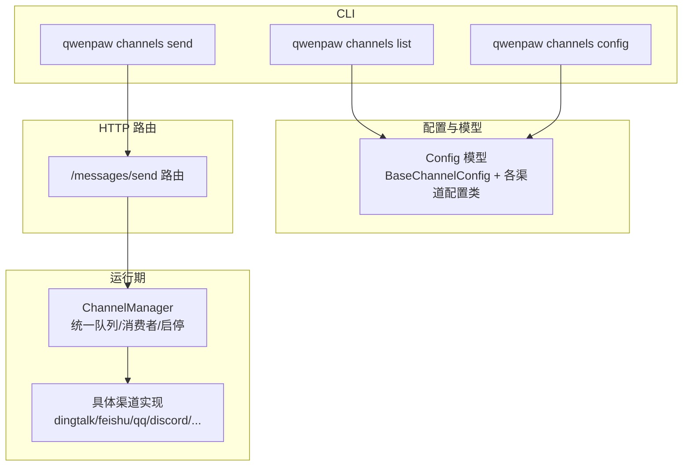
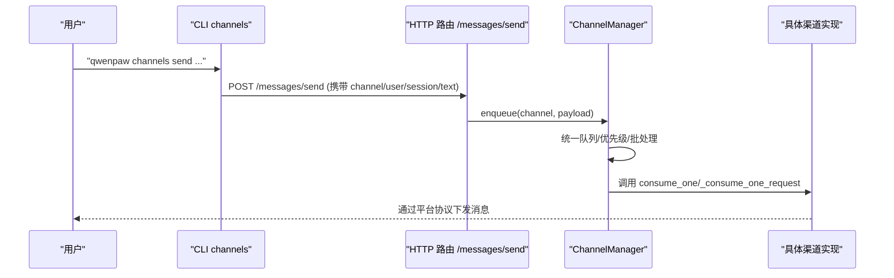
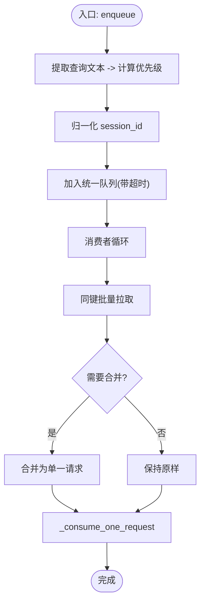
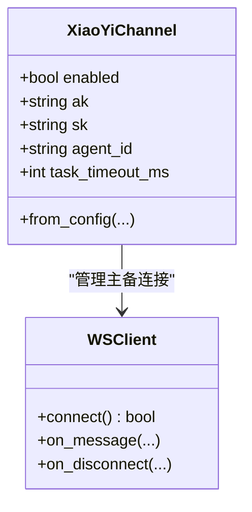
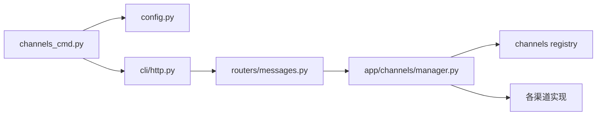

# 渠道管理命令

<cite>
**本文引用的文件**   
- [channels_cmd.py](file://src/qwenpaw/cli/channels_cmd.py)
- [config.py](file://src/qwenpaw/config/config.py)
- [manager.py](file://src/qwenpaw/app/channels/manager.py)
- [xiaoyi/channel.py](file://src/qwenpaw/app/channels/xiaoyi/channel.py)
- [messages.py](file://src/qwenpaw/app/routers/messages.py)
</cite>

## 目录
1. [简介](#简介)
2. [项目结构](#项目结构)
3. [核心组件](#核心组件)
4. [架构总览](#架构总览)
5. [详细组件分析](#详细组件分析)
6. [依赖关系分析](#依赖关系分析)
7. [性能与并发](#性能与并发)
8. [故障排查指南](#故障排查指南)
9. [结论](#结论)
10. [附录：平台接入配置要点](#附录：平台接入配置要点)

## 简介
本文件面向使用 QwenPaw CLI 的“渠道管理”能力，聚焦 qwenpaw channels 子命令及其在运行时对多渠道的统一编排。内容覆盖：
- 渠道注册、启用/禁用、交互式配置与列表查看
- 即时通讯平台（钉钉、飞书、QQ、Discord、Telegram、微信等）的关键配置项与安全设置
- 消息路由、负载平衡、队列与批处理
- OAuth 认证与密钥管理（含二维码登录流程说明）
- 多渠道并发处理、错误重试与故障转移
- 渠道开发与调试工具与方法

## 项目结构
围绕渠道管理的代码主要分布在以下位置：
- CLI 层：提供 channels 子命令（list、config、send），负责读取/保存 agent 配置并调用后端 API
- 配置层：定义各渠道的配置模型（Pydantic），包括通用字段与平台特定字段
- 运行期：ChannelManager 统一管理通道实例、队列、消费者与启停；部分渠道实现健康检查与重启
- 路由层：HTTP 接口 /messages/send 用于从 CLI 主动推送消息到指定渠道

图表来源
- [channels_cmd.py:791-904](file://src/qwenpaw/cli/channels_cmd.py#L791-L904)
- [config.py:197-493](file://src/qwenpaw/config/config.py#L197-L493)
- [manager.py:68-228](file://src/qwenpaw/app/channels/manager.py#L68-L228)
- [messages.py](file://src/qwenpaw/app/routers/messages.py)

章节来源
- [channels_cmd.py:791-904](file://src/qwenpaw/cli/channels_cmd.py#L791-L904)
- [config.py:197-493](file://src/qwenpaw/config/config.py#L197-L493)
- [manager.py:68-228](file://src/qwenpaw/app/channels/manager.py#L68-L228)

## 核心组件
- CLI 命令组 channels
  - list：列出当前 agent 的所有渠道配置，敏感字段自动脱敏显示
  - config：交互式选择并配置渠道（支持内置与插件渠道）
  - send：向已配置的渠道主动发送文本消息（需先通过 chats list 获取目标 user/session）
- 配置模型
  - BaseChannelConfig：所有渠道共享的通用开关与策略（如 enabled、dm_policy、group_policy、require_mention、no_text_debounce、access_control_* 等）
  - 各渠道专用配置类：DingTalk、Feishu、QQ、Discord、Telegram、WeChat、Voice、SIP、XiaoYi、Yuanbao、Slack、Matrix、Mattermost、MQTT、OneBot 等
- ChannelManager
  - 从配置或环境变量创建并启动各渠道
  - 维护统一队列管理器，按会话与优先级消费，支持批量合并与超时保护
  - 提供健康检查、单通道重启、替换通道、清空队列等运维能力

章节来源
- [channels_cmd.py:791-904](file://src/qwenpaw/cli/channels_cmd.py#L791-L904)
- [config.py:197-493](file://src/qwenpaw/config/config.py#L197-L493)
- [manager.py:68-228](file://src/qwenpaw/app/channels/manager.py#L68-L228)

## 架构总览
下图展示 CLI 与运行期的交互路径，以及消息从外部渠道进入后的统一处理流程。

图表来源
- [channels_cmd.py:906-1009](file://src/qwenpaw/cli/channels_cmd.py#L906-L1009)
- [manager.py:364-473](file://src/qwenpaw/app/channels/manager.py#L364-L473)
- [messages.py](file://src/qwenpaw/app/routers/messages.py)

## 详细组件分析

### CLI 命令：list
- 功能
  - 加载指定 agent 的渠道配置
  - 遍历可用渠道，输出名称与状态（enabled/disabled）
  - 逐字段打印配置值，敏感字段（如 bot_token、client_secret、app_secret、http_proxy_auth、twilio_auth_token）进行掩码处理
- 关键点
  - 支持 Pydantic 对象与 dict 两种配置形态
  - 兼容扩展字段（__pydantic_extra__）以支持插件渠道

章节来源
- [channels_cmd.py:827-873](file://src/qwenpaw/cli/channels_cmd.py#L827-L873)
- [channels_cmd.py:797-825](file://src/qwenpaw/cli/channels_cmd.py#L797-L825)

### CLI 命令：config（交互式配置）
- 功能
  - 动态发现可用渠道（内置 + 插件）
  - 为每个渠道提供交互式向导（enabled、bot_prefix 及平台特有参数）
  - 将修改写回 agent 配置文件
- 关键点
  - 内置渠道拥有专属向导函数（如 configure_dingtalk、configure_feishu、configure_qq、configure_discord、configure_telegram、configure_wechat、configure_voice、configure_console、configure_imessage）
  - 插件渠道若未提供 get_configurator，则回退为最小化向导（仅 enabled + bot_prefix）

章节来源
- [channels_cmd.py:728-786](file://src/qwenpaw/cli/channels_cmd.py#L728-L786)
- [channels_cmd.py:615-716](file://src/qwenpaw/cli/channels_cmd.py#L615-L716)
- [channels_cmd.py:875-904](file://src/qwenpaw/cli/channels_cmd.py#L875-L904)

### CLI 命令：send（主动推送）
- 功能
  - 通过 HTTP 调用 /messages/send，向指定渠道的用户会话发送文本消息
  - 要求必须提供 agent_id、channel、target_user、target_session、text 五个参数
- 关键点
  - 支持 --base-url 覆盖默认服务地址
  - 返回 JSON 响应，便于自动化脚本解析

章节来源
- [channels_cmd.py:906-1009](file://src/qwenpaw/cli/channels_cmd.py#L906-L1009)
- [messages.py](file://src/qwenpaw/app/routers/messages.py)

### 配置模型：通用与平台特定
- 通用字段（BaseChannelConfig）
  - enabled、bot_prefix、filter_tool_messages、filter_thinking
  - dm_policy/group_policy、allow_from、deny_message、require_mention
  - no_text_debounce、access_control_dm/group、dm_disabled/group_disabled
- 平台特定字段（节选）
  - DingTalk：client_id/client_secret、message_type/cron_message_type、card_template_*、robot_code、streaming_enabled、endpoint
  - Feishu/Lark：app_id/app_secret、encrypt_key/verification_token、domain(feishu/lark)、streaming_enabled、share_session_in_group
  - QQ：app_id/client_secret、markdown_enabled、max_reconnect_attempts、ack_message
  - Discord：bot_token、http_proxy/http_proxy_auth、accept_bot_messages、streaming_enabled、media_dir
  - Telegram：bot_token/base_url、http_proxy/http_proxy_auth、show_typing、streaming_enabled
  - WeChat（iLink Bot）：bot_token_file/base_url/media_dir（bot_token 由二维码登录获得并持久化）
  - Voice/SIP/XiaoYi/Yuanbao/Slack/Matrix/Mattermost/MQTT/OneBot 等均有各自字段集

章节来源
- [config.py:197-493](file://src/qwenpaw/config/config.py#L197-L493)

### 运行期：ChannelManager（统一队列与生命周期）
- 初始化
  - from_env/from_config：根据可用渠道与配置构建 Channel 实例，跳过 disabled 的渠道
  - 注入 process 处理器与 on_reply_sent 回调
- 队列与消费
  - 统一队列管理器按 channel_id + session_id + priority_level 分派
  - 消费者循环支持同键批量拉取与合并（例如图片+文本合并）
  - 入队带超时保护，避免阻塞
- 启停与替换
  - start_all/stop_all：后台启动各渠道，优雅停止
  - replace_channel：新实例预启动后原子替换旧实例，保证零中断切换
  - restart_channel：基于最新配置克隆并替换
  - health_check：查询单个渠道健康状态
  - clear_queue：清理指定队列

图表来源
- [manager.py:270-473](file://src/qwenpaw/app/channels/manager.py#L270-L473)

章节来源
- [manager.py:68-228](file://src/qwenpaw/app/channels/manager.py#L68-L228)
- [manager.py:364-473](file://src/qwenpaw/app/channels/manager.py#L364-L473)
- [manager.py:579-696](file://src/qwenpaw/app/channels/manager.py#L579-L696)

### 示例：小艺（XiaoYi）渠道
- 特点
  - 基于 WebSocket 的 A2A 协议，支持主备连接与健康切换
  - 配置包含 ak/sk/agent_id/task_timeout_ms 等
- 关键流程
  - 构造鉴权头并建立 WS 连接
  - 心跳保活与断线重连
  - 接收消息回调与任务超时控制

图表来源
- [xiaoyi/channel.py:102-136](file://src/qwenpaw/app/channels/xiaoyi/channel.py#L102-L136)
- [xiaoyi/channel.py:350-472](file://src/qwenpaw/app/channels/xiaoyi/channel.py#L350-L472)

章节来源
- [xiaoyi/channel.py:102-136](file://src/qwenpaw/app/channels/xiaoyi/channel.py#L102-L136)
- [xiaoyi/channel.py:350-472](file://src/qwenpaw/app/channels/xiaoyi/channel.py#L350-L472)

## 依赖关系分析
- CLI 依赖
  - channels_cmd.py 依赖配置模型（config.py）与 HTTP 客户端（cli/http.py）
  - 通过 load_agent_config/save_agent_config 读写 agent 配置
- 运行期依赖
  - manager.py 依赖渠道注册表与统一队列管理器
  - 各渠道实现遵循 BaseChannel 契约（consume_one/_consume_one_request/health_check/clone/start/stop）
- 路由依赖
  - messages.py 暴露 /messages/send，供 CLI 或其他系统调用

图表来源
- [channels_cmd.py:791-904](file://src/qwenpaw/cli/channels_cmd.py#L791-L904)
- [manager.py:68-228](file://src/qwenpaw/app/channels/manager.py#L68-L228)
- [messages.py](file://src/qwenpaw/app/routers/messages.py)

章节来源
- [channels_cmd.py:791-904](file://src/qwenpaw/cli/channels_cmd.py#L791-L904)
- [manager.py:68-228](file://src/qwenpaw/app/channels/manager.py#L68-L228)

## 性能与并发
- 统一队列与批处理
  - 同一 channel_id + session_id + priority_level 的消息会被批量拉取，减少频繁上下文切换
  - 入队操作具备超时保护，防止极端情况下阻塞事件循环
- 并发与隔离
  - 每个队列独立消费者，避免跨会话互相影响
  - 通道替换采用“预启动 + 原子替换”，降低热更新抖动
- 建议
  - 合理设置 queue_maxsize（默认 1000），结合业务峰值调整
  - 对高吞吐渠道（如群聊）开启批处理合并，提升吞吐
  - 针对长耗时任务（如大文件处理）考虑单独队列或降级策略

[本节为通用指导，不直接分析具体文件]

## 故障排查指南
- 常见问题定位
  - 渠道未生效：确认 enabled 是否为 True；list 命令可快速核对
  - 配置未保存：config 命令完成后会写回 agent 配置，必要时重新加载
  - 主动推送失败：检查 target_user/target_session 是否有效；确保渠道已正确配置且服务可达
- 健康检查与重启
  - 使用 ChannelManager 的健康检查接口获取渠道状态
  - 对异常渠道执行 restart_channel，基于最新配置重建实例
- 日志与调试
  - 关注入队/消费/合并/替换等关键路径的日志
  - 对于 WebSocket 类渠道（如 XiaoYi），检查连接建立、心跳与断线重连日志

章节来源
- [manager.py:579-696](file://src/qwenpaw/app/channels/manager.py#L579-L696)
- [channels_cmd.py:827-873](file://src/qwenpaw/cli/channels_cmd.py#L827-L873)

## 结论
QwenPaw 的渠道管理通过 CLI 与运行期协同工作，实现了“配置即所得”的多渠道接入能力。统一的队列与消费者机制保障了高并发场景下的稳定性与可扩展性；完善的健康检查与热替换能力提升了运维效率。配合丰富的平台配置项与安全策略，可满足企业级多平台集成需求。

[本节为总结，不直接分析具体文件]

## 附录：平台接入配置要点
- 钉钉（DingTalk）
  - 必填：client_id、client_secret
  - 可选：message_type/cron_message_type、card_template_*、robot_code、streaming_enabled、endpoint
- 飞书（Feishu/Lark）
  - 必填：app_id、app_secret
  - 可选：encrypt_key/verification_token、domain(feishu/lark)、streaming_enabled、share_session_in_group
- QQ
  - 必填：app_id、client_secret
  - 可选：markdown_enabled、max_reconnect_attempts、ack_message
- Discord
  - 必填：bot_token
  - 可选：http_proxy/http_proxy_auth、accept_bot_messages、streaming_enabled、media_dir
- Telegram
  - 必填：bot_token
  - 可选：base_url、http_proxy/http_proxy_auth、show_typing、streaming_enabled
- 微信（iLink Bot）
  - 注意：bot_token 通过二维码登录获取并写入 bot_token_file；向导中不提示该字段
  - 可选：base_url、media_dir
- 语音（Twilio/SIP）
  - Twilio：account_sid/auth_token、phone_number/phone_number_sid、TTS/STT 相关
  - SIP：sip_mode/host/port/username/password/server/transport、LiveKit 相关参数
- 其他
  - Slack/Matrix/Mattermost/MQTT/OneBot 等均有对应配置类，详见配置模型

章节来源
- [config.py:237-493](file://src/qwenpaw/config/config.py#L237-L493)
- [channels_cmd.py:199-349](file://src/qwenpaw/cli/channels_cmd.py#L199-L349)