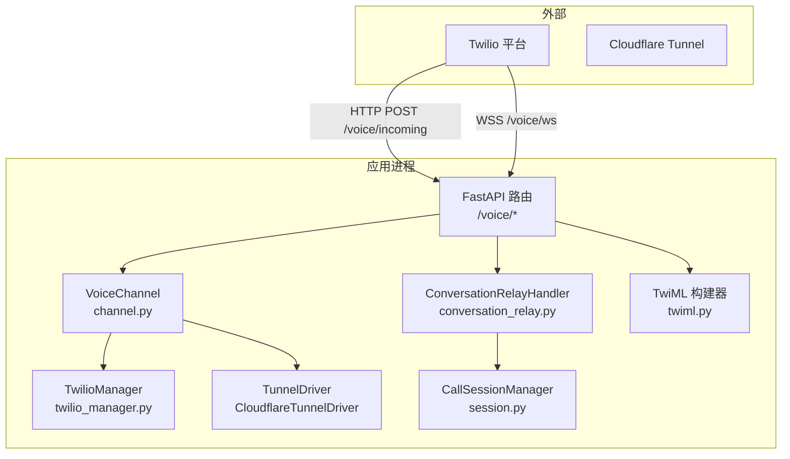
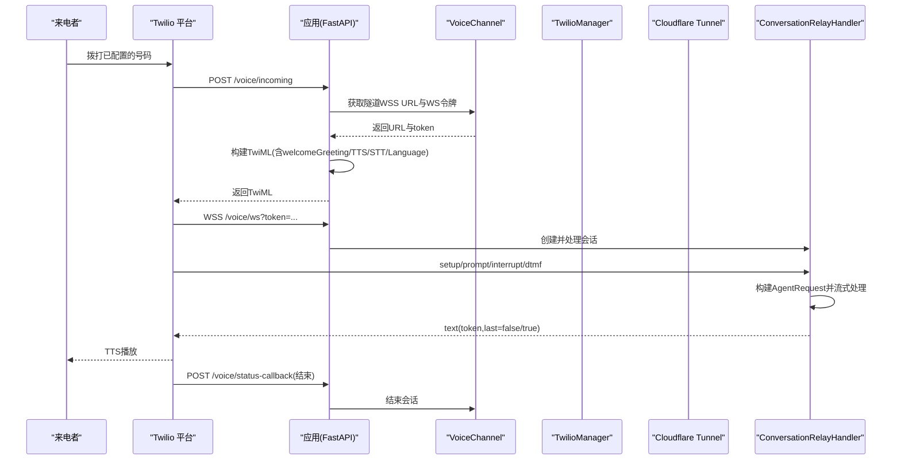
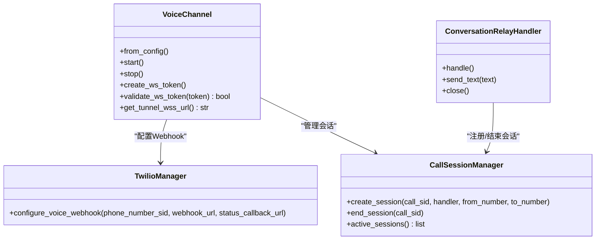
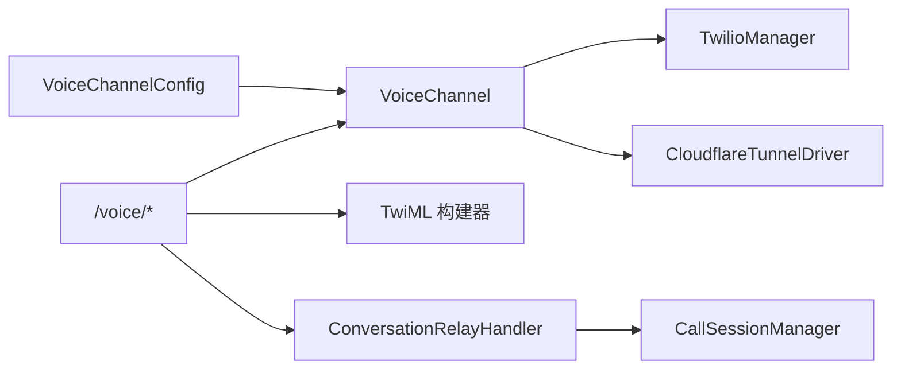

# 语音渠道配置

<cite>
**本文引用的文件**
- [src/qwenpaw/config/config.py](file://src/qwenpaw/config/config.py)
- [src/qwenpaw/app/channels/voice/channel.py](file://src/qwenpaw/app/channels/voice/channel.py)
- [src/qwenpaw/app/channels/voice/twilio_manager.py](file://src/qwenpaw/app/channels/voice/twilio_manager.py)
- [src/qwenpaw/app/routers/voice.py](file://src/qwenpaw/app/routers/voice.py)
- [src/qwenpaw/app/channels/voice/twiml.py](file://src/qwenpaw/app/channels/voice/twiml.py)
- [src/qwenpaw/app/channels/voice/conversation_relay.py](file://src/qwenpaw/app/channels/voice/conversation_relay.py)
- [src/qwenpaw/app/channels/voice/session.py](file://src/qwenpaw/app/channels/voice/session.py)
- [src/qwenpaw/cli/doctor_checks.py](file://src/qwenpaw/cli/doctor_checks.py)
</cite>

## 目录
1. [简介](#简介)
2. [项目结构](#项目结构)
3. [核心组件](#核心组件)
4. [架构总览](#架构总览)
5. [详细组件分析](#详细组件分析)
6. [依赖关系分析](#依赖关系分析)
7. [性能与延迟调优建议](#性能与延迟调优建议)
8. [故障排查指南](#故障排查指南)
9. [结论](#结论)

## 简介
本文件面向“语音渠道”的配置与使用，覆盖 Twilio 服务注册、账户凭据（Account SID 与 Auth Token）设置、电话号码申请与 Webhook 绑定流程、TTS（文本转语音）与 STT（语音转文本）服务选择与参数（默认 Google TTS 与 Deepgram STT）、欢迎语定制与多语言支持，以及音频质量与延迟优化建议。文档同时给出系统内部关键模块的职责与交互图，帮助快速定位问题与进行扩展。

## 项目结构
语音渠道相关代码主要位于以下位置：
- 配置模型：VoiceChannelConfig 定义 Voice 渠道所需的全部字段（Twilio 凭据、电话号码、TTS/STT 提供商与声音、语言、欢迎语等）。
- 通道实现：VoiceChannel 负责生命周期管理、Tunnel 启动、Twilio Webhook 配置、WebSocket 单用令牌生成与校验、会话管理等。
- Twilio 封装：TwilioManager 异步封装 twilio SDK，提供更新号码 Webhook 的能力。
- 路由与协议：/voice/incoming 返回 TwiML；/voice/ws 处理 ConversationRelay WebSocket；/voice/status-callback 接收通话状态回调。
- TwiML 构建：twiml.py 生成 ConversationRelay 连接指令，包含 welcomeGreeting、ttsProvider、voice、transcriptionProvider、language 等。
- 会话与会话管理器：ConversationRelayHandler 处理单次通话的 WS 消息流；CallSessionManager 维护活跃通话。

图表来源
- [src/qwenpaw/app/routers/voice.py:84-122](file://src/qwenpaw/app/routers/voice.py#L84-L122)
- [src/qwenpaw/app/channels/voice/channel.py:114-169](file://src/qwenpaw/app/channels/voice/channel.py#L114-L169)
- [src/qwenpaw/app/channels/voice/twilio_manager.py:31-57](file://src/qwenpaw/app/channels/voice/twilio_manager.py#L31-L57)
- [src/qwenpaw/app/channels/voice/twiml.py:8-37](file://src/qwenpaw/app/channels/voice/twiml.py#L8-L37)
- [src/qwenpaw/app/channels/voice/conversation_relay.py:60-102](file://src/qwenpaw/app/channels/voice/conversation_relay.py#L60-L102)
- [src/qwenpaw/app/channels/voice/session.py:28-73](file://src/qwenpaw/app/channels/voice/session.py#L28-L73)

章节来源
- [src/qwenpaw/config/config.py:377-389](file://src/qwenpaw/config/config.py#L377-L389)
- [src/qwenpaw/app/channels/voice/channel.py:17-83](file://src/qwenpaw/app/channels/voice/channel.py#L17-L83)
- [src/qwenpaw/app/channels/voice/twilio_manager.py:12-57](file://src/qwenpaw/app/channels/voice/twilio_manager.py#L12-L57)
- [src/qwenpaw/app/routers/voice.py:28-122](file://src/qwenpaw/app/routers/voice.py#L28-L122)
- [src/qwenpaw/app/channels/voice/twiml.py:8-37](file://src/qwenpaw/app/channels/voice/twiml.py#L8-L37)
- [src/qwenpaw/app/channels/voice/conversation_relay.py:29-102](file://src/qwenpaw/app/channels/voice/conversation_relay.py#L29-L102)
- [src/qwenpaw/app/channels/voice/session.py:16-73](file://src/qwenpaw/app/channels/voice/session.py#L16-L73)

## 核心组件
- VoiceChannelConfig：定义 voice 渠道配置项，包括 twilio_account_sid、twilio_auth_token、phone_number、phone_number_sid、tts_provider、tts_voice、stt_provider、language、welcome_greeting。
- VoiceChannel：从配置初始化，按需创建 TwilioManager，启动 Cloudflare Tunnel，将公网地址写入 Twilio 号码的 Webhook，并维护 WebSocket 单用令牌与通话会话。
- TwilioManager：异步封装 twilio.rest.Client，调用 incoming_phone_numbers.update 设置 voice_url 与 status_callback。
- 路由层：/voice/incoming 返回 TwiML（含 ConversationRelay 配置），/voice/ws 建立 WS 会话，/voice/status-callback 处理通话结束事件。
- TwiML 构建器：根据配置注入 welcomeGreeting、ttsProvider、voice、transcriptionProvider、language 等。
- ConversationRelayHandler：处理 setup/prompt/interrupt/dtmf 等消息，将用户语音转录文本转为 AgentRequest，并将响应文本分片回传给 Twilio 播放。
- CallSessionManager：维护 call_sid 到会话对象的映射，记录 from/to 号码与开始时间。

章节来源
- [src/qwenpaw/config/config.py:377-389](file://src/qwenpaw/config/config.py#L377-L389)
- [src/qwenpaw/app/channels/voice/channel.py:55-83](file://src/qwenpaw/app/channels/voice/channel.py#L55-L83)
- [src/qwenpaw/app/channels/voice/twilio_manager.py:31-57](file://src/qwenpaw/app/channels/voice/twilio_manager.py#L31-L57)
- [src/qwenpaw/app/routers/voice.py:84-122](file://src/qwenpaw/app/routers/voice.py#L84-L122)
- [src/qwenpaw/app/channels/voice/twiml.py:8-37](file://src/qwenpaw/app/channels/voice/twiml.py#L8-L37)
- [src/qwenpaw/app/channels/voice/conversation_relay.py:60-102](file://src/qwenpaw/app/channels/voice/conversation_relay.py#L60-L102)
- [src/qwenpaw/app/channels/voice/session.py:28-73](file://src/qwenpaw/app/channels/voice/session.py#L28-L73)

## 架构总览
下图展示一次来电端到端流程：Twilio 发起 HTTP 请求获取 TwiML，随后通过 WSS 与服务器建立 ConversationRelay 会话，服务器将语音转录结果转换为 Agent 请求，再将响应文本以分片形式回传，由 Twilio 完成 TTS 播报。

图表来源
- [src/qwenpaw/app/routers/voice.py:84-122](file://src/qwenpaw/app/routers/voice.py#L84-L122)
- [src/qwenpaw/app/routers/voice.py:125-161](file://src/qwenpaw/app/routers/voice.py#L125-L161)
- [src/qwenpaw/app/routers/voice.py:163-183](file://src/qwenpaw/app/routers/voice.py#L163-L183)
- [src/qwenpaw/app/channels/voice/channel.py:114-169](file://src/qwenpaw/app/channels/voice/channel.py#L114-L169)
- [src/qwenpaw/app/channels/voice/twiml.py:8-37](file://src/qwenpaw/app/channels/voice/twiml.py#L8-L37)
- [src/qwenpaw/app/channels/voice/conversation_relay.py:60-102](file://src/qwenpaw/app/channels/voice/conversation_relay.py#L60-L102)

## 详细组件分析

### Twilio 服务注册与账户配置
- 在控制台创建或登录 Twilio 账号，获取 Account SID 与 Auth Token。
- 在系统中配置 voice 渠道时，填写 twilio_account_sid 与 twilio_auth_token。若未提供，通道不会创建 TwilioManager，且健康检查会报告未配置。
- 启动时，通道会尝试通过 Twilio API 更新指定电话号码的 voice_url 与 status_callback，指向当前 Cloudflare Tunnel 的公网地址。

章节来源
- [src/qwenpaw/config/config.py:377-389](file://src/qwenpaw/config/config.py#L377-L389)
- [src/qwenpaw/app/channels/voice/channel.py:77-83](file://src/qwenpaw/app/channels/voice/channel.py#L77-L83)
- [src/qwenpaw/app/channels/voice/channel.py:114-169](file://src/qwenpaw/app/channels/voice/channel.py#L114-L169)
- [src/qwenpaw/app/channels/voice/twilio_manager.py:31-57](file://src/qwenpaw/app/channels/voice/twilio_manager.py#L31-L57)

### Account SID 与 Auth Token 的设置
- 必填项：twilio_account_sid、twilio_auth_token。
- 作用：用于实例化 Twilio REST Client，并调用 incoming_phone_numbers.update 设置 Webhook。
- 安全提示：Auth Token 属于敏感信息，请妥善保管，避免泄露。

章节来源
- [src/qwenpaw/config/config.py:380-381](file://src/qwenpaw/config/config.py#L380-L381)
- [src/qwenpaw/app/channels/voice/twilio_manager.py:15-25](file://src/qwenpaw/app/channels/voice/twilio_manager.py#L15-L25)

### 电话号码申请与配置流程
- 在 Twilio 控制台购买一个支持语音的电话号码。
- 在系统中配置 phone_number（显示用途）与 phone_number_sid（实际用于更新 Webhook）。
- 启动后，系统将自动把该号码的 voice_url 与 status_callback 指向当前公网地址。

章节来源
- [src/qwenpaw/config/config.py:382-383](file://src/qwenpaw/config/config.py#L382-L383)
- [src/qwenpaw/app/channels/voice/channel.py:126-169](file://src/qwenpaw/app/channels/voice/channel.py#L126-L169)
- [src/qwenpaw/app/channels/voice/twilio_manager.py:31-57](file://src/qwenpaw/app/channels/voice/twilio_manager.py#L31-L57)

### TTS（文本转语音）与 STT（语音转文本）服务配置
- 默认值：
  - tts_provider = google
  - stt_provider = deepgram
  - language = en-US
  - tts_voice = en-US-Journey-D
- 这些值会被注入到 TwiML 的 ConversationRelay 节点中，控制 Twilio 侧的 TTS/STT 行为。

章节来源
- [src/qwenpaw/config/config.py:384-388](file://src/qwenpaw/config/config.py#L384-L388)
- [src/qwenpaw/app/channels/voice/twiml.py:8-37](file://src/qwenpaw/app/channels/voice/twiml.py#L8-L37)

### Google TTS 与 Deepgram STT 的详细设置
- 选择与切换：
  - 通过 tts_provider 与 stt_provider 字段选择提供商。
  - 通过 tts_voice 指定具体音色。
  - 通过 language 指定语言区域（如 en-US、zh-CN 等）。
- 生效位置：
  - 在 /voice/incoming 返回的 TwiML 中，ConversationRelay 节点携带 ttsProvider、voice、transcriptionProvider、language 等参数。
- 注意：
  - 上述参数由 Twilio 侧消费，用于驱动其内置的 TTS/STT 能力。如需更换为其他第三方服务，需调整 TwiML 构建逻辑与后端处理链路。

章节来源
- [src/qwenpaw/app/routers/voice.py:110-122](file://src/qwenpaw/app/routers/voice.py#L110-L122)
- [src/qwenpaw/app/channels/voice/twiml.py:8-37](file://src/qwenpaw/app/channels/voice/twiml.py#L8-L37)

### 欢迎语定制与多语言支持
- 欢迎语：
  - welcome_greeting 字段用于设置首次连接的欢迎语音内容。
- 多语言：
  - language 字段用于指定 STT/TTS 的语言区域。
  - 可在配置中按业务需求修改为不同语言（例如 zh-CN）。

章节来源
- [src/qwenpaw/config/config.py:387-388](file://src/qwenpaw/config/config.py#L387-L388)
- [src/qwenpaw/app/channels/voice/twiml.py:8-37](file://src/qwenpaw/app/channels/voice/twiml.py#L8-L37)

### 通话会话与消息流转
- 会话管理：
  - ConversationRelayHandler 处理 setup/prompt/interrupt/dtmf 等消息，维护 call_sid 与主被叫号码。
  - CallSessionManager 维护活跃会话集合，供健康检查与停止流程使用。
- 消息流：
  - prompt 中的语音转录文本被转换为 AgentRequest，经 Agent 处理后，以 text(token, last=false/true) 的形式回传给 Twilio 进行 TTS 播放。

图表来源
- [src/qwenpaw/app/channels/voice/channel.py:17-83](file://src/qwenpaw/app/channels/voice/channel.py#L17-L83)
- [src/qwenpaw/app/channels/voice/twilio_manager.py:12-57](file://src/qwenpaw/app/channels/voice/twilio_manager.py#L12-L57)
- [src/qwenpaw/app/channels/voice/conversation_relay.py:29-102](file://src/qwenpaw/app/channels/voice/conversation_relay.py#L29-L102)
- [src/qwenpaw/app/channels/voice/session.py:16-73](file://src/qwenpaw/app/channels/voice/session.py#L16-L73)

章节来源
- [src/qwenpaw/app/channels/voice/conversation_relay.py:60-102](file://src/qwenpaw/app/channels/voice/conversation_relay.py#L60-L102)
- [src/qwenpaw/app/channels/voice/session.py:28-73](file://src/qwenpaw/app/channels/voice/session.py#L28-L73)

## 依赖关系分析
- 配置依赖：VoiceChannelConfig 集中声明 voice 渠道所有可配置项，便于统一管理与校验。
- 运行时依赖：
  - TwilioManager 依赖 twilio.rest.Client。
  - VoiceChannel 依赖 Cloudflare Tunnel Driver 暴露公网地址。
  - 路由层依赖 FastAPI 的 Request/Response/WebSocket。
- 外部依赖：
  - Twilio 平台（号码、Webhook、ConversationRelay）。
  - Cloudflare Tunnel（本地端口映射为公网 WSS）。

图表来源
- [src/qwenpaw/config/config.py:377-389](file://src/qwenpaw/config/config.py#L377-L389)
- [src/qwenpaw/app/channels/voice/channel.py:114-169](file://src/qwenpaw/app/channels/voice/channel.py#L114-L169)
- [src/qwenpaw/app/routers/voice.py:84-122](file://src/qwenpaw/app/routers/voice.py#L84-L122)
- [src/qwenpaw/app/channels/voice/twiml.py:8-37](file://src/qwenpaw/app/channels/voice/twiml.py#L8-L37)
- [src/qwenpaw/app/channels/voice/conversation_relay.py:60-102](file://src/qwenpaw/app/channels/voice/conversation_relay.py#L60-L102)
- [src/qwenpaw/app/channels/voice/session.py:28-73](file://src/qwenpaw/app/channels/voice/session.py#L28-L73)

章节来源
- [src/qwenpaw/config/config.py:377-389](file://src/qwenpaw/config/config.py#L377-L389)
- [src/qwenpaw/app/channels/voice/channel.py:114-169](file://src/qwenpaw/app/channels/voice/channel.py#L114-L169)
- [src/qwenpaw/app/routers/voice.py:84-122](file://src/qwenpaw/app/routers/voice.py#L84-L122)

## 性能与延迟调优建议
- 网络与隧道：
  - 确保 Cloudflare Tunnel 稳定可用，避免公网地址频繁变化导致 Twilio 无法正确路由。
  - 合理设置反向代理与负载均衡器的超时与缓冲策略，减少首包延迟。
- Twilio 侧参数：
  - 通过 language 与 tts_voice 选择合适的语言与音色，有助于降低识别与合成延迟。
  - 使用合适的 tts_provider 与 stt_provider（默认 google/deepgram），并根据业务场景评估是否切换至更低延迟的选项。
- 应用侧：
  - 保持 WebSocket 连接稳定，避免频繁重连。
  - 对 Agent 响应进行流式输出，尽快发送首个文本片段以降低感知延迟。
- 资源与并发：
  - 监控活跃会话数与错误率，必要时扩容 Worker 或提高并发上限。
  - 关注日志中的异常与警告，及时修复网络或认证问题。

[本节为通用指导，不直接分析具体文件]

## 故障排查指南
- 健康检查失败：
  - 若 twilio_account_sid 或 twilio_auth_token 为空，或 tunnel 未启动，健康检查会返回 unhealthy。
- Webhook 签名验证失败：
  - 路由层会对来自 Twilio 的请求进行签名校验，缺失或无效签名将返回 403。
- 号码未配置 Webhook：
  - 若 phone_number_sid 未配置，通道不会尝试更新 Webhook，导致来电无法到达。
- 诊断命令：
  - 可使用 doctor 检查工具检测 voice 渠道配置完整性（如缺少必要字段会给出提示）。

章节来源
- [src/qwenpaw/app/channels/voice/channel.py:85-112](file://src/qwenpaw/app/channels/voice/channel.py#L85-L112)
- [src/qwenpaw/app/routers/voice.py:42-82](file://src/qwenpaw/app/routers/voice.py#L42-L82)
- [src/qwenpaw/app/channels/voice/channel.py:126-131](file://src/qwenpaw/app/channels/voice/channel.py#L126-L131)
- [src/qwenpaw/cli/doctor_checks.py:926-935](file://src/qwenpaw/cli/doctor_checks.py#L926-L935)

## 结论
语音渠道基于 Twilio ConversationRelay 与 Cloudflare Tunnel 实现，通过统一的配置模型管理 Twilio 凭据、电话号码、TTS/STT 提供商与语言、欢迎语等关键参数。启动后自动更新号码 Webhook，并在来电时返回 TwiML 建立实时语音会话。默认采用 Google TTS 与 Deepgram STT，可通过配置灵活切换与定制。结合网络与隧道稳定性、流式响应与合理的语言/音色选择，可获得较低的端到端延迟与良好的用户体验。