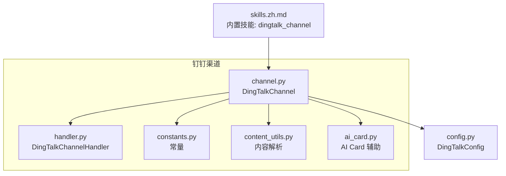
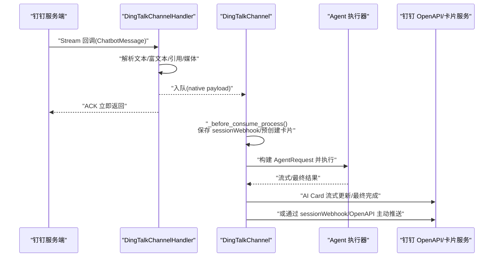
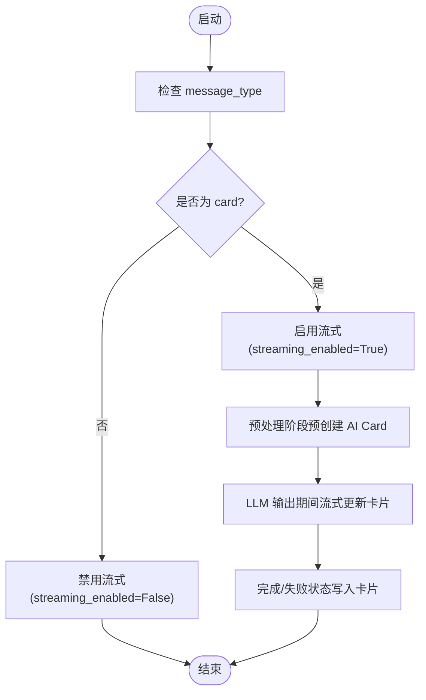
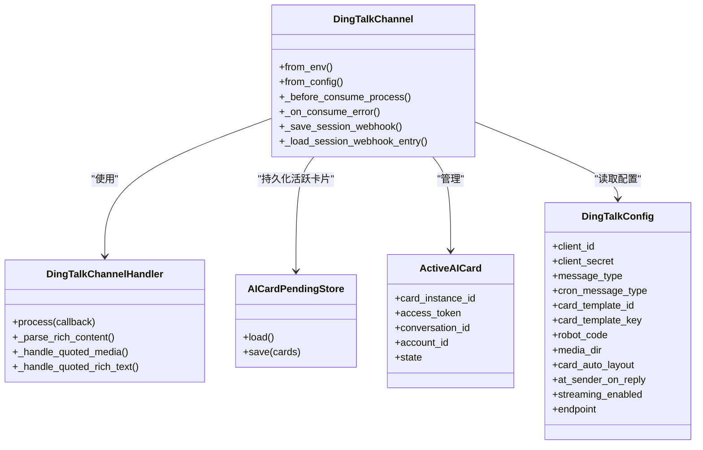

# 钉钉渠道配置

<cite>
**本文引用的文件**   
- [src/qwenpaw/app/channels/dingtalk/channel.py](file://src/qwenpaw/app/channels/dingtalk/channel.py)
- [src/qwenpaw/app/channels/dingtalk/handler.py](file://src/qwenpaw/app/channels/dingtalk/handler.py)
- [src/qwenpaw/app/channels/dingtalk/constants.py](file://src/qwenpaw/app/channels/dingtalk/constants.py)
- [src/qwenpaw/app/channels/dingtalk/content_utils.py](file://src/qwenpaw/app/channels/dingtalk/content_utils.py)
- [src/qwenpaw/app/channels/dingtalk/ai_card.py](file://src/qwenpaw/app/channels/dingtalk/ai_card.py)
- [src/qwenpaw/config/config.py](file://src/qwenpaw/config/config.py)
- [website/public/docs/skills.zh.md](file://website/public/docs/skills.zh.md)
</cite>

## 目录
1. [简介](#简介)
2. [项目结构](#项目结构)
3. [核心组件](#核心组件)
4. [架构总览](#架构总览)
5. [详细组件分析](#详细组件分析)
6. [依赖关系分析](#依赖关系分析)
7. [性能与流式响应](#性能与流式响应)
8. [错误码与故障排除](#错误码与故障排除)
9. [结论](#结论)
10. [附录：环境变量与配置项](#附录环境变量与配置项)

## 简介
本指南面向需要在 QwenPaw 中接入“钉钉”渠道的运维与开发者，覆盖以下内容：
- 企业内部应用创建流程与权限申请（结合内置技能辅助）
- Client ID 与 Client Secret 获取方法
- 机器人前缀、消息格式支持（Markdown/Card）
- 流式响应启用与配置（AI Card 流式更新）
- 工作群添加与消息推送设置（会话 Webhook 存储与主动推送）
- 企业微信集成与跨平台配置要点
- 常见错误码参考与排障建议

## 项目结构
钉钉渠道相关代码位于 channels/dingtalk 子模块，配合全局配置类完成参数注入。关键文件如下：
- channel.py：渠道主实现，负责初始化、事件处理编排、主动推送、卡片管理、Token 缓存等
- handler.py：钉钉 Stream 回调处理器，将原始消息转换为内部内容并入队
- constants.py：常量定义（如 Token TTL、类型映射等）
- content_utils.py：内容解析工具（发送者、会话标识、URL 解析等）
- ai_card.py：AI Card 状态与持久化辅助
- config.py：DingTalkConfig 配置模型（包含 streaming_enabled、message_type 等）

图表来源
- [src/qwenpaw/app/channels/dingtalk/channel.py:1-800](file://src/qwenpaw/app/channels/dingtalk/channel.py#L1-L800)
- [src/qwenpaw/app/channels/dingtalk/handler.py:1-594](file://src/qwenpaw/app/channels/dingtalk/handler.py#L1-L594)
- [src/qwenpaw/app/channels/dingtalk/constants.py:1-19](file://src/qwenpaw/app/channels/dingtalk/constants.py#L1-L19)
- [src/qwenpaw/app/channels/dingtalk/content_utils.py:1-146](file://src/qwenpaw/app/channels/dingtalk/content_utils.py#L1-L146)
- [src/qwenpaw/app/channels/dingtalk/ai_card.py:1-79](file://src/qwenpaw/app/channels/dingtalk/ai_card.py#L1-L79)
- [src/qwenpaw/config/config.py:237-250](file://src/qwenpaw/config/config.py#L237-L250)
- [website/public/docs/skills.zh.md:70-118](file://website/public/docs/skills.zh.md#L70-L118)

章节来源
- [src/qwenpaw/app/channels/dingtalk/channel.py:1-800](file://src/qwenpaw/app/channels/dingtalk/channel.py#L1-L800)
- [src/qwenpaw/app/channels/dingtalk/handler.py:1-594](file://src/qwenpaw/app/channels/dingtalk/handler.py#L1-L594)
- [src/qwenpaw/app/channels/dingtalk/constants.py:1-19](file://src/qwenpaw/app/channels/dingtalk/constants.py#L1-L19)
- [src/qwenpaw/app/channels/dingtalk/content_utils.py:1-146](file://src/qwenpaw/app/channels/dingtalk/content_utils.py#L1-L146)
- [src/qwenpaw/app/channels/dingtalk/ai_card.py:1-79](file://src/qwenpaw/app/channels/dingtalk/ai_card.py#L1-L79)
- [src/qwenpaw/config/config.py:237-250](file://src/qwenpaw/config/config.py#L237-L250)
- [website/public/docs/skills.zh.md:70-118](file://website/public/docs/skills.zh.md#L70-L118)

## 核心组件
- DingTalkChannel：渠道入口，封装了从环境/配置加载、Stream 客户端、OpenAPI SDK、AI Card 管理、会话 Webhook 存储、去重与错误处理等能力。
- DingTalkChannelHandler：钉钉 Stream 回调处理器，负责将 ChatbotMessage 转为内部 Content 列表，并进行引用消息、富文本、媒体下载等解析。
- AI Card 辅助：ActiveAICard 与 AICardPendingStore 用于活跃卡片状态管理与崩溃恢复。
- 配置模型：DingTalkConfig 提供 message_type、cron_message_type、card_template_id/key、robot_code、media_dir、card_auto_layout、at_sender_on_reply、streaming_enabled、endpoint 等字段。

章节来源
- [src/qwenpaw/app/channels/dingtalk/channel.py:107-248](file://src/qwenpaw/app/channels/dingtalk/channel.py#L107-L248)
- [src/qwenpaw/app/channels/dingtalk/handler.py:38-110](file://src/qwenpaw/app/channels/dingtalk/handler.py#L38-L110)
- [src/qwenpaw/app/channels/dingtalk/ai_card.py:19-79](file://src/qwenpaw/app/channels/dingtalk/ai_card.py#L19-L79)
- [src/qwenpaw/config/config.py:237-250](file://src/qwenpaw/config/config.py#L237-L250)

## 架构总览
下图展示了从钉钉回调到内部处理再到回复的关键路径，包括立即 ACK、异步处理、AI Card 流式更新与主动推送。

图表来源
- [src/qwenpaw/app/channels/dingtalk/handler.py:383-594](file://src/qwenpaw/app/channels/dingtalk/handler.py#L383-L594)
- [src/qwenpaw/app/channels/dingtalk/channel.py:430-534](file://src/qwenpaw/app/channels/dingtalk/channel.py#L430-L534)
- [src/qwenpaw/app/channels/dingtalk/ai_card.py:19-79](file://src/qwenpaw/app/channels/dingtalk/ai_card.py#L19-L79)

## 详细组件分析

### 企业内部应用创建与权限申请（含内置技能辅助）
- 使用内置技能 dingtalk_channel 可辅助通过可视浏览器完成钉钉频道接入流程，并提示用户完成必要手动步骤。
- 在技能池页面导入或安装该技能后，按引导完成应用创建、权限勾选与回调地址配置。

章节来源
- [website/public/docs/skills.zh.md:70-118](file://website/public/docs/skills.zh.md#L70-L118)

### Client ID 与 Client Secret 获取
- 在企业内部应用管理中创建应用后，可在应用的凭证与基础信息处获取 Client ID 与 Client Secret。
- 在 QwenPaw 中可通过环境变量或配置文件传入：
  - DINGTALK_CLIENT_ID
  - DINGTALK_CLIENT_SECRET
- 若未显式设置 robot_code，则默认回退为 client_id。

章节来源
- [src/qwenpaw/app/channels/dingtalk/channel.py:250-358](file://src/qwenpaw/app/channels/dingtalk/channel.py#L250-L358)
- [src/qwenpaw/config/config.py:237-250](file://src/qwenpaw/config/config.py#L237-L250)

### 机器人前缀与消息格式
- 机器人前缀 bot_prefix：用于在回复内容前追加固定前缀，便于识别来源。
- 消息格式 message_type：
  - markdown：以 Markdown 渲染的消息
  - card：使用 AI Card 进行更丰富的交互与流式更新
- cron_message_type：定时任务触发的消息格式，可与普通消息区分。
- card_template_id / card_template_key：自定义卡片模板与内容键名。
- at_sender_on_reply：回复时是否 @发送者。
- card_auto_layout：是否自动布局卡片内容。

章节来源
- [src/qwenpaw/app/channels/dingtalk/channel.py:126-218](file://src/qwenpaw/app/channels/dingtalk/channel.py#L126-L218)
- [src/qwenpaw/config/config.py:237-250](file://src/qwenpaw/config/config.py#L237-L250)

### 流式响应的启用与配置
- 仅当 message_type=card 时，streaming_enabled 才会生效；markdown 模式下会强制关闭流式，避免吞掉事件。
- 启用后，系统会在处理开始前预创建 AI Card，并在 LLM 输出过程中持续更新卡片内容，提升实时体验。
- 相关常量：
  - AI_CARD_TOKEN_PREEMPTIVE_REFRESH_SECONDS：提前刷新访问令牌的时间窗口
  - AI_CARD_PROCESSING_TEXT：处理中提示文案
  - AI_CARD_RECOVERY_FINAL_TEXT：中断恢复后的提示文案

图表来源
- [src/qwenpaw/app/channels/dingtalk/channel.py:157-186](file://src/qwenpaw/app/channels/dingtalk/channel.py#L157-L186)
- [src/qwenpaw/app/channels/dingtalk/channel.py:474-496](file://src/qwenpaw/app/channels/dingtalk/channel.py#L474-L496)
- [src/qwenpaw/app/channels/dingtalk/constants.py:16-19](file://src/qwenpaw/app/channels/dingtalk/constants.py#L16-L19)

### 工作群添加与消息推送设置
- 会话 Webhook 存储：
  - 在处理前保存 session_webhook，以便后续主动推送（例如定时任务）。
  - 支持内存与磁盘持久化，重启后可恢复。
  - DM 场景使用 user_id+session_id 后缀作为 key，避免不同会话冲突；群聊使用会话后缀 key。
- 主动推送策略：
  - 优先使用 session_webhook 直接发送
  - 若失效则清理 webhook 并保留 conversation_id 等元数据，以便走 OpenAPI 兜底（需具备相应权限）
- 群聊行为：
  - 支持 require_mention 控制是否在群内必须 @机器人 才处理
  - 支持 at_sender_on_reply 在回复时 @发送者

章节来源
- [src/qwenpaw/app/channels/dingtalk/channel.py:430-534](file://src/qwenpaw/app/channels/dingtalk/channel.py#L430-L534)
- [src/qwenpaw/app/channels/dingtalk/channel.py:553-606](file://src/qwenpaw/app/channels/dingtalk/channel.py#L553-L606)
- [src/qwenpaw/app/channels/dingtalk/channel.py:643-753](file://src/qwenpaw/app/channels/dingtalk/channel.py#L643-L753)
- [src/qwenpaw/app/channels/dingtalk/handler.py:440-548](file://src/qwenpaw/app/channels/dingtalk/handler.py#L440-L548)

### 企业微信集成与跨平台配置
- 企业微信（WeCom）通道配置独立于钉钉，位于 WecomConfig，支持 media_dir、welcome_text、share_session_in_group、streaming_enabled 等。
- 跨平台要点：
  - 各通道均遵循统一的 BaseChannelConfig 扩展模式，便于统一管理与切换
  - 如需在多通道间复用逻辑，建议基于公共基类与通用工具函数

章节来源
- [src/qwenpaw/config/config.py:331-343](file://src/qwenpaw/config/config.py#L331-L343)

## 依赖关系分析
- DingTalkChannel 依赖：
  - dingtalk_stream：接收与 ACK 回调
  - alibabacloud_dingtalk.*：OAuth、机器人、卡片等 OpenAPI 调用
  - aiohttp：HTTP 客户端
  - certifi：SSL 证书信任库
- 内部依赖：
  - BaseChannel：统一通道抽象
  - 内容解析与工具：content_utils、constants、ai_card

图表来源
- [src/qwenpaw/app/channels/dingtalk/channel.py:107-248](file://src/qwenpaw/app/channels/dingtalk/channel.py#L107-L248)
- [src/qwenpaw/app/channels/dingtalk/handler.py:38-110](file://src/qwenpaw/app/channels/dingtalk/handler.py#L38-L110)
- [src/qwenpaw/app/channels/dingtalk/ai_card.py:19-79](file://src/qwenpaw/app/channels/dingtalk/ai_card.py#L19-L79)
- [src/qwenpaw/config/config.py:237-250](file://src/qwenpaw/config/config.py#L237-L250)

## 性能与流式响应
- 去重机制：基于 msg_id 的去重集合，防止重复处理导致资源浪费。
- 流式更新节流：对卡片流式更新设置了最小间隔，避免频繁请求造成抖动。
- Token 缓存：实例级 token 缓存与过期时间，减少鉴权开销。
- 并发与线程安全：Stream 回调线程与主事件循环之间通过线程安全队列通信。

章节来源
- [src/qwenpaw/app/channels/dingtalk/channel.py:240-248](file://src/qwenpaw/app/channels/dingtalk/channel.py#L240-L248)
- [src/qwenpaw/app/channels/dingtalk/channel.py:122-123](file://src/qwenpaw/app/channels/dingtalk/channel.py#L122-L123)
- [src/qwenpaw/app/channels/dingtalk/constants.py:4-8](file://src/qwenpaw/app/channels/dingtalk/constants.py#L4-L8)
- [src/qwenpaw/app/channels/dingtalk/handler.py:59-65](file://src/qwenpaw/app/channels/dingtalk/handler.py#L59-L65)

## 错误码与故障排除
- 回调处理异常：
  - 当 process 抛出异常时，返回 SYSTEM_EXCEPTION 状态，避免钉钉重试风暴。
- 消费过程错误：
  - _on_consume_error 会将“思考”表情替换为“错误”表情，并通过 session_webhook 发送错误文本。
- 常见问题排查：
  - 未收到消息：检查 require_mention 与群聊 @ 设置；确认回调地址与权限已正确配置。
  - 主动推送失败：检查 session_webhook 是否过期；必要时走 OpenAPI 兜底（需具备批量发送权限）。
  - 流式无效果：确认 message_type=card 且 streaming_enabled=True。
  - 媒体无法下载：检查 downloadCode 与 robot_code 是否正确传递；语音消息优先使用识别文本。

章节来源
- [src/qwenpaw/app/channels/dingtalk/handler.py:583-594](file://src/qwenpaw/app/channels/dingtalk/handler.py#L583-L594)
- [src/qwenpaw/app/channels/dingtalk/channel.py:497-534](file://src/qwenpaw/app/channels/dingtalk/channel.py#L497-L534)
- [src/qwenpaw/app/channels/dingtalk/handler.py:124-145](file://src/qwenpaw/app/channels/dingtalk/handler.py#L124-L145)

## 结论
通过本指南，您可以完成钉钉渠道的创建、授权、配置与调优，并利用 AI Card 流式更新提升用户体验。同时，借助内置技能与完善的错误处理机制，能够快速定位与解决问题。对于多通道部署，建议统一采用配置驱动与环境变量注入，保持各通道一致性与可维护性。

## 附录：环境变量与配置项
- 环境变量（示例）
  - DINGTALK_CHANNEL_ENABLED：是否启用
  - DINGTALK_CLIENT_ID / DINGTALK_CLIENT_SECRET：应用凭证
  - DINGTALK_BOT_PREFIX：机器人前缀
  - DINGTALK_MESSAGE_TYPE：消息格式（markdown/card）
  - DINGTALK_CRON_MESSAGE_TYPE：定时任务消息格式
  - DINGTALK_CARD_TEMPLATE_ID / CARD_TEMPLATE_KEY：卡片模板与内容键
  - DINGTALK_ROBOT_CODE：机器人编码（为空时回退 client_id）
  - DINGTALK_MEDIA_DIR：媒体目录
  - DINGTALK_DM_POLICY / GROUP_POLICY：DM/群聊访问策略
  - DINGTALK_ALLOW_FROM：允许来源白名单
  - DINGTALK_DENY_MESSAGE：拒绝时的提示消息
  - DINGTALK_REQUIRE_MENTION：群聊是否必须 @机器人
  - DINGTALK_CARD_AUTO_LAYOUT：卡片自动布局
  - DINGTALK_AT_SENDER_ON_REPLY：回复时 @发送者
  - DINGTALK_STREAMING_ENABLED：是否启用流式（仅在 card 模式下有效）
  - DINGTALK_ENDPOINT：自定义端点（可选）

- 配置模型字段（DingTalkConfig）
  - client_id、client_secret、message_type、cron_message_type、card_template_id、card_template_key、robot_code、media_dir、card_auto_layout、at_sender_on_reply、streaming_enabled、endpoint

章节来源
- [src/qwenpaw/app/channels/dingtalk/channel.py:250-358](file://src/qwenpaw/app/channels/dingtalk/channel.py#L250-L358)
- [src/qwenpaw/config/config.py:237-250](file://src/qwenpaw/config/config.py#L237-L250)