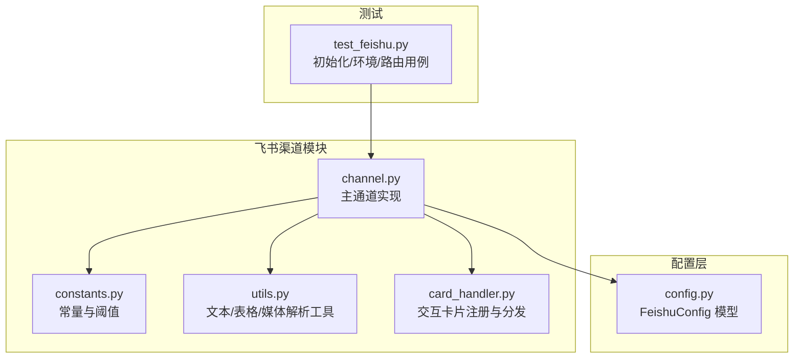
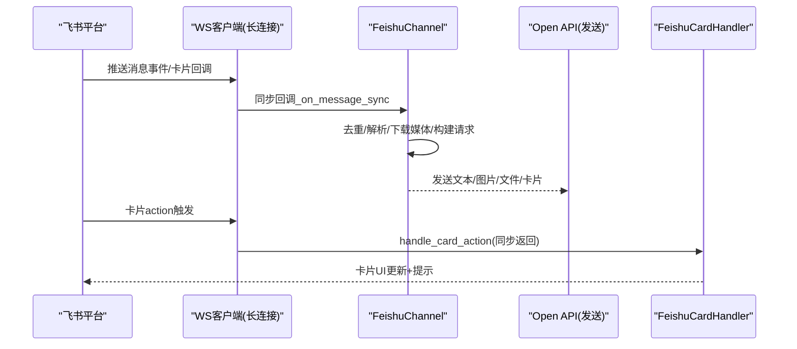
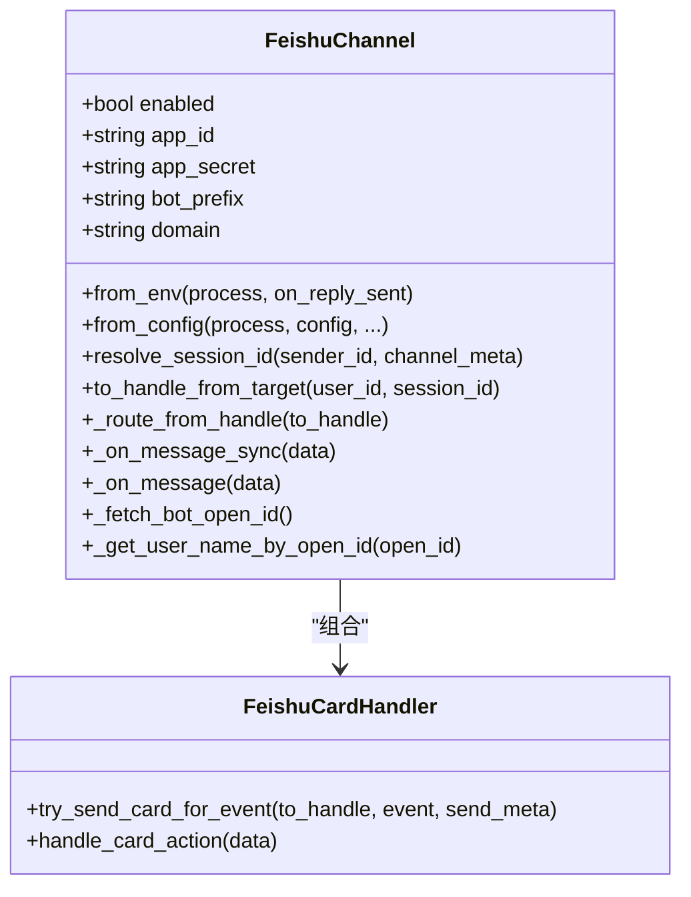
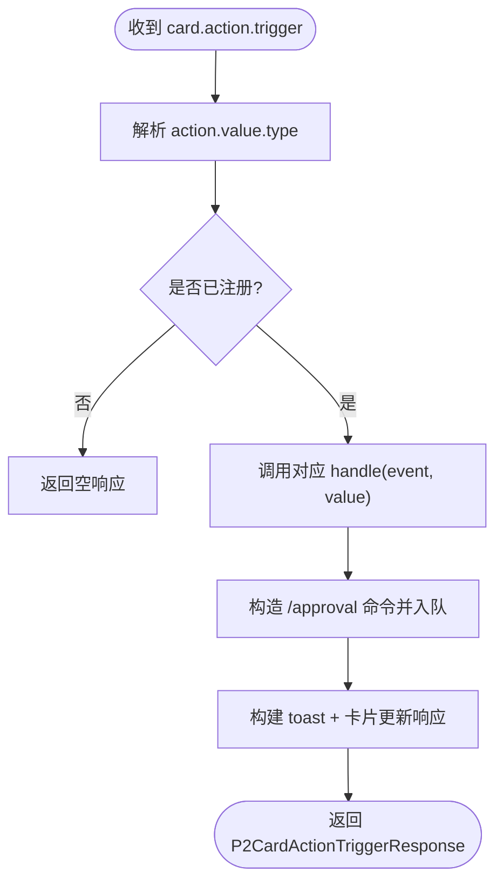
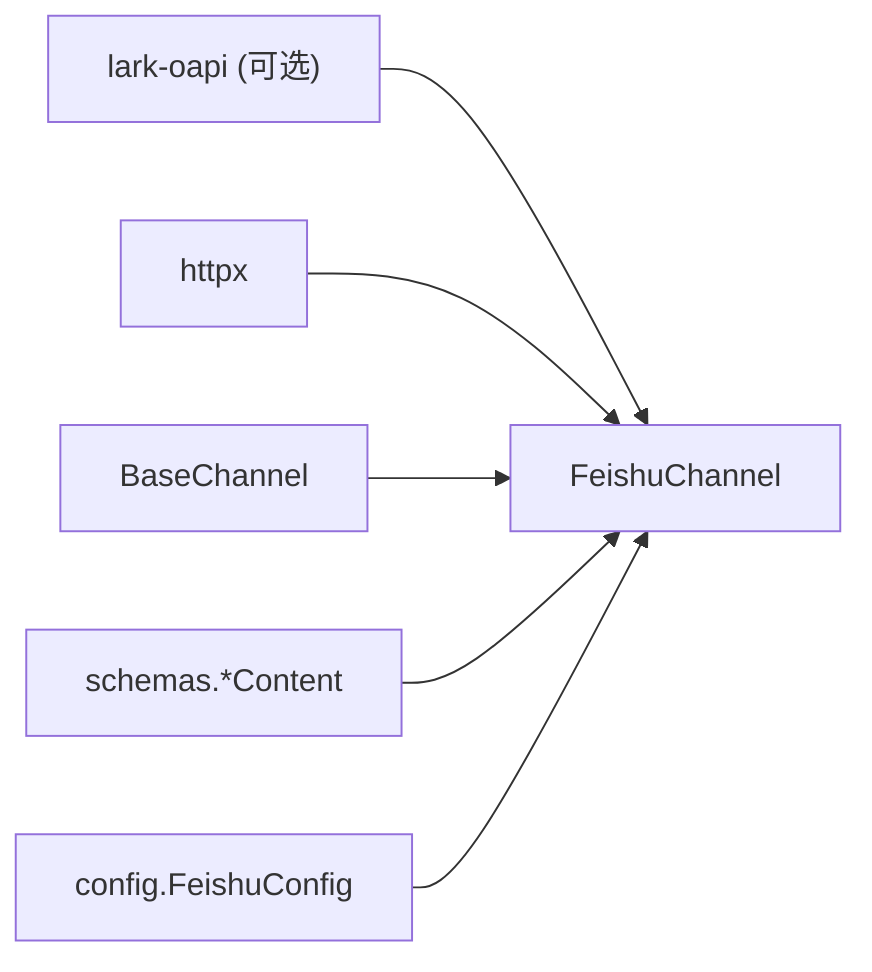

# 飞书渠道配置

<cite>
**本文引用的文件**
- [src/qwenpaw/app/channels/feishu/channel.py](file://src/qwenpaw/app/channels/feishu/channel.py)
- [src/qwenpaw/app/channels/feishu/constants.py](file://src/qwenpaw/app/channels/feishu/constants.py)
- [src/qwenpaw/app/channels/feishu/utils.py](file://src/qwenpaw/app/channels/feishu/utils.py)
- [src/qwenpaw/app/channels/feishu/card_handler.py](file://src/qwenpaw/app/channels/feishu/card_handler.py)
- [src/qwenpaw/config/config.py](file://src/qwenpaw/config/config.py)
- [tests/unit/channels/test_feishu.py](file://tests/unit/channels/test_feishu.py)
</cite>

## 目录
1. [简介](#简介)
2. [项目结构](#项目结构)
3. [核心组件](#核心组件)
4. [架构总览](#架构总览)
5. [详细组件分析](#详细组件分析)
6. [依赖关系分析](#依赖关系分析)
7. [性能与稳定性建议](#性能与稳定性建议)
8. [故障排查指南](#故障排查指南)
9. [结论](#结论)
10. [附录：配置项与环境变量](#附录配置项与环境变量)

## 简介
本文件面向需要在 QwenPaw 中启用“飞书（Feishu/Lark）”渠道的用户与运维人员，提供从自建应用创建、App ID/App Secret 获取、国内版与国际版差异、机器人前缀与消息卡片、群组集成与权限、Webhook 与回调地址设置，到错误处理与网络优化的一站式配置指南。文档内容严格基于仓库源码实现进行说明，确保与实际行为一致。

## 项目结构
飞书渠道相关代码位于 channels/feishu 子包内，包含通道主类、常量、工具函数与交互卡片处理器；配置模型定义在 config/config.py 中；单元测试覆盖初始化、环境变量读取、会话路由等关键路径。

图表来源
- [src/qwenpaw/app/channels/feishu/channel.py:196-383](file://src/qwenpaw/app/channels/feishu/channel.py#L196-L383)
- [src/qwenpaw/app/channels/feishu/constants.py:1-42](file://src/qwenpaw/app/channels/feishu/constants.py#L1-L42)
- [src/qwenpaw/app/channels/feishu/utils.py:1-486](file://src/qwenpaw/app/channels/feishu/utils.py#L1-L486)
- [src/qwenpaw/app/channels/feishu/card_handler.py:95-146](file://src/qwenpaw/app/channels/feishu/card_handler.py#L95-L146)
- [src/qwenpaw/config/config.py:252-270](file://src/qwenpaw/config/config.py#L252-L270)
- [tests/unit/channels/test_feishu.py:127-424](file://tests/unit/channels/test_feishu.py#L127-L424)

章节来源
- [src/qwenpaw/app/channels/feishu/channel.py:196-383](file://src/qwenpaw/app/channels/feishu/channel.py#L196-L383)
- [src/qwenpaw/config/config.py:252-270](file://src/qwenpaw/config/config.py#L252-L270)
- [tests/unit/channels/test_feishu.py:127-424](file://tests/unit/channels/test_feishu.py#L127-L424)

## 核心组件
- FeishuChannel：飞书通道主类，负责 WebSocket 长连接收事件、Open API 发送消息、会话路由、去重、昵称缓存、流式卡片更新等。
- FeishuCardHandler：交互式卡片统一入口，按 message_type/action_type 注册渲染与处理逻辑，支持工具守卫审批卡片。
- constants：集中定义超时、退避、大小限制、流式更新间隔等参数。
- utils：提供短会话 ID、发送者显示名、结构化文本提取、Markdown 转飞书原生表格、图片/媒体 key 提取等工具。
- FeishuConfig：配置模型，包含 app_id/app_secret、domain(feishu/lark)、streaming_enabled、share_session_in_group 等。

章节来源
- [src/qwenpaw/app/channels/feishu/channel.py:196-383](file://src/qwenpaw/app/channels/feishu/channel.py#L196-L383)
- [src/qwenpaw/app/channels/feishu/card_handler.py:95-146](file://src/qwenpaw/app/channels/feishu/card_handler.py#L95-L146)
- [src/qwenpaw/app/channels/feishu/constants.py:1-42](file://src/qwenpaw/app/channels/feishu/constants.py#L1-L42)
- [src/qwenpaw/app/channels/feishu/utils.py:1-486](file://src/qwenpaw/app/channels/feishu/utils.py#L1-L486)
- [src/qwenpaw/config/config.py:252-270](file://src/qwenpaw/config/config.py#L252-L270)

## 架构总览
飞书渠道采用“WebSocket 接收 + Open API 发送”的架构：通过 lark-oapi SDK 建立 WS 长连接接收事件，使用 tenant_access_token 调用 Open API 发送消息；同时支持 CardKit 流式卡片实时更新。

图表来源
- [src/qwenpaw/app/channels/feishu/channel.py:624-667](file://src/qwenpaw/app/channels/feishu/channel.py#L624-L667)
- [src/qwenpaw/app/channels/feishu/card_handler.py:182-216](file://src/qwenpaw/app/channels/feishu/card_handler.py#L182-L216)

## 详细组件分析

### 组件一：FeishuChannel（主通道）
- 初始化与工厂方法
  - from_env：从环境变量加载配置，包括开关、凭证、域名、策略等。
  - from_config：从 Pydantic 配置对象加载。
- 会话与路由
  - resolve_session_id：群聊以 chat_id 生成短会话 ID，私聊以 sender_id。
  - to_handle_from_target / _route_from_handle：将目标转换为 feishu:sw:<short_id> 或 open_id/chat_id 形式。
- 消息处理
  - _on_message_sync/_on_message：线程安全入队、去重、@提及过滤、引用消息处理、媒体下载、结构化内容解析。
- 用户与机器人信息
  - _fetch_bot_open_id：通过 Open API 获取机器人 open_id，并计算时钟偏移。
  - _get_user_name_by_open_id：拉取联系人名称并缓存。
- 发送能力
  - 支持文本、图片、文件、交互式卡片；支持流式卡片更新（受 streaming_enabled 控制）。
- 访问控制
  - dm_policy/group_policy/allow_from/deny_message/requires_mention 等。

图表来源
- [src/qwenpaw/app/channels/feishu/channel.py:196-383](file://src/qwenpaw/app/channels/feishu/channel.py#L196-L383)
- [src/qwenpaw/app/channels/feishu/card_handler.py:95-146](file://src/qwenpaw/app/channels/feishu/card_handler.py#L95-L146)

章节来源
- [src/qwenpaw/app/channels/feishu/channel.py:196-383](file://src/qwenpaw/app/channels/feishu/channel.py#L196-L383)
- [src/qwenpaw/app/channels/feishu/channel.py:624-667](file://src/qwenpaw/app/channels/feishu/channel.py#L624-L667)
- [src/qwenpaw/app/channels/feishu/channel.py:495-550](file://src/qwenpaw/app/channels/feishu/channel.py#L495-L550)
- [src/qwenpaw/app/channels/feishu/channel.py:552-617](file://src/qwenpaw/app/channels/feishu/channel.py#L552-L617)

### 组件二：FeishuCardHandler（交互卡片）
- 注册机制：通过 CardKind 记录 message_type/action_type 映射，分别用于出站渲染与入站处理。
- 内置类型：tool_guard_approval（工具守卫审批卡片），支持按钮操作后异步注入 /approval 命令并即时更新卡片 UI。
- 线程安全：卡片回调为同步响应，内部通过队列将业务逻辑转入主循环执行。

图表来源
- [src/qwenpaw/app/channels/feishu/card_handler.py:131-146](file://src/qwenpaw/app/channels/feishu/card_handler.py#L131-L146)
- [src/qwenpaw/app/channels/feishu/card_handler.py:182-216](file://src/qwenpaw/app/channels/feishu/card_handler.py#L182-L216)
- [src/qwenpaw/app/channels/feishu/card_handler.py:347-418](file://src/qwenpaw/app/channels/feishu/card_handler.py#L347-L418)

章节来源
- [src/qwenpaw/app/channels/feishu/card_handler.py:95-146](file://src/qwenpaw/app/channels/feishu/card_handler.py#L95-L146)
- [src/qwenpaw/app/channels/feishu/card_handler.py:182-216](file://src/qwenpaw/app/channels/feishu/card_handler.py#L182-L216)
- [src/qwenpaw/app/channels/feishu/card_handler.py:347-418](file://src/qwenpaw/app/channels/feishu/card_handler.py#L347-L418)

### 组件三：常量与工具
- constants：定义令牌刷新提前量、文件大小上限、去重缓存上限、昵称缓存上限、WS 退避与超时、流式卡片最小更新间隔等。
- utils：
  - short_session_id_from_full_id：取 ID 后缀作为短会话 ID。
  - sender_display_string：生成“昵称#最后4位ID”的显示名。
  - extract_post_text/extract_interactive_text：从 post/interactive 结构中抽取纯文本。
  - extract_post_image_keys/extract_post_media_file_keys：提取图片/媒体 key。
  - normalize_feishu_md/build_interactive_content_chunks：Markdown 规范化与分块构建卡片元素。

章节来源
- [src/qwenpaw/app/channels/feishu/constants.py:1-42](file://src/qwenpaw/app/channels/feishu/constants.py#L1-L42)
- [src/qwenpaw/app/channels/feishu/utils.py:1-486](file://src/qwenpaw/app/channels/feishu/utils.py#L1-L486)

## 依赖关系分析
- 外部依赖
  - lark-oapi：WebSocket 客户端与 Open API 调用（可选导入，缺失时降级为空引用）。
  - httpx：用于部分 HTTP 请求（如获取机器人信息与时钟偏移）。
- 内部依赖
  - BaseChannel：继承通用通道能力（发送、队列、策略等）。
  - schemas：消息内容类型（TextContent/ImageContent/FileContent/AudioContent）。
  - config.config.FeishuConfig：配置模型。

图表来源
- [src/qwenpaw/app/channels/feishu/channel.py:121-175](file://src/qwenpaw/app/channels/feishu/channel.py#L121-L175)
- [src/qwenpaw/app/channels/feishu/channel.py:31-48](file://src/qwenpaw/app/channels/feishu/channel.py#L31-L48)
- [src/qwenpaw/config/config.py:252-270](file://src/qwenpaw/config/config.py#L252-L270)

章节来源
- [src/qwenpaw/app/channels/feishu/channel.py:121-175](file://src/qwenpaw/app/channels/feishu/channel.py#L121-L175)
- [src/qwenpaw/app/channels/feishu/channel.py:31-48](file://src/qwenpaw/app/channels/feishu/channel.py#L31-L48)
- [src/qwenpaw/config/config.py:252-270](file://src/qwenpaw/config/config.py#L252-L270)

## 性能与稳定性建议
- 连接保活与重连
  - 利用 WS 接收超时检测半死连接，结合指数退避重连，避免频繁抖动。
  - 参考常量：初始重试延迟、最大重试延迟、退避因子、无数据超时阈值。
- 消息去重与时效
  - 基于 message_id 去重，丢弃超过阈值的旧重试消息，防止重复处理。
- 流式卡片
  - 控制最小更新间隔，避免超出服务端 QPS 限制导致限流。
- 媒体上传
  - 遵循单文件最大字节限制，必要时拆分或压缩。
- 时钟偏移
  - 通过 Open API 响应头计算服务器时间差，修正本地时间判断，提高去重准确性。

章节来源
- [src/qwenpaw/app/channels/feishu/constants.py:1-42](file://src/qwenpaw/app/channels/feishu/constants.py#L1-L42)
- [src/qwenpaw/app/channels/feishu/channel.py:624-667](file://src/qwenpaw/app/channels/feishu/channel.py#L624-L667)
- [src/qwenpaw/app/channels/feishu/channel.py:495-550](file://src/qwenpaw/app/channels/feishu/channel.py#L495-L550)

## 故障排查指南
- 常见配置问题
  - 未启用或凭证不完整：检查 FEISHU_CHANNEL_ENABLED、FEISHU_APP_ID、FEISHU_APP_SECRET。
  - 域名错误：确认 FEISHU_DOMAIN 为 feishu 或 lark。
  - 需要 @提及：若开启 require_mention，请确保消息中包含机器人 @。
- 诊断要点
  - 查看日志中的“feishu: drop stale message”、“feishu clock offset”、“feishu get user name api error”等提示。
  - 确认 WS 是否长时间无数据，必要时重启或调整超时。
  - 卡片回调未生效：检查 action_type 是否注册、event_app_id 是否与当前实例匹配。
- 恢复步骤
  - 修正配置后重启服务；清理临时状态（如 receive_id 持久化文件）后重试。

章节来源
- [src/qwenpaw/app/channels/feishu/channel.py:624-667](file://src/qwenpaw/app/channels/feishu/channel.py#L624-L667)
- [src/qwenpaw/app/channels/feishu/channel.py:495-550](file://src/qwenpaw/app/channels/feishu/channel.py#L495-L550)
- [src/qwenpaw/app/channels/feishu/card_handler.py:182-216](file://src/qwenpaw/app/channels/feishu/card_handler.py#L182-L216)

## 结论
飞书渠道在 QwenPaw 中以高内聚低耦合的方式实现了稳定可靠的收发能力，涵盖多类型消息、群组上下文、流式卡片与工具守卫审批流程。通过合理的配置与监控，可在国内版与国际版环境中获得一致的体验。

## 附录：配置项与环境变量

### 配置模型（FeishuConfig）
- 关键字段
  - app_id：应用 App ID
  - app_secret：应用 App Secret
  - encrypt_key：事件加密密钥（可选）
  - verification_token：事件验证 Token（可选）
  - media_dir：接收媒体保存目录（可选）
  - domain：选择“feishu”（国内）或“lark”（国际）
  - streaming_enabled：是否启用流式卡片更新
  - share_session_in_group：群聊是否共享会话

章节来源
- [src/qwenpaw/config/config.py:252-270](file://src/qwenpaw/config/config.py#L252-L270)

### 环境变量（from_env）
- FEISHU_CHANNEL_ENABLED：是否启用（"1"/"0"）
- FEISHU_APP_ID / FEISHU_APP_SECRET：应用凭证
- FEISHU_BOT_PREFIX：机器人前缀
- FEISHU_ENCRYPT_KEY / FEISHU_VERIFICATION_TOKEN：事件加密与验证
- FEISHU_MEDIA_DIR：媒体目录
- FEISHU_DM_POLICY / FEISHU_GROUP_POLICY：DM/群组策略（open/allowlist）
- FEISHU_ALLOW_FROM：允许列表（逗号分隔）
- FEISHU_DENY_MESSAGE：拒绝时的提示消息
- FEISHU_REQUIRE_MENTION：是否需要 @提及
- FEISHU_DOMAIN：feishu 或 lark
- FEISHU_STREAMING_ENABLED：是否启用流式卡片
- FEISHU_SHARE_SESSION_IN_GROUP：群聊是否共享会话

章节来源
- [src/qwenpaw/app/channels/feishu/channel.py:301-336](file://src/qwenpaw/app/channels/feishu/channel.py#L301-L336)
- [tests/unit/channels/test_feishu.py:262-424](file://tests/unit/channels/test_feishu.py#L262-L424)

### 国内版与国际版差异
- 域名选择
  - 国内版：domain="feishu"，基础 URL 指向 open.feishu.cn
  - 国际版：domain="lark"，基础 URL 指向 open.larksuite.com
- 影响范围
  - 机器人信息查询、Open API 调用均依据 domain 切换基础地址。

章节来源
- [src/qwenpaw/app/channels/feishu/channel.py:511-516](file://src/qwenpaw/app/channels/feishu/channel.py#L511-L516)
- [src/qwenpaw/config/config.py:252-270](file://src/qwenpaw/config/config.py#L252-L270)

### 机器人前缀与消息卡片
- 机器人前缀
  - 通过 bot_prefix 配置，在控制台与日志中可见，便于识别。
- 消息卡片
  - 支持普通文本/图片/文件与交互式卡片；可启用流式卡片实时更新。
  - 工具守卫审批卡片由 card_handler 统一管理，按钮操作会触发 /approval 命令并即时更新卡片 UI。

章节来源
- [src/qwenpaw/app/channels/feishu/channel.py:208-270](file://src/qwenpaw/app/channels/feishu/channel.py#L208-L270)
- [src/qwenpaw/app/channels/feishu/card_handler.py:131-146](file://src/qwenpaw/app/channels/feishu/card_handler.py#L131-L146)
- [src/qwenpaw/app/channels/feishu/card_handler.py:222-276](file://src/qwenpaw/app/channels/feishu/card_handler.py#L222-L276)

### 群组集成与权限配置
- 会话隔离
  - 群聊默认独立会话；可通过 share_session_in_group 改为共享会话。
- 访问控制
  - dm_policy/group_policy 支持 open/allowlist；配合 allow_from 白名单与 deny_message 提示。
  - require_mention 强制要求 @机器人。
- 接收 ID 存储
  - 支持内存与磁盘持久化，以便重启后主动发送仍可用。

章节来源
- [src/qwenpaw/app/channels/feishu/channel.py:385-404](file://src/qwenpaw/app/channels/feishu/channel.py#L385-L404)
- [src/qwenpaw/app/channels/feishu/channel.py:466-493](file://src/qwenpaw/app/channels/feishu/channel.py#L466-L493)
- [tests/unit/channels/test_feishu.py:489-627](file://tests/unit/channels/test_feishu.py#L489-L627)

### Webhook 与回调地址设置
- 接收方式
  - 采用 lark-oapi SDK 的 WebSocket 长连接接收事件，无需公网 IP 暴露 Webhook。
- 卡片回调
  - 卡片 action 回调由 SDK 统一分发至 card_handler.handle_card_action，需保证 event_app_id 与当前实例一致。

章节来源
- [src/qwenpaw/app/channels/feishu/channel.py:121-175](file://src/qwenpaw/app/channels/feishu/channel.py#L121-L175)
- [src/qwenpaw/app/channels/feishu/card_handler.py:182-216](file://src/qwenpaw/app/channels/feishu/card_handler.py#L182-L216)

### 错误处理与网络连接优化建议
- 错误处理
  - 对过时重试消息进行丢弃；对名片/联系人 API 失败进行容错与降级。
  - 卡片渲染/处理异常捕获并记录，避免阻塞主流程。
- 网络优化
  - 合理设置 WS 退避与超时；利用时钟偏移提升时效判断精度；控制流式卡片更新频率。

章节来源
- [src/qwenpaw/app/channels/feishu/channel.py:624-667](file://src/qwenpaw/app/channels/feishu/channel.py#L624-L667)
- [src/qwenpaw/app/channels/feishu/channel.py:552-617](file://src/qwenpaw/app/channels/feishu/channel.py#L552-L617)
- [src/qwenpaw/app/channels/feishu/card_handler.py:182-216](file://src/qwenpaw/app/channels/feishu/card_handler.py#L182-L216)
- [src/qwenpaw/app/channels/feishu/constants.py:1-42](file://src/qwenpaw/app/channels/feishu/constants.py#L1-L42)