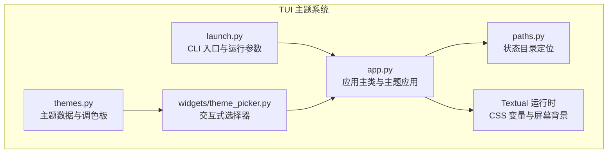
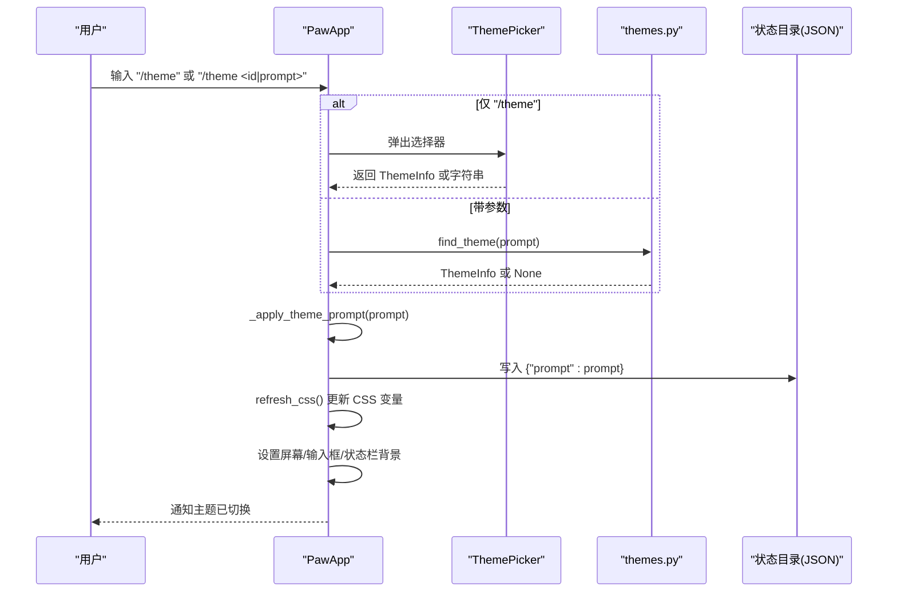
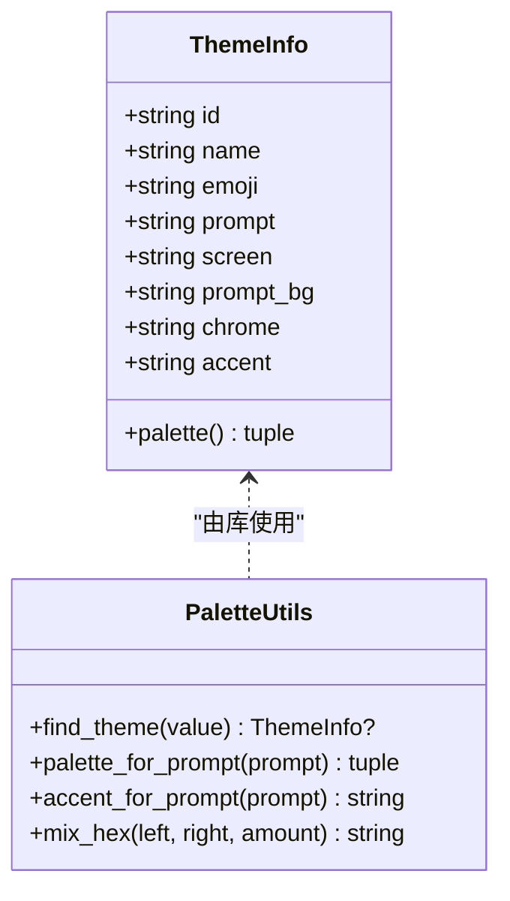
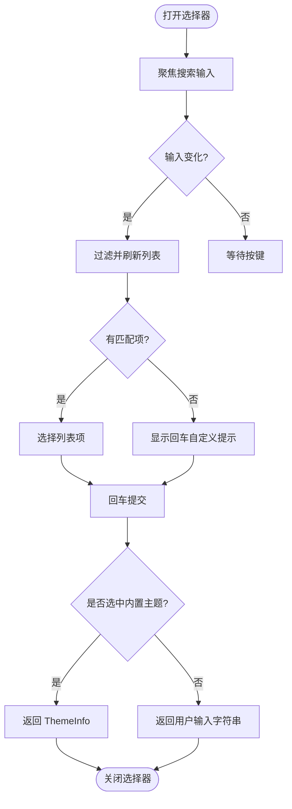
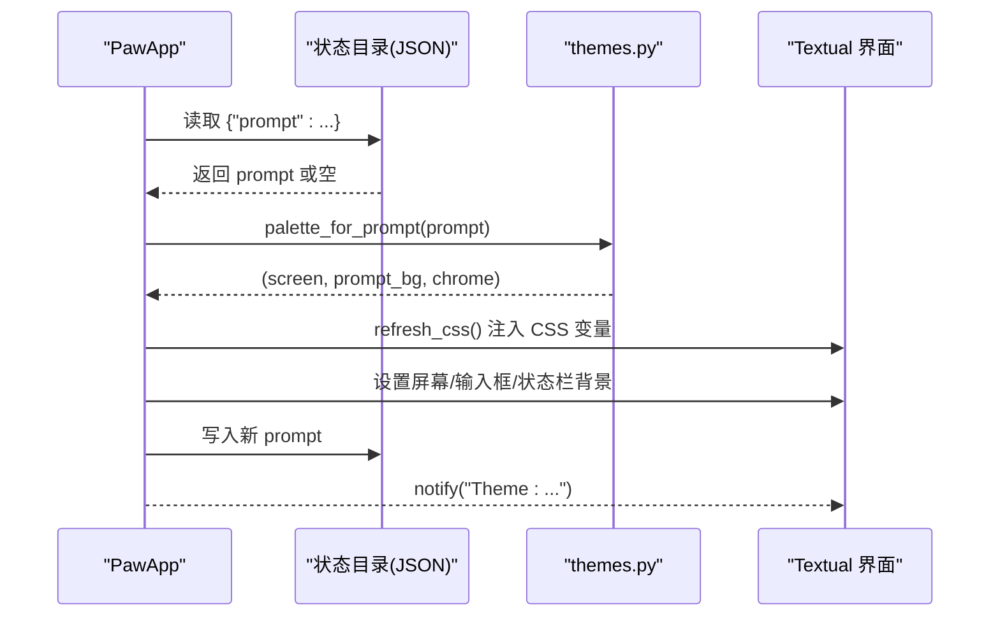
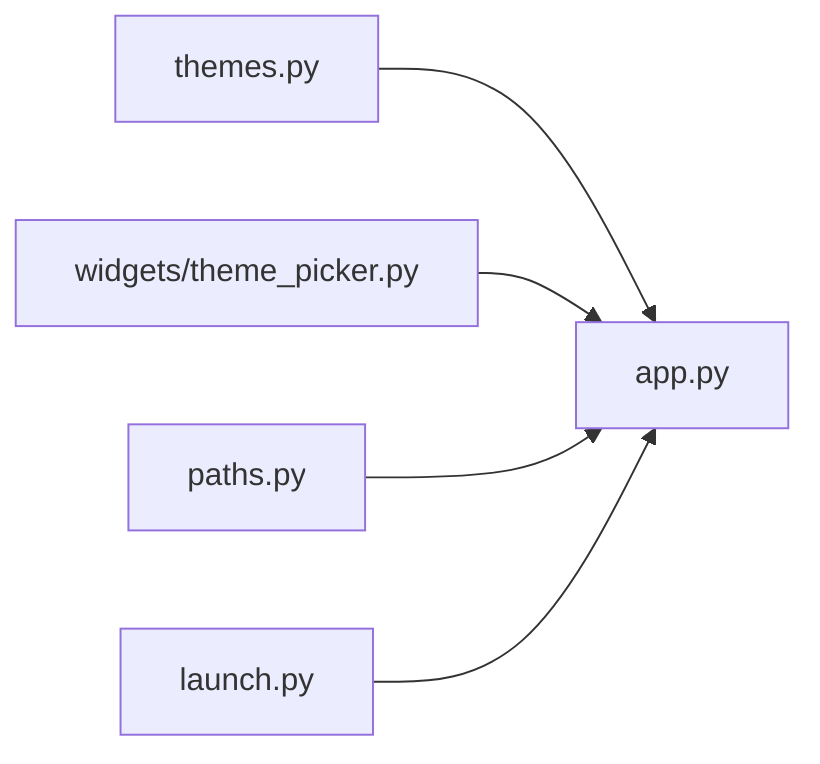

# 主题系统与外观定制

<cite>
**本文引用的文件**
- [themes.py](file://src/qwenpaw/cli/tui/themes.py)
- [theme_picker.py](file://src/qwenpaw/cli/tui/widgets/theme_picker.py)
- [app.py](file://src/qwenpaw/cli/tui/app.py)
- [launch.py](file://src/qwenpaw/cli/tui/launch.py)
- [paths.py](file://src/qwenpaw/cli/tui/paths.py)
</cite>

## 目录
1. [简介](#简介)
2. [项目结构](#项目结构)
3. [核心组件](#核心组件)
4. [架构总览](#架构总览)
5. [详细组件分析](#详细组件分析)
6. [依赖关系分析](#依赖关系分析)
7. [性能与体验特性](#性能与体验特性)
8. [故障排查指南](#故障排查指南)
9. [结论](#结论)
10. [附录：内置主题清单与使用方式](#附录内置主题清单与使用方式)

## 简介
本文件系统化梳理 QwenPaw TUI 的主题系统，覆盖以下方面：
- 内置主题库的完整列表与视觉效果说明（颜色方案、字体配置、布局选项）
- 主题选择器的使用方法（命令行切换、交互式选择、动态预览）
- CSS 样式定制机制（变量定义、组件样式覆盖、动画效果）
- 主题持久化存储、配置文件格式与迁移兼容性
- 暗色/亮色模式、高对比度支持与无障碍访问优化建议
- 自定义主题开发指南与发布规范

## 项目结构
TUI 主题系统位于 CLI/TUI 模块中，关键文件如下：
- themes.py：主题数据模型与内置主题库
- widgets/theme_picker.py：交互式主题选择器
- app.py：应用主循环、主题加载与应用、CSS 变量注入
- launch.py：TUI 启动入口与参数解析
- paths.py：状态目录定位（用于持久化）

图表来源
- [themes.py:1-176](file://src/qwenpaw/cli/tui/themes.py#L1-L176)
- [theme_picker.py:1-144](file://src/qwenpaw/cli/tui/widgets/theme_picker.py#L1-L144)
- [app.py:1-1452](file://src/qwenpaw/cli/tui/app.py#L1-L1452)
- [launch.py:1-232](file://src/qwenpaw/cli/tui/launch.py#L1-L232)
- [paths.py:1-35](file://src/qwenpaw/cli/tui/paths.py#L1-L35)

章节来源
- [themes.py:1-176](file://src/qwenpaw/cli/tui/themes.py#L1-L176)
- [theme_picker.py:1-144](file://src/qwenpaw/cli/tui/widgets/theme_picker.py#L1-L144)
- [app.py:1-1452](file://src/qwenpaw/cli/tui/app.py#L1-L1452)
- [launch.py:1-232](file://src/qwenpaw/cli/tui/launch.py#L1-L232)
- [paths.py:1-35](file://src/qwenpaw/cli/tui/paths.py#L1-L35)

## 核心组件
- 主题数据模型与调色板生成
  - 主题信息包含 id、名称、表情、提示词、屏幕底色、输入框底色、状态栏底色、强调色等。
  - 提供按提示词查找或哈希稳定选择主题的函数，以及 HEX 颜色混合工具。
- 交互式主题选择器
  - 支持搜索内置主题、回车选择或提交自定义提示词以生成调色板。
- 应用层主题应用
  - 启动时加载已保存的主题提示词；应用后更新屏幕、消息气泡边框变量、输入框与状态栏背景。
  - 将主题提示词持久化到状态目录下的 JSON 文件。
- 启动与命令集成
  - 通过 /theme 子命令打开选择器或直接应用指定主题；帮助文本列出所有可用主题快捷命令。

章节来源
- [themes.py:1-176](file://src/qwenpaw/cli/tui/themes.py#L1-L176)
- [theme_picker.py:1-144](file://src/qwenpaw/cli/tui/widgets/theme_picker.py#L1-L144)
- [app.py:806-870](file://src/qwenpaw/cli/tui/app.py#L806-L870)
- [app.py:1173-1206](file://src/qwenpaw/cli/tui/app.py#L1173-L1206)
- [launch.py:168-196](file://src/qwenpaw/cli/tui/launch.py#L168-L196)

## 架构总览
TUI 主题系统围绕“提示词驱动”的调色板策略构建：用户输入或选择的主题提示词被映射为稳定的颜色组合，并应用到界面元素与 CSS 变量中。

图表来源
- [app.py:636-665](file://src/qwenpaw/cli/tui/app.py#L636-L665)
- [app.py:841-865](file://src/qwenpaw/cli/tui/app.py#L841-L865)
- [theme_picker.py:85-108](file://src/qwenpaw/cli/tui/widgets/theme_picker.py#L85-L108)
- [themes.py:131-157](file://src/qwenpaw/cli/tui/themes.py#L131-L157)

## 详细组件分析

### 主题数据与调色板（themes.py）
- 数据结构
  - 主题信息对象包含 id、name、emoji、prompt、screen、prompt_bg、chrome、accent 等字段，并提供 palette 属性返回三元组（屏幕、输入框、状态栏）。
- 主题库
  - 内置多个主题，每个主题具有独特的视觉风格与强调色。
- 查找与解析
  - 支持按 id 或 name 精确匹配；若未命中，则基于提示词的字符和进行稳定哈希选择，确保相同提示词始终得到相同主题。
- 颜色工具
  - 提供 HEX 颜色混合函数，便于在应用层计算衍生色（如气泡边框）。

图表来源
- [themes.py:9-24](file://src/qwenpaw/cli/tui/themes.py#L9-L24)
- [themes.py:131-176](file://src/qwenpaw/cli/tui/themes.py#L131-L176)

章节来源
- [themes.py:1-176](file://src/qwenpaw/cli/tui/themes.py#L1-L176)

### 交互式主题选择器（widgets/theme_picker.py）
- 功能要点
  - 模态窗口，顶部标题、搜索输入框、主题列表、底部帮助提示。
  - 支持键盘导航（上下移动、回车选择、Esc 取消）。
  - 当无匹配项时，提示可通过回车提交自定义提示词。
- 交互流程
  - 输入变化时刷新列表；选中内置主题则返回对应 ThemeInfo；否则返回用户输入的字符串作为自定义提示词。

图表来源
- [theme_picker.py:55-108](file://src/qwenpaw/cli/tui/widgets/theme_picker.py#L55-L108)
- [theme_picker.py:117-144](file://src/qwenpaw/cli/tui/widgets/theme_picker.py#L117-L144)

章节来源
- [theme_picker.py:1-144](file://src/qwenpaw/cli/tui/widgets/theme_picker.py#L1-L144)

### 应用层主题应用与持久化（app.py）
- 启动加载
  - 从状态目录读取 JSON 中的 prompt 字段；若不存在或读取失败，回退到环境变量或默认值。
- 应用主题
  - 调用调色板函数获取三色组合；刷新 CSS 变量（气泡边框色），设置屏幕背景、输入框背景、状态栏背景，并更新欢迎消息配色。
  - 将新的 prompt 写回 JSON 文件实现持久化。
- 命令处理
  - /theme 不带参数打开选择器；带参数则尝试精确匹配或作为自定义提示词应用。
  - 帮助文本列出所有内置主题的快速命令。

图表来源
- [app.py:806-870](file://src/qwenpaw/cli/tui/app.py#L806-L870)
- [app.py:1173-1206](file://src/qwenpaw/cli/tui/app.py#L1173-L1206)

章节来源
- [app.py:806-870](file://src/qwenpaw/cli/tui/app.py#L806-L870)
- [app.py:1173-1206](file://src/qwenpaw/cli/tui/app.py#L1173-L1206)

### 启动入口与参数（launch.py）
- 提供 tui 子命令，支持 --agent、--resume 与可选项目目录参数。
- 构建传输层并运行 PawApp，结束后输出恢复会话的提示命令。

章节来源
- [launch.py:168-196](file://src/qwenpaw/cli/tui/launch.py#L168-L196)
- [launch.py:199-232](file://src/qwenpaw/cli/tui/launch.py#L199-L232)

### 状态目录与持久化路径（paths.py）
- 根据平台与环境变量确定状态目录位置，自动创建目录。
- 主题配置 JSON 文件保存在该目录下。

章节来源
- [paths.py:15-29](file://src/qwenpaw/cli/tui/paths.py#L15-L29)

## 依赖关系分析
- 组件耦合
  - app.py 依赖 themes.py 的调色板与查找函数；依赖 theme_picker.py 的交互选择器；依赖 paths.py 的状态目录。
  - theme_picker.py 直接引用 THEME_GALLERY 与 ThemeInfo。
- 外部依赖
  - Textual 运行时负责渲染与事件分发；JSON 文件用于持久化。
- 潜在循环
  - 当前结构无循环依赖；主题数据与应用逻辑解耦良好。

图表来源
- [themes.py:1-176](file://src/qwenpaw/cli/tui/themes.py#L1-L176)
- [theme_picker.py:1-144](file://src/qwenpaw/cli/tui/widgets/theme_picker.py#L1-L144)
- [app.py:1-1452](file://src/qwenpaw/cli/tui/app.py#L1-L1452)
- [launch.py:1-232](file://src/qwenpaw/cli/tui/launch.py#L1-L232)
- [paths.py:1-35](file://src/qwenpaw/cli/tui/paths.py#L1-L35)

章节来源
- [themes.py:1-176](file://src/qwenpaw/cli/tui/themes.py#L1-L176)
- [theme_picker.py:1-144](file://src/qwenpaw/cli/tui/widgets/theme_picker.py#L1-L144)
- [app.py:1-1452](file://src/qwenpaw/cli/tui/app.py#L1-L1452)
- [launch.py:1-232](file://src/qwenpaw/cli/tui/launch.py#L1-L232)
- [paths.py:1-35](file://src/qwenpaw/cli/tui/paths.py#L1-L35)

## 性能与体验特性
- 静态背景与透明气泡
  - 屏幕背景采用静态色，消息气泡透明并以圆角边框区分层次，避免每帧重绘导致的闪烁与性能损耗。
- CSS 变量动态更新
  - 主题切换时通过 refresh_css 重新计算气泡边框变量，保持样式声明式且可响应主题变化。
- 键盘友好
  - 选择器支持键盘导航与回车确认，提升效率与无障碍性。

章节来源
- [app.py:141-202](file://src/qwenpaw/cli/tui/app.py#L141-L202)
- [app.py:814-839](file://src/qwenpaw/cli/tui/app.py#L814-L839)
- [theme_picker.py:22-49](file://src/qwenpaw/cli/tui/widgets/theme_picker.py#L22-L49)

## 故障排查指南
- 主题未生效
  - 检查状态目录是否存在及 JSON 文件是否可读；确认 PAW_BACKGROUND_PROMPT 环境变量是否覆盖默认值。
- 选择器无法打开
  - 确认 /theme 命令未被其他中间件拦截；检查终端对模态窗口的支持。
- 自定义提示词无效
  - 若提示词无法精确匹配，系统将基于哈希选择最接近的内置主题；如需特定效果，建议使用内置主题 id。

章节来源
- [app.py:806-870](file://src/qwenpaw/cli/tui/app.py#L806-L870)
- [paths.py:15-29](file://src/qwenpaw/cli/tui/paths.py#L15-L29)

## 结论
QwenPaw TUI 的主题系统以“提示词驱动”为核心，结合内置主题库与交互式选择器，实现了灵活、直观且可持久化的外观定制。通过 CSS 变量与静态背景策略，系统在视觉一致性与性能之间取得平衡。未来可扩展更多主题与高级样式覆盖能力，同时继续完善无障碍与高对比度支持。

## 附录：内置主题清单与使用方式

### 内置主题列表
以下为内置主题及其视觉效果关键词（来自主题库）：
- original：温暖深色控制台，品牌橙色强调
- funky：霓虹派对，粉紫强调
- cyberpunk：赛博巷弄，青色激光雨氛围
- greek：大理石神谕庭院，金色强调
- zen：抹茶禅园，柔和绿色强调
- medieval：中世纪酒馆火把，暖橙强调
- jurassic：侏罗纪雨林终端，荧光绿强调
- space：外星母舰，紫色强调
- mars：火星入侵街机，红色强调
- ocean：深海合成波珊瑚礁，青绿强调

章节来源
- [themes.py:26-128](file://src/qwenpaw/cli/tui/themes.py#L26-L128)

### 使用方式
- 命令行切换
  - 在 TUI 中输入 /theme gallery 打开选择器；或 /theme <主题 id> 直接应用。
  - 示例：/theme original、/theme cyberpunk。
- 交互式选择
  - 打开选择器后，可在搜索框输入关键词过滤主题；回车选择内置主题，或提交自定义提示词生成调色板。
- 动态预览
  - 选择器列表项展示主题表情、名称与快捷命令；选择后立即应用并通知用户。

章节来源
- [app.py:636-665](file://src/qwenpaw/cli/tui/app.py#L636-L665)
- [app.py:1173-1206](file://src/qwenpaw/cli/tui/app.py#L1173-L1206)
- [theme_picker.py:55-108](file://src/qwenpaw/cli/tui/widgets/theme_picker.py#L55-L108)

### CSS 样式定制机制
- 变量定义
  - 应用层通过 get_css_variables 注入 bubble-border 与 bubble-user-border 两个变量，基于调色板与颜色混合算法计算。
- 组件样式覆盖
  - 屏幕背景、输入框背景、状态栏背景在应用层直接设置；消息气泡透明并通过边框变量着色。
- 动画效果
  - 主题切换不触发背景动画，避免重绘开销；欢迎消息随主题更新配色。

章节来源
- [app.py:814-839](file://src/qwenpaw/cli/tui/app.py#L814-L839)
- [app.py:141-202](file://src/qwenpaw/cli/tui/app.py#L141-L202)

### 主题持久化存储与配置文件格式
- 存储位置
  - 状态目录由 paths.py 决定，遵循平台默认与环境变量；主题配置 JSON 文件位于该目录。
- 文件格式
  - JSON 对象包含单个键 prompt，值为字符串（主题 id 或自定义提示词）。
- 迁移兼容性
  - 启动时若读取失败或文件缺失，回退到环境变量或默认值，保证向后兼容。

章节来源
- [paths.py:15-29](file://src/qwenpaw/cli/tui/paths.py#L15-L29)
- [app.py:806-870](file://src/qwenpaw/cli/tui/app.py#L806-L870)

### 暗色/亮色模式、高对比度与无障碍
- 暗色/亮色模式
  - 当前主题库均为暗色系；可通过自定义提示词生成更浅的配色方案。
- 高对比度支持
  - 建议在自定义提示词中使用高对比度词汇（如“高对比度终端”），以获得更强的明暗差异。
- 无障碍访问优化
  - 选择器支持键盘导航与焦点管理；建议为自定义主题提供清晰的名称与描述，便于检索与识别。

章节来源
- [theme_picker.py:22-49](file://src/qwenpaw/cli/tui/widgets/theme_picker.py#L22-L49)
- [themes.py:131-157](file://src/qwenpaw/cli/tui/themes.py#L131-L157)

### 自定义主题开发指南与发布规范
- 开发指南
  - 使用 /theme <自定义提示词> 快速生成调色板；通过反复调整提示词获得期望的视觉效果。
  - 参考内置主题的 prompt 风格，加入场景、材质、光影等关键词以提升稳定性。
- 发布规范
  - 为自定义主题命名清晰，附带简短描述；在团队内共享常用提示词，形成内部主题库。
  - 若需长期复用，可将提示词记录于文档或脚本中，便于复现与迁移。

章节来源
- [app.py:636-665](file://src/qwenpaw/cli/tui/app.py#L636-L665)
- [themes.py:131-157](file://src/qwenpaw/cli/tui/themes.py#L131-L157)