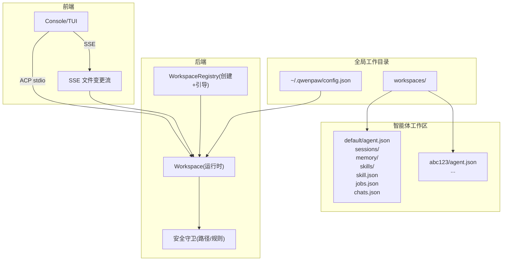
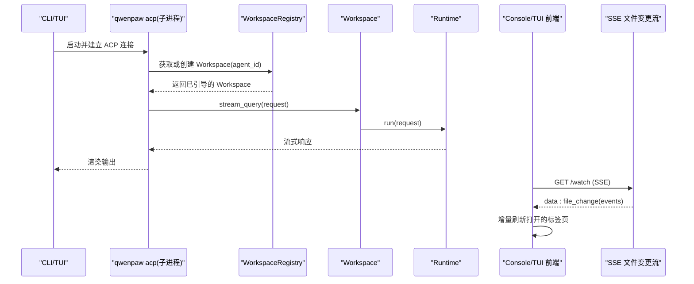
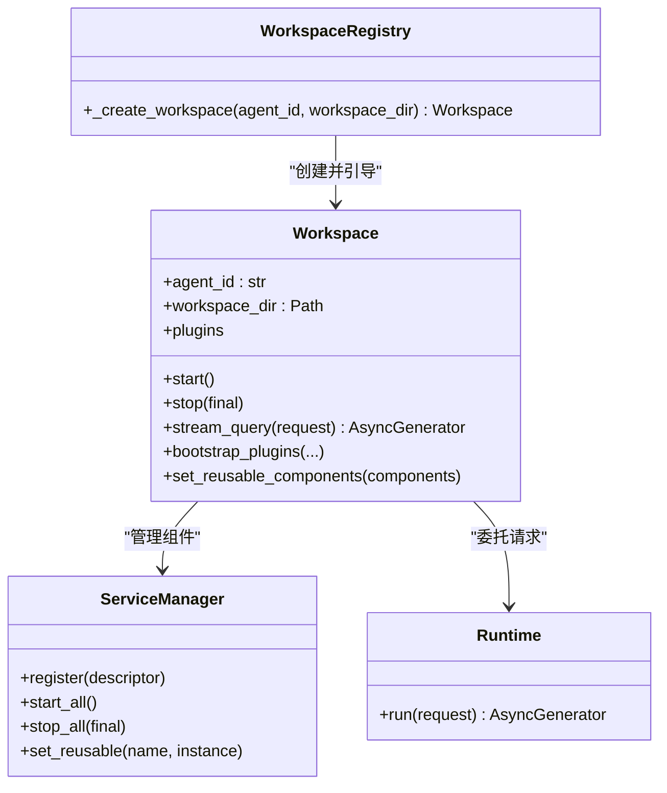
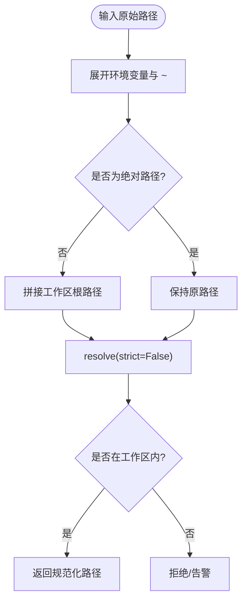
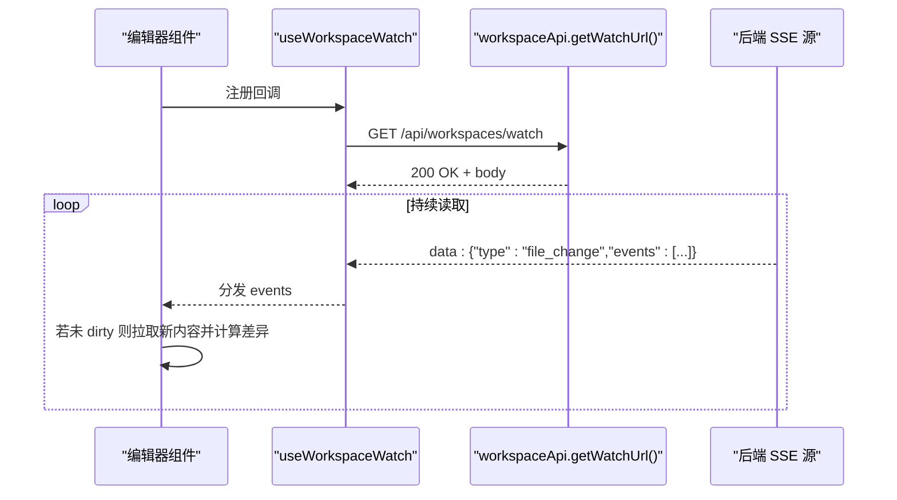
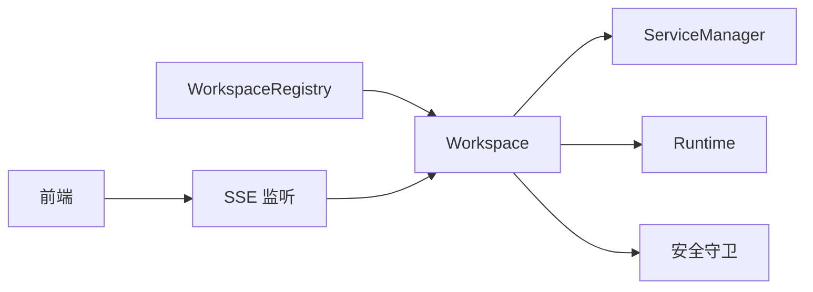

# 工作空间集成与项目管理

<cite>
**本文引用的文件**   
- [workspace.py](file://src/qwenpaw/app/workspace/workspace.py)
- [workspace_registry.py](file://src/qwenpaw/app/workspace_registry.py)
- [workspace_manager.py](file://src/qwenpaw/services/workspace_manager/workspace_manager.py)
- [workspace_service.py](file://src/qwenpaw/agents/skill_system/workspace_service.py)
- [constant.py](file://src/qwenpaw/constant.py)
- [rule_guardian.py](file://src/qwenpaw/security/tool_guard/guardians/rule_guardian.py)
- [file_guardian.py](file://src/qwenpaw/security/tool_guard/guardians/file_guardian.py)
- [restore_helpers.py](file://src/qwenpaw/backup/_ops/restore_helpers.py)
- [useWorkspaceWatch.ts](file://console/src/hooks/useWorkspaceWatch.ts)
- [TabbedEditor.tsx](file://console/src/pages/Coding/TabbedEditor.tsx)
- [tui/__init__.py](file://src/qwenpaw/cli/tui/__init__.py)
- [main.py](file://src/qwenpaw/cli/main.py)
- [config.en.md](file://website/public/docs/config.en.md)
- [security.en.md](file://website/public/docs/security.en.md)
- [test_agents_workspace_initialization.py](file://tests/unit/app/test_agents_workspace_initialization.py)
</cite>

## 目录
1. [简介](#简介)
2. [项目结构](#项目结构)
3. [核心组件](#核心组件)
4. [架构总览](#架构总览)
5. [详细组件分析](#详细组件分析)
6. [依赖关系分析](#依赖关系分析)
7. [性能考虑](#性能考虑)
8. [故障排除指南](#故障排除指南)
9. [结论](#结论)
10. [附录](#附录)

## 简介
本文件面向 QwenPaw TUI 与工作空间集成的开发者与使用者，系统性说明：
- 工作空间自动发现、目录检测与上下文感知
- 文件路径解析、相对路径处理与跨平台兼容
- 工作空间配置管理（全局与智能体级）、环境变量注入与项目特定设置
- 文件监听机制、热重载支持与增量更新
- 多项目切换、工作空间模板与快速启动选项
- 最佳实践、性能优化建议与常见问题排查

## 项目结构
QwenPaw 的工作空间以“全局工作目录 + 多智能体工作区”组织。默认工作目录为 ~/.qwenpaw，每个智能体对应 workspaces/{agent_id} 下的独立目录，包含会话、记忆、技能、定时任务等数据。TUI 通过 ACP 子进程驱动同一后端，复用相同的记忆、技能与工具。

图表来源
- [workspace.py:39-138](file://src/qwenpaw/app/workspace/workspace.py#L39-L138)
- [workspace_registry.py:24-46](file://src/qwenpaw/app/workspace_registry.py#L24-L46)
- [constant.py:251-271](file://src/qwenpaw/constant.py#L251-L271)
- [useWorkspaceWatch.ts:1-148](file://console/src/hooks/useWorkspaceWatch.ts#L1-L148)

章节来源
- [config.en.md:16-78](file://website/public/docs/config.en.md#L16-L78)
- [constant.py:251-271](file://src/qwenpaw/constant.py#L251-L271)

## 核心组件
- Workspace：封装单个智能体的完整运行时，负责服务注册、启动/停止、请求路由到 Runtime。
- WorkspaceRegistry：在创建 Workspace 时注入内置插件与 AppServices 引用，实现“即插即用”的引导流程。
- WorkspaceManager：定义工作区资源边界与沙箱契约（接口），具体实现由后续工作流提供。
- SkillService：工作区维度的技能生命周期管理（创建、导入、启用/禁用、通道路由、配置持久化）。
- 安全守卫：路径规范化、工作区边界检查、敏感文件保护与危险命令检测。
- 前端监听：SSE 单例订阅工作区文件变更，编辑器增量刷新。

章节来源
- [workspace.py:39-138](file://src/qwenpaw/app/workspace/workspace.py#L39-L138)
- [workspace_registry.py:24-46](file://src/qwenpaw/app/workspace_registry.py#L24-L46)
- [workspace_manager.py:24-59](file://src/qwenpaw/services/workspace_manager/workspace_manager.py#L24-L59)
- [workspace_service.py:88-105](file://src/qwenpaw/agents/skill_system/workspace_service.py#L88-L105)
- [rule_guardian.py:88-173](file://src/qwenpaw/security/tool_guard/guardians/rule_guardian.py#L88-L173)
- [file_guardian.py:76-78](file://src/qwenpaw/security/tool_guard/guardians/file_guardian.py#L76-L78)
- [useWorkspaceWatch.ts:1-148](file://console/src/hooks/useWorkspaceWatch.ts#L1-L148)

## 架构总览
下图展示从 CLI/TUI 到工作区运行时的关键调用链，以及文件变更的前端监听与增量更新。

图表来源
- [tui/__init__.py:1-24](file://src/qwenpaw/cli/tui/__init__.py#L1-L24)
- [workspace.py:255-267](file://src/qwenpaw/app/workspace/workspace.py#L255-L267)
- [workspace_registry.py:37-46](file://src/qwenpaw/app/workspace_registry.py#L37-L46)
- [useWorkspaceWatch.ts:42-99](file://console/src/hooks/useWorkspaceWatch.ts#L42-L99)

## 详细组件分析

### 工作区生命周期与服务编排
- 初始化：Workspace 构造时创建本地工作目录、注册 ServiceManager 与本地工作区代理。
- 引导：WorkspaceRegistry 在创建后调用 bootstrap_plugins，注入内置工具、钩子、命令、模式等。
- 启动：加载 agent.json，执行历史迁移，按优先级顺序启动内存、驱动、聊天、频道、定时任务、配置监听等服务。
- 请求：stream_query 将请求交给 Runtime 执行，支持异步流式返回。
- 停止：stop(final) 控制是否释放可复用组件，用于热重载场景。

图表来源
- [workspace.py:39-138](file://src/qwenpaw/app/workspace/workspace.py#L39-L138)
- [workspace.py:255-267](file://src/qwenpaw/app/workspace/workspace.py#L255-L267)
- [workspace.py:459-500](file://src/qwenpaw/app/workspace/workspace.py#L459-L500)
- [workspace_registry.py:37-46](file://src/qwenpaw/app/workspace_registry.py#L37-L46)

章节来源
- [workspace.py:39-138](file://src/qwenpaw/app/workspace/workspace.py#L39-L138)
- [workspace.py:255-267](file://src/qwenpaw/app/workspace/workspace.py#L255-L267)
- [workspace.py:459-500](file://src/qwenpaw/app/workspace/workspace.py#L459-L500)
- [workspace_registry.py:24-46](file://src/qwenpaw/app/workspace_registry.py#L24-L46)

### 工作区配置与环境变量
- 全局配置：config.json 存放模型提供者、环境列表、智能体清单等。
- 智能体配置：workspaces/{agent_id}/agent.json 存放该工作区的通道、心跳、工具、技能、MCP 等设置。
- 环境变量：应用启动时加载 envs.json，所有工具与子进程可通过 os.environ 读取。
- 工作目录：通过 QWENPAW_WORKING_DIR 覆盖默认工作目录；MEMORY_DIR、BACKUP_DIR、PLUGINS_DIR、MODELS_DIR 均基于 WORKING_DIR 派生。

章节来源
- [config.en.md:133-169](file://website/public/docs/config.en.md#L133-L169)
- [constant.py:251-271](file://src/qwenpaw/constant.py#L251-L271)

### 文件路径解析与跨平台兼容
- 路径规范化：支持环境变量展开、波浪号扩展、相对路径转绝对路径、符号链接与 .. 解析。
- 工作区边界：Windows 不同盘符直接判定为越界；Unix/macOS 使用 relative_to 校验。
- 工作区根：优先取当前工作区目录，否则回退至全局工作目录或当前工作目录。

图表来源
- [rule_guardian.py:104-173](file://src/qwenpaw/security/tool_guard/guardians/rule_guardian.py#L104-L173)
- [file_guardian.py:76-78](file://src/qwenpaw/security/tool_guard/guardians/file_guardian.py#L76-L78)

章节来源
- [rule_guardian.py:88-173](file://src/qwenpaw/security/tool_guard/guardians/rule_guardian.py#L88-L173)
- [file_guardian.py:76-78](file://src/qwenpaw/security/tool_guard/guardians/file_guardian.py#L76-L78)

### 工作区配置管理与 .qwenpaw 约定
- 工作区模板：新建工作区会生成 sessions、memory、skills、jobs.json、chats.json 等运行时兼容文件。
- 技能清单：每个工作区维护 skill.json 作为运行时状态（enabled、channels、config、metadata）的权威来源。
- 恢复与迁移：备份恢复时会重写 agent.json 中的 workspace_dir，确保跨设备/用户迁移后路径一致。

章节来源
- [test_agents_workspace_initialization.py:18-54](file://tests/unit/app/test_agents_workspace_initialization.py#L18-L54)
- [workspace_service.py:88-105](file://src/qwenpaw/agents/skill_system/workspace_service.py#L88-L105)
- [restore_helpers.py:112-142](file://src/qwenpaw/backup/_ops/restore_helpers.py#L112-L142)

### 文件监听、热重载与增量更新
- 前端 SSE 单例：useWorkspaceWatch 维护唯一连接，事件广播给所有订阅者，断线指数退避重连。
- 编辑器增量刷新：当打开标签页未修改且非撤销写入中，收到 added/modified 事件后拉取最新内容并触发 diff。
- 服务端侧：工作区服务层暴露 watch 能力（SSE），供前端消费。

图表来源
- [useWorkspaceWatch.ts:42-99](file://console/src/hooks/useWorkspaceWatch.ts#L42-L99)
- [TabbedEditor.tsx:770-796](file://console/src/pages/Coding/TabbedEditor.tsx#L770-L796)

章节来源
- [useWorkspaceWatch.ts:1-148](file://console/src/hooks/useWorkspaceWatch.ts#L1-L148)
- [TabbedEditor.tsx:770-796](file://console/src/pages/Coding/TabbedEditor.tsx#L770-L796)

### 多项目切换、工作空间模板与快速启动
- 多项目切换：通过 WorkspaceRegistry 按需获取指定 agent_id 的工作区实例，支持懒加载与热重载。
- 快速启动：CLI 支持 bare 参数作为项目目录传入，内部识别为 TUI 启动并绑定 Coding 模式上下文。
- 模板与初始化：新建工作区自动生成运行时所需目录与空 JSON 骨架，便于立即开始。

章节来源
- [workspace_registry.py:37-46](file://src/qwenpaw/app/workspace_registry.py#L37-L46)
- [main.py:67-76](file://src/qwenpaw/cli/main.py#L67-L76)
- [test_agents_workspace_initialization.py:18-54](file://tests/unit/app/test_agents_workspace_initialization.py#L18-L54)

### 安全与权限边界
- 文件守卫：默认保护敏感目录（如密钥目录、SSH 目录等），合并去重并支持动态 reload。
- 规则守卫：对危险命令进行模式匹配与目标提取，结合工作区边界检查防止越权访问。
- 配置生效：多数安全配置无需重启即可生效，环境变量可覆盖配置文件值。

章节来源
- [file_guardian.py:45-78](file://src/qwenpaw/security/tool_guard/guardians/file_guardian.py#L45-L78)
- [rule_guardian.py:76-194](file://src/qwenpaw/security/tool_guard/guardians/rule_guardian.py#L76-L194)
- [security.en.md:847-904](file://website/public/docs/security.en.md#L847-L904)

## 依赖关系分析
- 低耦合：Workspace 通过 ServiceManager 声明式注册服务，降低硬编码依赖。
- 可扩展：WorkspaceRegistry 仅负责引导阶段注入，不影响运行时行为。
- 安全前置：路径与安全策略在服务执行前拦截，避免越权操作。
- 前后端解耦：SSE 单向推送，前端无侵入地订阅变更。

图表来源
- [workspace_registry.py:24-46](file://src/qwenpaw/app/workspace_registry.py#L24-L46)
- [workspace.py:269-425](file://src/qwenpaw/app/workspace/workspace.py#L269-L425)
- [useWorkspaceWatch.ts:1-148](file://console/src/hooks/useWorkspaceWatch.ts#L1-L148)

## 性能考虑
- 并发初始化：部分服务支持 concurrent_init，缩短启动时间。
- 增量更新：SSE 单例与编辑器只针对打开标签页做增量刷新，避免全量重绘。
- 资源复用：set_reusable_components 允许在热重载时复用内存/聊天管理器，减少重建开销。
- 文件读取限制：文档记录最大文件读取大小与预分配优化，降低大文件带来的内存压力。

章节来源
- [workspace.py:316-399](file://src/qwenpaw/app/workspace/workspace.py#L316-L399)
- [workspace.py:427-458](file://src/qwenpaw/app/workspace/workspace.py#L427-L458)
- [useWorkspaceWatch.ts:28-40](file://console/src/hooks/useWorkspaceWatch.ts#L28-L40)

## 故障排除指南
- 工作区无法启动
  - 检查 agent.json 是否存在且格式正确；确认工作区目录具备读写权限。
  - 查看日志中关于“Failed to start agent instance”的错误信息。
- 文件变更不生效
  - 确认 SSE 连接正常（控制台网络面板观察 /api/workspaces/watch）。
  - 检查编辑器标签页是否处于 dirty 或存在撤销写入中，导致跳过刷新。
- 路径越界被拒绝
  - 确认路径规范化逻辑是否正确展开环境变量与 ~。
  - Windows 下注意盘符不一致会被视为越界。
- 备份恢复后路径异常
  - 恢复流程会重写 agent.json 中的 workspace_dir，若仍异常，检查磁盘挂载与符号链接。

章节来源
- [workspace.py:493-500](file://src/qwenpaw/app/workspace/workspace.py#L493-L500)
- [useWorkspaceWatch.ts:42-99](file://console/src/hooks/useWorkspaceWatch.ts#L42-L99)
- [TabbedEditor.tsx:770-796](file://console/src/pages/Coding/TabbedEditor.tsx#L770-L796)
- [rule_guardian.py:104-173](file://src/qwenpaw/security/tool_guard/guardians/rule_guardian.py#L104-L173)
- [restore_helpers.py:112-142](file://src/qwenpaw/backup/_ops/restore_helpers.py#L112-L142)

## 结论
QwenPaw 的工作空间体系以“多智能体、模块化服务、安全前置、前后端解耦”为核心设计原则，配合 SSE 增量更新与可复用的运行时组件，提供了高效、稳定且可扩展的项目管理能力。遵循本文的最佳实践与排障建议，可在多项目与复杂环境中获得一致的体验。

## 附录
- 快速启动选项
  - 裸参数 qwenpaw 或 qwenpaw tui 启动 TUI；首个参数为目录时自动进入 Coding 模式上下文。
- 环境变量
  - QWENPAW_WORKING_DIR：覆盖默认工作目录。
  - QWENPAW_SECRET_DIR：覆盖密钥存储目录。
  - 其他：LOG_LEVEL、OPENAPI_DOCS、DESKTOP_PORT 等。
- 安全配置
  - tool_guard、file_guard、skill_scanner 均可在 config.json 中配置，多数项即时生效。

章节来源
- [tui/__init__.py:1-24](file://src/qwenpaw/cli/tui/__init__.py#L1-L24)
- [main.py:67-76](file://src/qwenpaw/cli/main.py#L67-L76)
- [constant.py:223-271](file://src/qwenpaw/constant.py#L223-L271)
- [security.en.md:847-904](file://website/public/docs/security.en.md#L847-L904)