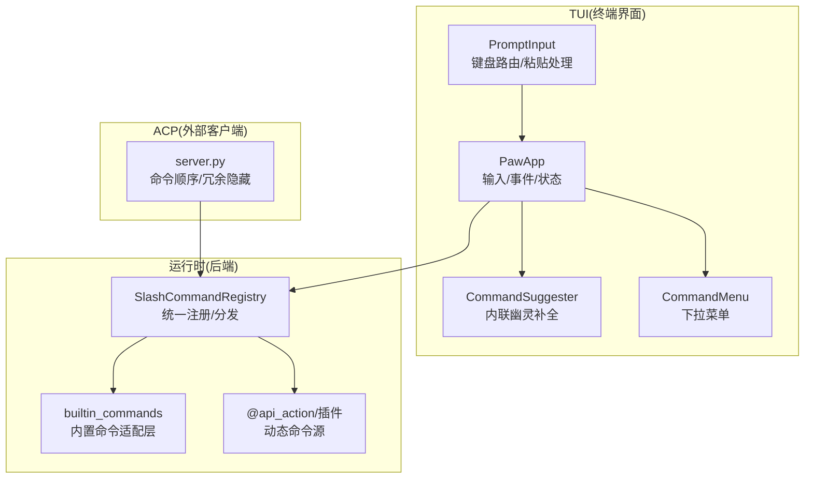
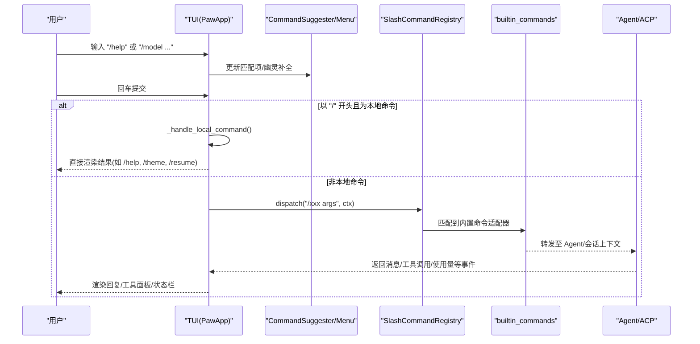
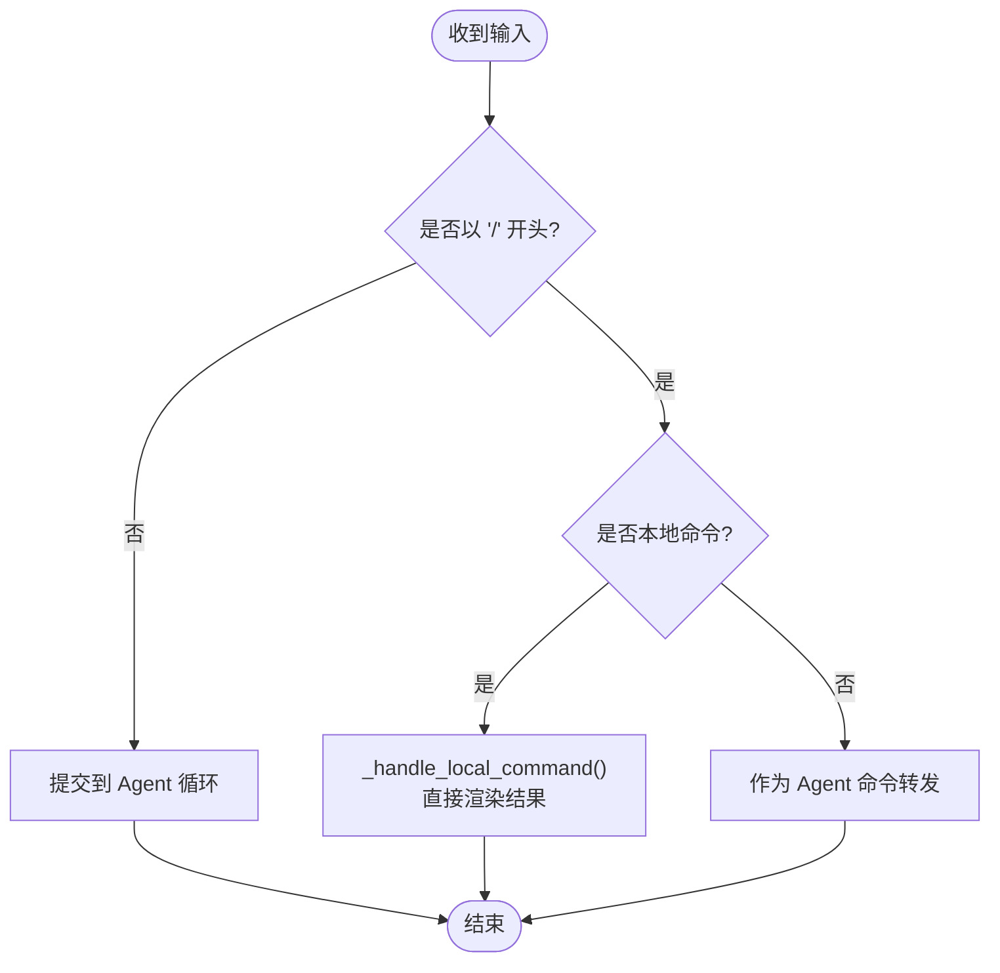
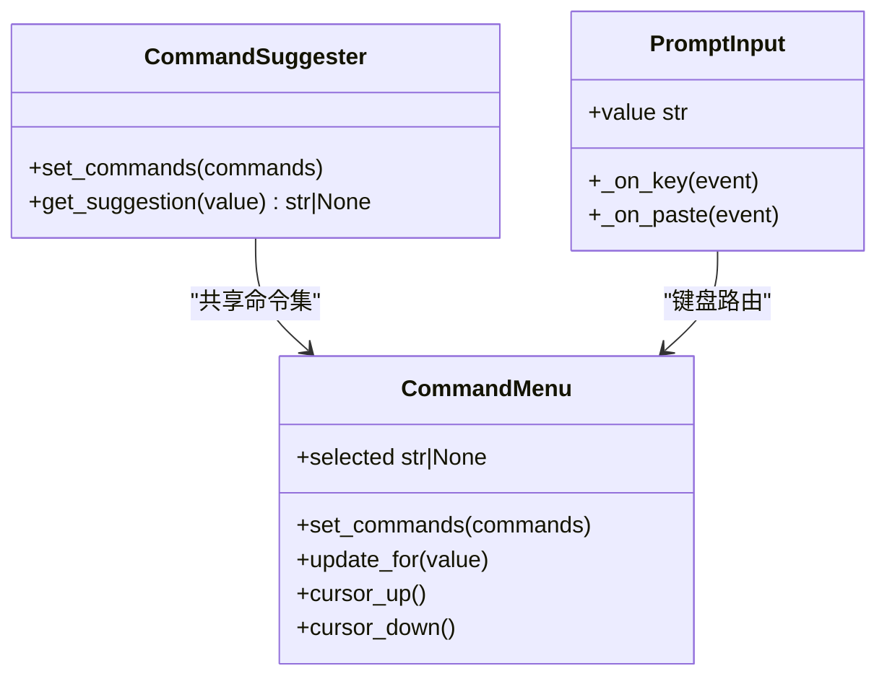
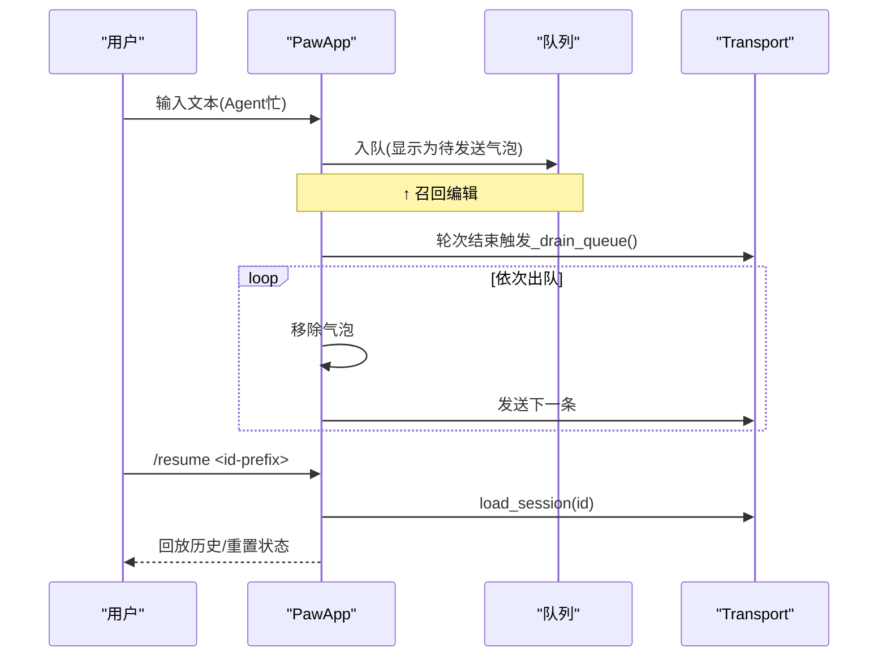
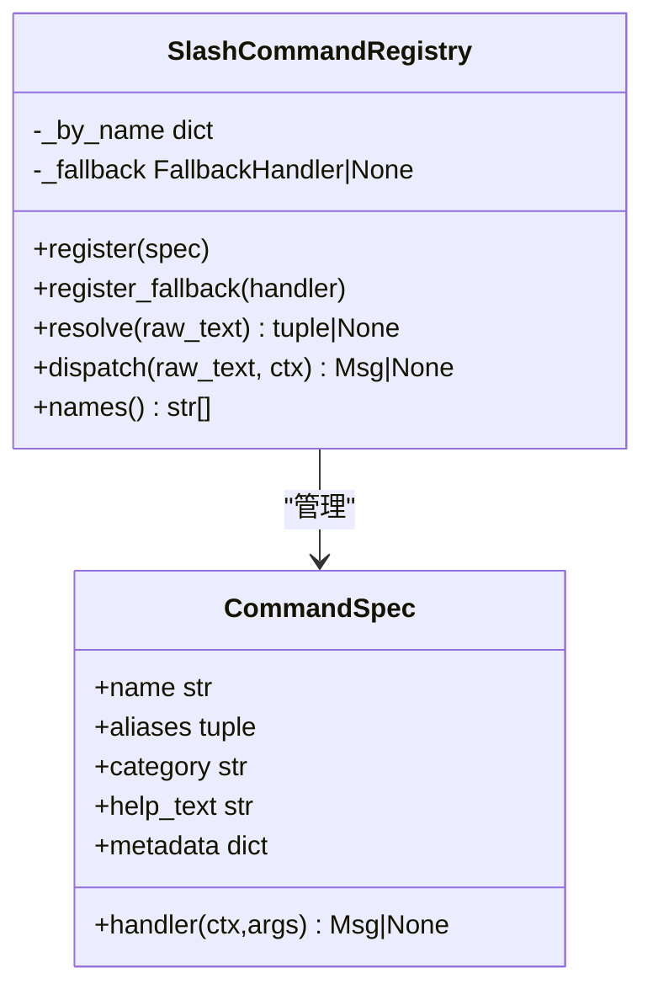
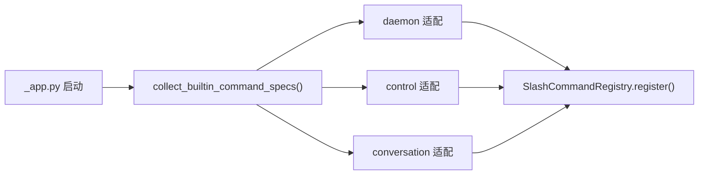
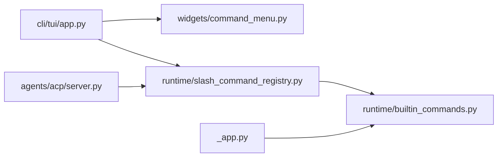

# 斜杠命令系统

<cite>
**本文引用的文件**   
- [src/qwenpaw/cli/tui/app.py](file://src/qwenpaw/cli/tui/app.py)
- [src/qwenpaw/cli/tui/widgets/command_menu.py](file://src/qwenpaw/cli/tui/widgets/command_menu.py)
- [src/qwenpaw/runtime/builtin_commands.py](file://src/qwenpaw/runtime/builtin_commands.py)
- [src/qwenpaw/runtime/slash_command_registry.py](file://src/qwenpaw/runtime/slash_command_registry.py)
- [src/qwenpaw/agents/acp/server.py](file://src/qwenpaw/agents/acp/server.py)
- [src/qwenpaw/app/_app.py](file://src/qwenpaw/app/_app.py)
- [tests/integration/test_plugin_types.py](file://tests/integration/test_plugin_types.py)
</cite>

## 目录
1. [简介](#简介)
2. [项目结构](#项目结构)
3. [核心组件](#核心组件)
4. [架构总览](#架构总览)
5. [详细组件分析](#详细组件分析)
6. [依赖关系分析](#依赖关系分析)
7. [性能与可用性](#性能与可用性)
8. [故障排查指南](#故障排查指南)
9. [结论](#结论)
10. [附录：内置命令清单与用法](#附录内置命令清单与用法)

## 简介
本文件系统化梳理 QwenPaw TUI 的斜杠命令体系，覆盖本地命令与 Agent 命令的分类、处理流程、自动补全与历史记忆、自定义扩展机制、权限控制以及快捷键映射与批量操作支持。文档面向不同技术背景的读者，提供从高层到代码级的完整说明，并附带可视化图示帮助理解。

## 项目结构
TUI 侧负责用户输入解析、菜单与提示、本地命令执行；运行时侧提供统一的斜杠命令注册与分发；ACP 侧对外暴露命令能力与过滤策略；应用启动阶段聚合各类命令源（内置、API Action、插件等）。

图表来源
- [src/qwenpaw/cli/tui/app.py:138-378](file://src/qwenpaw/cli/tui/app.py#L138-L378)
- [src/qwenpaw/cli/tui/widgets/command_menu.py:44-130](file://src/qwenpaw/cli/tui/widgets/command_menu.py#L44-L130)
- [src/qwenpaw/runtime/slash_command_registry.py:45-133](file://src/qwenpaw/runtime/slash_command_registry.py#L45-L133)
- [src/qwenpaw/runtime/builtin_commands.py:632-654](file://src/qwenpaw/runtime/builtin_commands.py#L632-L654)
- [src/qwenpaw/agents/acp/server.py:91-108](file://src/qwenpaw/agents/acp/server.py#L91-L108)

章节来源
- [src/qwenpaw/cli/tui/app.py:138-378](file://src/qwenpaw/cli/tui/app.py#L138-L378)
- [src/qwenpaw/cli/tui/widgets/command_menu.py:44-130](file://src/qwenpaw/cli/tui/widgets/command_menu.py#L44-L130)
- [src/qwenpaw/runtime/slash_command_registry.py:45-133](file://src/qwenpaw/runtime/slash_command_registry.py#L45-L133)
- [src/qwenpaw/runtime/builtin_commands.py:632-654](file://src/qwenpaw/runtime/builtin_commands.py#L632-L654)
- [src/qwenpaw/agents/acp/server.py:91-108](file://src/qwenpaw/agents/acp/server.py#L91-L108)

## 核心组件
- PawApp：TUI 主应用，负责输入解析、本地命令执行、会话恢复、主题切换、与后端传输交互、事件分发与状态更新。
- CommandSuggester/CommandMenu/PromptInput：实现斜杠命令的“内联幽灵补全”和“下拉菜单”，以及键盘导航与回车/Tab 选择。
- SlashCommandRegistry：按名称大小写不敏感地解析命令名与参数，支持别名与回退处理器（如技能回退）。
- builtin_commands：将守护进程、控制台、对话类命令统一包装为 CommandSpec，注册到注册表。
- ACP server：对外暴露命令列表与排序，并对部分命令进行冗余隐藏以避免与 TUI 或原生能力重复。

章节来源
- [src/qwenpaw/cli/tui/app.py:138-378](file://src/qwenpaw/cli/tui/app.py#L138-L378)
- [src/qwenpaw/cli/tui/widgets/command_menu.py:44-130](file://src/qwenpaw/cli/tui/widgets/command_menu.py#L44-L130)
- [src/qwenpaw/runtime/slash_command_registry.py:45-133](file://src/qwenpaw/runtime/slash_command_registry.py#L45-L133)
- [src/qwenpaw/runtime/builtin_commands.py:632-654](file://src/qwenpaw/runtime/builtin_commands.py#L632-L654)
- [src/qwenpaw/agents/acp/server.py:91-108](file://src/qwenpaw/agents/acp/server.py#L91-L108)

## 架构总览
下图展示一次典型的用户输入到命令执行的端到端流程，包括本地命令与 Agent 命令的分流、自动补全与最近会话建议、以及 ACP 的命令可见性控制。

图表来源
- [src/qwenpaw/cli/tui/app.py:457-634](file://src/qwenpaw/cli/tui/app.py#L457-L634)
- [src/qwenpaw/runtime/slash_command_registry.py:108-124](file://src/qwenpaw/runtime/slash_command_registry.py#L108-L124)
- [src/qwenpaw/runtime/builtin_commands.py:632-654](file://src/qwenpaw/runtime/builtin_commands.py#L632-L654)

## 详细组件分析

### 本地命令与 Agent 命令分流
- 本地命令由 TUI 直接处理，无需进入 Agent 循环，包括：
  - /help：显示 TUI 快捷键与命令帮助
  - /resume：恢复历史会话（支持 list/browse 与短 ID 前缀）
  - /theme：打开主题画廊或直接应用主题
  - /inspect：切换深度检查模式（折叠/展开思考与工具面板）
- 其余以 “/” 开头的命令（如 /model、/clear、/compact、/skills 等）将被转发给 Agent 处理。

图表来源
- [src/qwenpaw/cli/tui/app.py:457-634](file://src/qwenpaw/cli/tui/app.py#L457-L634)

章节来源
- [src/qwenpaw/cli/tui/app.py:457-634](file://src/qwenpaw/cli/tui/app.py#L457-L634)

### 自动补全与智能提示
- 内联幽灵补全：根据当前输入前缀，给出最匹配的完整命令行（含参数），例如输入 “/theme cy” 可补全为 “/theme cyberpunk”。
- 下拉菜单：列出所有匹配项，支持上下键导航、Enter/Tab 选择、Esc 关闭。
- 最近会话建议：连接后异步拉取最近 N 个会话，生成 “resume <短ID>” 条目，参与补全与菜单。

图表来源
- [src/qwenpaw/cli/tui/widgets/command_menu.py:44-130](file://src/qwenpaw/cli/tui/widgets/command_menu.py#L44-L130)
- [src/qwenpaw/cli/tui/widgets/command_menu.py:131-263](file://src/qwenpaw/cli/tui/widgets/command_menu.py#L131-L263)
- [src/qwenpaw/cli/tui/app.py:346-378](file://src/qwenpaw/cli/tui/app.py#L346-L378)

章节来源
- [src/qwenpaw/cli/tui/widgets/command_menu.py:44-130](file://src/qwenpaw/cli/tui/widgets/command_menu.py#L44-L130)
- [src/qwenpaw/cli/tui/widgets/command_menu.py:131-263](file://src/qwenpaw/cli/tui/widgets/command_menu.py#L131-L263)
- [src/qwenpaw/cli/tui/app.py:346-378](file://src/qwenpaw/cli/tui/app.py#L346-L378)

### 历史命令记忆与会话恢复
- 队列记忆：当 Agent 忙碌时，新输入会被排队并在轮次结束时自动发送；可通过向上键召回编辑。
- 会话恢复：/resume 支持直接传入短 ID 前缀或完整 ID，也支持 list/browse 打开选择器；恢复后会清空当前转录区并回放历史。

图表来源
- [src/qwenpaw/cli/tui/app.py:560-574](file://src/qwenpaw/cli/tui/app.py#L560-L574)
- [src/qwenpaw/cli/tui/app.py:538-544](file://src/qwenpaw/cli/tui/app.py#L538-L544)
- [src/qwenpaw/cli/tui/app.py:662-756](file://src/qwenpaw/cli/tui/app.py#L662-L756)

章节来源
- [src/qwenpaw/cli/tui/app.py:560-574](file://src/qwenpaw/cli/tui/app.py#L560-L574)
- [src/qwenpaw/cli/tui/app.py:538-544](file://src/qwenpaw/cli/tui/app.py#L538-L544)
- [src/qwenpaw/cli/tui/app.py:662-756](file://src/qwenpaw/cli/tui/app.py#L662-L756)

### 命令注册与分发（统一入口）
- 每个工作空间维护一个 SlashCommandRegistry，支持：
  - 注册命令（含别名、分类、帮助文本、元数据）
  - 注册唯一回退处理器（用于 “/<skill_name>” 技能回退）
  - 解析命令名与参数（大小写不敏感）
  - 分发执行（命中则调用 handler，否则尝试回退）

图表来源
- [src/qwenpaw/runtime/slash_command_registry.py:27-133](file://src/qwenpaw/runtime/slash_command_registry.py#L27-L133)

章节来源
- [src/qwenpaw/runtime/slash_command_registry.py:27-133](file://src/qwenpaw/runtime/slash_command_registry.py#L27-L133)

### 内置命令适配层
- builtin_commands 将三类命令统一包装为 CommandSpec：
  - 守护进程命令：restart/status/version/logs/reload-config 及复合 /daemon
  - 控制台命令：通过控制命令注册表动态发现
  - 对话命令：compact/new/clear/history/... 等，直接读写会话状态
- 应用启动时收集这些规格并注入工作空间注册表。

图表来源
- [src/qwenpaw/app/_app.py:319-336](file://src/qwenpaw/app/_app.py#L319-L336)
- [src/qwenpaw/runtime/builtin_commands.py:632-654](file://src/qwenpaw/runtime/builtin_commands.py#L632-L654)

章节来源
- [src/qwenpaw/app/_app.py:319-336](file://src/qwenpaw/app/_app.py#L319-L336)
- [src/qwenpaw/runtime/builtin_commands.py:632-654](file://src/qwenpaw/runtime/builtin_commands.py#L632-L654)

### ACP 命令可见性与冗余隐藏
- ACP 对外暴露的命令顺序固定为 clear、compact、skills、model。
- 某些命令在 TUI 已有本地处理或在 ACP 有原生能力，因此被刻意隐藏以避免重复提示。

章节来源
- [src/qwenpaw/agents/acp/server.py:91-108](file://src/qwenpaw/agents/acp/server.py#L91-L108)

### 自定义命令扩展机制
- 插件可通过控制命令 API 注册新的 “/xxx” 命令，优先级可控。
- 测试用例展示了最小化插件包结构与注册方式。

章节来源
- [tests/integration/test_plugin_types.py:143-179](file://tests/integration/test_plugin_types.py#L143-L179)

## 依赖关系分析
- TUI 依赖 widgets 完成补全与菜单，依赖 app 的事件循环与状态机。
- 运行时通过 registry 统一管理命令，builtin_commands 作为适配层聚合多来源命令。
- ACP 侧对命令可见性进行裁剪，保证跨客户端体验一致。

图表来源
- [src/qwenpaw/cli/tui/app.py:138-378](file://src/qwenpaw/cli/tui/app.py#L138-L378)
- [src/qwenpaw/cli/tui/widgets/command_menu.py:44-130](file://src/qwenpaw/cli/tui/widgets/command_menu.py#L44-L130)
- [src/qwenpaw/runtime/slash_command_registry.py:45-133](file://src/qwenpaw/runtime/slash_command_registry.py#L45-L133)
- [src/qwenpaw/runtime/builtin_commands.py:632-654](file://src/qwenpaw/runtime/builtin_commands.py#L632-L654)
- [src/qwenpaw/app/_app.py:319-336](file://src/qwenpaw/app/_app.py#L319-L336)
- [src/qwenpaw/agents/acp/server.py:91-108](file://src/qwenpaw/agents/acp/server.py#L91-L108)

章节来源
- [src/qwenpaw/cli/tui/app.py:138-378](file://src/qwenpaw/cli/tui/app.py#L138-L378)
- [src/qwenpaw/cli/tui/widgets/command_menu.py:44-130](file://src/qwenpaw/cli/tui/widgets/command_menu.py#L44-L130)
- [src/qwenpaw/runtime/slash_command_registry.py:45-133](file://src/qwenpaw/runtime/slash_command_registry.py#L45-L133)
- [src/qwenpaw/runtime/builtin_commands.py:632-654](file://src/qwenpaw/runtime/builtin_commands.py#L632-L654)
- [src/qwenpaw/app/_app.py:319-336](file://src/qwenpaw/app/_app.py#L319-L336)
- [src/qwenpaw/agents/acp/server.py:91-108](file://src/qwenpaw/agents/acp/server.py#L91-L108)

## 性能与可用性
- 补全与菜单：基于内存中的命令列表进行前缀匹配，时间复杂度近似 O(n)，n 为命令数量，通常很小，响应即时。
- 最近会话建议：后台异步刷新，避免阻塞 UI；限制最大条数以降低开销。
- 队列与批量：忙碌时入队，轮次结束自动出队，提升吞吐与用户体验。
- 主题切换：仅更新必要样式变量与通知，避免重绘整屏。

[本节为通用指导，不直接分析具体文件]

## 故障排查指南
- 无响应或空白输出：检查 TurnEnded 事件中是否出现无输出情况，必要时查看 stop_reason 与模型配置。
- 权限弹窗无法关闭：确认 PermissionRequest 与 PermissionExpired 事件是否成对出现，必要时重新聚焦输入框。
- 命令未出现在补全中：确认命令已注册到 SlashCommandRegistry，且未被 ACP 冗余隐藏；检查大小写与别名。
- 恢复失败：确认 session_id 是否存在，短 ID 前缀是否能匹配；查看错误消息并重试。

章节来源
- [src/qwenpaw/cli/tui/app.py:1076-1109](file://src/qwenpaw/cli/tui/app.py#L1076-L1109)
- [src/qwenpaw/cli/tui/app.py:1141-1158](file://src/qwenpaw/cli/tui/app.py#L1141-L1158)
- [src/qwenpaw/cli/tui/app.py:662-756](file://src/qwenpaw/cli/tui/app.py#L662-L756)

## 结论
QwenPaw TUI 的斜杠命令系统通过“本地命令优先 + 统一注册分发 + 智能补全 + 会话恢复”的组合，提供了高效、直观且可扩展的命令行交互体验。借助运行时适配层与 ACP 可见性控制，既能满足终端用户的便捷需求，也能保证跨客户端的一致性。

[本节为总结，不直接分析具体文件]

## 附录：内置命令清单与用法
- 本地命令（TUI 直接处理）
  - /help：显示 TUI 快捷键与命令帮助
  - /resume：恢复历史会话（支持 list/browse 与短 ID 前缀）
  - /theme：打开主题画廊或直接应用主题
  - /inspect：切换深度检查模式（折叠/展开思考与工具面板）
- Agent 命令（转发至 Agent/会话上下文）
  - /model：查看/切换模型（list/reset/provider:model）
  - /clear：清空当前会话上下文
  - /compact：压缩当前上下文
  - /skills：列出已启用技能
  - 其他对话命令：new/history/plan/system_prompt/dream/memorize 等（由对话适配层提供）

章节来源
- [src/qwenpaw/cli/tui/app.py:1172-1206](file://src/qwenpaw/cli/tui/app.py#L1172-L1206)
- [src/qwenpaw/runtime/builtin_commands.py:262-279](file://src/qwenpaw/runtime/builtin_commands.py#L262-L279)
- [src/qwenpaw/agents/acp/server.py:91-96](file://src/qwenpaw/agents/acp/server.py#L91-L96)