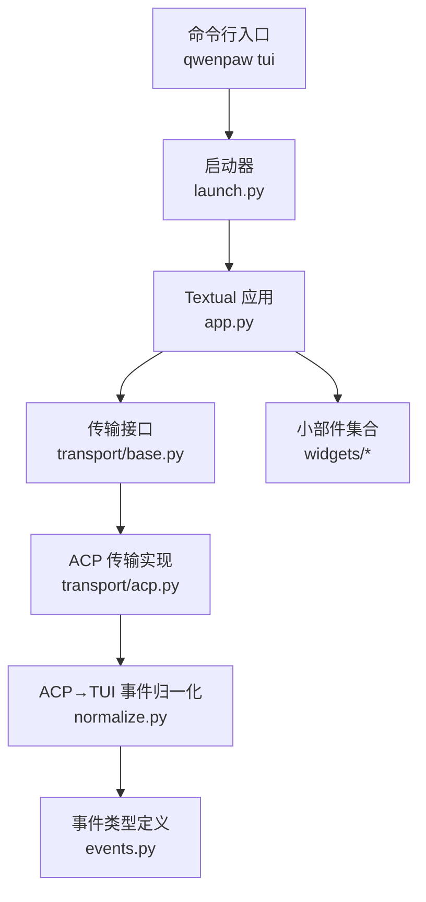
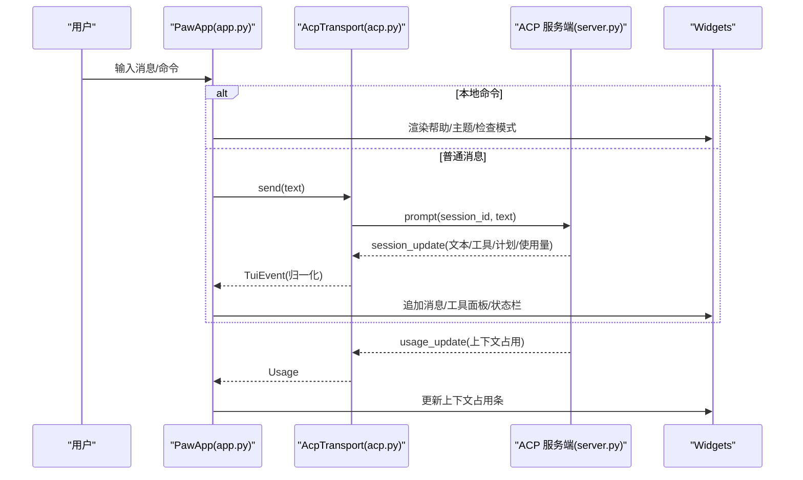
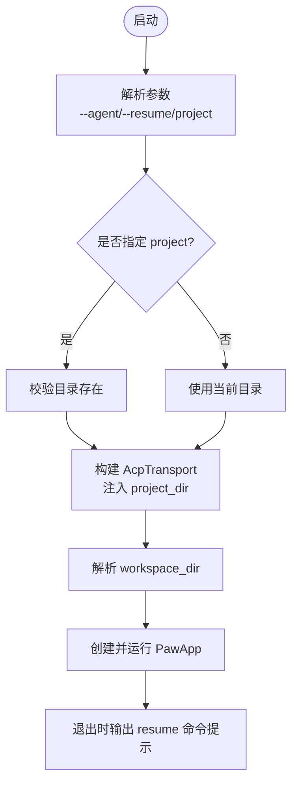
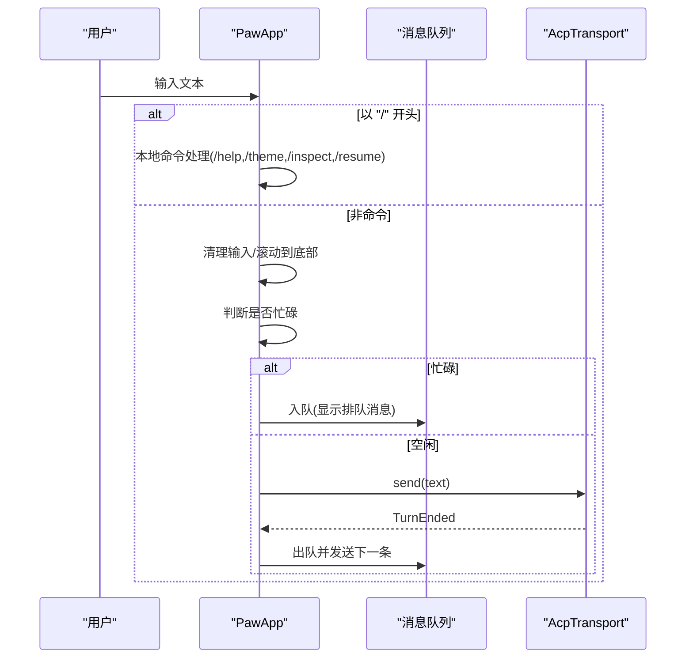
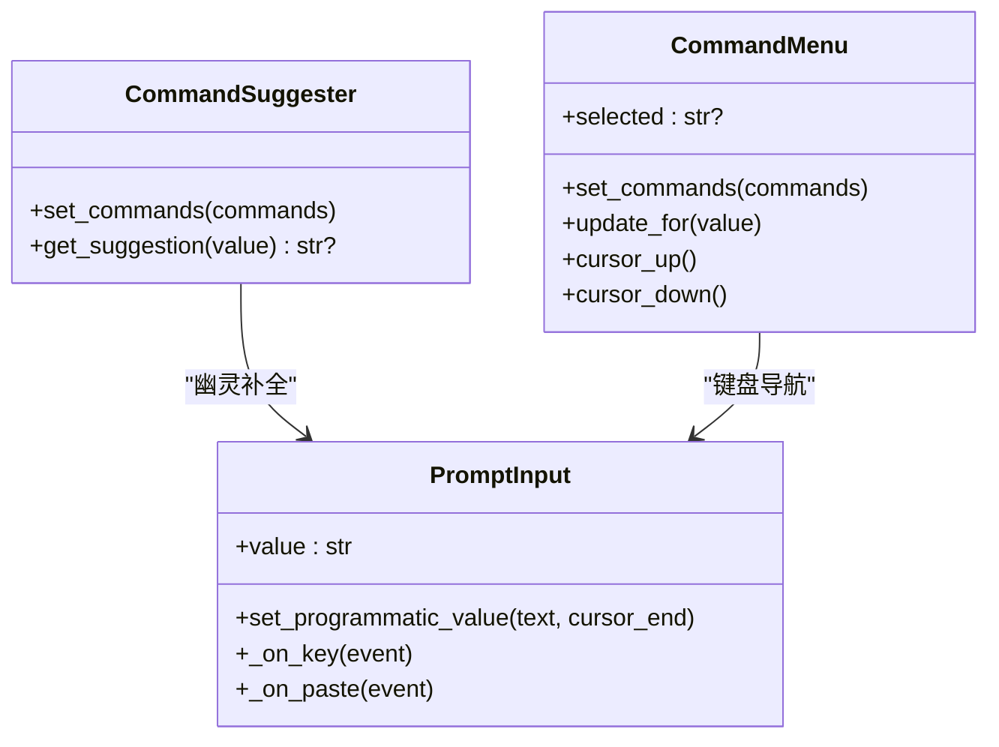
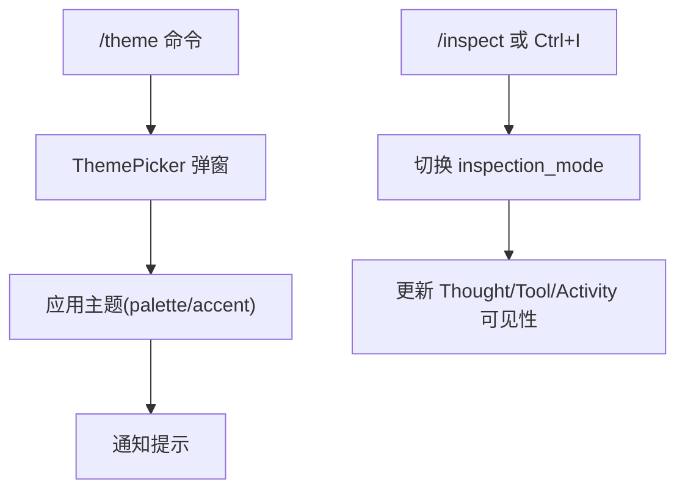
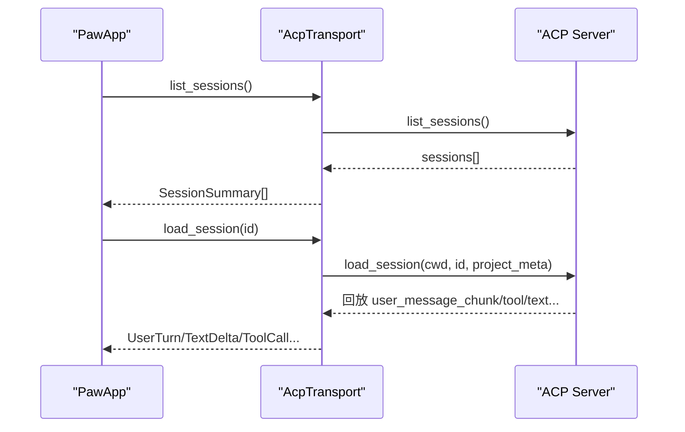
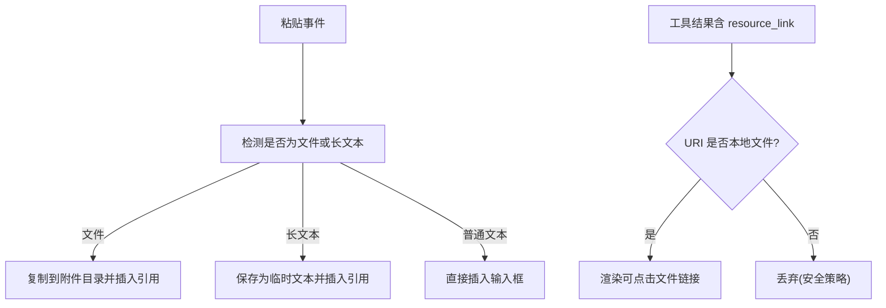
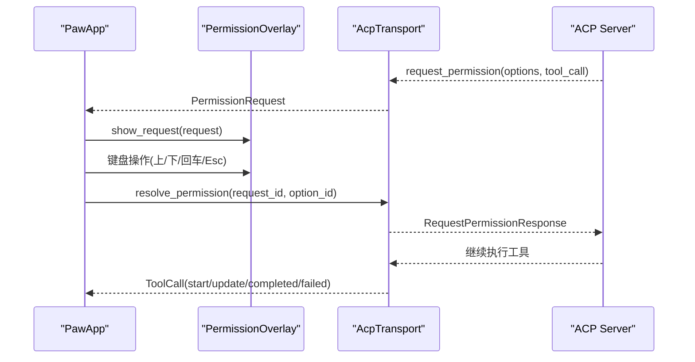
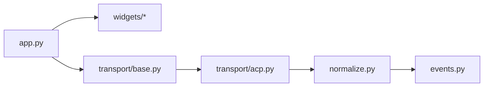

# 终端界面 (TUI)

<cite>
**本文引用的文件**   
- [README.md](file://README.md)
- [launch.py](file://src/qwenpaw/cli/tui/launch.py)
- [app.py](file://src/qwenpaw/cli/tui/app.py)
- [events.py](file://src/qwenpaw/cli/tui/events.py)
- [normalize.py](file://src/qwenpaw/cli/tui/normalize.py)
- [transport/base.py](file://src/qwenpaw/cli/tui/transport/base.py)
- [transport/acp.py](file://src/qwenpaw/cli/tui/transport/acp.py)
- [widgets/command_menu.py](file://src/qwenpaw/cli/tui/widgets/command_menu.py)
- [widgets/messages.py](file://src/qwenpaw/cli/tui/widgets/messages.py)
- [widgets/permission_overlay.py](file://src/qwenpaw/cli/tui/widgets/permission_overlay.py)
- [widgets/session_picker.py](file://src/qwenpaw/cli/tui/widgets/session_picker.py)
- [server.py](file://src/qwenpaw/agents/acp/server.py)
</cite>

## 目录
1. [简介](#简介)
2. [项目结构](#项目结构)
3. [核心组件](#核心组件)
4. [架构总览](#架构总览)
5. [详细组件分析](#详细组件分析)
6. [依赖关系分析](#依赖关系分析)
7. [性能与体验优化](#性能与体验优化)
8. [故障排查指南](#故障排查指南)
9. [结论](#结论)
10. [附录：快捷键与命令速查](#附录快捷键与命令速查)

## 简介
QwenPaw 的终端界面（TUI）提供全屏聊天体验，与 Console、桌面应用及各类渠道共享同一 Agent、记忆与会话体系。它支持流式回复、斜杠命令、会话恢复、主题切换、工具调用可视化、权限审批弹窗、粘贴文本/文件附件等能力，适合在纯终端环境中高效工作。

## 项目结构
TUI 位于 Python 包内，采用“应用 + 传输层 + 事件规范 + 小部件”的分层组织方式：
- 启动与入口：解析参数、构建传输、运行 Textual 应用
- 应用主循环：消息输入、本地命令处理、状态栏、滚动控制
- 传输协议：基于 ACP 的子进程驱动，标准化为 TUI 事件
- 事件模型：统一的 TuiEvent 类型，屏蔽底层差异
- 小部件：输入框、命令菜单、消息气泡、权限弹窗、会话选择器、主题选择器等

图表来源
- [launch.py:168-196](file://src/qwenpaw/cli/tui/launch.py#L168-L196)
- [app.py:138-314](file://src/qwenpaw/cli/tui/app.py#L138-L314)
- [transport/base.py:11-46](file://src/qwenpaw/cli/tui/transport/base.py#L11-L46)
- [transport/acp.py:352-466](file://src/qwenpaw/cli/tui/transport/acp.py#L352-L466)
- [normalize.py:217-313](file://src/qwenpaw/cli/tui/normalize.py#L217-L313)
- [events.py:14-228](file://src/qwenpaw/cli/tui/events.py#L14-L228)

章节来源
- [README.md:340-353](file://README.md#L340-L353)
- [launch.py:1-232](file://src/qwenpaw/cli/tui/launch.py#L1-L232)

## 核心组件
- 启动器（launch.py）
  - 解析 --agent、--resume、project 参数
  - 构建 AcpTransport，必要时注入 project_dir 元信息以联动 Coding Mode
  - 计算 workspace_dir 并传递给 UI 展示
- 应用主循环（app.py）
  - 管理 TranscriptScroll 跟随策略、消息队列、工具面板可见性、令牌用量统计
  - 处理本地命令（/help、/theme、/inspect、/resume），其余转发给 Agent
  - 粘贴处理：自动识别长文本或文件附件，生成引用标记
- 传输层（transport/base.py + transport/acp.py）
  - 通过 spawn_agent_process 启动 qwenpaw acp，建立 ACP 会话
  - 将 session_update 归一化为 TuiEvent，处理权限请求、推送消息、使用量更新
- 事件模型（events.py + normalize.py）
  - 统一事件类型：Connected、TextDelta、ToolCall、Usage、PermissionRequest 等
  - 安全过滤资源链接（仅允许本地文件 URI）
- 小部件（widgets/*）
  - 命令建议与下拉菜单、消息气泡、思考/工具折叠面板、权限审批覆盖层、会话选择器、主题选择器、状态栏

章节来源
- [launch.py:30-64](file://src/qwenpaw/cli/tui/launch.py#L30-L64)
- [app.py:215-314](file://src/qwenpaw/cli/tui/app.py#L215-L314)
- [transport/base.py:11-46](file://src/qwenpaw/cli/tui/transport/base.py#L11-L46)
- [transport/acp.py:352-466](file://src/qwenpaw/cli/tui/transport/acp.py#L352-L466)
- [events.py:14-228](file://src/qwenpaw/cli/tui/events.py#L14-L228)
- [normalize.py:42-54](file://src/qwenpaw/cli/tui/normalize.py#L42-L54)
- [widgets/command_menu.py:44-130](file://src/qwenpaw/cli/tui/widgets/command_menu.py#L44-L130)
- [widgets/messages.py:406-434](file://src/qwenpaw/cli/tui/widgets/messages.py#L406-L434)
- [widgets/permission_overlay.py:27-133](file://src/qwenpaw/cli/tui/widgets/permission_overlay.py#L27-L133)
- [widgets/session_picker.py:46-165](file://src/qwenpaw/cli/tui/widgets/session_picker.py#L46-L165)

## 架构总览
TUI 作为前端，通过 ACP 子进程与后端 Agent 通信；所有后端能力（工具、记忆、斜杠命令、权限策略）由 ACP 暴露，TUI 只做呈现与交互编排。

图表来源
- [app.py:457-537](file://src/qwenpaw/cli/tui/app.py#L457-L537)
- [transport/acp.py:518-557](file://src/qwenpaw/cli/tui/transport/acp.py#L518-L557)
- [normalize.py:217-313](file://src/qwenpaw/cli/tui/normalize.py#L217-L313)
- [server.py:1073-1116](file://src/qwenpaw/agents/acp/server.py#L1073-L1116)

## 详细组件分析

### 启动与运行流程
- 命令行参数
  - --agent：指定 Agent ID（默认 active agent）
  - --resume <session_id>：恢复历史会话并继续
  - project：可选的工作区目录，用于绑定 Coding Mode 上下文
- 启动步骤
  - 解析 project 路径并校验
  - 计算 workspace_dir（来自配置或默认 workspaces/<agent>）
  - 构建 AcpTransport（可注入 project_dir 元信息）
  - 创建 PawApp 并运行，退出时打印 resume 提示

图表来源
- [launch.py:30-64](file://src/qwenpaw/cli/tui/launch.py#L30-L64)
- [launch.py:131-196](file://src/qwenpaw/cli/tui/launch.py#L131-L196)
- [launch.py:199-232](file://src/qwenpaw/cli/tui/launch.py#L199-L232)

章节来源
- [launch.py:1-232](file://src/qwenpaw/cli/tui/launch.py#L1-L232)

### 消息输入与会话管理
- 输入行为
  - Enter 发送；Shift+Enter/Ctrl+J 换行；Esc 中断或取消输入
  - ↑ 当输入为空时可召回上一条排队消息进行编辑
  - 粘贴长文本或文件时，自动转为附件引用或存储为临时文本
- 会话恢复
  - /resume：列出最近会话，支持模糊匹配短 ID 或直接选择
  - /resume <id>：直接恢复指定会话，清空当前转录并重放历史
- 消息队列
  - 忙碌时新消息进入队列，按 FIFO 顺序在 turn 结束后自动发送

图表来源
- [app.py:446-545](file://src/qwenpaw/cli/tui/app.py#L446-L545)
- [app.py:615-709](file://src/qwenpaw/cli/tui/app.py#L615-L709)

章节来源
- [app.py:281-314](file://src/qwenpaw/cli/tui/app.py#L281-L314)
- [app.py:446-545](file://src/qwenpaw/cli/tui/app.py#L446-L545)
- [app.py:615-709](file://src/qwenpaw/cli/tui/app.py#L615-L709)

### 斜杠命令系统
- 内置本地命令
  - /help：显示帮助信息
  - /theme：打开主题选择器或按名称应用主题
  - /inspect：切换“友好/检查”模式，显示/隐藏思考与工具详情
  - /resume：浏览或恢复历史会话
- 代理命令
  - 其他以 “/” 开头的命令（如 /model、/clear 等）会转发给 Agent，由后端提供自动补全与描述
  - 自动补全来源于 ACP 的 available_commands_update，并在输入框中提供幽灵补全与下拉菜单

图表来源
- [widgets/command_menu.py:44-130](file://src/qwenpaw/cli/tui/widgets/command_menu.py#L44-L130)
- [widgets/command_menu.py:131-263](file://src/qwenpaw/cli/tui/widgets/command_menu.py#L131-L263)
- [app.py:346-359](file://src/qwenpaw/cli/tui/app.py#L346-L359)

章节来源
- [app.py:615-635](file://src/qwenpaw/cli/tui/app.py#L615-L635)
- [widgets/command_menu.py:44-130](file://src/qwenpaw/cli/tui/widgets/command_menu.py#L44-L130)
- [normalize.py:291-300](file://src/qwenpaw/cli/tui/normalize.py#L291-L300)

### 主题切换与界面自定义
- 主题选择
  - /theme：弹出主题选择器，支持画廊浏览与名称快速应用
  - 主题信息包含 emoji、名称、prompt 调色板，应用后即时生效
- 检查模式
  - /inspect 或 Ctrl+I：切换“友好/检查”模式，展开/折叠思考与工具面板，便于调试
- 状态栏
  - 显示当前 Agent、会话 ID、上下文占用条（used/size）、压缩阈值标记

图表来源
- [app.py:636-661](file://src/qwenpaw/cli/tui/app.py#L636-L661)
- [app.py:590-608](file://src/qwenpaw/cli/tui/app.py#L590-L608)
- [widgets/theme_picker.py](file://src/qwenpaw/cli/tui/widgets/theme_picker.py)

章节来源
- [app.py:636-661](file://src/qwenpaw/cli/tui/app.py#L636-L661)
- [app.py:590-608](file://src/qwenpaw/cli/tui/app.py#L590-L608)

### 会话持久化与工作空间集成
- 会话持久化
  - list_sessions/load_session 由 ACP 提供，TUI 负责回放历史与状态重置
  - 恢复时会清空当前转录、重置每轮状态、重新挂载欢迎信息与状态栏
- 工作空间与项目目录
  - launch 阶段解析 workspace_dir（来自配置或默认路径）
  - 若传入 project，则向 ACP 传递 coding 项目元信息，使后端能叠加 Coding Mode 上下文

图表来源
- [transport/acp.py:581-626](file://src/qwenpaw/cli/tui/transport/acp.py#L581-L626)
- [app.py:728-757](file://src/qwenpaw/cli/tui/app.py#L728-L757)
- [launch.py:131-166](file://src/qwenpaw/cli/tui/launch.py#L131-L166)

章节来源
- [transport/acp.py:581-626](file://src/qwenpaw/cli/tui/transport/acp.py#L581-L626)
- [app.py:728-757](file://src/qwenpaw/cli/tui/app.py#L728-L757)
- [launch.py:30-64](file://src/qwenpaw/cli/tui/launch.py#L30-L64)

### 文件上传与多模态交互
- 粘贴处理
  - 自动识别粘贴内容中的文件路径或嵌入引用，复制为附件并插入 “[attached file: path]” 引用
  - 超长文本会被保存到临时文件并插入 “[pasted text: path]” 引用
- 多模态
  - 通过 ACP 的 content blocks（image/audio/resource_link）支持图片、音频等资源
  - 工具结果中的 resource_link 会在对话中以可点击的文件链接形式呈现（仅本地文件）

图表来源
- [app.py:758-796](file://src/qwenpaw/cli/tui/app.py#L758-L796)
- [normalize.py:145-178](file://src/qwenpaw/cli/tui/normalize.py#L145-L178)
- [widgets/messages.py:596-621](file://src/qwenpaw/cli/tui/widgets/messages.py#L596-L621)

章节来源
- [app.py:758-796](file://src/qwenpaw/cli/tui/app.py#L758-L796)
- [normalize.py:42-54](file://src/qwenpaw/cli/tui/normalize.py#L42-L54)
- [widgets/messages.py:596-621](file://src/qwenpaw/cli/tui/widgets/messages.py#L596-L621)

### 权限审批与工具面板
- 权限弹窗
  - 当工具需要审批时，显示覆盖层，展示动作、目标参数、可用选项与倒计时
  - 支持键盘上下选择、回车确认、Esc 拒绝
- 工具面板
  - 每个 tool_call 对应一个可折叠面板，显示参数、输出与文件链接
  - 检查模式下自动展开，友好模式下完成项可一键隐藏

图表来源
- [transport/acp.py:231-317](file://src/qwenpaw/cli/tui/transport/acp.py#L231-L317)
- [widgets/permission_overlay.py:78-133](file://src/qwenpaw/cli/tui/widgets/permission_overlay.py#L78-L133)
- [app.py:482-514](file://src/qwenpaw/cli/tui/app.py#L482-L514)

章节来源
- [transport/acp.py:231-317](file://src/qwenpaw/cli/tui/transport/acp.py#L231-L317)
- [widgets/permission_overlay.py:27-133](file://src/qwenpaw/cli/tui/widgets/permission_overlay.py#L27-L133)
- [app.py:482-514](file://src/qwenpaw/cli/tui/app.py#L482-L514)

## 依赖关系分析
- 模块耦合
  - app.py 依赖 widgets、transport、themes、paths、events
  - transport/acp.py 依赖 acp 库、normalize、events、meta keys
  - normalize.py 仅依赖 events，保持无 UI 依赖，便于测试
- 外部依赖
  - ACP 客户端与服务端通过 stdio 通信，TUI 通过子进程管理生命周期
  - 大消息场景提高 stdio 缓冲区限制，避免管道阻塞导致连接断开

图表来源
- [app.py:25-75](file://src/qwenpaw/cli/tui/app.py#L25-L75)
- [transport/acp.py:1-58](file://src/qwenpaw/cli/tui/transport/acp.py#L1-L58)
- [normalize.py:1-37](file://src/qwenpaw/cli/tui/normalize.py#L1-L37)

章节来源
- [transport/acp.py:64-69](file://src/qwenpaw/cli/tui/transport/acp.py#L64-L69)

## 性能与体验优化
- 滚动与锚定
  - TranscriptScroll 智能跟随：仅在用户主动提交输入或到达底部时锚定，避免欢迎语被强制置顶
- 大消息缓冲
  - 提升 stdio 行缓冲上限至 50MB，防止浏览器截图等大工具结果导致连接关闭
- 后台预热
  - 可选的 ACP 预热任务，减少首次交互延迟；失败不影响主流程
- 令牌用量估算
  - 实时汇总 TokenUsage，结合 usage_update 的 used/size 显示上下文占用条与压缩阈值标记

章节来源
- [app.py:78-136](file://src/qwenpaw/cli/tui/app.py#L78-L136)
- [transport/acp.py:64-69](file://src/qwenpaw/cli/tui/transport/acp.py#L64-L69)
- [transport/acp.py:468-517](file://src/qwenpaw/cli/tui/transport/acp.py#L468-L517)
- [server.py:1073-1116](file://src/qwenpaw/agents/acp/server.py#L1073-L1116)

## 故障排查指南
- 常见错误
  - 传输未启动：send/resolve_permission 前需确保 start() 成功
  - 权限超时：本地根据 expires_at 设置超时，服务器侧也会到期；过期后提示不可再操作
  - 大消息导致连接关闭：检查 stdio 缓冲配置与日志
- 诊断与日志
  - ACP 子进程 stderr 重定向到日志文件，便于定位工具链问题
  - 退出时打印 resume 命令，方便恢复会话

章节来源
- [transport/acp.py:518-557](file://src/qwenpaw/cli/tui/transport/acp.py#L518-L557)
- [transport/acp.py:134-176](file://src/qwenpaw/cli/tui/transport/acp.py#L134-L176)
- [transport/acp.py:82-103](file://src/qwenpaw/cli/tui/transport/acp.py#L82-L103)
- [launch.py:114-129](file://src/qwenpaw/cli/tui/launch.py#L114-L129)

## 结论
QwenPaw TUI 以 ACP 为核心，将 Agent 的能力完整暴露到终端环境，提供流畅的流式交互、完善的会话管理与丰富的可视化反馈。通过标准化的事件模型与模块化小部件，既保证了扩展性，也兼顾了易用性与安全性。

## 附录：快捷键与命令速查
- 快捷键
  - Esc：中断正在进行的 turn 或取消输入
  - Ctrl+C / Ctrl+Q：退出应用
  - Ctrl+I：切换检查模式（显示/隐藏思考与工具详情）
  - Shift+Enter / Ctrl+J：输入框换行
  - ↑：当输入为空且菜单关闭时，召回上一条排队消息
- 本地命令
  - /help：显示帮助
  - /theme：打开主题选择器或按名称应用主题
  - /inspect：切换检查模式
  - /resume：浏览/恢复历史会话
- 代理命令
  - 其他以 “/” 开头的命令（如 /model、/clear 等）由后端提供，支持自动补全与说明

章节来源
- [app.py:204-213](file://src/qwenpaw/cli/tui/app.py#L204-L213)
- [app.py:615-635](file://src/qwenpaw/cli/tui/app.py#L615-L635)
- [widgets/command_menu.py:44-130](file://src/qwenpaw/cli/tui/widgets/command_menu.py#L44-L130)