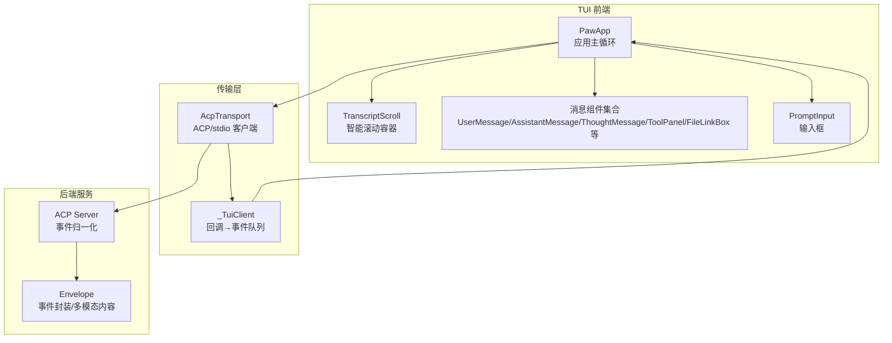
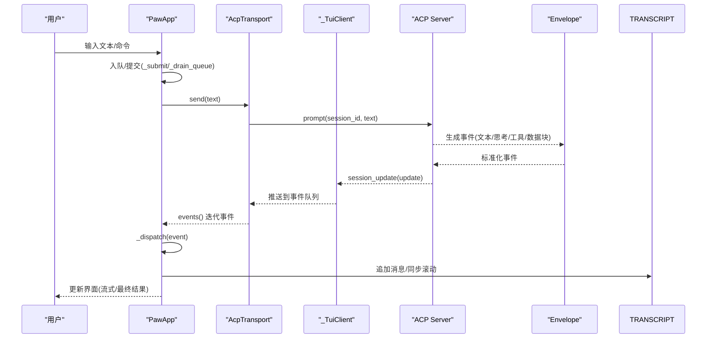
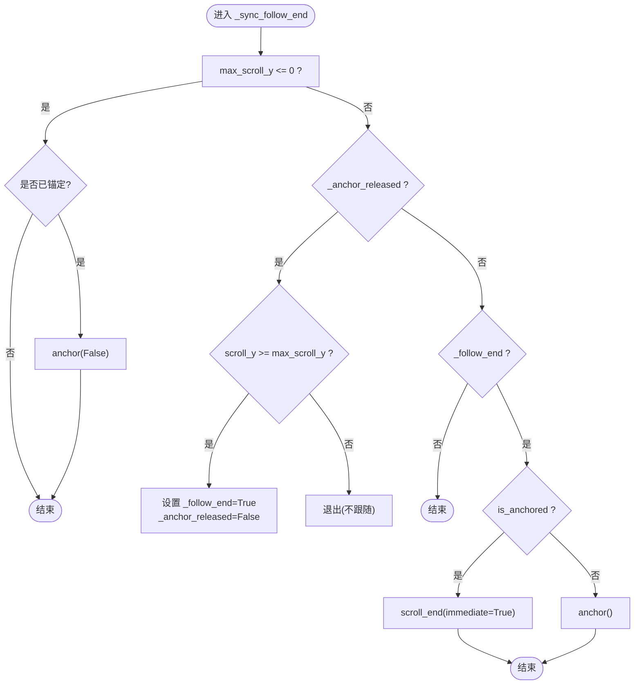
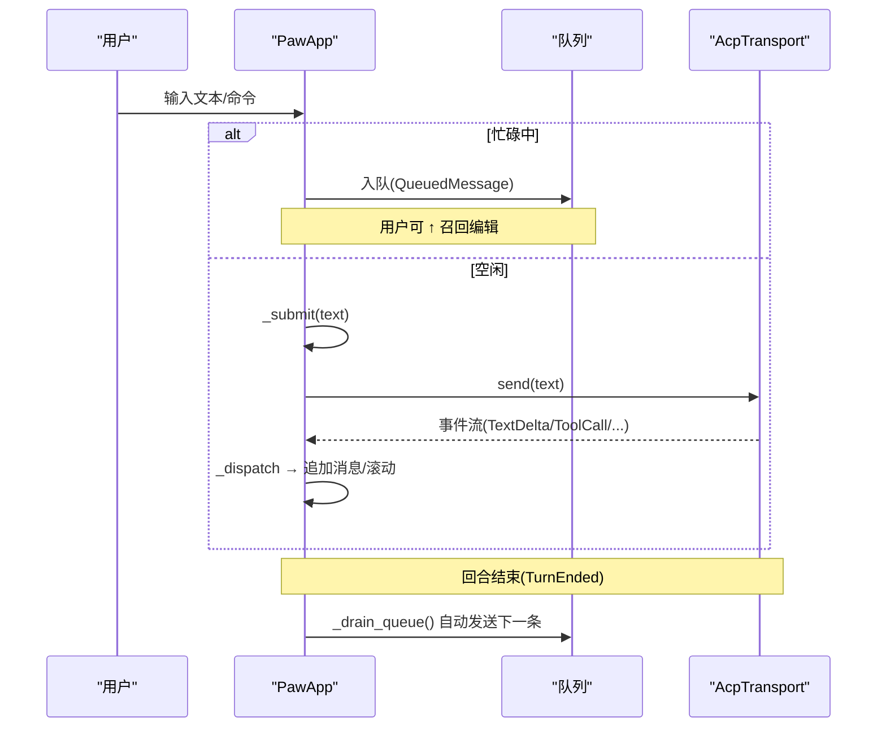
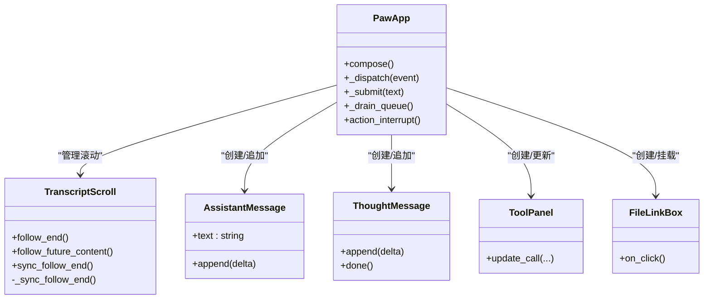
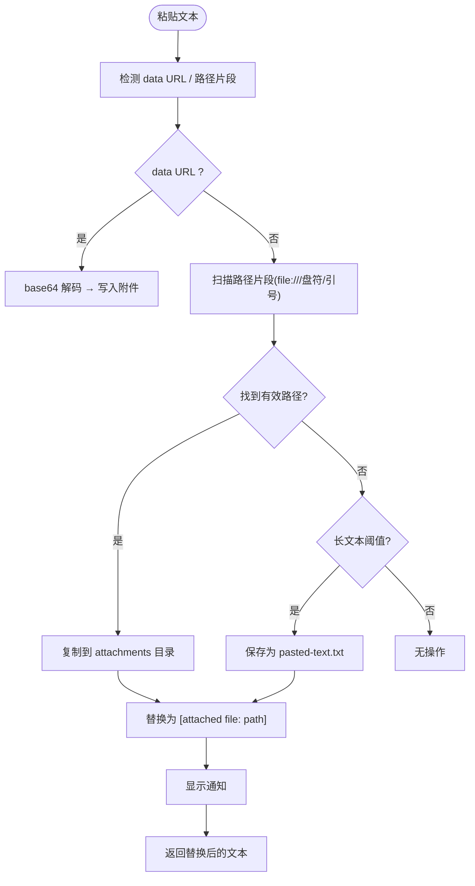
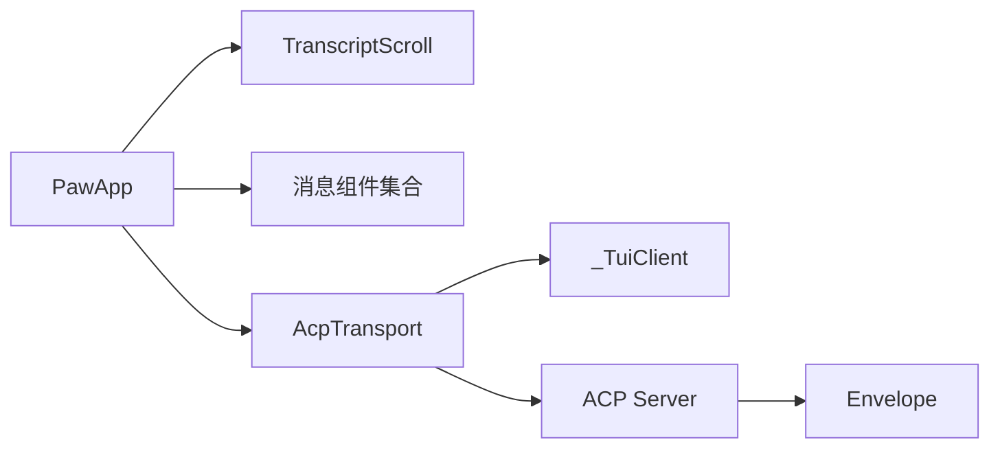

# 聊天界面与消息处理

<cite>
**本文引用的文件列表**
- [app.py](file://src/qwenpaw/cli/tui/app.py)
- [messages.py](file://src/qwenpaw/cli/tui/widgets/messages.py)
- [acp.py](file://src/qwenpaw/cli/tui/transport/acp.py)
- [envelope.py](file://src/qwenpaw/runtime/envelope.py)
- [server.py](file://src/qwenpaw/agents/acp/server.py)
</cite>

## 目录
1. [简介](#简介)
2. [项目结构](#项目结构)
3. [核心组件](#核心组件)
4. [架构总览](#架构总览)
5. [详细组件分析](#详细组件分析)
6. [依赖关系分析](#依赖关系分析)
7. [性能考量](#性能考量)
8. [故障排查指南](#故障排查指南)
9. [结论](#结论)

## 简介
本文件面向 QwenPaw TUI 全屏聊天界面的实现，聚焦以下能力：
- 实时消息流式传输（文本、思考过程、工具调用）
- 用户输入处理（发送、队列、中断、粘贴与附件）
- 助手响应显示（Markdown 渲染、代码块高亮、文件链接）
- TranscriptScroll 智能滚动（自动跟随、锚点管理、历史浏览）
- 多模态交互支持（图片、视频、音频的预览与展示）
- 消息队列管理、中断处理与错误恢复机制

## 项目结构
TUI 聊天界面位于 CLI/TUI 子系统中，采用 Textual 框架构建。关键路径与职责如下：
- 应用主循环与事件分发：负责会话生命周期、状态栏、主题、命令菜单、权限弹窗等
- 传输层：通过 ACP/stdio 启动并驱动后端进程，将后端事件标准化为 UI 事件
- 消息组件：用户消息、助手 Markdown 消息、思考过程、工具面板、文件链接、推送消息、错误提示等
- 滚动容器：TranscriptScroll 提供“跟随到底”和“自由浏览”的智能切换

图表来源
- [app.py:138-305](file://src/qwenpaw/cli/tui/app.py#L138-L305)
- [acp.py:352-467](file://src/qwenpaw/cli/tui/transport/acp.py#L352-L467)
- [server.py:169-201](file://src/qwenpaw/agents/acp/server.py#L169-L201)
- [envelope.py:552-580](file://src/qwenpaw/runtime/envelope.py#L552-L580)

章节来源
- [app.py:138-305](file://src/qwenpaw/cli/tui/app.py#L138-L305)
- [acp.py:352-467](file://src/qwenpaw/cli/tui/transport/acp.py#L352-L467)

## 核心组件
- PawApp：应用主类，负责布局、事件分发、主题、命令、权限弹窗、消息队列、Token 统计、会话恢复等
- TranscriptScroll：继承自 Textual 的垂直滚动容器，实现“跟随到底”与“自由浏览”的智能切换
- AcpTransport：启动 qwenpaw acp 子进程，建立 ACP 连接，维护会话、热启动、取消、事件轮询
- _TuiClient：ACP 回调到事件队列的桥接，包含权限请求、过期、推送消息等
- 消息组件：UserMessage、AssistantMessage、ThoughtMessage、ActivityLine、ToolPanel、FileLinkBox、PushMessageBox、InfoMessage、ErrorMessage 等

章节来源
- [app.py:78-137](file://src/qwenpaw/cli/tui/app.py#L78-L137)
- [app.py:138-305](file://src/qwenpaw/cli/tui/app.py#L138-L305)
- [acp.py:197-351](file://src/qwenpaw/cli/tui/transport/acp.py#L197-L351)
- [messages.py:18-656](file://src/qwenpaw/cli/tui/widgets/messages.py#L18-L656)

## 架构总览
从用户输入到助手响应的端到端流程如下：

图表来源
- [app.py:457-545](file://src/qwenpaw/cli/tui/app.py#L457-L545)
- [acp.py:518-557](file://src/qwenpaw/cli/tui/transport/acp.py#L518-L557)
- [server.py:169-201](file://src/qwenpaw/agents/acp/server.py#L169-L201)
- [envelope.py:552-580](file://src/qwenpaw/runtime/envelope.py#L552-L580)

## 详细组件分析

### TranscriptScroll 智能滚动机制
- 目标：在“跟随到底”模式下自动锚定底部；当用户上滚浏览历史时，暂停跟随；回到最底端后恢复跟随
- 关键行为
  - follow_end()/follow_future_content()：开启跟随策略
  - sync_follow_end()：在布局完成后异步执行跟随逻辑
  - watch_scroll_y()：监听滚动变化，动态判断是否恢复跟随
  - release_anchor()：释放锚点后重新评估跟随状态
  - _sync_follow_end()：核心逻辑，根据 max_scroll_y、is_anchored、scroll_y 决定是否 anchor() 或 scroll_end()
- 设计要点
  - 初始不锚定，避免启动时的欢迎内容被强制置顶
  - 仅在用户主动提交输入时跳转到底部并恢复跟随
  - 使用 call_after_refresh 确保在布局稳定后再执行滚动

图表来源
- [app.py:78-137](file://src/qwenpaw/cli/tui/app.py#L78-L137)

章节来源
- [app.py:78-137](file://src/qwenpaw/cli/tui/app.py#L78-L137)

### 用户输入处理与会话控制
- 输入入口：PromptInput，支持软换行、自动高度调整、命令补全
- 提交逻辑：
  - 非空则清空输入框，关闭命令菜单
  - 若处于忙碌状态，则入队（QueuedMessage），等待当前回合结束自动发送
  - 否则立即发送（_submit）
- 队列管理：
  - FIFO 队列，支持向上键召回最近一条排队消息进行编辑
  - 每回合结束后自动排空队列
- 中断处理：
  - ESC 触发 action_interrupt：若忙碌则发送中断信号；若空闲则清空输入草稿
- 本地命令：
  - /help、/resume、/theme、/inspect 等由 TUI 自身处理
  - 其他以 / 开头的命令转发给后端代理（如 /model、/clear 等）

图表来源
- [app.py:457-545](file://src/qwenpaw/cli/tui/app.py#L457-L545)
- [app.py:538-545](file://src/qwenpaw/cli/tui/app.py#L538-L545)
- [app.py:547-574](file://src/qwenpaw/cli/tui/app.py#L547-L574)
- [acp.py:518-557](file://src/qwenpaw/cli/tui/transport/acp.py#L518-L557)

章节来源
- [app.py:457-545](file://src/qwenpaw/cli/tui/app.py#L457-L545)
- [app.py:538-545](file://src/qwenpaw/cli/tui/app.py#L538-L545)
- [app.py:547-574](file://src/qwenpaw/cli/tui/app.py#L547-L574)

### 助手响应显示与 Markdown 渲染
- AssistantMessage：内部维护累积文本，增量 append 后调用 Markdown.update 进行渲染
- ThoughtMessage：折叠式“思考过程”，默认隐藏，支持 live 模式显示计时与动画
- ActivityLine：单行友好状态条，显示 thinking/tool 的状态与摘要
- ToolPanel：工具调用详情面板，支持参数与输出展示，可折叠/展开
- FileLinkBox：工具返回的文件链接，点击通过 App.open_url 打开系统默认程序
- 样式与高亮：
  - 消息气泡透明背景，仅边框着色，随主题变量动态变化
  - Markdown 渲染支持代码块语法高亮（由底层 Markdown 组件提供）

图表来源
- [app.py:911-1110](file://src/qwenpaw/cli/tui/app.py#L911-L1110)
- [messages.py:406-656](file://src/qwenpaw/cli/tui/widgets/messages.py#L406-L656)

章节来源
- [app.py:911-1110](file://src/qwenpaw/cli/tui/app.py#L911-L1110)
- [messages.py:406-656](file://src/qwenpaw/cli/tui/widgets/messages.py#L406-L656)

### 文件附件支持与粘贴处理
- 粘贴检测与分类：
  - data URL 附件：识别 base64 编码的图片/文件，写入 attachments 目录
  - 嵌入式文件引用：识别文本中的路径片段（支持 file://、Windows 盘符、引号包裹等），复制到 attachments 目录并替换为占位符
  - 长文本存储：超过阈值的多行/长文本自动保存为 pasted-text.txt 并插入引用
- 粘贴处理流程：
  - 解析粘贴文本 → 提取附件/嵌入引用 → 复制文件/写入文本 → 生成信息提示 → 返回替换后的文本用于发送
- 安全与健壮性：
  - 路径校验与存在性检查
  - 文件名规范化与唯一后缀
  - 异常捕获与降级提示

图表来源
- [app.py:1228-1452](file://src/qwenpaw/cli/tui/app.py#L1228-L1452)

章节来源
- [app.py:1228-1452](file://src/qwenpaw/cli/tui/app.py#L1228-L1452)

### 多模态交互支持（图片、视频、音频）
- 后端事件封装：
  - Envelope 将 DATA_BLOCK_DELTA/DATA_BLOCK_END 组装为 Image/Audio/Video 内容块
  - 音频：生成 AudioContent（含格式）
  - 视频：生成 VideoContent（data URI）
  - 图片：生成 ImageContent（data URI）
- 前端展示：
  - 工具输出中的媒体数据可通过 ToolPanel 展示
  - 文件链接（FileLinkBox）可用于外部查看器打开
- 模型能力探测与裁剪：
  - provider_manager 中定义各模型的 image/video 支持标志
  - capping_formatter 对图像/视频源进行裁剪与 base64 转换
  - react_agent 具备媒体块剥离与格式化开关能力

章节来源
- [envelope.py:552-580](file://src/qwenpaw/runtime/envelope.py#L552-L580)
- [provider_manager.py:353-431](file://src/qwenpaw/providers/provider_manager.py#L353-L431)
- [capping_formatter.py:207-221](file://src/qwenpaw/providers/capping_formatter.py#L207-L221)
- [react_agent.py:376-408](file://src/qwenpaw/agents/react_agent.py#L376-L408)

### 消息队列管理、中断处理与错误恢复
- 消息队列：
  - 忙碌时入队，TurnEnded 后自动排空
  - 支持召回上一条排队消息进行编辑
- 中断处理：
  - ESC 触发 transport.interrupt()，取消当前 prompt 任务与待决权限请求
  - 状态栏即时反馈“interrupting”，随后等待后端结束回合
- 错误恢复：
  - TransportError 显示错误消息，标记本轮未产生可见输出时给出“无响应”提示
  - 权限过期（PermissionExpired）显示警告并清理弹窗
  - 会话恢复（/resume）清空当前转储，重放历史，重置状态

章节来源
- [app.py:538-545](file://src/qwenpaw/cli/tui/app.py#L538-L545)
- [app.py:547-574](file://src/qwenpaw/cli/tui/app.py#L547-L574)
- [app.py:1059-1110](file://src/qwenpaw/cli/tui/app.py#L1059-L1110)
- [acp.py:571-580](file://src/qwenpaw/cli/tui/transport/acp.py#L571-L580)

## 依赖关系分析
- 组件耦合
  - PawApp 强依赖 TranscriptScroll 与各类消息组件
  - AcpTransport 与 _TuiClient 构成传输层，解耦于 UI 事件分发
  - 后端 ACP Server 与 Envelope 提供统一事件模型，屏蔽底层差异
- 直接/间接依赖
  - PawApp → AcpTransport → ACP Server → Envelope
  - PawApp → 消息组件（Markdown/Collapsible/Static 等）
- 外部集成点
  - Textual 组件体系（Widget、VerticalScroll、Markdown、Collapsible）
  - ACP 协议（spawn_agent_process、session_update、request_permission）
  - 文件系统（attachments 目录读写）

图表来源
- [app.py:138-305](file://src/qwenpaw/cli/tui/app.py#L138-L305)
- [acp.py:352-467](file://src/qwenpaw/cli/tui/transport/acp.py#L352-L467)
- [server.py:169-201](file://src/qwenpaw/agents/acp/server.py#L169-L201)
- [envelope.py:552-580](file://src/qwenpaw/runtime/envelope.py#L552-L580)

章节来源
- [app.py:138-305](file://src/qwenpaw/cli/tui/app.py#L138-L305)
- [acp.py:352-467](file://src/qwenpaw/cli/tui/transport/acp.py#L352-L467)

## 性能考量
- 大消息缓冲：ACP stdio 缓冲区提升至 50MB，避免大工具结果导致连接断开
- 流式渲染：AssistantMessage 增量更新 Markdown，减少重绘开销
- 滚动优化：TranscriptScroll 仅在必要时 anchor/scroll_end，避免频繁滚动抖动
- Token 估算：基于字符数粗略估计输出 token，收到精确 Usage 后替换
- 权限超时：本地保护性超时，防止服务端超时未到达导致的阻塞

[本节为通用指导，无需特定文件来源]

## 故障排查指南
- 常见问题
  - 无响应：TurnEnded 且无可见输出时显示“无响应”提示，建议检查模型配置
  - 权限过期：PermissionExpired 弹出警告，需重新发起请求
  - 传输错误：TransportError 显示错误消息，检查网络/后端进程状态
- 定位手段
  - 查看 agent stderr 日志（acp.log），避免管道阻塞导致连接关闭
  - 使用 /inspect 模式查看工具参数与输出细节
  - 使用 /resume list 确认会话恢复范围

章节来源
- [app.py:1059-1110](file://src/qwenpaw/cli/tui/app.py#L1059-L1110)
- [acp.py:82-103](file://src/qwenpaw/cli/tui/transport/acp.py#L82-L103)

## 结论
QwenPaw TUI 聊天界面通过清晰的组件分层与事件驱动架构，实现了流畅的流式对话体验。TranscriptScroll 的智能滚动、完善的粘贴与附件处理、多模态内容支持以及健壮的队列与中断机制，共同构成了一个高效、易用且可扩展的全屏聊天终端。