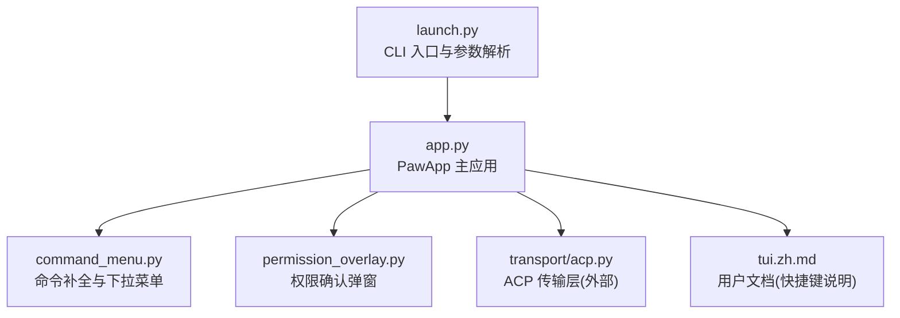
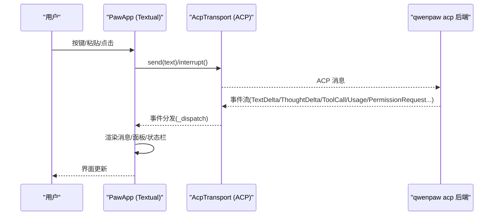
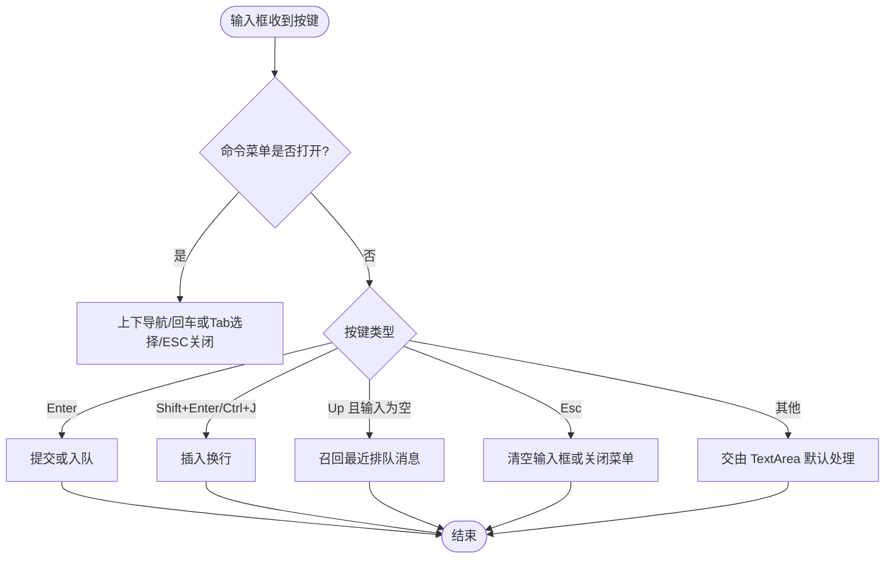
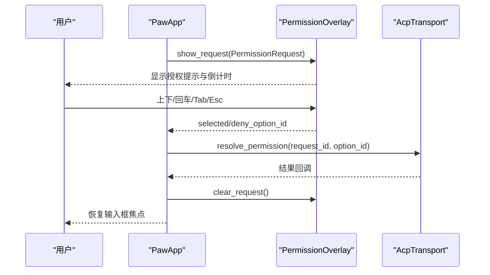
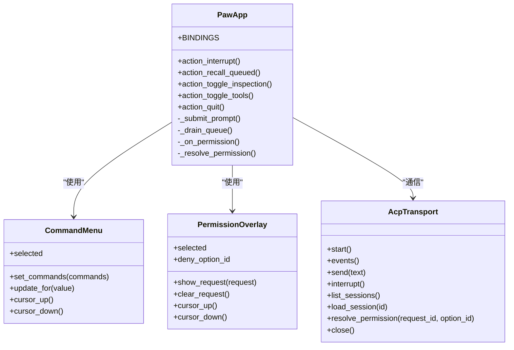

# 键盘快捷键与交互操作

<cite>
**本文引用的文件**
- [app.py](file://src/qwenpaw/cli/tui/app.py)
- [command_menu.py](file://src/qwenpaw/cli/tui/widgets/command_menu.py)
- [permission_overlay.py](file://src/qwenpaw/cli/tui/widgets/permission_overlay.py)
- [launch.py](file://src/qwenpaw/cli/tui/launch.py)
- [tui.zh.md](file://website/public/docs/tui.zh.md)
</cite>

## 目录
1. [简介](#简介)
2. [项目结构](#项目结构)
3. [核心组件](#核心组件)
4. [架构总览](#架构总览)
5. [详细组件分析](#详细组件分析)
6. [依赖关系分析](#依赖关系分析)
7. [性能与体验考量](#性能与体验考量)
8. [故障排查指南](#故障排查指南)
9. [结论](#结论)
10. [附录：快捷键速查表](#附录快捷键速查表)

## 简介
本文件面向 QwenPaw TUI（终端界面）的键盘快捷键与交互操作，系统化记录所有可用快捷键、绑定机制、自定义方式、冲突解决策略，以及在不同交互场景下的行为差异。同时覆盖输入框焦点管理、菜单导航、权限确认流程、鼠标与触摸板支持、终端兼容性、快捷键提示显示、帮助文档集成与新手引导，并提供效率提升建议。

## 项目结构
TUI 基于 Textual 构建，位于 CLI 子模块中，核心入口与 UI 逻辑集中在以下文件：
- 应用主循环与事件分发：app.py
- 命令补全与下拉菜单：widgets/command_menu.py
- 工具授权弹窗：widgets/permission_overlay.py
- 启动器与参数解析：launch.py
- 用户文档中的快捷键说明：tui.zh.md

图表来源
- [launch.py:168-196](file://src/qwenpaw/cli/tui/launch.py#L168-L196)
- [app.py:138-214](file://src/qwenpaw/cli/tui/app.py#L138-L214)
- [command_menu.py:131-213](file://src/qwenpaw/cli/tui/widgets/command_menu.py#L131-L213)
- [permission_overlay.py:27-133](file://src/qwenpaw/cli/tui/widgets/permission_overlay.py#L27-L133)
- [tui.zh.md:65-76](file://website/public/docs/tui.zh.md#L65-L76)

章节来源
- [launch.py:168-196](file://src/qwenpaw/cli/tui/launch.py#L168-L196)
- [app.py:138-214](file://src/qwenpaw/cli/tui/app.py#L138-L214)
- [command_menu.py:131-213](file://src/qwenpaw/cli/tui/widgets/command_menu.py#L131-L213)
- [permission_overlay.py:27-133](file://src/qwenpaw/cli/tui/widgets/permission_overlay.py#L27-L133)
- [tui.zh.md:65-76](file://website/public/docs/tui.zh.md#L65-L76)

## 核心组件
- PawApp（主应用）
  - 负责全局快捷键绑定、状态栏更新、消息队列、检视模式切换、主题切换、会话恢复等。
  - 关键快捷键绑定定义在 BINDINGS 列表，包括 Esc、Ctrl+C、Ctrl+Q、Ctrl+I、Ctrl+T、Up。
- PromptInput（输入框）
  - 拦截并处理 Enter、Shift+Enter、Tab、方向键等，控制提交、换行、菜单导航与排队消息召回。
- CommandMenu（命令下拉菜单）
  - 提供斜杠命令的自动补全与下拉选择，支持上下导航与回车/Tab 选择。
- PermissionOverlay（权限弹窗）
  - 以 OptionList 形式展示工具调用授权请求，支持键盘上下选择、回车/Tab 确认、Esc 拒绝。

章节来源
- [app.py:204-213](file://src/qwenpaw/cli/tui/app.py#L204-L213)
- [command_menu.py:131-213](file://src/qwenpaw/cli/tui/widgets/command_menu.py#L131-L213)
- [permission_overlay.py:27-133](file://src/qwenpaw/cli/tui/widgets/permission_overlay.py#L27-L133)

## 架构总览
TUI 通过 ACP 协议与本地 qwenpaw acp 后端通信，采用 stdio 子进程方式驱动。用户输入经 PawApp 路由到传输层，后端返回文本增量、思考、工具调用、使用量、权限请求等事件，由 PawApp 渲染到 TranscriptScroll 与相关面板。

图表来源
- [launch.py:131-165](file://src/qwenpaw/cli/tui/launch.py#L131-L165)
- [app.py:867-910](file://src/qwenpaw/cli/tui/app.py#L867-L910)
- [app.py:911-1110](file://src/qwenpaw/cli/tui/app.py#L911-L1110)

## 详细组件分析

### 快捷键绑定机制与优先级
- 全局绑定（BINDINGS）
  - Esc：中断当前回合或清空输入框
  - Up：唤回最近一条排队消息进行编辑
  - Ctrl+I：切换检视模式（展开思考与工具细节）
  - Ctrl+T：隐藏/显示已完成工具面板（保留于系统但不主动提示）
  - Ctrl+C / Ctrl+Q：退出应用
- 优先级与冲突
  - Ctrl+C/Q 标记为 priority=True，确保在多数情况下优先触发退出动作。
  - 输入框内部对方向键、Enter、Tab、Esc 有专门拦截逻辑，避免与默认行为冲突。
  - 当权限弹窗激活时，输入框将上转上下/回车/Tab/Esc 至权限弹窗处理，防止误提交。

章节来源
- [app.py:204-213](file://src/qwenpaw/cli/tui/app.py#L204-L213)
- [command_menu.py:171-213](file://src/qwenpaw/cli/tui/widgets/command_menu.py#L171-L213)
- [app.py:315-329](file://src/qwenpaw/cli/tui/app.py#L315-L329)

### 输入框焦点管理与行为
- Enter：发送消息；若智能体忙碌则进入排队，并在回合结束时自动发送。
- Shift+Enter / Ctrl+J：插入换行。
- Tab：在命令补全打开时选择高亮项并补全为“/命令 ”。
- Up：仅在输入框为空且菜单关闭时生效，用于召回最近排队消息。
- Esc：关闭命令菜单；若无菜单则清空输入框内容。
- 粘贴处理：识别 data URL、文件路径、长文本，自动转为附件引用或存储为附件，避免输入框臃肿。

图表来源
- [command_menu.py:171-213](file://src/qwenpaw/cli/tui/widgets/command_menu.py#L171-L213)
- [app.py:457-481](file://src/qwenpaw/cli/tui/app.py#L457-L481)
- [app.py:560-574](file://src/qwenpaw/cli/tui/app.py#L560-L574)

### 菜单导航与命令补全
- 输入“/”后出现内联幽灵补全与下拉菜单。
- 支持按名称与参数前缀匹配，如“/theme cy”可补全到“/theme cyberpunk”。
- 菜单不抢占焦点，保持输入框聚焦以便继续打字。

章节来源
- [command_menu.py:44-116](file://src/qwenpaw/cli/tui/widgets/command_menu.py#L44-L116)
- [command_menu.py:131-195](file://src/qwenpaw/cli/tui/widgets/command_menu.py#L131-L195)

### 权限确认流程（工具授权）
- 当后端发起工具调用需要批准时，弹出权限弹窗，显示标题、动作、目标参数与可选操作。
- 键盘导航：上下移动选项，回车/Tab 确认，Esc 拒绝。
- 倒计时：若请求有过期时间，弹窗会实时显示剩余时间，过期后自动失效。
- 焦点管理：弹窗出现时自动聚焦，输入框的键盘事件被转发至弹窗处理。

图表来源
- [permission_overlay.py:78-133](file://src/qwenpaw/cli/tui/widgets/permission_overlay.py#L78-L133)
- [app.py:1141-1158](file://src/qwenpaw/cli/tui/app.py#L1141-L1158)
- [app.py:487-514](file://src/qwenpaw/cli/tui/app.py#L487-L514)

### 检视模式与工具面板
- Ctrl+I 切换检视模式：展开思考与工具细节，便于调试与审计。
- Ctrl+T 隐藏/显示已完成工具面板，运行中的工具保持可见。
- 检视模式下，活动行与工具面板的可见性受控制，友好模式更简洁。

章节来源
- [app.py:590-608](file://src/qwenpaw/cli/tui/app.py#L590-L608)
- [app.py:575-589](file://src/qwenpaw/cli/tui/app.py#L575-L589)

### 会话恢复与命令
- /help：显示 TUI 快捷键与命令帮助。
- /resume：从建议列表挑选最近会话，或浏览全部会话。
- /theme：打开主题库或应用指定主题。
- /inspect：切换检视模式。
- 其余斜杠命令（如 /model、/clear、/compact、/skills）转发给后端执行。

章节来源
- [app.py:1173-1206](file://src/qwenpaw/cli/tui/app.py#L1173-L1206)
- [app.py:615-635](file://src/qwenpaw/cli/tui/app.py#L615-L635)

### 鼠标与触摸板支持
- 基于 Textual 的 OptionList 与 TextArea 原生支持鼠标点击与滚轮滚动。
- 权限弹窗与命令菜单均可通过鼠标点击选择与滚动浏览。
- 触摸板手势（双指滚动）通常由终端宿主实现，TUI 侧遵循标准滚动事件。

章节来源
- [permission_overlay.py:27-133](file://src/qwenpaw/cli/tui/widgets/permission_overlay.py#L27-L133)
- [command_menu.py:62-116](file://src/qwenpaw/cli/tui/widgets/command_menu.py#L62-L116)

### 终端兼容性
- 标题设置：通过 OSC 序列设置终端标签/窗口标题，兼容大多数现代终端。
- 颜色与样式：依赖终端对 ANSI 与 Rich 文本的支持，部分旧终端可能无法完整渲染。
- 粘贴行为：跨平台粘贴路径与 data URL 解析已做兼容处理，Windows 路径与引号包裹路径均支持。

章节来源
- [app.py:436-444](file://src/qwenpaw/cli/tui/app.py#L436-L444)
- [app.py:1256-1406](file://src/qwenpaw/cli/tui/app.py#L1256-L1406)

### 快捷键提示显示与帮助文档集成
- 输入框占位符提示核心操作：发送、换行、中断、粘贴文件/长文本。
- /help 命令输出完整的快捷键与命令清单，适合新手快速上手。
- 检视模式切换与主题应用均有通知反馈，帮助用户感知操作结果。

章节来源
- [app.py:286-296](file://src/qwenpaw/cli/tui/app.py#L286-L296)
- [app.py:1191-1206](file://src/qwenpaw/cli/tui/app.py#L1191-L1206)
- [tui.zh.md:65-76](file://website/public/docs/tui.zh.md#L65-L76)

### 自定义快捷键配置与冲突解决策略
- 当前版本未暴露外部配置文件来自定义全局快捷键映射。
- 可通过修改源码中的 BINDINGS 列表添加或调整绑定，注意：
  - 为关键动作（如退出）设置 priority=True 以避免被其他绑定覆盖。
  - 输入框内部对特定键做了拦截，需确保不与 TextArea 默认行为冲突。
  - 权限弹窗期间，输入框会将导航键转发至弹窗，避免误提交。
- 冲突解决原则：
  - 全局绑定优先级高于组件默认行为（priority=True）。
  - 组件级拦截优先于全局绑定（例如输入框内的 Enter/Tab/方向键）。
  - 弹窗期间，弹窗处理优先于输入框与全局绑定。

章节来源
- [app.py:204-213](file://src/qwenpaw/cli/tui/app.py#L204-L213)
- [command_menu.py:171-213](file://src/qwenpaw/cli/tui/widgets/command_menu.py#L171-L213)
- [app.py:315-329](file://src/qwenpaw/cli/tui/app.py#L315-L329)

## 依赖关系分析
- PawApp 依赖：
  - transport.acp：与后端通信，发送消息、中断、恢复会话、解析权限请求。
  - widgets.command_menu：命令补全与下拉菜单。
  - widgets.permission_overlay：权限弹窗。
  - themes：主题调色板与变量注入。
- 启动器 launch.py 负责创建 AcpTransport 并运行 PawApp。

图表来源
- [app.py:138-214](file://src/qwenpaw/cli/tui/app.py#L138-L214)
- [command_menu.py:62-116](file://src/qwenpaw/cli/tui/widgets/command_menu.py#L62-L116)
- [permission_overlay.py:27-133](file://src/qwenpaw/cli/tui/widgets/permission_overlay.py#L27-L133)
- [launch.py:131-165](file://src/qwenpaw/cli/tui/launch.py#L131-L165)

章节来源
- [app.py:138-214](file://src/qwenpaw/cli/tui/app.py#L138-L214)
- [command_menu.py:62-116](file://src/qwenpaw/cli/tui/widgets/command_menu.py#L62-L116)
- [permission_overlay.py:27-133](file://src/qwenpaw/cli/tui/widgets/permission_overlay.py#L27-L133)
- [launch.py:131-165](file://src/qwenpaw/cli/tui/launch.py#L131-L165)

## 性能与体验考量
- 流式渲染：文本与思考增量逐步追加，减少首屏等待。
- 令牌估算：在正式 Usage 到达前，基于字符数估算输出 token，提升状态栏反馈及时性。
- 队列机制：忙碌时入队消息，回合结束后自动发送，避免阻塞用户输入。
- 检视模式：按需展开详情，默认折叠以保持界面整洁。
- 主题切换：刷新 CSS 变量与背景色，避免重绘闪烁。

章节来源
- [app.py:895-910](file://src/qwenpaw/cli/tui/app.py#L895-L910)
- [app.py:538-545](file://src/qwenpaw/cli/tui/app.py#L538-L545)
- [app.py:590-608](file://src/qwenpaw/cli/tui/app.py#L590-L608)
- [app.py:841-865](file://src/qwenpaw/cli/tui/app.py#L841-L865)

## 故障排查指南
- 无响应或空白回复
  - 检查模型或 API Key 配置，参考错误提示中的诊断建议。
  - 查看状态栏是否处于 error 或 warming 状态。
- 权限弹窗不消失
  - 确认是否选择了有效选项或使用 Esc 拒绝；检查请求是否已过期。
- 快捷键无效
  - 确认是否在输入框或弹窗中，某些键会被组件拦截。
  - 检查是否有第三方终端插件劫持了组合键。
- 粘贴失败或附件未生效
  - 确认粘贴内容为合法 data URL 或存在的路径；长文本将被存为附件而非直接插入。

章节来源
- [app.py:1128-1139](file://src/qwenpaw/cli/tui/app.py#L1128-L1139)
- [permission_overlay.py:142-204](file://src/qwenpaw/cli/tui/widgets/permission_overlay.py#L142-L204)
- [app.py:758-796](file://src/qwenpaw/cli/tui/app.py#L758-L796)

## 结论
QwenPaw TUI 的快捷键体系围绕高效键盘操作设计，结合输入框智能拦截、命令补全与权限弹窗的无缝协作，提供了流畅的终端对话体验。检视模式与主题切换进一步增强了可定制性与调试能力。尽管当前未开放外部自定义快捷键配置，但通过源码层面的绑定扩展仍可满足高级用户需求。

## 附录：快捷键速查表
- Enter：发送消息（忙碌时入队）
- Shift+Enter / Ctrl+J：插入换行
- Esc：中断当前回合 / 清空输入框
- Up：唤回并编辑最近一条排队消息
- Ctrl+I：切换检视模式
- Ctrl+T：隐藏/显示已完成工具面板
- Ctrl+C / Ctrl+Q：退出应用
- Tab：在命令补全打开时选择并补全命令
- 粘贴：自动识别 data URL 与文件路径，转换为附件引用或存储为附件

章节来源
- [tui.zh.md:65-76](file://website/public/docs/tui.zh.md#L65-L76)
- [app.py:204-213](file://src/qwenpaw/cli/tui/app.py#L204-L213)
- [command_menu.py:171-213](file://src/qwenpaw/cli/tui/widgets/command_menu.py#L171-L213)
- [app.py:758-796](file://src/qwenpaw/cli/tui/app.py#L758-L796)