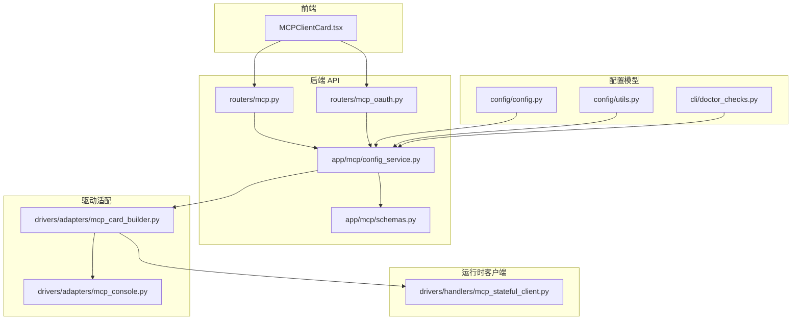
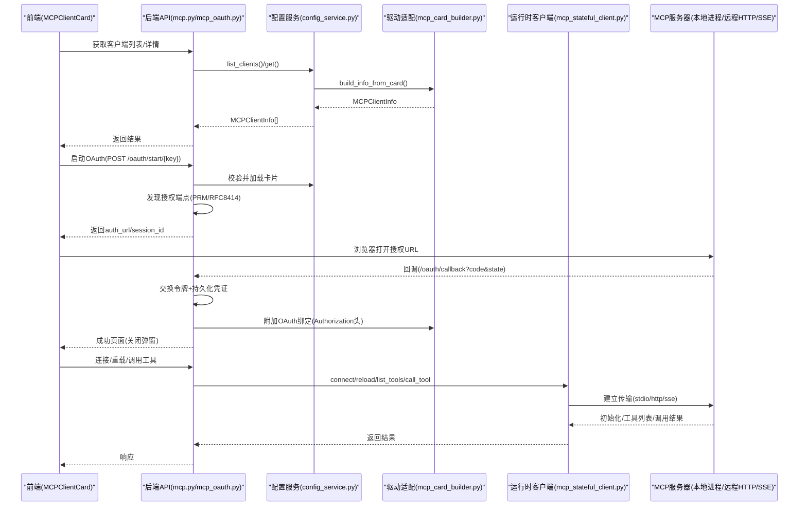
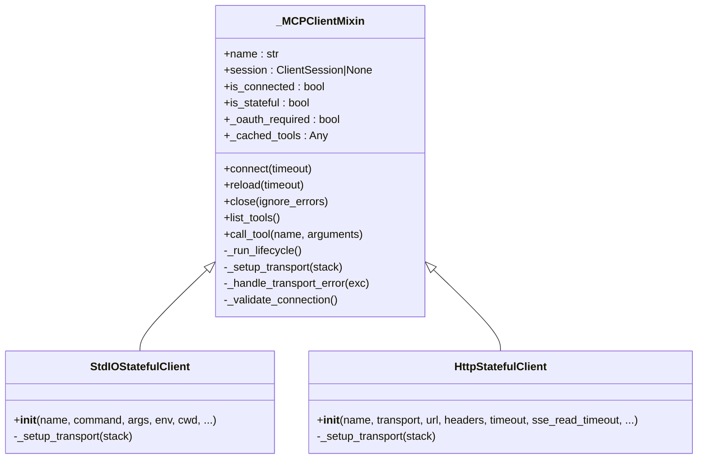
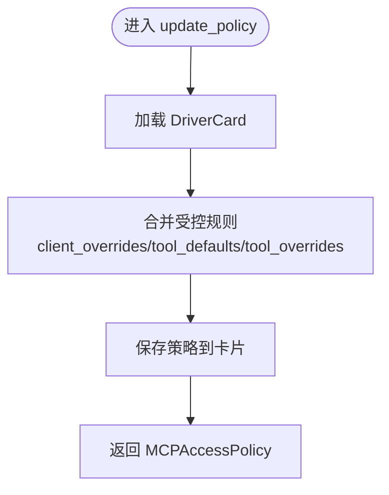
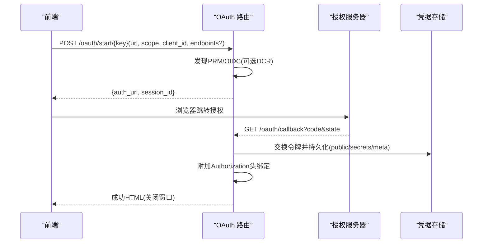
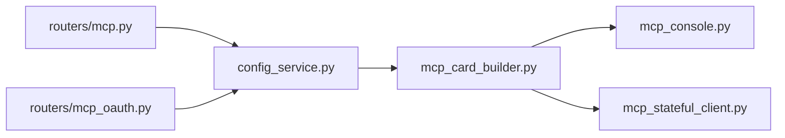

# Agent MCP 客户端

<cite>
**本文引用的文件**   
- [mcp_stateful_client.py](file://src/qwenpaw/drivers/handlers/mcp_stateful_client.py)
- [mcp_card_builder.py](file://src/qwenpaw/drivers/adapters/mcp_card_builder.py)
- [mcp_console.py](file://src/qwenpaw/drivers/adapters/mcp_console.py)
- [config_service.py](file://src/qwenpaw/app/mcp/config_service.py)
- [schemas.py](file://src/qwenpaw/app/mcp/schemas.py)
- [mcp.py](file://src/qwenpaw/app/routers/mcp.py)
- [mcp_oauth.py](file://src/qwenpaw/app/routers/mcp_oauth.py)
- [MCPClientCard.tsx](file://console/src/pages/Agent/MCP/components/MCPClientCard.tsx)
- [config.py](file://src/qwenpaw/config/config.py)
- [utils.py](file://src/qwenpaw/config/utils.py)
- [doctor_checks.py](file://src/qwenpaw/cli/doctor_checks.py)
</cite>

## 目录
1. [简介](#简介)
2. [项目结构](#项目结构)
3. [核心组件](#核心组件)
4. [架构总览](#架构总览)
5. [详细组件分析](#详细组件分析)
6. [依赖关系分析](#依赖关系分析)
7. [性能与可靠性](#性能与可靠性)
8. [故障排查指南](#故障排查指南)
9. [结论](#结论)
10. [附录：配置与示例](#附录配置与示例)

## 简介
本文件面向 QwenPaw 的 Agent MCP 客户端，系统性阐述 Model Context Protocol（MCP）在前端的集成实现、后端连接管理、协议通信、认证流程以及访问策略系统。文档覆盖以下关键主题：
- MCP 服务器发现与连接管理（HTTP/SSE、stdio）
- 前端配置界面（MCPClientCard）：服务器地址、认证设置、连接测试
- 访问策略系统：工具权限控制、访问规则定义与安全策略执行
- OAuth 2.1 授权码 + PKCE 流程与自动发现
- 常见问题与解决方案：连接超时、认证失败诊断、协议版本兼容性

## 项目结构
围绕 MCP 的前后端代码主要分布在如下模块：
- 后端服务层：路由、配置服务、Schema 定义、OAuth 端点
- 驱动适配层：DriverCard/CredentialRecord 构建与绑定
- 运行时客户端：状态化 MCP 客户端（stdio/http/sse），生命周期与重连
- 前端控制台：卡片式配置 UI、OAuth 弹窗、访问策略编辑

图表来源
- [mcp.py:1-252](file://src/qwenpaw/app/routers/mcp.py#L1-L252)
- [mcp_oauth.py:1-798](file://src/qwenpaw/app/routers/mcp_oauth.py#L1-L798)
- [config_service.py:1-728](file://src/qwenpaw/app/mcp/config_service.py#L1-L728)
- [schemas.py:1-274](file://src/qwenpaw/app/mcp/schemas.py#L1-L274)
- [mcp_card_builder.py:1-379](file://src/qwenpaw/drivers/adapters/mcp_card_builder.py#L1-L379)
- [mcp_console.py:1-49](file://src/qwenpaw/drivers/adapters/mcp_console.py#L1-L49)
- [mcp_stateful_client.py:1-754](file://src/qwenpaw/drivers/handlers/mcp_stateful_client.py#L1-L754)
- [config.py:1562-1652](file://src/qwenpaw/config/config.py#L1562-L1652)
- [utils.py:925-960](file://src/qwenpaw/config/utils.py#L925-L960)
- [doctor_checks.py:1031-1044](file://src/qwenpaw/cli/doctor_checks.py#L1031-L1044)

章节来源
- [mcp.py:1-252](file://src/qwenpaw/app/routers/mcp.py#L1-L252)
- [mcp_oauth.py:1-798](file://src/qwenpaw/app/routers/mcp_oauth.py#L1-L798)
- [config_service.py:1-728](file://src/qwenpaw/app/mcp/config_service.py#L1-L728)
- [schemas.py:1-274](file://src/qwenpaw/app/mcp/schemas.py#L1-L274)
- [mcp_card_builder.py:1-379](file://src/qwenpaw/drivers/adapters/mcp_card_builder.py#L1-L379)
- [mcp_console.py:1-49](file://src/qwenpaw/drivers/adapters/mcp_console.py#L1-L49)
- [mcp_stateful_client.py:1-754](file://src/qwenpaw/drivers/handlers/mcp_stateful_client.py#L1-L754)
- [config.py:1562-1652](file://src/qwenpaw/config/config.py#L1562-L1652)
- [utils.py:925-960](file://src/qwenpaw/config/utils.py#L925-L960)
- [doctor_checks.py:1031-1044](file://src/qwenpaw/cli/doctor_checks.py#L1031-L1044)

## 核心组件
- 状态化 MCP 客户端（StdIO/HTTP/SSE）：统一生命周期管理、自动重连、401 快速失败提示、工具列表缓存
- 配置服务与 Schema：创建/更新/删除 MCP 客户端、工具白名单、访问策略、主客体选择器
- 驱动适配层：将 Console 请求映射为 DriverCard/CredentialRecord，处理静态密钥与 OAuth 绑定
- OAuth 服务端点：RFC 9728/8414 元数据发现、PKCE、动态注册、回调持久化
- 前端卡片：查看/编辑 JSON、启用/禁用、删除、工具访问策略、OAuth 授权弹窗

章节来源
- [mcp_stateful_client.py:88-542](file://src/qwenpaw/drivers/handlers/mcp_stateful_client.py#L88-L542)
- [config_service.py:74-354](file://src/qwenpaw/app/mcp/config_service.py#L74-L354)
- [mcp_card_builder.py:100-224](file://src/qwenpaw/drivers/adapters/mcp_card_builder.py#L100-L224)
- [mcp_oauth.py:429-798](file://src/qwenpaw/app/routers/mcp_oauth.py#L429-L798)
- [MCPClientCard.tsx:38-383](file://console/src/pages/Agent/MCP/components/MCPClientCard.tsx#L38-L383)

## 架构总览
下图展示从前端到后端的完整调用链，包括 MCP 客户端生命周期与 OAuth 交互。

图表来源
- [mcp.py:73-252](file://src/qwenpaw/app/routers/mcp.py#L73-L252)
- [mcp_oauth.py:429-798](file://src/qwenpaw/app/routers/mcp_oauth.py#L429-L798)
- [config_service.py:118-184](file://src/qwenpaw/app/mcp/config_service.py#L118-L184)
- [mcp_card_builder.py:183-224](file://src/qwenpaw/drivers/adapters/mcp_card_builder.py#L183-L224)
- [mcp_stateful_client.py:143-392](file://src/qwenpaw/drivers/handlers/mcp_stateful_client.py#L143-L392)

## 详细组件分析

### 状态化 MCP 客户端（StdIO/HTTP/SSE）
- 设计要点
  - 使用独立后台任务运行整个上下文管理器生命周期，避免跨任务退出导致的资源泄漏
  - 通过事件信号控制重载/停止，支持热重载与优雅关闭
  - 对 HTTP 401 进行快速失败识别，引导用户完成 OAuth 授权
  - 对传输错误（anyio/httpx/管道断开等）进行统一处理，触发重连
  - list_tools 具备短暂等待重连与缓存回退，避免单次抖动导致整轮失败
- 类与方法
  - _MCPClientMixin：通用生命周期、connect/reload/close、list_tools/call_tool、错误处理
  - StdIOStatefulClient：基于 stdio_client 的本地进程模式
  - HttpStatefulClient：基于 streamable_http_client 或 sse_client 的远程模式

图表来源
- [mcp_stateful_client.py:88-542](file://src/qwenpaw/drivers/handlers/mcp_stateful_client.py#L88-L542)
- [mcp_stateful_client.py:545-754](file://src/qwenpaw/drivers/handlers/mcp_stateful_client.py#L545-L754)

章节来源
- [mcp_stateful_client.py:88-542](file://src/qwenpaw/drivers/handlers/mcp_stateful_client.py#L88-L542)
- [mcp_stateful_client.py:545-754](file://src/qwenpaw/drivers/handlers/mcp_stateful_client.py#L545-L754)

### 配置服务与 Schema
- 职责
  - 提供 MCP 客户端的 CRUD、工具白名单、访问策略、最近主体选择器
  - 将 DriverCard/CredentialRecord 与 Console 请求/响应进行双向转换
- 关键能力
  - 工具白名单：按名称过滤，未设置则加载全部
  - 访问策略：默认效果、客户端级覆盖、工具默认效果、工具级覆盖
  - 显示名唯一性校验、保留键前缀保护
  - 兼容旧字段别名（如 isActive/baseUrl）

图表来源
- [config_service.py:245-256](file://src/qwenpaw/app/mcp/config_service.py#L245-L256)
- [config_service.py:452-528](file://src/qwenpaw/app/mcp/config_service.py#L452-L528)

章节来源
- [config_service.py:74-354](file://src/qwenpaw/app/mcp/config_service.py#L74-L354)
- [config_service.py:422-528](file://src/qwenpaw/app/mcp/config_service.py#L422-L528)
- [schemas.py:28-119](file://src/qwenpaw/app/mcp/schemas.py#L28-L119)
- [schemas.py:166-259](file://src/qwenpaw/app/mcp/schemas.py#L166-L259)

### 驱动适配层（Console 适配器）
- 作用
  - 将 Console 的 MCPClientCreate/Update 请求转换为 DriverCard 与 CredentialRecord
  - 区分公开字段与机密字段，维护 secrets 与 public 元信息
  - 为 HTTP 传输附加 OAuth Authorization 头绑定
- 关键点
  - 新建 MCP 客户端时默认策略为 ask，确保外部服务需人工审批
  - 支持保留现有 OAuth 绑定，避免重复配置

章节来源
- [mcp_card_builder.py:100-224](file://src/qwenpaw/drivers/adapters/mcp_card_builder.py#L100-L224)
- [mcp_card_builder.py:226-268](file://src/qwenpaw/drivers/adapters/mcp_card_builder.py#L226-L268)
- [mcp_console.py:1-49](file://src/qwenpaw/drivers/adapters/mcp_console.py#L1-L49)

### OAuth 授权流程（RFC 9728/8414 + PKCE）
- 流程概览
  - 前端发起授权：POST /mcp/oauth/start/{client_key}
  - 后端尝试 PRM 与 OIDC 发现，必要时动态注册客户端
  - 生成 PKCE verifier/challenge，返回 auth_url 与 session_id
  - 用户在浏览器中完成授权，回调至 /mcp/oauth/callback
  - 后端交换令牌，持久化到凭据存储，并将 Authorization 头绑定到卡片
- 异常与健壮性
  - 发现失败时提示手动填写 auth_endpoint/token_endpoint
  - 会话 TTL 清理，防止内存泄漏
  - 错误页面通过 localStorage/postMessage 通知前端

图表来源
- [mcp_oauth.py:429-518](file://src/qwenpaw/app/routers/mcp_oauth.py#L429-L518)
- [mcp_oauth.py:690-747](file://src/qwenpaw/app/routers/mcp_oauth.py#L690-L747)
- [mcp_oauth.py:750-798](file://src/qwenpaw/app/routers/mcp_oauth.py#L750-L798)

章节来源
- [mcp_oauth.py:1-798](file://src/qwenpaw/app/routers/mcp_oauth.py#L1-L798)

### 前端配置界面（MCPClientCard）
- 功能
  - 显示客户端类型（Local/Remote）、启用状态、OAuth 状态图标
  - 打开 JSON 编辑器，支持直接编辑并保存到后端
  - 打开“工具”访问策略弹窗，保存策略变更
  - 远程客户端提供“授权”按钮，弹出 OAuth 管理窗口
- 交互细节
  - 根据 oauth_status.authorized 与 expires_at 计算当前授权状态
  - 保存 JSON 时剥离 key 字段，仅提交可更新字段

章节来源
- [MCPClientCard.tsx:38-383](file://console/src/pages/Agent/MCP/components/MCPClientCard.tsx#L38-L383)

## 依赖关系分析
- 路由层依赖配置服务；配置服务依赖驱动适配层；适配层构造运行时客户端所需的 DriverCard/CredentialRecord
- 运行时客户端依赖 mcp SDK 的 stdio/streamable_http/sse 客户端
- 前端依赖后端 API 与 OAuth 端点

图表来源
- [mcp.py:1-252](file://src/qwenpaw/app/routers/mcp.py#L1-L252)
- [mcp_oauth.py:1-798](file://src/qwenpaw/app/routers/mcp_oauth.py#L1-L798)
- [config_service.py:1-728](file://src/qwenpaw/app/mcp/config_service.py#L1-L728)
- [mcp_card_builder.py:1-379](file://src/qwenpaw/drivers/adapters/mcp_card_builder.py#L1-L379)
- [mcp_console.py:1-49](file://src/qwenpaw/drivers/adapters/mcp_console.py#L1-L49)
- [mcp_stateful_client.py:1-754](file://src/qwenpaw/drivers/handlers/mcp_stateful_client.py#L1-L754)

章节来源
- [mcp.py:1-252](file://src/qwenpaw/app/routers/mcp.py#L1-L252)
- [mcp_oauth.py:1-798](file://src/qwenpaw/app/routers/mcp_oauth.py#L1-L798)
- [config_service.py:1-728](file://src/qwenpaw/app/mcp/config_service.py#L1-L728)
- [mcp_card_builder.py:1-379](file://src/qwenpaw/drivers/adapters/mcp_card_builder.py#L1-L379)
- [mcp_console.py:1-49](file://src/qwenpaw/drivers/adapters/mcp_console.py#L1-L49)
- [mcp_stateful_client.py:1-754](file://src/qwenpaw/drivers/handlers/mcp_stateful_client.py#L1-L754)

## 性能与可靠性
- 连接与重连
  - 在 list_tools 期间若检测到重连进行中，会短暂等待并重试，避免单点抖动影响整轮
  - 传输错误被识别后立即标记断开并触发重连，减少僵尸进程与资源泄漏
- 工具列表缓存
  - 在短暂断连窗口内复用上次成功的工具列表，提升用户体验
- 超时控制
  - connect/reload 均支持超时参数，避免长时间阻塞
- 策略生效
  - 策略更新无需重启传输即可生效（由上层调度决定）

章节来源
- [mcp_stateful_client.py:302-392](file://src/qwenpaw/drivers/handlers/mcp_stateful_client.py#L302-L392)
- [mcp_stateful_client.py:447-507](file://src/qwenpaw/drivers/handlers/mcp_stateful_client.py#L447-L507)

## 故障排查指南
- 连接超时
  - 现象：connect/reload 抛出超时异常
  - 排查：检查网络连通性、代理设置、远端服务健康；确认超时参数是否合理
  - 参考：[mcp_stateful_client.py:213-264](file://src/qwenpaw/drivers/handlers/mcp_stateful_client.py#L213-L264)
- 认证失败（HTTP 401）
  - 现象：连接阶段快速失败，提示需要 OAuth 授权
  - 处理：通过前端“授权”按钮完成 OAuth 流程；若发现失败，手动填写 auth_endpoint/token_endpoint
  - 参考：[mcp_stateful_client.py:189-210](file://src/qwenpaw/drivers/handlers/mcp_stateful_client.py#L189-L210)、[mcp_oauth.py:210-263](file://src/qwenpaw/app/routers/mcp_oauth.py#L210-L263)
- 工具不可用/白名单问题
  - 现象：工具列表为空或部分工具未启用
  - 排查：检查 tools 白名单配置；确认客户端已启用；查看后端日志中的工具查询异常
  - 参考：[config_service.py:128-182](file://src/qwenpaw/app/mcp/config_service.py#L128-L182)
- 策略不生效
  - 现象：工具调用被拒绝或未触发审批
  - 排查：确认 default_effect 与具体覆盖规则；检查主客体匹配是否正确
  - 参考：[config_service.py:422-528](file://src/qwenpaw/app/mcp/config_service.py#L422-L528)
- 配置合法性
  - 现象：agent.json 中 MCP 配置无效导致加载跳过
  - 处理：使用医生检查定位问题；修正字段或移除无效条目
  - 参考：[utils.py:925-960](file://src/qwenpaw/config/utils.py#L925-L960)、[doctor_checks.py:1031-1044](file://src/qwenpaw/cli/doctor_checks.py#L1031-L1044)

章节来源
- [mcp_stateful_client.py:213-264](file://src/qwenpaw/drivers/handlers/mcp_stateful_client.py#L213-L264)
- [mcp_stateful_client.py:189-210](file://src/qwenpaw/drivers/handlers/mcp_stateful_client.py#L189-L210)
- [mcp_oauth.py:210-263](file://src/qwenpaw/app/routers/mcp_oauth.py#L210-L263)
- [config_service.py:128-182](file://src/qwenpaw/app/mcp/config_service.py#L128-L182)
- [config_service.py:422-528](file://src/qwenpaw/app/mcp/config_service.py#L422-L528)
- [utils.py:925-960](file://src/qwenpaw/config/utils.py#L925-L960)
- [doctor_checks.py:1031-1044](file://src/qwenpaw/cli/doctor_checks.py#L1031-L1044)

## 结论
QwenPaw 的 Agent MCP 客户端通过状态化客户端、统一的配置服务与驱动适配层，实现了稳定的连接管理与灵活的访问策略控制。结合 RFC 9728/8414 的自动发现与 PKCE 安全流程，既保证了易用性也兼顾了安全性。前端卡片提供了直观的配置与授权体验，配合完善的错误处理与诊断能力，适合在生产环境中广泛部署。

## 附录：配置与示例
- 支持的传输类型
  - stdio：本地进程模式，配置 command/args/env/cwd
  - streamable_http：HTTP 流式模式，配置 url/headers/timeout
  - sse：服务端推送事件模式，配置 url/headers/timeout
- 关键字段说明
  - name/description：显示名与描述
  - enabled：是否启用
  - transport/url/command/args/env/cwd：按传输类型配置
  - headers：HTTP 头部（支持引用机密字段）
  - tools：工具白名单（None 表示加载全部）
  - oauth：可选的 OAuth 配置（由后端自动发现与绑定）
- 兼容性与别名
  - 支持 legacy 字段别名（isActive→enabled、baseUrl→url）
- 配置示例路径
  - 配置模型定义：[config.py:1562-1652](file://src/qwenpaw/config/config.py#L1562-L1652)
  - 配置清洗与容错：[utils.py:925-960](file://src/qwenpaw/config/utils.py#L925-L960)
  - 医生检查提示：[doctor_checks.py:1031-1044](file://src/qwenpaw/cli/doctor_checks.py#L1031-L1044)

章节来源
- [config.py:1562-1652](file://src/qwenpaw/config/config.py#L1562-L1652)
- [utils.py:925-960](file://src/qwenpaw/config/utils.py#L925-L960)
- [doctor_checks.py:1031-1044](file://src/qwenpaw/cli/doctor_checks.py#L1031-L1044)