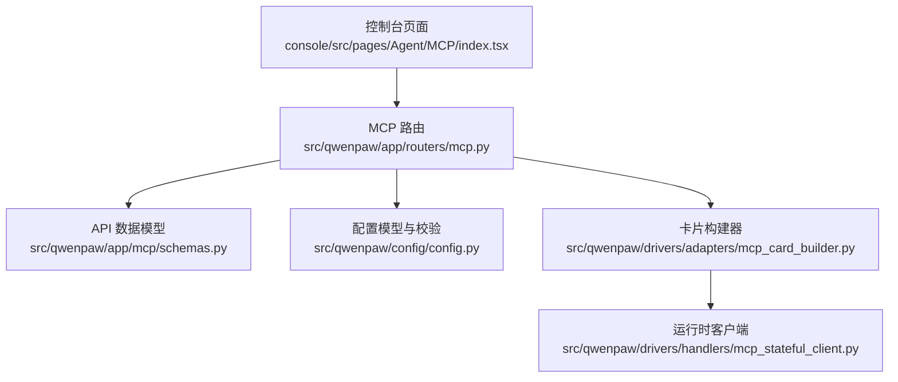
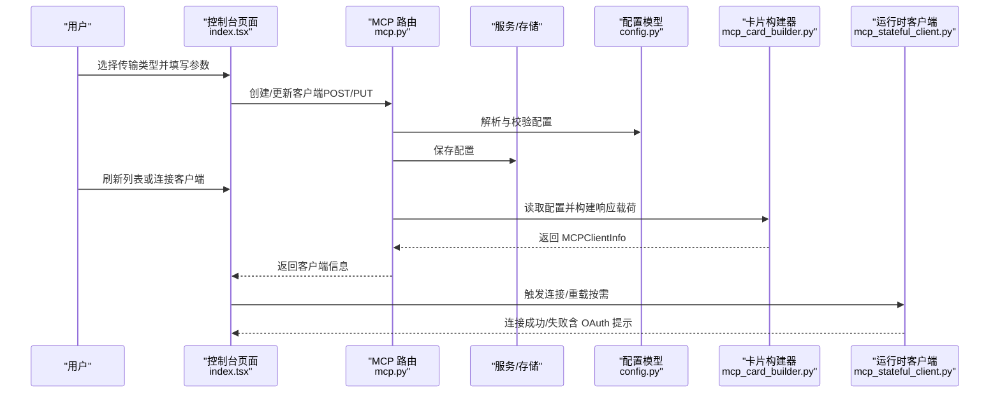
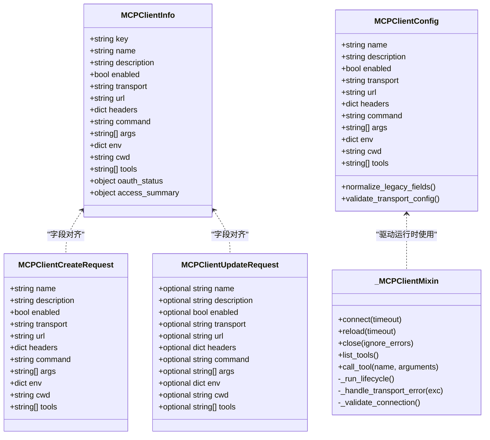
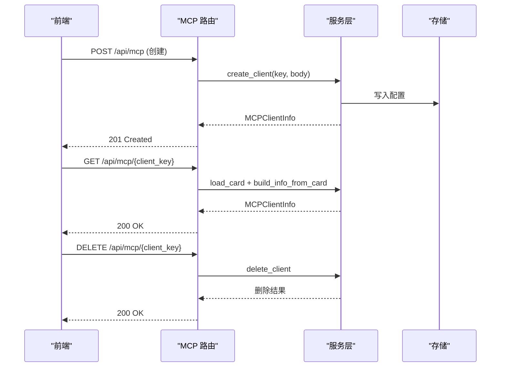
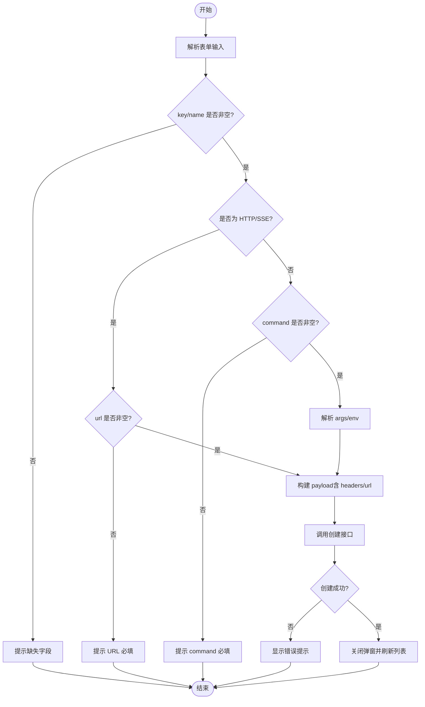
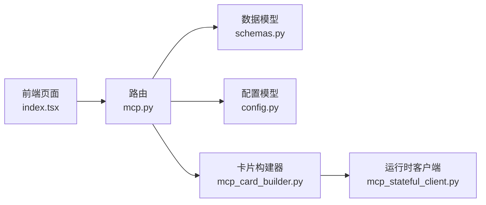

# MCP 客户端配置

<cite>
**本文引用的文件**   
- [src/qwenpaw/app/mcp/schemas.py](file://src/qwenpaw/app/mcp/schemas.py)
- [src/qwenpaw/config/config.py](file://src/qwenpaw/config/config.py)
- [src/qwenpaw/drivers/handlers/mcp_stateful_client.py](file://src/qwenpaw/drivers/handlers/mcp_stateful_client.py)
- [console/src/pages/Agent/MCP/index.tsx](file://console/src/pages/Agent/MCP/index.tsx)
- [src/qwenpaw/app/routers/mcp.py](file://src/qwenpaw/app/routers/mcp.py)
- [src/qwenpaw/drivers/adapters/mcp_card_builder.py](file://src/qwenpaw/drivers/adapters/mcp_card_builder.py)
</cite>

## 目录
1. [简介](#简介)
2. [项目结构](#项目结构)
3. [核心组件](#核心组件)
4. [架构总览](#架构总览)
5. [详细组件分析](#详细组件分析)
6. [依赖关系分析](#依赖关系分析)
7. [性能与可靠性](#性能与可靠性)
8. [故障排查指南](#故障排查指南)
9. [结论](#结论)
10. [附录：JSON 导入格式规范](#附录json-导入格式规范)

## 简介
本章节面向 QwenPaw 的 MCP（Model Context Protocol）客户端配置能力，系统性说明三种传输协议（stdio、streamable_http、sse）的配置方法与参数含义；梳理 JSON 导入支持的三种格式（标准格式、直接格式、单客户端格式）；详解表单配置界面字段与校验规则；并结合后端模型、路由与服务层实现，给出端到端的数据流与错误处理机制。文档既适合初学者快速上手，也为有经验的开发者提供足够的技术深度。

## 项目结构
MCP 客户端配置涉及前端控制台页面、后端 API 路由、Pydantic 数据模型、配置加载与校验、以及运行时客户端生命周期管理。下图展示了关键模块与交互关系。

图表来源
- [console/src/pages/Agent/MCP/index.tsx](file://console/src/pages/Agent/MCP/index.tsx)
- [src/qwenpaw/app/routers/mcp.py](file://src/qwenpaw/app/routers/mcp.py)
- [src/qwenpaw/app/mcp/schemas.py](file://src/qwenpaw/app/mcp/schemas.py)
- [src/qwenpaw/config/config.py](file://src/qwenpaw/config/config.py)
- [src/qwenpaw/drivers/adapters/mcp_card_builder.py](file://src/qwenpaw/drivers/adapters/mcp_card_builder.py)
- [src/qwenpaw/drivers/handlers/mcp_stateful_client.py](file://src/qwenpaw/drivers/handlers/mcp_stateful_client.py)

章节来源
- [console/src/pages/Agent/MCP/index.tsx](file://console/src/pages/Agent/MCP/index.tsx)
- [src/qwenpaw/app/routers/mcp.py](file://src/qwenpaw/app/routers/mcp.py)
- [src/qwenpaw/app/mcp/schemas.py](file://src/qwenpaw/app/mcp/schemas.py)
- [src/qwenpaw/config/config.py](file://src/qwenpaw/config/config.py)
- [src/qwenpaw/drivers/adapters/mcp_card_builder.py](file://src/qwenpaw/drivers/adapters/mcp_card_builder.py)
- [src/qwenpaw/drivers/handlers/mcp_stateful_client.py](file://src/qwenpaw/drivers/handlers/mcp_stateful_client.py)

## 核心组件
- 数据模型与请求体
  - MCPClientInfo：对外返回的客户端信息，包含 key、name、description、enabled、transport、url、headers、command、args、env、cwd、tools、oauth_status、access_summary 等字段。
  - MCPClientCreateRequest / MCPClientUpdateRequest：创建/更新客户端的请求体，字段与 Info 基本一致，但 Update 为可选字段。
- 配置模型与校验
  - MCPClientConfig：单个 MCP 客户端的配置模型，支持别名归一化（如 isActive→enabled、baseUrl→url、type→transport），并针对 transport 进行必填校验（stdio 必须 command，HTTP/SSE 必须 url）。
- 运行时客户端
  - _MCPClientMixin：统一的生命周期与工具调用逻辑，封装 connect/reload/close/list_tools/call_tool 等，内部通过子类实现具体传输（stdio/http/sse）的连接建立。
- 控制台表单与 JSON 导入
  - 前端页面提供“JSON 导入”和“表单创建”两种模式，支持三种传输类型选择，动态显示 URL/命令、环境变量等字段，并进行前端校验。

章节来源
- [src/qwenpaw/app/mcp/schemas.py](file://src/qwenpaw/app/mcp/schemas.py)
- [src/qwenpaw/config/config.py](file://src/qwenpaw/config/config.py)
- [src/qwenpaw/drivers/handlers/mcp_stateful_client.py](file://src/qwenpaw/drivers/handlers/mcp_stateful_client.py)
- [console/src/pages/Agent/MCP/index.tsx](file://console/src/pages/Agent/MCP/index.tsx)

## 架构总览
下图展示从前端到后端的完整流程：用户在前端选择传输类型并填写必要参数，提交后由路由接收并持久化，随后在需要时由运行时客户端根据配置建立连接并暴露工具。

图表来源
- [console/src/pages/Agent/MCP/index.tsx](file://console/src/pages/Agent/MCP/index.tsx)
- [src/qwenpaw/app/routers/mcp.py](file://src/qwenpaw/app/routers/mcp.py)
- [src/qwenpaw/config/config.py](file://src/qwenpaw/config/config.py)
- [src/qwenpaw/drivers/adapters/mcp_card_builder.py](file://src/qwenpaw/drivers/adapters/mcp_card_builder.py)
- [src/qwenpaw/drivers/handlers/mcp_stateful_client.py](file://src/qwenpaw/drivers/handlers/mcp_stateful_client.py)

## 详细组件分析

### 传输协议与参数说明
- stdio
  - 适用场景：本地进程式 MCP 服务器，通过命令行启动。
  - 必填参数：command（启动命令）、可选 args（参数数组）、可选 env（键值对环境变量）、可选 cwd（工作目录）。
  - 行为要点：运行时将作为子进程启动，断开后自动重建。
- streamable_http
  - 适用场景：基于 HTTP 的可流式 MCP 服务端点。
  - 必填参数：url（服务端点地址）、可选 headers（HTTP 头）。
  - 行为要点：使用异步 HTTP 客户端发起请求，支持超时与重连。
- sse
  - 适用场景：基于 Server-Sent Events 的流式连接。
  - 必填参数：url（SSE 端点）、可选 headers。
  - 行为要点：长连接事件流，具备独立的读超时控制。

章节来源
- [src/qwenpaw/app/mcp/schemas.py](file://src/qwenpaw/app/mcp/schemas.py)
- [src/qwenpaw/config/config.py](file://src/qwenpaw/config/config.py)
- [src/qwenpaw/drivers/handlers/mcp_stateful_client.py](file://src/qwenpaw/drivers/handlers/mcp_stateful_client.py)

### JSON 导入格式支持
控制台支持三种 JSON 导入格式，便于批量或快速添加客户端：
- 标准格式：{ "mcpServers": { "key": {...} } }
- 直接格式：{ "key": {...} }
- 单客户端格式：{ "key": "...", "name": "...", "command": "..." }

前端会解析 JSON，并将字段映射到内部数据结构，再逐个调用创建接口。

章节来源
- [console/src/pages/Agent/MCP/index.tsx](file://console/src/pages/Agent/MCP/index.tsx)

### 表单配置界面字段
- 客户端标识与名称
  - key：唯一标识（必填）
  - name：显示名称（必填）
- 描述
  - description：可选
- 传输类型
  - 选项：Streamable HTTP、SSE、Stdio
- 连接参数
  - 当选择 Streamable HTTP 或 SSE：显示 url（必填）
  - 当选择 Stdio：显示 command（必填）、args（可选）
- 环境变量
  - env：仅 Stdio 显示，按 KEY=VALUE 行输入
- 其他
  - cwd：可选（用于 stdio 的工作目录）

章节来源
- [console/src/pages/Agent/MCP/index.tsx](file://console/src/pages/Agent/MCP/index.tsx)

### 配置验证规则与错误处理
- 后端校验
  - 字段别名归一化：isActive→enabled、baseUrl→url、type→transport；若未显式指定 transport 且存在 url/baseUrl 且无 command，则默认推断为 streamable_http。
  - 传输必填校验：stdio 必须非空 command；HTTP/SSE 必须非空 url。
- 前端校验
  - key/name 必填；HTTP/SSE 的 url 必填；stdio 的 command 必填；args/env 解析容错。
- 运行时错误处理
  - 连接超时：connect 等待 ready 事件，超时抛出异常。
  - OAuth 需求：若服务端返回 401，标记需授权并在连接阶段抛出明确提示。
  - 传输错误：检测管道/HTTP 流异常，置为不连接状态并触发重新连接，避免死循环。

章节来源
- [src/qwenpaw/config/config.py](file://src/qwenpaw/config/config.py)
- [console/src/pages/Agent/MCP/index.tsx](file://console/src/pages/Agent/MCP/index.tsx)
- [src/qwenpaw/drivers/handlers/mcp_stateful_client.py](file://src/qwenpaw/drivers/handlers/mcp_stateful_client.py)

### 类与关系图（代码级）

图表来源
- [src/qwenpaw/app/mcp/schemas.py](file://src/qwenpaw/app/mcp/schemas.py)
- [src/qwenpaw/config/config.py](file://src/qwenpaw/config/config.py)
- [src/qwenpaw/drivers/handlers/mcp_stateful_client.py](file://src/qwenpaw/drivers/handlers/mcp_stateful_client.py)

### API 序列图（创建/获取/删除）

图表来源
- [src/qwenpaw/app/routers/mcp.py](file://src/qwenpaw/app/routers/mcp.py)

### 复杂逻辑流程图（表单创建）

图表来源
- [console/src/pages/Agent/MCP/index.tsx](file://console/src/pages/Agent/MCP/index.tsx)

## 依赖关系分析
- 前端依赖
  - 页面组件负责渲染表单与 JSON 编辑器，维护本地状态，执行前端校验，并调用后端 API。
- 后端依赖
  - 路由层接收请求，委托服务层完成配置读写；服务层使用 Pydantic 模型进行解析与校验；卡片构建器将内部配置转换为统一的 API 响应载荷。
- 运行时依赖
  - 运行时客户端根据配置中的 transport 选择具体连接方式，统一管理生命周期与错误恢复。

图表来源
- [console/src/pages/Agent/MCP/index.tsx](file://console/src/pages/Agent/MCP/index.tsx)
- [src/qwenpaw/app/routers/mcp.py](file://src/qwenpaw/app/routers/mcp.py)
- [src/qwenpaw/app/mcp/schemas.py](file://src/qwenpaw/app/mcp/schemas.py)
- [src/qwenpaw/config/config.py](file://src/qwenpaw/config/config.py)
- [src/qwenpaw/drivers/adapters/mcp_card_builder.py](file://src/qwenpaw/drivers/adapters/mcp_card_builder.py)
- [src/qwenpaw/drivers/handlers/mcp_stateful_client.py](file://src/qwenpaw/drivers/handlers/mcp_stateful_client.py)

## 性能与可靠性
- 连接与重连
  - 运行时客户端在生命周期任务中管理连接，遇到传输错误会主动置为不连接并触发重连，避免长时间不可用。
- 工具列表缓存
  - 在短暂断连窗口内，list_tools 可回退到上次成功的工具列表缓存，提升用户体验与稳定性。
- 超时控制
  - connect/reload 均支持超时参数，防止阻塞主流程。
- OAuth 鉴权
  - 检测到 401 时立即中断连接并提示用户在 UI 完成授权，避免无效重试。

[本节为通用指导，无需特定文件引用]

## 故障排查指南
- 常见错误与定位
  - 缺少必填字段：检查前端校验提示与后端模型校验（stdio 的 command、HTTP/SSE 的 url）。
  - 连接超时：确认网络可达性与服务端点正确性，适当增大超时时间。
  - OAuth 未授权：根据运行时抛出的 401 提示，在 UI 完成授权后再连接。
  - 传输错误：观察日志中关于管道/HTTP 流的异常，确认服务端是否稳定运行。
- 建议步骤
  - 先使用 JSON 导入最小可用配置进行连通性测试。
  - 逐步增加环境变量与头部参数，定位敏感配置问题。
  - 查看运行时日志，关注连接/重载/错误处理路径。

章节来源
- [src/qwenpaw/config/config.py](file://src/qwenpaw/config/config.py)
- [src/qwenpaw/drivers/handlers/mcp_stateful_client.py](file://src/qwenpaw/drivers/handlers/mcp_stateful_client.py)
- [console/src/pages/Agent/MCP/index.tsx](file://console/src/pages/Agent/MCP/index.tsx)

## 结论
QwenPaw 的 MCP 客户端配置体系以清晰的 Pydantic 模型为基础，结合前端友好的表单与 JSON 导入，覆盖本地进程、HTTP 远程与 SSE 流式等多种部署形态。后端在配置解析、字段归一化与必填校验方面提供了稳健保障，运行时客户端则在连接管理与错误恢复上实现了高可用性。通过本文档，读者可以快速完成不同传输类型的配置，并在遇到问题时高效定位与修复。

[本节为总结，无需特定文件引用]

## 附录：JSON 导入格式规范
- 标准格式
  - 结构：{ "mcpServers": { "key": {...} } }
  - 用途：批量导入多个客户端，每个 key 对应一个客户端对象。
- 直接格式
  - 结构：{ "key": {...} }
  - 用途：一次性导入单个或多客户端（顶层键即为 key）。
- 单客户端格式
  - 结构：{ "key": "...", "name": "...", "command": "..." }
  - 用途：快速定义单个客户端，兼容部分第三方示例字段。

字段映射与兼容性
- 字段别名：isActive→enabled、baseUrl→url、type→transport。
- 传输推断：若未指定 transport 且存在 url/baseUrl 且无 command，则默认为 streamable_http。
- 传输别名：streamable-http/streamablehttp/http 均归一化为 streamable_http。

章节来源
- [console/src/pages/Agent/MCP/index.tsx](file://console/src/pages/Agent/MCP/index.tsx)
- [src/qwenpaw/config/config.py](file://src/qwenpaw/config/config.py)